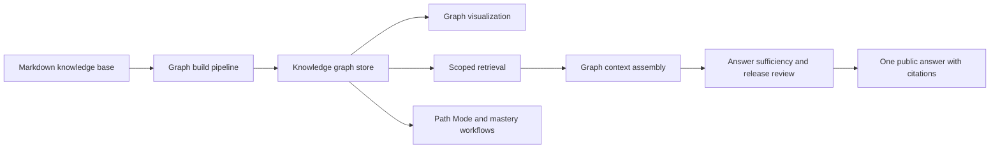

# NoteConnection

<div align="center">


[](https://www.npmjs.com/package/noteconnection)
[](LICENSE)
[](https://github.com/Jacobinwwey/NoteConnection/releases/latest)
[](https://jacobinwwey.github.io/NoteConnection/)

**A local-first knowledge graph, learning workspace, and RAG runtime for Markdown knowledge bases.**

[中文 README](README_zh.md) | [Quick Start](#quick-start) | [Feature Tour](#feature-tour) | [Architecture](#architecture) | [CLI](#cli-reference) | [Documentation](#documentation) | [Acknowledgments](#acknowledgments)

</div>

## What It Is

> **Unlock the structure of your knowledge.**

NoteConnection is a high-performance standalone system that transforms unstructured Markdown knowledge bases into directed knowledge graphs, learning paths, and grounded answers.

Unlike traditional network views that show a dense web of links, NoteConnection focuses on **hierarchy**, **learning paths**, **dependency structure**, and **source-grounded exploration**. It is designed for large local knowledge bases, works independently of any specific note-taking app, and now ships as a browser/server runtime, Tauri desktop app, Godot Path Mode renderer, and Tauri Android build.


## Homepage Guide

| Need | Start here |
|---|---|
| Install or run the app | [Quick Start](#quick-start) |
| Understand the main product surfaces | [Three Ways to Use NoteConnection](#three-ways-to-use-noteconnection) |
| See the restored detailed feature walkthrough | [Feature Tour](#feature-tour) |
| Understand the code owners and runtime flow | [Architecture](#architecture) |
| Configure a knowledge base | [Configuration](#configuration) |
| Use the command line | [CLI Reference](#cli-reference) |
| Read long-form docs | [Documentation](#documentation) |
| Check recent releases | [Release Notes](#release-notes) |

## Current Architecture Snapshot

This README is intentionally **not** the mainline architecture ledger. The previous dated architecture-status blocks were removed from the front page so the README stays useful as a product and contributor entry point.

Current state in brief:

- **Knowledge Workspace** uses scoped retrieval, grouped knowledge hits, right-pane source focus, matched-span highlighting, conversation status visibility, and graph-aware answer composition.
- **RAG path** is TypeScript-native: retrieval, bounded graph context assembly, sufficiency/release review, citations, memory actions, and public-answer contraction stay inside the local runtime.
- **Graph substrate** is real code: `KnowledgeAtom`, `RelationEdge`, `TemporalEdge`, path queries, mastery paths, session state, and export bundles are part of the implementation.
- **Compatibility** is preserved through legacy `assistantMessage`, typed `assistantBlocks`, `app_config.toml` migration, Markdown reader fallback, and runtime-first packaging.
- **Architecture pressure** remains in large owners such as `src/server.ts`, `src/learning/KnowledgeLearningPlatform.ts`, `src/frontend/workspace_panes.js`, and `src/frontend/agent_workspace.js`. Future work should extract around real invariants, not import another broad orchestration framework.
- **Coverage-driven graph answers** now use a typed `GraphAnswerPlan` and required-claim coverage review. Anchor spans, evidenced graph neighbors, relation edges, and omissions survive into response traces, knowledge-run artifacts, and export reports; public answers are no longer governed by a 900-character or six-sentence ceiling.
- **Public evidence shaping** removes source authoring instructions, Markdown table scaffolding, and fenced renderer payloads without reducing semantic coverage. This is a content-quality boundary, not a length contraction mechanism.
- **Coverage calibration and bounded expansion** now add polarity-aware multilingual claim matching, a versioned 24-case calibration corpus, novelty-aware claim ordering, and a replayable one-step graph expansion policy restricted to explicit deep/research requests. The Grounding Inspector exposes compact plan/coverage diagnostics without leaking planning scaffolding into the public answer.
- **Graph-answer ownership is now explicit**: `graphContextAssembler.ts` selects the bounded subgraph, `graphAnswerPlan.ts` plans evidenced claims, `conversationComposer.ts` realizes them, and `answerReleaseReview.ts` enforces final grounding and coverage. Shared graph-window facts live in `graphAnswerFacts.ts`; this removes composer/reviewer policy drift without introducing another orchestration layer.

Detailed progress tracking belongs in:

- [Development Progress Dashboard](docs/diataxis/en/explanation/development-progress-dashboard.md)
- [Agent Knowledge Workspace Graph Preview and Review Closure](docs/solutions/agent-knowledge-workspace-graph-preview-and-review-closure-2026-06-20.md)
- [Knowledge Workspace and DAG Alignment Plan](docs/solutions/knowledge-workspace-dag-alignment-2026-06-10.md)
- [Coverage-driven Graph Answer Planning](docs/plans/2026-07-11-coverage-driven-graph-answer-planning.md)

## Quick Start

### Desktop system dependencies

| Platform | Required dependencies |
|---|---|
| **Linux** | `libwebkit2gtk-4.1-dev`, `libgtk-3-dev`, `libsoup3.0`, `libjavascriptcoregtk-4.1-0` (Ubuntu/Debian: `sudo apt install libwebkit2gtk-4.1-dev libgtk-3-dev libsoup-3.0-dev patchelf`) |
| **macOS** | No additional dependencies; system WebKit is included |
| **Windows** | [Edge WebView2 Runtime](https://developer.microsoft.com/microsoft-edge/webview2/) (pre-installed on Windows 11; Windows 10 may need manual install) |

> **Linux Wayland users**: Godot Path Mode requires `GDK_BACKEND=x11` on pure Wayland compositors. The launcher sets this automatically when `XDG_SESSION_TYPE=wayland` is detected.

### Option 1: install a desktop release

Download the latest installer or package from [Releases](https://github.com/Jacobinwwey/NoteConnection/releases/latest).

Release assets currently include Windows installers, macOS DMG, Linux AppImage/deb, and Android APK.

### Option 2: run from npm

```bash
npx noteconnection
```

### Option 3: install globally

```bash
npm install -g noteconnection
noteconnection
```

### Option 4: develop locally

```bash
git clone https://github.com/Jacobinwwey/NoteConnection.git
cd NoteConnection
npm install
npm start
```

The development server runs at `http://localhost:3000`.

For GPU-enabled Tauri development on Windows:

```bash
npm run tauri:dev:mini:gpu
```

Use that script instead of appending `--gpu` to another npm command.

### Option 5: Android

NoteConnection supports Android through **Tauri Android**. The older Capacitor APK path is deprecated and retained only as historical reference.

Prerequisites:

- Node.js LTS
- Java JDK 21 or newer
- Android SDK configured through `ANDROID_HOME` or Android Studio

```bash
npm run tauri:android:init
npm run tauri:android:dev
npm run tauri:android:build
```

For a universal APK:

```bash
npm run tauri:android:build:universal
```

## Three Ways to Use NoteConnection

### 1. Knowledge Graph Workspace

Load a Markdown folder, build a graph, switch between force-directed and DAG views, inspect focus neighborhoods, and open matching source documents.

Basic workflow:

1. Choose a folder from `Knowledge_Base` or configure your own vault path.
2. Click **Load**.
3. Use DAG layout for hierarchy, force-directed layout for clusters, and Canvas for large graphs.
4. Click a node to enter Focus Mode and inspect its context.

### 2. Knowledge Workspace RAG

Ask scoped questions against the current knowledge base. The answer path uses grouped knowledge points, citations, graph context, sufficiency checks, and release review while keeping the public response to one user-facing answer.

The current implementation is designed around **RSE-style evidence shaping** and **document augmentation**: matched nodes are not treated as isolated snippets; they can be enriched by bounded neighboring context, source spans, graph paths, and review gates before an answer is released.

### 3. Path Mode and Guided Learning

Generate structured learning paths from graph topology. Path Mode can run through the web UI and through the Godot desktop renderer via `PathBridge` on `ws://localhost:9876`.

## Why A Knowledge Graph?

Plain keyword search retrieves documents. NoteConnection tries to expose structure:

- prerequisite and successor relationships;
- relation paths between concepts;
- temporal and scoped evidence;
- focus neighborhoods around a selected node;
- learning routes reusable by the UI and agent workflows.

This makes the graph useful both for visual exploration and for grounded answer construction.

## Feature Tour

### 1. Visualization and layout

- **Structure over chaos**: Switch between **Force-Directed** physics and **DAG** hierarchical layouts. The DAG layout identifies prerequisites and next steps so concepts are arranged in logical layers.
- **Dual rendering engine**: Switch between **SVG** for high-fidelity interaction and **Canvas** for large graphs with 10,000+ nodes.
- **Interactive Focus Mode**: Click a node to isolate it and its context. Focus Mode supports freeze-on-select behavior, adjustable vertical/horizontal spacing, stable exit behavior, and random focus discovery.
- **Offline-first assets**: D3, KaTeX, Marked, Mermaid, JSZip, and related frontend libraries are served from local assets so the core graph reader remains usable without internet access.


### 2. Intelligence and inference

- **Hybrid inference engine**: Combines statistical probability (`P(A|B)`) and vector similarity (TF-IDF) to infer hidden dependencies without requiring external AI APIs.
- **Scalable clustering**: Aggregates thousands of nodes into high-level concept bubbles based on folder structure or tags.
- **Graph-aware retrieval**: Knowledge Workspace ranking can use local hybrid signals, vector signals, bounded graph distance, path confidence, temporal invalidity, and relation intent.


### 3. Path Mode: structured learning

- **Curriculum generation**: Transform a graph into a linear learning path.
- **Domain learning**: Master an entire concept cluster through topological ordering.
- **Diffusion learning**: Find an efficient path toward a specific target using shortest-path and prerequisite context.
- **Hybrid rendering**: Connect the TypeScript graph runtime to a Godot 4.3 desktop renderer through WebSocket while retaining web compatibility.
- **Learning strategies**: Choose foundational/base-first or core/importance-first sorting based on learning style.

### 4. Performance and control

- **Parallel processing**: Uses Node.js `worker_threads` to distribute keyword matching and graph-related heavy work.
- **Simulation controls**: Speed/damping sliders and freeze-layout controls keep large graph views inspectable.
- **Hover lock**: Hovering over a node temporarily locks its position so connections can be inspected without drift.

### 5. NoteMD AI Document Workbench

- **Integrated NoteMD module**: `src/notemd/*` provides an Obsidian-decoupled processing stack: LLM provider abstraction, prompt manager, batch/file processors, translation, Mermaid/formula fixers, and duplicate detection.
- **One-Click Extract workflow**: The embedded NoteMD window can chain concept extraction, title-based batch generation, and batch Mermaid repair. Generated files land in a KB subfolder named after the source file.
- **TOML-backed API profile**: Embedded NoteMD reads and writes API settings through `app_config.toml` under `[notemd]` and `[notemd.api]`.
- **CLI compatibility**: Core workflows are available through `noteconnection notemd ...`, including `settings show`, `settings set-api`, `one-click-extract`, `batch-generate`, `batch-mermaid-fix`, and `fix-mermaid`.
- **API surface**: `/api/notemd/*` covers settings, file/folder processing, workflow orchestration, translation, content generation, concept extraction, duplicate checks, and cancellation.
- **Desktop and bridge access**: Tauri menu/IPC and bridge routing open NoteMD from web/Tauri/Godot-connected workflows.
- **Safety defaults**: File operations are constrained by KB-root sandbox checks, with SSE progress and cancellation support for long-running work.


## Architecture



Core owners:

| Layer | Main paths | Responsibility |
|---|---|---|
| Server and routes | `src/server.ts`, `src/routes/` | HTTP API, static serving, diagnostics, modular route dispatch |
| Graph core | `src/core/`, `src/backend/` | graph construction, layout/path engines, workers, bridge contracts |
| Learning runtime | `src/learning/` | scoped retrieval, conversation, graph context, mastery, quality, memory policy |
| Frontend workspace | `src/frontend/` | graph UI, Knowledge Workspace panes, source focus, runtime bridge |
| Desktop/mobile shell | `src-tauri/`, `path_mode/` | Tauri packaging, sidecars, Godot Path Mode, Android runtime |
| Documentation | `docs/` | Diataxis docs, release notes, bilingual guides, architecture records |

### Backend

- `GraphBuilder` manages the pipeline from file reading to graph construction.
- Worker threads offload keyword matching and text analysis so the main thread stays responsive.
- `StatisticalAnalyzer`, `VectorSpace`, and `HybridEngine` combine co-occurrence, TF-IDF, cosine similarity, and directed edge inference.

### Frontend

- D3/SVG handles high-fidelity interaction.
- Canvas handles large graph rendering.
- Web workers keep path/layout work off the UI thread.
- Knowledge Workspace panes keep source focus, evidence rendering, learning paths, and graph previews in one workspace.

### Desktop bridge

- `PathBridge` exposes internal graph state over WebSocket (`ws://localhost:9876`).
- Godot Path Mode acts as a renderer and interaction surface; heavy graph logic remains in the TypeScript runtime.
- Godot paths must keep PNG/materialized render boundaries and avoid direct SVG assumptions.

## CLI Reference

```bash
npm start -- --path "<path_to_knowledge_base>" [options]
```

| Option | Description | Default |
|---|---|---|
| `--path` | Absolute path to the folder containing Markdown files | `Knowledge_Base` |
| `--gpu` | Enable GPU/WebGL acceleration for layout and vector calculations | auto when supported |
| `--no-gpu` | Disable GPU acceleration and force CPU | `false` |
| `--static` | Enable backend-only static mode with frozen frontend layout | `false` |
| `--workers` | Worker thread count | `numCPUs - 1` |

Examples:

```bash
npm start -- --path "C:/Users/MyName/Documents/MyNotes"
npm start -- --path "E:/Knowledge/ObsidianVault" --gpu
npm start -- --path "E:/Knowledge/ObsidianVault" --no-gpu
```

CLI runs generate unique data files such as `data_cli_{kb_name}_{time}.js` to preserve the original `data.js`. When the server starts, it automatically serves those files to the frontend.

## Configuration

Runtime configuration is stored in `app_config.toml`.

Default Windows path:

```text
%LOCALAPPDATA%/NoteConnection/app_config.toml
```

Minimal example:

```toml
knowledge_base_path = "E:/Knowledge_project/NoteConnection_app/Knowledge_Base"
user_language = "en"

[multi_window]
single_window_mode = true
hide_tauri_when_pathmode_opens = true
restore_tauri_when_pathmode_exits = true
confirm_before_full_shutdown_from_godot = true
sync_language = true

[frontend_settings.reading]
mode = "window"
markdown_engine = "auto" # "legacy" | "pulldown" | "auto"
chunk_block_size = 36
prefetch_blocks = 8
index_cache_ttl_sec = 1800
max_doc_bytes = 100663296
```

More configuration details:

- [English app_config guide](docs/en/app_config.toml_guide.md)
- [Config template](docs/examples/app_config.template.toml)

## Markdown Reader Protocol

- `markdown_engine = "auto"` prefers `pulldown-cmark` and falls back to the legacy renderer on failure.
- Tauri reader and Godot reader consume the same sidecar Markdown protocol: `index`, `chunk`, `resolve-node`, and `resolve-wiki`.
- Large files are loaded incrementally instead of requiring one full Markdown payload.
- Mermaid fences must start on their own line. Use `npm run verify:markdown:mermaid:fence -- Knowledge_Base/testconcept` before release-sensitive changes.

## Build And Test

```bash
npm install
npm run build
npm run build:vite
npm test
npm run docs:diataxis:check
npm run docs:site:build
```

Desktop and mobile builds:

```bash
npm run tauri:dev
npm run tauri:build
npm run tauri:android:init
npm run tauri:android:dev
npm run tauri:android:build
```

Build notes:

- Electron desktop packaging was removed on 2026-03-01.
- `npm run tauri:build` is the default desktop package path.
- `npm run tauri:build:full` is explicit opt-in for packaging generated graph assets.
- `npm run verify:lfs:policy`, `npm run verify:sidecar:supply`, and SBOM gates protect release packaging.

## Documentation

- Documentation hub: [docs/index.md](docs/index.md)
- Chinese README: [README_zh.md](README_zh.md)
- English docs mirror: [docs/en/README.md](docs/en/README.md)
- Chinese docs mirror: [docs/zh/README.md](docs/zh/README.md)
- User manual: [docs/en/User_Manual.md](docs/en/User_Manual.md) / [docs/zh/User_Manual.md](docs/zh/User_Manual.md)
- Interface document: [docs/en/Interface Document.md](<docs/en/Interface Document.md>) / [docs/zh/Interface Document.md](<docs/zh/Interface Document.md>)
- Release notes: [docs/release_notes_v1.8.0.md](docs/release_notes_v1.8.0.md)
- GitHub Pages docs: [jacobinwwey.github.io/NoteConnection](https://jacobinwwey.github.io/NoteConnection/)

## Security And Privacy

- Graph building and local retrieval run on the user's machine.
- LLM-backed features use user-configured providers and should be treated as optional runtime integrations.
- Do not commit local vaults, `app_config.toml`, provider keys, generated private evidence, or machine-specific sidecar overrides.
- Release workflows include SBOM, sidecar, LFS, migration, docs, mobile, and runtime evidence gates.

## Release Notes

README keeps only a compact release summary. Full release history belongs in [GitHub Releases](https://github.com/Jacobinwwey/NoteConnection/releases) and `docs/release_notes_*.md`.

Recent releases:

- **v1.8.0** - Knowledge Workspace RSE/document-augmented RAG, graph-conditioned answer composition, Agent Workspace UI/status improvements, runtime probes, release governance, and multi-platform assets.
- **v1.7.0** - Startup acceleration closure, multi-platform validation, and learning roadmap foundation.
- **v1.6.7** - Docs governance cleanup and GitHub Pages stabilization.
- **v1.6.6** - Unified provider runtime and TOML settings consolidation.

## Acknowledgments

NoteConnection has benefited from many open-source projects and local reference mirrors. These acknowledgments mean design influence, implementation reference, runtime dependency, or tooling inspiration depending on the project; they do not imply endorsement by the listed maintainers.

- [GitNexus](https://github.com/abhigyanpatwari/GitNexus) - README information architecture, repo context, staleness, and agent-consumable knowledge graph ideas.
- [obsidian-NotEMD](https://github.com/Jacobinwwey/obsidian-NotEMD) - NoteMD workflows, provider settings, and Markdown enhancement UX.
- [Obsidian Smart Connections](https://github.com/brianpetro/obsidian-smart-connections) - vault-aware semantic retrieval and local knowledge interaction patterns.
- [DeepTutor](https://github.com/HKUDS/DeepTutor) - tutor/workspace concepts and agent-native learning product references.
- [AnythingLLM](https://github.com/Mintplex-Labs/anything-llm) - local RAG workspace and document-chat product references.
- [Cherry Studio](https://github.com/CherryHQ/cherry-studio) - desktop AI workspace, provider configuration, and user-facing model operations.
- [Fast-GraphRAG](https://github.com/circlemind-ai/fast-graphrag) - graph-RAG ingestion/query design input.
- [Graphiti](https://github.com/getzep/graphiti) - temporal knowledge graph and evolving context design input.
- [Neo4j GraphRAG Python](https://github.com/neo4j/neo4j-graphrag-python) - graph-backed retrieval and explainable query contracts.
- [OpenAI Codex](https://github.com/openai/codex) - agent workspace, local execution, and tool-bound development workflow references.
- [enterprise_agent_platform](https://github.com/datagallery-lab/enterprise_agent_platform) - enterprise agent runtime and pipeline separation references.
- [AhaDiff](https://github.com/AGI-is-going-to-arrive/ahadiff) - diff learning, review, and repository intelligence references.
- [DSPy](https://github.com/stanfordnlp/dspy) - typed LM programs, evaluation, and optimizer-loop design ideas.
- [Guidance](https://github.com/guidance-ai/guidance) - constrained generation and structured output contract ideas.
- [Semantic Kernel](https://github.com/microsoft/semantic-kernel) - plugin/orchestration boundary references.
- [LangChain](https://github.com/langchain-ai/langchain) - orchestration, tool, and evaluation surface references.
- [LiteLLM](https://github.com/BerriAI/litellm) - provider routing and gateway design references.
- [Tauri](https://github.com/tauri-apps/tauri) - desktop and Android application shell.
- [Godot Engine](https://github.com/godotengine/godot) - Path Mode renderer foundation.
- [Readest](https://github.com/readest/readest) - cross-platform reader and Tauri product references.
- [Lorien](https://github.com/mbrlabs/Lorien) - Godot canvas/whiteboard interaction reference.
- [D3](https://github.com/d3/d3), [Mermaid](https://github.com/mermaid-js/mermaid), [KaTeX](https://github.com/KaTeX/KaTeX), [Marked](https://github.com/markedjs/marked), and [JSZip](https://github.com/Stuk/jszip) - frontend rendering and document-processing foundations.

## License

This project is licensed under the [GNU General Public License v3.0](LICENSE) (`GPL-3.0-only`).

## 2026-07-19 v1.8.0 Graph Answer Planning Correction

The graph-answer pipeline is now executable end to end in both RAG and non-RAG conversations. The earlier implementation built and exported `GraphAnswerPlan`, but the RAG composer returned before consuming it; release diagnostics therefore overstated actual graph use. `conversationComposer.ts` now realizes ordered required claims first and uses ranked RAG clauses as bounded supplemental evidence.

Distinct high-confidence claims are required by information value after semantic deduplication, not by a one-claim-per-role quota. Public claim statements are shaped before planning so authoring instructions, table scaffolding, and renderer payloads cannot become mandatory answer content. Release revision preserves the ordered required plan instead of replacing it with a shorter answer, and runtime acceptance verifies final required-ID coverage and claim order.

Coverage remains deterministic concept, polarity, and normalized-text matching; it is not semantic entailment. Clause-level evidence shaping now segments dense fragments, ranks complete clauses, and preserves the raw fragment as provenance. The remaining calibration problem is multilingual: source-quality and semantic-dedup thresholds need a versioned readability/coverage corpus rather than character or sentence ceilings.

## 2026-07-19 v1.8.0 Final Architecture and Progress Audit

The current `main` implementation satisfies the completed Scheme B / Coverage-driven requirements: the graph plan executes in both RAG and non-RAG paths, distinct same-role claims remain coverable, release revision preserves required claim order, bounded graph expansion is restricted to explicit deep/research intent, and final runtime acceptance checks required claim IDs rather than answer length. The legacy gate name `public_surface_contraction` remains for compatibility, but it no longer imposes a 900-character or sentence-count ceiling.

The code-humanizer follow-up consolidated graph-window fact selection and NoteMD no-op progress reporters, then removed backend comments that only narrated code. The source-quality phase added deterministic clause segmentation/scoring, clause-local filtering, supplemental semantic deduplication, and release-safe duplicate removal. The latest verified baseline is 124/124 Jest suites, 1,155 tests passed, 26 skipped; TypeScript, production/Vite build, strengthened Water Glass runtime acceptance, Diataxis, MkDocs, and diff hygiene pass.

One calibration direction and one decision gate remain. Multilingual source-quality, semantic-dedup, and readability thresholds need joint regression evidence so fluency improves without losing required graph claims or provenance. Answer-planning orchestration should leave `KnowledgeLearningPlatform.ts` only when a new owner can perform the complete planned/reviewed-answer operation and reduce caller knowledge; this is not an unfinished phase, and a pass-through extraction would be architectural churn rather than progress.
