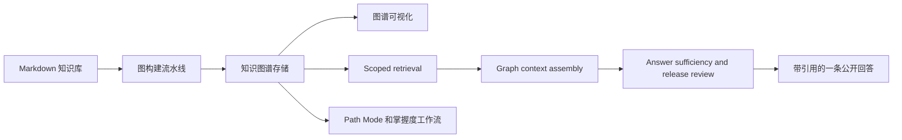

# NoteConnection

<div align="center">


[](https://www.npmjs.com/package/noteconnection)
[](LICENSE)
[](https://github.com/Jacobinwwey/NoteConnection/releases/latest)
[](https://jacobinwwey.github.io/NoteConnection/)

**面向 Markdown 知识库的本地优先知识图谱、学习工作区与 RAG 运行时。**

[English README](README.md) | [快速开始](#快速开始) | [功能导览](#功能导览) | [架构](#架构) | [CLI](#cli-使用) | [文档](#文档) | [致谢](#acknowledgments--致谢)

</div>

## 项目定位

> **解锁你知识库的深层结构。**

NoteConnection 是一个高性能独立系统，会把非结构化 Markdown 知识库转化为有向知识图谱、学习路径和有依据的回答。

与只展示密集链接网的传统“网络视图”不同，NoteConnection 更关注**层级关系**、**学习路径**、**依赖结构**和**可回溯原文的探索体验**。它面向大型本地知识库，独立于具体笔记软件运行，并已覆盖浏览器/服务器运行时、Tauri 桌面、Godot Path Mode 渲染器和 Tauri Android 构建路径。


## 首页导览

| 需要了解 | 从这里开始 |
|---|---|
| 安装或运行应用 | [快速开始](#快速开始) |
| 理解主要产品入口 | [三种主要使用方式](#三种主要使用方式) |
| 查看恢复后的详细图文功能讲解 | [功能导览](#功能导览) |
| 理解代码 owner 与运行流 | [架构](#架构) |
| 配置知识库 | [配置](#配置) |
| 使用命令行 | [CLI 使用](#cli-使用) |
| 阅读完整文档 | [文档](#文档) |
| 查看近期版本 | [发布说明](#发布说明) |

## 当前架构摘要

README 不再作为主线架构状态流水账。此前堆叠在首页的多段架构状态快照已移出首页，避免文档入口被进度快照污染。

当前状态概括如下：

- **知识工作区** 已具备 scoped retrieval、按知识点聚合的命中、右侧原文聚焦、命中段落高亮、conversation 状态可见性，以及 graph-aware answer composition。
- **RAG 路径** 保持 TypeScript-native：retrieval、有界 graph context assembly、sufficiency/release review、citation、memory action 和公开回答收缩都在本地运行时内完成。
- **图底座** 不是占位概念：`KnowledgeAtom`、`RelationEdge`、`TemporalEdge`、path query、mastery path、session state 和 export bundle 都已落地。
- **向前兼容** 通过 legacy `assistantMessage`、typed `assistantBlocks`、`app_config.toml` 迁移、Markdown reader fallback 和 runtime-first packaging 保持。
- **架构压力** 仍集中在 `src/server.ts`、`src/learning/KnowledgeLearningPlatform.ts`、`src/frontend/workspace_panes.js` 和 `src/frontend/agent_workspace.js` 等大 owner。后续应围绕真实不变量做窄提取，而不是继续导入新的编排框架。

详细进展见：

- [开发进度看板](docs/diataxis/zh/explanation/development-progress-dashboard.md)
- [Agent 知识工作区图预览与回答审核收口](docs/solutions/agent-knowledge-workspace-graph-preview-and-review-closure-2026-06-20.md)
- [知识工作区与 DAG 对齐推进方案](docs/solutions/knowledge-workspace-dag-alignment-2026-06-10.md)

### 2026-07-11 Coverage-driven 图回答更新

- 回答链路现在使用带类型的 `GraphAnswerPlan` 与 required-claim coverage review。
- 锚点 span、有证据的图邻居、关系边与 omission 会进入 response trace、knowledge-run artifact 和 export report。
- 公开回答不再受 900 字符或六句硬上限控制。
- Public-evidence shaping 会移除 authoring instruction、Markdown 表格脚手架和 fenced renderer payload，而不会降低语义 coverage。
- 多语言 claim matcher 现在会检查语义概念与否定极性，并由覆盖六类意图的 24-case 校准语料约束。
- Claim 会按信息依赖与新颖性排序；只有显式 deep/research 请求才能启用固定一步、最多八个邻居的图扩展。
- Grounding Inspector 会展示紧凑的 plan、coverage 与 expansion 诊断，但不会把内部规划脚手架写进公开回答。
- 详细架构与推进记录见 [Coverage-driven Graph Answer Planning](docs/plans/2026-07-11-coverage-driven-graph-answer-planning.md)。

## 快速开始

### 桌面系统依赖

| 平台 | 必要依赖 |
|---|---|
| **Linux** | `libwebkit2gtk-4.1-dev`、`libgtk-3-dev`、`libsoup3.0`、`libjavascriptcoregtk-4.1-0`（Ubuntu/Debian: `sudo apt install libwebkit2gtk-4.1-dev libgtk-3-dev libsoup-3.0-dev patchelf`） |
| **macOS** | 无需额外依赖，系统内置 WebKit |
| **Windows** | [Edge WebView2 Runtime](https://developer.microsoft.com/microsoft-edge/webview2/)（Windows 11 预装；Windows 10 可能需要手动安装） |

> **Linux Wayland 用户**：Godot Path Mode 在纯 Wayland 合成器上需要 `GDK_BACKEND=x11`。启动器检测到 `XDG_SESSION_TYPE=wayland` 时会自动设置。

### 选项 1：安装桌面版

从 [Releases](https://github.com/Jacobinwwey/NoteConnection/releases/latest) 下载最新安装包。

当前发布资产包括 Windows 安装包、macOS DMG、Linux AppImage/deb 和 Android APK。

### 选项 2：通过 npm 运行

```bash
npx noteconnection
```

### 选项 3：全局安装

```bash
npm install -g noteconnection
noteconnection
```

### 选项 4：本地开发

```bash
git clone https://github.com/Jacobinwwey/NoteConnection.git
cd NoteConnection
npm install
npm start
```

开发服务器地址为 `http://localhost:3000`。

Windows 下推荐的 GPU Tauri 开发命令：

```bash
npm run tauri:dev:mini:gpu
```

不要把 `--gpu` 直接追加到其他 npm 命令后面。

### 选项 5：Android

NoteConnection 通过 **Tauri Android** 支持 Android。旧 Capacitor APK 路径已废弃，仅保留作为历史参考。

先决条件：

- Node.js LTS
- Java JDK 21 或更高版本
- 通过 `ANDROID_HOME` 或 Android Studio 配置 Android SDK

```bash
npm run tauri:android:init
npm run tauri:android:dev
npm run tauri:android:build
```

构建通用 APK：

```bash
npm run tauri:android:build:universal
```

## 三种主要使用方式

### 1. 知识图谱工作区

载入 Markdown 文件夹，构建图谱，在 force-directed 与 DAG 视图之间切换，检查聚焦邻域，并打开对应原文。

基础流程：

1. 从 `Knowledge_Base` 选择文件夹，或配置自己的 vault 路径。
2. 点击 **Load**。
3. 用 DAG 布局查看层级，用 force-directed 布局查看聚类，大图使用 Canvas。
4. 点击节点进入 Focus Mode 并检查上下文。

### 2. 知识工作区 RAG

在当前知识库 scope 内提问。回答链路会使用按知识点聚合的命中、citation、图上下文、充分性检查和 release review，同时前台只给用户一条整理后的回答。

当前实现围绕 **RSE 风格证据组织** 与 **document augmentation** 设计：命中节点不会被当作孤立片段，而是可以在回答释放前被有界邻域、原文 span、graph path 和 review gate 增强。

### 3. Path Mode 与引导式学习

基于图拓扑生成结构化学习路径。Path Mode 可通过 Web UI 使用，也可通过 `ws://localhost:9876` 上的 `PathBridge` 交给 Godot 桌面渲染器。

## 为什么需要知识图谱

普通关键词搜索返回文档。NoteConnection 试图暴露结构：

- 前置与后继关系；
- 概念之间的 relation path；
- 时间和 scope 约束下的证据；
- 围绕选中节点的聚焦邻域；
- 可被 UI 和 agent workflow 复用的学习路线。

因此图谱既能用于视觉探索，也能用于构建有依据的回答。

## 功能导览

### 1. 可视化与布局

- **结构优于混沌**：在 **Force-Directed** 物理布局与 **DAG** 层级布局之间切换。DAG 布局会识别前置依赖和后续步骤，把概念按逻辑层级排列。
- **双渲染引擎**：在适合高保真交互的 **SVG** 与适合 10,000+ 节点大图的 **Canvas** 之间切换。
- **交互式专注模式**：点击任意节点以隔离它及其上下文。Focus Mode 支持选中冻结、可调垂直/水平间距、稳定退出和随机聚焦发现。
- **离线优先资源**：D3、KaTeX、Marked、Mermaid、JSZip 等前端库均使用本地资产，核心图谱阅读能力不依赖网络。


### 2. 智能与推断

- **混合推断引擎**：结合统计概率（`P(A|B)`）与向量相似度（TF-IDF）推断隐藏依赖，不强制依赖外部 AI API。
- **可扩展聚类**：基于文件夹结构或标签，将数千个节点聚合为高级“概念气泡”。
- **图感知检索**：知识工作区排序可使用 local hybrid、vector、有界 graph distance、path confidence、temporal invalidity 和 relation intent 等信号。


### 3. Path Mode：结构化学习

- **课程生成**：将复杂图谱转化为线性学习路径。
- **领域学习**：通过拓扑排序掌握整个概念集群。
- **扩散学习**：利用最短路径和前置依赖上下文找到通往特定目标的高效路径。
- **混合渲染**：通过 WebSocket 将 TypeScript 图运行时连接到 Godot 4.3 桌面渲染器，同时保留 Web 兼容性。
- **学习策略**：支持 foundational/base-first 或 core/importance-first 排序。

### 4. 性能与控制

- **并行处理**：使用 Node.js `worker_threads` 分发关键词匹配和图相关重任务。
- **模拟控制**：速度/阻尼滑块与冻结布局让大图保持可检查。
- **悬停锁定**：悬停节点时临时锁定位置，便于稳定查看连接。

### 5. NoteMD AI 文档工作台

- **NoteMD 模块已集成**：`src/notemd/*` 提供独立于 Obsidian 的处理栈，包括 LLM 适配、提示词管理、批处理/文件处理、翻译、Mermaid/公式修复和重复检测。
- **一键提取工作流**：嵌入式 NoteMD 窗口可串联概念提取、按标题批量生成、批量 Mermaid 修复，并将输出写入以源文件名命名的 KB 子目录。
- **TOML API 配置**：嵌入式 NoteMD 通过 `app_config.toml` 的 `[notemd]` 与 `[notemd.api]` 读写 API 设置。
- **CLI 兼容**：可通过 `noteconnection notemd ...` 调用核心能力，包括 `settings show`、`settings set-api`、`one-click-extract`、`batch-generate`、`batch-mermaid-fix` 和 `fix-mermaid`。
- **API 面**：`/api/notemd/*` 覆盖设置、文件/文件夹处理、工作流编排、翻译、内容生成、概念提取、重复检测和取消。
- **桌面与桥接接入**：Tauri 菜单/IPC 与 bridge routing 支持从 web/Tauri/Godot 相关流程打开 NoteMD。
- **安全默认值**：文件操作受 KB 根路径沙箱校验约束，长任务支持 SSE 进度和取消。


## 架构



核心 owner：

| 层级 | 主要路径 | 职责 |
|---|---|---|
| Server 与 routes | `src/server.ts`, `src/routes/` | HTTP API、静态资源、诊断、模块化路由分发 |
| 图核心 | `src/core/`, `src/backend/` | 图构建、layout/path engine、worker、bridge contract |
| 学习运行时 | `src/learning/` | scoped retrieval、conversation、graph context、mastery、quality、memory policy |
| 前端工作区 | `src/frontend/` | 图 UI、知识工作区 pane、原文聚焦、runtime bridge |
| 桌面/移动壳 | `src-tauri/`, `path_mode/` | Tauri 打包、sidecar、Godot Path Mode、Android runtime |
| 文档 | `docs/` | Diataxis 文档、release notes、双语指南、架构记录 |

### 后端

- `GraphBuilder` 管理从文件读取到图构建的流水线。
- Worker 线程卸载关键词匹配与文本分析，避免主线程卡顿。
- `StatisticalAnalyzer`、`VectorSpace` 与 `HybridEngine` 组合共现、TF-IDF、余弦相似度和有向边推断。

### 前端

- D3/SVG 负责高保真交互。
- Canvas 负责大图渲染。
- Web Worker 将 path/layout 工作移出 UI 线程。
- 知识工作区 pane 把原文聚焦、证据渲染、学习路径和图预览放在同一工作区。

### 桌面桥接

- `PathBridge` 通过 WebSocket (`ws://localhost:9876`) 暴露内部图状态。
- Godot Path Mode 作为渲染器和交互面；重图逻辑仍留在 TypeScript 运行时。
- Godot 路径需要保持 PNG/materialized render 边界，避免直接 SVG 假设。

## CLI 使用

```bash
npm start -- --path "<知识库路径>" [选项]
```

| 选项 | 说明 | 默认值 |
|---|---|---|
| `--path` | 包含 Markdown 文件的文件夹绝对路径 | `Knowledge_Base` |
| `--gpu` | 为布局和向量计算启用 GPU/WebGL 加速 | 支持时自动 |
| `--no-gpu` | 禁用 GPU 加速并强制 CPU | `false` |
| `--static` | 启用仅后端计算、前端布局冻结的静态模式 | `false` |
| `--workers` | Worker 线程数 | `numCPUs - 1` |

示例：

```bash
npm start -- --path "C:/Users/MyName/Documents/MyNotes"
npm start -- --path "E:/Knowledge/ObsidianVault" --gpu
npm start -- --path "E:/Knowledge/ObsidianVault" --no-gpu
```

CLI 运行会生成类似 `data_cli_{kb_name}_{time}.js` 的唯一数据文件以保护原始 `data.js`。服务器启动时会自动为前端提供这些文件。

## 配置

运行时配置保存在 `app_config.toml`。

Windows 默认路径：

```text
%LOCALAPPDATA%/NoteConnection/app_config.toml
```

最小示例：

```toml
knowledge_base_path = "E:/Knowledge_project/NoteConnection_app/Knowledge_Base"
user_language = "zh"

[multi_window]
single_window_mode = true
hide_tauri_when_pathmode_opens = true
restore_tauri_when_pathmode_exits = true
confirm_before_full_shutdown_from_godot = true
sync_language = true

[frontend_settings.reading]
mode = "window"
markdown_engine = "auto" # "legacy" | "pulldown" | "auto"
chunk_block_size = 36
prefetch_blocks = 8
index_cache_ttl_sec = 1800
max_doc_bytes = 100663296
```

更多配置说明：

- [中文 app_config 指南](docs/zh/app_config.toml_guide.md)
- [配置模板](docs/examples/app_config.template.toml)

## Markdown 阅读协议

- `markdown_engine = "auto"` 优先使用 `pulldown-cmark`，失败时回退 legacy renderer。
- Tauri 阅读器与 Godot 阅读器消费同一套 sidecar Markdown 协议：`index`、`chunk`、`resolve-node`、`resolve-wiki`。
- 大文件采用增量加载，不再要求一次性载入整篇 Markdown。
- Mermaid fenced code 必须独占新行起始。发布敏感改动前可运行 `npm run verify:markdown:mermaid:fence -- Knowledge_Base/testconcept`。

## 构建与测试

```bash
npm install
npm run build
npm run build:vite
npm test
npm run docs:diataxis:check
npm run docs:site:build
```

桌面与移动构建：

```bash
npm run tauri:dev
npm run tauri:build
npm run tauri:android:init
npm run tauri:android:dev
npm run tauri:android:build
```

构建说明：

- Electron 桌面打包链路已于 2026-03-01 移除。
- `npm run tauri:build` 是默认桌面打包路径。
- `npm run tauri:build:full` 显式选择打包生成型图谱资产。
- `npm run verify:lfs:policy`、`npm run verify:sidecar:supply` 和 SBOM gates 保护发布打包。

## 文档

- 文档入口：[docs/index.md](docs/index.md)
- 英文 README：[README.md](README.md)
- 英文 docs 镜像：[docs/en/README.md](docs/en/README.md)
- 中文 docs 镜像：[docs/zh/README.md](docs/zh/README.md)
- 用户手册：[docs/en/User_Manual.md](docs/en/User_Manual.md) / [docs/zh/User_Manual.md](docs/zh/User_Manual.md)
- 接口文档：[docs/en/Interface Document.md](<docs/en/Interface Document.md>) / [docs/zh/Interface Document.md](<docs/zh/Interface Document.md>)
- 发布说明：[docs/release_notes_v1.8.0.md](docs/release_notes_v1.8.0.md)
- GitHub Pages 文档：[jacobinwwey.github.io/NoteConnection](https://jacobinwwey.github.io/NoteConnection/)

## 安全与隐私

- 图构建和本地检索在用户机器上运行。
- LLM 功能使用用户自行配置的 provider，应视为可选运行时集成。
- 不要提交本地知识库、`app_config.toml`、provider key、生成的私有证据或机器特定 sidecar override。
- Release workflow 包含 SBOM、sidecar、LFS、migration、docs、mobile 和 runtime evidence gates。

## 发布说明

README 只保留简短版本摘要。完整发布记录见 [GitHub Releases](https://github.com/Jacobinwwey/NoteConnection/releases) 与 `docs/release_notes_*.md`。

近期版本：

- **v1.8.0** - 知识工作区 RSE/document-augmented RAG、graph-conditioned answer composition、Agent Workspace UI/status 改进、runtime probes、release governance 和多平台资产。
- **v1.7.0** - 启动加速收口、多平台验证与学习路线图底座。
- **v1.6.7** - 文档治理清理与 GitHub Pages 稳定性修复。
- **v1.6.6** - Provider 运行时流程与 TOML 配置统一。

## Acknowledgments / 致谢

NoteConnection 受益于许多开源项目与本地参考镜像。以下致谢可能代表设计启发、实现参考、运行时依赖或工具链启发，并不表示这些项目维护者为 NoteConnection 背书。

- [GitNexus](https://github.com/abhigyanpatwari/GitNexus) - README 信息架构、repo context、staleness 与 agent 可消费知识图谱设计。
- [obsidian-NotEMD](https://github.com/Jacobinwwey/obsidian-NotEMD) - NoteMD workflow、provider 设置与 Markdown 增强体验。
- [Obsidian Smart Connections](https://github.com/brianpetro/obsidian-smart-connections) - 面向 vault 的语义检索与本地知识交互模式。
- [DeepTutor](https://github.com/HKUDS/DeepTutor) - tutor/workspace 概念与 agent-native 学习产品参考。
- [AnythingLLM](https://github.com/Mintplex-Labs/anything-llm) - 本地 RAG workspace 与文档聊天产品参考。
- [Cherry Studio](https://github.com/CherryHQ/cherry-studio) - 桌面 AI workspace、provider 配置和模型操作体验。
- [Fast-GraphRAG](https://github.com/circlemind-ai/fast-graphrag) - graph-RAG ingestion/query 设计输入。
- [Graphiti](https://github.com/getzep/graphiti) - 时间感知知识图谱与上下文演化设计。
- [Neo4j GraphRAG Python](https://github.com/neo4j/neo4j-graphrag-python) - 图驱动检索与可解释 query contract。
- [OpenAI Codex](https://github.com/openai/codex) - agent workspace、本地执行与工具约束开发流参考。
- [enterprise_agent_platform](https://github.com/datagallery-lab/enterprise_agent_platform) - 企业 agent runtime 与 pipeline 分层参考。
- [AhaDiff](https://github.com/AGI-is-going-to-arrive/ahadiff) - diff learning、review 和 repository intelligence 参考。
- [DSPy](https://github.com/stanfordnlp/dspy) - typed LM program、evaluation 与 optimizer-loop 设计。
- [Guidance](https://github.com/guidance-ai/guidance) - constrained generation 与结构化输出契约。
- [Semantic Kernel](https://github.com/microsoft/semantic-kernel) - plugin/orchestration 边界参考。
- [LangChain](https://github.com/langchain-ai/langchain) - orchestration、tool 与 evaluation surface 参考。
- [LiteLLM](https://github.com/BerriAI/litellm) - provider routing 与 gateway 设计参考。
- [Tauri](https://github.com/tauri-apps/tauri) - 桌面与 Android 应用壳。
- [Godot Engine](https://github.com/godotengine/godot) - Path Mode 渲染器底座。
- [Readest](https://github.com/readest/readest) - 跨平台 reader 与 Tauri 产品参考。
- [Lorien](https://github.com/mbrlabs/Lorien) - Godot canvas/whiteboard 交互参考。
- [D3](https://github.com/d3/d3)、[Mermaid](https://github.com/mermaid-js/mermaid)、[KaTeX](https://github.com/KaTeX/KaTeX)、[Marked](https://github.com/markedjs/marked)、[JSZip](https://github.com/Stuk/jszip) - 前端渲染与文档处理基础。

## 开源许可

本项目采用 [GNU General Public License v3.0](LICENSE)（`GPL-3.0-only`）开源协议。

## 2026-07-19 v1.8.0 图回答规划纠偏

图回答链路现在已在 RAG 与非 RAG 会话中端到端执行。先前实现虽然构建并导出了 `GraphAnswerPlan`，但 RAG composer 在消费 plan 前提前返回，因此诊断面高估了真实的图信息利用率。`conversationComposer.ts` 现在先按顺序实现 required claims，再把经过排序的 RAG clause 作为有界补充证据。

同一 role 下的不同高置信 claim 现在按信息价值进入 required 集合，不再受“一种 role 只能一条”的配额约束。claim 在进入 plan 前完成公开文本整形，作者指令、表格脚手架和 renderer payload 不会成为强制回答内容。release revision 保留 required claim 顺序；运行时验收直接检查最终公开回答的 required-ID 全覆盖与 claim 顺序。

当前 coverage 仍是确定性的概念、极性和规范化文本匹配，不等同于 semantic entailment。长源 fragment 仍可能形成密集 prose，后续应继续做 clause 级 evidence shaping 和多语言校准，而不是恢复字符数或句子数硬上限。
