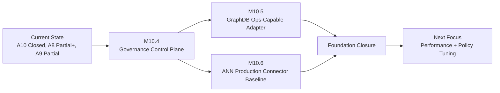

# Agent Workspace 合同收敛与下一阶段方向要求（执行版 v6，2026-04-14）

## Problem Frame
当前目标不是继续堆叠新动作，而是把“已落地能力”转成可持续工程主线，并把 Phase 1 底座推进从“概念正确”推进到“可上线、可回退、可审计”。

本次对齐输入：

- `docs/brainstorms/2026-04-11-evolution-progress-alignment-requirements.md`
- `docs/brainstorms/2026-04-12-agent-workspace-next-direction-requirements.md`
- `docs/brainstorms/2026-04-13-agent-workspace-architecture-progress-and-next-direction-requirements.md`
- `docs/diataxis/zh/explanation/development-progress-dashboard.md`
- `docs/diataxis/en/explanation/development-progress-dashboard.md`
- `src/frontend/agent_workspace.js`
- `src/frontend/workspace_panes.js`
- `src/agent_workspace.contract.parity.test.ts`
- `src/agent_workspace.frontend.test.ts`
- `src/agent_workspace.tauri.contract.test.ts`
- `.github/workflows/migration-gates.yml`
- `src/server.ts`
- `src/learning/store.ts`
- `src/learning/runtimeCapability.ts`
- `src/learning/queryBackend.ts`
- `src/learning/vectorAccelerationAdapter.ts`
- `src/notemd.server.rollout-boundary.integration.test.ts`

## 增量事实（相对 v5）

- A10（agent workspace 合同门禁常态 CI）已收口：`migration-gates` 已有 `agent-workspace-contract-gates` 作业并执行 `test:agent-workspace:contracts` 与 `test:conversation-turn-cache:durability`。
- graphdb `external_http` 连接器治理从“可连通”升级到“可观测”：`store` 诊断新增 connector telemetry（health/circuit/request/correlation）。
- runtime capability 新增 `store_graphdb_connector_health` 检查并接入 runbook/debug-trace。
- rollout 边界回归中补齐了 graphdb connector 健康路径断言。

## 先前方案要求与当前代码事实对比（v6 深度对齐）

| Axis | 先前要求 | 当前代码证据 | 状态 | 关键判断 |
|---|---|---|---|---|
| A1 对话与 pane 主模型 | conversation 主面 + focus/path 并排可共存 | `src/frontend/index.html`, `src/frontend/styles.css`, `src/frontend/workspace_panes.js` | Done | 交互主模型稳定，不是当前主瓶颈 |
| A2 typed capability 唯一真相源 | 禁止 legacy `availableActions` 双轨 | `src/learning/types.ts`, `src/learning/KnowledgeLearningPlatform.ts`, `src/frontend/workspace_panes.js` | Done | 合同源头已收敛 |
| A3 capability 执行注册表化 | transport/request/presentation/execution-kind 注册表化 | `src/frontend/agent_workspace.js`, `src/agent_workspace.contract.parity.test.ts` | Done | 扩展路径稳定 |
| A4 会话卡片语言重渲可持续 | append-kind 与渲染注册表一致性门禁 | `src/frontend/workspace_panes.js`, `src/agent_workspace.frontend.test.ts` | Done | 前端合同漂移风险下降 |
| A5 Tauri 生命周期证据链 | rust/window/index/manifest strict gate | `scripts/verify-agent-workspace-tauri*.js`, `.github/workflows/migration-gates.yml` | Done | 桌面证据链已常态化 |
| A6 Tauri smoke 覆盖面 | 关键 pane 生命周期 smoke 门禁 | `scripts/verify-agent-workspace-tauri.js` | Done | smoke 不再是单点样例 |
| A7 replay auto-execution 安全闭环 | `autoExecution` + blocker 可解释 | `src/server.ts`, `src/frontend/path_app.js`, `src/notemd.server.integration.test.ts` | Done | M9/M9.1 已收口 |
| A8 Phase 1 graphdb 底座升级 | 从 file-backed 过渡到真实图后端 | `src/learning/store.ts`, `src/notemd.server.rollout-boundary.integration.test.ts` | Partial+ | rollout-safe 边界已明显增强，但仍是 snapshot 持久化语义，不是“图计算后端” |
| A9 Phase 1 ANN 生产连接器 | scaffold 升级为生产 ANN | `src/learning/queryBackend.ts`, `src/learning/vectorAccelerationAdapter.ts` | Partial | 已有超时/重试/熔断与可观测性，但仍是 prefilter 协议，不是完整向量检索闭环 |
| A10 CI 常态化覆盖面 | agent workspace 合同门禁必须常态执行 | `.github/workflows/migration-gates.yml` | Done | v5 的最大 CI 缺口已关闭 |
| A11 graphdb 连接器治理 | graphdb 连接器应具备健康/熔断/关联遥测 | `src/learning/store.ts`, `src/learning/runtimeCapability.ts` | Done | 已具备 operator 级可见性 |
| A12 graphdb 严格路径一致性 | strict 模式下空快照/故障语义需可区分 | `src/learning/store.ts`, `src/notemd.server.rollout-boundary.integration.test.ts` | Done | 已修正“404 空快照误判为硬故障”语义回归 |

## 批判性结论（不回避逻辑漏洞）

1. 把 graphdb 从 file adapter 替换成 HTTP snapshot adapter，不等于“真实图后端能力已就绪”。
   - 当前 `store` 层仍是“整快照 load/save”，并未把节点/边查询或路径计算下推到图后端。
   - 结论：A8 只能判定为 Partial+，不能判定 Done。

2. 当前 ANN external connector 的协议语义是“候选集预筛选”，不是“完整向量检索”。
   - `local_vector` 仍在本地执行 TF-IDF + overlap + relation bonus 打分，外部仅返回 `candidateAtomIds`。
   - 结论：A9 若按“生产 ANN 检索系统”定义，仍未闭环。

3. 现有 graphdb connector 熔断参数尚未形成 server env 同步控制面。
   - `store` 侧已有 circuit 参数能力，但 `server` 环境变量读取未暴露对应 knob。
   - 结论：治理链路仍存在“代码能力 > 运维控制面”的不对称。

4. rollout 边界集成测试未显式作为独立常态门禁作业，存在被大矩阵覆盖稀释的风险。
   - 结论：需要明确把 foundation 关键边界验证提升为可识别的 CI 关卡。

## Approach Options（下一阶段方向）

### 方案 A：继续以 snapshot adapter 渐进硬化

- 描述：维持当前 snapshot 持久化模型，只补全治理与 CI。
- 优点：改动面最小，短期风险低。
- 缺点：无法直接带来“图后端真实能力”，A8 会长期停留在 Partial+。
- 适用：近期仅追求稳定，不追求底座跃迁。

### 方案 B：引入“图后端操作语义”适配层（推荐）

- 描述：在不破坏上层 API 的前提下，为 graphdb adapter 增加 capability 协商与操作级语义（不仅是全量 snapshot）。
- 优点：可以在 rollout-safe 前提下逐步获得真实后端价值，同时保持回退路径。
- 缺点：需要补一层 adapter 能力模型与更多边界测试。
- 适用：希望在 1-2 个迭代内把 A8 从 Partial+ 推进到可验收闭环。

### 方案 C：直接切换到重型外部图数据库依赖

- 描述：直接绑定特定外部图数据库作为主依赖。
- 优点：理论能力上限高。
- 缺点：跨平台打包、开发环境一致性、离线部署复杂度显著上升，与当前项目“本地优先 + 轻依赖”约束冲突。
- 适用：仅当项目目标明确转向集中式服务架构。

推荐：**方案 B**。它在当前工程约束下的收益/风险比最佳。

## Requirements（v6 有效需求）

### Contract And CI Governance

- R1. 维持并保护现有 agent workspace 常态 CI 门禁（禁止回退为仅本地验证）。
- R2. rollout 边界关键回归（graphdb/vector strict 行为）应具备可识别的常态 CI 执行入口。
- R3. capability union、operation registry、presentation registry 漂移必须继续 fail-fast。
- R4. append-kind 与前端重渲注册表不一致必须继续 fail-fast。
- R5. Tauri strict 证据作业与前端/合同门禁并行维持，禁止二者互相替代。

### GraphDB Foundation Closure

- R6. graphdb 路线从“snapshot 持久化可用”推进到“后端操作语义可用”，并保持 fallback/strict 语义不破坏。
- R7. graphdb adapter 演进不得破坏 `src/learning/api.ts` 与 `src/learning/types.ts` 的对上合同。
- R8. server 层暴露 graphdb connector 熔断参数 env 控制面，与 `store` 能力对齐。
- R9. runtime capability 为 graphdb connector 增加阈值化预算治理（样本量、失败比例、短路比例、连续失败）。
- R10. graphdb connector runbook 必须形成“可执行整改动作 + 可验证回收标准”。

### ANN Production Connector Closure

- R11. ANN 路线从 `ann_prefilter + external_*` 推进到生产连接器最小闭环（健康、超时、重试、熔断、回退、关联字段）。
- R12. ANN 连接器必须具备表示一致性约束（索引版本、向量维度/模型标识或等效签名）；禁止仅靠 token 预筛选宣称“生产 ANN 已完成”。
- R13. runbook 继续对 `prefilter_effectiveness / circuit_state / traceability` 做门禁，且阈值可调。
- R14. foundation 改造期间，L4 interaction contract（conversation capability surface）保持向后兼容。

### Execution Discipline

- R15. 采用“双轨并行 + 单主优先级”：
  - 轨道 A：foundation 治理闭环（graphdb connector control plane + runtime budget + CI gate）先完成。
  - 轨道 B：graphdb 操作语义升级与 ANN 连接器闭环随后推进。
- R16. 每个里程碑必须交付三件套：代码证据、测试证据、文档证据。
- R17. 新增动作类需求默认降级优先级，除非直接解除 R6-R13 风险。

## 落盘执行方案（M10.4-M10.6）

### M10.4（先做）：Foundation 治理控制面对齐

目标：把“已实现能力”变成“可控能力”。

- 范围：
  - server 环境变量补齐 graphdb connector circuit 参数透传。
  - runtime capability 补齐 graphdb connector 阈值预算（warn/fail）。
  - runbook/action-queue 增加 graphdb connector 整改动作模板。
  - CI 增加 foundation 边界的可识别门禁入口。
- 触点：
  - `src/server.ts`
  - `src/learning/store.ts`
  - `src/learning/runtimeCapability.ts`
  - `.github/workflows/migration-gates.yml`
- 验证：
  - `src/learning/runtimeCapability.test.ts`
  - `src/notemd.server.rollout-boundary.integration.test.ts`
  - 新/改 CI 作业执行日志

#### M10.4 执行进展（2026-04-14 当日补记）

- [Done] `server` 已暴露 graphdb connector circuit 控制面：
  - `NOTE_CONNECTION_KNOWLEDGE_GRAPHDB_HTTP_CIRCUIT_FAILURE_THRESHOLD`
  - `NOTE_CONNECTION_KNOWLEDGE_GRAPHDB_HTTP_CIRCUIT_COOLDOWN_MS`
- [Done] `runtime capability` 新增独立检查 `store_graphdb_connector_budget`（与 `store_graphdb_connector_health` 分离）。
- [Done] 新增 graphdb connector runtime budget env 组（`NOTE_CONNECTION_RUNTIME_STORE_GRAPHDB_CONNECTOR_*`）。
- [Done] contract test 已覆盖上述 server/runtime env wiring 与 check id 信号。
- [Done] CI 新增可识别 gate：`foundation-rollout-boundary-suite`（`npm run test:foundation:rollout-boundary`）。
- [Done] 本地验证通过：
  - `npm test -- src/learning/runtimeCapability.test.ts --runInBand`
  - `npm test -- src/notemd.server.rollout-boundary.integration.test.ts --runInBand`
  - `npm test -- src/knowledge.api.contract.test.ts --runInBand`
  - `npm run docs:diataxis:check && npm run docs:site:build`

结论：`M10.4` 已达到“治理控制面对齐 + 基线可验证”状态，可进入 `M10.5`（graphdb 操作语义最小闭环）。

### M10.5：GraphDB 操作语义最小闭环

目标：把 graphdb 从“快照仓库”升级为“可承载图后端语义的适配层”。

- 范围：
  - adapter capability 协商（snapshot-only vs ops-capable）。
  - 保留 snapshot fallback，同时允许操作级读写路径逐步启用。
  - fail-open/fail-closed 语义保持现有 contract。
- 触点：
  - `src/learning/store.ts`
  - `src/server.ts`
  - `src/learning/KnowledgeLearningPlatform.ts`
- 验证：
  - store 单测 + rollout 边界集成测试扩展。
  - runtime diagnostics 能区分 snapshot 模式与 ops 模式。

#### M10.5 执行进展（2026-04-14 当日补记）

- [Done] 新增 graphdb adapter capability 协商契约：
  - `snapshot_only` vs `ops_capable`
  - adapter `supportedReadOperations` / `supportedWriteOperations`
- [Done] 新增 store operation mode：
  - `NOTE_CONNECTION_KNOWLEDGE_GRAPHDB_OPERATION_MODE`
  - `snapshot_only`（默认）/ `ops_preferred`
- [Done] graphdb diagnostics 可区分当前运行路径：
  - `graphDbOperationMode`
  - `graphDbAdapterCapabilityMode`
  - `graphDbReadPath`
  - `graphDbWritePath`
  - `graphDbSupportedReadOperations`
  - `graphDbSupportedWriteOperations`
  - `graphDbLastSnapshotMetadata`
- [Done] fail-open/fail-closed 语义保持：strict 无 fallback 时仍 fail-closed；ops 协商不改变既有异常边界。
- [Done] 已扩展验证覆盖：
  - `src/learning/store.test.ts`（ops-capable 与 snapshot-only 协商分支）
  - `src/notemd.server.rollout-boundary.integration.test.ts`（新增 file adapter + ops_preferred 路径）
  - `src/knowledge.api.contract.test.ts`（server wiring 与 env contract）

结论：`M10.5` 已达到“能力协商 + 运行路径可观测 + 边界语义不回退”的最小闭环，可继续推进 `M10.6`。

### M10.6：ANN 连接器生产闭环

目标：把 ANN 从“候选预筛选插件”推进到“生产可运维连接器”。

- 范围：
  - 连接器协议增加表示一致性元信息（版本/模型/签名）。
  - 连接器健康、超时、重试、熔断、traceability 信号保持可观测。
  - prefilter_effectiveness 门禁与语料规模分层阈值校准。
- 触点：
  - `src/learning/vectorAccelerationAdapter.ts`
  - `src/learning/queryBackend.ts`
  - `src/learning/runtimeCapability.ts`
  - `src/server.ts`
- 验证：
  - `src/learning/queryBackend.test.ts`
  - `src/learning/runtimeCapability.test.ts`
  - `src/notemd.server.rollout-boundary.integration.test.ts`

#### M10.6 执行进展（2026-04-14 当日补记）

- [Done] `query/vector` 诊断链路补齐表示一致性元信息（trace + runtime diagnostics）：
  - `representationVersion`
  - `embeddingModelId`
  - `embeddingDimension`
  - `indexSignature`
  - `representationStatus`
  - `representationStatusReason`
- [Done] `LocalVectorGraphQueryBackend` 已实现表示一致性判定最小闭环：
  - 本地 adapter 路径强制 `aligned`
  - 外部 adapter 路径在无显式状态时按 metadata 自动推断 `aligned|mismatch|unknown`
- [Done] `external_http` acceleration adapter 已接入表示元信息协商：
  - 请求体上送本地表示元信息
  - 响应可回传表示状态/原因
  - 缺省情况下自动推断 mismatch（如版本漂移）并写入 health telemetry
- [Done] runtime capability matrix 已透传 ANN 表示一致性 signals（不破坏现有门禁语义）。
- [Done] 合同与单测覆盖已补齐：
  - `src/learning/queryBackend.test.ts`
  - `src/learning/vectorAccelerationAdapter.test.ts`
  - `src/learning/runtimeCapability.test.ts`
  - `src/knowledge.api.contract.test.ts`
- [Done] 本地验证通过：
  - `npm test -- src/learning/queryBackend.test.ts --runInBand`
  - `npm test -- src/learning/vectorAccelerationAdapter.test.ts --runInBand`
  - `npm test -- src/learning/runtimeCapability.test.ts --runInBand`
  - `npm test -- src/notemd.server.rollout-boundary.integration.test.ts --runInBand`
  - `npm test -- src/knowledge.api.contract.test.ts --runInBand`
  - `npm run docs:diataxis:check && npm run docs:site:build`

## Success Criteria（v6）

- A10 持续维持 Done（CI 门禁不回退）。
- A8 从 Partial+ 推进到“后端操作语义可用 + rollout-safe 可回退”。
- A9 从 Partial 推进到“生产连接器最小闭环可验收”。
- runbook 对 graphdb 与 ANN 的故障信号均可形成可执行整改路径。

## Scope Boundaries

- 不在本轮引入新的前端框架或独立聊天子应用。
- 不在本轮重做 tutor/runtime governance 主体。
- 不在本轮将 DeepTutor/MemOS 作为代码迁移源，仅做模式参考。

## Outstanding Questions

### Resolve Before Planning

- [Affects R2][CI] foundation 边界验证是并入现有 `migration-gates` matrix，还是独立 `foundation-rollout-boundary-gates` job。

### Deferred to Planning

- [Affects R6][Technical] graphdb adapter capability 协商的数据结构与回退优先级细则。
- [Affects R12][Technical] ANN 表示一致性字段的最小集合（版本、模型、向量维度、签名策略）。

## Visual Aid

## Next Steps

- 进入 `/ce:plan`，按 M10.4 -> M10.5 -> M10.6 生成可执行任务分解。
