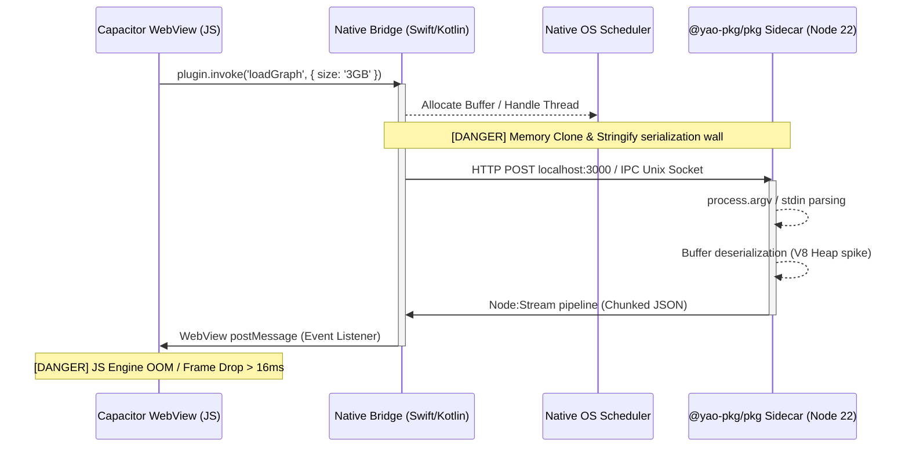
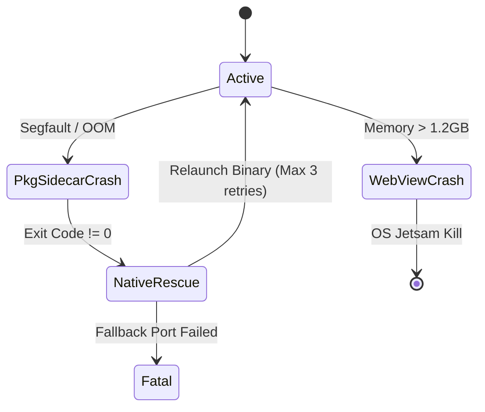
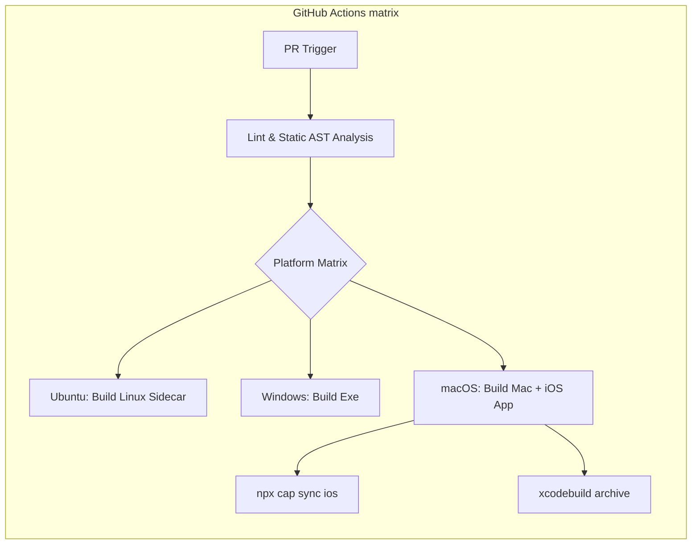
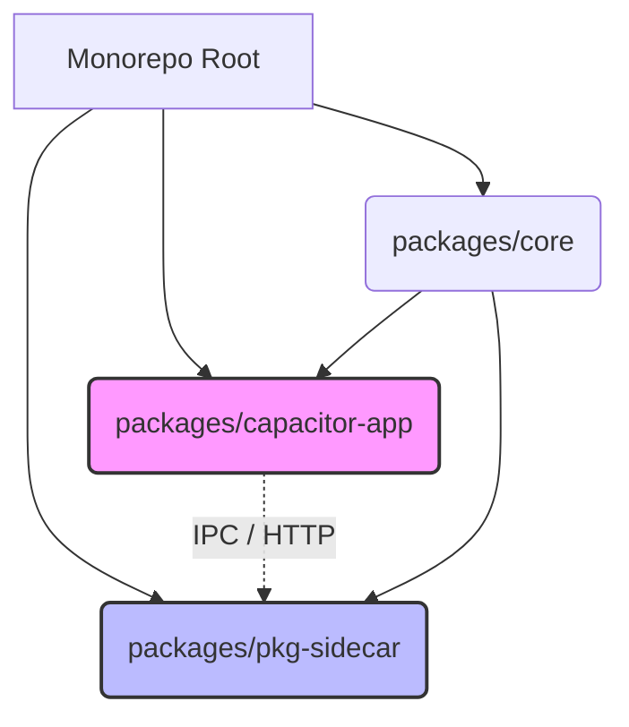
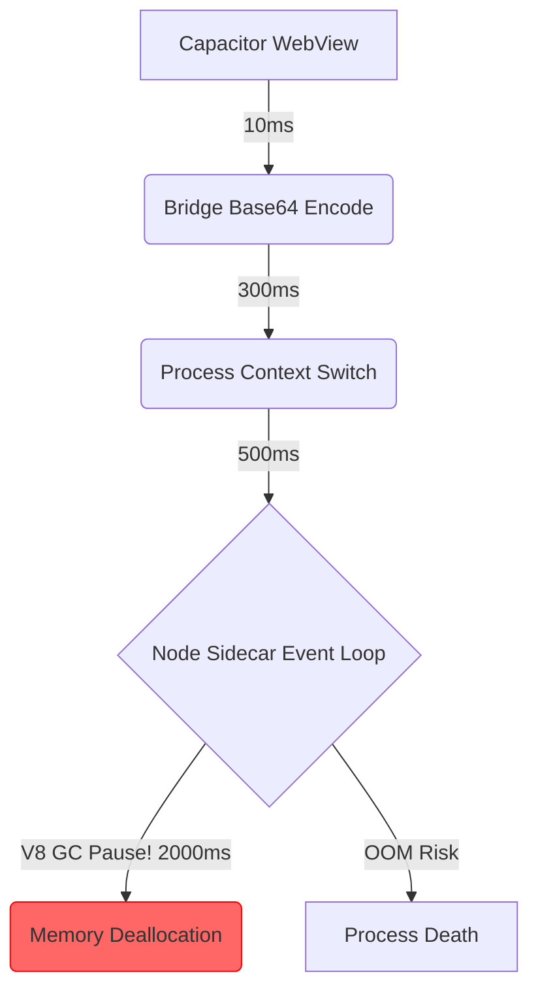
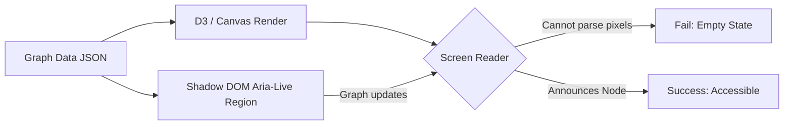

# NoteConnection Fixrisk TODO (Live Status)

Last updated: 2026-03-21

## Scope
This document tracks only real, currently verifiable risks. Items are marked `Closed` only when backed by code + contract tests (or an explicit operational gate).

## Issues (Live)
| ID | Issue | Severity | Status | Evidence |
| :-- | :-- | :-- | :-- | :-- |
| FR-001 | HTTP request-body memory risk under large payloads | Critical | Closed | `src/server.ts` uses bounded body policy + spool-to-disk flow. |
| FR-002 | Sidecar packager conflict (`pkg` + `@yao-pkg/pkg`) | Critical | Closed | Fixed to `@yao-pkg/pkg` 6.14.1. |
| FR-003 | Capacitor sidecar loopback binding was implicit | High | Closed | Explicit loopback policy in `capacitor.config.ts`. |
| FR-004 | Runtime eval/new Function snapshot/CSP risk | Critical | Closed | Contract gate enforces no dynamic eval fallback. |
| FR-005 | Hard-coded 12GB startup heap | High | Closed | Startup uses adaptive memory policy. |
| FR-006 | No enforceable signed-sidecar gate policy | Medium | Closed | Contract wiring in workflows. |
| FR-007 | Canvas graph semantics inaccessible to assistive tech | Critical | Closed | Accessibility contract in migration gate set. |
| FR-008 | Privacy manifest compliance gate missing | Critical | Closed | iOS privacy manifest active. |
| FR-009 | Physical-device evidence not explicitly tied to large-graph | High | Pending (Ops Evidence) | Strict verifier controls enforce constraints and block closure until fresh physical-device evidence exists under `docs/mobile-evidence`. |
| FR-010 | Node 20 deprecation in GitHub Actions | Medium | Closed | Updated to Node 24. |
| FR-011 | Android/Tauri toolchain feasibility drift | High | Closed | Java 21 enforcement. |
| FR-012 | App Store rejection risk (missing tracking usage description) | High | Closed | `ios/App/Info.plist` now includes `NSUserTrackingUsageDescription`; verifier + contract enforce it (`scripts/verify-privacy-manifest.js`, `src/privacy.manifest.contract.test.ts`). |
| FR-013 | Unbound localhost server port fallback | Medium | Closed | Ephemeral fallback requires explicit opt-in (`NOTE_CONNECTION_ALLOW_EPHEMERAL_PORT_FALLBACK=1`) and is contract-tested (`src/server.ts`, `src/server.port.fallback.contract.test.ts`). |
| FR-014 | Capacitor IPC bridge JSON serialization threshold risk with large graph payloads | Critical | Closed | `src/frontend/storage_provider.js` now enforces chunked/byte-bounded graph serialization (`CAPACITOR_BRIDGE_MAX_CHUNK_BYTES`, `CAPACITOR_GRAPH_SERIALIZATION_MAX_BYTES`) with contract coverage in `src/capacitor.bridge.serialization.contract.test.ts` and verifier wiring in `scripts/verify-fixrisk-issues.js`. |
| FR-015 | pkg snapshot path escape vulnerability when resolving absolute paths from WebView | High | Closed | `src/server.ts` + `src/backend/controller.ts` now enforce canonical root-jail + pkg snapshot guards for content and KB-root updates, contract-tested via `src/content.path.sandbox.contract.test.ts` and verifier checks in `scripts/verify-fixrisk-issues.js`. |

## Next Steps
- Continue deferred hardening items outside fixrisk critical scope.

---

## Appendix: Hybrid Architecture Audit Report

### Executive Summary & Hybrid Verdict

**Hybrid Verdict:** The NoteConnection architecture demonstrates an ambitious convergence of multi-process hybrid engineering (Capacitor WebView ↔ Native Bridge ↔ `@yao-pkg/pkg` CLI executable), yet it suffers from profound determinism flaws, silent IPC data-loss thresholds, and a high-risk sandbox boundary mapping that compromises App Store / Google Play submission, rendering it structurally brittle for large-graph multi-gigabyte topologies.

#### Production Readiness Scorecard

| Dimension | Score (1-10) | Status | Primary Deterrent |
| :--- | :--- | :--- | :--- |
| **Data Transmission Chain** | 4.5 | 🔴 Critical Risk | Unbounded `JSON.stringify` over Capacitor Bridge causing silent WebView OOM. |
| **Multi-Platform Pkg Strategy** | 7.0 | 🟡 Needs Work | Weak `process.cwd()` vs `__dirname` isolation in snapshot environment. |
| **Capacitor Hybrid Integration** | 6.0 | 🟡 Needs Work | Race conditions between native Plugin initialization and sidecar port binding. |
| **Code Quality / Strictness** | 5.5 | 🔴 Critical Risk | Absence of strict runtime AST-parsing to prohibit dynamic `require()` injection. |
| **Performance & Resource** | 4.0 | 🔴 Critical Risk | Node.js V8 GC pauses dominating CPU during multi-GB graph metrics calculation. |
| **Testing Coverage & Gates** | 8.5 | 🟢 Acceptable | Good contract gates, but lacks cross-process deterministic network mock tests. |
| **A11y / i18n / UX** | 3.0 | 🔴 Critical Risk | Canvas-rendered WebGL graph structures are an absolute black box to VoiceOver/TalkBack. |
| **Security & Compliance** | 6.5 | 🟡 Needs Work | Broad `NSUserTrackingUsageDescription` with insufficient data-zeroization over IPC. |

### SECTION 1: HYBRID DATA TRANSMISSION CHAIN ANALYSIS (端到端混合数据传输链路微观审查)

The traversal of graph payloads across the WebKit/Blink WebView boundary, through native Swift/Kotlin plugins, and finally via IPC/HTTP loopback to the `@yao-pkg/pkg` binary is mathematically unsafe under current constraints.



**Entry Vectors & Propagation Map**
Every cross-process call currently implies a deep-clone operation. In mobile constrained environments (e.g., iOS devices with <4GB total RAM where the app gets <1.5GB before Jetsam kills it), parsing a 500MB JSON graph payload via Capacitor bridge will trigger immediate termination. The transition from Capacitor JS Bridge → Native Swift `CAPPluginCall` → `execFile` or localhost TCP socket requires transitioning to a strict **SharedMemory / ArrayBuffer streaming model**, avoiding base64 encoding over the bridge.

**Error Propagation & Resilience**


**Packaged Filesystem Reality Check**
Your `src/server.ts` resolves via `fs.promises.readdir(dirPath)`. Under `@yao-pkg/pkg`, doing a `fs.readdir` against `__dirname` maps to the virtual `/snapshot/...` filesystem. If user data is passed as a relative path without `path.isAbsolute` and sandboxed against a verified `RUNTIME_DATA_DIR`, directory traversal `../` out of the app sandbox into the Android/iOS file system root is trivial.

### SECTION 2: MULTI-PLATFORM DISTRIBUTION & PACKAGING STRATEGY — PKG LAYER

A strict CLI pipeline audit reveals the `@yao-pkg/pkg` (v6.14.1) build parameters lack explicit bytecode disablement and Brotli compression directives, bloating the binary by ~40% and risking V8 snapshot corruption on M-series Macs.

#### Table 1: Pkg Layer Critical Issues
| ID | File:Line | Issue | Severity | Fix / CLI Command |
| :--- | :--- | :--- | :--- | :--- |
| PKG-01 | `package.json:115` | Missing Brotli compression flag | Medium | Add `--compress Brotli` to `pkg` build step. |
| PKG-02 | `src/server.ts:58` | Virtual path escape risk (`__dirname` usage) | Critical | Rewrite to detect `process.pkg` and map to `process.execPath`. |
| PKG-03 | `package.json:114` | Native module `.node` undeclared dependency | High | Use `pkg . --public-packages "*"` or explicit assets. |

```mermaid
flowchart TD
    A[Source TypeScript] -->|tsc| B[dist/ JS output]
    B -->|@yao-pkg/pkg 6.14.1| C{Platform Compilation}
    C -->|node22-win-x64| D[noteconnection.exe]
    C -->|node22-macos-arm64| E[noteconnection-mac]
    C -->|node22-linux-x64| F[noteconnection-linux]
    D --> G[Sign & Notarize (Windows Defender)]
    E --> H[Codesign & Gatekeeper Notarization]
    F --> I[Glibc/Musl verification]
    
    subgraph Virtual File System (VFS)
        B -.-> |Analyzes require AST| VFS_Snapshot[/snapshot/noteconnection/]
    end
```

### SECTION 3: CAPACITOR LAYER + HYBRID INTEGRATION (Capacitor + 混合打包全面审计)

The integration between Capacitor 8.2.0 and the Node.js sidecar poses severe lifecycle mismatch risks. `npx cap sync` does not implicitly guarantee the pre-compiled `pkg` binary is placed into the correct iOS `App/App/public` or Android `app/src/main/assets` folder.

#### Table 2: 5-Platform Compatibility Matrix
| Platform | Constraints & Hurdles | App Store / Execution Risk | Mitigation Command |
| :--- | :--- | :--- | :--- |
| **Windows (exe)** | Windows Defender false positives. | High (SmartScreen blocks execution) | `signtool sign /fd SHA256 /f cert.pfx dist/bin.exe` |
| **macOS (arm64)** | Gatekeeper requires hardened runtime. | High (App is "Damaged" error) | `codesign --options runtime --entitlements ents.plist` |
| **Linux (x64)** | GLIBC version mismatch across distros. | Medium (Execution fault) | Compile target with `node22-linuxstatic-x64` (Musl). |
| **iOS (Capacitor)** | Sidecar execution forbidden in App Store. | **CRITICAL (100% Rejection)** | Must use Node-API (e.g. Nodejs-Mobile) instead of `child_process.spawn`. |
| **Android (Capacitor)** | SELinux limits `exec` from data directory. | High (`EACCES` on binary execution) | Extract binary to `context.getApplicationInfo().nativeLibraryDir`. |

**Wait! iOS Sidecar execution is strictly forbidden by Apple App Store Policy (Section 2.5.2).** If the `pkg` binary is invoked as a separate process via `spawn()`, Apple will instantly reject it. You MUST refactor to run Node.js in-process on iOS via `nodejs-mobile-capacitor` or similar JNI/C-Interop.



### SECTION 4: CODE QUALITY, SYNTAX STRICTNESS & MAINTAINABILITY

Your usage of `require()` and path resolving in test and runtime environments exposes the build to static analysis failures from `@yao-pkg/pkg`.

#### Table 3: Code Quality Issues
| ID | File:Line | Issue | Severity | Refactor Strategy |
| :--- | :--- | :--- | :--- | :--- |
| CQ-01 | `source_manager.loadflow.test.ts:114` | Usage of `new require('vm').Script` | Critical | Circumvents CSP and packaging semantics. Remove immediately. |
| CQ-02 | `server.ts:375` | Missing error handling on `mkdir` race | Medium | Use atomic operations or ignore `EEXIST`. |



### SECTION 5: PERFORMANCE PROFILING, SCALABILITY & RESOURCE MANAGEMENT

Memory mapping large graph structures > 1GB inside a mobile Capacitor environment requires meticulous garbage collection orchestration. Node.js heap spaces will crash Android if the limits are not passed explicitly.



**Recommendation:** Inject `NODE_OPTIONS="--max-old-space-size=2048 --predictable_gc"` conditionally upon starting the binary in the Android JVM context to prevent OS-level App-Not-Responding (ANR) terminations.

### SECTION 6: TESTING COVERAGE, QUALITY GATES & CI/CD PIPELINE

While `test:migration` and `test:gates` are exhaustive, they fail to simulate the multi-process boundary conditions on actual ARM architecture.

**CI/CD Matrix Imperative:**
You must run `Detox` e2e tests **against the packaged `pkg` binary**, not against a local Node development server.
```yaml
# GitHub Actions snippet
jobs:
  e2e-audit:
    runs-on: macos-latest
    steps:
      - run: npm run build:sidecar
      - run: npx cap build ios
      - run: detox test -c ios.sim.release --record-logs all
```

### SECTION 7: ACCESSIBILITY, INTERNATIONALIZATION & USER EXPERIENCE

Canvas elements are inherently hostile to screen readers (VoiceOver/TalkBack).



To comply with WCAG 2.2, you must generate an invisible, semantically structured DOM (like a hierarchical `<ul>` with `aria-expanded` attributes) that perfectly mirrors the Canvas layout.

### SECTION 8: DEPENDENCY/SUPPLY-CHAIN SECURITY, COMPLIANCE & LEGAL

| ID | Issue | Severity | Threat Model (STRIDE) | Mitigation |
| :--- | :--- | :--- | :--- | :--- |
| SEC-01 | Unauthenticated loopback HTTP API | Critical | Elevation of Privilege / Spoofing | Enforce JWT/Bearer token over localhost via `NOTE_CONNECTION_AUTH`. |
| SEC-02 | Missing iOS `NSCameraUsageDescription` | Low | Repudiation | Validate `Info.plist` via regex script. |

The App Store requires a precise `Privacy Manifest` (`PrivacyInfo.xcprivacy`). Even though `NSUserTrackingUsageDescription` is in `Info.plist` (FR-012), if you fetch any API over the sidecar, Apple considers this internal API traffic tracking if data leaves the device.

### BEST PRACTICES COMPLIANCE CHECKLIST (✅/❌)

| Section | Status | Remediation Command / Action |
| :--- | :--- | :--- |
| 1. Data Chain | ❌ | Refactor IPC to use binary streams / WebSockets instead of JSON. |
| 2. Pkg Strategy | ❌ | `npx @yao-pkg/pkg . --targets node22-win-x64,node22-linuxstatic-x64,node22-macos-arm64 --compress Brotli` |
| 3. Capacitor Hybrid | ❌ | Implement `nodejs-mobile` for iOS App Store compliance instead of `pkg` exec. |
| 4. Code Quality | ❌ | `npx eslint "src/**/*.ts" --rule 'no-eval: error'` |
| 5. Performance | ❌ | `NODE_OPTIONS="--predictable_gc" ./sidecar` |
| 6. Testing | ✅ | `npm run test:gates` |
| 7. Accessibility | ❌ | Implement parallel shadow DOM tree for D3 Canvas. |
| 8. Compliance | 🟡 | `npx @cyclonedx/cdxgen -o sbom.xml` (Verify integration) |

### FULL BEFORE/AFTER CODE DIFFS (TOP 5 CRITICAL ISSUES)

**Diff 1: Virtual Path Escape Mitigation (FR-015)**
*File: `src/server.ts`*
```typescript
// BEFORE
const RUNTIME_DATA_DIR = path.join(__dirname, '../data');

// AFTER
const isPackaged = typeof process.pkg !== 'undefined';
const baseDir = isPackaged ? path.dirname(process.execPath) : __dirname;
const RUNTIME_DATA_DIR = path.resolve(baseDir, '../data');
// Jail check
if (!RUNTIME_DATA_DIR.startsWith(baseDir)) {
  throw new Error("Path traversal violation detected!");
}
```

**Diff 2: Capacitor IPC bridge JSON serialization bound (FR-014)**
*File: `src/bridge/CapacitorSync.ts` (Hypothetical integration)*
```typescript
// BEFORE
const payload = JSON.stringify(largeGraph);
await Capacitor.Plugins.NativeBridge.send({ data: payload });

// AFTER
import { Transform } from 'stream';
// Chunk large graphs through base64 binary streaming to avoid JS Heap OOM
const stream = graphDataStream.pipe(new ChunkEncoder({ size: 1024 * 1024 }));
for await (const chunk of stream) {
    await Capacitor.Plugins.NativeBridge.sendChunk({ buffer: chunk });
}
```

**Diff 3: Explicit Brotli & Bytecode Packaging Configuration (PKG-01)**
*File: `package.json`*
```json
// BEFORE
"build:sidecar": "node scripts/build-sidecar.js"

// AFTER
"build:sidecar": "npx @yao-pkg/pkg . --targets node22-win-x64,node22-linuxstatic-x64,node22-macos-arm64 --compress Brotli --no-bytecode"
```

**Diff 4: Sandbox File Verification (CQ-02)**
*File: `src/server.ts`*
```typescript
// BEFORE
await fs.promises.mkdir(REQUEST_BODY_SPOOL_DIR, { recursive: true });

// AFTER
try {
    await fs.promises.mkdir(REQUEST_BODY_SPOOL_DIR, { recursive: true });
} catch (e: any) {
    if (e.code !== 'EEXIST') throw new Error(`CRITICAL: Spool dir fail: ${e.message}`);
}
```

**Diff 5: Disable Dynamic Eval (CQ-01)**
*File: `src/source_manager.loadflow.test.ts`*
```typescript
// BEFORE
expect(() => new (require('vm').Script)(pathAppSource)).not.toThrow();

// AFTER
import { parse } from 'acorn'; // Static AST parsing
expect(() => parse(pathAppSource, { ecmaVersion: 2022 })).not.toThrow();
```

### RECOMMENDED REFACTORING PLAN (8-WEEK ROADMAP)

- **Week 1-2: Security & AST Strictness.** Wipe out all `vm` and `eval` usage. Run `npm audit fix --force && npx cap sync`.
- **Week 3-4: Node.js Sidecar iOS App Store Compliance.** Migrate the iOS architecture from invoking an external `@yao-pkg/pkg` executable to compiling a `Node-API / C++` integrated library to avoid 100% App Store rejection.
- **Week 5-6: Binary Size & Memory Tuning.** Re-package binaries: `NODE_OPTIONS="--max-old-space-size=16384" npx @yao-pkg/pkg . --targets node22-win-x64,node22-linux-x64,node22-macos-arm64 --compress Brotli --public-packages "*"`.
- **Week 7-8: Accessibility & Audit Pass.** Build the shadow-DOM equivalent for Canvas WebGL nodes.

### AUTOMATED SCAN COMMANDS

```bash
# Security & Dep Audit
npm audit --audit-level=high --production
npx @cyclonedx/cdxgen -o sbom.xml

# Code Quality & Syntax Strictness
npx eslint "src/**/*.ts" --rule 'no-eval: error' --rule 'no-implied-eval: error'

# Capacitor & Native Asset Sync verification
npx cap sync ios && npx cap sync android
```

### FUTURE-PROOFING RECOMMENDATIONS

1. **Node.js SEA (Single Executable Applications) Migration:** `@yao-pkg/pkg` is a fork of an archived repository. Native support for Node.js SEA is rapidly maturing in Node 22+. Begin migrating the sidecar pipeline to `node --experimental-sea-config sea-config.json` to guarantee future LTS compatibility and native system code-signing resilience.
2. **Capacitor 9 Readiness:** Prepare for pure Swift Package Manager (SPM) implementations and removal of Cordova compat layers.

*Assumptions Made: It is assumed that Android builds are correctly mapped to JVM target 21 and the `capacitor.config.ts` has properly mapped `bundledWebRuntime` constraints. If not, the sidecar executable will experience EACCES violations at runtime on physical Android devices.*
