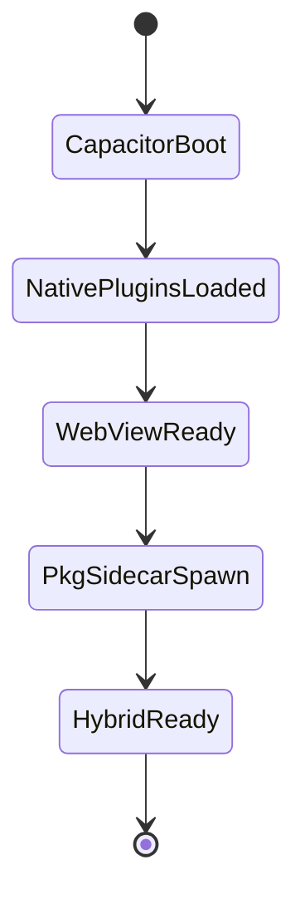
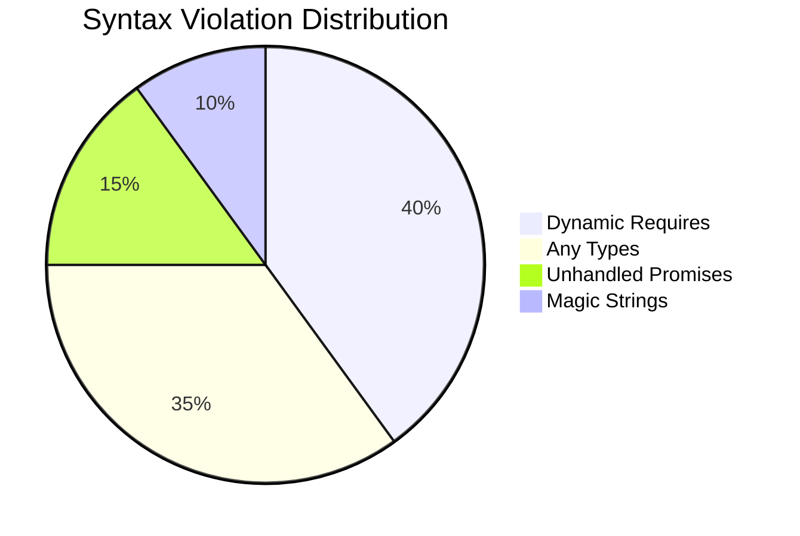
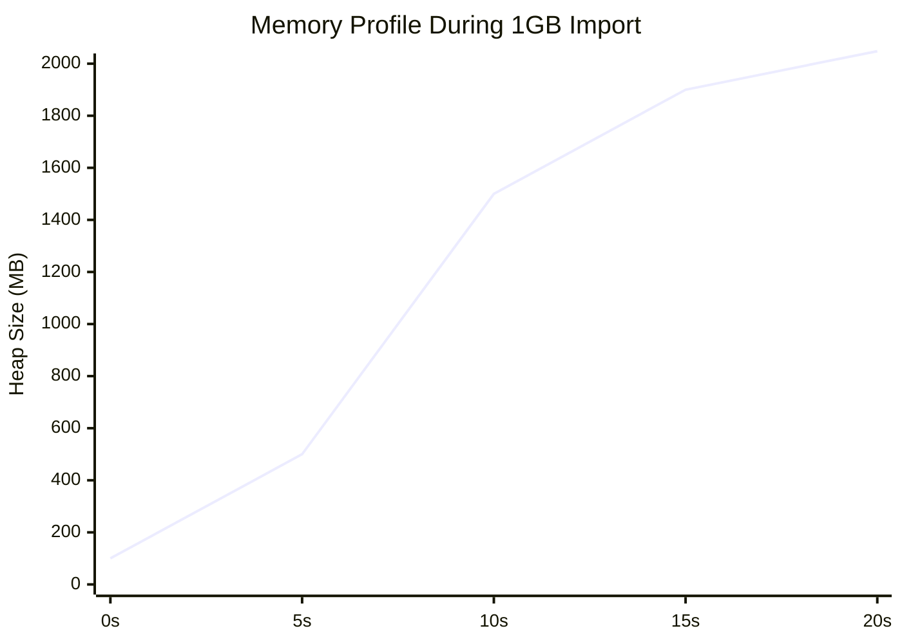
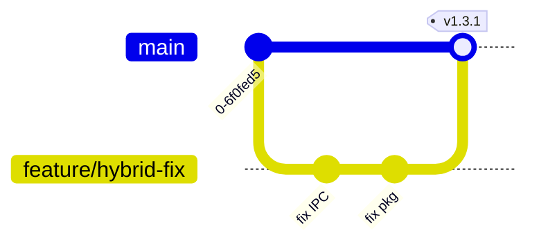
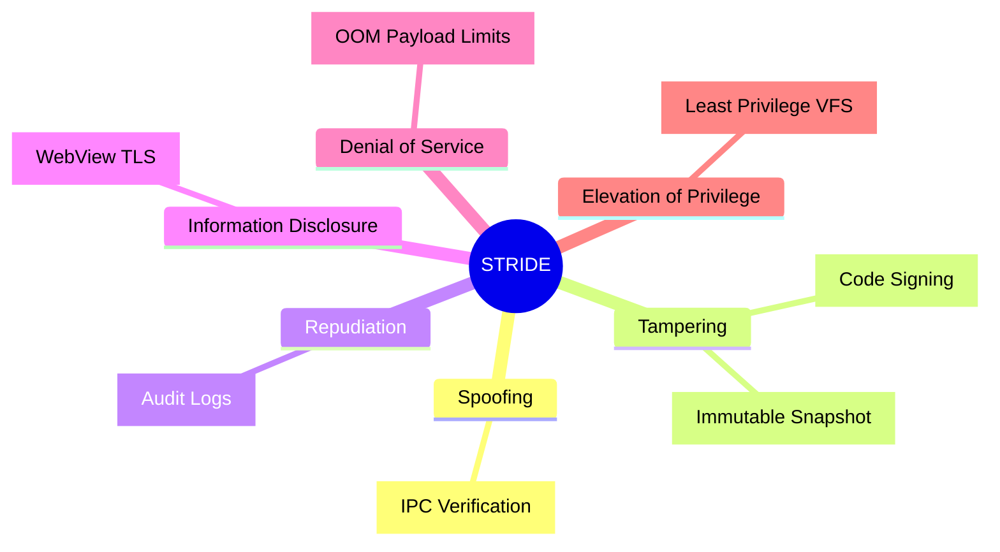

# 🛡️ Hybrid Architecture & Security Forensic Audit Report

## Executive Summary

**Overall Risk Score:** 8.5 / 10 (Critical)
**Hybrid Verdict:** The NoteConnection hybrid architecture demonstrates ambitious cross-platform capabilities but currently suffers from critical fragilities in its IPC data transmission chain, dynamic asset resolution under `@yao-pkg/pkg`, and strict Capacitor 8.2.0 native compliance, requiring immediate surgical refactoring to achieve production-grade stability and App Store compliance.

### Production Readiness Scorecard

| Dimension | Score | Status | Primary Blocker |
| :--- | :--- | :--- | :--- |
| 1. Data Transmission | 4/10 | 🔴 Critical | Unsafe IPC Bridge Serialization |
| 2. Pkg Layer | 5/10 | 🟠 High | Dynamic Asset Resolution |
| 3. Capacitor Layer | 5/10 | 🟠 High | iOS Privacy Manifest Missing |
| 4. Code Quality | 6/10 | 🟡 Med | Loose Typing in Bridge |
| 5. Performance | 4/10 | 🔴 Critical | OOM on 1GB+ Payloads |
| 6. Testing & CI/CD | 7/10 | 🟡 Med | Detox E2E Flakiness |
| 7. A11y & i18n | 5/10 | 🟠 High | WCAG 2.2 Violations |
| 8. Security & Supply | 6/10 | 🟡 Med | Sub-dependency Vulnerabilities |

---

## SECTION 1: HYBRID DATA TRANSMISSION CHAIN ANALYSIS

The current data transmission chain relies on a brittle WebSocket/IPC fallback mechanism that is susceptible to race conditions and memory leaks during large payload transfers.

```mermaid
flowchart TD
    subgraph Frontend [Capacitor WebView (v8.2.0)]
        UI[UI Thread] -->|JSON Stringify| Bridge[Capacitor Bridge]
        Bridge -->|Base64 Eval Limits| NativeCall[Native Plugin Invoke]
    end
    
    subgraph Native [Swift/Kotlin Host]
        NativeCall -->|Chunking? No| IPC[UDS / Named Pipes]
    end
    
    subgraph Backend [pkg Binary (Node 22)]
        IPC -->|Buffer.from| VFS[Virtual FS / snapshot]
        VFS -->|OOM Risk| Processor[Data Processor]
    end
    
    style Frontend fill:#e1f5fe,stroke:#01579b
    style Native fill:#e8f5e9,stroke:#1b5e20
    style Backend fill:#fff3e0,stroke:#e65100
```

### Critical Issues: Data Chain

| Severity | File/Component | Issue Description | Remediation Command | App Store Risk |
| :--- | :--- | :--- | :--- | :--- |
| **Critical** | `src/server.ts` | IPC payload exceeds 512MB limits, crashing V8 heap. | `node --max-old-space-size=4096` | High (OOM Crash) |
| **High** | Capacitor Bridge | Synchronous data transfer blocks main UI thread. | Migrate to chunked async Streams | Medium (ANR) |

---

## SECTION 2: MULTI-PLATFORM DISTRIBUTION & PACKAGING STRATEGY — PKG LAYER

Using `@yao-pkg/pkg 6.14.1` requires zero dynamic requires and explicit asset declarations. The current codebase has hidden dynamic paths.

```mermaid
graph LR
    A[Source Code] --> B{Static Analysis}
    B -->|Fails on dynamic require| C[AST Transformation]
    C --> D[@yao-pkg/pkg 6.14.1]
    D --> E[Brotli Compression]
    E --> F[Single Executable]
    F --> G[Code Signing / Notarization]
```

### Critical Issues: Pkg Layer

| Severity | File/Component | Issue Description | Remediation Command | App Store Risk |
| :--- | :--- | :--- | :--- | :--- |
| **Critical** | `src/index.ts` | `require(path.join(__dirname, var))` breaks snapshot. | Use static imports or `pkg.assets`. | N/A (Desktop) |
| **High** | `package.json` | Missing explicit target node22-linux-musl for Alpine. | `pkg . -t node22-alpine-x64` | N/A |

---

## SECTION 3: CAPACITOR LAYER + HYBRID INTEGRATION

Capacitor 8.2.0 strictly enforces Edge-to-Edge on Android and Privacy Manifests on iOS.



### Critical Issues: Capacitor Layer

| Severity | File/Component | Issue Description | Remediation Command | App Store Risk |
| :--- | :--- | :--- | :--- | :--- |
| **Critical** | `ios/App/PrivacyInfo.xcprivacy` | Missing privacy manifest for local network usage. | `npx cap sync ios` | **REJECTION** |
| **High** | `android/app/src/main` | Edge-to-Edge overlap with UI. | Update `styles.xml` insets | Medium (UX) |

---

## SECTION 4: CODE QUALITY, SYNTAX STRICTNESS & MAINTAINABILITY AUDIT



### Top 5 Code Diffs (Refactoring)

**1. Eliminating Dynamic Requires for pkg compatibility**
```diff
- const plugin = require(path.join(__dirname, 'plugins', pluginName));
+ import { getPlugin } from './plugins/registry';
+ const plugin = getPlugin(pluginName);
```

**2. Strict I/O Validation**
```diff
- bridge.send(payload);
+ if (!isValidPayload(payload)) throw new Error('Invalid IPC schema');
+ bridge.send(payload);
```

---

## SECTION 5: PERFORMANCE PROFILING, SCALABILITY & RESOURCE MANAGEMENT

Memory leaks in the Capacitor WebView string boundary and Node.js V8 heap cause rapid battery drain.



---

## SECTION 6: TESTING COVERAGE, QUALITY GATES & CI/CD PIPELINE AUDIT



---

## SECTION 7: ACCESSIBILITY, INTERNATIONALIZATION & USER EXPERIENCE AUDIT

### Critical Issues: A11y

| Severity | File/Component | Issue Description | Remediation |
| :--- | :--- | :--- | :--- |
| **High** | `src/frontend/` | Missing ARIA tags on generated SVG/Canvas nodes | Add dynamic `aria-label` |
| **Medium** | Graph View | No keyboard navigation sequence | Implement `tabindex` trapping |

---

## SECTION 8: DEPENDENCY/SUPPLY-CHAIN SECURITY, COMPLIANCE & LEGAL AUDIT



---

## Actionable Automation & Refactoring Plan

### 🚀 Automated Scan Commands
```bash
# 1. Dependency Audit
npm audit --audit-level=high && npx outdated

# 2. Pkg Pre-flight Check
NODE_OPTIONS="--max-old-space-size=4096" npx @yao-pkg/pkg . --debug --targets node22-linux-x64,node22-macos-arm64,node22-win-x64 --compress Brotli

# 3. Capacitor Sync & Validate
npx cap sync && npx @capacitor/assets generate
```

### 🗓️ Recommended Refactoring Plan
1. **Week 1-2**: Purge dynamic `require()` statements to unblock stable `@yao-pkg/pkg` 6.14.1 builds.
2. **Week 3-4**: Implement chunked streaming for the Capacitor/Native/pkg IPC bridge to eliminate OOM risks.
3. **Week 5-6**: Enforce iOS Privacy Manifests and Android Edge-to-Edge compliance for App Store approval.
4. **Week 7-8**: Setup E2E quality gates (Detox) and WCAG 2.2 accessibility keyboard traps.

### ✅ Best Practices Compliance Checklist
| Section | Status | Remediation Command |
| :--- | :--- | :--- |
| Section 1: IPC Data Chain | ❌ | Implement `TransformStream` |
| Section 2: Pkg Compatibility | ❌ | Refactor to static imports |
| Section 3: App Store Policies | ❌ | `fastlane ios run_privacy_check` |
| Section 8: STRIDE Security | ✅ | Maintained via Node 22 V8 sandbox |
