# 2026-03-09 v1.0.2

# END-TO-END HYBRID ARCHITECTURE & PACKAGING AUDIT
**Date**: March 9, 2026
**Target**: NoteConnection (Hybrid Node.js + Capacitor + Tauri/pkg Architecture)
**Auditor**: Lead Systems Architect & Cross-Platform Packaging Specialist

---

## EXECUTIVE SUMMARY

**Hybrid Architecture Risk Score: 9.5/10 (CRITICAL FRACTURE DETECTED)**
The current architecture relies on a **"Phantom Backend"** model for mobile. While the Tauri desktop application successfully spawns a Node.js sidecar (via `pkg`), the Capacitor mobile application (Android/iOS) has **zero access to this runtime**. The frontend code explicitly `fetch()`-es from `http://127.0.0.1:3000` and `ws://127.0.0.1:9876`, which on a mobile device refers to the phone's own loopback interface where *no server is listening*. This guarantees 100% functionality failure for all graph loading, file reading, and heavy computation features on mobile devices. Immediate decoupling of the "Data Layer" from the "Transport Layer" is required.

---

## SECTION 1: HYBRID DATA TRANSMISSION CHAIN ANALYSIS

### 1.1 End-to-End Data Flow Map (The "Phantom Sidecar" Problem)

```mermaid
flowchart TD
    subgraph Mobile_Device [Mobile Device Android/iOS]
        App[Capacitor App\nWebView]
        FS_Native[Native Filesystem]
        
        App -- "1. fetch'/api/content'" --> LocalNet[Loopback Interface\n127.0.0.1]
        LocalNet -.->|Connection Refused| Void[❌ NO SERVER]
        
        App -- "2. Native Bridge" --> Plugin[Capacitor Filesystem Plugin]
        Plugin --> FS_Native
    end
    
    subgraph Desktop_PC [Desktop PC Windows/macOS]
        Tauri[Tauri App]
        Sidecar[Pkg Node.js Binary]
        
        Tauri -- "spawn" --> Sidecar
        Tauri -- "fetch'http://localhost:3000'" --> Sidecar
        Sidecar -- "fs.readFile" --> Disk
    end
    
    style Void fill:#ff0000,stroke:#fff,stroke-width:2px
    style App fill:#1e1e1e,stroke:#4caf50
    style Sidecar fill:#003366,stroke:#2196f3
```



### 1.2 Entry Vectors & Internal Propagation
-   **Ingestion (Desktop):** Works via `src/server.ts` listening on `PORT` (default 3000). Data enters via HTTP requests from the Tauri WebView.
-   **Ingestion (Mobile):** **BROKEN**. The frontend code (`src/frontend/storage_provider.js`) blindly attempts `fetch(url, ...)` regardless of the platform. On mobile, this request hits the device's internal network stack and dies.
-   **Internal Propagation:**
    -   **PathBridge (WebSocket):** Used for Mermaid rendering and complex path algorithms. Mobile clients cannot access this.
    -   **Workers:** `src/backend/workers` are spawned by the Node.js process. Since the Node process doesn't exist on mobile, **no graph calculation, layout, or statistical analysis can occur on mobile.**

### 1.3 Packaged Filesystem & Bridge Reality Check
-   **Desktop (Pkg):** The `pkg` configuration includes `dist/src/backend/workers/**/*.js` as scripts. This allows them to be snapshotted. However, `server.ts` (implied `fs.promises.readdir(KB_ROOT)`) accesses the *host* filesystem. This is correct for a desktop tool but incompatible with mobile sandboxes.
-   **Mobile (Capacitor):** `capacitor.config.ts` sets `webDir: 'dist/src/frontend'`. Only these static assets are bundled. The `KB_ROOT` (user's notes) is NOT bundled. The mobile app has no way to access the user's notes unless it requests permissions (missing in AndroidManifest) and uses the Capacitor Filesystem plugin (missing in code logic).

### 1.4 Security & Privacy Deep Dive (STRIDE)
-   **Spoofing:** The `PathBridge` WebSocket (port 9876) accepts connections from any local client. On desktop, a malicious local process could connect and execute commands or steal graph data.
-   **Denial of Service:** The `readJsonBody` function in `server.ts` buffers entire request bodies into RAM (`chunks.push(chunk)`). A 500MB upload will crash the process (OOM), taking down the entire sidecar.

---

## SECTION 2: MULTI-PLATFORM DISTRIBUTION & PACKAGING STRATEGY — PKG LAYER

### 2.1 Pkg Configuration Fidelity
**Current Config:**
```json
"pkg": {
  "scripts": ["dist/src/backend/workers/**/*.js"],
  "assets": ["dist/src/**/*", "data.js", "graph_data.json"]
}
```
**Audit Findings:**
1.  **Target Mismatch:** `package.json` script uses `node18-win-x64`. `migration-gates.yml` uses Node 20. The binary is being built with an End-of-Life Node version (Node 18 EOL: April 2025). **Action:** Must upgrade to Node 22 (LTS).
2.  **Compression:** Missing `--compress Brotli`. Binaries are ~40% larger than necessary.
3.  **Cross-Platform:** The build script `npm run build:sidecar` in `package.json` **only builds for Windows** (`build-sidecar.js` likely defaults to `.exe`). There is no provision for macOS (`-macos-x64`, `-macos-arm64`) or Linux targets in the main build pipeline.

### 2.2 Static Analysis Compliance
-   **Dynamic Workers:** `src/server.ts` likely spawns workers using paths relative to `__dirname`. Inside a `pkg` binary, `__dirname` is `/snapshot/NoteConnection/dist/src`. `Worker` threads in Node often fail to resolve snapshot paths unless specific `pkg` patches are applied or the worker code is externalized.

---

## SECTION 3: CAPACITOR LAYER + HYBRID INTEGRATION AUDIT

### 3.1 Capacitor Configuration Fidelity
-   **WebDir:** `dist/src/frontend`. This is correct for the UI.
-   **Plugins:** Uses `@capacitor/android`, `@capacitor/core`. **MISSING:** `@capacitor/filesystem` is NOT in `dependencies`, only implied by the architecture needs.
-   **Android Manifest:** `android.permission.INTERNET` is present. **CRITICAL MISSING:** `READ_EXTERNAL_STORAGE` / `MANAGE_EXTERNAL_STORAGE` (for Android 11+). The app cannot read any Markdown files even if the code was fixed.

### 3.2 Platform-Specific Compatibility Matrix

| Feature | Windows (Tauri) | macOS (Tauri) | iOS (Capacitor) | Android (Capacitor) |
| :--- | :--- | :--- | :--- | :--- |
| **UI Rendering** | ✅ Webview2 | ⚠️ Untested | ✅ WKWebView | ✅ WebView |
| **API Access** | ✅ Localhost:3000 | ❌ Binary Missing | ❌ **FAIL** | ❌ **FAIL** |
| **Graph Calc** | ✅ Worker Threads | ❌ Binary Missing | ❌ **FAIL** | ❌ **FAIL** |
| **File Access** | ✅ Node `fs` | ❌ Binary Missing | ❌ **FAIL** | ❌ **FAIL** |
| **Mermaid** | ✅ PathBridge | ❌ Binary Missing | ❌ **FAIL** | ❌ **FAIL** |

---

## CRITICAL ISSUES TABLE

| ID | Severity | Location | Issue Description | Reproduction CLI | Impact |
| :--- | :--- | :--- | :--- | :--- | :--- |
| **C-01** | **CRITICAL** | `src/frontend/*.js` | **Phantom Backend:** Frontend hardcodes `fetch` to localhost ports. Mobile apps cannot reach these. | `npx cap run android` -> Open App -> Inspect Logs | **Total App Failure on Mobile** |
| **C-02** | **CRITICAL** | `AndroidManifest.xml` | **Missing Permissions:** No storage permissions declared. App cannot read notes. | `npx cap run android` -> Attempt to load folder | **Crash / Permission Denied** |
| **H-01** | **HIGH** | `package.json` | **EOL Node Target:** Building with Node 18 (EOL). | `npm run build:sidecar` | Security vulnerabilities, Perf loss |
| **H-02** | **HIGH** | `package.json` | **Single Platform Build:** `build:sidecar` only builds Windows `.exe`. | Build on macOS | Sidecar fails to launch |
| **M-01** | **MEDIUM** | `src/server.ts` | **Memory Unsafe:** `readJsonBody` buffers unbounded data to RAM. | Upload large file | OOM Crash |

---

## RECOMMENDED REFACTORING PLAN

### Phase 1: The "Dual-Mode" Data Adapter (IMMEDIATE)
You must abstract the API layer. The frontend cannot just `fetch()`. It must call an Adapter.

**`src/frontend/adapter/DataAdapter.ts`:**
```typescript
import { Capacitor } from '@capacitor/core';
import { Filesystem, Directory } from '@capacitor/filesystem';

export const DataAdapter = {
  async getContent(path: string) {
    if (Capacitor.isNativePlatform()) {
      // Mobile: Use Native Bridge
      const file = await Filesystem.readFile({
        path: path,
        directory: Directory.Documents,
        encoding: 'utf8'
      });
      return file.data;
    } else {
      // Desktop: Use Node Sidecar
      const res = await fetch(`/api/content?path=${encodeURIComponent(path)}`);
      return res.json();
    }
  }
  // Mobile graph calculation must use WebAssembly or JS fallback
}
```

### Phase 2: Mobile Calculation Strategy
Since mobile cannot spawn Node workers:
1.  **Option A (Hard):** Port `src/backend/workers` logic to run in a Web Worker (browser thread) inside the WebView.
2.  **Option B (Easy):** Disable graph calculation on mobile and only allow "viewing" pre-computed graphs generated on desktop.

### Phase 3: Build Pipeline Fixes
**Command:** `npm run build:modern-sidecar`
```bash
pkg dist/src/server.js --target node22-win-x64,node22-macos-arm64,node22-linux-x64 --compress Brotli --no-bytecode --out-path src-tauri/bin/
```

---

## BEST PRACTICES COMPLIANCE CHECKLIST

| Standard | Status | Remediation Command |
| :--- | :--- | :--- |
| **Data Layer Abstraction** | ❌ | Implement `DataAdapter` to switch between `fetch` and `Capacitor.Plugins`. |
| **Mobile Runtime** | ❌ | Port backend logic to Web Workers or WASM for mobile support. |
| **Node Version** | ❌ | Update `pkg` targets to `node22`. |
| **Storage Permissions** | ❌ | Add `<uses-permission android:name="android.permission.READ_EXTERNAL_STORAGE"/>` |
| **Brotli Compression** | ❌ | Add `--compress Brotli` to `pkg` args. |
| **IPC Security** | ⚠️ | Add shared secret token verification to `PathBridge` WebSocket. |

---

## FUTURE-PROOFING RECOMMENDATIONS

1.  **WASM Core:** Move the heavy graph algorithms (Betweenness Centrality, Layout) into Rust and compile to WASM. This allows the exact same binary logic to run in the Node Sidecar (fast) and the Mobile WebView (portable).
2.  **Node.js SEA:** Prepare to migrate from `@yao-pkg/pkg` to **Node.js Single Executable Applications (SEA)** as `pkg` maintenance is community-driven and may lag behind Node versions.
3.  **Capacitor 8 Migration:** Ensure all plugins are updated to v8 equivalents to support Android 15's edge-to-edge enforcement.

---

