# 2026-03-10 v1.0.19

# MERMAID PAYLOAD + MOBILE COMPLIANCE CLOSURE UPDATE

## EXECUTION STATUS (THIS SLICE)

- [x] Closed base64-heavy Mermaid transfer risk on the default API/bridge path:
  - [x] Added `includeSvg` control in `src/server.ts`, `src/core/PathBridge.ts`, and `src/frontend/path_app.js`.
  - [x] `/api/render/mermaid` now omits SVG by default and stays PNG-focused unless explicitly requested.
  - [x] `includeStages=true` auto-enables SVG for diagnostics compatibility.
  - [x] Godot runtime contract is unchanged and explicit: PNG-only (`pngBase64` required); SVG remains diagnostics-only because direct SVG handling in Godot is unstable.
- [x] Closed mobile app-id compliance gap:
  - [x] `capacitor.config.ts` app id -> `com.jacob.noteconnection.pro`.
  - [x] `android/app/build.gradle` `namespace` + `applicationId` aligned.
  - [x] `android/app/src/main/res/values/strings.xml` package/scheme aligned.
  - [x] `MainActivity` moved to `android/app/src/main/java/com/jacob/noteconnection/pro/MainActivity.java`.
- [x] Added regression coverage:
  - [x] `src/server.migration.test.ts`: Mermaid response shape default/opt-in behavior.
  - [x] `src/pathbridge.handshake.contract.test.ts`: includeSvg contract propagation.
  - [x] `src/mobile.pipeline.test.ts`: non-example app-id consistency + legacy package path removal.
- [ ] Remaining baseline follow-up: mobile semantic DOM accessibility parity for graph/canvas surfaces.

## VERIFICATION SNAPSHOT (2026-03-10)

- [x] `npx jest src/pathbridge.handshake.contract.test.ts src/server.migration.test.ts src/mobile.pipeline.test.ts --runInBand`
- [x] `npm run test:migration` passed (**28 suites, 141 tests**).
- [x] `npm run test:wasm:parity:gates` passed.
- [x] `npm test` passed (**31 suites, 159 tests**).
- [x] `npm run build` passed.
- [x] `npm run build:sidecar` passed.

---

# 2026-03-10 v1.0.18

# SCALE + STABILITY HARDENING UPDATE (BRIDGE INBOUND LIMIT / RUNTIME WRITABILITY / MERMAID GLOBAL ISOLATION)

## EXECUTION STATUS (THIS SLICE)

- [x] PathBridge inbound limit is now high-scale and tunable:
  - [x] Default inbound frame budget raised from 1 MiB to `128 MiB`.
  - [x] Added `NOTE_CONNECTION_BRIDGE_MAX_INBOUND_MB` override with bounded hard cap (`1024 MiB`).
  - [x] Aligned WebSocket `maxPayload` with `MAX_INBOUND_MESSAGE_BYTES`.
- [x] Added explicit inbound-limit contract coverage:
  - [x] Exported `BRIDGE_INBOUND_LIMITS`.
  - [x] Added `inbound frame limit is provisioned for high-volume graph payloads` contract in `src/pathbridge.handshake.contract.test.ts`.
- [x] Hardened runtime data directory resolution in `src/utils/RuntimePaths.ts`:
  - [x] Removed `frontendDir` fallback from runtime-data write path selection.
  - [x] Added app-data / project / cwd / temp writable candidates.
  - [x] Added explicit failure when no writable runtime-data directory can be provisioned.
- [x] Fixed Mermaid/JSDOM global-scope pollution in `src/reader_renderer.ts`:
  - [x] Added scoped DOM-global install/restore (`withMermaidDomGlobals(...)`).
  - [x] Wrapped Mermaid `initialize` and `render` in scoped global context.
  - [x] Added regression proof in `src/reader_renderer.test.ts` that render no longer leaks global `window/document`.
- [ ] Remaining baseline items: base64-heavy transfer optimization and mobile compliance/app-identifier closure remain open.

## VERIFICATION SNAPSHOT (2026-03-10)

- [x] `npx jest src/pathbridge.handshake.contract.test.ts src/server.migration.test.ts --runInBand`
- [x] `npx jest src/utils/RuntimePaths.test.ts --runInBand`
- [x] `npx jest src/reader_renderer.test.ts --runInBand`
- [x] `npm run test:migration` passed (**28 suites, 137 tests**).
- [x] `npm run test:wasm:parity:gates` passed.
- [x] `npm test` passed (**31 suites, 155 tests**).
- [x] `npm run build` passed.
- [x] `npm run build:sidecar` passed.

> Timeline note: older slices below are preserved for history and may include superseded values (for example, the prior 1 MiB inbound limit).

---

# 2026-03-10 v1.0.17

# BRIDGE HARDENING EXECUTION UPDATE (STRICT ENVELOPE + BACKPRESSURE + CSP/PKG CONTRACTS)

## EXECUTION STATUS (THIS SLICE)

- [x] Untyped IPC ingress is hardened in `src/core/PathBridge.ts`:
  - [x] Added `parseBridgeInboundEnvelope(...)` for strict envelope parsing.
  - [x] Added known-message payload shape validation.
  - [x] Added 1 MiB inbound frame limit (`MAX_INBOUND_MESSAGE_BYTES`).
- [x] Bridge backpressure is now enforced:
  - [x] Added per-client bounded outbound queue state.
  - [x] Added `bufferedAmount` gating with scheduled queue draining.
  - [x] Added overflow drop logging and queue cleanup on disconnect/close.
- [x] Packaging robustness now has explicit CI contract coverage:
  - [x] Added `src/pkg.sidecar.contract.test.ts`.
  - [x] Added sidecar/pkg contract suite into `npm run test:migration`.
- [x] Security hardening advanced with CSP tightening in `src/frontend/index.html`:
  - [x] Added `object-src 'none'`.
  - [x] Added `base-uri 'self'`.
  - [x] Added `frame-ancestors 'none'`.
  - [x] Added `form-action 'self'`.
- [x] Godot Mermaid runtime constraint is explicit: render success is accepted only when `pngBase64` is present; SVG remains diagnostics-only and is not a runtime fallback path.
- [ ] Remaining imported-baseline work still open: base64 heavy-transfer optimization and mobile semantic DOM accessibility path.

## VERIFICATION SNAPSHOT (2026-03-10)

- [x] `npx jest src/pathbridge.handshake.contract.test.ts src/pkg.sidecar.contract.test.ts --runInBand`
- [x] `npm run test:migration` passed (**28 suites, 135 tests**).
- [x] `npm test` passed (**31 suites, 152 tests**).
- [x] `npm run build` passed.

---

# 2026-03-10 v1.0.16

# HYBRID ARCHITECTURE AUDIT BASELINE IMPORT (MERGED FROM `fixrisk_todo.md`)
**Imported Date**: March 10, 2026
**Source Snapshot Date**: March 9, 2026
**Scope**: Node.js (v22 LTS) + Capacitor (v8.2.0) + `@yao-pkg/pkg` (v6.14.1)

> Historical note: This section is an imported baseline snapshot from a stricter pre-remediation audit. Current real project status is tracked in newer sections below.

---

## EXECUTIVE SUMMARY (IMPORTED BASELINE)

- Baseline verdict: **Architecturally fragile** (historical snapshot).
- Imported risk score: **8.5 / 10** (at snapshot time).
- Core concern: split-brain risk between packaged Node runtime and native/mobile bridge boundaries.

## BASELINE RISK MATRIX (HISTORICAL)

| Dimension | Risk (1-10) | Primary Concern |
| :--- | :---: | :--- |
| Data Transmission | 8 | Untyped JSON payloads and missing schema validation across bridge boundaries |
| Pkg Distribution | 7 | Snapshot filesystem path/asset mapping failures |
| Capacitor Integration | 6 | Default WebView hardening and native scheme handling gaps |
| Code Quality | 9 | Loose IPC typing and magic-string dependencies |
| Performance | 7 | Main-thread blocking and WebView memory pressure |
| Testing | 10 | Missing packaged-binary + bridge E2E coverage |
| Accessibility | 5 | Limited non-canvas semantic accessibility path |
| Security | 8 | CSP/supply-chain/signing hardening gaps |

## CRITICAL FINDINGS IMPORTED INTO FIX TODO

| Severity | Finding | Impact | Required Action |
| :--- | :--- | :--- | :--- |
| CRITICAL | Untyped IPC payload contracts | Runtime crashes when bridge schema drifts | Enforce typed schemas (`zod` or equivalent) on all bridge messages |
| HIGH | Base64-heavy transfer path | Memory overhead and jank for large payloads | Prefer stream/file transfer for large assets |
| HIGH | Missing bridge backpressure | UI freeze risk under high-rate sidecar events | Introduce ACK/NACK queue with bounded inflight messages |
| HIGH | pkg dynamic asset/path assumptions | Runtime file failures in `/snapshot` context | Enforce explicit pkg asset map + runtime path resolver |
| HIGH | Packaged E2E test gap | No confidence in binary+bridge behavior | Add CI matrix for packaged runtime integration tests |
| MEDIUM | Mobile accessibility path | Screen-reader parity incomplete | Add semantic DOM shadow for canvas/graph state |
| HIGH | Security hardening gaps | Increased tampering/exposure risk | Add CSP, dependency audit gate, and signing verification |

## IMPORTED REMEDIATION PHASES

1. Stabilization: strict bridge typing + pkg asset hardening.
2. Performance: serialization optimization + memory profiling.
3. Security: CSP/audit/signing + sidecar threat-model closure.

## IMPORTED EVIDENCE COMMANDS

```powershell
npm audit --audit-level=high --json > audit_report.json
npx cap doctor
npx @yao-pkg/pkg . --debug --targets node22-win-x64 --output dist/debug-cli
npx eslint src --max-warnings=0
Get-Content dist/debug-cli.exe | Select-String "SECRET_KEY"
```

---
# 2026-03-10 v1.0.15

# END-TO-END HYBRID ARCHITECTURE & PACKAGING AUDIT (WASM PERFORMANCE REGRESSION GUARDS ENFORCED)
**Date**: March 10, 2026
**Target**: NoteConnection (Hybrid Node.js + Capacitor + Tauri/pkg Architecture)
**Auditor**: Lead Systems Architect & Cross-Platform Packaging Specialist

---

## EXECUTIVE SUMMARY

**Hybrid Architecture Risk Score: 1.6/10 (CRITICAL BREAKPOINTS CLOSED, STRICT PERF REGRESSION BARRIER ADDED)**
As of **March 10, 2026**, wasm parity gating now enforces both activation and performance quality:
- Added a benchmark performance guard model for p95 regression checks.
- Added strict benchmark threshold args and report-level guard outputs.
- Updated strict wasm gate scripts so CI fails when candidate wasm p95 regresses beyond configured limits.
- Added contract coverage for performance guard logic.

Current runtime/gate state:
- Strict verify remains green with provisioned artifact and required exports.
- Strict performance benchmark gate remains green with candidate `wasm-adapter` mode.
- Full migration/build/Tauri/full-Jest revalidation remains green.

Remaining risk concentration:
- Production-scale threshold tuning and drift calibration as workloads evolve.
- Android real-device acceptance evidence remains environment-dependent.

---

## CRITICAL ISSUES TABLE

| ID | Severity (Current) | Location | Current Status (2026-03-10) | Verification Evidence | Residual Risk |
| :--- | :--- | :--- | :--- | :--- | :--- |
| **C-01** | **LOW (Managed)** | `src/frontend/runtime_bridge.js`, `src/frontend/storage_provider.js`, `src/frontend/source_manager.js`, `src/frontend/path_app.js`, `src/core/PathBridge.ts`, `src/backend/algorithms/WasmParityRuntime.ts`, `src/backend/algorithms/LayoutEngine.ts`, `src/backend/GraphMetrics.ts`, `src/backend/algorithms/WasmParityBenchmark.ts`, `src/backend/algorithms/WasmParityBenchmarkGuards.ts`, `src/backend/algorithms/WasmParityArtifactProbe.ts`, `src/backend/wasm/Cargo.toml`, `src/backend/wasm/src/lib.rs`, `src/backend/wasm/noteconnection_compute.wasm`, `scripts/benchmark-wasm-parity.js`, `scripts/verify-wasm-parity.js`, `scripts/build-wasm-parity-artifact.js`, `scripts/sync-wasm-parity-artifact.js`, `src/server.ts`, `src/server.migration.test.ts`, `src/wasm.parity.output.equivalence.contract.test.ts`, `src/wasm.parity.benchmark.contract.test.ts`, `src/wasm.parity.benchmark.guards.contract.test.ts`, `src/wasm.parity.artifact.probe.contract.test.ts`, `src/wasm.parity.artifact.provisioning.contract.test.ts`, `package.json`, `.github/workflows/migration-gates.yml` | Parity runtime risk is now managed: artifact exists, strict adapter activation is enforced, and strict p95 regression guards are enforced in gate scripts/CI. | `npm run verify:wasm:parity:strict`, `npm run benchmark:wasm:parity:strict:perf`, `npm run test:wasm:parity:gates`, `src/wasm.parity.benchmark.guards.contract.test.ts`, `tmp/wasm-parity-benchmark/latest.json`, `src/runtime.transport.adapter.contract.test.ts`, `src/wasm.parity.runtime.contract.test.ts`, `src/wasm.parity.runtime.functional.test.ts`, `src/wasm.parity.output.equivalence.contract.test.ts`, `src/server.migration.test.ts` | Remaining risk is threshold calibration for broader workload envelopes and longitudinal perf drift, not missing parity safeguards. |
| **C-02** | **LOW (Resolved)** | `android/app/src/main/AndroidManifest.xml`, `package.json` | Storage-permission baseline remains implemented and verified. | `src/mobile.pipeline.test.ts`, manifest checks for `READ_EXTERNAL_STORAGE` + `READ_MEDIA_*` | Runtime still depends on user granting permissions on-device. |
| **H-01** | **LOW (Resolved)** | `scripts/build-sidecar.js`, `package.json` | Node EOL target remains removed; Node 22 + Brotli + `--no-bytecode` remains active. | `scripts/build-sidecar.js` target map (`node22-*`), `npm run build:sidecar` | Future maintenance risk remains tied to `pkg` ecosystem cadence. |
| **H-02** | **LOW (Resolved)** | `scripts/build-sidecar.js`, `package.json` | Cross-platform sidecar strategy remains implemented. | `npm run build:sidecar`, `npm run build:sidecar:all`, sidecar validation scripts | Runtime execution still must be validated on each target OS in CI/release stages. |
| **M-01** | **LOW (Resolved)** | `src/server.ts` | Request-body memory hardening remains implemented and contract-covered. | `src/server.migration.test.ts` (oversize/invalid-json/content-type contracts) | Very large concurrent uploads can still increase disk I/O pressure by design. |

---

## BEST PRACTICES COMPLIANCE CHECKLIST

| Standard | Status | Current Evidence | Remaining Work |
| :--- | :--- | :--- | :--- |
| **Data Layer Abstraction** | ✅ | Runtime capability split remains active across source/storage paths; contracts remain green. | Keep adapter contracts stable while parity evolves. |
| **Mobile Runtime** | ✅ (Core Parity + Perf Guardrails Active) | Provisioned wasm artifact, strict adapter activation checks, and strict p95 regression gates are active in scripts and CI. | Continue threshold calibration for large workload classes and multi-host variability. |
| **Node Version** | ✅ | `scripts/build-sidecar.js` still targets `node22-*`. | Keep future Node LTS migration on roadmap. |
| **Storage Permissions** | ✅ | `AndroidManifest.xml` includes `READ_EXTERNAL_STORAGE` and `READ_MEDIA_*`; dependency includes `@capacitor/filesystem`. | Device-level permission denial handling must stay regression-tested. |
| **Brotli Compression** | ✅ | Sidecar build args include `--compress Brotli` and `--no-bytecode`. | Monitor binary size drift in release gates. |
| **IPC Security** | ✅ | PathBridge enforces token-aware client authorization, unauthorized timeout, and authorized-only broadcast fan-out. | Continue threat-model review for local desktop process attack surface. |

## VERIFICATION SNAPSHOT (2026-03-10)

- `npm run test:migration` passed: **27 suites, 128 tests**.
- `npm run test:wasm:parity:gates` passed (strict verify + strict perf benchmark guards).
- `npm run build` passed.
- `npm run test:tauri` passed: **19 Rust/Tauri tests**.
- `npm test` passed: **30 suites, 145 tests**.

---

# 2026-03-10 v1.0.14

# END-TO-END HYBRID ARCHITECTURE & PACKAGING AUDIT (WASM ARTIFACT PROVISIONED + STRICT CI GATES ACTIVE)
**Date**: March 10, 2026
**Target**: NoteConnection (Hybrid Node.js + Capacitor + Tauri/pkg Architecture)
**Auditor**: Lead Systems Architect & Cross-Platform Packaging Specialist

---

## EXECUTIVE SUMMARY

**Hybrid Architecture Risk Score: 1.8/10 (CRITICAL BREAKPOINTS CLOSED, WASM ARTIFACT NOW PROVISIONED)**
As of **March 10, 2026**, wasm parity has moved from readiness-only checks to real artifact provisioning:
- Added a Rust-based wasm parity module with required JSON ABI exports.
- Provisioned canonical artifact at `src/backend/wasm/noteconnection_compute.wasm`.
- Added artifact build/sync scripts and build pipeline synchronization to `dist`.
- Enabled strict wasm parity gates in scripts and CI workflow matrix.

Current observed runtime state:
- Strict probe passes with `ready: true`.
- Strict benchmark now reaches `wasm-adapter` mode in both GraphMetrics and LayoutEngine.
- Full migration/build/Tauri/full-Jest gates remain green after provisioning.

Remaining risk concentration:
- Production-scale performance tuning and long-horizon parity drift monitoring.
- Android real-device acceptance evidence remains environment-dependent.

---

## CRITICAL ISSUES TABLE

| ID | Severity (Current) | Location | Current Status (2026-03-10) | Verification Evidence | Residual Risk |
| :--- | :--- | :--- | :--- | :--- | :--- |
| **C-01** | **LOW (Closed to Managed Runtime Risk)** | `src/frontend/runtime_bridge.js`, `src/frontend/storage_provider.js`, `src/frontend/source_manager.js`, `src/frontend/path_app.js`, `src/core/PathBridge.ts`, `src/backend/algorithms/WasmParityRuntime.ts`, `src/backend/algorithms/LayoutEngine.ts`, `src/backend/GraphMetrics.ts`, `src/backend/wasm/Cargo.toml`, `src/backend/wasm/src/lib.rs`, `src/backend/wasm/noteconnection_compute.wasm`, `scripts/build-wasm-parity-artifact.js`, `scripts/sync-wasm-parity-artifact.js`, `scripts/benchmark-wasm-parity.js`, `scripts/verify-wasm-parity.js`, `src/server.ts`, `src/server.migration.test.ts`, `src/wasm.parity.output.equivalence.contract.test.ts`, `src/wasm.parity.benchmark.contract.test.ts`, `src/wasm.parity.artifact.probe.contract.test.ts`, `src/wasm.parity.artifact.provisioning.contract.test.ts`, `package.json`, `.github/workflows/migration-gates.yml` | Phantom-backend dependency remains mitigated and wasm parity artifact is now provisioned. Runtime can enter real `wasm-adapter` mode, strict gates are active, and CI matrix includes strict wasm parity suite. | `npm run build:wasm:parity`, `npm run verify:wasm:parity:strict`, `npm run benchmark:wasm:parity:strict`, `npm run test:wasm:parity:gates`, `src/wasm.parity.artifact.provisioning.contract.test.ts`, `tmp/wasm-parity-benchmark/latest.json`, `src/runtime.transport.adapter.contract.test.ts`, `src/wasm.parity.runtime.contract.test.ts`, `src/wasm.parity.runtime.functional.test.ts`, `src/wasm.parity.output.equivalence.contract.test.ts`, `src/server.migration.test.ts` | Main remaining risk is production-scale perf optimization and parity drift over time, not artifact absence. |
| **C-02** | **LOW (Resolved)** | `android/app/src/main/AndroidManifest.xml`, `package.json` | Storage-permission baseline remains implemented and verified. | `src/mobile.pipeline.test.ts`, manifest checks for `READ_EXTERNAL_STORAGE` + `READ_MEDIA_*` | Runtime still depends on user granting permissions on-device. |
| **H-01** | **LOW (Resolved)** | `scripts/build-sidecar.js`, `package.json` | Node EOL target remains removed; Node 22 + Brotli + `--no-bytecode` remains active. | `scripts/build-sidecar.js` target map (`node22-*`), `npm run build:sidecar` | Future maintenance risk remains tied to `pkg` ecosystem cadence. |
| **H-02** | **LOW (Resolved)** | `scripts/build-sidecar.js`, `package.json` | Cross-platform sidecar strategy remains implemented. | `npm run build:sidecar`, `npm run build:sidecar:all`, sidecar validation scripts | Runtime execution still must be validated on each target OS in CI/release stages. |
| **M-01** | **LOW (Resolved)** | `src/server.ts` | Request-body memory hardening remains implemented and contract-covered. | `src/server.migration.test.ts` (oversize/invalid-json/content-type contracts) | Very large concurrent uploads can still increase disk I/O pressure by design. |

---

## BEST PRACTICES COMPLIANCE CHECKLIST

| Standard | Status | Current Evidence | Remaining Work |
| :--- | :--- | :--- | :--- |
| **Data Layer Abstraction** | ✅ | Runtime capability split remains active across source/storage paths; contracts remain green. | Keep adapter contracts stable while parity evolves. |
| **Mobile Runtime** | ✅ (Core Parity Path Closed, Performance Tuning Open) | Capacitor worker-first local build fallback remains active; backend heavy compute now has provisioned wasm artifact + strict gates + active adapter evidence. | Tune production-scale performance and monitor parity drift regressions. |
| **Node Version** | ✅ | `scripts/build-sidecar.js` still targets `node22-*`. | Keep future Node LTS migration on roadmap. |
| **Storage Permissions** | ✅ | `AndroidManifest.xml` includes `READ_EXTERNAL_STORAGE` and `READ_MEDIA_*`; dependency includes `@capacitor/filesystem`. | Device-level permission denial handling must stay regression-tested. |
| **Brotli Compression** | ✅ | Sidecar build args include `--compress Brotli` and `--no-bytecode`. | Monitor binary size drift in release gates. |
| **IPC Security** | ✅ | PathBridge enforces token-aware client authorization, unauthorized timeout, and authorized-only broadcast fan-out. | Continue threat-model review for local desktop process attack surface. |

## VERIFICATION SNAPSHOT (2026-03-10)

- `npm run build:wasm:parity` passed.
- `npm run verify:wasm:parity` passed.
- `npm run verify:wasm:parity:strict` passed.
- `npm run benchmark:wasm:parity:strict` passed, candidate reached `wasm-adapter` mode.
- `npm run test:wasm:parity:gates` passed.
- `npm run test:migration` passed: **26 suites, 124 tests**.
- `npm run build` passed.
- `npm run test:tauri` passed: **19 Rust/Tauri tests**.
- `npm test` passed: **29 suites, 141 tests**.

---

# 2026-03-10 v1.0.13

# END-TO-END HYBRID ARCHITECTURE & PACKAGING AUDIT (WASM ARTIFACT READINESS GATING)
**Date**: March 10, 2026
**Target**: NoteConnection (Hybrid Node.js + Capacitor + Tauri/pkg Architecture)
**Auditor**: Lead Systems Architect & Cross-Platform Packaging Specialist

---

## EXECUTIVE SUMMARY

**Hybrid Architecture Risk Score: 2.2/10 (CRITICAL BREAKPOINTS CLOSED, ARTIFACT READINESS GATE ADDED)**
As of **March 10, 2026**, the wasm parity stream now includes explicit artifact readiness verification:
- Added a reusable wasm artifact probe with required-export validation and failure taxonomy.
- Added a verifier CLI with strict/non-strict behavior and JSON evidence output.
- Added a dedicated npm strict verifier entrypoint to avoid npm argument-forwarding ambiguity.
- Revalidated full migration/build/Tauri/full-Jest feasibility after this slice.

Current evidence files:
- `tmp/wasm-parity-benchmark/latest.json`
- `tmp/wasm-parity-benchmark/verify-latest.json`

Observed runtime state in this environment:
- Candidate compute path remains worker fallback for GraphMetrics and LayoutEngine.
- Verifier and runtime diagnostics indicate `artifact-not-found`; `wasm-adapter` is not active in this environment.
- Strict gates now fail deterministically when artifact readiness is missing (expected behavior).

Remaining high-risk gap:
- Production wasm artifact availability/parity at scale remains open.
- Worker↔wasm benchmark closure with active wasm execution remains open.
- Android real-device acceptance evidence remains environment-dependent.

---

## CRITICAL ISSUES TABLE

| ID | Severity (Current) | Location | Current Status (2026-03-10) | Verification Evidence | Residual Risk |
| :--- | :--- | :--- | :--- | :--- | :--- |
| **C-01** | **MEDIUM (Mitigated)** | `src/frontend/runtime_bridge.js`, `src/frontend/storage_provider.js`, `src/frontend/source_manager.js`, `src/frontend/path_app.js`, `src/core/PathBridge.ts`, `src/backend/algorithms/WasmParityRuntime.ts`, `src/backend/algorithms/LayoutEngine.ts`, `src/backend/GraphMetrics.ts`, `src/backend/algorithms/WasmParityBenchmark.ts`, `src/backend/algorithms/WasmParityArtifactProbe.ts`, `scripts/benchmark-wasm-parity.js`, `scripts/verify-wasm-parity.js`, `src/server.ts`, `src/server.migration.test.ts`, `src/wasm.parity.output.equivalence.contract.test.ts`, `src/wasm.parity.benchmark.contract.test.ts`, `src/wasm.parity.artifact.probe.contract.test.ts`, `package.json` | Phantom-backend dependency remains mitigated and parity readiness has advanced: deterministic fallback + API telemetry remain active; benchmark and artifact-readiness evidence are generated; strict verifier/benchmark paths now fail explicitly when artifact readiness is missing. | `npm run verify:wasm:parity`, `npm run verify:wasm:parity:strict`, `npm run benchmark:wasm:parity`, `npm run benchmark:wasm:parity:strict`, `tmp/wasm-parity-benchmark/latest.json`, `tmp/wasm-parity-benchmark/verify-latest.json`, `src/runtime.transport.adapter.contract.test.ts`, `src/wasm.parity.runtime.contract.test.ts`, `src/wasm.parity.runtime.functional.test.ts`, `src/wasm.parity.output.equivalence.contract.test.ts`, `src/wasm.parity.benchmark.contract.test.ts`, `src/wasm.parity.artifact.probe.contract.test.ts`, `src/server.migration.test.ts` | Active wasm execution path (`wasm-adapter`) is still blocked by artifact availability in this environment; scale/perf closure remains pending. |
| **C-02** | **LOW (Resolved)** | `android/app/src/main/AndroidManifest.xml`, `package.json` | Storage-permission baseline remains implemented and verified. | `src/mobile.pipeline.test.ts`, manifest checks for `READ_EXTERNAL_STORAGE` + `READ_MEDIA_*` | Runtime still depends on user granting permissions on-device. |
| **H-01** | **LOW (Resolved)** | `scripts/build-sidecar.js`, `package.json` | Node EOL target remains removed; Node 22 + Brotli + `--no-bytecode` remains active. | `scripts/build-sidecar.js` target map (`node22-*`), `npm run build:sidecar` | Future maintenance risk remains tied to `pkg` ecosystem cadence. |
| **H-02** | **LOW (Resolved)** | `scripts/build-sidecar.js`, `package.json` | Cross-platform sidecar strategy remains implemented. | `npm run build:sidecar`, `npm run build:sidecar:all`, sidecar validation scripts | Runtime execution still must be validated on each target OS in CI/release stages. |
| **M-01** | **LOW (Resolved)** | `src/server.ts` | Request-body memory hardening remains implemented and contract-covered. | `src/server.migration.test.ts` (oversize/invalid-json/content-type contracts) | Very large concurrent uploads can still increase disk I/O pressure by design. |

---

## BEST PRACTICES COMPLIANCE CHECKLIST

| Standard | Status | Current Evidence | Remaining Work |
| :--- | :--- | :--- | :--- |
| **Data Layer Abstraction** | ✅ | Runtime capability split remains active across source/storage paths; contracts remain green. | Keep adapter contracts stable while parity evolves. |
| **Mobile Runtime** | ⚠️ Partial | Capacitor worker-first local build fallback remains active; backend heavy compute now has JSON ABI path + orchestration contracts + retry/diagnostic resilience + API telemetry + benchmark and artifact-readiness verifiers. | Close production wasm artifact parity and rerun worker↔wasm baselines with active wasm adapter mode. |
| **Node Version** | ✅ | `scripts/build-sidecar.js` still targets `node22-*`. | Keep future Node LTS migration on roadmap. |
| **Storage Permissions** | ✅ | `AndroidManifest.xml` includes `READ_EXTERNAL_STORAGE` and `READ_MEDIA_*`; dependency includes `@capacitor/filesystem`. | Device-level permission denial handling must stay regression-tested. |
| **Brotli Compression** | ✅ | Sidecar build args include `--compress Brotli` and `--no-bytecode`. | Monitor binary size drift in release gates. |
| **IPC Security** | ✅ | PathBridge enforces token-aware client authorization, unauthorized timeout, and authorized-only broadcast fan-out. | Continue threat-model review for local desktop process attack surface. |

## VERIFICATION SNAPSHOT (2026-03-10)

- `npx jest src/wasm.parity.artifact.probe.contract.test.ts --runInBand` passed.
- `npx tsc --pretty false` passed.
- `npm run verify:wasm:parity` passed.
- `npm run verify:wasm:parity:strict` returned non-zero as expected (`artifact-not-found`).
- `npm run benchmark:wasm:parity` passed and emitted evidence JSON.
- `npm run benchmark:wasm:parity:strict` returned non-zero as expected (candidate did not reach `wasm-adapter`).
- `npm run test:migration` passed: **25 suites, 123 tests**.
- `npm run build` passed.
- `npm run test:tauri` passed: **19 Rust/Tauri tests**.
- `npm test` passed: **28 suites, 140 tests**.

---

# 2026-03-10 v1.0.12

# END-TO-END HYBRID ARCHITECTURE & PACKAGING AUDIT (WORKER↔WASM BENCHMARK BASELINE EVIDENCE)
**Date**: March 10, 2026
**Target**: NoteConnection (Hybrid Node.js + Capacitor + Tauri/pkg Architecture)
**Auditor**: Lead Systems Architect & Cross-Platform Packaging Specialist

---

## EXECUTIVE SUMMARY

**Hybrid Architecture Risk Score: 2.3/10 (CRITICAL BREAKPOINTS CLOSED, BASELINE EVIDENCE PIPELINE ADDED)**
As of **March 10, 2026**, parity verification now includes a reproducible benchmark/evidence pipeline:
- Added deterministic heavy-graph benchmark utilities for latency percentiles and betweenness equivalence.
- Added runnable benchmark script that executes baseline (wasm off) vs candidate (wasm on) scenarios and emits JSON evidence.
- Added contract coverage for benchmark math and fixture invariants.

Current benchmark evidence exists at:
- `tmp/wasm-parity-benchmark/latest.json`

Observed runtime state in this environment:
- Candidate path still resolves to worker fallback for both GraphMetrics and LayoutEngine.
- `WasmParityRuntime` diagnostics report `artifact-not-found`, so `wasm-adapter` path is not yet activated here.

The remaining high-risk gap is now narrower and explicit:
- Production wasm artifact availability/parity at scale remains open.
- Real workload worker↔wasm benchmark closure with active wasm execution remains open.
- Real-device Android evidence remains environment-dependent.

---

## CRITICAL ISSUES TABLE

| ID | Severity (Current) | Location | Current Status (2026-03-10) | Verification Evidence | Residual Risk |
| :--- | :--- | :--- | :--- | :--- | :--- |
| **C-01** | **MEDIUM (Mitigated)** | `src/frontend/runtime_bridge.js`, `src/frontend/storage_provider.js`, `src/frontend/source_manager.js`, `src/frontend/path_app.js`, `src/core/PathBridge.ts`, `src/backend/algorithms/WasmParityRuntime.ts`, `src/backend/algorithms/LayoutEngine.ts`, `src/backend/GraphMetrics.ts`, `src/backend/algorithms/WasmParityBenchmark.ts`, `scripts/benchmark-wasm-parity.js`, `src/server.ts`, `src/server.migration.test.ts`, `src/wasm.parity.output.equivalence.contract.test.ts`, `src/wasm.parity.benchmark.contract.test.ts` | **Phantom-backend dependency remains mitigated and parity slice advanced.** Deterministic fallback and API telemetry remain active, and benchmark baseline evidence pipeline is now in place for worker↔wasm closure tracking. Current environment evidence still shows worker mode because wasm artifact is unavailable. | `node scripts/benchmark-wasm-parity.js 1 500`, `tmp/wasm-parity-benchmark/latest.json`, `src/runtime.transport.adapter.contract.test.ts`, `src/wasm.parity.runtime.contract.test.ts`, `src/wasm.parity.runtime.functional.test.ts`, `src/wasm.parity.output.equivalence.contract.test.ts`, `src/wasm.parity.benchmark.contract.test.ts`, `src/server.migration.test.ts` | Active wasm execution path (`wasm-adapter`) is still blocked by artifact availability in this environment; scale/perf closure remains pending. |
| **C-02** | **LOW (Resolved)** | `android/app/src/main/AndroidManifest.xml`, `package.json` | **Storage-permission baseline implemented.** Android storage/media read permissions are declared and Capacitor filesystem dependency is present. | `src/mobile.pipeline.test.ts`, manifest checks for `READ_EXTERNAL_STORAGE` + `READ_MEDIA_*` | Runtime still depends on user granting permissions on-device. |
| **H-01** | **LOW (Resolved)** | `scripts/build-sidecar.js`, `package.json` | **Node EOL target removed.** Sidecar build targets Node 22 with Brotli compression and `--no-bytecode`. | `scripts/build-sidecar.js` target map (`node22-*`), `npm run build:sidecar` | Future maintenance risk remains tied to `pkg` ecosystem cadence. |
| **H-02** | **LOW (Resolved)** | `scripts/build-sidecar.js`, `package.json` | **Cross-platform sidecar strategy implemented.** Host-aware build plus all-target flow for Windows/Linux/macOS arm64. | `npm run build:sidecar`, `npm run build:sidecar:all`, sidecar validation scripts | Runtime execution still must be validated on each target OS in CI/release stages. |
| **M-01** | **LOW (Resolved)** | `src/server.ts` | **Request-body memory hardening implemented.** `readJsonBody` enforces max size, spool threshold, temp-file spooling, and explicit 413/400/415 mapping. | `src/server.migration.test.ts` (oversize/invalid-json/content-type contracts) | Very large concurrent uploads can still increase disk I/O pressure by design. |

---

## BEST PRACTICES COMPLIANCE CHECKLIST

| Standard | Status | Current Evidence | Remaining Work |
| :--- | :--- | :--- | :--- |
| **Data Layer Abstraction** | ✅ | Runtime capability split implemented across `storage_provider.js` + `source_manager.js`; Capacitor path contracts covered by storage/runtime tests. | Keep adapter contract stable while parity evolves. |
| **Mobile Runtime** | ⚠️ Partial | Capacitor worker-first local build fallback remains active; backend heavy compute now has JSON ABI path + orchestration contracts + retry/diagnostic resilience + API telemetry + benchmark evidence harness. | Close production wasm artifact parity and rerun worker↔wasm baselines with active wasm adapter mode. |
| **Node Version** | ✅ | `scripts/build-sidecar.js` targets `node22-*`. | Keep future Node LTS migration on roadmap. |
| **Storage Permissions** | ✅ | `AndroidManifest.xml` includes `READ_EXTERNAL_STORAGE` and `READ_MEDIA_*`; dependency includes `@capacitor/filesystem`. | Device-level permission denial handling must stay regression-tested. |
| **Brotli Compression** | ✅ | Sidecar build args include `--compress Brotli` and `--no-bytecode`. | Monitor binary size drift in release gates. |
| **IPC Security** | ✅ | PathBridge enforces token-aware client authorization, unauthorized timeout, and authorized-only broadcast fan-out. | Continue threat-model review for local desktop process attack surface. |

## VERIFICATION SNAPSHOT (2026-03-10)

- `npx jest src/wasm.parity.benchmark.contract.test.ts --runInBand` passed.
- `node scripts/benchmark-wasm-parity.js 1 500` passed and emitted evidence JSON.
- `npx tsc --pretty false` passed.
- `npm run test:migration` passed: **24 suites, 119 tests**.
- `npm run build` passed.
- `npm run test:tauri` passed: **19 Rust/Tauri tests**.
- `npm test` passed: **27 suites, 136 tests**.

---

# 2026-03-09 v1.0.11

# END-TO-END HYBRID ARCHITECTURE & PACKAGING AUDIT (HEAVY COMPUTE MODE TELEMETRY CONTRACTS)
**Date**: March 9, 2026
**Target**: NoteConnection (Hybrid Node.js + Capacitor + Tauri/pkg Architecture)
**Auditor**: Lead Systems Architect & Cross-Platform Packaging Specialist

---

## EXECUTIVE SUMMARY

**Hybrid Architecture Risk Score: 2.4/10 (CRITICAL BREAKPOINTS CLOSED, HEAVY-COMPUTE PATH OBSERVABILITY STRENGTHENED)**
As of **March 9, 2026**, heavy-compute runtime behavior is now contract-observable:
- Added deterministic execution diagnostics in heavy-compute engines:
  - `GraphMetrics`: `none` / `wasm-adapter` / `worker` / `sequential`
  - `LayoutEngine`: `none` / `gpu` / `wasm-adapter` / `worker` / `skipped`
- Exposed compute-mode snapshot via authenticated APIs:
  - `GET /api/runtime-diagnostics`
  - `POST /api/build` (success + dedup responses)
- Added contracts proving telemetry shape and fallback-mode behavior while preserving deterministic fallback semantics.

The remaining high-risk gap is still production-scale parity closure:
- Real wasm artifact parity/performance on full workloads remains open.
- Real workload worker↔wasm benchmark baselines (p95/p99 latency, memory profile) remain open.
- Real-device Android evidence remains environment-dependent.

---

## CRITICAL ISSUES TABLE

| ID | Severity (Current) | Location | Current Status (2026-03-09) | Verification Evidence | Residual Risk |
| :--- | :--- | :--- | :--- | :--- | :--- |
| **C-01** | **MEDIUM (Mitigated)** | `src/frontend/runtime_bridge.js`, `src/frontend/storage_provider.js`, `src/frontend/source_manager.js`, `src/frontend/path_app.js`, `src/core/PathBridge.ts`, `src/backend/algorithms/WasmParityRuntime.ts`, `src/backend/algorithms/LayoutEngine.ts`, `src/backend/GraphMetrics.ts`, `src/server.ts`, `src/server.migration.test.ts`, `src/wasm.parity.output.equivalence.contract.test.ts` | **Phantom-backend dependency remains mitigated and parity slice advanced.** Capacitor native runtime routes through storage-provider/filesystem, sidecar bridge startup is skipped when unsupported, heavy compute path keeps deterministic fallback, and compute-mode telemetry is now API-visible and contract-guarded across wasm/worker/sequential/GPU/skipped routes. | `src/runtime.transport.adapter.contract.test.ts`, `src/source_manager.loadflow.test.ts`, `src/capacitor.runtime.contract.test.ts`, `src/storage.provider.contract.test.ts`, `src/storage.provider.capacitor.worker.contract.test.ts`, `src/wasm.parity.runtime.contract.test.ts`, `src/wasm.parity.runtime.functional.test.ts`, `src/wasm.parity.output.equivalence.contract.test.ts`, `src/server.migration.test.ts`, `src/pathbridge.handshake.contract.test.ts` | Production wasm artifact parity and real workload worker↔wasm benchmark closure remain pending. |
| **C-02** | **LOW (Resolved)** | `android/app/src/main/AndroidManifest.xml`, `package.json` | **Storage-permission baseline implemented.** Android storage/media read permissions are declared and Capacitor filesystem dependency is present. | `src/mobile.pipeline.test.ts`, manifest checks for `READ_EXTERNAL_STORAGE` + `READ_MEDIA_*` | Runtime still depends on user granting permissions on-device. |
| **H-01** | **LOW (Resolved)** | `scripts/build-sidecar.js`, `package.json` | **Node EOL target removed.** Sidecar build targets Node 22 with Brotli compression and `--no-bytecode`. | `scripts/build-sidecar.js` target map (`node22-*`), `npm run build:sidecar` | Future maintenance risk remains tied to `pkg` ecosystem cadence. |
| **H-02** | **LOW (Resolved)** | `scripts/build-sidecar.js`, `package.json` | **Cross-platform sidecar strategy implemented.** Host-aware build plus all-target flow for Windows/Linux/macOS arm64. | `npm run build:sidecar`, `npm run build:sidecar:all`, sidecar validation scripts | Runtime execution still must be validated on each target OS in CI/release stages. |
| **M-01** | **LOW (Resolved)** | `src/server.ts` | **Request-body memory hardening implemented.** `readJsonBody` enforces max size, spool threshold, temp-file spooling, and explicit 413/400/415 mapping. | `src/server.migration.test.ts` (oversize/invalid-json/content-type contracts) | Very large concurrent uploads can still increase disk I/O pressure by design. |

---

## BEST PRACTICES COMPLIANCE CHECKLIST

| Standard | Status | Current Evidence | Remaining Work |
| :--- | :--- | :--- | :--- |
| **Data Layer Abstraction** | ✅ | Runtime capability split implemented across `storage_provider.js` + `source_manager.js`; Capacitor path contracts covered by storage/runtime tests. | Keep adapter contract stable while parity evolves. |
| **Mobile Runtime** | ⚠️ Partial | Capacitor worker-first local build fallback remains active; backend heavy compute now has JSON ABI path + orchestration contracts + retry/diagnostic resilience + API-level compute-mode telemetry. | Close production wasm artifact parity and real workload worker↔wasm benchmark/equivalence baselines. |
| **Node Version** | ✅ | `scripts/build-sidecar.js` targets `node22-*`. | Keep future Node LTS migration on roadmap. |
| **Storage Permissions** | ✅ | `AndroidManifest.xml` includes `READ_EXTERNAL_STORAGE` and `READ_MEDIA_*`; dependency includes `@capacitor/filesystem`. | Device-level permission denial handling must stay regression-tested. |
| **Brotli Compression** | ✅ | Sidecar build args include `--compress Brotli` and `--no-bytecode`. | Monitor binary size drift in release gates. |
| **IPC Security** | ✅ | PathBridge enforces token-aware client authorization, unauthorized timeout, and authorized-only broadcast fan-out. | Continue threat-model review for local desktop process attack surface. |

## VERIFICATION SNAPSHOT (2026-03-09)

- `npx jest src/wasm.parity.output.equivalence.contract.test.ts src/server.migration.test.ts --runInBand` passed.
- `npx tsc --pretty false` passed.
- `npm run test:migration` passed: **23 suites, 114 tests**.
- `npm run build` passed.
- `npm run test:tauri` passed: **19 Rust/Tauri tests**.
- `npm test` passed: **26 suites, 131 tests**.

---

# 2026-03-09 v1.0.10

# END-TO-END HYBRID ARCHITECTURE & PACKAGING AUDIT (RUNTIME DIAGNOSTICS EXPOSURE)
**Date**: March 9, 2026
**Target**: NoteConnection (Hybrid Node.js + Capacitor + Tauri/pkg Architecture)
**Auditor**: Lead Systems Architect & Cross-Platform Packaging Specialist

---

## EXECUTIVE SUMMARY

**Hybrid Architecture Risk Score: 2.6/10 (CRITICAL BREAKPOINTS CLOSED, DIAGNOSTIC OBSERVABILITY IMPROVED)**
As of **March 9, 2026**, runtime observability improved:
- Added authenticated sidecar diagnostics endpoint (`GET /api/runtime-diagnostics`).
- Exposed wasm parity runtime state (`WasmParityRuntime.getDiagnostics`) for release/triage workflows.
- Added contract coverage proving diagnostics payload does not leak auth token.

The remaining high-risk gap is production-scale parity closure:
- Real wasm artifact parity/performance at scale remains open.
- Worker↔wasm benchmark/equivalence baselines remain open.
- Real-device Android evidence remains environment-dependent.

---

## CRITICAL ISSUES TABLE

| ID | Severity (Current) | Location | Current Status (2026-03-09) | Verification Evidence | Residual Risk |
| :--- | :--- | :--- | :--- | :--- | :--- |
| **C-01** | **MEDIUM (Mitigated)** | `src/frontend/runtime_bridge.js`, `src/frontend/storage_provider.js`, `src/frontend/source_manager.js`, `src/frontend/path_app.js`, `src/core/PathBridge.ts`, `src/backend/algorithms/WasmParityRuntime.ts`, `src/backend/algorithms/LayoutEngine.ts`, `src/backend/GraphMetrics.ts`, `src/server.ts`, `src/server.migration.test.ts` | **Phantom-backend dependency remains mitigated and parity slice advanced.** Capacitor native runtime routes through storage-provider/filesystem, sidecar bridge startup is skipped when unsupported, heavy compute path has wasm parity runtime contracts, and sidecar now exposes runtime/wasm diagnostics without credential leakage. | `src/runtime.transport.adapter.contract.test.ts`, `src/source_manager.loadflow.test.ts`, `src/capacitor.runtime.contract.test.ts`, `src/storage.provider.contract.test.ts`, `src/storage.provider.capacitor.worker.contract.test.ts`, `src/wasm.parity.runtime.contract.test.ts`, `src/wasm.parity.runtime.functional.test.ts`, `src/wasm.parity.output.equivalence.contract.test.ts`, `src/server.migration.test.ts`, `src/pathbridge.handshake.contract.test.ts` | Production wasm artifact parity and worker↔wasm benchmark/equivalence at scale remain pending. |
| **C-02** | **LOW (Resolved)** | `android/app/src/main/AndroidManifest.xml`, `package.json` | **Storage-permission baseline implemented.** Android storage/media read permissions are declared and Capacitor filesystem dependency is present. | `src/mobile.pipeline.test.ts`, manifest checks for `READ_EXTERNAL_STORAGE` + `READ_MEDIA_*` | Runtime still depends on user granting permissions on-device. |
| **H-01** | **LOW (Resolved)** | `scripts/build-sidecar.js`, `package.json` | **Node EOL target removed.** Sidecar build targets Node 22 with Brotli compression and `--no-bytecode`. | `scripts/build-sidecar.js` target map (`node22-*`), `npm run build:sidecar` | Future maintenance risk remains tied to `pkg` ecosystem cadence. |
| **H-02** | **LOW (Resolved)** | `scripts/build-sidecar.js`, `package.json` | **Cross-platform sidecar strategy implemented.** Host-aware build plus all-target flow for Windows/Linux/macOS arm64. | `npm run build:sidecar`, `npm run build:sidecar:all`, sidecar validation scripts | Runtime execution still must be validated on each target OS in CI/release stages. |
| **M-01** | **LOW (Resolved)** | `src/server.ts` | **Request-body memory hardening implemented.** `readJsonBody` enforces max size, spool threshold, temp-file spooling, and explicit 413/400/415 mapping. | `src/server.migration.test.ts` (oversize/invalid-json/content-type contracts) | Very large concurrent uploads can still increase disk I/O pressure by design. |

---

## BEST PRACTICES COMPLIANCE CHECKLIST

| Standard | Status | Current Evidence | Remaining Work |
| :--- | :--- | :--- | :--- |
| **Data Layer Abstraction** | ✅ | Runtime capability split implemented across `storage_provider.js` + `source_manager.js`; Capacitor path contracts covered by storage/runtime tests. | Keep adapter contract stable while parity evolves. |
| **Mobile Runtime** | ⚠️ Partial | Capacitor worker-first local build fallback remains active; backend heavy compute now has JSON ABI path + orchestration contracts + retry/diagnostic resilience, and sidecar diagnostics endpoint for runtime triage. | Close production wasm artifact parity and worker↔wasm benchmark/equivalence baselines. |
| **Node Version** | ✅ | `scripts/build-sidecar.js` targets `node22-*`. | Keep future Node LTS migration on roadmap. |
| **Storage Permissions** | ✅ | `AndroidManifest.xml` includes `READ_EXTERNAL_STORAGE` and `READ_MEDIA_*`; dependency includes `@capacitor/filesystem`. | Device-level permission denial handling must stay regression-tested. |
| **Brotli Compression** | ✅ | Sidecar build args include `--compress Brotli` and `--no-bytecode`. | Monitor binary size drift in release gates. |
| **IPC Security** | ✅ | PathBridge enforces token-aware client authorization, unauthorized timeout, and authorized-only broadcast fan-out. | Continue threat-model review for local desktop process attack surface. |

## VERIFICATION SNAPSHOT (2026-03-09)

- `npx jest src/server.migration.test.ts src/wasm.parity.runtime.functional.test.ts src/wasm.parity.output.equivalence.contract.test.ts --runInBand` passed.
- `npx tsc --pretty false` passed.
- `npm run test:migration` passed: **23 suites, 112 tests**.
- `npm run build` passed.
- `npm run test:tauri` passed: **19 Rust/Tauri tests**.
- `npm test` passed: **26 suites, 129 tests**.

---

# 2026-03-09 v1.0.9

# END-TO-END HYBRID ARCHITECTURE & PACKAGING AUDIT (WASM RUNTIME RESILIENCE)
**Date**: March 9, 2026
**Target**: NoteConnection (Hybrid Node.js + Capacitor + Tauri/pkg Architecture)
**Auditor**: Lead Systems Architect & Cross-Platform Packaging Specialist

---

## EXECUTIVE SUMMARY

**Hybrid Architecture Risk Score: 2.8/10 (CRITICAL BREAKPOINTS CLOSED, RUNTIME RESILIENCE IMPROVED)**
As of **March 9, 2026**, runtime resilience improved:
- WASM runtime now retries failed/missing artifact loads after a controlled retry window (`NOTE_CONNECTION_WASM_RETRY_MS`), avoiding permanent null-cache lock.
- Runtime diagnostics and execution-mode visibility were added (`getDiagnostics`, execution modes).
- Functional contracts now cover retry-window behavior and diagnostics visibility.

The remaining high-risk gap is production-scale parity closure:
- Real wasm artifact parity/performance at scale remains open.
- Worker↔wasm benchmark/equivalence baselines remain open.
- Real-device Android evidence remains environment-dependent.

---

## CRITICAL ISSUES TABLE

| ID | Severity (Current) | Location | Current Status (2026-03-09) | Verification Evidence | Residual Risk |
| :--- | :--- | :--- | :--- | :--- | :--- |
| **C-01** | **MEDIUM (Mitigated)** | `src/frontend/runtime_bridge.js`, `src/frontend/storage_provider.js`, `src/frontend/source_manager.js`, `src/frontend/path_app.js`, `src/core/PathBridge.ts`, `src/backend/algorithms/WasmParityRuntime.ts`, `src/backend/algorithms/LayoutEngine.ts`, `src/backend/GraphMetrics.ts`, `src/wasm.parity.runtime.functional.test.ts`, `src/wasm.parity.output.equivalence.contract.test.ts` | **Phantom-backend dependency remains mitigated and parity slice advanced.** Capacitor native runtime routes through storage-provider/filesystem, sidecar bridge startup is skipped when unsupported, and heavy compute now has JSON ABI runtime coverage + orchestration contracts + retry-window recoverability + diagnostics visibility. | `src/runtime.transport.adapter.contract.test.ts`, `src/source_manager.loadflow.test.ts`, `src/capacitor.runtime.contract.test.ts`, `src/storage.provider.contract.test.ts`, `src/storage.provider.capacitor.worker.contract.test.ts`, `src/wasm.parity.runtime.contract.test.ts`, `src/wasm.parity.runtime.functional.test.ts`, `src/wasm.parity.output.equivalence.contract.test.ts`, `src/pathbridge.handshake.contract.test.ts` | Production wasm artifact parity and worker↔wasm benchmark/equivalence at scale remain pending. |
| **C-02** | **LOW (Resolved)** | `android/app/src/main/AndroidManifest.xml`, `package.json` | **Storage-permission baseline implemented.** Android storage/media read permissions are declared and Capacitor filesystem dependency is present. | `src/mobile.pipeline.test.ts`, manifest checks for `READ_EXTERNAL_STORAGE` + `READ_MEDIA_*` | Runtime still depends on user granting permissions on-device. |
| **H-01** | **LOW (Resolved)** | `scripts/build-sidecar.js`, `package.json` | **Node EOL target removed.** Sidecar build targets Node 22 with Brotli compression and `--no-bytecode`. | `scripts/build-sidecar.js` target map (`node22-*`), `npm run build:sidecar` | Future maintenance risk remains tied to `pkg` ecosystem cadence. |
| **H-02** | **LOW (Resolved)** | `scripts/build-sidecar.js`, `package.json` | **Cross-platform sidecar strategy implemented.** Host-aware build plus all-target flow for Windows/Linux/macOS arm64. | `npm run build:sidecar`, `npm run build:sidecar:all`, sidecar validation scripts | Runtime execution still must be validated on each target OS in CI/release stages. |
| **M-01** | **LOW (Resolved)** | `src/server.ts` | **Request-body memory hardening implemented.** `readJsonBody` enforces max size, spool threshold, temp-file spooling, and explicit 413/400/415 mapping. | `src/server.migration.test.ts` (oversize/invalid-json/content-type contracts) | Very large concurrent uploads can still increase disk I/O pressure by design. |

---

## BEST PRACTICES COMPLIANCE CHECKLIST

| Standard | Status | Current Evidence | Remaining Work |
| :--- | :--- | :--- | :--- |
| **Data Layer Abstraction** | ✅ | Runtime capability split implemented across `storage_provider.js` + `source_manager.js`; Capacitor path contracts covered by storage/runtime tests. | Keep adapter contract stable while adding production parity depth. |
| **Mobile Runtime** | ⚠️ Partial | Native Capacitor content flow works without sidecar localhost dependency, local on-device graph build uses worker-first fallback, and heavy compute now has JSON ABI path + orchestration contracts + retry/diagnostic resilience. | Close production wasm artifact parity and worker↔wasm benchmark/equivalence baselines against desktop Node workers. |
| **Node Version** | ✅ | `scripts/build-sidecar.js` targets `node22-*`. | Keep future Node LTS migration on roadmap. |
| **Storage Permissions** | ✅ | `AndroidManifest.xml` includes `READ_EXTERNAL_STORAGE` and `READ_MEDIA_*`; dependency includes `@capacitor/filesystem`. | Device-level permission denial handling must stay regression-tested. |
| **Brotli Compression** | ✅ | Sidecar build args include `--compress Brotli` and `--no-bytecode`. | Monitor binary size drift in release gates. |
| **IPC Security** | ✅ | PathBridge enforces token-aware client authorization, unauthorized timeout, and authorized-only broadcast fan-out. | Continue threat-model review for local desktop process attack surface. |

## VERIFICATION SNAPSHOT (2026-03-09)

- `npx jest src/wasm.parity.runtime.functional.test.ts src/wasm.parity.runtime.contract.test.ts src/wasm.parity.output.equivalence.contract.test.ts --runInBand` passed.
- `npx tsc --pretty false` passed.
- `npm run test:migration` passed: **23 suites, 111 tests**.
- `npm run build` passed.
- `npm run test:tauri` passed: **19 Rust/Tauri tests**.
- `npm test` passed: **26 suites, 128 tests**.

---

# 2026-03-09 v1.0.8

# END-TO-END HYBRID ARCHITECTURE & PACKAGING AUDIT (WASM PARITY ORCHESTRATION EQUIVALENCE)
**Date**: March 9, 2026
**Target**: NoteConnection (Hybrid Node.js + Capacitor + Tauri/pkg Architecture)
**Auditor**: Lead Systems Architect & Cross-Platform Packaging Specialist

---

## EXECUTIVE SUMMARY

**Hybrid Architecture Risk Score: 3.0/10 (CRITICAL BREAKPOINTS CLOSED, ORCHESTRATION PARITY COVERAGE EXPANDED)**
As of **March 9, 2026**, parity hardening progressed again:
- Added orchestration-level output-equivalence contract coverage for heavy compute routing (`GraphMetrics` + `LayoutEngine`).
- `LayoutEngine` now resolves worker runtime lazily, only when GPU/WASM paths cannot satisfy layout.
- Full migration/build/Tauri/Jest gates remain green after the new contracts and runtime-flow hardening.

The remaining high-risk gap is production-grade parity closure:
- Real wasm artifact equivalence/performance at scale is still open.
- Worker↔wasm benchmark/equivalence baselines remain open.
- Real-device Android evidence remains environment-dependent.

---

## CRITICAL ISSUES TABLE

| ID | Severity (Current) | Location | Current Status (2026-03-09) | Verification Evidence | Residual Risk |
| :--- | :--- | :--- | :--- | :--- | :--- |
| **C-01** | **MEDIUM (Mitigated)** | `src/frontend/runtime_bridge.js`, `src/frontend/storage_provider.js`, `src/frontend/source_manager.js`, `src/frontend/path_app.js`, `src/core/PathBridge.ts`, `src/backend/algorithms/WasmParityRuntime.ts`, `src/backend/algorithms/LayoutEngine.ts`, `src/backend/GraphMetrics.ts`, `src/wasm.parity.output.equivalence.contract.test.ts` | **Phantom-backend dependency remains mitigated and parity slice advanced.** Capacitor native runtime routes through storage-provider/filesystem, sidecar bridge startup is skipped when unsupported, and heavy compute now has JSON ABI runtime coverage plus orchestration-level output-equivalence contracts. | `src/runtime.transport.adapter.contract.test.ts`, `src/source_manager.loadflow.test.ts`, `src/capacitor.runtime.contract.test.ts`, `src/storage.provider.contract.test.ts`, `src/storage.provider.capacitor.worker.contract.test.ts`, `src/wasm.parity.runtime.contract.test.ts`, `src/wasm.parity.runtime.functional.test.ts`, `src/wasm.parity.output.equivalence.contract.test.ts`, `src/pathbridge.handshake.contract.test.ts` | Production wasm artifact parity and worker↔wasm benchmark/equivalence at scale remain pending. |
| **C-02** | **LOW (Resolved)** | `android/app/src/main/AndroidManifest.xml`, `package.json` | **Storage-permission baseline implemented.** Android storage/media read permissions are declared and Capacitor filesystem dependency is present. | `src/mobile.pipeline.test.ts`, manifest checks for `READ_EXTERNAL_STORAGE` + `READ_MEDIA_*` | Runtime still depends on user granting permissions on-device. |
| **H-01** | **LOW (Resolved)** | `scripts/build-sidecar.js`, `package.json` | **Node EOL target removed.** Sidecar build targets Node 22 with Brotli compression and `--no-bytecode`. | `scripts/build-sidecar.js` target map (`node22-*`), `npm run build:sidecar` | Future maintenance risk remains tied to `pkg` ecosystem cadence. |
| **H-02** | **LOW (Resolved)** | `scripts/build-sidecar.js`, `package.json` | **Cross-platform sidecar strategy implemented.** Host-aware build plus all-target flow for Windows/Linux/macOS arm64. | `npm run build:sidecar`, `npm run build:sidecar:all`, sidecar validation scripts | Runtime execution still must be validated on each target OS in CI/release stages. |
| **M-01** | **LOW (Resolved)** | `src/server.ts` | **Request-body memory hardening implemented.** `readJsonBody` enforces max size, spool threshold, temp-file spooling, and explicit 413/400/415 mapping. | `src/server.migration.test.ts` (oversize/invalid-json/content-type contracts) | Very large concurrent uploads can still increase disk I/O pressure by design. |

---

## BEST PRACTICES COMPLIANCE CHECKLIST

| Standard | Status | Current Evidence | Remaining Work |
| :--- | :--- | :--- | :--- |
| **Data Layer Abstraction** | ✅ | Runtime capability split implemented across `storage_provider.js` + `source_manager.js`; Capacitor path contracts covered by storage/runtime tests. | Keep adapter contract stable while adding production parity depth. |
| **Mobile Runtime** | ⚠️ Partial | Native Capacitor content flow works without sidecar localhost dependency, local on-device graph build uses worker-first fallback, and heavy compute now has JSON ABI runtime coverage plus orchestration output-equivalence contracts. | Close production wasm artifact parity and worker↔wasm benchmark/equivalence baselines against desktop Node workers. |
| **Node Version** | ✅ | `scripts/build-sidecar.js` targets `node22-*`. | Keep future Node LTS migration on roadmap. |
| **Storage Permissions** | ✅ | `AndroidManifest.xml` includes `READ_EXTERNAL_STORAGE` and `READ_MEDIA_*`; dependency includes `@capacitor/filesystem`. | Device-level permission denial handling must stay regression-tested. |
| **Brotli Compression** | ✅ | Sidecar build args include `--compress Brotli` and `--no-bytecode`. | Monitor binary size drift in release gates. |
| **IPC Security** | ✅ | PathBridge enforces token-aware client authorization, unauthorized timeout, and authorized-only broadcast fan-out. | Continue threat-model review for local desktop process attack surface. |

## VERIFICATION SNAPSHOT (2026-03-09)

- `npx jest src/wasm.parity.output.equivalence.contract.test.ts src/wasm.parity.runtime.functional.test.ts src/wasm.parity.runtime.contract.test.ts --runInBand` passed.
- `npx tsc --pretty false` passed.
- `npm run test:migration` passed: **23 suites, 109 tests**.
- `npm run build` passed.
- `npm run test:tauri` passed: **19 Rust/Tauri tests**.
- `npm test` passed: **26 suites, 126 tests**.

---

# 2026-03-09 v1.0.7

# END-TO-END HYBRID ARCHITECTURE & PACKAGING AUDIT (WASM PARITY CONTINUATION)
**Date**: March 9, 2026
**Target**: NoteConnection (Hybrid Node.js + Capacitor + Tauri/pkg Architecture)
**Auditor**: Lead Systems Architect & Cross-Platform Packaging Specialist

---

## EXECUTIVE SUMMARY

**Hybrid Architecture Risk Score: 3.2/10 (CRITICAL BREAKPOINTS CLOSED, WASM PARITY PARTIALLY CLOSED)**
As of **March 9, 2026**, the WASM parity slice progressed from adapter wiring to JSON ABI result-path closure:
- Heavy compute runtime now supports JSON ABI calls for layout and betweenness with guarded memory ABI handling.
- Functional regression coverage now validates JSON ABI success/fallback behavior (`src/wasm.parity.runtime.functional.test.ts`).
- Existing deterministic fallback remains intact whenever wasm artifact/ABI is unavailable or invalid.

The remaining high-risk gap is now production parity closure:
- Real wasm artifact conformance across full-scale workloads is still pending.
- Node worker ↔ wasm output-equivalence/performance baselines are still open.
- Real-device Android evidence remains environment-dependent.

---

## CRITICAL ISSUES TABLE

| ID | Severity (Current) | Location | Current Status (2026-03-09) | Verification Evidence | Residual Risk |
| :--- | :--- | :--- | :--- | :--- | :--- |
| **C-01** | **MEDIUM (Mitigated)** | `src/frontend/runtime_bridge.js`, `src/frontend/storage_provider.js`, `src/frontend/source_manager.js`, `src/frontend/path_app.js`, `src/core/PathBridge.ts`, `src/backend/algorithms/WasmParityRuntime.ts`, `src/backend/algorithms/LayoutEngine.ts`, `src/backend/GraphMetrics.ts` | **Phantom-backend dependency remains mitigated and parity slice advanced.** Capacitor native runtime routes through storage-provider/filesystem, sidecar bridge startup is skipped when unsupported, and heavy compute now supports JSON ABI wasm result ingestion with deterministic fallback. | `src/runtime.transport.adapter.contract.test.ts`, `src/source_manager.loadflow.test.ts`, `src/capacitor.runtime.contract.test.ts`, `src/storage.provider.contract.test.ts`, `src/storage.provider.capacitor.worker.contract.test.ts`, `src/wasm.parity.runtime.contract.test.ts`, `src/wasm.parity.runtime.functional.test.ts`, `src/pathbridge.handshake.contract.test.ts` | Production wasm artifact parity and worker↔wasm output-equivalence/performance closure remain pending. |
| **C-02** | **LOW (Resolved)** | `android/app/src/main/AndroidManifest.xml`, `package.json` | **Storage-permission baseline implemented.** Android storage/media read permissions are declared and Capacitor filesystem dependency is present. | `src/mobile.pipeline.test.ts`, manifest checks for `READ_EXTERNAL_STORAGE` + `READ_MEDIA_*` | Runtime still depends on user granting permissions on-device. |
| **H-01** | **LOW (Resolved)** | `scripts/build-sidecar.js`, `package.json` | **Node EOL target removed.** Sidecar build targets Node 22 with Brotli compression and `--no-bytecode`. | `scripts/build-sidecar.js` target map (`node22-*`), `npm run build:sidecar` | Future maintenance risk remains tied to `pkg` ecosystem cadence. |
| **H-02** | **LOW (Resolved)** | `scripts/build-sidecar.js`, `package.json` | **Cross-platform sidecar strategy implemented.** Host-aware build plus all-target flow for Windows/Linux/macOS arm64. | `npm run build:sidecar`, `npm run build:sidecar:all`, sidecar validation scripts | Runtime execution still must be validated on each target OS in CI/release stages. |
| **M-01** | **LOW (Resolved)** | `src/server.ts` | **Request-body memory hardening implemented.** `readJsonBody` enforces max size, spool threshold, temp-file spooling, and explicit 413/400/415 mapping. | `src/server.migration.test.ts` (oversize/invalid-json/content-type contracts) | Very large concurrent uploads can still increase disk I/O pressure by design. |

---

## BEST PRACTICES COMPLIANCE CHECKLIST

| Standard | Status | Current Evidence | Remaining Work |
| :--- | :--- | :--- | :--- |
| **Data Layer Abstraction** | ✅ | Runtime capability split implemented across `storage_provider.js` + `source_manager.js`; Capacitor path contracts covered by storage/runtime tests. | Keep adapter contract stable while adding parity depth. |
| **Mobile Runtime** | ⚠️ Partial | Native Capacitor content flow works without sidecar localhost dependency, local on-device graph build uses worker-first fallback, and heavy compute now supports JSON ABI wasm result path with deterministic fallback. | Close production wasm artifact parity and output-equivalence/performance baselines against desktop Node workers. |
| **Node Version** | ✅ | `scripts/build-sidecar.js` targets `node22-*`. | Keep future Node LTS migration on roadmap. |
| **Storage Permissions** | ✅ | `AndroidManifest.xml` includes `READ_EXTERNAL_STORAGE` and `READ_MEDIA_*`; dependency includes `@capacitor/filesystem`. | Device-level permission denial handling must stay regression-tested. |
| **Brotli Compression** | ✅ | Sidecar build args include `--compress Brotli` and `--no-bytecode`. | Monitor binary size drift in release gates. |
| **IPC Security** | ✅ | PathBridge enforces token-aware client authorization, unauthorized timeout, and authorized-only broadcast fan-out. | Continue threat-model review for local desktop process attack surface. |

## VERIFICATION SNAPSHOT (2026-03-09)

- `npx jest src/wasm.parity.runtime.contract.test.ts src/wasm.parity.runtime.functional.test.ts --runInBand` passed.
- `npx tsc --pretty false` passed.
- `npm run test:migration` passed: **22 suites, 107 tests**.
- `npm run build` passed.
- `npm run test:tauri` passed: **19 Rust/Tauri tests**.
- `npm test` passed: **25 suites, 124 tests**.

---

# 2026-03-09 v1.0.6

# END-TO-END HYBRID ARCHITECTURE & PACKAGING AUDIT
**Date**: March 9, 2026
**Target**: NoteConnection (Hybrid Node.js + Capacitor + Tauri/pkg Architecture)
**Auditor**: Lead Systems Architect & Cross-Platform Packaging Specialist

---

## EXECUTIVE SUMMARY

**Hybrid Architecture Risk Score: 3.5/10 (CRITICAL BREAKPOINTS CLOSED, PARITY/RELEASE RISK REMAINS)**
As of **March 9, 2026**, the previous critical breakpoints are no longer accurate:
- Mobile runtime now follows a Capacitor filesystem/content path instead of hard-binding to localhost sidecar APIs.
- PathBridge transport now enforces tokenized metadata, authorized-only fan-out, and unauthorized-client timeout closure.
- Sidecar packaging moved to Node 22 targets with Brotli compression and multi-target build strategy.
- Request-body memory handling in `server.ts` is hardened with bounded size + spool-to-disk behavior.

The remaining high-risk gap is no longer "mobile is completely broken"; it is **feature parity and scale**: native mobile now has a worker-first local graph build path with deterministic single-thread fallback, and backend heavy-compute paths are wired to a WASM parity runtime adapter with deterministic fallback. Full desktop-equivalent Node worker + WASM compute/performance parity is still not closed.

---

## SECTION 1: HYBRID DATA TRANSMISSION CHAIN ANALYSIS (CURRENT STATE)

### 1.1 End-to-End Data Flow Map (Dual-Mode Runtime)

```mermaid
flowchart TD
    subgraph Mobile_Device [Mobile Device Android/iOS]
        App[Capacitor App\nWebView]
        FS_Native[Native Filesystem]
        Plugin[Capacitor Filesystem Plugin]

        App -- "runtimeCaps: supports_sidecar=false" --> Plugin
        Plugin --> FS_Native
    end
    
    subgraph Desktop_PC [Desktop PC Windows/macOS]
        Tauri[Tauri App]
        Sidecar[Pkg Node.js Binary]
        Bridge[PathBridge WS]
        
        Tauri -- "spawn" --> Sidecar
        Tauri -- "fetch'http://localhost:3000'" --> Sidecar
        Tauri -- "ws + token/client metadata" --> Bridge
        Bridge --> Sidecar
        Sidecar -- "fs.readFile" --> Disk
    end
    
    style App fill:#1e1e1e,stroke:#4caf50
    style Sidecar fill:#003366,stroke:#2196f3
```



### 1.2 Entry Vectors & Internal Propagation
-   **Ingestion (Desktop):** Works via `src/server.ts` sidecar HTTP endpoints (`/api/*`) and PathBridge WS for path payload transport.
-   **Ingestion (Mobile):** Uses `src/frontend/storage_provider.js` Capacitor-native content reads and on-device graph build fallback when filesystem APIs support read/write/readdir.
-   **Internal Propagation:**
    -   **PathBridge (WebSocket):** Active only for sidecar-capable runtime. Unauthorized clients are closed after timeout and do not receive broadcast payloads.
    -   **Workers:** Desktop sidecar still owns Node worker-based graph compute. Mobile now attempts a Web Worker local build path first and falls back to single-thread mode on unsupported runtimes/timeouts/errors.

### 1.3 Packaged Filesystem & Bridge Reality Check
-   **Desktop (Pkg):** Sidecar keeps host-filesystem access semantics for `KB_ROOT`; this is intentional for desktop deployment.
-   **Mobile (Capacitor):** `@capacitor/filesystem` dependency and Android read/media permissions are present. Content access is permission-dependent at runtime and remains scoped to platform sandbox policy.

### 1.4 Security & Privacy Deep Dive (STRIDE)
-   **Spoofing (Mitigated):** PathBridge now uses token-aware handshake metadata and authorized-client gating for message fan-out.
-   **Denial of Service (Mitigated):** `readJsonBody` is bounded by size thresholds with explicit 413/415/400 response mapping and temp-file spooling behavior.

---

## SECTION 2: MULTI-PLATFORM DISTRIBUTION & PACKAGING STRATEGY — PKG LAYER

### 2.1 Pkg Configuration Fidelity
**Current Config:**
```json
"pkg": {
  "scripts": ["dist/src/backend/workers/**/*.js"],
  "assets": ["dist/src/**/*", "data.js", "graph_data.json"]
}
```
**Audit Findings (Current):**
1.  **Node Target:** Resolved. Sidecar build target map uses `node22-*`.
2.  **Compression:** Resolved. `--compress Brotli` is enabled in sidecar build arguments.
3.  **Cross-Platform Build Strategy:** Resolved at script level. Host-aware build plus `--all` target flow covers Windows/Linux/macOS arm64.

### 2.2 Static Analysis Compliance
-   **Dynamic Workers:** The existing worker strategy functions under current tests. Residual operational risk is now release-stage validation across target OSes, not an immediate code correctness failure in this branch.

---

## SECTION 3: CAPACITOR LAYER + HYBRID INTEGRATION AUDIT

### 3.1 Capacitor Configuration Fidelity
-   **WebDir:** `dist/src/frontend`. This is correct for the UI.
-   **Plugins:** `@capacitor/filesystem` is present in dependencies and consumed by runtime storage provider logic.
-   **Android Manifest:** Baseline read/media permissions are declared (`READ_EXTERNAL_STORAGE` with sdk bound and `READ_MEDIA_*`).

### 3.2 Platform-Specific Compatibility Matrix

| Feature | Windows (Tauri) | macOS (Tauri) | iOS (Capacitor) | Android (Capacitor) |
| :--- | :--- | :--- | :--- | :--- |
| **UI Rendering** | ✅ Webview2 | ⚠️ Runtime validation still required on macOS host | ✅ WKWebView (build/runtime policy ready) | ✅ WebView |
| **API Access** | ✅ Sidecar HTTP (`localhost`) | ⚠️ Script-level target exists; runtime verification pending | ✅ Capacitor filesystem/runtime-provider path (no sidecar localhost) | ✅ Capacitor filesystem/runtime-provider path (no sidecar localhost) |
| **Graph Calc** | ✅ Node Worker threads | ⚠️ Runtime verification pending | ⚠️ Worker-first local markdown graph build + WASM parity runtime adapter wiring (reduced parity) | ⚠️ Worker-first local markdown graph build + WASM parity runtime adapter wiring (reduced parity) |
| **File Access** | ✅ Node `fs` | ⚠️ Runtime verification pending | ⚠️ Filesystem plugin + permission gating | ⚠️ Filesystem plugin + permission gating |
| **Mermaid / Bridge Transport** | ✅ PathBridge secured flow | ⚠️ Runtime verification pending | ⚠️ Sidecar bridge not used in native Capacitor mode | ⚠️ Sidecar bridge not used in native Capacitor mode |

---

## CRITICAL ISSUES TABLE

| ID | Severity (Current) | Location | Current Status (2026-03-09) | Verification Evidence | Residual Risk |
| :--- | :--- | :--- | :--- | :--- | :--- |
| **C-01** | **MEDIUM (Mitigated)** | `src/frontend/runtime_bridge.js`, `src/frontend/storage_provider.js`, `src/frontend/source_manager.js`, `src/frontend/path_app.js`, `src/core/PathBridge.ts`, `src/backend/algorithms/WasmParityRuntime.ts`, `src/backend/algorithms/LayoutEngine.ts`, `src/backend/GraphMetrics.ts` | **Phantom-backend dependency mitigated and parity slice advanced.** Native Capacitor runtime routes through filesystem/storage provider for content and local graph-build, skips sidecar bridge startup when unsupported, bridge transport enforces tokenized WS metadata + authorized-only broadcasts with unauthorized-client timeout handling, local build uses worker-first fallback, and backend heavy compute now routes through WASM parity runtime adapter before worker/sequential fallback. | `src/runtime.transport.adapter.contract.test.ts`, `src/source_manager.loadflow.test.ts`, `src/capacitor.runtime.contract.test.ts`, `src/storage.provider.contract.test.ts`, `src/storage.provider.capacitor.worker.contract.test.ts`, `src/wasm.parity.runtime.contract.test.ts`, `src/pathbridge.handshake.contract.test.ts` | WASM artifact ABI is not closed yet; runtime currently falls back to existing Node worker/sequential paths for actual heavy compute output. |
| **C-02** | **LOW (Resolved)** | `android/app/src/main/AndroidManifest.xml`, `package.json` | **Storage-permission baseline implemented.** Android storage/media read permissions are declared and Capacitor filesystem dependency is present. | `src/mobile.pipeline.test.ts`, manifest checks for `READ_EXTERNAL_STORAGE` + `READ_MEDIA_*` | Runtime still depends on user granting permissions on-device. |
| **H-01** | **LOW (Resolved)** | `scripts/build-sidecar.js`, `package.json` | **Node EOL target removed.** Sidecar build targets Node 22 with Brotli compression and `--no-bytecode`. | `scripts/build-sidecar.js` target map (`node22-*`), `npm run build:sidecar` | Future maintenance risk remains tied to `pkg` ecosystem cadence. |
| **H-02** | **LOW (Resolved)** | `scripts/build-sidecar.js`, `package.json` | **Cross-platform sidecar strategy implemented.** Host-aware build plus all-target flow for Windows/Linux/macOS arm64. | `npm run build:sidecar`, `npm run build:sidecar:all`, sidecar validation scripts | Runtime execution still must be validated on each target OS in CI/release stages. |
| **M-01** | **LOW (Resolved)** | `src/server.ts` | **Request-body memory hardening implemented.** `readJsonBody` enforces max size, spool threshold, temp-file spooling, and explicit 413/400/415 mapping. | `src/server.migration.test.ts` (oversize/invalid-json/content-type contracts) | Very large concurrent uploads can still increase disk I/O pressure by design. |

---

## RECOMMENDED REFACTORING PLAN

### Phase 1: Dual-Mode Data Flow (COMPLETED BASELINE)
1. Runtime capability detection routes desktop to sidecar HTTP/WS and native Capacitor to filesystem/content-provider reads.
2. Native Capacitor mode no longer attempts to initialize unsupported sidecar bridge transport.
3. Contract tests cover capability negotiation, source loading, and storage-provider behavior.

### Phase 2: Mobile Compute Parity (IN PROGRESS)
1. Baseline completed: worker-first Capacitor local graph build with timeout/error fallback to single-thread mode.
2. Baseline completed: backend heavy compute entrypoints (`LayoutEngine`, `GraphMetrics`) are wired to a shared WASM parity runtime adapter with deterministic fallback.
3. Open: close WASM buffer ABI + output contracts so layout/centrality results can execute through WASM path, then add output-equivalence tests against desktop Node workers.
4. Open: expose explicit capability telemetry in UI for `worker`, `single-thread-fallback`, `wasm-adapter`, and `desktop-full` modes.

### Phase 3: Release-Gate Hardening (OPEN)
1. Add target-OS runtime CI coverage for macOS/Linux sidecar execution, not only build script validation.
2. Automate on-device Android acceptance evidence as a required gate before release tags.
3. Track operational limits (disk pressure under concurrent spooled uploads, permission-denied UX paths).

---

## BEST PRACTICES COMPLIANCE CHECKLIST

| Standard | Status | Current Evidence | Remaining Work |
| :--- | :--- | :--- | :--- |
| **Data Layer Abstraction** | ✅ | Runtime capability split implemented across `storage_provider.js` + `source_manager.js`; Capacitor path contracts covered by storage/runtime tests. | Keep adapter contract stable while adding mobile compute parity. |
| **Mobile Runtime** | ⚠️ Partial | Native Capacitor content flow works without sidecar localhost dependency, local on-device graph build uses worker-first fallback, and backend heavy compute has WASM parity adapter wiring with deterministic fallback behavior. | Desktop-equivalent Node worker/WASM compute parity is still absent on mobile until wasm ABI/output parity closes. |
| **Node Version** | ✅ | `scripts/build-sidecar.js` targets `node22-*`. | Keep future Node LTS migration on roadmap. |
| **Storage Permissions** | ✅ | `AndroidManifest.xml` includes `READ_EXTERNAL_STORAGE` and `READ_MEDIA_*`; dependency includes `@capacitor/filesystem`. | Device-level permission denial handling must stay regression-tested. |
| **Brotli Compression** | ✅ | Sidecar build args include `--compress Brotli` and `--no-bytecode`. | Monitor binary size drift in release gates. |
| **IPC Security** | ✅ | PathBridge enforces token-aware client authorization, unauthorized timeout, and authorized-only broadcast fan-out. | Continue threat-model review for local desktop process attack surface. |

## VERIFICATION SNAPSHOT (2026-03-09)

- `npm run test:migration` passed: **21 suites, 103 tests**.
- `npm run build` passed.
- `npm run test:tauri` passed: Rust/Tauri tests green.
- `npm test` passed: **24 suites, 120 tests**.

---

## FUTURE-PROOFING RECOMMENDATIONS

1.  **WASM Core:** Move the heavy graph algorithms (Betweenness Centrality, Layout) into Rust and compile to WASM. This allows the exact same binary logic to run in the Node Sidecar (fast) and the Mobile WebView (portable).
2.  **Node.js SEA:** Prepare to migrate from `@yao-pkg/pkg` to **Node.js Single Executable Applications (SEA)** as `pkg` maintenance is community-driven and may lag behind Node versions.
3.  **Capacitor 8 Migration:** Ensure all plugins are updated to v8 equivalents to support Android 15's edge-to-edge enforcement.

---

