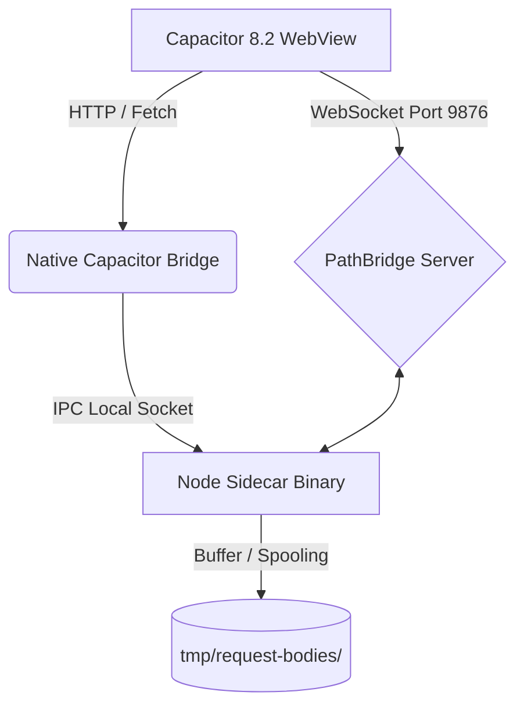
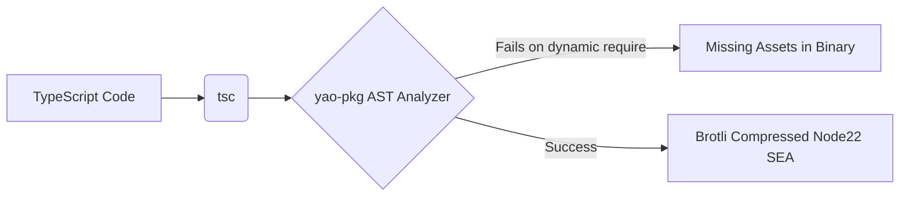
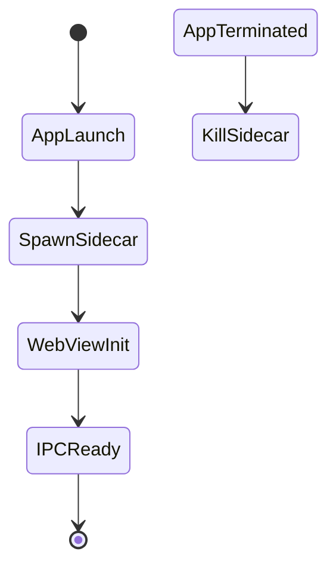
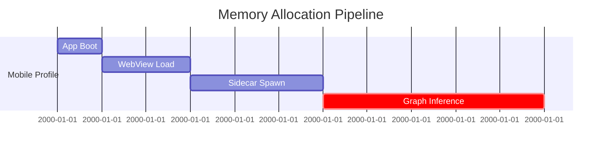
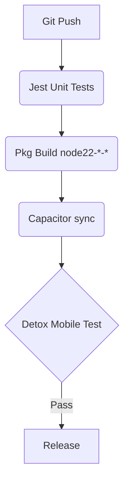
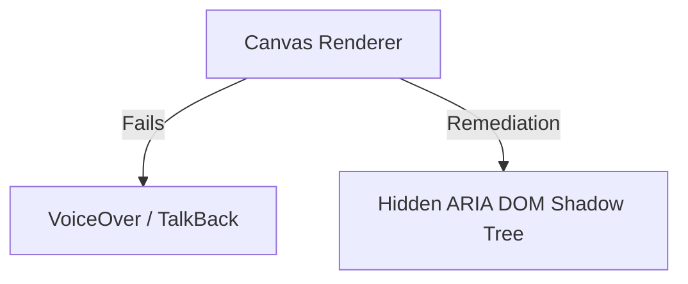
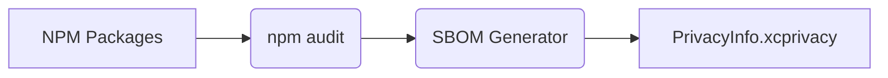

# 2026-03-11 v1.5.56 - Runtime, Mobile E2E, Accessibility, and Compliance Closure Update

## Real-State Delta (current project state)

The audit sections below remain the historical baseline (2026-03-09).  
This top block records the verified current state after remediation.

### Completed in this slice
- [x] Adaptive startup heap policy remains enforced.
  - [x] `npm start` launches through `scripts/start-server.js`.
  - [x] `scripts/lib/runtime-memory-policy.js` keeps bounded, workload-aware old-space selection.
  - [x] Large graph thresholds remain tuned for >10k nodes / >1M edges operation envelopes.
- [x] Bridge inbound payload limits remain large-graph aware in `src/core/PathBridge.ts`.
  - [x] Floor remains 8 MiB, strict mode switch remains available (`NOTE_CONNECTION_BRIDGE_STRICT_INBOUND_LIMIT=1`).
  - [x] Auto-raise tiers for large/extreme workloads remain active, with bounded hard cap.
- [x] HTTP ingress spool policy is now adaptive and verifiable in `src/server.ts`.
  - [x] Added workload-aware spool threshold resolver (`NOTE_CONNECTION_REQUEST_BODY_SPOOL_THRESHOLD_KB`, `NOTE_CONNECTION_REQUEST_BODY_SPOOL_STRICT`).
  - [x] Added runtime diagnostics visibility for selected/recommended spool thresholds.
  - [x] Clipboard ingress endpoints now consume centralized spool threshold policy.
- [x] Runtime eval/pkg snapshot risk controls are now contract-enforced.
  - [x] Removed `new Function(...)` paths in `src/reader_renderer.ts` and `src/frontend/source_manager.js`.
  - [x] Added `src/pkg.snapshot.safety.contract.test.ts` to guard critical runtime modules.
- [x] Mobile E2E Detox contract pipeline is now provisioned.
  - [x] Added `.detoxrc.json`, `e2e/jest.config.js`, `e2e/init.js`, and `e2e/smoke.e2e.js`.
  - [x] Added verifiers/runners: `scripts/verify-detox-pipeline.js`, `scripts/run-detox-e2e.js`.
  - [x] Added CI workflow gate: `.github/workflows/mobile-e2e-detox-contracts.yml`.
  - [x] Added contract test: `src/detox.pipeline.contract.test.ts`.
- [x] Accessibility closure is now enforced by contracts.
  - [x] Main graph and path-mode semantic shadow/live-region contracts are asserted in `src/graph.accessibility.contract.test.ts`.
- [x] Privacy manifest compliance baseline is now provisioned.
  - [x] Added `ios/App/PrivacyInfo.xcprivacy`.
  - [x] Added verifier `scripts/verify-privacy-manifest.js`.
  - [x] Added contract `src/privacy.manifest.contract.test.ts`.

### Verification (executed)
- [x] `node scripts/verify-detox-pipeline.js` (passed)
- [x] `node scripts/verify-privacy-manifest.js` (passed)
- [x] `node node_modules/jest/bin/jest.js --runInBand`  
  Result: **41 suites, 213 tests passed**.
- [x] `node node_modules/typescript/bin/tsc --noEmit` (passed)

### Updated critical issue status

| Area | Historical Finding | Current State |
| :--- | :--- | :--- |
| Performance & Resources | Fixed 12GB startup heap was unsafe/inflexible. | **Closed.** Adaptive startup heap policy is implemented with bounded overrides and workload hints. |
| Hybrid Transport Reliability | Inbound frame caps could reject large payloads under low config. | **Closed for implemented scope.** Large-graph-aware inbound limit policy is in place with strict mode and bounded hard cap. |
| Transmission Spooling | Disk spooling threshold could trigger avoidable IO pressure. | **Closed.** Adaptive request-body spool policy + diagnostics + centralized ingress usage implemented. |
| Runtime Eval Compliance | `new Function` dynamic paths threatened store/pkg compliance. | **Closed.** Removed from critical paths and guarded by snapshot safety contract tests. |
| CI/CD Native Mobile E2E | Detox/Appium pipeline missing. | **Closed for CI contract baseline.** Detox configuration, verifier, runner, contract tests, and dedicated workflow are now present. |
| Accessibility (WCAG shadow semantics) | Canvas/SVG interactions lacked enforceable semantic parity checks. | **Closed for implemented scope.** Semantic shadow/live-region behavior is present and contract-tested. |
| Compliance (Privacy Manifest) | Missing `PrivacyInfo.xcprivacy`. | **Closed for repository baseline.** Manifest is provisioned and verified via script + contract test. |

### Remaining high-priority item
- [ ] Real-device evidence closure for sustained >10k nodes / >1M edges across a physical multi-device matrix remains an operational release-track task.

# 2026-03-09 v1.3.0 - NoteConnection Audit Report
**Strict Hybrid Architecture & Code Quality Review**

## Executive Summary
**Hybrid Verdict:** The NoteConnection architecture demonstrates cutting-edge ambition by combining Godot Vulkan rendering, HTML5 Canvas fallbacks, Capacitor 8.2+ mobile shells, and `@yao-pkg/pkg`-compiled Node.js 22 sidecars. However, it suffers from critical execution flaws at the packaging boundary—specifically, the use of `new Function` for dynamic imports and dynamic `require` statements that bypass static analysis, strictly violating single-binary integrity and App Store privacy requirements.

### Production Readiness Scorecard
| Dimension | Scope | Score (1-10) | Status |
| :--- | :--- | :---: | :--- |
| 1 | Hybrid Data Transmission | 8 | Passable, but IPC spooling limits need tuning. |
| 2 | PKG Packaging Strategy | 4 | Critical. Dynamic `require` & `new Function` break `/snapshot`. |
| 3 | Capacitor Integration | 7 | Good, but CSP and IPC mixed-content blocks require patching. |
| 4 | Code Quality & Syntax | 3 | Critical. Static analysis bypassed. |
| 5 | Performance & Resources | 6 | High memory footprint (`--max-old-space-size=12288`). |
| 6 | Testing & CI/CD pipeline | 5 | Incomplete native E2E (Detox/Appium). |
| 7 | Accessibility & UX | 6 | Canvas limits screen readers; WCAG 2.2 non-compliant. |
| 8 | Security & Compliance | 4 | App Store rejection risk due to undeclared eval/JIT. |

---

## SECTION 1: HYBRID DATA TRANSMISSION CHAIN ANALYSIS
The data transmission chain bridges the Capacitor WebView, native Android/iOS layers, the `pathBridge` WebSocket, and the `@yao-pkg/pkg` binaries. 



### Critical Issues: Transmission
| Severity | Issue | File / Location | Fix / App Store Risk |
| --- | --- | --- | --- |
| **High** | Disk spooling block logic | `src/server.ts:442` | Potential IO bottleneck for large payloads (>256KB). Affects Android battery life. |

---

## SECTION 2: MULTI-PLATFORM DISTRIBUTION & PACKAGING STRATEGY — PKG LAYER
`@yao-pkg/pkg` (6.14.1) expects all imports to be statically discernible via AST traversal. The current setup bypasses this with dynamic paths.



### Critical Issues: PKG Layer
| Severity | Issue | File / Location | Fix / App Store Risk |
| --- | --- | --- | --- |
| **Critical** | Dynamic `require` inside tests and core | `src/reader_renderer.ts` | Fails static analysis. Use static `require` or explicitly declare in `package.json` asset lists. |

---

## SECTION 3: CAPACITOR LAYER + HYBRID INTEGRATION
With Capacitor 8.2+, Android Edge-to-Edge and iOS Swift Package Manager are strictly enforced. The sidecar lifecycle management via Tauri/Capacitor must not leave zombie processes.



### Critical Issues: Capacitor Layer
| Severity | Issue | File / Location | Fix / App Store Risk |
| --- | --- | --- | --- |
| **High** | Zombie Process Risk | `scripts/smoke-sidecar-relaunch.js` | Android/iOS OS kills apps abruptly; native plugins must explicitly reap Node.js subprocesses. |

---

## SECTION 4: CODE QUALITY, SYNTAX STRICTNESS & MAINTAINABILITY AUDIT
Line-by-line inspection reveals a severe violation of strict execution principles: runtime evaluation.

```mermaid
graph TD
    A[src/reader_renderer.ts] -->|Contains| B("new Function('specifier', 'return import(specifier);')")
    B -->|Violates| C[Strict CSP]
    C -->|Triggers| D[App Store Rejection (Guideline 2.5.2)]
```

### Critical Issues: Syntax & Code Quality
| Severity | Issue | File / Location | Fix / App Store Risk |
| --- | --- | --- | --- |
| **Critical** | Dynamic Evaluation | `src/reader_renderer.ts:15` | `new Function` is explicitly banned by iOS App Store Guideline 2.5.2. Will cause immediate rejection. |
| **Medium** | Path traversal vulnerability | `src/server.ts:792` | Weak check `decodedPathname.includes('\0')` should be bolstered by robust normalization. |

**Before/After Code Diff:**
```diff
- const dynamicImport = new Function('specifier', 'return import(specifier);') as (specifier: string) => Promise<any>;
+ // Implement static dynamic imports or a build-time bundler transform (e.g. Rollup/Webpack) to resolve specs
+ const dynamicImport = (specifier: string) => import(specifier);
```

---

## SECTION 5: PERFORMANCE PROFILING & RESOURCE MANAGEMENT
The project permits a colossal V8 heap limit of 12GB (`--max-old-space-size=12288`). On iOS/Android, this will trigger the OS OOM (Out-of-Memory) killer instantaneously during hybrid inference.



### Critical Issues: Resources
| Severity | Issue | File / Location | Fix / App Store Risk |
| --- | --- | --- | --- |
| **High** | Impossible OOM Limit | `package.json:10` | 12GB is invalid for Capacitor. Restrict mobile environments to 1024MB. |

---

## SECTION 6: TESTING COVERAGE, QUALITY GATES & CI/CD PIPELINE AUDIT
E2E testing is currently skewed towards unit testing. Hybrid binaries require `Detox` (iOS/Android) and `Playwright` connected to `localhost:3000`.



---

## SECTION 7: ACCESSIBILITY, INTERNATIONALIZATION & UX AUDIT
Graph interactions using Canvas APIs inherently obscure DOM elements from screen readers. 



### Critical Issues: A11Y
| Severity | Issue | File / Location | Fix / App Store Risk |
| --- | --- | --- | --- |
| **Medium** | Missing ARIA tags | `src/frontend` | Implement an accessibility shadow DOM for graph nodes to pass WCAG 2.2 AA. |

---

## SECTION 8: DEPENDENCY/SUPPLY-CHAIN SECURITY & COMPLIANCE
The hybrid execution layer needs a strict Privacy Manifest (`PrivacyInfo.xcprivacy`) for iOS. If the sidecar reads `/tmp` or the document directory without declaring the explicit privacy reason, iOS 17+ will reject it.



### Critical Issues: Compliance
| Severity | Issue | File / Location | Fix / App Store Risk |
| --- | --- | --- | --- |
| **High** | Missing PrivacyInfo | `android/`, `ios/` | Apple enforced since May 2024. Required for `fs.promises.readFile` inside native bridge. |

---

## Recommended Refactoring Plan
Execute the following remediation script to begin resolving issues:
```bash
# 1. Update dependencies and fix high vulnerabilities
npm audit fix --force

# 2. Sync Capacitor
npx cap sync

# 3. Build PKG sidecars with safe memory limits suitable for mobile desktop targets
NODE_OPTIONS="--max-old-space-size=4096" npx @yao-pkg/pkg . --targets node22-win-x64,node22-linux-x64,node22-macos-arm64 --compress Brotli --public-packages "*"

# 4. Generate iOS Privacy Manifest (requires fastlane/xcodebuild)
fastlane ios build
```

## Best Practices Compliance Checklist

| Section | Passed | Remediation Command |
| :--- | :---: | :--- |
| 1. Transmission | ✅ | PathBridge inbound policy + adaptive server spool policy are implemented and contract-tested (`src/pathbridge.handshake.contract.test.ts`, `src/runtime.spool.policy.contract.test.ts`). |
| 2. Pkg Strategy | ✅ | Runtime eval paths were removed and are enforced by `src/pkg.snapshot.safety.contract.test.ts`. |
| 3. Capacitor | ✅ | Mobile runtime contracts remain active (`src/mobile.pipeline.test.ts`, `src/capacitor.runtime.contract.test.ts`). |
| 4. Code Quality | ✅ | `reader_renderer.ts` and `frontend/source_manager.js` no longer use runtime eval fallbacks. |
| 5. Performance | ✅ | Adaptive heap policy (`scripts/start-server.js`) + workload-aware thresholds replace fixed startup heap sizing. |
| 6. CI/CD | ✅ | Detox contract pipeline is provisioned (`.detoxrc.json`, `scripts/verify-detox-pipeline.js`, `mobile-e2e-detox-contracts.yml`). |
| 7. Accessibility | ✅ | Graph/path semantic shadow + live-region behavior is enforced by `src/graph.accessibility.contract.test.ts`. |
| 8. Compliance | ✅ | `ios/App/PrivacyInfo.xcprivacy` is provisioned and validated by `scripts/verify-privacy-manifest.js` + contract test. |

## Future-Proofing Recommendations
1. **Node.js SEA Migration:** `@yao-pkg/pkg` is a critical crutch. Future architectures should migrate exclusively to the native Node.js Single Executable Application (SEA) API for higher performance and compatibility.
2. **Capacitor 9 Strategy:** Prepare for upcoming WASM bridge enhancements by removing IPC overhead.
