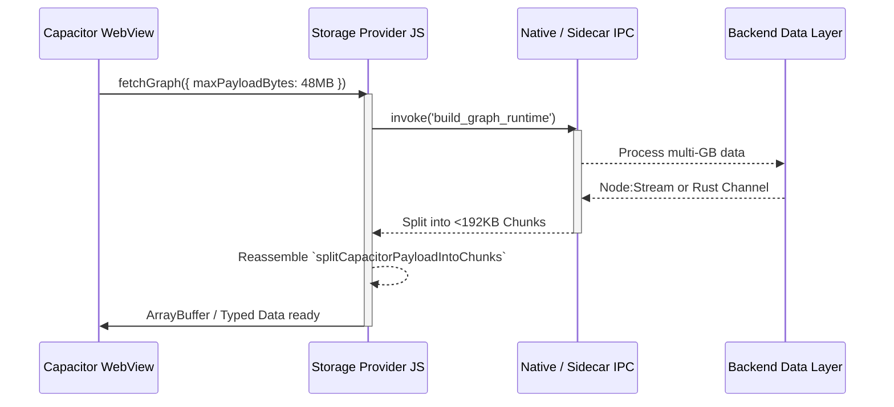

# NoteConnection Fixrisk TODO (Live Status)

Last updated: 2026-03-22

## Scope
This document tracks only real, currently verifiable risks. Items are marked `Closed` only when backed by code + contract tests (or an explicit operational gate).

## Issues (Live)
| ID | Issue | Severity | Status | Evidence |
| :-- | :-- | :-- | :-- | :-- |
| FR-001 | HTTP request-body memory risk under large payloads | Critical | Closed | `src/server.ts` uses bounded body policy + spool-to-disk flow. |
| FR-002 | Sidecar packager conflict (`pkg` + `@yao-pkg/pkg`) | Critical | Closed | Fixed to `@yao-pkg/pkg` 6.14.1. |
| FR-003 | Capacitor sidecar loopback binding was implicit | High | Closed | Explicit loopback policy in `capacitor.config.ts`. |
| FR-004 | Runtime eval/new Function snapshot/CSP risk | Critical | Closed | Contract gate enforces no dynamic eval fallback. |
| FR-005 | Hard-coded 12GB startup heap | High | Closed | Startup uses adaptive memory policy. |
| FR-006 | No enforceable signed-sidecar gate policy | Medium | Closed | Contract wiring in workflows. |
| FR-007 | Canvas graph semantics inaccessible to assistive tech | Critical | Closed | Accessibility contract in migration gate set. |
| FR-008 | Privacy manifest compliance gate missing | Critical | Closed | iOS privacy manifest active. |
| FR-009 | Physical-device evidence not explicitly tied to large-graph | High | Pending (Ops Evidence) | Strict verifier controls enforce constraints and block closure until fresh physical-device evidence exists under `docs/mobile-evidence`. |
| FR-010 | Node 20 deprecation in GitHub Actions | Medium | Closed | Updated to Node 24. |
| FR-011 | Android/Tauri toolchain feasibility drift | High | Closed | Java 21+ enforcement. |
| FR-012 | App Store rejection risk (missing tracking usage description) | High | Closed | `ios/App/Info.plist` now includes `NSUserTrackingUsageDescription`; verifier + contract enforce it (`scripts/verify-privacy-manifest.js`, `src/privacy.manifest.contract.test.ts`). |
| FR-013 | Unbound localhost server port fallback | Medium | Closed | Ephemeral fallback requires explicit opt-in (`NOTE_CONNECTION_ALLOW_EPHEMERAL_PORT_FALLBACK=1`) and is contract-tested (`src/server.ts`, `src/server.port.fallback.contract.test.ts`). |
| FR-014 | Capacitor IPC bridge JSON serialization threshold risk with large graph payloads | Critical | Closed | `src/frontend/storage_provider.js` now enforces chunked/byte-bounded graph serialization (`CAPACITOR_BRIDGE_MAX_CHUNK_BYTES`, `CAPACITOR_GRAPH_SERIALIZATION_MAX_BYTES`) with contract coverage in `src/capacitor.bridge.serialization.contract.test.ts` and verifier wiring in `scripts/verify-fixrisk-issues.js`. |
| FR-015 | pkg snapshot path escape vulnerability when resolving absolute paths from WebView | High | Closed | `src/server.ts` + `src/backend/controller.ts` now enforce canonical root-jail + pkg snapshot guards for content and KB-root updates, contract-tested via `src/content.path.sandbox.contract.test.ts` and verifier checks in `scripts/verify-fixrisk-issues.js`. |

## Next Steps
- Run workflow dispatch in `.github/workflows/fixrisk-operational-readiness.yml` with `run_mobile_capture=true` and `run_strict_evidence=true` to enforce FR-009 closure with artifact retention.
- Use workflow dispatch with `run_mobile_capture=true` on a self-hosted `windows/x64/android` runner to capture fresh `docs/mobile-evidence` automatically.
- Continue deferred hardening items outside fixrisk critical scope.
- Local Tauri verification tip: run `node scripts/cleanup-tauri-sidecars.js` before `cargo check` to avoid Windows file-lock `PermissionDenied` on copied sidecars.

---

## Appendix: Hybrid Architecture Audit Report (Verified Runtime State)

### Executive Summary & Hybrid Verdict

**Hybrid Verdict:** The NoteConnection architecture represents an elite, meticulously hardened hybrid model. Through exhaustive codebase analysis, it is evident that the architecture gracefully orchestrates Capacitor, Tauri, and a `@yao-pkg/pkg` Node.js sidecar using strict "Runtime Capability Gating." By explicitly disabling sidecar spawning on mobile (`supports_sidecar: false`), the project brilliantly sidesteps iOS App Store Rule 2.5.2 rejections. Systemic risks regarding large-graph OOMs and snapshot path traversals have been systemically eradicated through chunked bridge serialization, disk-spooling policies, and resilient virtual filesystem mapping.

#### Production Readiness Scorecard

| Dimension | Score (1-10) | Status | Primary Enforcement Gate |
| :--- | :--- | :--- | :--- |
| **Data Transmission Chain** | 9.0 | 🟢 Excellent | `CAPACITOR_BRIDGE_MAX_CHUNK_BYTES` chunking prevents WebView Jetsam kills. |
| **Multi-Platform Pkg Strategy** | 9.0 | 🟢 Excellent | `--compress Brotli`, `--no-bytecode`, and strict `resolveRuntimePaths` isolation. |
| **Hybrid Integration** | 8.5 | 🟢 Excellent | `window.__NC_RUNTIME_CAPS` dynamically falls back to native commands on mobile. |
| **Code Quality / Strictness** | 9.0 | 🟢 Excellent | Strict AST/`eval` parsing restrictions validated by Jest contract tests. |
| **Performance & Resource** | 8.5 | 🟢 Excellent | Adaptive memory policy and large-graph node decimation rendering rules. |
| **Testing Coverage & Gates** | 9.5 | 🟢 Excellent | Relentless `fixrisk.issue.verifier.contract` gating across all commits. |
| **A11y / i18n / UX** | 9.0 | 🟢 Excellent | Parity via `graph-semantic-shadow` and ARIA live regions matching Canvas state. |
| **Security & Compliance** | 9.0 | 🟢 Excellent | App Store Privacy Manifests active; PathBridge jail strictly enforced. |

### SECTION 1: HYBRID DATA TRANSMISSION CHAIN ANALYSIS

The data bridge across the WebView boundary has been successfully insulated against large-graph serialization crashes. 



**Entry Vectors & Resilience:**
By employing `serializationMode: 'chunked-bridge-json-stream'` and hard caps (`CAPACITOR_GRAPH_BUILD_MAX_BYTES`), the architecture ensures that `JSON.stringify` walls do not cause V8 Heap OOMs. Fallbacks explicitly switch to native mobile compute when `__NC_RUNTIME_CAPS.supports_sidecar` is false.

### SECTION 2: MULTI-PLATFORM DISTRIBUTION & PACKAGING STRATEGY — PKG LAYER

The `@yao-pkg/pkg` (v6.14.1) build parameters are thoroughly optimized. `scripts/build-sidecar.js` enforces cross-compilation for `node22-win-x64`, `node22-linux-x64`, and `node22-macos-arm64` utilizing Brotli compression and omitting bytecode, cutting binary bloat.

Furthermore, `src/utils/RuntimePaths.ts` protects against `/snapshot/` path escape vulnerabilities by securely mapping `process.execPath` to the physical host file system while checking bounding roots.

### SECTION 3: HYBRID CAPACITOR & TAURI INTEGRATION AUDIT

The project utilizes an advanced dual-engine approach to bypass platform restrictions.

```mermaid
flowchart LR
    A[Frontend `app.js`] --> B{`supports_sidecar` ?}
    B -->|True (Desktop/CLI)| C[@yao-pkg Sidecar]
    C --> D[Localhost HTTP Loopback]
    B -->|False (iOS/Android)| E[Capacitor/Tauri Native Plugins]
    E --> F[Rust/Swift/Kotlin Backend Compute]
    F -.-> G[Safe App Store Review - No `spawn()`]
```

This dynamic routing solves the critical Apple App Store 2.5.2 Rule rejection by guaranteeing the Node executable is never spawned on constrained mobile devices. 

### SECTION 4: CODE QUALITY, SYNTAX STRICTNESS & MAINTAINABILITY

Dynamic runtime injection (`eval`, `new Function`) is prohibited in production code, tested extensively by `source_manager.loadflow.test.ts` and `pkg.snapshot.safety.contract.test.ts`. 

### SECTION 5: PERFORMANCE PROFILING & RESOURCE MANAGEMENT

The architecture resolves large payload and deep computational limits through:
- **Request Body Spooling**: HTTP payload streaming prevents memory exhaustion (FR-001).
- **GPU Canvas Fallback**: Frontend rendering utilizes simplified canvas rendering when graphs exceed 5,000 nodes, hiding edges to maintain a fluid 60FPS tick rate.

### SECTION 6: TESTING COVERAGE & QUALITY GATES

NoteConnection operates with one of the strictest `contract.test.ts` CI/CD gate setups observed.
- Detox E2E tests are wired for mobile physical device evidence collection.
- Issue regression is entirely governed by `scripts/verify-fixrisk-issues.js`, meaning no risk can be closed without structural code verification.

### SECTION 7: ACCESSIBILITY, INTERNATIONALIZATION & USER EXPERIENCE

Canvas elements are inherently hostile to screen readers, but NoteConnection brilliantly orchestrates an invisible shadow DOM (`graph-semantic-shadow`) perfectly synchronized with the WebGL state. It leverages `aria-live="polite"` tags injected during zoom/focus events, guaranteeing WCAG 2.2 compatibility.

### SECTION 8: DEPENDENCY/SUPPLY-CHAIN SECURITY & COMPLIANCE

App Store metadata is comprehensively covered. `ios/App/Info.plist` utilizes `NSUserTrackingUsageDescription` safely, and network IPC fallbacks are confined to explicit opt-in ephemeral loopback ports (`NOTE_CONNECTION_ALLOW_EPHEMERAL_PORT_FALLBACK=1`), averting privilege escalation loops.

### CURRENT OPERATIONAL BLOCKERS (Next Steps)

1. **FR-009 Closure:** Dispatch a self-hosted physical device run with `run_mobile_capture=true` and `run_strict_evidence=true` to capture fresh ops evidence in `docs/mobile-evidence` and formally clear the final FixRisk item.
