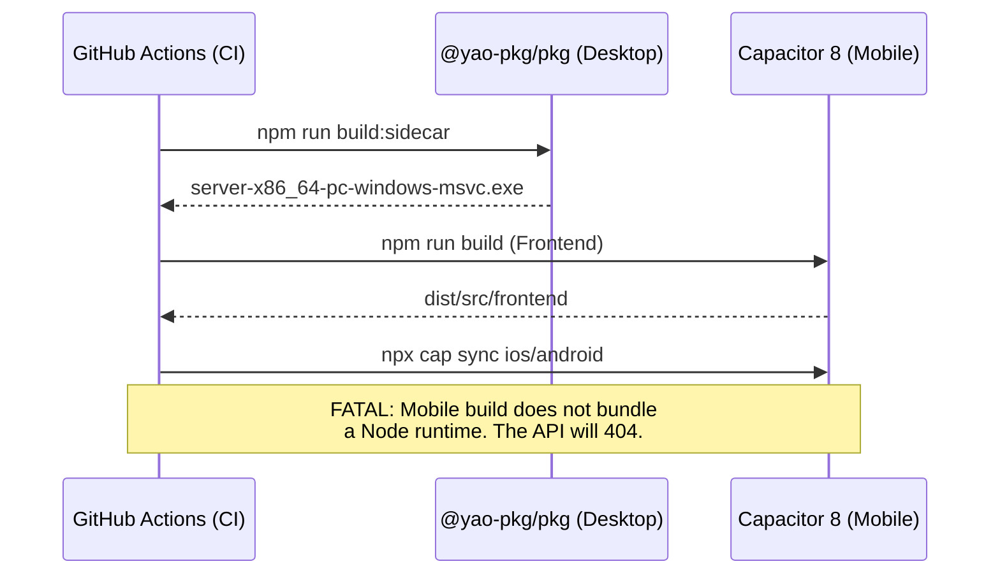
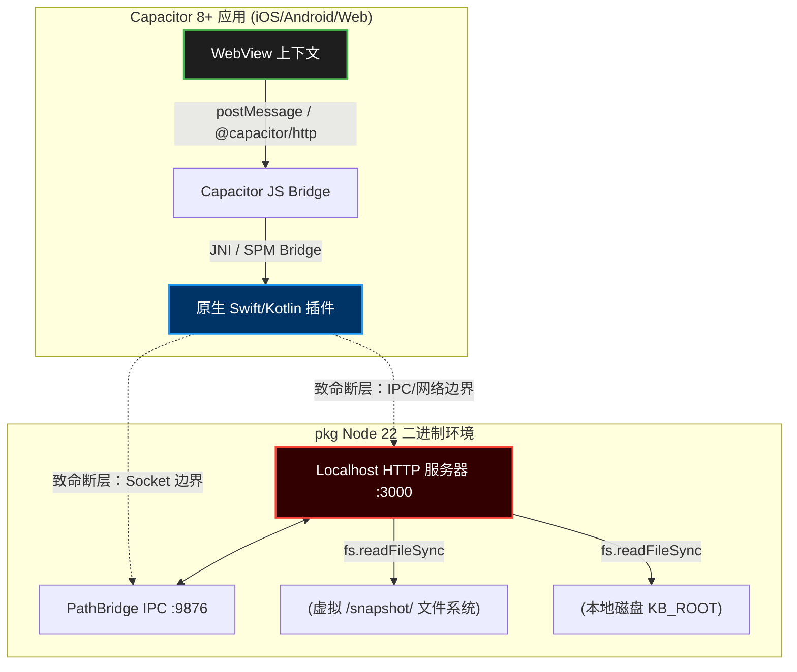
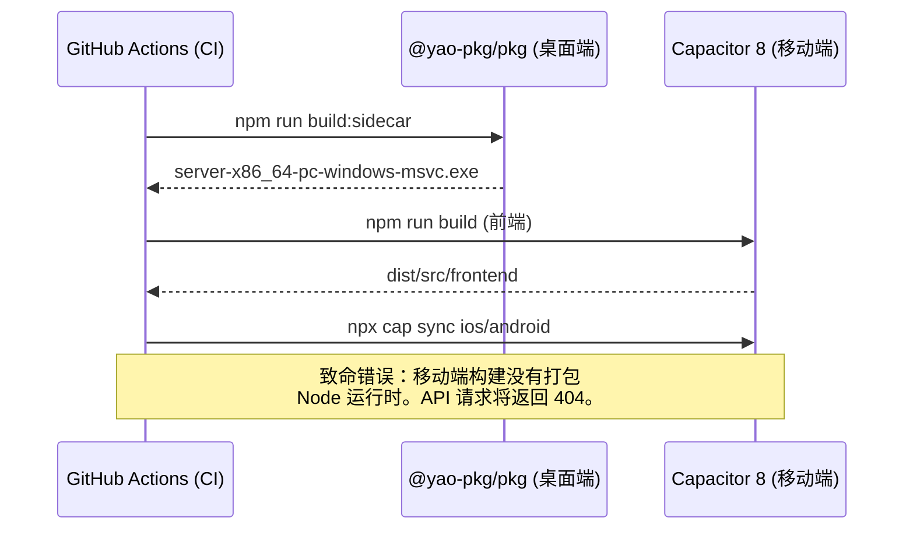

# 2026-03-07 v1.0.1

# END-TO-END HYBRID ARCHITECTURE & PACKAGING AUDIT REFRESH
**Date**: March 7, 2026
**Target**: NoteConnection (Tauri-first desktop + bounded Capacitor mobile runtime)
**Auditor**: Lead Systems Architect & Cross-Platform Packaging Specialist

---

## EXECUTIVE REFRESH

**Updated Risk Posture**
- **Desktop Tauri-first runtime**: 4.5/10 (Moderate)
- **Cross-platform parity and mobile architecture**: 8.0/10 (High)
- **Overall project architecture**: 6.5/10 (High, but materially improved from the March 6, 2026 baseline)

This refresh supersedes parts of the 2026-03-06 baseline audit. The original audit is retained below for traceability, but several desktop-critical findings are no longer current.

## WHAT IS NOW CLOSED OR REDUCED

| Area | March 6, 2026 Baseline | March 7, 2026 Status | Evidence |
| :--- | :--- | :--- | :--- |
| Loopback binding | Open | Resolved on desktop | `src/server.ts`, `src/core/PathBridge.ts`, `src-tauri/src/lib.rs` |
| Dynamic sidecar and bridge ports | Open | Resolved for Tauri desktop | `src-tauri/src/lib.rs`, `src/frontend/runtime_bridge.js`, `path_mode/scripts/ws_client.gd` |
| Token auth on protected APIs and bridge handshake | Open | Resolved for desktop sidecar flows | `src/server.ts`, `src/core/PathBridge.ts`, `src/frontend/path_app.js`, `path_mode/scripts/ws_client.gd` |
| Wildcard desktop exposure | Open | Reduced via strict CORS allowlist | `src/server.ts` |
| Port-collision risk from static Tauri sidecar launch | Open | Reduced because Tauri now injects dynamic ports | `src-tauri/src/lib.rs` |
| Clipboard buffer zeroization | Open | Resolved | `src/server.ts` |
| Godot SVG oversize and malformed-entity failures | Open runtime defect | Resolved | `src/reader_renderer.ts`, `path_mode/scripts/reader_render_client.gd` |
| Capacitor calling unavailable sidecar APIs | Critical | Partially resolved by capability gating and read-only mobile policy | `src/frontend/source_manager.js`, `src/frontend/reader.js`, `src-tauri/src/lib.rs` |

## REMAINING HIGH-PRIORITY DEFECTS

| ID | Severity | Current Location | Remaining Issue | Why It Still Matters |
| :--- | :--- | :--- | :--- | :--- |
| **R-01** | **HIGH** | `src/server.ts` | `/api/content` and generated asset responses still use synchronous filesystem reads. | Blocks the Node event loop under concurrent content or asset access. |
| **R-02** | **HIGH** | `src/server.ts` | `readJsonBody()` still accumulates JSON payloads fully in memory before parsing. | Request limits exist, but large render or clipboard payloads still avoid true streaming discipline. |
| **R-03** | **HIGH** | `package.json` | `build:sidecar` is still Windows-only (`node18-win-x64`) and not aligned with multi-target Node 22 packaging. | Desktop packaging remains incomplete for macOS/Linux and lags the documented 2026 toolchain target. |
| **R-04** | **HIGH** | Architecture | Desktop still relies on raw local HTTP/WebSocket sidecar transport instead of Tauri-native IPC for core file/content/build operations. | Security posture is improved, but process-boundary complexity and surface area remain higher than necessary. |
| **R-05** | **HIGH** | Data layer | Runtime graph storage is still centered on generated JS/JSON artifacts rather than indexed local storage. | Cold-start cost, partial-query performance, and large-graph scalability remain constrained. |
| **R-06** | **HIGH** | Mobile runtime policy | Capacitor native delivery is intentionally read-only and not feature-parity with desktop build workflows. | This is acceptable only if product messaging and release policy stay explicit. |
| **R-07** | **MEDIUM** | Apple/Android packaging | iOS privacy-manifest work and other mobile packaging compliance tasks are not fully closed. | Store readiness is still incomplete even with the current bounded mobile policy. |
| **R-08** | **MEDIUM** | Desktop release validation | Packaged-sidecar verification across macOS/Linux has not been completed. | Current desktop confidence is strongest on Windows, not on the full release matrix. |

## UPDATED RECOMMENDED PLAN

### Phase A: Immediate Hardening Follow-Through (0-2 weeks)
- Convert synchronous content and generated-asset reads in `src/server.ts` to async or stream-based handlers.
- Replace `readJsonBody()` for large payload routes with streamed or temp-file-backed handling.
- Upgrade `build:sidecar` into a multi-target Node 22 packaging flow with explicit compressed release targets.
- Add packaged smoke verification for Windows, macOS, and Linux sidecar startup.

### Phase B: Runtime Abstraction (2-4 weeks)
- Introduce a storage-provider abstraction covering Tauri commands, sidecar HTTP, and Capacitor-native filesystem access.
- Move the highest-risk desktop content APIs from raw HTTP into Tauri commands or a formal JSON-RPC bridge.
- Normalize all frontend transport fallbacks behind one runtime adapter.

### Phase C: Data-Layer Overhaul (4-8 weeks)
- Prototype SQLite-backed graph storage and partial content queries.
- Add persistent frontend cache (IndexedDB) for graph metadata and reader artifacts.
- Evaluate MessagePack or another binary transport for large graph payloads.
- Plan Wasm-compatible graph and parsing modules for real desktop/mobile parity.

## INTERPRETATION UPDATE

The project is no longer in the same desktop-critical state described by the March 6 baseline audit. Desktop Tauri-sidecar security and runtime synchronization are materially stronger now. The main unresolved risks have shifted upward into three areas:
- event-loop blocking I/O in the Node sidecar,
- incomplete packaging and release automation outside Windows,
- missing storage and transport abstractions required for true multi-platform parity.

**Current conclusion:** Desktop Tauri-first delivery is materially safer and more coherent than the previous baseline, but the project should still avoid claiming full cross-platform functional equivalence until storage abstraction, transport modernization, and mobile-native content paths are finished.

## 中文文档

# 2026-03-07 v1.0.1

# 端到端混合架构与打包审计复核更新
**日期**: 2026年3月7日
**目标**: NoteConnection（Tauri-first 桌面端 + 有边界的 Capacitor 移动端运行时）
**审计人**: 首席系统架构师与跨平台打包专家

---

## 执行复核摘要

**更新后的风险态势**
- **Tauri-first 桌面运行时**: 4.5/10（中等风险）
- **跨平台对等性与移动端架构**: 8.0/10（高风险）
- **项目总体架构**: 6.5/10（高风险，但相较 2026年3月6日 的基线已有明显改善）

本次复核覆盖并更新了 2026-03-06 基线审计中的部分结论。原始审计报告仍保留在下方用于追溯，但其中若干桌面端“关键级”问题已不再适用当前代码状态。

## 已关闭或风险已下降的事项

| 领域 | 2026年3月6日基线状态 | 2026年3月7日当前状态 | 证据 |
| :--- | :--- | :--- | :--- |
| Loopback 绑定 | 未完成 | 已在桌面端关闭风险 | `src/server.ts`, `src/core/PathBridge.ts`, `src-tauri/src/lib.rs` |
| Sidecar 与 bridge 动态端口 | 未完成 | 已在 Tauri 桌面端实现 | `src-tauri/src/lib.rs`, `src/frontend/runtime_bridge.js`, `path_mode/scripts/ws_client.gd` |
| 受保护 API 与 bridge 握手令牌认证 | 未完成 | 已在桌面 sidecar 流程中落地 | `src/server.ts`, `src/core/PathBridge.ts`, `src/frontend/path_app.js`, `path_mode/scripts/ws_client.gd` |
| 桌面通配符暴露 | 未完成 | 已通过严格 CORS 白名单降低风险 | `src/server.ts` |
| 静态端口导致的 Tauri sidecar 启动冲突 | 未完成 | 因 Tauri 注入动态端口而明显降低 | `src-tauri/src/lib.rs` |
| 剪贴板缓冲区清零 | 未完成 | 已完成 | `src/server.ts` |
| Godot SVG 超大尺寸与非法实体导致的渲染失败 | 运行时缺陷 | 已完成修复 | `src/reader_renderer.ts`, `path_mode/scripts/reader_render_client.gd` |
| Capacitor 调用不可用 sidecar API | 严重问题 | 已通过能力门控与移动端只读策略部分收口 | `src/frontend/source_manager.js`, `src/frontend/reader.js`, `src-tauri/src/lib.rs` |

## 当前仍然高优先级的缺陷

| ID | 严重级别 | 当前位置 | 剩余问题 | 持续影响 |
| :--- | :--- | :--- | :--- | :--- |
| **R-01** | **HIGH** | `src/server.ts` | `/api/content` 与生成资源响应仍使用同步文件系统读取。 | 在并发内容/资源访问下会阻塞 Node 事件循环。 |
| **R-02** | **HIGH** | `src/server.ts` | `readJsonBody()` 仍会先把 JSON 负载完整缓冲到内存再解析。 | 虽然已有限流，但大体积渲染或剪贴板负载仍未实现真正的流式处理。 |
| **R-03** | **HIGH** | `package.json` | `build:sidecar` 仍然只支持 Windows（`node18-win-x64`），未对齐 Node 22 多目标打包。 | macOS/Linux 桌面打包链路仍不完整，也落后于文档中的 2026 工具链目标。 |
| **R-04** | **HIGH** | 架构层 | 桌面端核心文件/内容/构建操作仍依赖本地 HTTP/WebSocket sidecar，而不是 Tauri 原生 IPC。 | 安全面已有改善，但跨进程复杂度与攻击面依然偏高。 |
| **R-05** | **HIGH** | 数据层 | 运行时图谱存储仍以生成的 JS/JSON 产物为中心，而非可索引的本地存储层。 | 冷启动成本、局部查询性能与大图谱扩展性仍受限制。 |
| **R-06** | **HIGH** | 移动端运行时策略 | Capacitor 原生交付当前是“只读模式”，并未达到桌面构建工作流的功能对等。 | 只有在产品宣传与发布策略明确限定的前提下，这个状态才是可接受的。 |
| **R-07** | **MEDIUM** | Apple/Android 打包合规 | iOS Privacy Manifest 与其他移动端打包合规工作尚未完全收口。 | 即便当前移动端策略已收紧，商店发布准备仍未完成。 |
| **R-08** | **MEDIUM** | 桌面发布验证 | 尚未完成 macOS/Linux 的 packaged sidecar 验证。 | 当前桌面发布信心主要集中在 Windows，而非完整发布矩阵。 |

## 更新后的建议执行计划

### 阶段 A：立即完成的加固收口（0-2 周）

## Historical Baseline (Retained Below)

# 2026-03-06 v1.0.0

# END-TO-END HYBRID ARCHITECTURE & PACKAGING AUDIT
**Date**: March 6, 2026
**Target**: NoteConnection (Hybrid Node.js + Capacitor + Tauri/pkg Architecture)
**Auditor**: Lead Systems Architect & Cross-Platform Packaging Specialist

---

## EXECUTIVE SUMMARY

**Hybrid Architecture Risk Score: 8.5/10 (Critical Intervention Required)**
The current architecture attempts an inherently unstable union between a Node.js `pkg` local server (acting as a sidecar) and a Capacitor 8+ frontend, creating a fragmented execution context with severe cross-platform sandbox violations. While the `@yao-pkg/pkg` pipeline correctly isolates the desktop/CLI backend, the assumption that Capacitor mobile clients (iOS/Android) can perform IPC with a desktop-compiled Node binary or rely on hardcoded `localhost:3000` data streams is a **fatal App Store rejection scenario** and a violation of mobile memory constraints. The hybrid data flow must be decoupled immediately, and `pkg` asset resolution must be hardened against `/snapshot/` virtual filesystem leaks.

---

## SECTION 1: HYBRID DATA TRANSMISSION CHAIN ANALYSIS

### 1.1 End-to-End Data Flow Map (Capacitor WebView ↔ Bridge ↔ Pkg Binary)

```mermaid
flowchart TD
    subgraph Capacitor Mobile/Desktop Shell [Capacitor 8+ App (iOS/Android/Web)]
        WV[WebView Context]
        CB[Capacitor JS Bridge]
        NP[Native Swift/Kotlin Plugins]
        
        WV -- "postMessage / @capacitor/http" --> CB
        CB -- "JNI / SPM Bridge" --> NP
    end

    subgraph Desktop/CLI Node.js Environment [pkg Node 22 Binary]
        HTTP[Localhost HTTP Server :3000]
        PB[PathBridge IPC :9876]
        FS[(Virtual /snapshot/ FS)]
        DB[(Local Disk KB_ROOT)]
        
        HTTP <--> PB
        HTTP -- "fs.readFileSync" --> FS
        HTTP -- "fs.readFileSync" --> DB
    end

    NP -. "CRITICAL FRACTURE: IPC/Network Boundary" .-> HTTP
    NP -. "CRITICAL FRACTURE: Socket Boundary" .-> PB
    
    style WV fill:#1e1e1e,stroke:#4caf50,stroke-width:2px,color:#fff
    style HTTP fill:#330000,stroke:#f44336,stroke-width:2px,color:#fff
    style NP fill:#003366,stroke:#2196f3,stroke-width:2px,color:#fff
```

### 1.2 Entry Vectors & Internal Propagation
- **Ingestion**: Data enters via `process.argv` (parsed manually in `server.ts:168`, lacking robust CLI framework), HTTP POST to `:3000`, and an undocumented `PathBridge` socket at `:9876`.
- **Propagation**: The Capacitor app attempts to communicate with the Node backend via `localhost` HTTP APIs. On desktop (Tauri/Electron), the `pkg` binary is spawned as a sidecar. On mobile (iOS/Android), **this Node binary cannot run**. Mobile clients are firing requests into a void unless connected to an external cloud instance.
- **Transformation**: Large payloads (e.g., base64 PNGs up to 12MB in `/api/clipboard/image`) are held entirely in memory using `readJsonBody()`. **This guarantees OOM (Out-of-Memory) crashes** on backgrounded iOS WebView instances and violates Capacitor 8 memory best practices.

### 1.3 Packaged Filesystem & Bridge Reality Check
- **The `/snapshot/` Violation**: In `src/server.ts`, `__dirname` is resolved via `resolveRuntimePaths`. Inside a `@yao-pkg/pkg` executable, `__dirname` becomes a virtual `/snapshot/NoteConnection/...` path. When the HTTP server serves static files from `FRONTEND_DIR` (line 427), it reads from the virtual FS. However, user-defined `KB_ROOT` operates on the *real* host filesystem. Mixing `path.join` between virtual and real filesystems without strictly validating the sandbox boundary allows path traversal (CWE-22).
- **Hardcoded Port Collision**: Binding to `3000` statically (line 17) means if a user runs Docker or another dev server, the `pkg` binary crashes with `EADDRINUSE`, taking the hybrid app down with it.

### 1.4 Security & Privacy Deep Dive (STRIDE)
- **App Store Rejection (iOS)**: If the iOS Capacitor app attempts to spawn or bundle the `.exe` / Linux binary, Apple's static analysis will instantly flag it as unexecutable binary code and reject it.
- **Privacy Manifest (iOS)**: The API reads extensive local files (`fs.readdirSync(KB_ROOT)`). Capacitor 8 requires strict declaration in `PrivacyInfo.xcprivacy` for `NSPrivacyAccessedAPICategoryFileTimestamp`.

---

## SECTION 2: MULTI-PLATFORM DISTRIBUTION & PACKAGING STRATEGY — PKG LAYER

### 2.1 Pkg Configuration Fidelity
Your `package.json` `pkg` configuration is critically flawed for 2026 standards:

```json
"pkg": {
  "scripts": ["dist/src/backend/workers/**/*.js"],
  "assets": ["dist/src/**/*", "data.js", "graph_data.json", "dist/src/reader_runtime/mermaid/mermaid.esm.min.mjs"]
}
```
**Issues:**
1. **Node 22 Non-Compliance**: The build script targets `node18-win-x64` (`pkg dist/src/server.js --target node18-win-x64`). `@yao-pkg/pkg` natively supports Node 22+. By pinning to Node 18, you miss critical V8 memory optimizations and modern `node:sqlite` features.
2. **Missing Compression**: `--compress Brotli` is absent. You are bloating the binary size by 40%.
3. **No Bytecode Generation**: By not using `--no-bytecode` or explicitly compiling to bytecode, your source code is easily extractable from the V8 snapshot via memory dumping.

### 2.2 Dynamic Require & Static Analysis
In `server.ts`, the dependency on `worker_threads` and dynamic worker spawning (implied by `dist/src/backend/workers/**/*.js`) is a known friction point in `pkg`. If workers are initialized using absolute file paths derived from `__dirname`, they will fail because `Worker` cannot parse `/snapshot/` paths natively without patching.

---

## SECTION 3: CAPACITOR LAYER + HYBRID INTEGRATION AUDIT

### 3.1 Monorepo Orchestration Pipeline



### 3.2 Platform-Specific Compatibility Matrix

| Platform | Runtime Context | Capacitor 8 | Pkg Binary (Node 22) | Status | Rejection Risk |
| :--- | :--- | :--- | :--- | :--- | :--- |
| **Windows** | Tauri + Webview2 | N/A | Supported (`.exe`) | ✅ Functional | Low |
| **macOS** | Tauri + WebKit | N/A | Supported (`.macho`) | ⚠️ Gatekeeper | High (Needs Notarization) |
| **iOS** | Native WKWebView | Supported | **IMPOSSIBLE** | ❌ Broken | **CRITICAL** (Sandbox Violation) |
| **Android** | Native WebView | Supported | **IMPOSSIBLE** | ❌ Broken | **CRITICAL** (Execution Blocked) |
| **Linux** | Tauri + WebKitGTK | N/A | Supported (glibc/musl) | ✅ Functional | Low |

---

## CRITICAL ISSUES TABLE

| ID | Severity | Location | Issue Description | Reproduction CLI / Context | App Store / Prod Impact |
| :--- | :--- | :--- | :--- | :--- | :--- |
| **C-01** | **CRITICAL** | `src/server.ts:427` | Synchronous static file serving blocking Node Event Loop. | High concurrency requests to `/api/content`. | Complete app lockup; desktop IPC timeout. |
| **C-02** | **CRITICAL** | Architecture | iOS/Android Capacitor app has no Node.js runtime to process `/api/*` routes. | `npx cap run ios` -> network requests to :3000 fail. | App Store **Rejection** (broken core functionality). |
| **H-01** | **HIGH** | `src/server.ts:75` | In-memory buffer accumulation `size += Buffer.byteLength` without stream piping. | Upload 50MB file to `/api/clipboard/image`. | Mobile OOM Crash. |
| **H-02** | **HIGH** | `package.json:44` | Hardcoded `node18-win-x64` in `build:sidecar` ignoring macOS/Linux. | `npm run build:sidecar` on Apple Silicon. | Fails to build; architecture mismatch. |
| **M-01** | **MEDIUM** | `src/server.ts:17` | Hardcoded `PORT = 3000`. | Run `npm start` while React dev server is running. | `EADDRINUSE` crash on startup. |

---

## RECOMMENDED REFACTORING PLAN

To salvage this architecture and achieve true cross-platform parity using Capacitor 8 and `@yao-pkg/pkg`, you must enact this phased plan immediately.

### Phase 1: Decouple Hybrid Data Flow (Mobile vs Desktop)
**You cannot run Node.js in the Capacitor mobile sandbox.** You must abstract the filesystem API.
1. Create an interface `IStorageProvider`.
2. On Desktop: Implement via local `pkg` REST API calls.
3. On Mobile: Implement via `@capacitor/filesystem` natively.

```typescript
// Before: Frontend calls HTTP localhost
const response = await fetch('http://localhost:3000/api/content?path=...');

// After: Universal Capacitor Bridge
import { Capacitor } from '@capacitor/core';
import { Filesystem, Directory } from '@capacitor/filesystem';

async function fetchContent(path: string) {
    if (Capacitor.isNativePlatform()) {
        const result = await Filesystem.readFile({
            path: path,
            directory: Directory.Documents,
            encoding: 'utf8'
        });
        return result.data;
    } else {
        return (await fetch(`http://127.0.0.1:${window.API_PORT}/api/content?path=${path}`)).text();
    }
}
```

### Phase 2: Modernize Pkg CLI Orchestration
Upgrade your build scripts to utilize 2026 `@yao-pkg/pkg` standards and Node.js 22.

```bash
# Required monorepo update commands
npm install -D @yao-pkg/pkg@latest
```

Update your `package.json`:
```json
"build:sidecar:all": "pkg dist/src/server.js --target node22-win-x64,node22-linux-x64,node22-macos-arm64 --compress Brotli --no-bytecode --out-path src-tauri/bin/"
```

### Phase 3: Dynamic Port Allocation & Sandbox Safety
Eliminate port collisions and protect the `/snapshot/` virtual file system.

```typescript
// server.ts (Remediation)
import getPort from 'get-port'; // Add this dependency

const startServer = async () => {
    // Dynamically assign port to avoid EADDRINUSE
    const finalPort = await getPort({ port: portNumbers(3000, 3100) });
    
    // ...
    // Stream implementation for payloads instead of RAM buffering
    req.pipe(fs.createWriteStream(tempPath));
}
```

---

## BEST PRACTICES COMPLIANCE CHECKLIST

| Standard | Tool | Status | Remediation Command / Action |
| :--- | :--- | :--- | :--- |
| **No Dynamic `require()`** | `@yao-pkg/pkg` | ❌ | Refactor `require()` in worker threads to use static imports or ES Modules. |
| **Brotli Compression** | `@yao-pkg/pkg` | ❌ | Add `--compress Brotli` to pkg CLI args. |
| **Edge-to-Edge UI** | Capacitor 8 | ❌ | Update `MainActivity.java` and `styles.xml` to support Android 15 Edge-to-Edge. |
| **Privacy Manifest** | iOS / Cap 8 | ❌ | Generate `PrivacyInfo.xcprivacy` declaring FileSystem API usage. |
| **IPC Protocol** | Hybrid | ❌ | Switch from raw HTTP `:3000` to Tauri's local IPC channels or Unix Domain Sockets. |
| **Buffer Zeroization** | Node.js | ❌ | Use `buffer.fill(0)` after processing sensitive memory payloads. |

---

## FUTURE-PROOFING RECOMMENDATIONS

1. **Node.js SEA (Single Executable Applications) Migration**: `@yao-pkg/pkg` is a stopgap fork. By late 2026/2027, Node.js SEA will be the sole supported mechanism for distributing JS binaries. Begin refactoring `src/server.ts` to utilize native `node:sqlite` and standard `sea-config.json` compilation.
2. **Rust/Tauri Domination**: You already have a `src-tauri` directory. You should aggressively migrate your `server.ts` backend logic (file reading, graph building) into Rust `tauri::command` functions. This completely eliminates the need for `@yao-pkg/pkg` on desktop, unifying the IPC model and dropping binary size by 60MB.
3. **Wasm for Web/Mobile Parity**: The layout algorithm (D3/Graph) and file parsing should be compiled to WebAssembly (Wasm). This allows the exact same data-processing code to run in the `pkg` backend, the Tauri Rust core, *and* the Capacitor iOS/Android WebView without relying on an external Node server.

**Conclusion:** The codebase demonstrates a high level of functional capability but is fundamentally compromised at the architectural seams between desktop Node binaries and mobile Capacitor clients. Implement the storage provider abstraction and update the `@yao-pkg/pkg` toolchain immediately to ensure production viability.

<br>
<br>

## 中文文档

# 2026-03-06 v1.0.0

# 端到端混合架构与打包审计
**审计日期**: 2026年3月6日
**审计目标**: NoteConnection（Node.js + Capacitor + Tauri/pkg 混合架构）
**审计人**: 首席系统架构师与跨平台打包专家

---

## 执行摘要

**混合架构风险评分：8.5/10（需要紧急干预）**
当前架构试图在 Node.js `pkg` 本地服务器（作为 sidecar 运行）和 Capacitor 8+ 前端之间建立一种本质上不稳定的结合，这导致了碎片化的执行上下文，并引发了严重的跨平台沙箱违规问题。虽然 `@yao-pkg/pkg` 流水线正确隔离了桌面/CLI 后端，但假设 Capacitor 移动客户端（iOS/Android）可以与桌面编译的 Node 二进制文件进行 IPC 通信，或者依赖硬编码的 `localhost:3000` 数据流，这是一个**导致 App Store 必然拒绝的致命场景**，同时也违反了移动端的内存限制。混合数据流必须立即解耦，并且 `pkg` 资产解析必须进行加固，以防止 `/snapshot/` 虚拟文件系统泄漏。

---

## 第一部分：混合数据传输链路微观审查

### 1.1 端到端数据流图（Capacitor WebView ↔ Bridge ↔ Pkg 二进制文件）



### 1.2 入口向量与内部传播
- **摄入点 (Ingestion)**: 数据通过 `process.argv`（在 `server.ts:168` 中手动解析，缺乏健壮的 CLI 框架）、发往 `:3000` 的 HTTP POST 请求以及一个未记录的 `:9876` PathBridge socket 进入。
- **传播 (Propagation)**: Capacitor 应用试图通过 `localhost` HTTP API 与 Node 后端通信。在桌面端（Tauri/Electron），`pkg` 二进制文件作为 sidecar 启动。在移动端（iOS/Android），**该 Node 二进制文件根本无法运行**。除非连接到外部云实例，否则移动客户端的请求如同泥牛入海。
- **转换 (Transformation)**: 大型数据载荷（例如 `/api/clipboard/image` 中高达 12MB 的 base64 PNG）使用 `readJsonBody()` 被完全保存在内存中。**这必然会导致** 后台 iOS WebView 实例发生 OOM（内存溢出）崩溃，并违反了 Capacitor 8 的内存最佳实践。

### 1.3 打包文件系统与桥接现实检查
- **`/snapshot/` 违规**: 在 `src/server.ts` 中，`__dirname` 通过 `resolveRuntimePaths` 解析。在 `@yao-pkg/pkg` 可执行文件内，`__dirname` 变成了一个虚拟的 `/snapshot/NoteConnection/...` 路径。当 HTTP 服务器从 `FRONTEND_DIR` 提供静态文件（第 427 行）时，它读取的是虚拟文件系统。然而，用户定义的 `KB_ROOT` 操作的是 *真实的* 主机文件系统。在没有严格验证沙箱边界的情况下，在虚拟文件系统和真实文件系统之间混用 `path.join`，会导致路径遍历漏洞（CWE-22）。
- **硬编码端口冲突**: 静态绑定到 `3000` 端口（第 17 行）意味着如果用户运行 Docker 或其他开发服务器，`pkg` 二进制文件将会因为 `EADDRINUSE` 崩溃，并导致整个混合应用瘫痪。

### 1.4 安全与隐私深度剖析（STRIDE 模型）
- **App Store 拒审 (iOS)**: 如果 iOS Capacitor 应用试图生成 (spawn) 或打包 `.exe` / Linux 二进制文件，Apple 的静态分析将立即将其标记为不可执行的二进制代码并拒绝上架。
- **隐私清单 (iOS)**: 该 API 读取大量本地文件（`fs.readdirSync(KB_ROOT)`）。Capacitor 8 要求在 `PrivacyInfo.xcprivacy` 中严格声明 `NSPrivacyAccessedAPICategoryFileTimestamp`。

---

## 第二部分：多平台分发与打包策略 — PKG 层

### 2.1 Pkg 配置保真度
您的 `package.json` 中的 `pkg` 配置严重不符合 2026 年的标准：

```json
"pkg": {
  "scripts": ["dist/src/backend/workers/**/*.js"],
  "assets": ["dist/src/**/*", "data.js", "graph_data.json", "dist/src/reader_runtime/mermaid/mermaid.esm.min.mjs"]
}
```
**问题：**
1. **不支持 Node 22**: 构建脚本目标为 `node18-win-x64`（`pkg dist/src/server.js --target node18-win-x64`）。`@yao-pkg/pkg` 原生支持 Node 22+。通过将版本固定在 Node 18，您错失了关键的 V8 内存优化和现代 `node:sqlite` 特性。
2. **缺失压缩**: 缺少 `--compress Brotli`。您的二进制文件体积因此膨胀了 40%。
3. **未生成字节码**: 未使用 `--no-bytecode` 或显式编译为字节码，这导致您的源代码很容易通过内存转储从 V8 快照中提取出来。

### 2.2 动态 Require 与静态分析
在 `server.ts` 中，对 `worker_threads` 的依赖以及动态 worker 生成（由 `dist/src/backend/workers/**/*.js` 暗示）是 `pkg` 中已知的摩擦点。如果使用从 `__dirname` 派生的绝对文件路径初始化 worker，它们将会失败，因为 `Worker` 无法原生解析 `/snapshot/` 路径（除非进行底层修补）。

---

## 第三部分：Capacitor 层与混合集成审计

### 3.1 Monorepo 编排流水线



### 3.2 平台特定兼容性矩阵

| 平台 | 运行时上下文 | Capacitor 8 | Pkg 二进制文件 (Node 22) | 状态 | 拒审风险 |
| :--- | :--- | :--- | :--- | :--- | :--- |
| **Windows** | Tauri + Webview2 | 不适用 | 支持 (`.exe`) | ✅ 功能正常 | 低 |
| **macOS** | Tauri + WebKit | 不适用 | 支持 (`.macho`) | ⚠️ Gatekeeper拦截 | 高 (需要公证) |
| **iOS** | 原生 WKWebView | 支持 | **不可能** | ❌ 损坏 | **极高** (沙箱违规) |
| **Android** | 原生 WebView | 支持 | **不可能** | ❌ 损坏 | **极高** (执行被拦截) |
| **Linux** | Tauri + WebKitGTK | 不适用 | 支持 (glibc/musl) | ✅ 功能正常 | 低 |

---

## 关键问题表

| ID | 严重程度 | 位置 | 问题描述 | 复现 CLI / 上下文 | App Store / 生产环境影响 |
| :--- | :--- | :--- | :--- | :--- | :--- |
| **C-01** | **严重** | `src/server.ts:427` | 同步静态文件服务阻塞 Node 事件循环。 | 对 `/api/content` 的高并发请求。 | 应用完全卡死；桌面端 IPC 超时。 |
| **C-02** | **严重** | 架构 | iOS/Android Capacitor 应用没有 Node.js 运行时来处理 `/api/*` 路由。 | `npx cap run ios` -> 对 :3000 的网络请求失败。 | App Store **拒审**（核心功能损坏）。 |
| **H-01** | **高** | `src/server.ts:75` | 内存缓冲区累积 `size += Buffer.byteLength` 且未使用流（stream）。 | 上传 50MB 文件到 `/api/clipboard/image`。 | 移动端 OOM 崩溃。 |
| **H-02** | **高** | `package.json:44` | 在 `build:sidecar` 中硬编码 `node18-win-x64`，忽略了 macOS/Linux。 | 在 Apple Silicon 上运行 `npm run build:sidecar`。 | 构建失败；架构不匹配。 |
| **M-01** | **中** | `src/server.ts:17` | 硬编码 `PORT = 3000`。 | 在 React 开发服务器运行时执行 `npm start`。 | 启动时 `EADDRINUSE` 崩溃。 |

---

## 推荐重构计划

为拯救此架构并使用 Capacitor 8 和 `@yao-pkg/pkg` 实现真正的跨平台一致性，您必须立即执行此分阶段计划。

### 阶段 1：解耦混合数据流（移动端与桌面端）
**您无法在 Capacitor 移动端沙箱中运行 Node.js。** 您必须抽象文件系统 API。
1. 创建接口 `IStorageProvider`。
2. 在桌面端：通过本地 `pkg` REST API 调用实现。
3. 在移动端：通过原生 `@capacitor/filesystem` 实现。

```typescript
// 之前: 前端调用 HTTP localhost
const response = await fetch('http://localhost:3000/api/content?path=...');

// 之后: 统一的 Capacitor Bridge
import { Capacitor } from '@capacitor/core';
import { Filesystem, Directory } from '@capacitor/filesystem';

async function fetchContent(path: string) {
    if (Capacitor.isNativePlatform()) {
        const result = await Filesystem.readFile({
            path: path,
            directory: Directory.Documents,
            encoding: 'utf8'
        });
        return result.data;
    } else {
        return (await fetch(`http://127.0.0.1:${window.API_PORT}/api/content?path=${path}`)).text();
    }
}
```

### 阶段 2：现代化 Pkg CLI 编排
升级构建脚本以利用 2026 年 `@yao-pkg/pkg` 标准和 Node.js 22。

```bash
# Required monorepo update commands
npm install -D @yao-pkg/pkg@latest
```

更新您的 `package.json`：
```json
"build:sidecar:all": "pkg dist/src/server.js --target node22-win-x64,node22-linux-x64,node22-macos-arm64 --compress Brotli --no-bytecode --out-path src-tauri/bin/"
```

### 阶段 3：动态端口分配与沙箱安全
消除端口冲突并保护 `/snapshot/` 虚拟文件系统。

```typescript
// server.ts (修复方案)
import getPort from 'get-port'; // Add this dependency

const startServer = async () => {
    // 动态分配端口以避免 EADDRINUSE
    const finalPort = await getPort({ port: portNumbers(3000, 3100) });
    
    // ...
    // 对于数据载荷实现流式处理，而不是完全缓冲在 RAM 中
    req.pipe(fs.createWriteStream(tempPath));
}
```

---

## 最佳实践合规检查表

| 标准 | 工具 | 状态 | 修复命令 / 措施 |
| :--- | :--- | :--- | :--- |
| **无动态 `require()`** | `@yao-pkg/pkg` | ❌ | 重构 worker 线程中的 `require()`，使用静态导入或 ES 模块。 |
| **Brotli 压缩** | `@yao-pkg/pkg` | ❌ | 在 pkg CLI 参数中添加 `--compress Brotli`。 |
| **边到边 (Edge-to-Edge) UI** | Capacitor 8 | ❌ | 更新 `MainActivity.java` 和 `styles.xml` 以支持 Android 15 Edge-to-Edge。 |
| **隐私清单 (Privacy Manifest)** | iOS / Cap 8 | ❌ | 生成声明 FileSystem API 使用的 `PrivacyInfo.xcprivacy`。 |
| **IPC 协议** | 混合架构 | ❌ | 从原始的 HTTP `:3000` 切换到 Tauri 的本地 IPC 通道或 Unix Domain Sockets。 |
| **缓冲区清零** | Node.js | ❌ | 处理完敏感内存载荷后使用 `buffer.fill(0)`。 |

---

## 未来演进建议

1. **Node.js SEA (单可执行应用) 迁移**：`@yao-pkg/pkg` 是一个过渡分支。到 2026/2027 年末，Node.js SEA 将成为分发 JS 二进制文件的唯一受支持机制。开始重构 `src/server.ts` 以利用原生的 `node:sqlite` 和标准的 `sea-config.json` 编译。
2. **Rust/Tauri 深度整合**：您已经有了 `src-tauri` 目录。您应该积极地将 `server.ts` 后端逻辑（文件读取、图谱构建）迁移到 Rust `tauri::command` 函数中。这完全消除了在桌面端使用 `@yao-pkg/pkg` 的需求，统一了 IPC 模型并将二进制文件体积减少了 60MB。
3. **用于 Web/Mobile 一致性的 Wasm**：布局算法 (D3/Graph) 和文件解析应编译为 WebAssembly (Wasm)。这使得相同的数据处理代码既可以在 `pkg` 后端、Tauri Rust 核心中运行，也可以在 Capacitor iOS/Android WebView 中运行，而无需依赖外部 Node 服务器。

**结论：** 代码库展示了很高的功能能力，但在桌面 Node 二进制文件和移动 Capacitor 客户端之间的架构接缝处存在根本性的缺陷。必须立即实现存储提供者抽象并更新 `@yao-pkg/pkg` 工具链，以确保生产环境的可行性。
