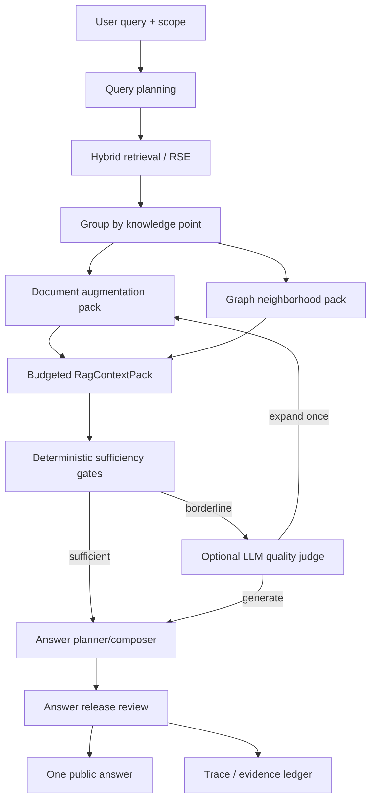
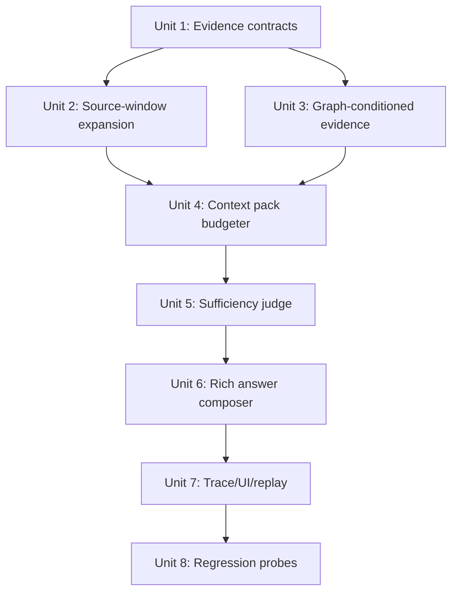
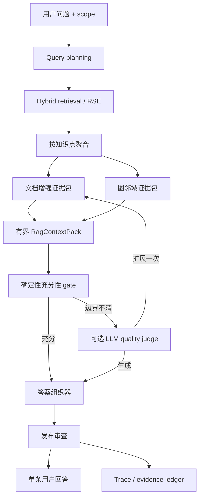

# feat: RSE document-augmented graph RAG answer pipeline

## English

## Overview

This plan upgrades Knowledge Workspace answers from a narrow, release-contracted summary into a bounded evidence-generation pipeline: retrieve precise segments, expand them with document structure, condition the answer on graph neighborhood evidence, run sufficiency/release checks, and publish one user-facing answer while keeping orchestration detail in trace artifacts.

The target is not "longer answers by default." The target is answers that are complete enough for the query, grounded in direct evidence, aware of graph in/out relationships, and observable when the chain degrades.

## Critical Assessment

The proposed "take five paragraphs before and after the matched node" is directionally useful but too blunt as a primary rule. It is also not the maximum source-reading boundary. The source augmentation layer may read the full source document for each selected knowledge point when provenance and scope allow it; the strict cap applies later to the model-visible `RagContextPack`.

- Fixed +/-5 paragraphs can inject irrelevant context when the document has dense sections, tables, Mermaid/code blocks, or repeated headings.
- It scales poorly when multiple spans hit the same knowledge point or when neighbor nodes also need context.
- It can lower faithfulness: more adjacent text increases the chance that generation uses background material as direct support.
- It is still insufficient for tables, definitions, and heading-scoped clauses where the right context is the parent section, header, or structured block rather than five plain paragraphs.

The better implementation is "small-to-big source reading with hard model-visible caps":

- retrieval remains segment/span-level;
- context expansion is adaptive around source spans, heading boundaries, table/code block boundaries, and graph relation intent;
- +/-5 paragraphs is a default local expansion window, not a maximum source-reading range;
- full-document reading is allowed as the maximum augmentation boundary, but only selected fragments enter the context pack;
- every expanded fragment carries provenance and a role: direct support, parent context, neighbor support, conflict, or background.

The proposed multi-stage LLM grading is also risky if placed on the hot path for every turn. It should be a bounded adjudication layer:

- deterministic gates run first;
- LLM quality judging runs only when evidence exists and the deterministic sufficiency score is borderline or when the user asks for a deeper answer;
- the system performs at most one expansion/regeneration cycle per turn unless a future asynchronous review workflow is explicitly introduced.

## Requirements Trace

- R1. Answers must use RSE: retrieve precise evidence spans and keep citation identity stable.
- R2. Answers must use document augmentation: recover parent section, adjacent paragraph/window context, heading path, and source-span provenance.
- R3. Answers must use graph structure: anchor node, in-degree/out-degree profile, predecessor/successor windows, relation kinds, confidence, and neighbor evidence.
- R4. The user sees one answer message; orchestration, scoring, candidate lists, and repair diagnostics stay in backend trace/inspection surfaces.
- R5. LLM-based sufficiency/release judging must be optional, bounded, timeout-protected, and deterministic-fallback safe.
- R6. The plan must preserve current API compatibility: existing `answer`, `assistantBlocks`, `knowledgePoints`, `trace.graphContext`, and `answerReleaseReview` remain valid.
- R7. Weak evidence must produce explicit degraded states such as partial coverage, conflict, stale evidence, or insufficient evidence instead of fluent overreach.
- R8. Runtime probes must include the current `waterglass` cases plus broader graph/neighbor/context-window regression samples.

## Context & Research

### Relevant Code and Patterns

- `src/learning/queryBackend.ts` already performs hybrid retrieval using keyword, semantic similarity, graph anchor distance, graph path confidence, graph intent matching, and temporal filtering.
- `src/learning/KnowledgeLearningPlatform.ts` already centralizes query planning, scope recovery, materialized `KnowledgeQueryItem` creation, evidence span lookup, relation path attachment, and backend trace fields.
- `src/learning/conversationComposer.ts` already merges retrieved items by document/knowledge point and composes a single public answer plus structured assistant blocks.
- `src/learning/graphContextAssembler.ts` already chooses an anchor point, reorders support nodes, builds predecessor/successor windows, filters self-neighbors, and attaches node degree/profile diagnostics.
- `src/learning/answerReleaseReview.ts` already performs deterministic release gates for evidence sufficiency, graph support, intent alignment, structured contradiction, graph order/causal/comparison consistency, temporal validity, diagnostic leakage, and abstention hygiene.
- `src/notemd/LlmProvider.ts` already provides provider-agnostic LLM completion with retries, timeouts via abort signals, OpenAI-compatible/Azure/Anthropic/Google/Ollama transports, and task-level provider selection patterns. The RAG judge should reuse this boundary rather than adding another HTTP client.
- `src/frontend/agent_workspace.js` and `src/frontend/workspace_panes.js` already separate user-facing answer, evidence panes, API status, and operator/debug details.

### Reference Findings

- `ref/codex/AGENTS.md` requires model-visible context to be incremental, bounded, hard-capped, and structured. Any new RAG context pack must enforce per-fragment and total budgets.
- `ref/codex/codex-rs/context-fragments/src/fragment.rs` models injected context as typed fragments with markers. This is a useful precedent for a typed `RagContextPack` instead of ad hoc prompt concatenation.
- `ref/codex/codex-rs/utils/string/src/truncate.rs` preserves beginning and end when truncating. The same principle applies to source windows: preserve local hit context plus terminal qualifiers, not random middle slices.
- `ref/enterprise_agent_platform/docs/part04-vector-knowledge/en/ch20-rag.md` frames RAG as an evidence production pipeline: parsing, indexing, retrieval, ranking, context assembly, generation, citation verification, and feedback.
- `ref/enterprise_agent_platform/docs/part04-vector-knowledge/en/ch19-ocr.md` emphasizes structured source objects and citation spans. Even for Markdown, paragraph, heading, table, code, and source-line provenance must be treated as evidence records, not display hints.
- `ref/enterprise_agent_platform/docs/part04-vector-knowledge/en/ch17.md` warns that reranking/embedding changes must be evaluated with samples, hard negatives, index versions, permission records, and regression ownership. This argues for replayable RAG traces before tuning weights blindly.
- `docs/solutions/agent-knowledge-dag-answer-contract-plan-2026-06-17.md` explicitly notes the current baseline: public answers were intentionally narrow while graph/evidence details lived in assistant blocks and trace. This plan changes that baseline carefully: richer public answers are allowed, but only after bounded context assembly and release review.

## High-Level Technical Design

This illustrates the intended approach and is directional guidance for review, not implementation specification. The implementing agent should treat it as context, not code to reproduce.

## Key Technical Decisions

- Use adaptive source-window expansion with full-document source availability, not unconditional +/-5 paragraph injection.
  Rationale: full-document access lets the assembler recover distant definitions, caveats, tables, and section-level constraints, while the context pack still prevents unrelated text from becoming model-visible by default.
- Add a new evidence context assembly layer instead of putting source expansion into `conversationComposer.ts`.
  Rationale: the owner of evidence completeness is the retrieval/context layer, not the text rendering layer.
- Treat graph neighbors as evidence candidates, not as facts by title alone.
  Rationale: predecessor/successor names are not enough; the answer should cite what those nodes say and how the relation affects the anchor.
- Keep LLM grading optional and bounded.
  Rationale: user machines may not have a configured provider, local models may be slow, and deterministic behavior must remain available.
- Replace the hard public answer contraction with answer profiles and release budgets.
  Rationale: the current 900-character / six-sentence cap prevents the richer answer behavior the user is asking for, but removing all caps would violate the `ref/codex` context discipline.
- Store the full reasoning substrate in trace, not in the public message.
  Rationale: the user wants one answer, but engineers need replayability and layer-level diagnosis.

## Scope Boundaries

- No new vector database is required for this phase.
- No mandatory cloud LLM dependency is introduced.
- No frontend redesign is required beyond surfacing richer answer/status states already carried by backend payloads.
- Full source documents may be read for scoped evidence assembly, but no unbounded prompt assembly or multi-turn hidden loop is allowed.
- No breaking changes to existing Knowledge Workspace response fields are allowed.

## Implementation Units

- [x] **Unit 1: Evidence Context Contracts**

**Goal:** Add stable types for document-augmented evidence without changing current response contracts.

**Implementation status (2026-07-05):** Implemented. `src/learning/types.ts` now defines additive RAG fragment, context-pack, budget, source-decision, and sufficiency-review contracts, and `AgentConversationTrace` carries the new fields optionally for forward compatibility.

**Requirements:** R1, R2, R4, R6.

**Dependencies:** None.

**Files:**
- Modify: `src/learning/types.ts`
- Test: `src/learning/evidenceContextAssembler.test.ts`

**Approach:**
- Add optional additive types such as `RagEvidenceFragment`, `RagContextPack`, `RagEvidenceRole`, `RagContextBudget`, and `RagSufficiencyReview`.
- Fragment roles should separate `direct_support`, `parent_context`, `adjacent_context`, `graph_neighbor_support`, `conflict`, and `background`.
- Each fragment should carry source path, document id, atom id, line/offset range when available, heading path when available, token/char estimate, truncation flag, and citation ids.
- Use hard caps at both fragment and pack level, following the `ref/codex` model-visible context discipline.
- Keep all new fields optional on existing response/trace interfaces.

**Patterns to follow:**
- `AgentConversationGraphContext` optional fields in `src/learning/types.ts`.
- `AnswerReleaseReview` as an additive trace payload.

**Test scenarios:**
- Happy path: a direct citation span becomes a `direct_support` fragment with line/offset provenance.
- Edge case: a missing line range still produces a fragment with source path and citation id.
- Edge case: an oversized fragment is truncated and records truncation metadata.
- Compatibility: existing serialized `AgentConversationResponse` objects remain valid when new fields are absent.

**Verification:**
- TypeScript strict mode accepts the new optional contracts.
- Existing tests using older response shapes require no rewrites beyond intentional new assertions.

- [x] **Unit 2: Source-Window and Document Augmentation Assembler**

**Goal:** Build the small-to-big document context layer around retrieved spans.

**Implementation status (2026-07-05):** Implemented for the deterministic path. `src/learning/evidenceContextAssembler.ts` starts from evidence spans, reads the full source document through a platform-owned resolver, preserves direct support, adds parent/adjacent context, dedupes overlapping windows, and degrades to `source_window_unavailable` when source text is unavailable. Graph-neighbor entries now use the same full-document source view, so selected neighbor documents can emit budgeted `full_document` `graph_neighbor_support` fragments instead of being limited to the matched snippet.

**Requirements:** R1, R2, R7.

**Dependencies:** Unit 1.

**Files:**
- Create: `src/learning/evidenceContextAssembler.ts`
- Test: `src/learning/evidenceContextAssembler.test.ts`
- Modify: `src/learning/KnowledgeLearningPlatform.ts`

**Approach:**
- Start from `KnowledgeQueryItem.evidenceSpans`, not from whole documents.
- Group fragments by knowledge point/document as `conversationComposer.ts` already does for UI hits.
- Expand each hit from a full-document source view into bounded evidence fragments:
  - default: parent heading plus nearest paragraphs around the span;
  - local window: five preceding and five following paragraphs unless evidence routing requires broader source inspection;
  - maximum source boundary: the complete document for the selected knowledge point;
  - model-visible maximum: the `RagContextPack` fragment and total budgets, not the raw source document length;
  - lower cap when the hit is in a table/code/Mermaid block or when multiple spans already cover the same section.
- Preserve direct evidence as a separate fragment; expanded context must not replace the directly cited span.
- Prefer indexed document/atom snapshots already held by `KnowledgeLearningPlatform`; avoid ad hoc filesystem reads unless the existing storage abstraction already provides source text.
- Add deterministic conflict/background classification when adjacent fragments mention the same anchor but diverge on values, temporal qualifiers, or relation terms.

**Patterns to follow:**
- `mergeAgentConversationKnowledgePoints()` for grouping logic.
- `buildKnowledgeCitation()` for stable citation surfaces.
- `stripMarkdownScaffolding()` in `answerReleaseReview.ts` for display-safe extraction, but keep raw evidence in trace.

**Test scenarios:**
- Happy path: a match in the middle of a Markdown section includes direct span, parent heading, and bounded adjacent paragraphs.
- Edge case: repeated identical snippets use source offset/line range to choose the correct local window.
- Edge case: Mermaid/code fences are not injected wholesale into public answer context.
- Edge case: multiple spans in one document dedupe overlapping windows.
- Edge case: a graph-neighbor evidence span can recover same-document neighbor qualifiers beyond the matched span while remaining inside `RagContextPack` budgets.
- Failure path: missing source provenance degrades to direct snippet only and marks `source_window_unavailable`.

**Verification:**
- The assembler produces a bounded context pack for `waterglass` without duplicating the same knowledge point.
- Direct support remains identifiable after augmentation.

- [x] **Unit 3: Graph-Conditioned Neighbor Evidence**

**Goal:** Attach ranked evidence from graph in-degree/out-degree neighborhoods to the answer basis.

**Implementation status (2026-07-05):** Implemented for the deterministic path. `KnowledgeLearningPlatform.agentConversation()` materializes graph-neighbor query items from graph context windows/supporting ids and sends them through the evidence assembler as `graph_neighbor_support` fragments. `graphContextAssembler.ts` now owns intent-specific predecessor/successor window ranking before evidence assembly, combining relation-kind priority, confidence, fact provenance, anchor-equivalent filtering, and bibliography exclusion. It also ranks graph connection paths by the same intent policy, so compare answers do not promote a procedural/application path over an available analogy/contrast path. Graph-neighbor evidence now has snippet-level direct support plus full-document-aware neighbor-context fragments, which makes the "complete document is the maximum source boundary" rule apply symmetrically to direct and graph evidence. A regression test now locks the compare-intent behavior where contrast evidence beats a higher-confidence procedural sequence edge, and the runtime conversation probe `graphintent_compare_neighbor_selection_en` locks the end-to-end analogy-vs-procedural selection path.

**Requirements:** R3, R7.

**Dependencies:** Unit 1, Unit 2.

**Files:**
- Modify: `src/learning/graphContextAssembler.ts`
- Modify: `src/learning/KnowledgeLearningPlatform.ts`
- Test: `src/learning/graphContextAssembler.test.ts`
- Test: `src/learning/evidenceContextAssembler.test.ts`

**Approach:**
- Keep `graphContextAssembler.ts` responsible for anchor selection, degree/profile, predecessor/successor windows, and relation ranking.
- Add evidence handles for top graph neighbors instead of only titles:
  - default: up to three predecessors and three successors;
  - allow up to five only for explicit deep/explain requests or high-confidence graph paths;
  - rank by relation kind, confidence, provenance, query intent, source evidence availability, and non-bibliography filters.
- For each selected neighbor, request Unit 2 source expansion from the complete neighbor document, then admit only budgeted graph-neighbor fragments into the model-visible pack.
- Distinguish relation explanation from neighbor content:
  - "why this predecessor matters" comes from relation kind/path;
  - "what the predecessor says" comes from neighbor evidence fragments.
- Continue filtering self-neighbors and anchor-equivalent titles.

**Patterns to follow:**
- `buildWindowNodes()` scoring and self-neighbor filtering in `graphContextAssembler.ts`.
- `buildAnchorGraphProfile()` for degree and centrality profile.

**Test scenarios:**
- Happy path: anchor has two useful predecessors and one successor; context pack includes neighbor evidence with relation metadata.
- Edge case: anchor-equivalent neighbor is filtered even if it has a different atom id.
- Edge case: low-confidence or bibliography-like neighbors are excluded from answer basis.
- Edge case: graph ops unavailable still returns document-only context and records fallback.

**Verification:**
- Graph-derived answer statements can be traced to both relation metadata and source evidence fragments.

- [x] **Unit 4: Budgeted RAG Context Pack**

**Goal:** Convert document and graph fragments into a model-visible context payload with strict budgets.

**Implementation status (2026-07-05):** Implemented. `src/learning/ragContextPack.ts` enforces role priority, per-fragment limits, total limits, middle truncation that preserves head/tail context, and traceable include/truncate/drop source decisions.

**Requirements:** R4, R5, R6.

**Dependencies:** Unit 2, Unit 3.

**Files:**
- Create: `src/learning/ragContextPack.ts`
- Test: `src/learning/ragContextPack.test.ts`
- Modify: `src/learning/types.ts`

**Approach:**
- Build a pack with sections: query intent, anchor profile, direct evidence, document augmentation, graph neighbor evidence, conflicts/limitations, citation map.
- Apply per-fragment and total-pack limits. Use approximate token estimates rather than character-only limits.
- Preserve beginning and end when truncating long fragments, following the `ref/codex` truncate utility precedent.
- Record budget decisions in trace: included, truncated, dropped, and reason.
- Never allow a single evidence item to dominate the context.

**Patterns to follow:**
- `ref/codex/codex-rs/utils/string/src/truncate.rs` for middle truncation semantics.
- Existing `knowledgeRun.quality.gates` for traceable budget outcomes.

**Test scenarios:**
- Happy path: direct support and graph evidence fit within budget and retain citation map.
- Edge case: one oversized parent section is middle-truncated and marked.
- Edge case: many neighbor fragments trigger deterministic dropping by role priority.
- Compatibility: pack is stored in trace/artifacts, while public answer remains one message.

**Verification:**
- Context assembly cannot produce unbounded prompt input.

- [x] **Unit 5: Sufficiency Judge and One-Step Evidence Recovery**

**Goal:** Decide whether the assembled context can support a complete answer, and recover once when it cannot.

**Implementation status (2026-07-05):** Implemented. `src/learning/ragSufficiencyJudge.ts` provides deterministic sufficiency gates, explicit degradation states, and an injected optional LLM judge hook. `src/learning/ragSufficiencyProviderJudge.ts` wires that hook through the existing `LlmProviderClient` / NoteMD settings boundary with task key `ragSufficiencyJudge`, strict JSON parsing, bounded timeout, zero retries, and deterministic fallback on timeout or malformed provider output. Malformed completion text now rejects at the provider-judge adapter boundary so the reviewer catch path records a stable `llm_judge_failed:*` reason instead of silently erasing provider failure evidence. `KnowledgeLearningPlatform.agentConversation()` now performs at most one bounded recovery assembly/review pass when the first context pack is recoverably `borderline` or `insufficient`, then records `ragRecovery` and `recoveryAttempted` without changing the one-message public answer contract.

**Requirements:** R5, R7.

**Dependencies:** Unit 4.

**Files:**
- Create: `src/learning/ragSufficiencyJudge.ts`
- Create: `src/learning/ragSufficiencyProviderJudge.ts`
- Test: `src/learning/ragSufficiencyJudge.test.ts`
- Test: `src/learning/ragSufficiencyProviderJudge.test.ts`
- Modify: `src/learning/KnowledgeLearningPlatform.ts`
- Modify: `src/learning/types.ts`
- Modify: `src/notemd/types.ts` with additive task key `ragSufficiencyJudge`.

**Approach:**
- Run deterministic gates first:
  - direct evidence coverage;
  - query-intent coverage;
  - graph support when the answer mentions graph structure;
  - citation availability for each key claim;
  - context budget compliance;
  - conflict/staleness detection.
- Add optional LLM judging through the existing `LlmProviderClient` boundary:
  - only when a provider is configured and the deterministic score is borderline;
  - fixed JSON schema output;
  - short timeout and low retry count;
  - no hidden chain-of-thought storage;
  - failure falls back to deterministic decision.
- Permit at most one recovery pass:
  - inspect additional full-document sections and admit only budgeted fragments;
  - add one more graph neighbor per direction if evidence is thin;
  - increase parent-context priority if direct evidence lacks definitions.
- If still insufficient, return a partial answer with explicit missing evidence state rather than fabricating completeness.

**Patterns to follow:**
- `LlmProviderClient.complete()` retry and provider abstraction.
- `answerReleaseReview.ts` deterministic gates and additive review payload.

**Test scenarios:**
- Happy path: deterministic sufficiency passes and no LLM call is required.
- Borderline path: provider-backed LLM judge can revise the sufficiency status without changing the public one-message contract.
- Recovery path: first pass can be recoverably borderline; second bounded assembly admits additional full-document-aware fragments and produces a sufficient answer basis.
- Failure path: provider timeout or malformed JSON falls back to deterministic partial/insufficient state and leaves a replayable judge-failure reason.
- Guardrail: judge cannot trigger unbounded recursive expansion.
- Error path: malformed LLM JSON is rejected by the adapter and recorded as judge failure without contaminating the answer.

**Verification:**
- Runtime latency remains bounded and the system is usable without configured LLM provider.

- [ ] **Unit 6: Rich Single-Message Answer Composer**

**Goal:** Generate a more complete public answer from the RAG context pack while preserving one-message UX.

**Implementation status (2026-07-06):** Partially implemented. `conversationComposer.ts` now uses `RagContextPack` and `RagSufficiencyReview` to build a richer deterministic one-message draft from direct support, document augmentation, and graph-neighbor evidence, then passes that pack/review into `answerReleaseReview.ts`. Release review now treats RAG fragments as grounding candidates, evaluates the additive `rag_answer_completeness` gate, enforces the `rag_claim_citation_support` release gate against citation-backed RAG fragments, filters prompt/preamble artifacts from public RAG clause selection, and can revise contracted or weakly grounded definition answers from direct/document/graph RAG clauses instead of falling back to citation-only summaries. The platform/composer path now applies deterministic definition, compare, how-to, and generic profiles: compare-style planner queries extract both operands for boosting and traceability, explicit scope is not hard-narrowed to only title-hit document ids, four direct-support clauses are reserved for the compared sides, compare evidence is ranked by operand and fragment coverage, and Mermaid comparison labels are converted into readable evidence instead of being discarded; how-to answers reserve enough direct, parent, and graph-neighbor budget to keep concrete steps, prerequisites, downstream checks, and failure handling in one public answer; generic answers now use query-term coverage ranking and a two-direct-support budget so broad prompts keep the most relevant grounded clauses instead of generic preambles. `KnowledgeLearningPlatform.agentConversation()` now also builds additive `answerClaimCitations` trace/artifact records from the final public answer, mapping each sentence-level claim to supporting citation ids, RAG fragment ids, source paths, and a supported/weak/unsupported status without exposing those orchestration details in the chat message. `WorkspaceExportBundle` deep-clones this mapping so replay/export consumers can audit grounding without sharing mutable runtime references. The remaining gap is more natural synthesis over label-heavy evidence, broader profile-specific release budgets, and larger replay/runtime corpora that stress weakly supported but lexically similar claims.

**Requirements:** R4, R6, R7.

**Dependencies:** Unit 5.

**Files:**
- Modify: `src/learning/conversationComposer.ts`
- Modify: `src/learning/answerReleaseReview.ts`
- Modify: `src/learning/KnowledgeLearningPlatform.ts`
- Modify: `src/export/WorkspaceExportBundle.ts`
- Test: `src/learning/conversationComposer.test.ts`
- Test: `src/learning/answerReleaseReview.test.ts`
- Test: `src/learning/KnowledgeLearningPlatform.test.ts`
- Test: `src/export/WorkspaceExportBundle.test.ts`

**Approach:**
- Replace the current three-sentence draft bias with answer profiles:
  - `definition`: direct definition, mechanism, important attributes, graph position, caveats;
  - `how_to`: prerequisites, ordered steps, downstream branches, failure modes;
  - `compare`: shared anchor, branch differences, evidence-backed contrast;
  - `generic`: answer, support, graph/context caveat.
- Use the context pack to structure the answer; do not ask the LLM to rediscover evidence from raw concatenated text.
- Keep public answer bounded; compare now has deterministic operand-aware per-role evidence budgets, including four direct-support slots before graph contrast clauses; how-to has a deterministic 3/1/2 direct/document/graph budget for steps, prerequisites, downstream checks, and failure modes; generic has a deterministic 2/2/1 budget plus query-term coverage ranking. Broader release-budget calibration remains pending beyond the current six-sentence / 900-character release cap.
- Add claim-to-citation mapping internally even if UI shows a compact citation list. This is now represented by optional `answerClaimCitations` trace/export records keyed by sentence-level public-answer claims, citation ids, fragment ids, and source paths.
- `answerReleaseReview.ts` validates completeness and support through the additive RAG role gate plus the `rag_claim_citation_support` release gate, which contracts drafts when a sentence-level public claim is weakly covered or unsupported by citation-backed RAG fragments. Broader profile-specific completeness gates remain pending.

**Patterns to follow:**
- `buildScopedConversationAnswer()` as the current owner of public answer shape.
- `reviewAnswerRelease()` as the final release gate.

**Test scenarios:**
- Happy path: `what is waterglass?` returns definition, composition, key properties, graph predecessor/successor context, and citations without duplicate knowledge points.
- Compare path: `compare water glass and plastic cup` preserves direct evidence for both compared sides, keeps readable Mermaid-label evidence without leaking fenced blocks, and only then adds bounded graph-neighbor contrast context.
- How-to path: `how to calibrate prism alignment?` preserves ordered steps, prerequisites, downstream verification, and failure handling from the RAG pack instead of collapsing to a generic overview.
- Generic path: `tell me about optical bench drift` ranks direct evidence by query coverage, keeps the reference-beam and centroid-delta support, and avoids generic preamble leakage.
- Edge case: graph context exists but neighbor evidence is weak; answer names graph limitation instead of overstating.
- Edge case: sufficient direct evidence but no graph ops; answer remains grounded without graph claims.
- Error path: release review catches unsupported graph-order or causal claims.
- Regression path: release review contraction preserves RAG direct, document-augmentation, and graph-neighbor clauses instead of shrinking back to citation-only summaries.
- Claim mapping path: final answer claims retain supported citation ids, direct RAG fragment ids, and source paths in trace/artifacts while the chat still renders one message.
- Claim release path: unsupported public RAG claims such as unsupported material/origin properties fail `rag_claim_citation_support` and are revised out of the public answer.
- Preamble path: prompt artifacts such as "all reasoning" or "final output language" are filtered from RAG-grounded public revisions.
- Compatibility: `structured_answer.directAnswer` equals the final public answer.

**Verification:**
- The user receives one richer message; internal scoring and orchestration stay in trace/artifacts.
- `answerClaimCitations` is additive and optional, and export cloning does not share mutable citation/fragment/source arrays with runtime trace objects.

- [ ] **Unit 7: Trace, Status, and Evidence Ledger**

**Goal:** Make the pipeline debuggable and replayable without exposing backend clutter in the chat answer.

**Implementation status (2026-07-07):** Partially implemented. Backend trace and knowledge-run artifact payloads now include `ragContextPack`, `ragSufficiencyReview`, `ragRecovery`, and additive `ragFailureClassifications`; `ragRecovery` records before/after source-decision status counts and before/after sufficiency reasons so engineers can see whether recovery was triggered by dropped/truncated fragments or provider-judge fallback even when the final recovered pack no longer contains those decisions. `ragFailureClassifications` maps observed issues onto stable pipeline stages compatible with the enterprise-agent framing: `parsing_source`, `retrieval`, `context_assembly`, `graph_evidence`, `generation`, `citation_verification`, and the reserved `indexing`, `reranking`, `permission_scope` stages. `RagContextPack` carries a stable additive `replayId` derived from the normalized selected-evidence payload rather than `generatedAt`, so equivalent packs can be correlated across runtime probes, export bundles, and the frontend evidence pane without exposing raw fragments in chat. `scripts/verify-knowledge-workspace-runtime.js` summarizes and validates the core RAG fields; `src/frontend/agent_workspace.js` and `src/frontend/workspace_panes.js` now surface localized RAG status labels, localized degradation states, localized source-boundary labels, a compact "Evidence status" summary, replay id, role counts, budget/degradation/recovery state, sufficiency, and failure stages without rendering raw fragment text. The API status row now shows recovered RAG turns as localized status plus degradation state instead of raw `sufficient+recovered` strings. `WorkspaceExportBundle` deep-clones RAG context/review/recovery/classification trace fields, including replay id, recovery source-decision counts, reason arrays, and classification evidence arrays, so export replay material is preserved without sharing mutable runtime references. Broader replay tooling across larger corpora remains follow-up work.

**Requirements:** R4, R7, R8.

**Dependencies:** Unit 6.

**Files:**
- Modify: `src/learning/types.ts`
- Modify: `src/learning/KnowledgeLearningPlatform.ts`
- Modify: `src/frontend/agent_workspace.js`
- Modify: `src/frontend/workspace_panes.js`
- Test: `src/agent_workspace.frontend.test.ts`
- Test: `src/export/WorkspaceExportBundle.test.ts`

**Approach:**
- Add trace fields for RAG context pack summary, budget decisions, sufficiency decision, recovery action, judge result, and degradation state.
- Keep user-visible status compact: scope, evidence status, citation count, graph context status, and whether a recovery/degraded answer occurred.
- Store replay material in `knowledgeRun` / export surfaces.
- Keep failure classification compatible with `ref/enterprise_agent_platform`: parsing/source, indexing, retrieval, reranking, context assembly, graph evidence, generation, citation verification, permission/scope.

**Patterns to follow:**
- Existing `answerReleaseReview` trace and knowledge-run artifact storage.
- Existing API status panel tests in `src/agent_workspace.frontend.test.ts`.

**Test scenarios:**
- Happy path: status shows evidence-ready and graph-ready without showing raw internal prompt.
- Degraded path: status shows partial/insufficient evidence with actionable reason.
- Export path: workspace export preserves RAG context/review/recovery trace fields and compact replay ids without mutable reference leakage.
- Compatibility: older frontend payloads without RAG trace still render.

**Verification:**
- Engineers can identify which RAG stage failed without asking the user to inspect raw JSON.

- [ ] **Unit 8: Regression Corpus and Runtime Probes**

**Goal:** Prevent "better answer" work from regressing retrieval, graph correctness, latency, or UI compatibility.

**Implementation status (2026-07-07):** Partially implemented. New unit tests cover evidence assembly, context budgeting, stable RAG context replay ids, sufficiency judging, provider-backed judge timeout/schema handling, bounded one-step recovery, RAG-aware answer release review, persistence compatibility, richer composer behavior, platform integration, export RAG trace preservation, frontend RAG grounding display, localized degraded RAG status display, RAG failure-stage classification, and `waterglass` regression expectations, including the compare-runtime case `waterglass_compare_materials_en`. The runtime verifier now supports per-case scoped document-id requirements: strict scoped ids remain the default, while the compare case can opt out only when source path, workspace, or corpus boundaries still prove it stayed inside the intended scope. It can also assert graph successor-window titles and relation kinds, including required and forbidden successor titles, so runtime probes can verify graph-neighbor selection instead of only answer text. Answer-term assertions are now case-insensitive to avoid false misses for casing-only differences. The regression corpus now also includes `contextbudget_source_window_truncation_en`, backed by `Knowledge_Base/contextbudget/context budget probe.md`, to verify that full-document source reading and model-visible context truncation remain separate observable states and that budget pressure is classified as `context_assembly`. It also includes `contextoverflow_no_provider_budget_drop_en`, backed by `Knowledge_Base/contextoverflow/overflow budget probe.md`, to verify deterministic no-provider answering, final `fragment_dropped` source-decision visibility under dense same-document evidence, and `context_assembly` failure-stage visibility. The runtime case `contextoverflow_malformed_provider_judge_fallback_en` configures an isolated local OpenAI-compatible fixture that returns malformed judge JSON, passes per-case `topK`, and verifies that the answer path remains deterministic, performs one bounded recovery pass, records `llm_judge_failed` in `ragRecovery.beforeReasons`, and exposes runtime-only `generation` failure-stage classification. The runtime case `contextoverflow_timeout_provider_judge_fallback_en` uses the same scoped dense-evidence corpus with a delayed local fixture to verify provider timeout fallback, one bounded recovery pass, deterministic final review, `llm_judge_failed:RAG sufficiency judge timed out.` recovery trace, and runtime-only `generation` failure-stage classification. The runtime case `graphintent_compare_neighbor_selection_en`, backed by `Knowledge_Base/graphintent`, verifies that compare intent selects analogy successors for material comparison, excludes the high-overlap procedural successor from the graph window, keeps `graph_neighbor_support` in the pack, includes at least one `full_document` graph-neighbor support fragment, and avoids leaking the procedural path into the public answer. The runtime cases `graphintent_missing_neighbor_source_window_en` and `graphintent_multi_neighbor_source_loss_en` use the same graph-backed corpus with per-path source-unavailable injection to verify that graph-neighbor direct spans remain visible but cannot satisfy graph evidence when the full source window is unavailable; the multi-neighbor case explicitly requires two separate `source_window_unavailable` decisions, proving per-neighbor document loss remains observable instead of collapsing into a single coarse missing-source state. The runtime case `conflicting_multi_document_evidence_probe_en`, backed by `Knowledge_Base/ragmulticonflict`, verifies that two scoped documents with contradictory calibration-tolerance facts produce a cross-document `conflict` fragment, keep both values in the one public answer, and classify the degradation under `context_assembly`. The runtime case `full_document_scan_remote_conflict_probe_en`, backed by `Knowledge_Base/ragfullscan`, verifies the corrected source-boundary rule: two selected documents are read completely, remote appendix facts outside the matched opening spans participate in structured conflict analysis, and the local paragraph window remains only a context-selection heuristic before the budgeted `RagContextPack` cap. Source-decision reasons include `graph_neighbor_support`, sufficiency stays `borderline/partial_coverage` with `graph_neighbor_evidence_missing` for graph source loss, and failure classification includes both `parsing_source` and `graph_evidence`. Focused hard-negative tests also cover single- and multi-neighbor graph source-window unavailability, stale-offset repeated-snippet disambiguation through line provenance, cross-document comparable-fact conflicts at the assembler and conversation-regression layers, and localized evidence-pane/API-status rendering for degraded or recovered RAG turns. The verifier now isolates NoteMD settings through a temporary config directory, can assert valid `ragctx_*` replay ids for RAG cases, minimum RAG source-decision counts, source-decision reason fragments, sufficiency reason fragments, minimum full-document fragment counts by role, required RAG failure stages, recovery-before source-decision counts, recovery-before reason fragments, deterministic/no-provider judge flags, recovery flags, degradation states, and graph successor-window expectations. The broader runtime probe corpus and large-corpus hard-negative samples remain follow-up work.

**Incremental status (2026-07-06):** The compact and spaced `waterglass` runtime probes now explicitly require release-generation failure evidence for both `query_intent_alignment` and `rag_claim_citation_support`, and reject prompt/preamble leakage such as `所有推理过程`, `最终输出`, `遵从您的指示`, `all reasoning`, and `final output` in the public answer. This makes the claim-level citation gate and public-clause artifact filter part of runtime acceptance, not only unit coverage. The conflict hard-negative slice now detects same-subject numeric and date/year source contradictions when the conflicting facts are adjacent or non-adjacent inside the same scoped section in `evidenceContextAssembler.ts`, and it now also compares structured facts across the complete content of selected source documents. Runtime probes now cover `conflicting_adjacent_evidence_probe_en`, `conflicting_nonadjacent_section_evidence_probe_en`, `conflicting_release_date_evidence_probe_en`, `conflicting_multi_document_evidence_probe_en`, and `full_document_scan_remote_conflict_probe_en`, so full-document augmentation cannot silently flatten section-level, cross-document, or remote appendix measurement/release-date contradictions into one stable value merely because they sit outside the local paragraph window. `conversationComposer.ts` now consumes `conflict` fragments directly, so both sides of a detected contradiction are included in the single public answer instead of being left only in trace. The graph-neighbor source-unavailable hard-negative now has both unit and runtime coverage for single- and multi-neighbor loss: unavailable neighbor source windows are attributed to `graph_neighbor_support`, the multi-document runtime probe requires two unavailable neighbor-document decisions, the assembler test records both missing neighbor documents independently, `graph_neighbor_evidence_missing` fires, and a title/direct-span-only neighbor cannot satisfy graph evidence. The relation-ambiguity slice now makes `graphContextAssembler.ts` prefer intent-aligned graph-window candidates before admitting high-confidence but mismatched structural relations: compare windows use `contrast` / `analogy` candidates when present, while sparse graphs still fail open to structural neighbors and expose aligned/misaligned candidate counts in graph diagnostics. The runtime verifier now asserts those diagnostics for the `graphintent` compare cases, so a future regression that re-admits the procedural successor without aligned-neighbor evidence will fail at runtime acceptance instead of only unit coverage. The repeated-snippet slice now adds `repeated_snippet_target_section_probe_en`, backed by `Knowledge_Base/ragrepeatedspan`, to verify that full-document trace retention does not force distractor-section clauses into the one public answer; `conversationComposer.ts` and `answerReleaseReview.ts` now apply leaf-heading-aware document/graph clause selection for non-compare public answers while leaving compare evidence selection backward-compatible. The conflict slice now also adds `conflicting_state_status_evidence_probe_en`, backed by `Knowledge_Base/ragstateconflict`, and a conservative state/status fact extractor for explicit paired categorical values such as `enabled` / `disabled`; this extends coverage beyond measurement/date without claiming unconstrained semantic contradiction detection. Larger hard-negative corpora, broader semantic conflict patterns, broader multi-document missing-neighbor corpora, and broader relation-ambiguity corpora remain open.

**Condition-qualified increment (2026-07-06):** `temporal_scoped_state_status_probe_en`, `temporal_scoped_release_date_probe_en`, and `temporal_scoped_planned_release_date_probe_en`, backed by `Knowledge_Base/ragtemporalqualifier`, plus `temporal_cross_document_planned_release_date_probe_en`, backed by `Knowledge_Base/ragtemporalcrossscope`, now verify that explicitly current, historical, and planned/future-qualified state/status or release-date facts remain separate comparable scopes. The public answer can use the current fact, the historical or planned fact stays available as scoped evidence, and the RAG pack must not emit a false `conflict` fragment, including when the current and planned dates are read from separate scoped documents through the full-document cross-document conflict scanner. The release-review path now also keeps generic graph-profile narration such as predecessor/successor window labels out of RAG-grounded public answers unless that content is present as citation-backed RAG evidence. This closes four controlled false-positive classes while leaving broader condition-qualified facts and unconstrained semantic contradiction detection as follow-up work.

**Environment-qualified increment (2026-07-07):** `evidenceContextAssembler.ts` now extends comparable-fact subject keys with explicit deployment-environment scopes such as `staging`, `production`, `development`, `qa`, `uat`, `sandbox`, `preview`, and `canary` when those words appear in environment/deployment phrasing. `environment_scoped_state_status_probe_en`, backed by `Knowledge_Base/ragenvironmentqualifier`, verifies that `enabled in the staging environment` and `disabled in the production environment` stay as environment-qualified evidence rather than a false `conflict` fragment. `environment_scoped_ownership_identity_probe_en`, backed by the same corpus, extends that guard to controlled ownership identity facts: staging `Release Ops` and production `Rollback Team` owners remain separate environment-qualified evidence. This is intentionally a conservative qualifier guard, not open-domain condition understanding: conflicts within the same environment still remain comparable, and unqualified state or ownership identity conflicts still degrade as before.

**Version-qualified increment (2026-07-07):** `evidenceContextAssembler.ts` now extends comparable-fact subject keys with explicit version scopes when source sentences use conservative `version N` / `vN` phrasing. `version_scoped_state_status_probe_en`, backed by `Knowledge_Base/ragversionqualifier`, verifies that `enabled in version 1.0` and `disabled in version 2.0` stay as version-qualified evidence rather than a false `conflict` fragment. `version_scoped_ownership_identity_probe_en`, backed by the same corpus, extends that guard to controlled ownership identity facts: version-1.0 `Release Ops` and version-2.0 `Rollback Team` owners remain separate version-qualified evidence. The guard is deliberately narrow: same-version contradictions and unqualified state/status or ownership identity contradictions remain comparable and still degrade through the existing conflict path.

**Platform-qualified increment (2026-07-07):** `evidenceContextAssembler.ts` now extends comparable-fact subject keys with explicit platform scopes when source sentences use conservative Windows/macOS/Linux/Android/iOS/web/desktop/mobile platform phrasing. `platform_scoped_state_status_probe_en`, backed by `Knowledge_Base/ragplatformqualifier`, verifies that `enabled on the Windows platform` and `disabled on the Android platform` stay as platform-qualified evidence rather than a false `conflict` fragment. `platform_scoped_ownership_identity_probe_en`, backed by the same corpus, extends that guard to controlled ownership identity facts: Windows `Release Ops` and Android `Rollback Team` owners remain separate platform-qualified evidence. The guard is intentionally scoped to explicit OS/platform/runtime labels: same-platform contradictions and unqualified state/status or ownership identity contradictions remain comparable and still degrade through the existing conflict path.

**Temporal ownership increment (2026-07-07):** `temporal_scoped_ownership_identity_probe_en`, backed by `Knowledge_Base/ragtemporalqualifier`, verifies that the same condition-qualified false-positive guard also applies to controlled ownership identity facts. A current `Release Ops` deployment owner and a historical `Rollback Team` deployment owner remain separate temporal-scope evidence, while same-scope or unqualified ownership identity contradictions still use the existing conflict path.

**Cross-document condition-scoped ownership increment (2026-07-07):** `cross_document_environment_scoped_ownership_identity_probe_en`, `cross_document_version_scoped_ownership_identity_probe_en`, and `cross_document_platform_scoped_ownership_identity_probe_en`, backed by `Knowledge_Base/ragconditionownercrossscope`, verify that the full-document cross-document conflict scanner preserves environment-, version-, and platform-qualified owner facts across separate scoped documents. The scanner still emits conflicts for unqualified or same-scope ownership identity contradictions; this slice only prevents false positives when the qualifying scope is explicit in the source evidence.

**Full-document ownership identity increment (2026-07-07):** `full_document_identity_scan_remote_conflict_probe_en`, backed by `Knowledge_Base/ragidentityfullscan`, verifies the corrected source-boundary rule for controlled ownership identity facts specifically: the matched opening spans can omit the `Release Ops` and `Rollback Team` owner values, while both selected scoped documents are still read completely, remote appendix facts still produce bounded cross-document `conflict` evidence, and the public answer remains a single message. This keeps +/-5 paragraphs as a local context-selection heuristic, not the maximum source-reading boundary; model-visible context is still capped by `RagContextPack`.

**Endpoint conflict increment (2026-07-07):** `evidenceContextAssembler.ts` now recognizes a conservative `endpoint` comparable-fact class for explicit endpoint/url/uri/route subjects whose values are path- or URL-shaped. `conflicting_endpoint_evidence_probe_en`, backed by `Knowledge_Base/ragendpointconflict`, verifies that `/api/v1/hooks` and `/api/v2/hooks` in one scoped section produce a `conflict` fragment, `borderline/conflict` sufficiency, and `context_assembly` classification. `full_document_endpoint_scan_remote_conflict_probe_en`, backed by `Knowledge_Base/ragendpointfullscan`, verifies the corrected source-boundary rule for endpoint facts specifically: the matched opening spans can omit the `/api/v1/hooks` and `/api/v2/hooks` values, while the full selected documents are still scanned and the remote appendix facts still produce a bounded `conflict` fragment. `environment_scoped_endpoint_probe_en`, backed by `Knowledge_Base/ragendpointqualifier`, verifies the hard negative: staging and production endpoint values stay environment-qualified evidence. The endpoint extractor deliberately treats route path segments such as `/v1/` as value text rather than version scopes, while same-environment or unqualified endpoint contradictions remain comparable; it still does not infer endpoint compatibility.

**Dependency conflict increment (2026-07-07):** `evidenceContextAssembler.ts` now recognizes a conservative `dependency` comparable-fact class for explicit dependency/package/provider/driver/runtime/library/module/plugin/adapter subjects. `conflicting_dependency_evidence_probe_en`, backed by `Knowledge_Base/ragdependencyconflict`, verifies that SQLite and PostgreSQL storage dependency facts in one scoped section produce a `conflict` fragment, `borderline/conflict` sufficiency, and `context_assembly` classification instead of publishing one stable dependency. `conflicting_multi_document_dependency_evidence_probe_en`, backed by `Knowledge_Base/ragdependencymulticonflict`, verifies the same fact class across two scoped source documents: the complete selected documents are read, the cross-document `conflict` fragment preserves both values, and the public answer remains one message. `full_document_dependency_scan_remote_conflict_probe_en`, backed by `Knowledge_Base/ragdependencyfullscan`, verifies the corrected source-boundary rule for dependency facts specifically: the matched opening spans can omit the SQLite/PostgreSQL values, while the full selected documents are still scanned and the remote appendix facts still produce a bounded `conflict` fragment. `environment_scoped_dependency_probe_en`, backed by `Knowledge_Base/ragdependencyqualifier`, and `version_scoped_dependency_probe_en`, backed by `Knowledge_Base/ragdependencyversionqualifier`, verify the hard negatives: staging/production and version-1.0/version-2.0 dependency values stay condition-qualified evidence. This extends controlled engineering-dependency coverage while deliberately avoiding open-domain package semantics or transitive dependency resolution.

**Format conflict increment (2026-07-07):** `evidenceContextAssembler.ts` now recognizes a conservative `format` comparable-fact class for explicit format/schema/encoding/serialization/content-type/mime-type subjects. `conflicting_format_evidence_probe_en`, backed by `Knowledge_Base/ragformatconflict`, verifies that JSON and YAML payload format facts in one scoped section produce a `conflict` fragment, `borderline/conflict` sufficiency, and `context_assembly` classification instead of publishing one stable payload format. `full_document_format_scan_remote_conflict_probe_en`, backed by `Knowledge_Base/ragformatfullscan`, verifies the corrected source-boundary rule for format facts specifically: the matched opening spans can omit the JSON/YAML values, while the full selected documents are still scanned and the remote appendix facts still produce a bounded `conflict` fragment. `environment_scoped_format_probe_en`, backed by `Knowledge_Base/ragformatqualifier`, verifies the hard negative: staging JSON and production XML payload format facts stay environment-qualified evidence. This extends controlled configuration-format coverage while deliberately avoiding open-domain protocol or schema-compatibility inference.

**Protocol conflict increment (2026-07-07):** `evidenceContextAssembler.ts` now recognizes a conservative `protocol` comparable-fact class for explicit protocol/transport-protocol/wire-protocol subjects. `conflicting_protocol_evidence_probe_en`, backed by `Knowledge_Base/ragprotocolconflict`, verifies that HTTP/1.1 and WebSocket transport protocol facts in one scoped section produce a `conflict` fragment, `borderline/conflict` sufficiency, and `context_assembly` classification instead of publishing one stable transport protocol. `full_document_protocol_scan_remote_conflict_probe_en`, backed by `Knowledge_Base/ragprotocolfullscan`, verifies the corrected source-boundary rule for protocol facts specifically: the matched opening spans can omit the HTTP/1.1/WebSocket values, while the full selected documents are still scanned and the remote appendix facts still produce a bounded `conflict` fragment. `environment_scoped_protocol_probe_en`, backed by `Knowledge_Base/ragprotocolqualifier`, verifies the hard negative: staging HTTP/2 and production gRPC transport protocol facts stay environment-qualified evidence. This extends controlled protocol coverage while deliberately avoiding route-version inference, endpoint compatibility claims, or open-domain protocol negotiation semantics.

**Location conflict increment (2026-07-07):** `evidenceContextAssembler.ts` now recognizes a conservative `location` comparable-fact class for explicit location/site/region/zone/room/rack/slot/bay subjects. `conflicting_location_evidence_probe_en`, backed by `Knowledge_Base/raglocationconflict`, verifies that Rack A vs Rack B placement facts in one scoped section produce a `conflict` fragment, `borderline/conflict` sufficiency, and `context_assembly` classification. `full_document_location_scan_remote_conflict_probe_en`, backed by `Knowledge_Base/raglocationfullscan`, verifies the corrected source-boundary rule for location facts specifically: the matched opening spans can omit Rack A and Rack B values, while both selected scoped documents are still read completely and remote appendix placement facts still produce bounded cross-document `conflict` evidence. `temporal_scoped_location_probe_en`, backed by `Knowledge_Base/ragtemporalqualifier`, verifies the opposite hard negative: current and historical placement facts remain condition-qualified evidence and do not produce a false conflict. This extends controlled semantic conflict coverage beyond measurement/date/state while deliberately avoiding a claim of open-domain semantic contradiction detection.

**Quantity conflict increment (2026-07-07):** `evidenceContextAssembler.ts` now recognizes a conservative `quantity` comparable-fact class for explicit unitless operational subjects such as count, limit, threshold, budget, quota, capacity, size, window, attempts, and retries. `conflicting_quantity_limit_evidence_probe_en`, backed by `Knowledge_Base/ragquantityconflict`, verifies that `retry limit is 3` and `retry limit is 5` inside one scoped section produce a `conflict` fragment, `borderline/conflict` sufficiency, and `context_assembly` classification instead of publishing one stable retry limit. `full_document_quantity_scan_remote_conflict_probe_en`, backed by `Knowledge_Base/ragquantityfullscan`, verifies the corrected source-boundary rule for unitless quantity facts specifically: the matched opening spans can omit the `3` and `5` retry-limit values, while both selected scoped documents are still read completely and remote appendix limit facts still produce bounded cross-document `conflict` evidence. This extends structured conflict coverage to unitless operational limits while keeping extraction deliberately narrow.

**Answer-profile budget increment (2026-07-06):** `KnowledgeLearningPlatform.agentConversation()` now resolves a bounded first-pass RAG answer profile from the user query. Ordinary turns keep the existing base context budget (`14` fragments, `1400` chars per fragment, `5600` total chars), while explicit deep/explain/analyze requests use a wider but still capped profile (`24` fragments, `1600` chars per fragment, `9000` total chars) plus the larger paragraph window and graph-neighbor limit before any recovery pass. The runtime verifier and conversation regression contract can now assert `expectedRagBudget`; `contextoverflow_deep_profile_budget_en`, backed by `Knowledge_Base/contextoverflow`, verifies that deep answer requests expand the evidence budget without switching to an unbounded pack or exposing orchestration details in the public answer.

**Causal answer-profile increment (2026-07-07):** `KnowledgeLearningPlatform.agentConversation()` now gives why/cause/reason/mechanism queries a middle-width first-pass RAG profile (`20` fragments, `1500` chars per fragment, `7600` total chars), with a slightly wider paragraph window and graph-neighbor limit, without requiring the user to ask for an explicit deep answer. `conversationComposer.ts` now classifies these turns as `causal_explain` and keeps up to two direct-support, two document-context, and two graph-neighbor evidence sentences in the single public answer. `causal_answer_profile_budget_en`, backed by `Knowledge_Base/ragcausalprofile`, verifies that the runtime path still reads the complete scoped source document, keeps the model-visible pack bounded, and surfaces mechanism plus downstream evidence without exposing orchestration details.

**Requirements:** R8.

**Dependencies:** Unit 7.

**Files:**
- Modify: `src/learning/evidenceContextAssembler.ts`
- Modify: `src/learning/KnowledgeLearningPlatform.ts`
- Modify: `src/learning/KnowledgeWorkspaceConversationRegression.ts`
- Modify: `scripts/verify-knowledge-workspace-runtime.js`
- Test: `src/learning/KnowledgeWorkspaceConversationRegression.test.ts`
- Test: `src/learning/KnowledgeLearningPlatform.test.ts`
- Test: `src/learning/conversationComposer.test.ts`
- Test: `src/learning/answerReleaseReview.test.ts`

**Approach:**
- Keep `waterglass` compact/spaced queries as acceptance probes.
- Keep scoped document ids mandatory by default; allow explicit compare cases to relax that requirement only when a separate scoped boundary is still verified.
- Add tests for:
  - evidence-rich definition answer;
  - compare material answer that preserves both operands from direct/document/Mermaid evidence;
  - missing neighbor evidence, including source-window unavailable graph neighbors that must not pass as complete graph evidence from title/direct-span context alone;
  - duplicated same-document spans;
  - conflicting adjacent, same-section non-adjacent, cross-document structured measurement/date evidence, remote facts discovered by full-document scan outside the local paragraph window, and stale-offset repeated-snippet provenance;
  - context budget truncation through `contextbudget_source_window_truncation_en`;
  - deterministic no-provider budget drop through `contextoverflow_no_provider_budget_drop_en`;
  - provider timeout fallback through `contextoverflow_timeout_provider_judge_fallback_en`;
  - malformed provider judge fallback through `contextoverflow_malformed_provider_judge_fallback_en`;
  - intent-specific graph-neighbor selection through `graphintent_compare_neighbor_selection_en`;
  - graph-neighbor source-window unavailability through `graphintent_missing_neighbor_source_window_en` and multi-neighbor source loss through `graphintent_multi_neighbor_source_loss_en`;
  - intent-misaligned graph successor filtering at the graph-window layer, including fail-open behavior when no compare-aligned neighbor exists;
  - controlled location conflicts, full-document remote location scanning, and temporal/current-vs-historical false-positive guards through `conflicting_location_evidence_probe_en`, `full_document_location_scan_remote_conflict_probe_en`, `temporal_scoped_location_probe_en`, and `temporal_scoped_ownership_identity_probe_en`;
  - explicit environment-qualified state false-positive guards through `environment_scoped_state_status_probe_en`;
  - explicit version-qualified state false-positive guards through `version_scoped_state_status_probe_en`;
  - explicit platform-qualified state false-positive guards through `platform_scoped_state_status_probe_en`;
  - cross-document condition-scoped ownership false-positive guards through `cross_document_environment_scoped_ownership_identity_probe_en`, `cross_document_version_scoped_ownership_identity_probe_en`, and `cross_document_platform_scoped_ownership_identity_probe_en`;
  - controlled endpoint/route conflict, full-document remote endpoint scanning, and environment-qualified endpoint false-positive coverage through `conflicting_endpoint_evidence_probe_en`, `full_document_endpoint_scan_remote_conflict_probe_en`, and `environment_scoped_endpoint_probe_en`;
  - controlled dependency/package/provider conflict, cross-document dependency conflict, full-document remote dependency scanning, and environment/version-qualified dependency false-positive coverage through `conflicting_dependency_evidence_probe_en`, `conflicting_multi_document_dependency_evidence_probe_en`, `full_document_dependency_scan_remote_conflict_probe_en`, `environment_scoped_dependency_probe_en`, and `version_scoped_dependency_probe_en`;
  - controlled format and protocol full-document remote scanning through `full_document_format_scan_remote_conflict_probe_en` and `full_document_protocol_scan_remote_conflict_probe_en`;
- explicit unitless quantity/limit conflict coverage through `conflicting_quantity_limit_evidence_probe_en`;
- full-document remote unitless quantity scanning through `full_document_quantity_scan_remote_conflict_probe_en`;
- cross-document plural unitless quantity conflict coverage through `conflicting_multi_document_quantity_evidence_probe_en`;
  - same-document and cross-document controlled ownership identity conflict coverage through `conflicting_ownership_identity_evidence_probe_en` and `conflicting_multi_document_ownership_identity_evidence_probe_en`;
  - full-document remote ownership identity scanning through `full_document_identity_scan_remote_conflict_probe_en`;
  - causal answer-profile budgeting through `causal_answer_profile_budget_en`;
  - full-document graph-neighbor augmentation through minimum role/boundary fragment-count assertions;
  - graph self-neighbor filtering;
  - answer release with richer public answer.
- Add latency budget assertions for the no-LLM path and bounded timeout assertions for the LLM-judge path.

**Patterns to follow:**
- Existing `verify-knowledge-workspace-runtime.js` waterglass case.
- Existing targeted tests for `graphContextAssembler`, `conversationComposer`, and `answerReleaseReview`.

**Test scenarios:**
- Runtime: `what is waterglass?` returns a complete answer using direct evidence, document augmentation, and graph context.
- Runtime: compact and spaced `waterglass` probes require `rag_claim_citation_support` in failed release gates and reject prompt/preamble artifacts from the public answer.
- Runtime: compact Chinese/English alias queries do not fall back to scoped miss.
- Runtime: `compare water glass and plastic cup` returns one grounded answer containing both glass and plastic evidence with `direct_support`, `parent_context`, and `graph_neighbor_support` roles.
- Runtime: `what is context budget probe?` reads the scoped full source document and records at least one `fragment_truncated` source decision in the RAG context pack.
- Runtime: `what is overflow budget probe?` stays deterministic without an LLM judge and records at least one final `fragment_dropped` source decision in the bounded `RagContextPack`; recovery source-decision counts remain replayable when a recovery pass occurs.
- Runtime: malformed provider judge JSON does not block the answer path; the fake OpenAI-compatible fixture is called once, recovery remains bounded, and `ragRecovery.beforeReasons` records `llm_judge_failed`.
- Runtime: `graphintent_missing_neighbor_source_window_en` keeps graph-neighbor direct spans observable while recording `source_window_unavailable` with a `graph_neighbor_support` reason, keeping sufficiency at `borderline/partial_coverage`, and classifying the issue under `parsing_source` plus `graph_evidence`.
- Runtime: `graphintent_multi_neighbor_source_loss_en` requires two selected graph-neighbor source documents to be unavailable at once and asserts at least two `source_window_unavailable` decisions, so multi-document evidence loss remains visible per neighbor rather than being collapsed into a single coarse graph-evidence failure.
- Runtime: no LLM provider still produces deterministic grounded answer.
- Runtime: provider judge timeout does not block the answer path; the fake OpenAI-compatible fixture is called once, recovery stays bounded, and `ragRecovery.beforeReasons` records `llm_judge_failed`.
- Runtime: `compare brittle glass vessel with polymer cup material behavior` selects analogy graph successors from `Knowledge_Base/graphintent`, excludes the high-overlap procedural successor from `successorWindow`, produces at least one `full_document` `graph_neighbor_support` fragment, and keeps the public answer focused on material comparison rather than procedural path narration.
- Runtime: `graphintent_compare_neighbor_selection_en`, `graphintent_missing_neighbor_source_window_en`, and `graphintent_multi_neighbor_source_loss_en` require graph diagnostics to report at least two intent-aligned successor candidates, at least one intent-misaligned successor candidate, and no misaligned-successor fallback.
- Runtime: `what is calibration tolerance conflict probe?` reads `Knowledge_Base/ragconflict/calibration tolerance conflict probe.md`, preserves both adjacent tolerance statements as conflict evidence, returns a `borderline/conflict` sufficiency review, and exposes `context_assembly` failure classification without publishing one stable tolerance value.
- Runtime: `what is remote calibration tolerance conflict probe?` reads `Knowledge_Base/ragconflict/remote calibration tolerance conflict probe.md`, preserves non-adjacent same-section `+/-0.10 mm` and `+/-0.50 mm` tolerance statements as conflict evidence, and keeps the answer degraded as `borderline/conflict` instead of choosing one value.
- Runtime: `what is release date conflict probe?` reads `Knowledge_Base/ragdateconflict/release date conflict probe.md`, preserves same-section `2026-07-01` and `2026-08-15` release-date statements as conflict evidence, and keeps the answer degraded as `borderline/conflict` instead of publishing one stable schedule.
- Runtime: `what is location conflict probe?` reads `Knowledge_Base/raglocationconflict/location conflict probe.md`, preserves same-section Rack A and Rack B control-module placement statements as controlled location conflict evidence, and keeps the answer degraded as `borderline/conflict` instead of publishing one stable location.
- Runtime: `compare nominal location full scan source with field location full scan source` reads two scoped files under `Knowledge_Base/raglocationfullscan`, discovers remote appendix Rack A and Rack B placement facts beyond the matched opening spans through full-document scanning, keeps the conflict bounded inside the RAG pack, and classifies degradation under `context_assembly`.
- Runtime: `what is temporal location probe?` reads `Knowledge_Base/ragtemporalqualifier/temporal location probe.md`, uses the current Rack A placement as answer evidence, preserves the historical Rack B placement as condition-qualified provenance, and does not emit a false `conflict` fragment.
- Runtime: `what is temporal deployment owner probe?` reads `Knowledge_Base/ragtemporalqualifier/temporal deployment owner probe.md`, preserves the current `Release Ops` owner and historical `Rollback Team` owner as condition-qualified identity evidence, keeps `forbiddenRagRoles: ['conflict']`, and returns `sufficient/none` instead of degrading as a conflict.
- Runtime: `what is environment scoped state status probe?` reads `Knowledge_Base/ragenvironmentqualifier/environment scoped state status probe.md`, preserves staging-enabled and production-disabled state facts as environment-qualified evidence, keeps `forbiddenRagRoles: ['conflict']`, and returns `sufficient/none` instead of degrading as a conflict.
- Runtime: `what is environment scoped deployment owner probe?` reads `Knowledge_Base/ragenvironmentqualifier/environment scoped deployment owner probe.md`, preserves staging `Release Ops` and production `Rollback Team` owner facts as environment-qualified identity evidence, keeps `forbiddenRagRoles: ['conflict']`, and returns `sufficient/none` instead of degrading as a conflict.
- Runtime: `what is version scoped state status probe?` reads `Knowledge_Base/ragversionqualifier/version scoped state status probe.md`, preserves version-1.0-enabled and version-2.0-disabled state facts as version-qualified evidence, keeps `forbiddenRagRoles: ['conflict']`, and returns `sufficient/none` instead of degrading as a conflict.
- Runtime: `what is version scoped deployment owner probe?` reads `Knowledge_Base/ragversionqualifier/version scoped deployment owner probe.md`, preserves version-1.0 `Release Ops` and version-2.0 `Rollback Team` owner facts as version-qualified identity evidence, keeps `forbiddenRagRoles: ['conflict']`, and returns `sufficient/none` instead of degrading as a conflict.
- Runtime: `what is platform scoped state status probe?` reads `Knowledge_Base/ragplatformqualifier/platform scoped state status probe.md`, preserves Windows-enabled and Android-disabled state facts as platform-qualified evidence, keeps `forbiddenRagRoles: ['conflict']`, and returns `sufficient/none` instead of degrading as a conflict.
- Runtime: `what is platform scoped deployment owner probe?` reads `Knowledge_Base/ragplatformqualifier/platform scoped deployment owner probe.md`, preserves Windows `Release Ops` and Android `Rollback Team` owner facts as platform-qualified identity evidence, keeps `forbiddenRagRoles: ['conflict']`, and returns `sufficient/none` instead of degrading as a conflict.
- Runtime: the three `cross_document_*_scoped_ownership_identity_probe_en` probes read paired files under `Knowledge_Base/ragconditionownercrossscope`, preserve environment-, version-, and platform-qualified `Release Ops` / `Rollback Team` owner facts as cross-document scoped identity evidence, keep `forbiddenRagRoles: ['conflict']`, and return `sufficient/none` instead of degrading as cross-document conflicts.
- Runtime: `what is endpoint conflict probe?` reads `Knowledge_Base/ragendpointconflict/endpoint conflict probe.md`, preserves `/api/v1/hooks` and `/api/v2/hooks` as controlled endpoint conflict evidence, keeps both route values in one public answer, and classifies the degradation under `context_assembly`. `what is environment scoped endpoint probe?` reads `Knowledge_Base/ragendpointqualifier/environment scoped endpoint probe.md`, keeps staging and production endpoint values condition-qualified, and forbids a false `conflict` fragment.
- Runtime: `compare nominal endpoint full scan source with field endpoint full scan source` reads two scoped files under `Knowledge_Base/ragendpointfullscan`, detects remote appendix `/api/v1/hooks` and `/api/v2/hooks` endpoint facts outside the matched opening spans through full-document scanning, keeps both route values in one public answer, and classifies the degradation under `context_assembly`.
- Runtime: `what is quantity limit conflict probe?` reads `Knowledge_Base/ragquantityconflict/quantity limit conflict probe.md`, preserves `retry limit is 3` and `retry limit is 5` as unitless quantity conflict evidence, keeps both values in one public answer, and classifies the degradation under `context_assembly`.
- Runtime: `compare nominal quantity full scan source with field quantity full scan source` reads two scoped files under `Knowledge_Base/ragquantityfullscan`, discovers remote appendix `3` and `5` retry-limit facts beyond the matched opening spans through full-document scanning, keeps the conflict bounded inside the RAG pack, and classifies degradation under `context_assembly`.
- Runtime: `compare nominal retry attempts quantity conflict probe with field retry attempts quantity conflict evidence` reads two scoped files under `Knowledge_Base/ragquantitymulticonflict`, preserves plural `retry attempts are 3` and `retry attempts are 5` statements as a cross-document unitless quantity `conflict` fragment, keeps both values in one public answer, and classifies the degradation under `context_assembly`.
- Runtime: `what is ownership conflict probe?` reads `Knowledge_Base/ragidentityconflict/ownership conflict probe.md`, preserves `deployment owner is Release Ops` and `deployment owner is Rollback Team` as a controlled ownership identity `conflict` fragment, keeps both values in one public answer, and classifies the degradation under `context_assembly`.
- Runtime: `compare handoff deployment owner conflict probe with rollback deployment owner conflict evidence` reads two scoped files under `Knowledge_Base/ragidentitymulticonflict`, preserves `deployment owner is Release Ops` and `deployment owner is Rollback Team` as a cross-document controlled ownership identity `conflict` fragment, keeps both values in one public answer, and classifies the degradation under `context_assembly`.
- Runtime: `compare nominal owner full scan source with field owner full scan source` reads two scoped files under `Knowledge_Base/ragidentityfullscan`, discovers remote appendix `Release Ops` and `Rollback Team` owner facts beyond the matched opening spans through full-document scanning, keeps the conflict bounded inside the RAG pack, and classifies the degradation under `context_assembly`.
- Runtime: `why causal answer profile probe needs bounded evidence?` reads `Knowledge_Base/ragcausalprofile/causal answer profile probe.md`, uses the bounded causal RAG profile (`20` fragments, `1500` chars per fragment, `7600` total chars), keeps the source boundary at `full_document`, and returns one public answer containing mechanism and downstream evidence.
- Runtime: `compare multi document calibration tolerance conflict probe with field calibration tolerance conflict evidence` reads two scoped files under `Knowledge_Base/ragmulticonflict`, preserves `+/-0.10 mm` and `+/-0.50 mm` as a cross-document `conflict` fragment, keeps both values in the one public answer, and classifies the degradation under `context_assembly`.
- Runtime: `compare nominal full scan source with field full scan source` reads two scoped files under `Knowledge_Base/ragfullscan`, detects remote appendix `+/-0.10 mm` and `+/-0.50 mm` facts outside the matched opening spans through full-document scanning, keeps both values in one public answer, and proves the local paragraph window is not the source-reading maximum.
- Runtime: `compare nominal protocol full scan source with field protocol full scan source` reads two scoped files under `Knowledge_Base/ragprotocolfullscan`, detects remote appendix HTTP/1.1 and WebSocket transport-protocol facts outside the matched opening spans through full-document scanning, keeps both values in one public answer, and classifies the degradation under `context_assembly`.
- Unit: when graph context exists but a graph-neighbor source window is unavailable, the assembler records `source_resolver_returned_no_content:graph_neighbor_support` and sufficiency review reports `graph_neighbor_evidence_missing` with `borderline/partial_coverage`.
- Unit: when an evidence span has stale but syntactically valid offsets and a line range that points at a repeated snippet occurrence, the assembler uses line provenance only when the offset candidate does not contain the snippet and the line candidate does.
- Unit: when compare intent has both `contrast` / `analogy` successors and high-confidence structural successors, the graph window admits the aligned neighbors first and records aligned/misaligned candidate diagnostics; when no aligned neighbor exists, it fails open to structural successors for forward compatibility.

**Verification:**
- Regression suite proves richer answers without losing current forward compatibility.

## System-Wide Impact

- **Retrieval:** span-level retrieval remains primary; document augmentation happens after candidate selection.
- **Graph:** graph context becomes an evidence-conditioned answer input, not just a UI/explanation payload.
- **Generation:** LLM is used as bounded adjudicator/generator only when configured; deterministic fallback remains first-class.
- **Release review:** current contradiction and graph-order gates remain, but completeness and context-budget gates are added.
- **Frontend:** the public surface still shows one answer; status/evidence panes carry compact trace state.
- **Exports:** evidence packs and review summaries become replayable artifacts.

## Risks & Mitigations

| Risk | Mitigation |
|------|------------|
| Context bloat from adjacent paragraphs | Role-prioritized pack budgets, per-fragment caps, truncation metadata, and one-pass recovery limit |
| LLM judge increases latency or cost | Deterministic gates first, optional provider path, short timeout, no recursive judging |
| Richer answers overstate weak evidence | Degraded answer states and claim-to-citation release gates |
| Neighbor titles become unsupported claims | Require neighbor evidence fragments before using neighbor content in public answer |
| Document augmentation duplicates same knowledge point | Group by document/knowledge point before expansion and dedupe overlapping windows |
| New trace fields break clients | Optional additive fields only; older clients continue rendering existing payloads |
| Prompt tuning hides retrieval defects | Failure classification and replay samples assign issues to retrieval, context assembly, graph, generation, or citation verification |

## Open Questions

### Resolved During Planning

- Should +/-5 paragraphs be unconditional?
  No. Treat it as a default local expansion window. The maximum source-reading boundary is the complete scoped document, while the model-visible maximum is enforced by `RagContextPack` budgets.
- Should LLM grading be mandatory?
  No. It must be optional and deterministic-fallback safe.
- Should graph in/out nodes be included by title only?
  No. Titles alone are not evidence. Use relation metadata plus source fragments from selected neighbors.
- What provider/task key should RAG judging use?
  Use additive task key `ragSufficiencyJudge`; provider/model selection falls back to the active NoteMD provider so existing settings stay forward-compatible.

### Deferred to Implementation

- Exact context budgets per answer profile.
  This should be calibrated against runtime probes and actual corpus sizes.
- Broader UX wording calibration for degraded evidence status across larger corpora. The first localized evidence/API status contract is implemented, but the copy still needs validation against real user workflows and additional degradation classes.
  This should be validated against existing localization and API-status panel patterns.

## Success Metrics

- `waterglass` definition answers contain direct definition, key document-augmented evidence, and accurate graph predecessor/successor context.
- Same-document multi-span hits remain one knowledge point with highlighted matched spans.
- No-provider path still answers deterministically.
- LLM-judge path cannot exceed one recovery cycle.
- Public answer contains no internal diagnostics, raw candidate dumps, or prompt scaffolding.
- Trace/export surfaces preserve enough material to replay retrieval, context assembly, sufficiency decision, and release review.

## Sources & References

- `src/learning/queryBackend.ts`
- `src/learning/KnowledgeLearningPlatform.ts`
- `src/learning/conversationComposer.ts`
- `src/learning/graphContextAssembler.ts`
- `src/learning/answerReleaseReview.ts`
- `src/notemd/LlmProvider.ts`
- `docs/solutions/agent-knowledge-dag-answer-contract-plan-2026-06-17.md`
- `docs/solutions/agent-final-reply-review-robustness-plan-2026-06-18.md`
- `ref/codex/AGENTS.md`
- `ref/codex/codex-rs/context-fragments/src/fragment.rs`
- `ref/codex/codex-rs/utils/string/src/truncate.rs`
- `ref/enterprise_agent_platform/docs/part04-vector-knowledge/en/ch20-rag.md`
- `ref/enterprise_agent_platform/docs/part04-vector-knowledge/en/ch19-ocr.md`
- `ref/enterprise_agent_platform/docs/part04-vector-knowledge/en/ch17.md`

---

## 中文

## 概览

本计划把 Knowledge Workspace 的回答链路从“窄口径发布摘要”升级为有界的证据生产线：先做精确片段召回，再做文档结构扩展，再用图谱邻域证据组织回答，最后经过充分性与发布审查，只向用户释放一条答案，同时把编排、评分、候选、恢复动作保留在 trace 和检查面板中。

目标不是默认把答案写长，而是让答案在当前问题需要时足够完整：直接回答问题、引用直接证据、利用命中节点的入度/出度关系、说明前后继节点与当前节点的具体关联，并且在证据不足时明确降级。

## 批判性判断

“命中节点前后各五段”不是错误方向，但不能作为无条件主规则；它也不是最大 source 范围。source augmentation 在 provenance 与 scope 允许时可以读取每个被选知识点的完整源文档，硬上限放在后续 model-visible `RagContextPack`。

- 固定前后五段会在密集文档、表格、代码块、Mermaid、重复标题场景中稳定引入噪声。
- 当同一知识点命中多个 span，或还要读取入度/出度邻居时，成本会快速膨胀。
- 上下文越多不一定越可信，模型更容易把背景材料当作直接支撑。
- 对表格、定义、标题域条款来说，真正需要的往往是父级标题、表头、限定条件或结构块，而不是普通段落数量。

更稳的方向是“small-to-big source reading + model-visible hard cap”：

- 检索保持 span/segment 粒度；
- 上下文扩展基于 source span、标题边界、表格/代码边界、图关系意图自适应；
- 前后五段只是默认局部扩展窗口，不是最大 source 读取范围；
- 完整文档读取是 augmentation 的最大 source 边界，但只有被选中的片段能进入 context pack；
- 每个扩展片段都要有角色：直接支撑、父级上下文、邻段上下文、图邻居支撑、冲突证据或背景材料。

多轮 LLM 打分也不能直接塞进每次热路径。更合理的是：

- 先走确定性 gate；
- 只有证据存在但充分性边界不清，或用户明确要求深度回答时，再调用 LLM judge；
- 每轮对话最多一次扩展/再组织，避免隐藏递归、延迟不可控和成本失控。

## 需求追踪

- R1. 回答必须使用 RSE：先召回精确证据片段，并保持 citation 身份稳定。
- R2. 回答必须使用 document augmentation：恢复父级 section、邻近段落窗口、标题路径与 source-span provenance。
- R3. 回答必须使用图结构：anchor node、入度/出度 profile、predecessor/successor window、关系类型、置信度和邻居证据。
- R4. 用户只看到一条回答；编排、评分、候选列表与修复诊断放在后端 trace / inspection surface。
- R5. LLM 充分性/发布判断必须可选、有界、有 timeout，并且没有 provider 时仍能确定性 fallback。
- R6. 保持当前 API 向前兼容：`answer`、`assistantBlocks`、`knowledgePoints`、`trace.graphContext`、`answerReleaseReview` 继续有效。
- R7. 弱证据必须输出明确状态，例如 partial coverage、conflict、stale evidence、insufficient evidence，而不是强行生成流畅但过度的结论。
- R8. runtime probe 必须覆盖当前 `waterglass` 用例，并扩展到图邻居、上下文窗口和证据充分性回归。

## 现有代码与参考结论

### 本项目现状

- `src/learning/queryBackend.ts` 已有 keyword、semantic similarity、graph anchor distance、graph path confidence、graph intent matching、temporal filtering 的混合检索基础。
- `src/learning/KnowledgeLearningPlatform.ts` 已经集中处理 query planning、scope recovery、`KnowledgeQueryItem` materialization、evidence span lookup、relation path attachment 与 backend trace。
- `src/learning/conversationComposer.ts` 已经把检索项按 document/knowledge point 合并，并输出单一 public answer 与结构化 assistant blocks。
- `src/learning/graphContextAssembler.ts` 已经负责 anchor 选择、support node 重排、predecessor/successor window、自邻居过滤和 node degree/profile diagnostics。
- `src/learning/answerReleaseReview.ts` 已经有 evidence sufficiency、graph support、intent alignment、结构化矛盾、图顺序/因果/对比一致性、时序有效性、诊断泄漏与 abstention hygiene 等确定性 gate。
- `src/notemd/LlmProvider.ts` 已经提供 provider-agnostic LLM completion，不应再引入第二套 LLM HTTP client。
- `src/frontend/agent_workspace.js` 和 `src/frontend/workspace_panes.js` 已经区分用户回答、证据面板、API 状态和 operator/debug 细节。

### `ref/` 参考结论

- `ref/codex/AGENTS.md` 要求 model-visible context 必须有硬上限，不能有无界 item。新 RAG context pack 必须按 fragment 和总包双层限额。
- `ref/codex/codex-rs/context-fragments/src/fragment.rs` 的 typed context fragment 思路值得借鉴：RAG 上下文应该是结构化 `RagContextPack`，不是字符串拼接 prompt。
- `ref/codex/codex-rs/utils/string/src/truncate.rs` 的截断策略保留头尾。RAG source window 也应保留命中局部和尾部限定条件，而不是随机裁剪中间。
- `ref/enterprise_agent_platform/docs/part04-vector-knowledge/en/ch20-rag.md` 把 RAG 定义为证据生产线：解析、索引、召回、排序、上下文装配、生成、引用验证与反馈。
- `ref/enterprise_agent_platform/docs/part04-vector-knowledge/en/ch19-ocr.md` 强调结构化 source object 与 citation span。对 Markdown 也一样，段落、标题、表格、代码块、source line 都是证据契约，不只是 UI 高亮材料。
- `ref/enterprise_agent_platform/docs/part04-vector-knowledge/en/ch17.md` 提醒：检索质量实验要有样本、hard negative、index version、权限记录和回归归属，不能靠单次 prompt 调参掩盖链路问题。
- `docs/solutions/agent-knowledge-dag-answer-contract-plan-2026-06-17.md` 已说明当前基线是 public answer 故意窄口径。本计划要修改这个基线，但必须通过有界上下文装配与 release review，而不是直接放开回答长度。

## 高层技术设计

下图只表达设计形状，不是实现规格。

## 关键技术决策

- 用具备完整文档 source 可用性的自适应 source-window expansion 替代无条件前后五段注入。
  理由：完整文档读取可以恢复远处定义、限定条件、表格和 section 级约束，但 context pack 仍能阻止无关文本默认进入模型可见上下文。
- 新增 evidence context assembly layer，而不是把扩展逻辑塞进 `conversationComposer.ts`。
  理由：证据完整性的 owner 应该在检索/上下文层，不在文本渲染层。
- 图邻居先作为 evidence candidate，不按标题直接生成事实。
  理由：predecessor/successor 名称不是证据，必须读取邻居内容与关系元数据。
- LLM judge 可选且有界。
  理由：用户环境未必配置 provider，本地模型可能慢，确定性路径必须仍然可用。
- 用 answer profile 与 release budget 替代当前过窄的固定公开答案限制。
  理由：当前 900 字符 / 6 句上限会阻碍证据充分回答，但完全取消上限又违背 `ref/codex` 的上下文纪律。
- 完整编排材料进 trace，不进 public message。
  理由：用户要的是一条可读答案，工程侧要的是可回放、可定位的证据链。

## 范围边界

- 本阶段不引入新的向量数据库。
- 不引入强制云端 LLM 依赖。
- 不重做前端，只复用现有 answer/status/evidence pane 分层。
- 允许对 scoped evidence assembly 读取完整源文档，但不允许无界 prompt assembly 或隐藏多轮循环。
- 不破坏现有 Knowledge Workspace response 字段。

## 实施单元

- [x] **单元 1：证据上下文契约**

**目标：** 增加 document-augmented evidence 的稳定类型，同时不破坏现有响应。

**实现状态（2026-07-05）：** 已实现。`src/learning/types.ts` 已新增 RAG fragment、context pack、budget、source decision 与 sufficiency review 的增量契约，`AgentConversationTrace` 以可选字段承载这些信息，保持向前兼容。

**文件：**
- 修改：`src/learning/types.ts`
- 测试：`src/learning/evidenceContextAssembler.test.ts`

**做法：**
- 增加可选类型：`RagEvidenceFragment`、`RagContextPack`、`RagEvidenceRole`、`RagContextBudget`、`RagSufficiencyReview`。
- fragment role 至少区分 direct support、parent context、adjacent context、graph neighbor support、conflict、background。
- 每个 fragment 携带 source path、document id、atom id、line/offset range、heading path、token/char estimate、truncation flag、citation ids。
- fragment 和 pack 都要有硬上限。

**测试：**
- direct citation span 能生成 direct support fragment。
- 缺少 line range 时仍能生成带 source path 与 citation id 的 fragment。
- 超大 fragment 会被截断并记录 metadata。
- 老响应对象在新字段缺失时仍然合法。

- [x] **单元 2：source-window 与 document augmentation assembler**

**目标：** 围绕命中 span 构建 small-to-big 文档上下文。

**实现状态（2026-07-05）：** 确定性路径已实现。`src/learning/evidenceContextAssembler.ts` 从 evidence span 出发，通过平台注入的 source resolver 读取完整源文档，保留 direct support，补入 parent / adjacent context，去重重叠窗口，并在源文本缺失时降级为 `source_window_unavailable`。图邻居条目现在也使用同一套完整文档 source view，因此被选中的邻居文档可以产出有预算约束的 `full_document` `graph_neighbor_support` fragment，而不是被限制在命中 snippet。

**文件：**
- 新增：`src/learning/evidenceContextAssembler.ts`
- 测试：`src/learning/evidenceContextAssembler.test.ts`
- 修改：`src/learning/KnowledgeLearningPlatform.ts`

**做法：**
- 从 `KnowledgeQueryItem.evidenceSpans` 出发，不从整篇文档出发。
- 按 document / knowledge point 聚合，避免同一知识点重复卡片。
- 扩展策略：
  - 默认包含 parent heading 和最近邻段；
  - 局部窗口通常为前后五段，证据路由需要时可以检查更宽的源文档区域；
  - 最大 source 边界是该知识点对应的完整文档；
  - model-visible 最大范围由 `RagContextPack` fragment / total budget 决定，而不是原始文档长度；
  - 表格、代码块、Mermaid、多 span 命中时降低窗口；
  - direct evidence 独立保存，不被 expanded context 替代。
- 优先使用 `KnowledgeLearningPlatform` 已有 document/atom/index snapshot，避免临时绕过存储抽象读文件。

**测试：**
- Markdown section 中部命中能包含 direct span、父标题和有界邻段。
- 重复 snippet 通过 source offset / line range 定位正确窗口。
- Mermaid/code fence 不会整块注入 public answer context。
- 同文档多 span 去重 overlapping window。
- 图邻居 evidence span 可以恢复同一邻居文档中超出命中 span 的限定句，但仍受 `RagContextPack` 预算约束。
- provenance 缺失时降级为 direct snippet only。

- [x] **单元 3：图条件化邻居证据**

**目标：** 把入度/出度邻域中的高价值节点内容接入回答基础。

**实现状态（2026-07-05）：** 确定性路径已实现。`KnowledgeLearningPlatform.agentConversation()` 已从 graph context 的窗口与 supporting ids 中物化图邻居 query items，并通过 evidence assembler 转成 `graph_neighbor_support` fragment。`graphContextAssembler.ts` 现在在 evidence assembly 之前负责 intent-specific predecessor / successor window ranking，将 relation kind priority、confidence、fact provenance、anchor-equivalent 过滤与 bibliography 排除组合在同一排序策略中。同一 intent policy 现在也用于 graph connection path 排序，因此 compare 回答不会在存在 analogy / contrast 路径时把 procedural / application 路径推到公开回答里。图邻居证据现在同时具备 snippet 级 direct support 和完整文档感知的 neighbor-context fragment，让“完整文档是最大 source 边界”这条规则对直接证据和图证据保持对称。新增回归测试锁定 compare intent：contrast 证据会优先于置信度更高但语义不匹配的 procedural sequence 边；runtime conversation probe `graphintent_compare_neighbor_selection_en` 锁定了端到端 analogy-vs-procedural 选择路径。

**文件：**
- 修改：`src/learning/graphContextAssembler.ts`
- 修改：`src/learning/KnowledgeLearningPlatform.ts`
- 测试：`src/learning/graphContextAssembler.test.ts`
- 测试：`src/learning/evidenceContextAssembler.test.ts`

**做法：**
- `graphContextAssembler.ts` 继续负责 anchor、degree/profile、predecessor/successor window 与关系排序。
- 对 top graph neighbors 增加 evidence handle：
  - 默认最多 3 个 predecessor + 3 个 successor；
  - 显式 deep/explain 或高置信路径时最多 5 个；
  - 排序依据 relation kind、confidence、provenance、query intent、source evidence availability、非参考文献过滤。
- 邻居内容必须来自 Unit 2 对完整邻居文档的证据扩展，不只展示标题；进入模型可见层的仍只是有预算的图邻居 fragment。
- 保留自邻居和 anchor-equivalent title 过滤。

**测试：**
- anchor 有有效前驱/后继时，context pack 包含邻居证据和关系元数据。
- 不同 atom id 但同 title 的自邻居被过滤。
- bibliography-like / 低置信邻居不会进入回答基础。
- graph ops 不可用时 document-only path 仍可工作。

- [x] **单元 4：有界 RAG Context Pack**

**目标：** 将文档和图证据转成有硬预算的 model-visible payload。

**实现状态（2026-07-05）：** 已实现。`src/learning/ragContextPack.ts` 已实现 role priority、单片段上限、总上限、保留头尾的 middle truncation，以及可追踪的 include / truncate / drop source decision。

**文件：**
- 新增：`src/learning/ragContextPack.ts`
- 测试：`src/learning/ragContextPack.test.ts`
- 修改：`src/learning/types.ts`

**做法：**
- context pack 分区：query intent、anchor profile、direct evidence、document augmentation、graph neighbor evidence、conflict/limitation、citation map。
- 估算 token 并做 per-fragment / total-pack budget。
- 长片段保留开头和结尾，并记录截断原因。
- trace 中记录 included、truncated、dropped 及原因。

**测试：**
- 正常证据包保留 citation map。
- 超大父 section 会被 middle truncation 并标记。
- 过多邻居按 role priority 确定性丢弃。
- public answer 仍然是一条消息。

- [x] **单元 5：充分性 Judge 与一次性证据恢复**

**目标：** 判断当前 context 是否能支撑完整回答，不足时只恢复一次。

**实现状态（2026-07-05）：** 已实现。`src/learning/ragSufficiencyJudge.ts` 已提供确定性充分性 gate、显式 degradation state 和可注入的可选 LLM judge hook；`src/learning/ragSufficiencyProviderJudge.ts` 通过现有 `LlmProviderClient` / NoteMD settings 边界完成接线，使用增量 task key `ragSufficiencyJudge`，并提供严格 JSON 解析、有界 timeout、零重试，以及 timeout / malformed provider output 时的确定性 fallback。malformed completion text 现在会在 provider-judge adapter 边界显式 reject，因此 reviewer catch path 会记录稳定的 `llm_judge_failed:*` 原因，而不是静默抹掉 provider 失败证据。`KnowledgeLearningPlatform.agentConversation()` 现在会在首轮 context pack 可恢复地 `borderline` 或 `insufficient` 时，最多执行一次有界 recovery assembly / review，并记录 `ragRecovery` 与 `recoveryAttempted`，同时不改变单条公开回答契约。

**文件：**
- 新增：`src/learning/ragSufficiencyJudge.ts`
- 新增：`src/learning/ragSufficiencyProviderJudge.ts`
- 测试：`src/learning/ragSufficiencyJudge.test.ts`
- 测试：`src/learning/ragSufficiencyProviderJudge.test.ts`
- 修改：`src/learning/KnowledgeLearningPlatform.ts`
- 修改：`src/learning/types.ts`
- 增量修改：`src/notemd/types.ts`，新增 task key `ragSufficiencyJudge`

**做法：**
- 先跑确定性 gate：直接证据覆盖、query intent 覆盖、graph support、key claim citation、context budget、conflict/staleness。
- 可选 LLM judge 复用 `LlmProviderClient`：
  - provider 配置存在且确定性评分边界不清时才调用；
  - 输出固定 JSON schema；
  - 短 timeout、低 retry；
  - 不保存 hidden chain-of-thought；
  - timeout / malformed JSON fallback 到确定性判断。
- 最多一次 recovery：
  - 检查完整文档中的额外 section，但只准纳入预算内片段；
  - 每个方向增加一个图邻居；
  - direct evidence 缺 definition 时提高 parent context 优先级。
- 仍不足则输出 partial / insufficient evidence，不强行完整回答。

**测试：**
- 充分证据不调用 LLM。
- 边界样本可通过接入 provider 的 LLM judge 修订充分性状态，同时不改变单条公开回答契约。
- recovery 路径可以由首轮 recoverably borderline 触发；第二轮有界 assembly 会纳入额外 full-document-aware fragment 并产出充分 answer basis。
- provider timeout / malformed JSON 不阻塞主链路，并 fallback 到确定性判断，同时留下可回放的 judge-failure reason。
- judge 无法触发递归扩展。
- malformed JSON 会被 adapter reject 并记录为 judge failure，但不污染公开回答结果。

- [ ] **单元 6：更充分的单消息答案组织器**

**目标：** 从 RAG context pack 组织更完整的 public answer。

**实现状态（2026-07-06）：** 部分实现。`conversationComposer.ts` 已能基于 `RagContextPack` 与 `RagSufficiencyReview`，从 direct support、document augmentation 和 graph-neighbor evidence 组织更充分的确定性单消息 draft，并把 pack / review 继续传入 `answerReleaseReview.ts`。release review 现在会把 RAG fragment 作为 grounding candidate，评估增量 `rag_answer_completeness` gate，并通过 `rag_claim_citation_support` release gate 校验公开回答中的句子级 claim 是否能落回带 citation 的 RAG fragment；RAG 公开 clause 选择也会过滤 prompt / preamble artifact；当 draft 带有弱支撑或无支撑 claim 时，会从 direct / document / graph RAG clause 重新收缩公开回答，而不是退回 citation-only 摘要。platform / composer 路径现在已应用 definition、operand-aware compare、how-to 与 generic profile：compare-style planner query 会抽取被对比双方用于 boosting 与 trace，显式 scope 不会被硬收窄到仅 title-hit document id，compare 回答会为双方预留 4 个 direct-support clause，证据排序会同时看 operand 覆盖与 fragment 覆盖，并且 Mermaid 对比图里的 label 会转为可读证据而不是被整块丢弃；how-to 回答会保留足够 direct、parent 与 graph-neighbor 预算，把具体步骤、前置条件、下游检查和失败处理组织进一条公开回答；generic 回答现在会按 query-term 覆盖度排序直接证据，并使用 2 个 direct-support slot，避免普通问题只返回泛化开头。`KnowledgeLearningPlatform.agentConversation()` 现在还会基于最终公开回答生成增量 `answerClaimCitations` trace / artifact 记录，把每个句子级 claim 映射到 citation id、RAG fragment id、source path 与 supported / weak / unsupported 状态，但不把这些编排细节显示到聊天消息中。`WorkspaceExportBundle` 会 deep-clone 这组映射，便于 replay / export 消费者审计 grounding，同时避免共享运行时可变引用。剩余缺口是对 label-heavy evidence 的自然语言 synthesis、更广的 profile-specific release budget 校准，以及能覆盖“词面相近但支撑不足”情况的大语料 replay / runtime probe。

**文件：**
- 修改：`src/learning/conversationComposer.ts`
- 修改：`src/learning/answerReleaseReview.ts`
- 修改：`src/learning/KnowledgeLearningPlatform.ts`
- 修改：`src/export/WorkspaceExportBundle.ts`
- 测试：`src/learning/conversationComposer.test.ts`
- 测试：`src/learning/answerReleaseReview.test.ts`
- 测试：`src/learning/KnowledgeLearningPlatform.test.ts`
- 测试：`src/export/WorkspaceExportBundle.test.ts`

**做法：**
- 用 answer profile 替代当前三句以内的 draft bias：
  - definition：定义、机制、重要属性、图位置、限制；
  - how_to：前置条件、步骤、后续分支、失败模式；
  - compare：共同 anchor、分支差异、证据支撑对比；
  - generic：回答、支撑、图/上下文 caveat。
- 让 LLM 或 deterministic composer 基于结构化 context pack 组织答案，不让模型从原始拼接文本里重新发现证据。
- public answer 继续保持有界；compare 已有基于 operand 的确定性按角色证据预算，会先保留 4 个 direct-support slot，再加入 graph contrast clause；how-to 已有 3/1/2 的 direct/document/graph 预算，用于保留步骤、前置条件、下游检查和失败处理；generic 已有 2/2/1 预算和 query-term 覆盖排序。更广的 release-budget 校准仍需在当前六句 / 900 字符 release cap 之上继续推进。
- 内部保留 claim-to-citation mapping。现在通过可选 `answerClaimCitations` trace / export 记录表达，按句子级公开回答 claim 关联 citation id、fragment id 与 source path。
- `answerReleaseReview.ts` 已通过增量 RAG role gate 与 `rag_claim_citation_support` release gate 增加 completeness / support review；当句子级公开 claim 不能被带 citation 的 RAG fragment 充分覆盖时，release review 会把 draft 收缩为已支撑的 RAG clause。更广的 profile-specific completeness gate 仍待推进。

**测试：**
- `what is waterglass?` 返回定义、构成、关键属性、前后继图上下文和 citation。
- `compare water glass and plastic cup` 在加入有界 graph-neighbor contrast context 前，会保留被对比双方的 direct evidence，并把 Mermaid label evidence 转成可读内容而不是泄漏 fenced block。
- `how to calibrate prism alignment?` 会从 RAG pack 保留 ordered steps、prerequisites、downstream verification 与 failure handling，而不是压缩成泛化概览。
- `tell me about optical bench drift` 会按 query coverage 排序 direct evidence，保留 reference-beam 与 centroid-delta 支撑，并避免泛化 preamble 泄漏。
- 图 context 有但邻居证据弱时，不强行生成邻居内容。
- 无 graph ops 时仍可 grounded 回答。
- release review 能拦截 unsupported graph-order / causal claim。
- release review contraction 后仍保留 RAG direct、document augmentation 与 graph-neighbor clause，而不是缩回 citation-only 摘要。
- claim mapping 路径会在 trace / artifact 中保留 supported claim 对应的 citation id、direct RAG fragment id 与 source path，同时聊天侧仍只渲染一条消息。
- claim release 路径会让无支撑的公开 RAG claim（例如证据里没有的材料属性或来源属性）触发 `rag_claim_citation_support`，并在公开答案中被修订掉。
- preamble 路径会过滤“所有推理过程”“最终输出语言”等 prompt artifact，避免它们进入 RAG-grounded 公开修订答案。
- `structured_answer.directAnswer` 与 final public answer 一致。

**验证：**
- 用户看到一条更充分的消息；内部评分、claim 引用映射与编排仍保留在 trace / artifact。
- `answerClaimCitations` 是增量可选字段，导出克隆不会与运行时 trace 对象共享 citation / fragment / source 数组引用。

- [ ] **单元 7：Trace、状态显示与 evidence ledger**

**目标：** 不把后台细节塞进聊天答案，同时让工程侧可诊断、可回放。

**实现状态（2026-07-06）：** 部分实现。后端 trace 与 knowledge-run artifact payload 已包含 `ragContextPack`、`ragSufficiencyReview`、`ragRecovery` 和增量字段 `ragFailureClassifications`；`ragRecovery` 记录 recovery 前后的 source-decision status 计数以及 recovery 前后的 sufficiency reasons，因此即使最终 recovered pack 已不再包含 dropped / truncated decision，工程侧仍能看出 recovery 是否由预算丢弃、截断或 provider-judge fallback 触发。`ragFailureClassifications` 会把可观测问题归到与 enterprise-agent framing 兼容的稳定链路阶段：`parsing_source`、`retrieval`、`context_assembly`、`graph_evidence`、`generation`、`citation_verification`，并保留预留阶段 `indexing`、`reranking`、`permission_scope`。`RagContextPack` 现在带有稳定的增量字段 `replayId`，它基于规范化后的已选证据 payload 生成，而不是基于 `generatedAt`，因此等价 context pack 可以跨 runtime probe、导出包和前端 evidence pane 关联，同时不会把 raw fragment 暴露到聊天正文。`scripts/verify-knowledge-workspace-runtime.js` 已摘要和校验核心 RAG 字段；`src/frontend/agent_workspace.js` 与 `src/frontend/workspace_panes.js` 已显示 compact RAG status、replay id、source boundary、role count、budget / degradation / recovery state、sufficiency 和 failure stages，且不渲染 raw fragment text。`WorkspaceExportBundle` 现在会 deep-clone RAG context / review / recovery / classification trace 字段，包括 replay id、recovery source-decision counts、reason arrays 与 classification evidence arrays，保证导出回放材料不会共享可变运行时引用。更大语料上的完整 replay tooling 仍是后续项。

**文件：**
- 修改：`src/learning/types.ts`
- 修改：`src/learning/KnowledgeLearningPlatform.ts`
- 修改：`src/frontend/agent_workspace.js`
- 修改：`src/frontend/workspace_panes.js`
- 测试：`src/agent_workspace.frontend.test.ts`
- 测试：`src/export/WorkspaceExportBundle.test.ts`

**做法：**
- trace 增加 RAG context pack summary、budget decision、sufficiency decision、recovery action、judge result、degradation state。
- 用户可见 status 保持紧凑：scope、evidence status、citation count、graph context status、是否 recovery/degraded。
- `knowledgeRun` / export surfaces 保留 replay material。
- failure classification 对齐 enterprise_agent_platform：parsing/source、indexing、retrieval、reranking、context assembly、graph evidence、generation、citation verification、permission/scope。

**测试：**
- happy path 显示 evidence-ready / graph-ready。
- degraded path 显示 partial / insufficient reason。
- export 会保留 RAG context / review / recovery trace 字段和 compact replay id，且不泄漏可变引用。
- 老 payload 缺 RAG trace 时前端仍渲染。

- [ ] **单元 8：回归语料与运行时探针**

**目标：** 防止“答案更充分”引入召回、图谱、延迟或 UI 兼容性回退。

**实现状态（2026-07-06）：** 部分实现。新增测试已覆盖 evidence assembly、context budget、稳定 RAG context replay id、sufficiency judge、接入 provider 的 judge timeout / schema handling、有界一次性 recovery、RAG-aware answer release review、持久化兼容、composer 增强、平台集成、导出 RAG trace 保留、前端 RAG grounding 展示、RAG failure-stage classification，以及 `waterglass` 回归预期，包括 compare runtime 用例 `waterglass_compare_materials_en`。runtime verifier 现在支持按用例配置 scoped document-id 要求：默认仍严格要求 scoped document id；compare 用例只有在 source path、workspace 或 corpus 边界仍能证明没有越过目标 scope 时才允许放宽。verifier 现在也能断言 graph successor-window 的标题与 relation kind，包括必选/禁选 successor title，因此运行时探针可以验证图邻居选择本身，而不只依赖公开答案文本。answer-term 断言也改为大小写不敏感，避免 `Water Glass` / `glass` 这类大小写差异造成误报。回归语料现在包含 `contextbudget_source_window_truncation_en`，由 `Knowledge_Base/contextbudget/context budget probe.md` 支撑，用于验证完整 source document 读取与 model-visible context truncation 是两个可观察状态，并验证预算压力会归类到 `context_assembly`；同时包含 `contextoverflow_no_provider_budget_drop_en`，由 `Knowledge_Base/contextoverflow/overflow budget probe.md` 支撑，用于验证密集同文档证据下的 deterministic no-provider answer、最终 `fragment_dropped` source-decision 的可观测性，以及 `context_assembly` failure-stage 可见性。runtime 用例 `contextoverflow_malformed_provider_judge_fallback_en` 会配置隔离的本地 OpenAI-compatible fixture 返回 malformed judge JSON，按用例传递 `topK`，并验证主回答链路保持 deterministic、只执行一次有界 recovery，在 `ragRecovery.beforeReasons` 中记录 `llm_judge_failed`，同时暴露 runtime-only `generation` failure-stage classification。runtime 用例 `contextoverflow_timeout_provider_judge_fallback_en` 复用同一个 scoped 密集证据语料，并通过延迟响应的本地 fixture 验证 provider timeout fallback、一次有界 recovery、最终 deterministic review、`ragRecovery.beforeReasons` 中的 `llm_judge_failed:RAG sufficiency judge timed out.` trace，以及 runtime-only `generation` failure-stage classification。runtime 用例 `graphintent_compare_neighbor_selection_en` 由 `Knowledge_Base/graphintent` 支撑，用于验证 compare intent 会为材料对比选择 analogy successors、从 graph window 排除高重叠 procedural successor、保留 `graph_neighbor_support`，至少产出一个 `full_document` 图邻居支撑 fragment，并避免把 procedural path 泄漏进公开回答。runtime 用例 `graphintent_missing_neighbor_source_window_en` 与 `graphintent_multi_neighbor_source_loss_en` 复用同一图语料，并通过按 source path 注入 source-unavailable fixture 验证：图邻居 direct span 仍可观测，但完整 source window 不可用时不能单独满足图证据；multi-neighbor 用例明确要求两个独立的 `source_window_unavailable` decision，证明按邻居文档记录的缺源状态不会被折叠成一个粗粒度 missing-source 状态。runtime 用例 `conflicting_multi_document_evidence_probe_en` 由 `Knowledge_Base/ragmulticonflict` 支撑，验证两个 scoped 文档中的 calibration-tolerance 矛盾会产出跨文档 `conflict` fragment，在单条公开回答中保留两侧数值，并把降级归类到 `context_assembly`。runtime 用例 `full_document_scan_remote_conflict_probe_en` 由 `Knowledge_Base/ragfullscan` 支撑，验证修正后的 source-boundary 规则：两个 scoped 文档会完整读入，命中开头段落之外的远端 appendix 事实也会参与结构化冲突分析，局部段落窗口只作为 context-selection 启发式，真正硬限制的是有界 `RagContextPack`。source-decision reason 包含 `graph_neighbor_support`，graph 缺源路径的 sufficiency 保持 `borderline/partial_coverage` 并带 `graph_neighbor_evidence_missing`，failure classification 同时包含 `parsing_source` 与 `graph_evidence`。focused hard-negative 测试也覆盖单邻居 / 多邻居 source-window 不可用、stale offset repeated-snippet 通过 line provenance 消歧，以及 assembler 与 conversation-regression 层的跨文档 comparable-fact conflict。verifier 现在通过临时 config 目录隔离 NoteMD settings，也可以断言 RAG 用例存在有效 `ragctx_*` replay id、RAG source-decision 最小计数、source-decision reason fragment、sufficiency reason fragment、按 role 统计的 full-document fragment 最小计数、required RAG failure stages、recovery 前 source-decision 最小计数、recovery 前 reason fragment、deterministic/no-provider judge 标志、recovery 标志、degradation state 和 graph successor-window 预期。更大的 runtime probe 语料和 hard-negative 大语料样本仍需继续补齐。

**增量状态（2026-07-06）：** `waterglass` compact / spaced 两个运行时探针现在会显式要求 release-generation failure evidence 同时包含 `query_intent_alignment` 与 `rag_claim_citation_support`，并拒绝公开答案中出现 `所有推理过程`、`最终输出`、`遵从您的指示`、`all reasoning`、`final output` 等 prompt / preamble 泄漏。这把句子级 citation gate 与 public clause artifact 过滤纳入运行时验收，而不只停留在单元测试。conflict hard-negative 切片现在会在 `evidenceContextAssembler.ts` 中识别相邻或同一 scoped section 内非相邻的同主语、不同数值或日期/年份源证据矛盾，并且会比较已选源文档完整内容中的结构化事实矛盾；运行时探针已覆盖 `conflicting_adjacent_evidence_probe_en`、`conflicting_nonadjacent_section_evidence_probe_en`、`conflicting_release_date_evidence_probe_en`、`conflicting_multi_document_evidence_probe_en` 与 `full_document_scan_remote_conflict_probe_en`，避免完整文档增强把同节、跨文档或远端 appendix 中的 measurement / release-date 矛盾压平为单一稳定值，也避免把局部段落窗口误当成最大 source 读取范围。`conversationComposer.ts` 现在会直接消费 `conflict` fragment，因此检测到矛盾时，单条公开回答会包含两侧证据，而不是只把其中一侧留在 trace。graph-neighbor source-unavailable hard-negative 现在已有单邻居与多邻居的单元 / 运行时双层覆盖：不可用邻居 source window 会归因到 `graph_neighbor_support`，multi-document runtime probe 要求两个 unavailable neighbor-document decision，assembler 测试也会独立记录两个缺源邻居文档，触发 `graph_neighbor_evidence_missing`，并阻止仅有标题/direct span 的邻居通过图证据充分性。关系歧义切片现在让 `graphContextAssembler.ts` 在接纳高置信但意图不匹配的结构关系前，优先使用 intent-aligned 的图窗口候选：compare window 在存在 `contrast` / `analogy` 候选时优先采用它们；稀疏图没有匹配候选时仍 fail-open 到结构邻居，并在 graph diagnostics 中暴露 aligned / misaligned candidate 计数。runtime verifier 现在会在 `graphintent` compare 用例中断言这些 diagnostics，因此未来如果 procedural successor 在没有 aligned-neighbor evidence 的情况下重新进入窗口，会在运行时验收而不只是单元测试中失败。repeated-snippet 切片现在新增由 `Knowledge_Base/ragrepeatedspan` 支撑的 `repeated_snippet_target_section_probe_en`，验证完整文档 trace 保留不会把 distractor section clause 强行带进单条公开回答；`conversationComposer.ts` 与 `answerReleaseReview.ts` 已对非 compare 公开回答使用 leaf-heading-aware 的 document / graph clause selection，同时保持 compare evidence selection 的向前兼容。conflict 切片现在还新增由 `Knowledge_Base/ragstateconflict` 支撑的 `conflicting_state_status_evidence_probe_en`，并在 `evidenceContextAssembler.ts` 中加入保守的 state/status fact extractor，只处理 `enabled` / `disabled` 这类明确成对的 categorical value；这把覆盖范围推进到 measurement / date 之外，但不声称已解决无约束语义矛盾检测。更大的 hard-negative 语料、更广语义 conflict pattern、更大规模多文档 missing-neighbor 语料和更广关系歧义语料仍未关闭。

**条件限定增量（2026-07-06）：** 新增由 `Knowledge_Base/ragtemporalqualifier` 支撑的 `temporal_scoped_state_status_probe_en`、`temporal_scoped_release_date_probe_en` 与 `temporal_scoped_planned_release_date_probe_en`，以及由 `Knowledge_Base/ragtemporalcrossscope` 支撑的 `temporal_cross_document_planned_release_date_probe_en`，验证显式 current、historical 以及 planned/future-qualified 的 state/status 或 release-date 事实会进入不同 comparable scope。公开回答可以使用 current 事实，historical 或 planned 事实仍保留为 scoped evidence，且 RAG pack 不应误产出 `conflict` fragment；即使 current 与 planned 日期来自两个不同 scoped 文档，并经过完整文档 cross-document conflict scanner，也不应误判为冲突。release-review 路径现在也会把 predecessor / successor window label 这类通用 graph-profile 叙述留在 trace/结构面，除非它们已经作为带引用支撑的 RAG evidence 进入 context pack，否则不进入 RAG-grounded 公开回答。这个切片关闭了四类受控误报，但更广的条件限定事实和无约束语义矛盾检测仍是后续工作。

**环境限定增量（2026-07-07）：** `evidenceContextAssembler.ts` 现在会在 comparable-fact subject key 中加入显式 deployment-environment scope；当 source 句子明确出现 staging、production、development、qa、uat、sandbox、preview、canary 等环境 / 部署限定语时，不再把不同环境下的状态事实当成同一事实冲突。由 `Knowledge_Base/ragenvironmentqualifier` 支撑的 `environment_scoped_state_status_probe_en` 验证 `enabled in the staging environment` 与 `disabled in the production environment` 会保留为环境限定 evidence，而不是误产出 `conflict` fragment；同一 corpus 中的 `environment_scoped_ownership_identity_probe_en` 把该 guard 扩展到受控责任归属 identity facts，验证 staging `Release Ops` owner 与 production `Rollback Team` owner 会保留为环境限定 evidence。该实现是保守 qualifier guard，不是开放域条件理解：同一环境内的冲突仍会比较，未限定的 state/status 或责任归属 identity 冲突也保持原有降级行为。

**版本限定增量（2026-07-07）：** `evidenceContextAssembler.ts` 现在会在 comparable-fact subject key 中加入显式 version scope；当 source 句子使用保守的 `version N` / `vN` 表达时，不再把不同版本下的状态事实当成同一事实冲突。由 `Knowledge_Base/ragversionqualifier` 支撑的 `version_scoped_state_status_probe_en` 验证 `enabled in version 1.0` 与 `disabled in version 2.0` 会保留为版本限定 evidence，而不是误产出 `conflict` fragment；同一 corpus 中的 `version_scoped_ownership_identity_probe_en` 把该 guard 扩展到受控责任归属 identity facts，验证 version 1.0 `Release Ops` owner 与 version 2.0 `Rollback Team` owner 会保留为版本限定 evidence。该 guard 有意保持窄口径：同一版本内的矛盾和未限定 state/status 或责任归属 identity 矛盾仍会进入既有 conflict 降级路径。

**平台限定增量（2026-07-07）：** `evidenceContextAssembler.ts` 现在会在 comparable-fact subject key 中加入显式 platform scope；当 source 句子使用保守的 Windows/macOS/Linux/Android/iOS/web/desktop/mobile 平台表达时，不再把不同平台下的状态事实当成同一事实冲突。由 `Knowledge_Base/ragplatformqualifier` 支撑的 `platform_scoped_state_status_probe_en` 验证 `enabled on the Windows platform` 与 `disabled on the Android platform` 会保留为平台限定 evidence，而不是误产出 `conflict` fragment；同一 corpus 中的 `platform_scoped_ownership_identity_probe_en` 把该 guard 扩展到受控责任归属 identity facts，验证 Windows `Release Ops` owner 与 Android `Rollback Team` owner 会保留为平台限定 evidence。该 guard 有意限制在显式 OS/platform/runtime label：同一平台内的矛盾和未限定 state/status 或责任归属 identity 矛盾仍会进入既有 conflict 降级路径。

**时序责任归属增量（2026-07-07）：** 由 `Knowledge_Base/ragtemporalqualifier` 支撑的 `temporal_scoped_ownership_identity_probe_en` 验证 current-vs-historical false-positive guard 同样适用于受控责任归属 identity facts：current `Release Ops` deployment owner 与 historical `Rollback Team` deployment owner 会保留为独立 temporal-scope evidence；同一 scope 内或未限定的责任归属 identity 矛盾仍会进入既有 conflict 路径。

**跨文档条件限定责任归属增量（2026-07-07）：** 由 `Knowledge_Base/ragconditionownercrossscope` 支撑的 `cross_document_environment_scoped_ownership_identity_probe_en`、`cross_document_version_scoped_ownership_identity_probe_en` 与 `cross_document_platform_scoped_ownership_identity_probe_en` 验证完整文档 cross-document conflict scanner 会在两个 scoped documents 之间保留 environment / version / platform 限定 owner facts。未限定或同一 scope 内的责任归属 identity 矛盾仍会产出 conflict；该切片只防止 source evidence 中已有显式限定语时的误报。

**Endpoint 事实增量（2026-07-07）：** `evidenceContextAssembler.ts` 现在加入保守的 `endpoint` comparable-fact 类，只识别显式 endpoint/url/uri/route subject，且 value 必须是 path 或 URL 形态。由 `Knowledge_Base/ragendpointconflict` 支撑的 `conflicting_endpoint_evidence_probe_en` 验证同一 scoped section 中 `/api/v1/hooks` 与 `/api/v2/hooks` 会产出 `conflict` fragment、`borderline/conflict` sufficiency 和 `context_assembly` 归因。由 `Knowledge_Base/ragendpointfullscan` 支撑的 `full_document_endpoint_scan_remote_conflict_probe_en` 专门验证 endpoint 事实的 source-boundary 规则：命中的开头段落可以不包含 `/api/v1/hooks` / `/api/v2/hooks` 值，但两个被选 scoped documents 仍会完整读入，远端 appendix 中的 webhook endpoint 事实仍会进入有界 `conflict` fragment。由 `Knowledge_Base/ragendpointqualifier` 支撑的 `environment_scoped_endpoint_probe_en` 验证相反 hard negative：staging 与 production endpoint value 保持 environment-qualified evidence。endpoint 抽取会把 `/v1/` 这类 route path segment 当作 value text，而不是 version scope；同一 environment 或未限定的 endpoint 矛盾仍然会进入 conflict 路径，但该覆盖不推断 endpoint compatibility。

**依赖事实增量（2026-07-07）：** `evidenceContextAssembler.ts` 现在加入保守的 `dependency` comparable-fact 类，只识别显式 dependency/package/provider/driver/runtime/library/module/plugin/adapter subject。由 `Knowledge_Base/ragdependencyconflict` 支撑的 `conflicting_dependency_evidence_probe_en` 验证同一 scoped section 中 SQLite 与 PostgreSQL storage dependency 事实会产出 `conflict` fragment、`borderline/conflict` sufficiency 和 `context_assembly` 归因，而不是发布单一稳定 dependency value。由 `Knowledge_Base/ragdependencymulticonflict` 支撑的 `conflicting_multi_document_dependency_evidence_probe_en` 验证同一 fact class 在两个 scoped source documents 中也会通过完整文档读取产出 cross-document `conflict` fragment，并在单条公开回答中保留两侧值。由 `Knowledge_Base/ragdependencyfullscan` 支撑的 `full_document_dependency_scan_remote_conflict_probe_en` 专门验证 dependency 事实的 source-boundary 规则：命中的开头段落可以不包含 SQLite / PostgreSQL 值，但两个被选 scoped documents 仍会完整读入，远端 appendix 中的 storage dependency 事实仍会进入有界 `conflict` fragment。由 `Knowledge_Base/ragdependencyqualifier` 支撑的 `environment_scoped_dependency_probe_en` 与由 `Knowledge_Base/ragdependencyversionqualifier` 支撑的 `version_scoped_dependency_probe_en` 验证相反 hard negatives：staging / production 和 version 1.0 / version 2.0 dependency value 保持条件限定 evidence。该切片覆盖受控工程依赖事实，不声称解决开放域 package 语义或传递依赖解析。

**格式事实增量（2026-07-07）：** `evidenceContextAssembler.ts` 现在加入保守的 `format` comparable-fact 类，只识别显式 format/schema/encoding/serialization/content-type/mime-type subject。由 `Knowledge_Base/ragformatconflict` 支撑的 `conflicting_format_evidence_probe_en` 验证同一 scoped section 中 JSON 与 YAML payload format 事实会产出 `conflict` fragment、`borderline/conflict` sufficiency 和 `context_assembly` 归因，而不是发布单一稳定 payload format。由 `Knowledge_Base/ragformatfullscan` 支撑的 `full_document_format_scan_remote_conflict_probe_en` 专门验证 format 事实的 source-boundary 规则：命中的开头段落可以不包含 JSON / YAML 值，但两个被选 scoped documents 仍会完整读入，远端 appendix 中的 payload format 事实仍会进入有界 `conflict` fragment。由 `Knowledge_Base/ragformatqualifier` 支撑的 `environment_scoped_format_probe_en` 验证相反 hard negative：staging JSON 与 production XML payload format 保持 environment-qualified evidence。该切片覆盖受控配置格式事实，不声称解决开放域 protocol 或 schema-compatibility 推理。

**协议事实增量（2026-07-07）：** `evidenceContextAssembler.ts` 现在加入保守的 `protocol` comparable-fact 类，只识别显式 protocol/transport-protocol/wire-protocol subject。由 `Knowledge_Base/ragprotocolconflict` 支撑的 `conflicting_protocol_evidence_probe_en` 验证同一 scoped section 中 HTTP/1.1 与 WebSocket transport protocol 事实会产出 `conflict` fragment、`borderline/conflict` sufficiency 和 `context_assembly` 归因，而不是发布单一稳定 transport protocol。由 `Knowledge_Base/ragprotocolfullscan` 支撑的 `full_document_protocol_scan_remote_conflict_probe_en` 专门验证 protocol 事实的 source-boundary 规则：命中的开头段落可以不包含 HTTP/1.1 / WebSocket 值，但两个被选 scoped documents 仍会完整读入，远端 appendix 中的 transport protocol 事实仍会进入有界 `conflict` fragment。由 `Knowledge_Base/ragprotocolqualifier` 支撑的 `environment_scoped_protocol_probe_en` 验证相反 hard negative：staging HTTP/2 与 production gRPC transport protocol 保持 environment-qualified evidence。该切片覆盖受控协议事实，不声称推断 route version、endpoint compatibility 或开放域 protocol negotiation 语义。

**位置事实增量（2026-07-07）：** `evidenceContextAssembler.ts` 现在加入保守的 `location` comparable-fact 类，只识别 subject 明确包含 location/site/region/zone/room/rack/slot/bay 的位置事实。由 `Knowledge_Base/raglocationconflict` 支撑的 `conflicting_location_evidence_probe_en` 验证同一 scoped section 中 Rack A 与 Rack B 的 control-module placement 事实会产出 `conflict` fragment、`borderline/conflict` sufficiency 和 `context_assembly` 归因。由 `Knowledge_Base/raglocationfullscan` 支撑的 `full_document_location_scan_remote_conflict_probe_en` 验证命中的开头段落即使不包含 Rack A / Rack B placement 值，两个被选 scoped documents 仍会完整读入，远端 appendix 事实仍会进入有界 cross-document `conflict` evidence。由 `Knowledge_Base/ragtemporalqualifier` 支撑的 `temporal_scoped_location_probe_en` 验证相反 hard negative：current 与 historical placement 事实保持条件限定 evidence，不会误产出 `conflict`。这把受控语义 conflict 覆盖从 measurement/date/state 扩展到 location，并继续保留“局部段落窗口不是 source 读取最大范围、`RagContextPack` 才是模型可见上限”的边界，但不声称已经解决开放域语义矛盾检测。

**数量事实增量（2026-07-07）：** `evidenceContextAssembler.ts` 现在加入保守的 `quantity` comparable-fact 类，只识别 count、limit、threshold、budget、quota、capacity、size、window、attempts、retries 等显式无单位工程数量主题。由 `Knowledge_Base/ragquantityconflict` 支撑的 `conflicting_quantity_limit_evidence_probe_en` 验证同一 scoped section 中 `retry limit is 3` 与 `retry limit is 5` 会产出 `conflict` fragment、`borderline/conflict` sufficiency 和 `context_assembly` 归因，而不是发布单一稳定 retry limit。由 `Knowledge_Base/ragquantityfullscan` 支撑的 `full_document_quantity_scan_remote_conflict_probe_en` 验证命中的开头段落即使不包含 `3` / `5` retry-limit 值，两个被选 scoped documents 仍会完整读入，远端 appendix 事实仍会进入有界 cross-document `conflict` evidence。这把 structured conflict 覆盖扩展到无单位 operational limit，并继续保留“局部段落窗口不是 source 读取最大范围、`RagContextPack` 才是模型可见上限”的边界，但抽取口径仍保持窄范围。

**回答 profile 预算增量（2026-07-06）：** `KnowledgeLearningPlatform.agentConversation()` 现在会根据用户 query 解析有界的一次 RAG answer profile。普通 turn 保持既有 base context budget（`14` 个 fragment、每 fragment `1400` 字符、总计 `5600` 字符）；显式 deep / explain / analyze 请求会在 recovery 之前使用更宽但仍有硬上限的 profile（`24` 个 fragment、每 fragment `1600` 字符、总计 `9000` 字符），并同步扩大 paragraph window 与 graph-neighbor limit。runtime verifier 与 conversation regression contract 现在可以断言 `expectedRagBudget`；由 `Knowledge_Base/contextoverflow` 支撑的 `contextoverflow_deep_profile_budget_en` 验证深度回答请求会扩大证据预算，但不会切换成无界 context pack，也不会把编排细节暴露到公开回答。

**因果回答 profile 增量（2026-07-07）：** `KnowledgeLearningPlatform.agentConversation()` 现在会给 why/cause/reason/mechanism 类 query 一个中等宽度的一次 RAG profile（`20` 个 fragment、每 fragment `1500` 字符、总计 `7600` 字符），并略微扩大 paragraph window 与 graph-neighbor limit，而不要求用户显式提出 deep answer。`conversationComposer.ts` 现在把这类 turn 分类为 `causal_explain`，在单条公开回答中最多保留 2 条 direct-support、2 条 document-context 与 2 条 graph-neighbor evidence sentence。由 `Knowledge_Base/ragcausalprofile` 支撑的 `causal_answer_profile_budget_en` 验证运行时仍读取完整 scoped source document，model-visible pack 仍有硬上限，并且公开回答包含 mechanism 与 downstream evidence，同时不暴露编排细节。

**文件：**
- 修改：`src/learning/evidenceContextAssembler.ts`
- 修改：`src/learning/KnowledgeLearningPlatform.ts`
- 修改：`src/learning/KnowledgeWorkspaceConversationRegression.ts`
- 修改：`scripts/verify-knowledge-workspace-runtime.js`
- 测试：`src/learning/KnowledgeWorkspaceConversationRegression.test.ts`
- 测试：`src/learning/KnowledgeLearningPlatform.test.ts`
- 测试：`src/learning/conversationComposer.test.ts`
- 测试：`src/learning/answerReleaseReview.test.ts`

**做法：**
- 保留 `waterglass` compact/spaced queries 作为验收探针。
- scoped document id 默认强制；只有显式 compare 用例能在另一个 scoped boundary 已被验证时放宽该要求。
- 增加 evidence-rich definition、missing neighbor evidence（包括 source-window 不可用时不能仅凭图邻居标题或 direct span 通过图证据充分性）、same-document span dedupe、相邻 / 同节非相邻 / 跨文档 structured measurement / date conflicting evidence、controlled location conflict、unitless quantity conflict、controlled dependency conflict、controlled format/protocol full-document remote-scan conflict、current-vs-historical location false-positive guard、environment-scoped state / dependency false-positive guard、version-scoped state false-positive guard、platform-scoped state false-positive guard、causal answer-profile budget、通过完整文档扫描发现局部段落窗口之外的远端事实冲突、stale offset repeated-snippet provenance、通过 `contextbudget_source_window_truncation_en` 覆盖 context budget truncation、通过 `contextoverflow_no_provider_budget_drop_en` 覆盖 deterministic no-provider budget drop、通过 `contextoverflow_malformed_provider_judge_fallback_en` 覆盖 malformed provider judge fallback、通过 `contextoverflow_timeout_provider_judge_fallback_en` 覆盖 provider timeout fallback、通过 `graphintent_compare_neighbor_selection_en` 覆盖 intent-specific graph-neighbor selection、通过 `graphintent_missing_neighbor_source_window_en` 覆盖图邻居 source-window 不可用、通过 `graphintent_multi_neighbor_source_loss_en` 覆盖多邻居 source-window 同时缺失、通过按 role / boundary 的 fragment 计数覆盖完整文档图邻居 augmentation、自邻居过滤、rich public answer release 等用例。
- 增加 compare material answer 用例，确认 direct / document / Mermaid evidence 能同时保留两个 operand。
- no-LLM path 加延迟预算；LLM judge path 加 timeout/fallback 预算。

**测试：**
- `what is waterglass?` 能使用直接证据、document augmentation 和 graph context 输出完整回答。
- `waterglass` compact / spaced 运行时探针会要求 failed release gates 包含 `rag_claim_citation_support`，并拒绝公开答案中的 prompt / preamble artifact。
- 中英混合 alias 不退回 scoped miss。
- `compare water glass and plastic cup` 输出一条 grounded answer，包含 glass 与 plastic 两侧证据，并覆盖 `direct_support`、`parent_context`、`graph_neighbor_support` 角色。
- `what is context budget probe?` 会读取 scoped 完整源文档，并在 RAG context pack 中记录至少一个 `fragment_truncated` source decision。
- `what is overflow budget probe?` 在未使用 LLM judge 时仍保持 deterministic，并在有界 `RagContextPack` 中记录至少一个最终 `fragment_dropped` source decision；当 recovery pass 发生时，recovery source-decision 计数仍可回放。
- malformed provider judge JSON 不阻塞主回答链路；fake OpenAI-compatible fixture 会被调用一次，recovery 保持有界，且 `ragRecovery.beforeReasons` 会记录 `llm_judge_failed`。
- 未配置 LLM provider 仍有确定性 grounded answer。
- provider judge timeout 不阻塞主回答链路；fake OpenAI-compatible fixture 会被调用一次，recovery 保持有界，且 `ragRecovery.beforeReasons` 会记录 `llm_judge_failed`。
- `compare brittle glass vessel with polymer cup material behavior` 会从 `Knowledge_Base/graphintent` 选择 analogy graph successors，从 `successorWindow` 排除高重叠 procedural successor，产出至少一个 `full_document` `graph_neighbor_support` fragment，并让公开回答聚焦材料对比而不是 procedural path narration。
- `graphintent_compare_neighbor_selection_en`、`graphintent_missing_neighbor_source_window_en` 与 `graphintent_multi_neighbor_source_loss_en` 会要求 graph diagnostics 至少报告 2 个 intent-aligned successor candidate、至少 1 个 intent-misaligned successor candidate，并确认没有使用 misaligned-successor fallback。
- `graphintent_missing_neighbor_source_window_en` 会在图邻居 direct span 仍可见时记录带 `graph_neighbor_support` reason 的 `source_window_unavailable`，保持 `borderline/partial_coverage`，并把问题归类到 `parsing_source` 与 `graph_evidence`。
- `graphintent_multi_neighbor_source_loss_en` 会要求两个被选 graph-neighbor 源文档同时不可用，并断言至少两个 `source_window_unavailable` decision，让多文档 evidence loss 按邻居可见，而不是被折叠为单一粗粒度图证据失败。

- `what is calibration tolerance conflict probe?` 会读取 `Knowledge_Base/ragconflict/calibration tolerance conflict probe.md`，把两条相邻 tolerance 说明保留为 conflict evidence，返回 `borderline/conflict` sufficiency review，并暴露 `context_assembly` failure classification，而不是发布单一稳定 tolerance value。
- `what is remote calibration tolerance conflict probe?` 会读取 `Knowledge_Base/ragconflict/remote calibration tolerance conflict probe.md`，把同一 section 内非相邻的 `+/-0.10 mm` 与 `+/-0.50 mm` tolerance 说明保留为 conflict evidence，并保持 `borderline/conflict` 降级，而不是选择其中一个值。
- `what is release date conflict probe?` 会读取 `Knowledge_Base/ragdateconflict/release date conflict probe.md`，把同一 section 内的 `2026-07-01` 与 `2026-08-15` release-date 说明保留为 conflict evidence，并保持 `borderline/conflict` 降级，而不是发布单一稳定 schedule。
- `what is location conflict probe?` 会读取 `Knowledge_Base/raglocationconflict/location conflict probe.md`，把同一 section 内 Rack A 与 Rack B control-module placement 说明保留为受控 location conflict evidence，并保持 `borderline/conflict` 降级，而不是发布单一稳定 location。
- `compare nominal location full scan source with field location full scan source` 会读取 `Knowledge_Base/raglocationfullscan` 下的两个 scoped 文件，通过完整文档扫描发现命中开头段落之外的远端 appendix 中 Rack A 与 Rack B placement 事实冲突，把该冲突保留在有界 RAG pack 中，并把降级归类到 `context_assembly`。
- `what is temporal location probe?` 会读取 `Knowledge_Base/ragtemporalqualifier/temporal location probe.md`，使用 current Rack A placement 作为回答证据，同时把 historical Rack B placement 保留为条件限定 provenance，并且不误产出 `conflict` fragment。
- `what is temporal deployment owner probe?` 会读取 `Knowledge_Base/ragtemporalqualifier/temporal deployment owner probe.md`，把 current `Release Ops` owner 与 historical `Rollback Team` owner 事实保留为条件限定 identity evidence，保持 `forbiddenRagRoles: ['conflict']`，并返回 `sufficient/none`，而不是误降级为 conflict。
- `what is environment scoped state status probe?` 会读取 `Knowledge_Base/ragenvironmentqualifier/environment scoped state status probe.md`，把 staging-enabled 与 production-disabled 状态事实保留为环境限定 evidence，保持 `forbiddenRagRoles: ['conflict']`，并返回 `sufficient/none`，而不是误降级为 conflict。
- `what is environment scoped deployment owner probe?` 会读取 `Knowledge_Base/ragenvironmentqualifier/environment scoped deployment owner probe.md`，把 staging `Release Ops` 与 production `Rollback Team` owner 事实保留为环境限定 identity evidence，保持 `forbiddenRagRoles: ['conflict']`，并返回 `sufficient/none`，而不是误降级为 conflict。
- `what is version scoped state status probe?` 会读取 `Knowledge_Base/ragversionqualifier/version scoped state status probe.md`，把 version-1.0-enabled 与 version-2.0-disabled 状态事实保留为版本限定 evidence，保持 `forbiddenRagRoles: ['conflict']`，并返回 `sufficient/none`，而不是误降级为 conflict。
- `what is version scoped deployment owner probe?` 会读取 `Knowledge_Base/ragversionqualifier/version scoped deployment owner probe.md`，把 version 1.0 `Release Ops` 与 version 2.0 `Rollback Team` owner 事实保留为版本限定 identity evidence，保持 `forbiddenRagRoles: ['conflict']`，并返回 `sufficient/none`，而不是误降级为 conflict。
- `what is platform scoped state status probe?` 会读取 `Knowledge_Base/ragplatformqualifier/platform scoped state status probe.md`，把 Windows-enabled 与 Android-disabled 状态事实保留为平台限定 evidence，保持 `forbiddenRagRoles: ['conflict']`，并返回 `sufficient/none`，而不是误降级为 conflict。
- `what is platform scoped deployment owner probe?` 会读取 `Knowledge_Base/ragplatformqualifier/platform scoped deployment owner probe.md`，把 Windows `Release Ops` 与 Android `Rollback Team` owner 事实保留为平台限定 identity evidence，保持 `forbiddenRagRoles: ['conflict']`，并返回 `sufficient/none`，而不是误降级为 conflict。
- 三个 `cross_document_*_scoped_ownership_identity_probe_en` 探针会读取 `Knowledge_Base/ragconditionownercrossscope` 下的成对文件，把 environment / version / platform 限定的 `Release Ops` / `Rollback Team` owner 事实保留为跨文档 scoped identity evidence，保持 `forbiddenRagRoles: ['conflict']`，并返回 `sufficient/none`，而不是误降级为跨文档 conflict。
- `what is endpoint conflict probe?` 会读取 `Knowledge_Base/ragendpointconflict/endpoint conflict probe.md`，把 `/api/v1/hooks` 与 `/api/v2/hooks` 保留为受控 endpoint conflict evidence，在单条公开回答中保留两侧 route value，并把降级归类到 `context_assembly`。`what is environment scoped endpoint probe?` 会读取 `Knowledge_Base/ragendpointqualifier/environment scoped endpoint probe.md`，把 staging 与 production endpoint values 保留为条件限定 evidence，并禁止误产出 `conflict` fragment。
- `compare nominal endpoint full scan source with field endpoint full scan source` 会读取 `Knowledge_Base/ragendpointfullscan` 下的两个 scoped 文件，通过完整文档扫描发现命中开头段落之外的远端 appendix 中 `/api/v1/hooks` 与 `/api/v2/hooks` endpoint 事实冲突，在单条公开回答中保留两侧 route value，并把降级归类到 `context_assembly`。
- `what is dependency conflict probe?` 会读取 `Knowledge_Base/ragdependencyconflict/dependency conflict probe.md`，把 SQLite 与 PostgreSQL storage dependency 事实保留为受控 dependency conflict evidence，在单条公开回答中保留两侧 dependency value，并把降级归类到 `context_assembly`。`what is environment scoped dependency probe?` 会读取 `Knowledge_Base/ragdependencyqualifier/environment scoped dependency probe.md`，把 staging 与 production dependency values 保留为条件限定 evidence，并禁止误产出 `conflict` fragment。
- `compare nominal storage dependency conflict probe with field storage dependency conflict evidence` 会读取 `Knowledge_Base/ragdependencymulticonflict` 下的两个 scoped 文件，把 SQLite 与 PostgreSQL storage dependency 事实保留为跨文档受控 dependency `conflict` fragment，在单条公开回答中保留两侧值，并把降级归类到 `context_assembly`。`what is version scoped dependency probe?` 会读取 `Knowledge_Base/ragdependencyversionqualifier/version scoped dependency probe.md`，把 version 1.0 SQLite 与 version 2.0 PostgreSQL dependency 事实保留为版本限定 evidence，保持 `forbiddenRagRoles: ['conflict']`。
- `what is quantity limit conflict probe?` 会读取 `Knowledge_Base/ragquantityconflict/quantity limit conflict probe.md`，把 `retry limit is 3` 与 `retry limit is 5` 保留为无单位数量冲突 evidence，在单条公开回答中保留两侧数值，并把降级归类到 `context_assembly`。
- `compare nominal quantity full scan source with field quantity full scan source` 会读取 `Knowledge_Base/ragquantityfullscan` 下的两个 scoped 文件，通过完整文档扫描发现命中开头段落之外的远端 appendix 中 `3` 与 `5` retry-limit 事实冲突，把该冲突保留在有界 RAG pack 中，并把降级归类到 `context_assembly`。
- `compare handoff deployment owner conflict probe with rollback deployment owner conflict evidence` 会读取 `Knowledge_Base/ragidentitymulticonflict` 下的两个 scoped 文件，把 `deployment owner is Release Ops` 与 `deployment owner is Rollback Team` 保留为跨文档受控责任归属 `conflict` fragment，在单条公开回答中保留两侧值，并把降级归类到 `context_assembly`。
- `compare nominal owner full scan source with field owner full scan source` 会读取 `Knowledge_Base/ragidentityfullscan` 下的两个 scoped 文件，通过完整文档扫描发现命中开头段落之外的远端 appendix 中 `Release Ops` 与 `Rollback Team` owner 事实冲突，把该冲突保留在有界 RAG pack 中，并把降级归类到 `context_assembly`。
- `why causal answer profile probe needs bounded evidence?` 会读取 `Knowledge_Base/ragcausalprofile/causal answer profile probe.md`，使用有界 causal RAG profile（`20` 个 fragment、每 fragment `1500` 字符、总计 `7600` 字符），保持 `full_document` source boundary，并在单条公开回答中返回 mechanism 与 downstream evidence。
- `compare multi document calibration tolerance conflict probe with field calibration tolerance conflict evidence` 会读取 `Knowledge_Base/ragmulticonflict` 下的两个 scoped 文件，把 `+/-0.10 mm` 与 `+/-0.50 mm` 保留为跨文档 `conflict` fragment，在单条公开回答中保留两侧数值，并把降级归类到 `context_assembly`。
- `compare nominal full scan source with field full scan source` 会读取 `Knowledge_Base/ragfullscan` 下的两个 scoped 文件，通过完整文档扫描发现命中开头段落之外的远端 appendix 中 `+/-0.10 mm` 与 `+/-0.50 mm` 矛盾，在单条公开回答中保留两侧数值，并证明局部段落窗口不是 source 读取最大范围。
- `compare nominal protocol full scan source with field protocol full scan source` 会读取 `Knowledge_Base/ragprotocolfullscan` 下的两个 scoped 文件，通过完整文档扫描发现命中开头段落之外的远端 appendix 中 HTTP/1.1 与 WebSocket transport-protocol 矛盾，在单条公开回答中保留两侧值，并把降级归类到 `context_assembly`。
- 当 evidence span 的 offset 数值合法但已经陈旧、且 line range 指向重复 snippet 的正确 occurrence 时，assembler 只在 offset 候选不包含 snippet 而 line 候选包含 snippet 的情况下使用 line provenance，避免重复文本被锚到第一处错误 source block。

**跨文档数量事实增量（2026-07-07）：** `evidenceContextAssembler.ts` 的 unitless quantity 抽取现在支持复数谓词 `are`，用于覆盖 `retry attempts are 3` 这类自然工程写法。由 `Knowledge_Base/ragquantitymulticonflict` 支撑的 `conflicting_multi_document_quantity_evidence_probe_en` 验证两个 scoped 文档中的 `retry attempts are 3` 与 `retry attempts are 5` 会作为跨文档 quantity `conflict` fragment 进入有界 `RagContextPack`，公开回答仍保持单条消息并保留两侧数值，降级归因仍是 `context_assembly`。该切片只扩大保守 quantity fact 的语法覆盖，不声称解决开放域数量语义冲突。

**责任归属事实增量（2026-07-07）：** `evidenceContextAssembler.ts` 现在加入保守的 `identity` comparable-fact 类，只识别 owner、assignee、contact、maintainer、team、group 等显式责任归属主题。由 `Knowledge_Base/ragidentityconflict` 支撑的 `conflicting_ownership_identity_evidence_probe_en` 验证同一 scoped section 中 `deployment owner is Release Ops` 与 `deployment owner is Rollback Team` 会产出 `conflict` fragment、`borderline/conflict` sufficiency 和 `context_assembly` 归因；由 `Knowledge_Base/ragidentitymulticonflict` 支撑的 `conflicting_multi_document_ownership_identity_evidence_probe_en` 验证同一责任归属 fact class 在两个 scoped documents 中也会保留为 cross-document `conflict` fragment；由 `Knowledge_Base/ragidentityfullscan` 支撑的 `full_document_identity_scan_remote_conflict_probe_en` 验证命中的开头段落即使不包含 `Release Ops` / `Rollback Team` owner 值，被选 scoped documents 仍会完整读入，远端 appendix 事实仍会进入有界 `conflict` evidence，公开回答仍保持单条消息。该切片扩大的是受控责任归属语义类，并继续保留“局部段落窗口不是 source 读取最大范围、`RagContextPack` 才是模型可见上限”的边界，不声称已经解决开放域身份或语义矛盾检测。

## 系统影响

- **检索层：** span-level retrieval 仍是主入口；document augmentation 在候选选择之后发生。
- **图谱层：** graph context 从 UI/解释 payload 升级为证据条件化回答输入。
- **生成层：** LLM 只在配置存在且有必要时作为有界 judge/generator；确定性 fallback 是一等路径。
- **发布审查：** 保留当前矛盾和图顺序 gate，新增 completeness 与 context-budget gate。
- **前端：** public surface 仍是一条回答；status/evidence pane 显示紧凑 trace state。
- **导出：** evidence pack 与 review summary 进入可回放 artifact。

## 风险与缓解

| 风险 | 缓解 |
|------|------|
| 邻段扩展导致上下文膨胀 | role-prioritized budget、per-fragment cap、truncation metadata、一次恢复限制 |
| LLM judge 增加延迟和成本 | 确定性 gate 优先、可选 provider、短 timeout、不递归 |
| 更长答案过度推断 | degraded answer state 与 claim-to-citation release gate |
| 邻居标题被误当事实 | public answer 使用邻居内容前必须有邻居 evidence fragment |
| 同知识点重复命中 | 先按 document/knowledge point 聚合，再扩展窗口 |
| 新 trace 字段破坏客户端 | 只加 optional additive fields |
| prompt 调参掩盖检索缺陷 | failure classification 与 replay sample 将问题归因到具体链路层 |

## 已决问题与待实现校准

### 规划阶段已决

- 前后五段不是无条件规则，也不是最大 source 范围；完整文档读取才是 source augmentation 的最大边界，真正的硬上限在 `RagContextPack`。
- LLM judge 不强制启用，必须 deterministic fallback。
- 图邻居不能只用标题，必须有关系元数据和源证据片段。
- RAG judge 使用增量 task key `ragSufficiencyJudge`；provider / model 默认复用 active NoteMD provider，避免新增设置负担。

### 实现阶段待校准

- 每个 answer profile 的具体 token/fragment budget。
- degraded evidence status 的更广 UX 文案校准。首版本地化 evidence/API status 契约已实现，但仍需在真实工作流和更多降级类别上验证措辞。

## 成功指标

- `waterglass` 定义回答包含直接定义、document-augmented 证据、准确前后继图上下文。
- 同文档多 span 命中仍是一个知识点，并能高亮命中段落。
- no-provider path 可确定性回答。
- LLM judge path 最多一次 recovery。
- public answer 不泄漏内部诊断、候选 dump 或 prompt scaffolding。
- trace/export 可以回放检索、上下文装配、充分性判断与发布审查。

## 参考

- `src/learning/queryBackend.ts`
- `src/learning/KnowledgeLearningPlatform.ts`
- `src/learning/conversationComposer.ts`
- `src/learning/graphContextAssembler.ts`
- `src/learning/answerReleaseReview.ts`
- `src/notemd/LlmProvider.ts`
- `docs/solutions/agent-knowledge-dag-answer-contract-plan-2026-06-17.md`
- `docs/solutions/agent-final-reply-review-robustness-plan-2026-06-18.md`
- `ref/codex/AGENTS.md`
- `ref/codex/codex-rs/context-fragments/src/fragment.rs`
- `ref/codex/codex-rs/utils/string/src/truncate.rs`
- `ref/enterprise_agent_platform/docs/part04-vector-knowledge/en/ch20-rag.md`
- `ref/enterprise_agent_platform/docs/part04-vector-knowledge/en/ch19-ocr.md`
- `ref/enterprise_agent_platform/docs/part04-vector-knowledge/en/ch17.md`
