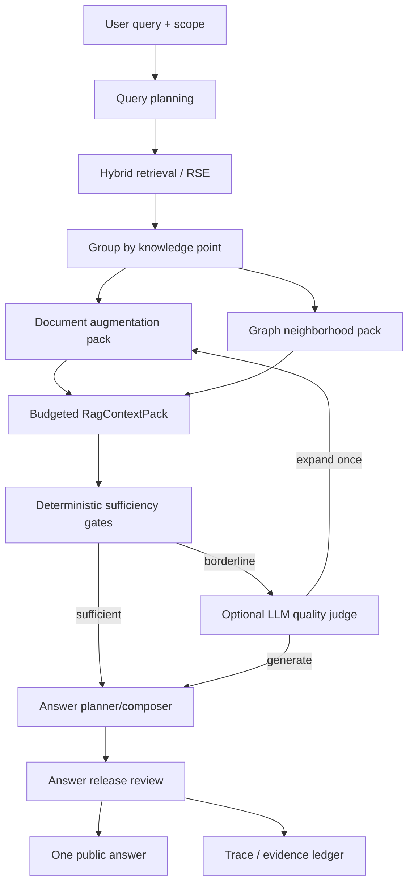
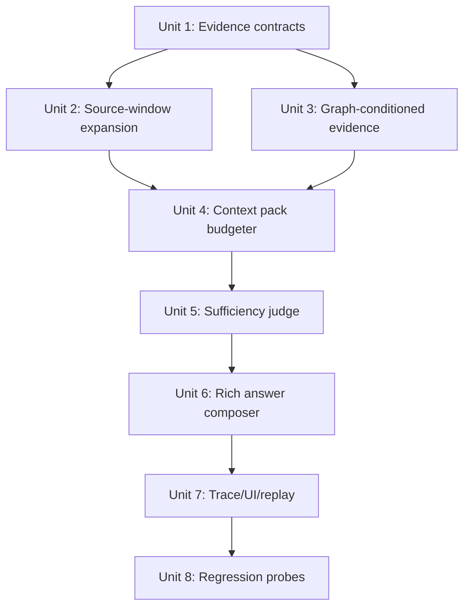
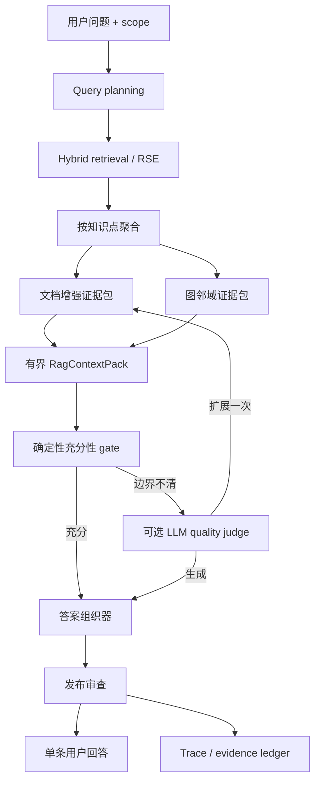

# feat: RSE document-augmented graph RAG answer pipeline

## English

## Overview

This plan upgrades Knowledge Workspace answers from a narrow, release-contracted summary into a bounded evidence-generation pipeline: retrieve precise segments, expand them with document structure, condition the answer on graph neighborhood evidence, run sufficiency/release checks, and publish one user-facing answer while keeping orchestration detail in trace artifacts.

The target is not "longer answers by default." The target is answers that are complete enough for the query, grounded in direct evidence, aware of graph in/out relationships, and observable when the chain degrades.

## Critical Assessment

The proposed "take five paragraphs before and after the matched node" is directionally useful but too blunt as a primary rule. It is also not the maximum source-reading boundary. The source augmentation layer may read the full source document for each selected knowledge point when provenance and scope allow it; the strict cap applies later to the model-visible `RagContextPack`.

- Fixed +/-5 paragraphs can inject irrelevant context when the document has dense sections, tables, Mermaid/code blocks, or repeated headings.
- It scales poorly when multiple spans hit the same knowledge point or when neighbor nodes also need context.
- It can lower faithfulness: more adjacent text increases the chance that generation uses background material as direct support.
- It is still insufficient for tables, definitions, and heading-scoped clauses where the right context is the parent section, header, or structured block rather than five plain paragraphs.

The better implementation is "small-to-big source reading with hard model-visible caps":

- retrieval remains segment/span-level;
- context expansion is adaptive around source spans, heading boundaries, table/code block boundaries, and graph relation intent;
- +/-5 paragraphs is a default local expansion window, not a maximum source-reading range;
- full-document reading is allowed as the maximum augmentation boundary, but only selected fragments enter the context pack;
- every expanded fragment carries provenance and a role: direct support, parent context, neighbor support, conflict, or background.

The proposed multi-stage LLM grading is also risky if placed on the hot path for every turn. It should be a bounded adjudication layer:

- deterministic gates run first;
- LLM quality judging runs only when evidence exists and the deterministic sufficiency score is borderline or when the user asks for a deeper answer;
- the system performs at most one expansion/regeneration cycle per turn unless a future asynchronous review workflow is explicitly introduced.

## Requirements Trace

- R1. Answers must use RSE: retrieve precise evidence spans and keep citation identity stable.
- R2. Answers must use document augmentation: recover parent section, adjacent paragraph/window context, heading path, and source-span provenance.
- R3. Answers must use graph structure: anchor node, in-degree/out-degree profile, predecessor/successor windows, relation kinds, confidence, and neighbor evidence.
- R4. The user sees one answer message; orchestration, scoring, candidate lists, and repair diagnostics stay in backend trace/inspection surfaces.
- R5. LLM-based sufficiency/release judging must be optional, bounded, timeout-protected, and deterministic-fallback safe.
- R6. The plan must preserve current API compatibility: existing `answer`, `assistantBlocks`, `knowledgePoints`, `trace.graphContext`, and `answerReleaseReview` remain valid.
- R7. Weak evidence must produce explicit degraded states such as partial coverage, conflict, stale evidence, or insufficient evidence instead of fluent overreach.
- R8. Runtime probes must include the current `waterglass` cases plus broader graph/neighbor/context-window regression samples.

## Context & Research

### Relevant Code and Patterns

- `src/learning/queryBackend.ts` already performs hybrid retrieval using keyword, semantic similarity, graph anchor distance, graph path confidence, graph intent matching, and temporal filtering.
- `src/learning/KnowledgeLearningPlatform.ts` already centralizes query planning, scope recovery, materialized `KnowledgeQueryItem` creation, evidence span lookup, relation path attachment, and backend trace fields.
- `src/learning/conversationComposer.ts` already merges retrieved items by document/knowledge point and composes a single public answer plus structured assistant blocks.
- `src/learning/graphContextAssembler.ts` already chooses an anchor point, reorders support nodes, builds predecessor/successor windows, filters self-neighbors, and attaches node degree/profile diagnostics.
- `src/learning/answerReleaseReview.ts` already performs deterministic release gates for evidence sufficiency, graph support, intent alignment, structured contradiction, graph order/causal/comparison consistency, temporal validity, diagnostic leakage, and abstention hygiene.
- `src/notemd/LlmProvider.ts` already provides provider-agnostic LLM completion with retries, timeouts via abort signals, OpenAI-compatible/Azure/Anthropic/Google/Ollama transports, and task-level provider selection patterns. The RAG judge should reuse this boundary rather than adding another HTTP client.
- `src/frontend/agent_workspace.js` and `src/frontend/workspace_panes.js` already separate user-facing answer, evidence panes, API status, and operator/debug details.

### Reference Findings

- `ref/codex/AGENTS.md` requires model-visible context to be incremental, bounded, hard-capped, and structured. Any new RAG context pack must enforce per-fragment and total budgets.
- `ref/codex/codex-rs/context-fragments/src/fragment.rs` models injected context as typed fragments with markers. This is a useful precedent for a typed `RagContextPack` instead of ad hoc prompt concatenation.
- `ref/codex/codex-rs/utils/string/src/truncate.rs` preserves beginning and end when truncating. The same principle applies to source windows: preserve local hit context plus terminal qualifiers, not random middle slices.
- `ref/enterprise_agent_platform/docs/part04-vector-knowledge/en/ch20-rag.md` frames RAG as an evidence production pipeline: parsing, indexing, retrieval, ranking, context assembly, generation, citation verification, and feedback.
- `ref/enterprise_agent_platform/docs/part04-vector-knowledge/en/ch19-ocr.md` emphasizes structured source objects and citation spans. Even for Markdown, paragraph, heading, table, code, and source-line provenance must be treated as evidence records, not display hints.
- `ref/enterprise_agent_platform/docs/part04-vector-knowledge/en/ch17.md` warns that reranking/embedding changes must be evaluated with samples, hard negatives, index versions, permission records, and regression ownership. This argues for replayable RAG traces before tuning weights blindly.
- `docs/solutions/agent-knowledge-dag-answer-contract-plan-2026-06-17.md` explicitly notes the current baseline: public answers were intentionally narrow while graph/evidence details lived in assistant blocks and trace. This plan changes that baseline carefully: richer public answers are allowed, but only after bounded context assembly and release review.

## High-Level Technical Design

This illustrates the intended approach and is directional guidance for review, not implementation specification. The implementing agent should treat it as context, not code to reproduce.

## Key Technical Decisions

- Use adaptive source-window expansion with full-document source availability, not unconditional +/-5 paragraph injection.
  Rationale: full-document access lets the assembler recover distant definitions, caveats, tables, and section-level constraints, while the context pack still prevents unrelated text from becoming model-visible by default.
- Add a new evidence context assembly layer instead of putting source expansion into `conversationComposer.ts`.
  Rationale: the owner of evidence completeness is the retrieval/context layer, not the text rendering layer.
- Treat graph neighbors as evidence candidates, not as facts by title alone.
  Rationale: predecessor/successor names are not enough; the answer should cite what those nodes say and how the relation affects the anchor.
- Keep LLM grading optional and bounded.
  Rationale: user machines may not have a configured provider, local models may be slow, and deterministic behavior must remain available.
- Replace the hard public answer contraction with answer profiles and release budgets.
  Rationale: the current 900-character / six-sentence cap prevents the richer answer behavior the user is asking for, but removing all caps would violate the `ref/codex` context discipline.
- Store the full reasoning substrate in trace, not in the public message.
  Rationale: the user wants one answer, but engineers need replayability and layer-level diagnosis.

## Scope Boundaries

- No new vector database is required for this phase.
- No mandatory cloud LLM dependency is introduced.
- No frontend redesign is required beyond surfacing richer answer/status states already carried by backend payloads.
- Full source documents may be read for scoped evidence assembly, but no unbounded prompt assembly or multi-turn hidden loop is allowed.
- No breaking changes to existing Knowledge Workspace response fields are allowed.

## Implementation Units

- [x] **Unit 1: Evidence Context Contracts**

**Goal:** Add stable types for document-augmented evidence without changing current response contracts.

**Implementation status (2026-07-05):** Implemented. `src/learning/types.ts` now defines additive RAG fragment, context-pack, budget, source-decision, and sufficiency-review contracts, and `AgentConversationTrace` carries the new fields optionally for forward compatibility.

**Requirements:** R1, R2, R4, R6.

**Dependencies:** None.

**Files:**
- Modify: `src/learning/types.ts`
- Test: `src/learning/evidenceContextAssembler.test.ts`

**Approach:**
- Add optional additive types such as `RagEvidenceFragment`, `RagContextPack`, `RagEvidenceRole`, `RagContextBudget`, and `RagSufficiencyReview`.
- Fragment roles should separate `direct_support`, `parent_context`, `adjacent_context`, `graph_neighbor_support`, `conflict`, and `background`.
- Each fragment should carry source path, document id, atom id, line/offset range when available, heading path when available, token/char estimate, truncation flag, and citation ids.
- Use hard caps at both fragment and pack level, following the `ref/codex` model-visible context discipline.
- Keep all new fields optional on existing response/trace interfaces.

**Patterns to follow:**
- `AgentConversationGraphContext` optional fields in `src/learning/types.ts`.
- `AnswerReleaseReview` as an additive trace payload.

**Test scenarios:**
- Happy path: a direct citation span becomes a `direct_support` fragment with line/offset provenance.
- Edge case: a missing line range still produces a fragment with source path and citation id.
- Edge case: an oversized fragment is truncated and records truncation metadata.
- Compatibility: existing serialized `AgentConversationResponse` objects remain valid when new fields are absent.

**Verification:**
- TypeScript strict mode accepts the new optional contracts.
- Existing tests using older response shapes require no rewrites beyond intentional new assertions.

- [x] **Unit 2: Source-Window and Document Augmentation Assembler**

**Goal:** Build the small-to-big document context layer around retrieved spans.

**Implementation status (2026-07-05):** Implemented for the deterministic path. `src/learning/evidenceContextAssembler.ts` starts from evidence spans, reads the full source document through a platform-owned resolver, preserves direct support, adds parent/adjacent context, dedupes overlapping windows, and degrades to `source_window_unavailable` when source text is unavailable.

**Requirements:** R1, R2, R7.

**Dependencies:** Unit 1.

**Files:**
- Create: `src/learning/evidenceContextAssembler.ts`
- Test: `src/learning/evidenceContextAssembler.test.ts`
- Modify: `src/learning/KnowledgeLearningPlatform.ts`

**Approach:**
- Start from `KnowledgeQueryItem.evidenceSpans`, not from whole documents.
- Group fragments by knowledge point/document as `conversationComposer.ts` already does for UI hits.
- Expand each hit from a full-document source view into bounded evidence fragments:
  - default: parent heading plus nearest paragraphs around the span;
  - local window: five preceding and five following paragraphs unless evidence routing requires broader source inspection;
  - maximum source boundary: the complete document for the selected knowledge point;
  - model-visible maximum: the `RagContextPack` fragment and total budgets, not the raw source document length;
  - lower cap when the hit is in a table/code/Mermaid block or when multiple spans already cover the same section.
- Preserve direct evidence as a separate fragment; expanded context must not replace the directly cited span.
- Prefer indexed document/atom snapshots already held by `KnowledgeLearningPlatform`; avoid ad hoc filesystem reads unless the existing storage abstraction already provides source text.
- Add deterministic conflict/background classification when adjacent fragments mention the same anchor but diverge on values, temporal qualifiers, or relation terms.

**Patterns to follow:**
- `mergeAgentConversationKnowledgePoints()` for grouping logic.
- `buildKnowledgeCitation()` for stable citation surfaces.
- `stripMarkdownScaffolding()` in `answerReleaseReview.ts` for display-safe extraction, but keep raw evidence in trace.

**Test scenarios:**
- Happy path: a match in the middle of a Markdown section includes direct span, parent heading, and bounded adjacent paragraphs.
- Edge case: repeated identical snippets use source offset/line range to choose the correct local window.
- Edge case: Mermaid/code fences are not injected wholesale into public answer context.
- Edge case: multiple spans in one document dedupe overlapping windows.
- Failure path: missing source provenance degrades to direct snippet only and marks `source_window_unavailable`.

**Verification:**
- The assembler produces a bounded context pack for `waterglass` without duplicating the same knowledge point.
- Direct support remains identifiable after augmentation.

- [ ] **Unit 3: Graph-Conditioned Neighbor Evidence**

**Goal:** Attach ranked evidence from graph in-degree/out-degree neighborhoods to the answer basis.

**Implementation status (2026-07-05):** Partially implemented. `KnowledgeLearningPlatform.agentConversation()` now materializes graph-neighbor query items from graph context windows/supporting ids and sends them through the evidence assembler as `graph_neighbor_support` fragments. The remaining gap is a deeper graph-ranker change inside `graphContextAssembler.ts` for relation-kind, confidence, bibliography filtering, and query-intent weighted neighbor selection before evidence assembly.

**Requirements:** R3, R7.

**Dependencies:** Unit 1, Unit 2.

**Files:**
- Modify: `src/learning/graphContextAssembler.ts`
- Modify: `src/learning/KnowledgeLearningPlatform.ts`
- Test: `src/learning/graphContextAssembler.test.ts`
- Test: `src/learning/evidenceContextAssembler.test.ts`

**Approach:**
- Keep `graphContextAssembler.ts` responsible for anchor selection, degree/profile, predecessor/successor windows, and relation ranking.
- Add evidence handles for top graph neighbors instead of only titles:
  - default: up to three predecessors and three successors;
  - allow up to five only for explicit deep/explain requests or high-confidence graph paths;
  - rank by relation kind, confidence, provenance, query intent, source evidence availability, and non-bibliography filters.
- For each selected neighbor, request a small evidence expansion from Unit 2.
- Distinguish relation explanation from neighbor content:
  - "why this predecessor matters" comes from relation kind/path;
  - "what the predecessor says" comes from neighbor evidence fragments.
- Continue filtering self-neighbors and anchor-equivalent titles.

**Patterns to follow:**
- `buildWindowNodes()` scoring and self-neighbor filtering in `graphContextAssembler.ts`.
- `buildAnchorGraphProfile()` for degree and centrality profile.

**Test scenarios:**
- Happy path: anchor has two useful predecessors and one successor; context pack includes neighbor evidence with relation metadata.
- Edge case: anchor-equivalent neighbor is filtered even if it has a different atom id.
- Edge case: low-confidence or bibliography-like neighbors are excluded from answer basis.
- Edge case: graph ops unavailable still returns document-only context and records fallback.

**Verification:**
- Graph-derived answer statements can be traced to both relation metadata and source evidence fragments.

- [x] **Unit 4: Budgeted RAG Context Pack**

**Goal:** Convert document and graph fragments into a model-visible context payload with strict budgets.

**Implementation status (2026-07-05):** Implemented. `src/learning/ragContextPack.ts` enforces role priority, per-fragment limits, total limits, middle truncation that preserves head/tail context, and traceable include/truncate/drop source decisions.

**Requirements:** R4, R5, R6.

**Dependencies:** Unit 2, Unit 3.

**Files:**
- Create: `src/learning/ragContextPack.ts`
- Test: `src/learning/ragContextPack.test.ts`
- Modify: `src/learning/types.ts`

**Approach:**
- Build a pack with sections: query intent, anchor profile, direct evidence, document augmentation, graph neighbor evidence, conflicts/limitations, citation map.
- Apply per-fragment and total-pack limits. Use approximate token estimates rather than character-only limits.
- Preserve beginning and end when truncating long fragments, following the `ref/codex` truncate utility precedent.
- Record budget decisions in trace: included, truncated, dropped, and reason.
- Never allow a single evidence item to dominate the context.

**Patterns to follow:**
- `ref/codex/codex-rs/utils/string/src/truncate.rs` for middle truncation semantics.
- Existing `knowledgeRun.quality.gates` for traceable budget outcomes.

**Test scenarios:**
- Happy path: direct support and graph evidence fit within budget and retain citation map.
- Edge case: one oversized parent section is middle-truncated and marked.
- Edge case: many neighbor fragments trigger deterministic dropping by role priority.
- Compatibility: pack is stored in trace/artifacts, while public answer remains one message.

**Verification:**
- Context assembly cannot produce unbounded prompt input.

- [ ] **Unit 5: Sufficiency Judge and One-Step Evidence Recovery**

**Goal:** Decide whether the assembled context can support a complete answer, and recover once when it cannot.

**Implementation status (2026-07-05):** Partially implemented. `src/learning/ragSufficiencyJudge.ts` provides deterministic sufficiency gates, explicit degradation states, and an injected optional LLM judge hook. It is not yet wired to `src/notemd/LlmProvider.ts`, and the one-step recovery pass is not yet implemented as a second assembly cycle.

**Requirements:** R5, R7.

**Dependencies:** Unit 4.

**Files:**
- Create: `src/learning/ragSufficiencyJudge.ts`
- Test: `src/learning/ragSufficiencyJudge.test.ts`
- Modify: `src/learning/KnowledgeLearningPlatform.ts`
- Modify: `src/notemd/types.ts` only if task-level provider typing needs an additive task key.

**Approach:**
- Run deterministic gates first:
  - direct evidence coverage;
  - query-intent coverage;
  - graph support when the answer mentions graph structure;
  - citation availability for each key claim;
  - context budget compliance;
  - conflict/staleness detection.
- Add optional LLM judging through the existing `LlmProviderClient` boundary:
  - only when a provider is configured and the deterministic score is borderline;
  - fixed JSON schema output;
  - short timeout and low retry count;
  - no hidden chain-of-thought storage;
  - failure falls back to deterministic decision.
- Permit at most one recovery pass:
  - inspect additional full-document sections and admit only budgeted fragments;
  - add one more graph neighbor per direction if evidence is thin;
  - increase parent-context priority if direct evidence lacks definitions.
- If still insufficient, return a partial answer with explicit missing evidence state rather than fabricating completeness.

**Patterns to follow:**
- `LlmProviderClient.complete()` retry and provider abstraction.
- `answerReleaseReview.ts` deterministic gates and additive review payload.

**Test scenarios:**
- Happy path: deterministic sufficiency passes and no LLM call is required.
- Borderline path: LLM judge requests one expansion; second pass produces answer basis.
- Failure path: provider timeout falls back to deterministic partial/insufficient state.
- Guardrail: judge cannot trigger unbounded recursive expansion.
- Error path: malformed LLM JSON is ignored and recorded as judge failure.

**Verification:**
- Runtime latency remains bounded and the system is usable without configured LLM provider.

- [ ] **Unit 6: Rich Single-Message Answer Composer**

**Goal:** Generate a more complete public answer from the RAG context pack while preserving one-message UX.

**Implementation status (2026-07-05):** Partially implemented. `conversationComposer.ts` now uses `RagContextPack` and `RagSufficiencyReview` to build a richer deterministic one-message answer from direct support, document augmentation, and graph-neighbor evidence. The remaining gap is a broader answer-profile system plus `answerReleaseReview.ts` completeness/budget expansion beyond the existing release contraction.

**Requirements:** R4, R6, R7.

**Dependencies:** Unit 5.

**Files:**
- Modify: `src/learning/conversationComposer.ts`
- Modify: `src/learning/answerReleaseReview.ts`
- Test: `src/learning/conversationComposer.test.ts`
- Test: `src/learning/answerReleaseReview.test.ts`

**Approach:**
- Replace the current three-sentence draft bias with answer profiles:
  - `definition`: direct definition, mechanism, important attributes, graph position, caveats;
  - `how_to`: prerequisites, ordered steps, downstream branches, failure modes;
  - `compare`: shared anchor, branch differences, evidence-backed contrast;
  - `generic`: answer, support, graph/context caveat.
- Use the context pack to structure the answer; do not ask the LLM to rediscover evidence from raw concatenated text.
- Keep public answer bounded but raise the default budget from the current overly narrow 900-character behavior for evidence-rich cases.
- Add claim-to-citation mapping internally even if UI shows a compact citation list.
- `answerReleaseReview.ts` should validate completeness and support, not merely contract the answer.

**Patterns to follow:**
- `buildScopedConversationAnswer()` as the current owner of public answer shape.
- `reviewAnswerRelease()` as the final release gate.

**Test scenarios:**
- Happy path: `what is waterglass?` returns definition, composition, key properties, graph predecessor/successor context, and citations without duplicate knowledge points.
- Edge case: graph context exists but neighbor evidence is weak; answer names graph limitation instead of overstating.
- Edge case: sufficient direct evidence but no graph ops; answer remains grounded without graph claims.
- Error path: release review catches unsupported graph-order or causal claims.
- Compatibility: `structured_answer.directAnswer` equals the final public answer.

**Verification:**
- The user receives one richer message; internal scoring and orchestration stay in trace/artifacts.

- [ ] **Unit 7: Trace, Status, and Evidence Ledger**

**Goal:** Make the pipeline debuggable and replayable without exposing backend clutter in the chat answer.

**Implementation status (2026-07-05):** Partially implemented. Backend trace and knowledge-run artifact payloads now include `ragContextPack` and `ragSufficiencyReview`; `scripts/verify-knowledge-workspace-runtime.js` summarizes and validates them; `src/frontend/agent_workspace.js` and `src/frontend/workspace_panes.js` surface compact RAG status, source boundary, role counts, budget/degradation state, and sufficiency without rendering raw fragment text. Export-bundle replay coverage remains a follow-up.

**Requirements:** R4, R7, R8.

**Dependencies:** Unit 6.

**Files:**
- Modify: `src/learning/types.ts`
- Modify: `src/learning/KnowledgeLearningPlatform.ts`
- Modify: `src/frontend/agent_workspace.js`
- Modify: `src/frontend/workspace_panes.js`
- Test: `src/agent_workspace.frontend.test.ts`
- Test: `src/export/WorkspaceExportBundle.test.ts`

**Approach:**
- Add trace fields for RAG context pack summary, budget decisions, sufficiency decision, recovery action, judge result, and degradation state.
- Keep user-visible status compact: scope, evidence status, citation count, graph context status, and whether a recovery/degraded answer occurred.
- Store replay material in `knowledgeRun` / export surfaces.
- Add failure classification compatible with `ref/enterprise_agent_platform`: parsing/source, indexing, retrieval, reranking, context assembly, graph evidence, generation, citation verification, permission/scope.

**Patterns to follow:**
- Existing `answerReleaseReview` trace and knowledge-run artifact storage.
- Existing API status panel tests in `src/agent_workspace.frontend.test.ts`.

**Test scenarios:**
- Happy path: status shows evidence-ready and graph-ready without showing raw internal prompt.
- Degraded path: status shows partial/insufficient evidence with actionable reason.
- Export path: workspace export includes compact RAG review summary and replay ids.
- Compatibility: older frontend payloads without RAG trace still render.

**Verification:**
- Engineers can identify which RAG stage failed without asking the user to inspect raw JSON.

- [ ] **Unit 8: Regression Corpus and Runtime Probes**

**Goal:** Prevent "better answer" work from regressing retrieval, graph correctness, latency, or UI compatibility.

**Implementation status (2026-07-05):** Partially implemented. New unit tests cover evidence assembly, context budgeting, sufficiency judging, persistence compatibility, richer composer behavior, platform integration, frontend RAG grounding display, and `waterglass` regression expectations. The broader runtime probe corpus, timeout/fallback LLM judge probes, and large-corpus hard-negative samples remain follow-up work.

**Requirements:** R8.

**Dependencies:** Unit 7.

**Files:**
- Modify: `src/learning/KnowledgeWorkspaceConversationRegression.ts`
- Modify: `scripts/verify-knowledge-workspace-runtime.js`
- Test: `src/learning/KnowledgeWorkspaceConversationRegression.test.ts`
- Test: `src/learning/KnowledgeLearningPlatform.test.ts`
- Test: `src/learning/conversationComposer.test.ts`
- Test: `src/learning/answerReleaseReview.test.ts`

**Approach:**
- Keep `waterglass` compact/spaced queries as acceptance probes.
- Add tests for:
  - evidence-rich definition answer;
  - missing neighbor evidence;
  - duplicated same-document spans;
  - conflicting adjacent evidence;
  - context budget truncation;
  - optional LLM judge timeout/fallback;
  - graph self-neighbor filtering;
  - answer release with richer public answer.
- Add latency budget assertions for the no-LLM path and bounded timeout assertions for the LLM-judge path.

**Patterns to follow:**
- Existing `verify-knowledge-workspace-runtime.js` waterglass case.
- Existing targeted tests for `graphContextAssembler`, `conversationComposer`, and `answerReleaseReview`.

**Test scenarios:**
- Runtime: `what is waterglass?` returns a complete answer using direct evidence, document augmentation, and graph context.
- Runtime: compact Chinese/English alias queries do not fall back to scoped miss.
- Runtime: no LLM provider still produces deterministic grounded answer.
- Runtime: LLM judge failure does not block the answer path.

**Verification:**
- Regression suite proves richer answers without losing current forward compatibility.

## System-Wide Impact

- **Retrieval:** span-level retrieval remains primary; document augmentation happens after candidate selection.
- **Graph:** graph context becomes an evidence-conditioned answer input, not just a UI/explanation payload.
- **Generation:** LLM is used as bounded adjudicator/generator only when configured; deterministic fallback remains first-class.
- **Release review:** current contradiction and graph-order gates remain, but completeness and context-budget gates are added.
- **Frontend:** the public surface still shows one answer; status/evidence panes carry compact trace state.
- **Exports:** evidence packs and review summaries become replayable artifacts.

## Risks & Mitigations

| Risk | Mitigation |
|------|------------|
| Context bloat from adjacent paragraphs | Role-prioritized pack budgets, per-fragment caps, truncation metadata, and one-pass recovery limit |
| LLM judge increases latency or cost | Deterministic gates first, optional provider path, short timeout, no recursive judging |
| Richer answers overstate weak evidence | Degraded answer states and claim-to-citation release gates |
| Neighbor titles become unsupported claims | Require neighbor evidence fragments before using neighbor content in public answer |
| Document augmentation duplicates same knowledge point | Group by document/knowledge point before expansion and dedupe overlapping windows |
| New trace fields break clients | Optional additive fields only; older clients continue rendering existing payloads |
| Prompt tuning hides retrieval defects | Failure classification and replay samples assign issues to retrieval, context assembly, graph, generation, or citation verification |

## Open Questions

### Resolved During Planning

- Should +/-5 paragraphs be unconditional?
  No. Treat it as a default local expansion window. The maximum source-reading boundary is the complete scoped document, while the model-visible maximum is enforced by `RagContextPack` budgets.
- Should LLM grading be mandatory?
  No. It must be optional and deterministic-fallback safe.
- Should graph in/out nodes be included by title only?
  No. Titles alone are not evidence. Use relation metadata plus source fragments from selected neighbors.

### Deferred to Implementation

- Exact context budgets per answer profile.
  This should be calibrated against runtime probes and actual corpus sizes.
- Exact provider/task configuration key for RAG judging.
  This depends on the least invasive way to reuse existing NoteMD provider settings.
- Exact UI wording for degraded evidence status.
  This should be validated against existing localization and API-status panel patterns.

## Success Metrics

- `waterglass` definition answers contain direct definition, key document-augmented evidence, and accurate graph predecessor/successor context.
- Same-document multi-span hits remain one knowledge point with highlighted matched spans.
- No-provider path still answers deterministically.
- LLM-judge path cannot exceed one recovery cycle.
- Public answer contains no internal diagnostics, raw candidate dumps, or prompt scaffolding.
- Trace/export surfaces preserve enough material to replay retrieval, context assembly, sufficiency decision, and release review.

## Sources & References

- `src/learning/queryBackend.ts`
- `src/learning/KnowledgeLearningPlatform.ts`
- `src/learning/conversationComposer.ts`
- `src/learning/graphContextAssembler.ts`
- `src/learning/answerReleaseReview.ts`
- `src/notemd/LlmProvider.ts`
- `docs/solutions/agent-knowledge-dag-answer-contract-plan-2026-06-17.md`
- `docs/solutions/agent-final-reply-review-robustness-plan-2026-06-18.md`
- `ref/codex/AGENTS.md`
- `ref/codex/codex-rs/context-fragments/src/fragment.rs`
- `ref/codex/codex-rs/utils/string/src/truncate.rs`
- `ref/enterprise_agent_platform/docs/part04-vector-knowledge/en/ch20-rag.md`
- `ref/enterprise_agent_platform/docs/part04-vector-knowledge/en/ch19-ocr.md`
- `ref/enterprise_agent_platform/docs/part04-vector-knowledge/en/ch17.md`

---

## 中文

## 概览

本计划把 Knowledge Workspace 的回答链路从“窄口径发布摘要”升级为有界的证据生产线：先做精确片段召回，再做文档结构扩展，再用图谱邻域证据组织回答，最后经过充分性与发布审查，只向用户释放一条答案，同时把编排、评分、候选、恢复动作保留在 trace 和检查面板中。

目标不是默认把答案写长，而是让答案在当前问题需要时足够完整：直接回答问题、引用直接证据、利用命中节点的入度/出度关系、说明前后继节点与当前节点的具体关联，并且在证据不足时明确降级。

## 批判性判断

“命中节点前后各五段”不是错误方向，但不能作为无条件主规则；它也不是最大 source 范围。source augmentation 在 provenance 与 scope 允许时可以读取每个被选知识点的完整源文档，硬上限放在后续 model-visible `RagContextPack`。

- 固定前后五段会在密集文档、表格、代码块、Mermaid、重复标题场景中稳定引入噪声。
- 当同一知识点命中多个 span，或还要读取入度/出度邻居时，成本会快速膨胀。
- 上下文越多不一定越可信，模型更容易把背景材料当作直接支撑。
- 对表格、定义、标题域条款来说，真正需要的往往是父级标题、表头、限定条件或结构块，而不是普通段落数量。

更稳的方向是“small-to-big source reading + model-visible hard cap”：

- 检索保持 span/segment 粒度；
- 上下文扩展基于 source span、标题边界、表格/代码边界、图关系意图自适应；
- 前后五段只是默认局部扩展窗口，不是最大 source 读取范围；
- 完整文档读取是 augmentation 的最大 source 边界，但只有被选中的片段能进入 context pack；
- 每个扩展片段都要有角色：直接支撑、父级上下文、邻段上下文、图邻居支撑、冲突证据或背景材料。

多轮 LLM 打分也不能直接塞进每次热路径。更合理的是：

- 先走确定性 gate；
- 只有证据存在但充分性边界不清，或用户明确要求深度回答时，再调用 LLM judge；
- 每轮对话最多一次扩展/再组织，避免隐藏递归、延迟不可控和成本失控。

## 需求追踪

- R1. 回答必须使用 RSE：先召回精确证据片段，并保持 citation 身份稳定。
- R2. 回答必须使用 document augmentation：恢复父级 section、邻近段落窗口、标题路径与 source-span provenance。
- R3. 回答必须使用图结构：anchor node、入度/出度 profile、predecessor/successor window、关系类型、置信度和邻居证据。
- R4. 用户只看到一条回答；编排、评分、候选列表与修复诊断放在后端 trace / inspection surface。
- R5. LLM 充分性/发布判断必须可选、有界、有 timeout，并且没有 provider 时仍能确定性 fallback。
- R6. 保持当前 API 向前兼容：`answer`、`assistantBlocks`、`knowledgePoints`、`trace.graphContext`、`answerReleaseReview` 继续有效。
- R7. 弱证据必须输出明确状态，例如 partial coverage、conflict、stale evidence、insufficient evidence，而不是强行生成流畅但过度的结论。
- R8. runtime probe 必须覆盖当前 `waterglass` 用例，并扩展到图邻居、上下文窗口和证据充分性回归。

## 现有代码与参考结论

### 本项目现状

- `src/learning/queryBackend.ts` 已有 keyword、semantic similarity、graph anchor distance、graph path confidence、graph intent matching、temporal filtering 的混合检索基础。
- `src/learning/KnowledgeLearningPlatform.ts` 已经集中处理 query planning、scope recovery、`KnowledgeQueryItem` materialization、evidence span lookup、relation path attachment 与 backend trace。
- `src/learning/conversationComposer.ts` 已经把检索项按 document/knowledge point 合并，并输出单一 public answer 与结构化 assistant blocks。
- `src/learning/graphContextAssembler.ts` 已经负责 anchor 选择、support node 重排、predecessor/successor window、自邻居过滤和 node degree/profile diagnostics。
- `src/learning/answerReleaseReview.ts` 已经有 evidence sufficiency、graph support、intent alignment、结构化矛盾、图顺序/因果/对比一致性、时序有效性、诊断泄漏与 abstention hygiene 等确定性 gate。
- `src/notemd/LlmProvider.ts` 已经提供 provider-agnostic LLM completion，不应再引入第二套 LLM HTTP client。
- `src/frontend/agent_workspace.js` 和 `src/frontend/workspace_panes.js` 已经区分用户回答、证据面板、API 状态和 operator/debug 细节。

### `ref/` 参考结论

- `ref/codex/AGENTS.md` 要求 model-visible context 必须有硬上限，不能有无界 item。新 RAG context pack 必须按 fragment 和总包双层限额。
- `ref/codex/codex-rs/context-fragments/src/fragment.rs` 的 typed context fragment 思路值得借鉴：RAG 上下文应该是结构化 `RagContextPack`，不是字符串拼接 prompt。
- `ref/codex/codex-rs/utils/string/src/truncate.rs` 的截断策略保留头尾。RAG source window 也应保留命中局部和尾部限定条件，而不是随机裁剪中间。
- `ref/enterprise_agent_platform/docs/part04-vector-knowledge/en/ch20-rag.md` 把 RAG 定义为证据生产线：解析、索引、召回、排序、上下文装配、生成、引用验证与反馈。
- `ref/enterprise_agent_platform/docs/part04-vector-knowledge/en/ch19-ocr.md` 强调结构化 source object 与 citation span。对 Markdown 也一样，段落、标题、表格、代码块、source line 都是证据契约，不只是 UI 高亮材料。
- `ref/enterprise_agent_platform/docs/part04-vector-knowledge/en/ch17.md` 提醒：检索质量实验要有样本、hard negative、index version、权限记录和回归归属，不能靠单次 prompt 调参掩盖链路问题。
- `docs/solutions/agent-knowledge-dag-answer-contract-plan-2026-06-17.md` 已说明当前基线是 public answer 故意窄口径。本计划要修改这个基线，但必须通过有界上下文装配与 release review，而不是直接放开回答长度。

## 高层技术设计

下图只表达设计形状，不是实现规格。

## 关键技术决策

- 用具备完整文档 source 可用性的自适应 source-window expansion 替代无条件前后五段注入。
  理由：完整文档读取可以恢复远处定义、限定条件、表格和 section 级约束，但 context pack 仍能阻止无关文本默认进入模型可见上下文。
- 新增 evidence context assembly layer，而不是把扩展逻辑塞进 `conversationComposer.ts`。
  理由：证据完整性的 owner 应该在检索/上下文层，不在文本渲染层。
- 图邻居先作为 evidence candidate，不按标题直接生成事实。
  理由：predecessor/successor 名称不是证据，必须读取邻居内容与关系元数据。
- LLM judge 可选且有界。
  理由：用户环境未必配置 provider，本地模型可能慢，确定性路径必须仍然可用。
- 用 answer profile 与 release budget 替代当前过窄的固定公开答案限制。
  理由：当前 900 字符 / 6 句上限会阻碍证据充分回答，但完全取消上限又违背 `ref/codex` 的上下文纪律。
- 完整编排材料进 trace，不进 public message。
  理由：用户要的是一条可读答案，工程侧要的是可回放、可定位的证据链。

## 范围边界

- 本阶段不引入新的向量数据库。
- 不引入强制云端 LLM 依赖。
- 不重做前端，只复用现有 answer/status/evidence pane 分层。
- 允许对 scoped evidence assembly 读取完整源文档，但不允许无界 prompt assembly 或隐藏多轮循环。
- 不破坏现有 Knowledge Workspace response 字段。

## 实施单元

- [x] **单元 1：证据上下文契约**

**目标：** 增加 document-augmented evidence 的稳定类型，同时不破坏现有响应。

**实现状态（2026-07-05）：** 已实现。`src/learning/types.ts` 已新增 RAG fragment、context pack、budget、source decision 与 sufficiency review 的增量契约，`AgentConversationTrace` 以可选字段承载这些信息，保持向前兼容。

**文件：**
- 修改：`src/learning/types.ts`
- 测试：`src/learning/evidenceContextAssembler.test.ts`

**做法：**
- 增加可选类型：`RagEvidenceFragment`、`RagContextPack`、`RagEvidenceRole`、`RagContextBudget`、`RagSufficiencyReview`。
- fragment role 至少区分 direct support、parent context、adjacent context、graph neighbor support、conflict、background。
- 每个 fragment 携带 source path、document id、atom id、line/offset range、heading path、token/char estimate、truncation flag、citation ids。
- fragment 和 pack 都要有硬上限。

**测试：**
- direct citation span 能生成 direct support fragment。
- 缺少 line range 时仍能生成带 source path 与 citation id 的 fragment。
- 超大 fragment 会被截断并记录 metadata。
- 老响应对象在新字段缺失时仍然合法。

- [x] **单元 2：source-window 与 document augmentation assembler**

**目标：** 围绕命中 span 构建 small-to-big 文档上下文。

**实现状态（2026-07-05）：** 确定性路径已实现。`src/learning/evidenceContextAssembler.ts` 从 evidence span 出发，通过平台注入的 source resolver 读取完整源文档，保留 direct support，补入 parent / adjacent context，去重重叠窗口，并在源文本缺失时降级为 `source_window_unavailable`。

**文件：**
- 新增：`src/learning/evidenceContextAssembler.ts`
- 测试：`src/learning/evidenceContextAssembler.test.ts`
- 修改：`src/learning/KnowledgeLearningPlatform.ts`

**做法：**
- 从 `KnowledgeQueryItem.evidenceSpans` 出发，不从整篇文档出发。
- 按 document / knowledge point 聚合，避免同一知识点重复卡片。
- 扩展策略：
  - 默认包含 parent heading 和最近邻段；
  - 局部窗口通常为前后五段，证据路由需要时可以检查更宽的源文档区域；
  - 最大 source 边界是该知识点对应的完整文档；
  - model-visible 最大范围由 `RagContextPack` fragment / total budget 决定，而不是原始文档长度；
  - 表格、代码块、Mermaid、多 span 命中时降低窗口；
  - direct evidence 独立保存，不被 expanded context 替代。
- 优先使用 `KnowledgeLearningPlatform` 已有 document/atom/index snapshot，避免临时绕过存储抽象读文件。

**测试：**
- Markdown section 中部命中能包含 direct span、父标题和有界邻段。
- 重复 snippet 通过 source offset / line range 定位正确窗口。
- Mermaid/code fence 不会整块注入 public answer context。
- 同文档多 span 去重 overlapping window。
- provenance 缺失时降级为 direct snippet only。

- [ ] **单元 3：图条件化邻居证据**

**目标：** 把入度/出度邻域中的高价值节点内容接入回答基础。

**实现状态（2026-07-05）：** 部分实现。`KnowledgeLearningPlatform.agentConversation()` 已从 graph context 的窗口与 supporting ids 中物化图邻居 query items，并通过 evidence assembler 转成 `graph_neighbor_support` fragment。剩余缺口是继续下沉到 `graphContextAssembler.ts`，基于 relation kind、confidence、bibliography 过滤和 query intent 权重做更精细的邻居排序。

**文件：**
- 修改：`src/learning/graphContextAssembler.ts`
- 修改：`src/learning/KnowledgeLearningPlatform.ts`
- 测试：`src/learning/graphContextAssembler.test.ts`
- 测试：`src/learning/evidenceContextAssembler.test.ts`

**做法：**
- `graphContextAssembler.ts` 继续负责 anchor、degree/profile、predecessor/successor window 与关系排序。
- 对 top graph neighbors 增加 evidence handle：
  - 默认最多 3 个 predecessor + 3 个 successor；
  - 显式 deep/explain 或高置信路径时最多 5 个；
  - 排序依据 relation kind、confidence、provenance、query intent、source evidence availability、非参考文献过滤。
- 邻居内容必须来自 Unit 2 的证据扩展，不只展示标题。
- 保留自邻居和 anchor-equivalent title 过滤。

**测试：**
- anchor 有有效前驱/后继时，context pack 包含邻居证据和关系元数据。
- 不同 atom id 但同 title 的自邻居被过滤。
- bibliography-like / 低置信邻居不会进入回答基础。
- graph ops 不可用时 document-only path 仍可工作。

- [x] **单元 4：有界 RAG Context Pack**

**目标：** 将文档和图证据转成有硬预算的 model-visible payload。

**实现状态（2026-07-05）：** 已实现。`src/learning/ragContextPack.ts` 已实现 role priority、单片段上限、总上限、保留头尾的 middle truncation，以及可追踪的 include / truncate / drop source decision。

**文件：**
- 新增：`src/learning/ragContextPack.ts`
- 测试：`src/learning/ragContextPack.test.ts`
- 修改：`src/learning/types.ts`

**做法：**
- context pack 分区：query intent、anchor profile、direct evidence、document augmentation、graph neighbor evidence、conflict/limitation、citation map。
- 估算 token 并做 per-fragment / total-pack budget。
- 长片段保留开头和结尾，并记录截断原因。
- trace 中记录 included、truncated、dropped 及原因。

**测试：**
- 正常证据包保留 citation map。
- 超大父 section 会被 middle truncation 并标记。
- 过多邻居按 role priority 确定性丢弃。
- public answer 仍然是一条消息。

- [ ] **单元 5：充分性 Judge 与一次性证据恢复**

**目标：** 判断当前 context 是否能支撑完整回答，不足时只恢复一次。

**实现状态（2026-07-05）：** 部分实现。`src/learning/ragSufficiencyJudge.ts` 已提供确定性充分性 gate、显式 degradation state 和可注入的可选 LLM judge hook；尚未接入 `src/notemd/LlmProvider.ts`，一次性 recovery 也尚未作为第二轮 assembly cycle 落地。

**文件：**
- 新增：`src/learning/ragSufficiencyJudge.ts`
- 测试：`src/learning/ragSufficiencyJudge.test.ts`
- 修改：`src/learning/KnowledgeLearningPlatform.ts`
- 必要时增量修改：`src/notemd/types.ts`

**做法：**
- 先跑确定性 gate：直接证据覆盖、query intent 覆盖、graph support、key claim citation、context budget、conflict/staleness。
- 可选 LLM judge 复用 `LlmProviderClient`：
  - provider 配置存在且确定性评分边界不清时才调用；
  - 输出固定 JSON schema；
  - 短 timeout、低 retry；
  - 不保存 hidden chain-of-thought；
  - timeout / malformed JSON fallback 到确定性判断。
- 最多一次 recovery：
  - 检查完整文档中的额外 section，但只准纳入预算内片段；
  - 每个方向增加一个图邻居；
  - direct evidence 缺 definition 时提高 parent context 优先级。
- 仍不足则输出 partial / insufficient evidence，不强行完整回答。

**测试：**
- 充分证据不调用 LLM。
- 边界样本触发一次扩展。
- provider timeout 不阻塞主链路。
- judge 无法触发递归扩展。
- malformed JSON 被记录但不污染结果。

- [ ] **单元 6：更充分的单消息答案组织器**

**目标：** 从 RAG context pack 组织更完整的 public answer。

**实现状态（2026-07-05）：** 部分实现。`conversationComposer.ts` 已能基于 `RagContextPack` 与 `RagSufficiencyReview`，从 direct support、document augmentation 和 graph-neighbor evidence 组织更充分的确定性单消息回答。剩余缺口是完整 answer profile 系统，以及 `answerReleaseReview.ts` 对 completeness / budget 的进一步放宽与审查。

**文件：**
- 修改：`src/learning/conversationComposer.ts`
- 修改：`src/learning/answerReleaseReview.ts`
- 测试：`src/learning/conversationComposer.test.ts`
- 测试：`src/learning/answerReleaseReview.test.ts`

**做法：**
- 用 answer profile 替代当前三句以内的 draft bias：
  - definition：定义、机制、重要属性、图位置、限制；
  - how_to：前置条件、步骤、后续分支、失败模式；
  - compare：共同 anchor、分支差异、证据支撑对比；
  - generic：回答、支撑、图/上下文 caveat。
- 让 LLM 或 deterministic composer 基于结构化 context pack 组织答案，不让模型从原始拼接文本里重新发现证据。
- 放宽当前过窄 public answer budget，但仍保持硬上限。
- 内部保留 claim-to-citation mapping。
- `answerReleaseReview.ts` 增加 completeness / support review，而不是只做收缩。

**测试：**
- `what is waterglass?` 返回定义、构成、关键属性、前后继图上下文和 citation。
- 图 context 有但邻居证据弱时，不强行生成邻居内容。
- 无 graph ops 时仍可 grounded 回答。
- release review 能拦截 unsupported graph-order / causal claim。
- `structured_answer.directAnswer` 与 final public answer 一致。

- [ ] **单元 7：Trace、状态显示与 evidence ledger**

**目标：** 不把后台细节塞进聊天答案，同时让工程侧可诊断、可回放。

**实现状态（2026-07-05）：** 部分实现。后端 trace 与 knowledge-run artifact payload 已包含 `ragContextPack` 和 `ragSufficiencyReview`；`scripts/verify-knowledge-workspace-runtime.js` 已摘要和校验这些字段；`src/frontend/agent_workspace.js` 与 `src/frontend/workspace_panes.js` 已显示 compact RAG status、source boundary、role count、budget / degradation state 与 sufficiency，且不渲染 raw fragment text。Export bundle replay 覆盖仍是后续项。

**文件：**
- 修改：`src/learning/types.ts`
- 修改：`src/learning/KnowledgeLearningPlatform.ts`
- 修改：`src/frontend/agent_workspace.js`
- 修改：`src/frontend/workspace_panes.js`
- 测试：`src/agent_workspace.frontend.test.ts`
- 测试：`src/export/WorkspaceExportBundle.test.ts`

**做法：**
- trace 增加 RAG context pack summary、budget decision、sufficiency decision、recovery action、judge result、degradation state。
- 用户可见 status 保持紧凑：scope、evidence status、citation count、graph context status、是否 recovery/degraded。
- `knowledgeRun` / export surfaces 保留 replay material。
- failure classification 对齐 enterprise_agent_platform：parsing/source、indexing、retrieval、reranking、context assembly、graph evidence、generation、citation verification、permission/scope。

**测试：**
- happy path 显示 evidence-ready / graph-ready。
- degraded path 显示 partial / insufficient reason。
- export 包含 compact RAG review summary 和 replay id。
- 老 payload 缺 RAG trace 时前端仍渲染。

- [ ] **单元 8：回归语料与运行时探针**

**目标：** 防止“答案更充分”引入召回、图谱、延迟或 UI 兼容性回退。

**实现状态（2026-07-05）：** 部分实现。新增测试已覆盖 evidence assembly、context budget、sufficiency judge、持久化兼容、composer 增强、平台集成、前端 RAG grounding 展示，以及 `waterglass` 回归预期。更大的 runtime probe 语料、LLM judge timeout/fallback 探针和 hard-negative 大语料样本仍需继续补齐。

**文件：**
- 修改：`src/learning/KnowledgeWorkspaceConversationRegression.ts`
- 修改：`scripts/verify-knowledge-workspace-runtime.js`
- 测试：`src/learning/KnowledgeWorkspaceConversationRegression.test.ts`
- 测试：`src/learning/KnowledgeLearningPlatform.test.ts`
- 测试：`src/learning/conversationComposer.test.ts`
- 测试：`src/learning/answerReleaseReview.test.ts`

**做法：**
- 保留 `waterglass` compact/spaced queries 作为验收探针。
- 增加 evidence-rich definition、missing neighbor evidence、same-document span dedupe、conflicting adjacent evidence、context budget truncation、LLM judge timeout/fallback、自邻居过滤、rich public answer release 等用例。
- no-LLM path 加延迟预算；LLM judge path 加 timeout/fallback 预算。

**测试：**
- `what is waterglass?` 能使用直接证据、document augmentation 和 graph context 输出完整回答。
- 中英混合 alias 不退回 scoped miss。
- 未配置 LLM provider 仍有确定性 grounded answer。
- LLM judge 失败不阻塞主回答链路。

## 系统影响

- **检索层：** span-level retrieval 仍是主入口；document augmentation 在候选选择之后发生。
- **图谱层：** graph context 从 UI/解释 payload 升级为证据条件化回答输入。
- **生成层：** LLM 只在配置存在且有必要时作为有界 judge/generator；确定性 fallback 是一等路径。
- **发布审查：** 保留当前矛盾和图顺序 gate，新增 completeness 与 context-budget gate。
- **前端：** public surface 仍是一条回答；status/evidence pane 显示紧凑 trace state。
- **导出：** evidence pack 与 review summary 进入可回放 artifact。

## 风险与缓解

| 风险 | 缓解 |
|------|------|
| 邻段扩展导致上下文膨胀 | role-prioritized budget、per-fragment cap、truncation metadata、一次恢复限制 |
| LLM judge 增加延迟和成本 | 确定性 gate 优先、可选 provider、短 timeout、不递归 |
| 更长答案过度推断 | degraded answer state 与 claim-to-citation release gate |
| 邻居标题被误当事实 | public answer 使用邻居内容前必须有邻居 evidence fragment |
| 同知识点重复命中 | 先按 document/knowledge point 聚合，再扩展窗口 |
| 新 trace 字段破坏客户端 | 只加 optional additive fields |
| prompt 调参掩盖检索缺陷 | failure classification 与 replay sample 将问题归因到具体链路层 |

## 已决问题与待实现校准

### 规划阶段已决

- 前后五段不是无条件规则，也不是最大 source 范围；完整文档读取才是 source augmentation 的最大边界，真正的硬上限在 `RagContextPack`。
- LLM judge 不强制启用，必须 deterministic fallback。
- 图邻居不能只用标题，必须有关系元数据和源证据片段。

### 实现阶段待校准

- 每个 answer profile 的具体 token/fragment budget。
- RAG judge 复用现有 provider settings 的最小侵入方式。
- degraded evidence status 的最终 UI 文案与本地化。

## 成功指标

- `waterglass` 定义回答包含直接定义、document-augmented 证据、准确前后继图上下文。
- 同文档多 span 命中仍是一个知识点，并能高亮命中段落。
- no-provider path 可确定性回答。
- LLM judge path 最多一次 recovery。
- public answer 不泄漏内部诊断、候选 dump 或 prompt scaffolding。
- trace/export 可以回放检索、上下文装配、充分性判断与发布审查。

## 参考

- `src/learning/queryBackend.ts`
- `src/learning/KnowledgeLearningPlatform.ts`
- `src/learning/conversationComposer.ts`
- `src/learning/graphContextAssembler.ts`
- `src/learning/answerReleaseReview.ts`
- `src/notemd/LlmProvider.ts`
- `docs/solutions/agent-knowledge-dag-answer-contract-plan-2026-06-17.md`
- `docs/solutions/agent-final-reply-review-robustness-plan-2026-06-18.md`
- `ref/codex/AGENTS.md`
- `ref/codex/codex-rs/context-fragments/src/fragment.rs`
- `ref/codex/codex-rs/utils/string/src/truncate.rs`
- `ref/enterprise_agent_platform/docs/part04-vector-knowledge/en/ch20-rag.md`
- `ref/enterprise_agent_platform/docs/part04-vector-knowledge/en/ch19-ocr.md`
- `ref/enterprise_agent_platform/docs/part04-vector-knowledge/en/ch17.md`
