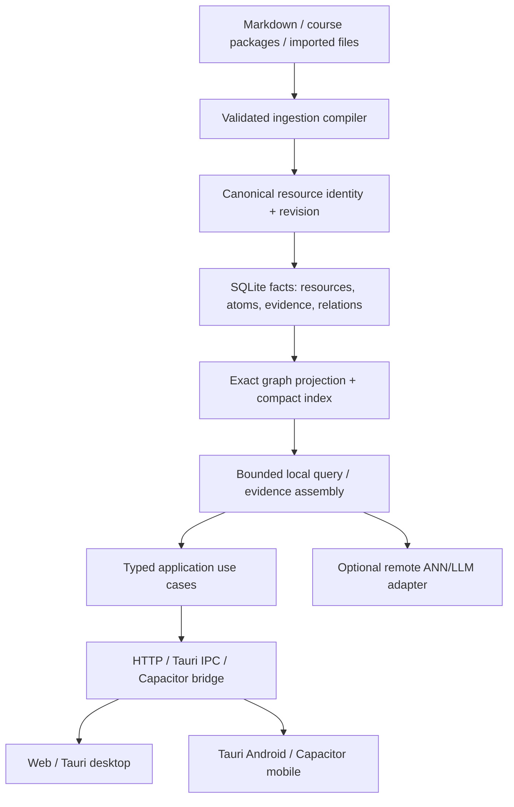

# 2026-08-16 Architecture Hardening and Forward-Compatible Multi-Platform Plan

## English

### Decision summary

The current branch is not blocked by a lack of features; it is blocked by ambiguous ownership and unsafe boundaries. The first hardening slice therefore makes three edge invariants executable without changing public graph IDs or snapshot schemas:

1. duplicate basename identities fail before graph construction and loaded files retain a normalized workspace-relative path;
2. sidecar and HTTP authorization use one strict token decision, while preserving both existing credential headers;
3. file snapshot replacement stays atomic under concurrent saves and the in-process cache reflects the committed snapshot immediately.

The multi-platform decision is equally important: the portable core owns ingest, exact graph projection, bounded indexed query, evidence and export; Node, Tauri, Capacitor and Godot are adapters. Mobile must not run a second business-rule implementation and must not ship desktop sidecars, Godot, or model weights.

### Code evidence and gap matrix

| Area | Current code | Earlier plan expectation | Current judgement |
|---|---|---|---|
| Resource identity | `FileLoader` used basename; `Graph.addNode()` silently ignored duplicate IDs. This slice adds `relativePath` and `assertUniqueLegacyResourceIds()`. | Stable workspace/source URI, alias-aware moves, case/Unicode policy. | **Partial:** data loss is stopped; stable ID migration is still pending. |
| HTTP boundary | Modular registry has 70+ route entries, but `server.ts` still contains legacy fallback and strict mode is opt-in. | Registry-first composition root with contract-complete routes. | **Pending:** do not flip default until shadow metrics and legacy URL parity are complete. |
| Learning ownership | `KnowledgeLearningPlatform.ts` still owns persistence, query, conversation, memory, workflow and telemetry orchestration. | Complete use-case boundaries with narrow ports. | **Pending:** extraction must move invariants, not create wrappers. |
| Graph scale | Explicit prerequisites/next/DAG paths exist, but inferred matching remains pairwise and graph nodes carry content. | Exact projection first, indexed bounded inference second, content references and compact IDs. | **Pending P1:** more workers do not change O(N²). |
| Snapshot persistence | File store used one fixed temp path and stale cache after save. | Atomic versioned snapshot pointer and coherent reads. | **Implemented baseline:** unique sibling temp paths and post-commit cache refresh; versioned manifests remain next phase. |
| Mobile export | `mobile-slim` is sidecar-free, PNG-first, requires indexed readiness; workspace export bundles are deterministic. | Mobile should analyse its local corpus without desktop runtime dependencies. | **Gap:** local bundle/read path exists, but an on-device ingest/query execution loop is not yet proven. |

### Reference comparison without cargo culting

- LearnGraph demonstrates a typed HTTP boundary (FastAPI/Pydantic), explicit request/response models, workspace/tenant scope, and security-conscious tool execution. Adopt the boundary discipline and scoped capability model. Do not import its Docker-only execution, SaaS RBAC, PostgreSQL/RLS assumptions, or network-first deployment model into a local/Tauri/mobile product.
- textbooks demonstrates a clean content package contract (`content.md`, `functions.ts`, `hints.yaml`, styles and translations). Adopt a validated manifest + compiler IR direction. Do not copy the Mathigon Studio DSL or its runtime dependency/licensing posture into the core.
- The correct synthesis is a source package compiler plus a typed, host-neutral runtime, not a monolithic clone of either repository.

### Target architecture

The portable core must be deterministic and runnable in a Web Worker/WASM or embedded SQLite host. The remote adapter is an enhancement with timeout, cancellation, capability negotiation and explicit offline fallback; it is never a prerequisite for local ingest/query.

### Mobile-first release contract

The current generated asset inventory is a warning, not a release baseline: Godot is roughly 172 MB, the Windows/Linux server binaries are roughly 78/108 MB, and the existing Android generated asset directory is roughly 357 MB. A mobile profile that inherits desktop assets will violate both download and low-memory goals.

The release matrix must enforce:

| Profile | Local analysis | Optional remote | App-owned compressed payload | Peak RSS target | Corpus gate |
|---|---|---|---:|---:|---|
| `mobile-low` | exact graph/index, SQLite, evidence snippets, export | disabled by default | <= 25 MiB | <= 256 MiB | 5,000 docs / 50,000 atoms on 4-core ARM64 |
| `mobile-standard` | same, plus bounded background indexing | explicit/cancellable | <= 35 MiB | <= 384 MiB | 20,000 docs / 200,000 atoms on 4-core ARM64 |
| `desktop-full` | sidecar, full render and streaming | configured provider | no mobile cap | host budget | desktop matrix |

Mobile bundles must exclude `server-*`, `godot-*`, desktop-only renderer bundles, full source text duplication, and local model weights. They should contain compact resource metadata, SQLite/index projections, content references or paged source blobs, and PNG/WebP materializations. The signed APK/AAB and extracted asset tree—not the TypeScript source size—are the authority for size gates.

### Forward-compatible migration sequence

1. **Boundary hardening (this slice):** identity collision fail-fast, strict shared auth, atomic/coherent file snapshots.
2. **Budget and capability inventory:** add a deterministic mobile staging command, signed artifact byte manifest, RSS workload runner, and `PlatformCapabilities` fields (`supportsLocalExactQuery`, `supportsRemoteInference`, `assetBudgetBytes`, `maxResidentBytes`).
3. **Portable execution:** move exact ingest/projection/query into a host-neutral package backed by SQLite and bounded Worker/WASM kernels; keep `KnowledgeLearningPlatform` as an orchestration owner until complete use cases can enforce invariants.
4. **Mobile bridge:** expose versioned `analyze`, `query`, `readEvidence`, `exportBundle` operations with correlation IDs, cancellation and capability negotiation. The client never decides graph or memory policy.
5. **Stable identity dual-read:** introduce `sourceUri`/revision/alias alongside basename IDs, backfill collision-free workspaces, then switch new projections to stable IDs only after replay and move-file tests pass.
6. **Projection scale:** split explicit edges from bounded inferred edges; replace pairwise matching with inverted index/BM25/ANN Top-K; store `contentRef` instead of full text on graph nodes; add 10k/50k corpus benchmarks.
7. **Registry and domain convergence:** shadow the modular route registry, publish parity metrics, then make it default; extract complete use cases (`IngestKnowledge`, `AnswerKnowledgeQuery`, `RunLearningConversation`, `RecordEvidence`, `RecalculateMastery`, `ApplyMemoryPolicy`) with narrow repositories.

### Trade-offs and rejected shortcuts

- **Reject “ship the Node sidecar on Android”:** it maximizes code reuse but inflates package size, ABI surface, startup time and memory. A portable exact-query core plus SQLite is more work up front but keeps mobile hardware requirements low.
- **Reject “embed an LLM for offline parity”:** model weights dominate size/RAM and make deterministic release gates impossible. Offline mobile should return grounded deterministic evidence/graph answers; remote synthesis is explicit when available.
- **Reject “flip strict registry now”:** the registry already has broad coverage, but the remaining inline fallback would turn hidden gaps into production 501s. Shadow and contract parity are safer.
- **Reject “add more workers/GPU”:** this hides but does not remove pairwise complexity and can worsen mobile serialization/GC pressure. Indexing and compact representations come first.

### Rollback and observability

- Identity guard rollback is code-only; existing basename IDs and layouts continue to read, while ambiguous inputs fail visibly instead of corrupting state.
- Auth rollback is technically possible but reopens an authorization bypass; retain the legacy header rather than weakening the decision.
- Snapshot writes preserve the previous target on failure; unique temp files are cleaned and never treated as source snapshots.
- Every mobile build emits a manifest with profile, capability flags, byte totals, excluded artifact reasons, corpus size, peak RSS, and fallback reason. CI stores the manifest with the APK/AAB evidence.

### Current progress after this slice

- Implemented and tested: resource collision guard (`src/backend/ResourceIdentity.ts`), normalized `RawFile.relativePath`, shared strict auth (`src/middleware/auth.ts` + `src/server.ts`), unique atomic snapshot temp files and cache refresh (`src/learning/store.ts`).
- Existing targeted verification: identity/graph suites 13/13, auth/server/registry suites 30 passed with 13 existing skips, store/persistence suites 23/23.
- Fresh full verification: 129/129 Jest suites passed, 1,192 tests passed, 26 were skipped; `npm run build` and `npm run docs:diataxis:check` passed.
- Known repository-wide gate debt: `npm run verify:markdown:mermaid:fence` still reports 588 pre-existing inline-fence findings under `Knowledge_Base`; this slice did not rewrite unrelated corpus files.
- Not implemented yet: mobile local analysis runtime, mobile byte/RSS verifier, stable `sourceUri` migration, strict registry default, complete use-case extraction, indexed graph projection and Bridge protocol v2. These remain explicit next gates, not implied by the current tests.

## 中文

### 决策摘要

当前分支的问题不是功能数量不足，而是边界含义不清和所有权过度集中。本轮先把三个边界不变量变成可执行验证，同时不改变公开节点 ID 与快照 schema：

1. 重复 basename 在建图前失败，磁盘加载文件同时保留归一化 workspace-relative path；
2. Sidecar 与 HTTP 使用同一个严格 token 判定，保留已有两种凭证头；
3. 文件快照并发替换保持原子，同一进程保存后缓存立即反映已提交快照。

多端决策同样明确：portable core 负责 ingest、exact graph projection、有界 indexed query、evidence 与 export；Node、Tauri、Capacitor、Godot 只是 adapter。移动端不能再维护一套业务规则，也不能携带桌面 sidecar、Godot 或模型权重。

### 代码证据与缺口矩阵

| 领域 | 当前代码 | 先前方案要求 | 当前判断 |
|---|---|---|---|
| 资源身份 | `FileLoader` 只用 basename；本轮新增 `relativePath` 与 `assertUniqueLegacyResourceIds()`。 | 稳定 workspace/source URI、alias、大小写/Unicode 策略。 | **部分完成：** 已阻止静默丢数据，稳定 ID 迁移仍待完成。 |
| HTTP 边界 | modular registry 已有 70+ route，但 `server.ts` 仍保留 legacy fallback，strict mode 还是 opt-in。 | registry-first composition root 与完整契约。 | **待推进：** 先做 shadow metrics 与旧 URL parity，再切默认。 |
| 学习所有权 | `KnowledgeLearningPlatform.ts` 仍承载 persistence、query、conversation、memory、workflow、telemetry 编排。 | 完整 use case + 窄 port。 | **待推进：** 必须迁移不变量，不能只增加 wrapper。 |
| 图规模 | explicit prerequisite/next/DAG path 存在，但 inferred matching 仍成对扫描，graph node 仍携带 content。 | exact projection 优先、indexed bounded inference、contentRef、紧凑 ID。 | **P1 待推进：** 更多 worker 不会改变 O(N²)。 |
| 快照持久化 | 固定 `.tmp` 且 save 后缓存不刷新。 | 原子 versioned snapshot 与一致读。 | **底线已实现：** 唯一临时文件与提交后 cache refresh；versioned manifest 仍是下一步。 |
| 移动导出 | `mobile-slim` 已 sidecar-free、PNG-first、要求 indexed readiness；workspace export bundle deterministic。 | 移动端应不依赖桌面 runtime 完成本地知识库分析。 | **缺口：** bundle/read 基础存在，但端上 ingest/query execution loop 尚未证明。 |

### 参考仓库的取舍

- LearnGraph 值得采用的是 FastAPI/Pydantic 的类型化边界、workspace/tenant scope、能力与安全约束；不应把 Docker-only、SaaS RBAC、PostgreSQL/RLS、network-first 部署假设带入本地/Tauri/mobile 产品。
- textbooks 值得采用的是 `content.md`、`functions.ts`、`hints.yaml`、styles/locales 的内容包契约与 compiler IR 方向；不复制依赖 Mathigon Studio 的 DSL 与授权/运行时包袱。
- 最优组合是“source package compiler + typed host-neutral runtime”，不是复制任一仓库的整体形状。

### 多端/移动端发布契约

当前资产盘点只是风险信号而非 release baseline：Godot 约 172 MB，Windows/Linux server 约 78/108 MB，现有 Android generated asset 目录约 357 MB。若 mobile 继承桌面产物，必然违反下载体积与低内存目标。

| profile | 本地分析 | 可选远端 | 应用自有压缩 payload | RSS 目标 | corpus gate |
|---|---|---|---:|---:|---|
| `mobile-low` | exact graph/index、SQLite、evidence snippet、export | 默认关闭 | <= 25 MiB | <= 256 MiB | 4 核 ARM64：5,000 docs / 50,000 atoms |
| `mobile-standard` | 同上 + 有界后台 indexing | 显式/可取消 | <= 35 MiB | <= 384 MiB | 4 核 ARM64：20,000 docs / 200,000 atoms |
| `desktop-full` | sidecar、完整渲染、streaming | provider 配置 | 不受 mobile cap | 宿主预算 | desktop matrix |

移动包必须排除 `server-*`、`godot-*`、桌面 renderer bundle、全文重复副本和本地模型权重；只携带紧凑 resource metadata、SQLite/index projection、content reference 或分页 source blob、PNG/WebP materialization。签名 APK/AAB 与解包资源树才是体积门禁依据。

### 向前兼容推进顺序

1. **边界加固（本轮）：** identity collision fail-fast、共享严格 auth、原子/一致快照。
2. **预算与 capability inventory：** deterministic mobile staging、签名产物 byte manifest、RSS workload runner，以及 `supportsLocalExactQuery`、`supportsRemoteInference`、`assetBudgetBytes`、`maxResidentBytes`。
3. **portable execution：** 用 SQLite + 有界 Worker/WASM 把 exact ingest/projection/query 移到 host-neutral package；在完整 use case 能强制不变量前，不急于抽空 `KnowledgeLearningPlatform`。
4. **移动 bridge：** 通过 versioned `analyze/query/readEvidence/exportBundle`、correlation ID、cancel、capability negotiation 提供调用；client 不决定 graph/memory policy。
5. **稳定身份双读：** 引入 `sourceUri`/revision/alias，回填无冲突 workspace，完成 replay 与 move-file 测试后新 projection 才切稳定 ID。
6. **投影规模：** explicit/inferred 分离，inverted index/BM25/ANN Top-K 代替 pairwise matching，graph node 改存 `contentRef`，加入 10k/50k benchmark。
7. **registry 与 domain 收敛：** shadow registry、parity metrics 后切默认；抽取 `IngestKnowledge`、`AnswerKnowledgeQuery`、`RunLearningConversation`、`RecordEvidence`、`RecalculateMastery`、`ApplyMemoryPolicy` 等完整 use case 与窄 repository。

### 当前进度

- 已实现并测试：资源冲突 guard、规范化 `RawFile.relativePath`、共享严格 auth、唯一原子快照临时文件与 cache refresh。
- 当前定向证据：identity/graph 13/13，auth/server/registry 30 passed（既有 13 skip），store/persistence 23/23。
- 当前全量证据：129/129 Jest suites 通过，1,192 tests 通过，26 skip；`npm run build` 与 `npm run docs:diataxis:check` 通过。
- 已知全库门禁债务：`npm run verify:markdown:mermaid:fence` 仍报告 `Knowledge_Base` 下 588 条历史 inline-fence；本轮没有借机改写无关语料。
- 尚未实现：移动端本地分析 runtime、mobile byte/RSS verifier、稳定 `sourceUri` 迁移、strict registry 默认、完整 use-case 抽取、indexed graph projection、Bridge v2；这些是明确后续门禁，不应从现有测试推导为已完成。
