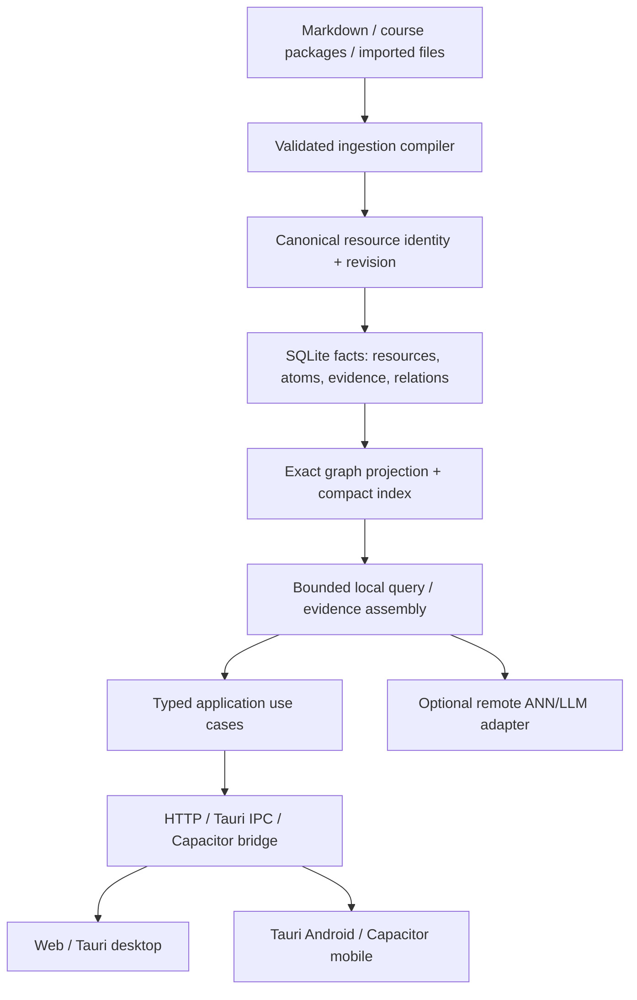

# 2026-08-16 Architecture Hardening and Forward-Compatible Multi-Platform Plan

## English

### Decision summary

The current branch is not blocked by a lack of features; it is blocked by ambiguous ownership and unsafe boundaries. The first hardening slice therefore makes three edge invariants executable without changing public graph IDs or snapshot schemas:

1. duplicate basename identities fail before graph construction and loaded files retain a normalized workspace-relative path;
2. sidecar and HTTP authorization use one strict token decision, while preserving both existing credential headers;
3. file snapshot replacement stays atomic under concurrent saves and the in-process cache reflects the committed snapshot immediately.

The multi-platform decision is equally important: the portable core owns ingest, exact graph projection, bounded indexed query, evidence and export; Node, Tauri, Capacitor and Godot are adapters. Mobile must not run a second business-rule implementation and must not ship desktop sidecars, Godot, or model weights.

### Code evidence and gap matrix

| Area | Current code | Earlier plan expectation | Current judgement |
|---|---|---|---|
| Resource identity | `FileLoader` used basename; `Graph.addNode()` silently ignored duplicate IDs. This slice adds `relativePath` and `assertUniqueLegacyResourceIds()`. | Stable workspace/source URI, alias-aware moves, case/Unicode policy. | **Partial:** data loss is stopped; stable ID migration is still pending. |
| HTTP boundary | Modular registry has 70+ route entries, but `server.ts` still contains legacy fallback and strict mode is opt-in. | Registry-first composition root with contract-complete routes. | **Pending:** do not flip default until shadow metrics and legacy URL parity are complete. |
| Learning ownership | `KnowledgeLearningPlatform.ts` still owns persistence, query, conversation, memory, workflow and telemetry orchestration. | Complete use-case boundaries with narrow ports. | **Pending:** extraction must move invariants, not create wrappers. |
| Graph scale | Explicit prerequisites/next/DAG paths exist, but inferred matching remains pairwise and graph nodes carry content. | Exact projection first, indexed bounded inference second, content references and compact IDs. | **Pending P1:** more workers do not change O(N²). |
| Snapshot persistence | File store used one fixed temp path and stale cache after save. | Atomic versioned snapshot pointer and coherent reads. | **Implemented baseline:** unique sibling temp paths and post-commit cache refresh; versioned manifests remain next phase. |
| Mobile export | `mobile-slim` is sidecar-free, PNG-first, deterministic-staged, and exposes bounded local exact query/path calls; workspace export bundles remain deterministic. | Mobile should analyse its local corpus without desktop runtime dependencies. | **Partial:** callable/static loop is implemented; device RSS/APK evidence and SQLite persistence are still open. |

### Reference comparison without cargo culting

- LearnGraph demonstrates a typed HTTP boundary (FastAPI/Pydantic), explicit request/response models, workspace/tenant scope, and security-conscious tool execution. Adopt the boundary discipline and scoped capability model. Do not import its Docker-only execution, SaaS RBAC, PostgreSQL/RLS assumptions, or network-first deployment model into a local/Tauri/mobile product.
- textbooks demonstrates a clean content package contract (`content.md`, `functions.ts`, `hints.yaml`, styles and translations). Adopt a validated manifest + compiler IR direction. Do not copy the Mathigon Studio DSL or its runtime dependency/licensing posture into the core.
- The correct synthesis is a source package compiler plus a typed, host-neutral runtime, not a monolithic clone of either repository.

### Target architecture

The portable core must be deterministic and runnable in a Web Worker/WASM or embedded SQLite host. The remote adapter is an enhancement with timeout, cancellation, capability negotiation and explicit offline fallback; it is never a prerequisite for local ingest/query.

### Mobile-first release contract

The current generated asset inventory is a warning, not a release baseline: Godot is roughly 172 MB, the Windows/Linux server binaries are roughly 78/108 MB, and the existing Android generated asset directory is roughly 357 MB. A mobile profile that inherits desktop assets will violate both download and low-memory goals.

The release matrix must enforce:

| Profile | Local analysis | Optional remote | App-owned compressed payload | Peak RSS target | Corpus gate |
|---|---|---|---:|---:|---|
| `mobile-low` | exact graph/index projection, evidence snippets, export; SQLite deferred | disabled by default | <= 25 MiB | <= 256 MiB | 5,000 docs / 50,000 atoms on 4-core ARM64 |
| `mobile-standard` | same, plus bounded background indexing | explicit/cancellable | <= 35 MiB | <= 384 MiB | 20,000 docs / 200,000 atoms on 4-core ARM64 |
| `desktop-full` | sidecar, full render and streaming | configured provider | no mobile cap | host budget | desktop matrix |

Mobile bundles must exclude `server-*`, `godot-*`, desktop-only renderer bundles, full source text duplication, and local model weights. This slice ships compact resource metadata and exact-index projections; SQLite/index persistence, content references, and paged source blobs are subsequent phases. The signed APK/AAB and extracted asset tree—not the TypeScript source size—are the authority for size gates.

### Forward-compatible migration sequence

1. **Boundary hardening (this slice):** identity collision fail-fast, strict shared auth, atomic/coherent file snapshots.
2. **Budget and capability inventory:** add a deterministic mobile staging command, signed artifact byte manifest, RSS workload runner, and `PlatformCapabilities` fields (`supportsLocalExactQuery`, `supportsRemoteInference`, `assetBudgetBytes`, `maxResidentBytes`).
3. **Portable execution:** move exact ingest/projection/query into a host-neutral package backed by SQLite and bounded Worker/WASM kernels; keep `KnowledgeLearningPlatform` as an orchestration owner until complete use cases can enforce invariants.
4. **Mobile bridge:** expose versioned `analyze`, `query`, `readEvidence`, `exportBundle` operations with correlation IDs, cancellation and capability negotiation. The client never decides graph or memory policy.
5. **Stable identity dual-read:** introduce `sourceUri`/revision/alias alongside basename IDs, backfill collision-free workspaces, then switch new projections to stable IDs only after replay and move-file tests pass.
6. **Projection scale:** split explicit edges from bounded inferred edges; replace pairwise matching with inverted index/BM25/ANN Top-K; store `contentRef` instead of full text on graph nodes; add 10k/50k corpus benchmarks.
7. **Registry and domain convergence:** shadow the modular route registry, publish parity metrics, then make it default; extract complete use cases (`IngestKnowledge`, `AnswerKnowledgeQuery`, `RunLearningConversation`, `RecordEvidence`, `RecalculateMastery`, `ApplyMemoryPolicy`) with narrow repositories.

### Trade-offs and rejected shortcuts

- **Reject “ship the Node sidecar on Android”:** it maximizes code reuse but inflates package size, ABI surface, startup time and memory. A portable exact-query core plus SQLite is more work up front but keeps mobile hardware requirements low.
- **Reject “embed an LLM for offline parity”:** model weights dominate size/RAM and make deterministic release gates impossible. Offline mobile should return grounded deterministic evidence/graph answers; remote synthesis is explicit when available.
- **Reject “flip strict registry now”:** the registry already has broad coverage, but the remaining inline fallback would turn hidden gaps into production 501s. Shadow and contract parity are safer.
- **Reject “add more workers/GPU”:** this hides but does not remove pairwise complexity and can worsen mobile serialization/GC pressure. Indexing and compact representations come first.

### Rollback and observability

- Identity guard rollback is code-only; existing basename IDs and layouts continue to read, while ambiguous inputs fail visibly instead of corrupting state.
- Auth rollback is technically possible but reopens an authorization bypass; retain the legacy header rather than weakening the decision.
- Snapshot writes preserve the previous target on failure; unique temp files are cleaned and never treated as source snapshots.
- Every mobile build emits a manifest with profile, capability flags, byte totals, excluded artifact reasons, corpus size, peak RSS, and fallback reason. CI stores the manifest with the APK/AAB evidence.

### Current progress after this slice

- Implemented and tested: resource collision guard (`src/backend/ResourceIdentity.ts`), normalized `RawFile.relativePath`, shared strict auth (`src/middleware/auth.ts` + `src/server.ts`), unique atomic snapshot temp files and cache refresh (`src/learning/store.ts`).
- Existing targeted verification: identity/graph suites 13/13, auth/server/registry suites 30 passed with 13 existing skips, store/persistence suites 23/23.
- A prior repository baseline recorded 132/132 Jest suites and 1,211 tests, but that full run was not re-established in this slice; do not use it as current release evidence.
- Current phase evidence: TypeScript build, 6 replay/identity suites (35 tests), 12 core/route suites (70 tests), 24 learning suites (501 tests), 9 mobile contract suites (51 tests), Rust (26 tests), `npm run docs:diataxis:check`, PathBridge strict, and the mobile-slim budget gate passed.
- Known repository-wide gate debt: `npm run verify:markdown:mermaid:fence` still reports 588 pre-existing inline-fence findings under `Knowledge_Base`; this slice did not rewrite unrelated corpus files.
- Previously open mobile local analysis/verifier work is now implemented at the callable/static-contract level; device RSS/APK evidence and SQLite persistence remain open. Stable `sourceUri` migration, strict registry default, complete use-case extraction, indexed graph projection, and Bridge host-adapter integration remain explicit next gates; the transport-only Bridge 2.0 envelope is delivered.

## 2026-08-17 Identity Boundary and Mobile Admission Delta

The additive identity foundation now crosses the learning boundary as well as the graph boundary. `FileLoader` receives an explicit workspace root, server/modular sync forwards `sourceUri`/`revision`/aliases, and snapshots retain those fields for replay. URI/alias deletes resolve persisted documents before the legacy path normalizer. Android admission checks metadata before reads and enforces the `mobile-low` corpus limits (5,000 docs, 16 MiB per doc, 64 MiB total input, 250,000 edges). These changes reduce cross-target drift and peak-memory risk without changing public IDs or adding mobile runtime dependencies.

The remaining architectural blocker is intentional: a path-derived URI is not a rename journal. Move/rename events, workspace namespace, old-snapshot replay, Android folder selection, signed artifact extraction, and device RSS evidence must land before canonical-ID cutover or a strict mobile release claim.

## 中文

### 决策摘要

当前分支的问题不是功能数量不足，而是边界含义不清和所有权过度集中。本轮先把三个边界不变量变成可执行验证，同时不改变公开节点 ID 与快照 schema：

1. 重复 basename 在建图前失败，磁盘加载文件同时保留归一化 workspace-relative path；
2. Sidecar 与 HTTP 使用同一个严格 token 判定，保留已有两种凭证头；
3. 文件快照并发替换保持原子，同一进程保存后缓存立即反映已提交快照。

多端决策同样明确：portable core 负责 ingest、exact graph projection、有界 indexed query、evidence 与 export；Node、Tauri、Capacitor、Godot 只是 adapter。移动端不能再维护一套业务规则，也不能携带桌面 sidecar、Godot 或模型权重。

### 代码证据与缺口矩阵

| 领域 | 当前代码 | 先前方案要求 | 当前判断 |
|---|---|---|---|
| 资源身份 | `FileLoader` 只用 basename；本轮新增 `relativePath` 与 `assertUniqueLegacyResourceIds()`。 | 稳定 workspace/source URI、alias、大小写/Unicode 策略。 | **部分完成：** 已阻止静默丢数据，稳定 ID 迁移仍待完成。 |
| HTTP 边界 | modular registry 已有 70+ route，但 `server.ts` 仍保留 legacy fallback，strict mode 还是 opt-in。 | registry-first composition root 与完整契约。 | **待推进：** 先做 shadow metrics 与旧 URL parity，再切默认。 |
| 学习所有权 | `KnowledgeLearningPlatform.ts` 仍承载 persistence、query、conversation、memory、workflow、telemetry 编排。 | 完整 use case + 窄 port。 | **待推进：** 必须迁移不变量，不能只增加 wrapper。 |
| 图规模 | explicit prerequisite/next/DAG path 存在，但 inferred matching 仍成对扫描，graph node 仍携带 content。 | exact projection 优先、indexed bounded inference、contentRef、紧凑 ID。 | **P1 待推进：** 更多 worker 不会改变 O(N²)。 |
| 快照持久化 | 固定 `.tmp` 且 save 后缓存不刷新。 | 原子 versioned snapshot 与一致读。 | **底线已实现：** 唯一临时文件与提交后 cache refresh；versioned manifest 仍是下一步。 |
| 移动导出 | `mobile-slim` 已 sidecar-free、PNG-first、deterministic staging，并提供有界本地 exact query/path 调用；workspace export bundle 仍 deterministic。 | 移动端应不依赖桌面 runtime 完成本地知识库分析。 | **部分完成：** 可调用/静态闭环已实现；真机 RSS/APK 证据与 SQLite 持久化仍待完成。 |

### 参考仓库的取舍

- LearnGraph 值得采用的是 FastAPI/Pydantic 的类型化边界、workspace/tenant scope、能力与安全约束；不应把 Docker-only、SaaS RBAC、PostgreSQL/RLS、network-first 部署假设带入本地/Tauri/mobile 产品。
- textbooks 值得采用的是 `content.md`、`functions.ts`、`hints.yaml`、styles/locales 的内容包契约与 compiler IR 方向；不复制依赖 Mathigon Studio 的 DSL 与授权/运行时包袱。
- 最优组合是“source package compiler + typed host-neutral runtime”，不是复制任一仓库的整体形状。

### 多端/移动端发布契约

当前资产盘点只是风险信号而非 release baseline：Godot 约 172 MB，Windows/Linux server 约 78/108 MB，现有 Android generated asset 目录约 357 MB。若 mobile 继承桌面产物，必然违反下载体积与低内存目标。

| profile | 本地分析 | 可选远端 | 应用自有压缩 payload | RSS 目标 | corpus gate |
|---|---|---|---:|---:|---|
| `mobile-low` | exact graph/index projection、evidence snippet、export；SQLite 后续实现 | 默认关闭 | <= 25 MiB | <= 256 MiB | 4 核 ARM64：5,000 docs / 50,000 atoms |
| `mobile-standard` | 同上 + 有界后台 indexing | 显式/可取消 | <= 35 MiB | <= 384 MiB | 4 核 ARM64：20,000 docs / 200,000 atoms |
| `desktop-full` | sidecar、完整渲染、streaming | provider 配置 | 不受 mobile cap | 宿主预算 | desktop matrix |

移动包必须排除 `server-*`、`godot-*`、桌面 renderer bundle、全文重复副本和本地模型权重。本切片只交付紧凑 resource metadata 与 exact-index projection；SQLite/index 持久化、content reference 和分页 source blob 属于后续阶段。签名 APK/AAB 与解包资源树才是体积门禁依据。

### 向前兼容推进顺序

1. **边界加固（本轮）：** identity collision fail-fast、共享严格 auth、原子/一致快照。
2. **预算与 capability inventory：** deterministic mobile staging、签名产物 byte manifest、RSS workload runner，以及 `supportsLocalExactQuery`、`supportsRemoteInference`、`assetBudgetBytes`、`maxResidentBytes`。
3. **portable execution：** 用 SQLite + 有界 Worker/WASM 把 exact ingest/projection/query 移到 host-neutral package；在完整 use case 能强制不变量前，不急于抽空 `KnowledgeLearningPlatform`。
4. **移动 bridge：** 通过 versioned `analyze/query/readEvidence/exportBundle`、correlation ID、cancel、capability negotiation 提供调用；client 不决定 graph/memory policy。
5. **稳定身份双读：** 引入 `sourceUri`/revision/alias，回填无冲突 workspace，完成 replay 与 move-file 测试后新 projection 才切稳定 ID。
6. **投影规模：** explicit/inferred 分离，inverted index/BM25/ANN Top-K 代替 pairwise matching，graph node 改存 `contentRef`，加入 10k/50k benchmark。
7. **registry 与 domain 收敛：** shadow registry、parity metrics 后切默认；抽取 `IngestKnowledge`、`AnswerKnowledgeQuery`、`RunLearningConversation`、`RecordEvidence`、`RecalculateMastery`、`ApplyMemoryPolicy` 等完整 use case 与窄 repository。

### 当前进度

- 已实现并测试：资源冲突 guard、规范化 `RawFile.relativePath`、共享严格 auth、唯一原子快照临时文件与 cache refresh。
- 当前定向证据：identity/graph 13/13，auth/server/registry 30 passed（既有 13 skip），store/persistence 23/23。
- 旧仓库基线曾记录 132/132 Jest suites、1,211 tests，但本切片未重新建立该全量结果，不能把它当作当前 release 证据。
- 当前阶段证据：TypeScript build、replay/identity 6 suite（35 tests）、core/route 12 suite（70 tests）、learning 24 suite（501 tests）、mobile contract 9 suite（51 tests）、Rust（26 tests）、`npm run docs:diataxis:check`、PathBridge strict 与 mobile-slim budget gate 通过。
- 已知全库门禁债务：`npm run verify:markdown:mermaid:fence` 仍报告 `Knowledge_Base` 下 588 条历史 inline-fence；本轮没有借机改写无关语料。
- 此前未完成的移动端本地分析/verifier 已在可调用与静态契约层面落地；真机 RSS/APK 证据与 SQLite 持久化仍待完成。稳定 `sourceUri` 迁移、strict registry 默认、完整 use-case 抽取、indexed graph projection 与 Bridge host adapter 仍是明确后续门禁；transport-only Bridge 2.0 envelope 已交付。

## 2026-08-17 身份边界与移动端准入增量

本次 additive identity foundation 已跨过 graph boundary 进入 learning boundary。`FileLoader` 接受显式 workspace root，server/modular sync 传播 `sourceUri`/`revision`/alias，快照保留这些字段用于 replay；URI/alias 删除会先解析持久化文档，再回退旧 path normalizer。Android 在读取正文前做 admission check，并执行 `mobile-low` 语料限制（5,000 文档、单文档 16 MiB、总输入 64 MiB、250,000 条边）。这些改动降低跨 target 漂移与峰值内存风险，同时不改变公开 ID，也不增加移动端运行时依赖。

剩余架构阻塞项是有意保留的：路径派生 URI 不是 rename journal。完成 canonical-ID 切换或声称移动端 release 前，必须补齐 move/rename 事件、workspace namespace、旧 snapshot replay、Android 文件夹选择、签名产物解包和真机 RSS 证据。

## 2026-08-17 Stable sourceUri Dual-Read Foundation

### English

This phase adds identity metadata without changing the public `NoteNode.id` contract:

- `createResourceIdentity()` emits `note://workspace/v1/` URIs over NFC-normalized, locale-independent lower-case workspace paths with per-segment percent encoding.
- `revision` is a deterministic `sha256:<hex>` content revision. `identityAliases` retain the legacy basename and both display/canonical relative-path forms.
- `FileLoader` creates the metadata once at the filesystem boundary. `Graph` keeps the current ID as the storage key, but resolves source URI, relative path, legacy basename, and case-folded separators through one alias registry; alias collisions fail before mutation.
- `GraphBuilder` copies the additive fields into nodes and metadata, accepts URI/relative/legacy layout keys, and resolves URI frontmatter through the same graph boundary. Existing layouts, edges, and serialized snapshots remain readable.
- The legacy basename collision guard now uses the same case-folding policy, so a graph cannot be valid on POSIX and ambiguous on Windows.

Verification for this phase: four focused suites passed (15 tests) and `npx tsc --noEmit` passed. The public ID is deliberately not switched yet; move/rename replay, canonical-ID cutover, strict route registry, indexed graph projection, Bridge v2, and device APK/RSS evidence remain separate gates. The change is additive and has no new mobile-slim runtime dependency; backend identity metadata is not a Node/Godot/LLM requirement for mobile packaging.

### 中文

本阶段只增加身份元数据，不改变公开 `NoteNode.id` 契约：

- `createResourceIdentity()` 基于 NFC、locale-independent 小写的 workspace 相对路径生成 `note://workspace/v1/` URI，并对每个路径段做 percent encoding。
- `revision` 是确定性的 `sha256:<hex>` 内容修订号；`identityAliases` 保留 legacy basename、显示态相对路径和 canonical 相对路径。
- `FileLoader` 在文件系统边界一次性生成元数据；`Graph` 仍以当前 ID 作为存储 key，但通过单一 alias registry 解析 source URI、relative path、legacy basename 和大小写/分隔符变体；alias 冲突在写入前 fail-fast。
- `GraphBuilder` 将新增字段写入节点与 metadata，兼容 URI/relative/legacy 布局 key，并通过同一图边界解析 URI frontmatter；现有布局、边和序列化快照继续可读。
- legacy basename collision guard 使用相同大小写折叠策略，避免 POSIX 上有效、Windows 上歧义的图。

本阶段验证：四个聚焦 suite 共 15 个测试通过，`npx tsc --noEmit` 通过。当前刻意没有切换公开 ID；文件移动/重命名 replay、canonical ID 切换、strict route registry、indexed graph projection、Bridge v2 以及真机 APK/RSS 证据仍是独立门禁。本次为 additive 改造，不增加 mobile-slim 的 Node/Godot/LLM 运行时依赖。

## 2026-08-17 Mobile Slim Implementation Closure

### English

The previously open mobile runtime/verifier gap is now closed at the static and callable-contract level:

- `ExportProfile` / `PlatformCapabilities` explicitly expose local ingest, local exact query, optional remote inference, SVG support, asset budget, and resident-memory budget.
- `src/frontend/mobile_exact_analyzer.js` is a host-neutral bounded projection. It indexes IDs, labels, and tags in O(V + E) construction time, bounds matches/neighbors/path traversal, and deliberately drops `content` from its returned projection. It is loaded before `storage_provider.js` in both main and Path Mode HTML surfaces.
- `RuntimeStorageProvider.queryKnowledgeBaseExact()` and `findKnowledgePath()` call the local generated graph asset through the same Tauri/Capacitor storage boundary. They never require a Node sidecar and return `remoteInferenceUsed: false` for the deterministic path.
- `prepare-mobile-slim.js` creates the only mobile frontend staging directory and a deterministic manifest. `verify-mobile-slim-budget.js` estimates ZIP-deflate payload bytes, reports largest files, rejects forbidden artifacts, and treats missing RSS evidence as `not-measured`.
- Capacitor and Tauri Android now consume that staging directory. Tauri Android no longer builds a sidecar on the default mobile path; Godot Pathmode is an explicit extended profile and stale generated Godot files/assets are removed by the default runner.
- Android Rust graph persistence uses the lite projection on `target_os = android`, releases parsed document bodies before projection, and never constructs `full_nodes/full_graph` in the low-memory runtime. Desktop retains the full graph contract.

This is intentionally narrower than the original SQLite/WASM aspiration. The shipped implementation is a versioned, body-free graph/index projection over the existing local builders. SQLite persistence, true device RSS/APK evidence, full agent conversation parity, and cross-host replay remain open gates. Android folder import is now implemented through the additive SAF bridge but still lacks device replay evidence. The current static measurement on this Windows host is 120 staged files, 4,251,345 uncompressed bytes, and 1,545,813 estimated compressed bytes; it is not a signed artifact or device-memory result.

The reference comparison remains unchanged: LearnGraph contributes typed boundary/workspace validation patterns, and textbooks contributes content-package/compiler discipline. Neither justifies a Docker-only mobile runtime, a SaaS database dependency, Mathigon DSL adoption, or Godot/LLM inclusion in the slim profile.

### 中文

此前未闭环的移动 runtime/verifier 缺口已经在“静态门禁 + 可调用契约”层面收口：

- `ExportProfile` / `PlatformCapabilities` 明确暴露本地 ingest、本地 exact query、可选远程推理、SVG 能力、资源预算和常驻内存预算。
- `src/frontend/mobile_exact_analyzer.js` 是 host-neutral 的有界 projection。构建时间为 O(V + E)，对匹配数、邻居数和路径遍历设上限，并刻意从返回 projection 中丢弃 `content`。它在主页面和 Path Mode 页面中都先于 `storage_provider.js` 加载。
- `RuntimeStorageProvider.queryKnowledgeBaseExact()` 与 `findKnowledgePath()` 通过同一 Tauri/Capacitor storage boundary 读取本地生成图资源；不要求 Node sidecar，确定性路径返回 `remoteInferenceUsed: false`。
- `prepare-mobile-slim.js` 生成唯一移动前端 staging 目录和 deterministic manifest。`verify-mobile-slim-budget.js` 估算 ZIP-deflate payload 字节、报告最大文件、拒绝禁入物；没有 RSS evidence 时明确标记 `not-measured`。
- Capacitor 与 Tauri Android 现在消费同一 staging 目录。默认 Android 移动路径不再构建 sidecar；Godot Pathmode 变成显式扩展档，默认 runner 会删除旧生成的 Godot 文件和资源。
- Android Rust 在 `target_os = android` 下持久化 lite projection，会在 projection 前释放已解析正文，并且低内存运行时不会构造 `full_nodes/full_graph`；桌面仍保持 full graph 契约。

这比最初的 SQLite/WASM 目标更窄，但更诚实。当前交付的是基于现有本地构建器的版本化、无正文 exact graph/index projection；SQLite 持久化、真实设备 RSS/APK 证据、完整 agent conversation parity 与跨 host replay 仍是开放门禁。Android 文件夹导入已通过 additive SAF bridge 实现，但仍缺真机 replay 证据。本机静态测量为 120 个 staging 文件、未压缩 4,251,345 字节、估算压缩 1,545,813 字节；它不是签名产物或设备内存结果。

参考仓库的取舍没有改变：LearnGraph 提供类型化边界/工作区校验模式，textbooks 提供内容包/compiler 纪律；二者都不足以证明应把 Docker-only 移动运行时、SaaS 数据库依赖、Mathigon DSL 或 Godot/LLM 带入 slim profile。
## 2026-08-17 Phase 8 Follow-up

### English

The follow-up closes the first replay and projection gaps without changing public IDs: graph snapshots now have an atomic validated restore path; learning has explicit move/rename journal events (including path-only moves that retain URI/revision); modular ingest applies a bounded identity-preserving schema; keyword matching uses indexed candidates; the mobile projection contract carries URI/revision/aliases, edge provenance, evidence references, and bounded adjacency; Android extracts link candidates while reading instead of retaining the corpus in intermediate drafts; and PathBridge exposes an additive host adapter with correlation, timeout, abort, and cancellation semantics. Current verification includes the TypeScript build, migration matrix 57 suites / 307 passing tests, focused projection/Bridge tests, Rust graph-runtime tests, PathBridge strict, Diataxis, and slim staging at 119 files / 4,242,970 uncompressed bytes / 1,543,913 estimated compressed bytes. The remaining release claims are intentionally unproven until registry shadow parity, signed arm64 APK extraction, device RSS, Android folder import, and cross-host persistence replay evidence exist.

### 中文

本次跟进在不改变公共 ID 的前提下补齐首批 replay 与 projection 缺口：graph snapshot 增加原子校验恢复路径；learning 增加显式 move/rename journal（只提供新路径时仍保留 URI/revision）；模块化 ingest 使用保留身份的有界 schema；keyword matching 使用索引候选；移动 projection 契约携带 URI/revision/alias、边 provenance、evidence reference 与有界 adjacency；Android 读取时提取 link candidate，不在中间 draft 保留整库正文；PathBridge 提供带 correlation、timeout、abort、cancel 的 additive host adapter。当前已验证 TypeScript build、migration matrix 57 suite / 307 个测试、projection/Bridge 定向测试、Rust graph-runtime、PathBridge strict、Diataxis 与 slim staging（119 个文件、未压缩 4,242,970 字节、估算压缩 1,543,913 字节）。registry shadow parity、签名 arm64 APK 解包、真机 RSS、Android 文件夹导入与跨 host replay 证据尚未获得前，不宣称 release 已闭环。
## 2026-08-17 Phase 10 Follow-up: Projection and Host Execution

### English

The follow-up now ships a browser-compatible versioned projection contract and uses it from both Capacitor and Tauri Rust graph writers. Nodes are body-free and carry source URI, revision, aliases, and bounded evidence references; edges carry explicit/inferred/runtime provenance; adjacency is capped at 64 neighbors per direction. `PathBridgeHostAdapter` is optional and keeps host policy/execution separate from transport correlation, timeout, abort, and cancel handling. Fresh staging is 120 files / 4,251,345 uncompressed bytes / 1,545,813 estimated compressed bytes. Signed arm64 artifact extraction, device RSS, Android folder import, SQLite cross-host replay, and canonical-ID migration remain unproven.

### 中文

本次跟进已交付浏览器兼容的版本化 projection 契约，并由 Capacitor 与 Tauri Rust graph writer 共用。节点不保存正文，携带 source URI、revision、alias 和有界 evidence reference；边携带 explicit/inferred/runtime provenance；每方向 adjacency 上限为 64。`PathBridgeHostAdapter` 为可选能力，将 host policy/执行与 transport correlation、timeout、abort、cancel 分离。最新 staging 为 120 个文件 / 未压缩 4,251,345 / 估算压缩 1,545,813 字节。签名 arm64 产物解包、真机 RSS、Android 文件夹导入、SQLite 跨 host replay 与 canonical-ID 迁移仍未获得证据。

## 2026-08-18 Phase 11 Follow-up: Projection Store and Android SAF

### English

The persistence boundary is now explicit instead of being repeated in each host: `knowledge_projection_store.js` wraps the existing versioned contract and offers persistent/read-through plus memory adapters. `storage_provider.js` uses that boundary for exact mobile analysis, and a fixture matrix confirms identical schema, metadata, exact lookup, neighbor, and path results across Web, Tauri, Capacitor, and Android adapters. Unknown future schemas still fail closed.

Tauri projection files are written through sibling temporary files and rename. Android slim now includes an additive SAF bridge: Rust requests a tree, generated Kotlin streams Markdown into app-local `filesDir/Knowledge_Base` under the existing low-memory budgets, and Rust polls a short result marker. The external URI is retained as provenance only; the persisted graph identity remains workspace-scoped. This preserves the low-size/mobile-low contract without shipping Node, Godot, models, SVG, or desktop binaries.

Evidence is intentionally split. Code and fixture gates pass; a fresh unsigned arm64 APK/AAB now passes central-directory inspection and the mobile artifact verifier under the 25 MiB payload budget (APK 9,433,678 compressed payload bytes; AAB 6,978,122). G2 still lacks signing, online device workload, and RSS JSON. G3 fixture replay passes but real Android storage replay is pending. G4 identity corpus coverage is stronger, yet old-snapshot rollback and move-journal restart evidence still block canonical public-ID migration.

### 中文

持久化边界不再由各 host 重复实现：`knowledge_projection_store.js` 包装既有版本化契约，提供 persistent/read-through 与 memory adapter。`storage_provider.js` 的移动 exact analysis 经由该边界读取；fixture matrix 已确认 Web、Tauri、Capacitor、Android adapter 的 schema、metadata、exact lookup、neighbor、path 一致，未知未来 schema 继续 fail closed。

Tauri projection 文件经同目录临时文件 + rename 写入。Android slim 增加 additive SAF bridge：Rust 请求 tree，生成的 Kotlin 在既有低内存预算内把 Markdown 流式复制到 app-local `filesDir/Knowledge_Base`，Rust 轮询短结果 marker。外部 URI 只作为 provenance，持久化 graph identity 仍是 workspace-scoped；移动包继续不包含 Node、Godot、模型、SVG 或桌面二进制。

证据必须分层表达：代码与 fixture gate 已通过；新鲜未签名 arm64 APK/AAB 已通过 central-directory 检查和 25 MiB payload budget 下的 mobile artifact verifier（APK 压缩 payload 9,433,678 字节；AAB 6,978,122 字节）。G2 仍缺签名、在线设备 workload 与 RSS JSON；G3 fixture replay 已通过，真实 Android storage replay 待补；G4 identity corpus 已加强，但旧 snapshot rollback 与 move-journal 重启证据仍阻塞 canonical 公共 ID 迁移。
