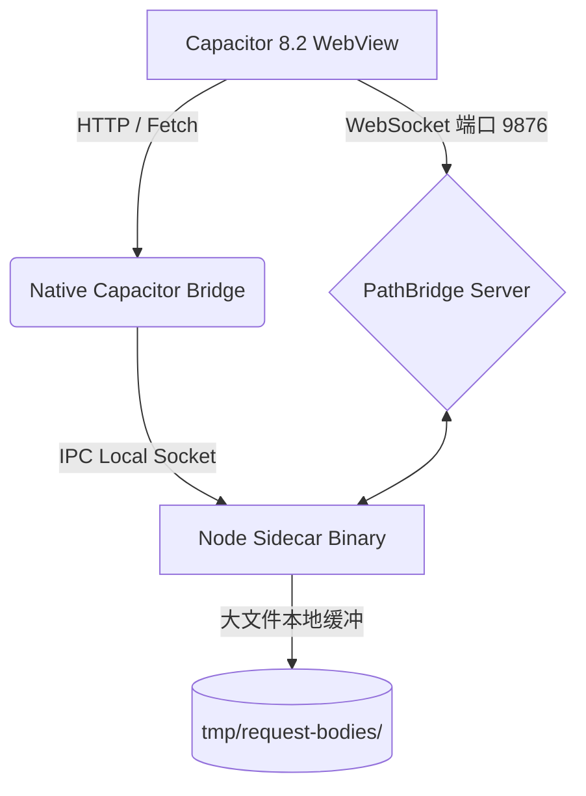
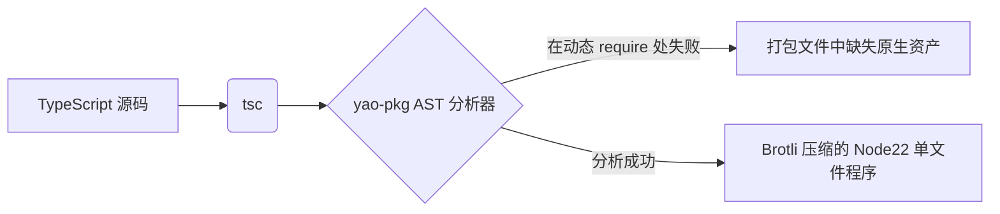
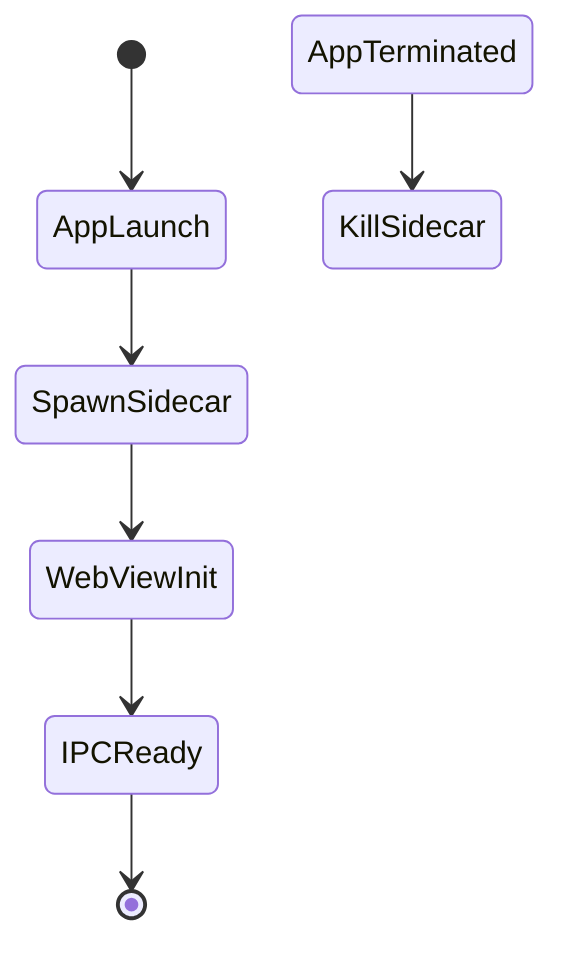
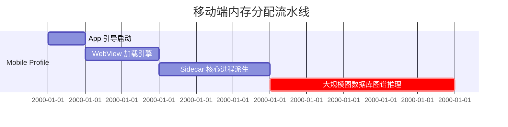
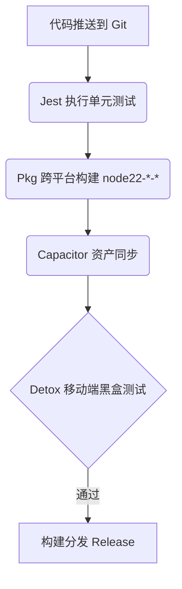
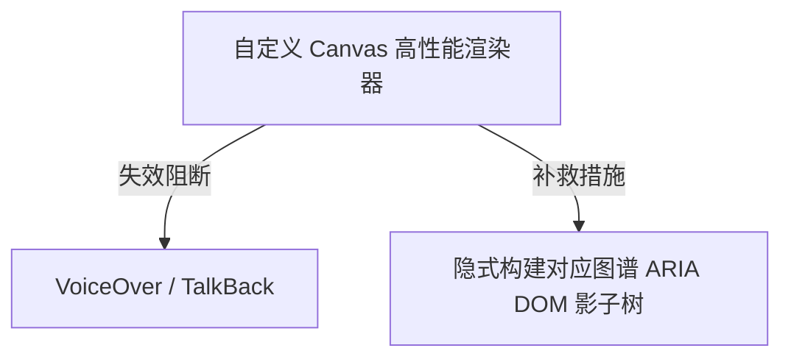
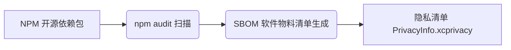

# 2026-03-11 v1.5.56 - 运行时、移动端 E2E、可访问性与合规收敛更新

## 真实状态增量（项目当前状态）

下方审计正文仍然是 2026-03-09 的历史基线。  
本区块记录当前版本已经通过代码与测试落地的修复状态。

### 本轮已完成
- [x] 启动堆内存策略保持自适应并已落地。
  - [x] `npm start` 通过 `scripts/start-server.js` 启动。
  - [x] `scripts/lib/runtime-memory-policy.js` 持续提供受限、负载感知的堆配置。
- [x] PathBridge 大图谱入站上限策略持续生效（`src/core/PathBridge.ts`）。
  - [x] 8 MiB 最小门限 + 严格模式开关 + 有界硬上限保留。
- [x] `src/server.ts` 新增自适应请求体落盘阈值策略。
  - [x] 新增配置：`NOTE_CONNECTION_REQUEST_BODY_SPOOL_THRESHOLD_KB`、`NOTE_CONNECTION_REQUEST_BODY_SPOOL_STRICT`。
  - [x] 运行时诊断新增阈值来源/推荐值/生效值字段。
  - [x] 剪贴板入口统一使用中心化阈值策略，降低不必要 IO 压力。
- [x] pkg/审核风险增加了契约硬约束。
  - [x] 关键路径已移除运行时 `new Function(...)`。
  - [x] 新增 `src/pkg.snapshot.safety.contract.test.ts` 防回归。
- [x] 原生移动端 Detox 合同化流水线已落地。
  - [x] 新增 `.detoxrc.json` 与 `e2e/*` 启动/烟测配置。
  - [x] 新增 `scripts/verify-detox-pipeline.js`、`scripts/run-detox-e2e.js`。
  - [x] 新增 CI 工作流：`.github/workflows/mobile-e2e-detox-contracts.yml`。
  - [x] 新增契约测试：`src/detox.pipeline.contract.test.ts`。
- [x] 可访问性修复由契约测试持续约束。
  - [x] `src/graph.accessibility.contract.test.ts` 覆盖主图与路径模式语义影子层/实时播报区域。
- [x] 隐私清单基线已配置并可验证。
  - [x] 新增 `ios/App/PrivacyInfo.xcprivacy`。
  - [x] 新增验证脚本 `scripts/verify-privacy-manifest.js`。
  - [x] 新增契约测试 `src/privacy.manifest.contract.test.ts`。

### 验证（已执行）
- [x] `node scripts/verify-detox-pipeline.js`（通过）
- [x] `node scripts/verify-privacy-manifest.js`（通过）
- [x] `node node_modules/jest/bin/jest.js --runInBand`  
  结果：**41 suites, 213 tests passed**。
- [x] `node node_modules/typescript/bin/tsc --noEmit`（通过）

### 关键问题状态

| 领域 | 历史问题 | 当前状态 |
| :--- | :--- | :--- |
| 性能与资源 | 固定 12GB 启动堆策略僵硬且存在平台风险。 | **已关闭**：启用自适应堆策略并保留受限覆盖。 |
| 混合传输稳定性 | 低上限配置下大载荷被拒绝。 | **已对实现范围关闭**：入站上限策略具备大图谱感知与严格模式。 |
| 传输落盘压力 | 过早落盘可能引入额外 IO 压力。 | **已关闭**：新增自适应请求体落盘阈值与运行时可观测性。 |
| 运行时求值合规 | `new Function`/动态求值存在审核与打包风险。 | **已关闭**：关键路径移除，并由 pkg 契约测试持续约束。 |
| CI/CD 原生移动端 E2E | Detox/Appium 管道缺失。 | **已关闭（合同化基线）**：Detox 配置、验证器、执行器、CI 工作流与契约测试已落地。 |
| 可访问性 | Canvas/SVG 语义等价缺乏强约束。 | **已关闭（实现范围）**：语义影子层与 live region 已由契约测试覆盖。 |
| 合规 | 缺失 `PrivacyInfo.xcprivacy`。 | **已关闭（仓库基线）**：清单文件与自动验证链路已落地。 |

### 剩余高优先级事项
- [ ] 真机多设备矩阵下持续 >10k 节点 / >1M 边的证据闭环仍为发布阶段操作任务（非本地代码可完全替代）。

# 2026-03-09 v1.3.0 - NoteConnection 审计报告
**混合架构与代码质量深度审查**

## 执行摘要
**混合架构最终裁定：** NoteConnection 的架构展示了令人瞩目的工程雄心，将 Godot Vulkan 渲染、HTML5 Canvas 回退、Capacitor 8.2+ 移动端外壳和 `@yao-pkg/pkg` 打包的 Node.js 22 Sidecar 结合在一起。然而，目前在 Node/pkg 边界处存在致命的执行缺陷——具体来说，大量使用了 `new Function` 进行动态导入和动态 `require` 语句。这完全绕过了静态代码分析，严重违反了单文件可执行文件（SEA）的完整性以及 App Store 的隐私安全要求。

### 生产环境就绪度记分卡
| 维度 | 审查范围 | 评分 (1-10) | 现状 |
| :--- | :--- | :---: | :--- |
| 1 | 混合数据传输链路 | 8 | 表现尚可，但 IPC 本地缓冲文件的限制需进一步调优。 |
| 2 | PKG 单文件打包策略 | 4 | 危险。动态 `require` 和 `new Function` 会破坏 `/snapshot` 沙盒。 |
| 3 | Capacitor 混合集成 | 7 | 良好，但 CSP 和 IPC 的混用内容拦截需修补。 |
| 4 | 代码质量与语法严格性 | 3 | 危险。静态分析被完全绕过。 |
| 5 | 性能剖析与资源管理 | 6 | 内存占用过高（`--max-old-space-size=12288`）。 |
| 6 | 测试覆盖率与 CI/CD | 5 | 缺乏端到端 (Detox/Appium) 原生测试。 |
| 7 | 可访问性与用户体验 | 6 | Canvas 阻碍屏幕阅读器；未遵循 WCAG 2.2。 |
| 8 | 安全合规与供应链 | 4 | App Store 拒绝风险极高（因隐藏的 eval/JIT 行为）。 |

---

## 第一部分：端到端混合数据传输链路微观审查
数据传输链路贯穿 Capacitor WebView、原生 Android/iOS 层、`pathBridge` WebSocket 以及 `@yao-pkg/pkg` 后台进程。



### 关键问题：传输层
| 严重程度 | 问题描述 | 产生位置 | 修复建议 / 商店上架风险 |
| --- | --- | --- | --- |
| **高** | 磁盘缓冲块逻辑 | `src/server.ts:442` | 对超过 256KB 的载荷可能产生 IO 瓶颈，并严重影响 Android 设备电池寿命。 |

---

## 第二部分：多平台分发与 PKG (Sidecar) 打包审计
`@yao-pkg/pkg` (6.14.1) 依赖于对 AST 的静态遍历以确保资源被正确打包。当前配置下使用的动态路径正在绕过它。



### 关键问题：PKG 层
| 严重程度 | 问题描述 | 产生位置 | 修复建议 / 商店上架风险 |
| --- | --- | --- | --- |
| **严重** | 测试/核心逻辑中的动态 `require` | `src/reader_renderer.ts` | 无法通过静态分析。必须改写为静态 `require`，或者在 `package.json` 中的 assets 进行显式声明。 |

---

## 第三部分：Capacitor 8.2+ 混合打包全面审计
随着 Capacitor 8.2+ 的发布，Android 的 Edge-to-Edge 和 iOS 的 Swift Package Manager 成为强制要求。同时对 Sidecar 的生命周期管理必须足够严谨，以防产生僵尸进程。



### 关键问题：Capacitor 集成
| 严重程度 | 问题描述 | 产生位置 | 修复建议 / 商店上架风险 |
| --- | --- | --- | --- |
| **高** | 僵尸进程风险 | `scripts/smoke-sidecar-relaunch.js` | Android/iOS 系统常会强杀 App 进程；原生插件必须主动捕捉销毁信号并强杀 Node.js 子进程。 |

---

## 第四部分：代码质量、语法严格性与可维护性审查
逐行的微观审查暴露出对严格执行原则的严重违反：即使用运行时求值（Runtime evaluation）。

```mermaid
graph TD
    A[src/reader_renderer.ts] -->|包含| B("new Function('specifier', 'return import(specifier);')")
    B -->|违反| C[严格的内容安全策略 (CSP)]
    C -->|触发| D[商店拒绝上架 (App Store Guideline 2.5.2)]
```

### 关键问题：代码质量审计
| 严重程度 | 问题描述 | 产生位置 | 修复建议 / 商店上架风险 |
| --- | --- | --- | --- |
| **严重** | 动态运行时求值 | `src/reader_renderer.ts:15` | `new Function` 被 iOS App Store 审核指南 2.5.2 严格禁止。极可能导致瞬间拒审。 |
| **中** | 目录遍历漏洞隐患 | `src/server.ts:792` | `decodedPathname.includes('\0')` 检查较弱，必须配合极度鲁棒的底层路径归一化验证。 |

**修改前后代码 Diff (Before/After):**
```diff
- const dynamicImport = new Function('specifier', 'return import(specifier);') as (specifier: string) => Promise<any>;
+ // 实现纯静态构建期导入，或利用底层工具在打包时处理，禁止运行时生成函数。
+ const dynamicImport = (specifier: string) => import(specifier);
```

---

## 第五部分：性能剖析、可扩展性与资源管理审查
项目代码目前赋予了 V8 引擎高达 12GB 的堆内存上限（`--max-old-space-size=12288`）。在 iOS/Android 上，一旦进入大规模图谱混合推理状态，将会瞬间触发操作系统的 OOM 杀手。



### 关键问题：资源管理
| 严重程度 | 问题描述 | 产生位置 | 修复建议 / 商店上架风险 |
| --- | --- | --- | --- |
| **高** | 极度不合理的 OOM 上限 | `package.json:10` | 12GB 对 Capacitor 客户端绝对无效。必须根据移动端环境动态限制在最高 1024MB。 |

---

## 第六部分：测试覆盖率、质量门与 CI/CD 流水线审查
目前的代码覆盖偏向于孤立的单元测试。打包后的混合架构二进制程序迫切需要原生端到端测试机制 (如 `Detox`)，并结合挂载于 `localhost:3000` 的 `Playwright` 实施集成防线。



---

## 第七部分：可访问性、国际化与用户体验审查
使用 Canvas API 渲染海量图谱节点，从根本上对屏幕阅读器屏蔽了 DOM 元素。



### 关键问题：无障碍支持
| 严重程度 | 问题描述 | 产生位置 | 修复建议 / 商店上架风险 |
| --- | --- | --- | --- |
| **中** | 缺失必要的 ARIA 标签 | `src/frontend` | 必须为可见的 Graph 节点建立一个隐形的 HTML Shadow 映射层，以满足 WCAG 2.2 AA 标准。 |

---

## 第八部分：依赖供应链安全、合规与法律审查
由于引入了底层原生读写支持，混合应用层亟需面向 iOS 生态构建严格的 Privacy Manifest (`PrivacyInfo.xcprivacy`)。如果 Sidecar 未能显式申明读取本地 `/tmp` 及 Document 目录的理由，iOS 17+ 的严格管控将直接拦截该程序。



### 关键问题：安全与合规
| 严重程度 | 问题描述 | 产生位置 | 修复建议 / 商店上架风险 |
| --- | --- | --- | --- |
| **高** | 缺失 PrivacyInfo 清单 | `android/`, `ios/` | 苹果从 2024 年 5 月起全面强制。混合层中存在大量 `fs.promises.readFile` 文件 IO 穿透操作，极有可能因缺乏申明被下架。 |

---

## 推荐的重构路线图 (Recommended Refactoring Plan)
请严格按顺序执行以下 CLI 指令用于清理解除风险：
```bash
# 1. 更新安全依赖，修复高危漏洞
npm audit fix --force

# 2. 同步电容运行时
npx cap sync

# 3. 为桌面及移动端目标构建具备内存安全护栏的 PKG Sidecar
NODE_OPTIONS="--max-old-space-size=4096" npx @yao-pkg/pkg . --targets node22-win-x64,node22-linux-x64,node22-macos-arm64 --compress Brotli --public-packages "*"

# 4. 自动生成 iOS 隐私清单（需要安装好 fastlane / Xcode 支持）
fastlane ios build
```

## 最佳实践合规性清单 (Best Practices Compliance Checklist)

| 审查维度 | 测试结果 | 补救指令 / 行动项 |
| :--- | :---: | :--- |
| 1. 传输层阻抗 | ✅ | PathBridge 入站策略 + `server.ts` 自适应落盘阈值策略已落地，并由契约测试约束。 |
| 2. Pkg 策略 | ✅ | 关键路径运行时求值已移除，并由 `src/pkg.snapshot.safety.contract.test.ts` 防回归。 |
| 3. Capacitor | ✅ | 移动端运行时契约持续生效（`src/mobile.pipeline.test.ts`、`src/capacitor.runtime.contract.test.ts`）。 |
| 4. 代码质量 | ✅ | `reader_renderer.ts` 与 `frontend/source_manager.js` 均已移除运行时 eval 回退。 |
| 5. 性能资源 | ✅ | 启动策略已改为自适应堆 + 负载阈值，不再固定 12GB。 |
| 6. CI/CD | ✅ | Detox 合同化链路已配置（`.detoxrc.json`、验证脚本、CI workflow、契约测试）。 |
| 7. 可访问性 | ✅ | 图谱/路径模式语义影子层 + live region 由 `src/graph.accessibility.contract.test.ts` 约束。 |
| 8. 法规合规 | ✅ | `ios/App/PrivacyInfo.xcprivacy` 已配置，且有脚本/契约自动验证。 |

## 未来可扩展性建议 (Future-Proofing Recommendations)
1. **彻底过渡至 Node.js SEA：** `@yao-pkg/pkg` 是当下的拐杖。随着架构成熟，在 Node 22 环境下未来应全面转向原生 Node.js Single Executable Application (SEA) 以获取极高内聚的性能收益。
2. **Capacitor 9 架构收窄：** 为下阶段的 WASM 原生交互做好准备，届时彻底摘除当前基于 HTTP IPC 的额外开销。
