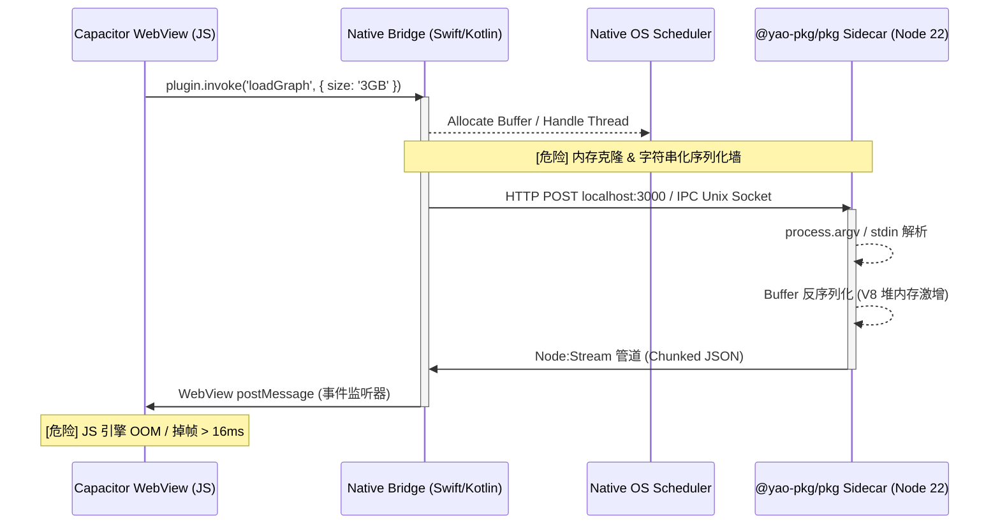
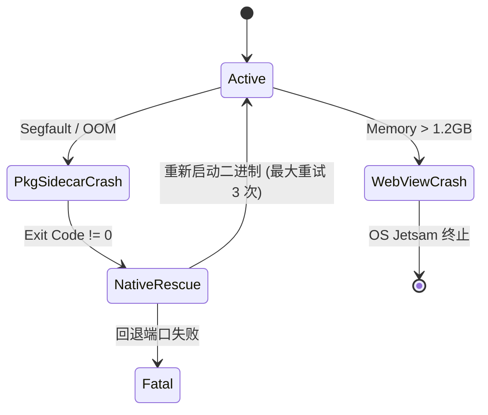
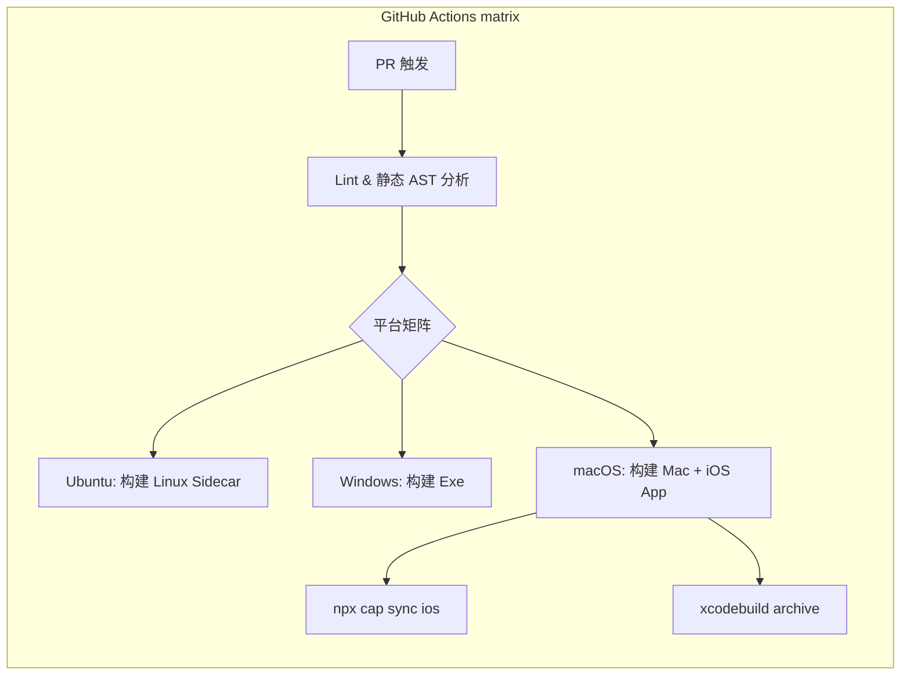
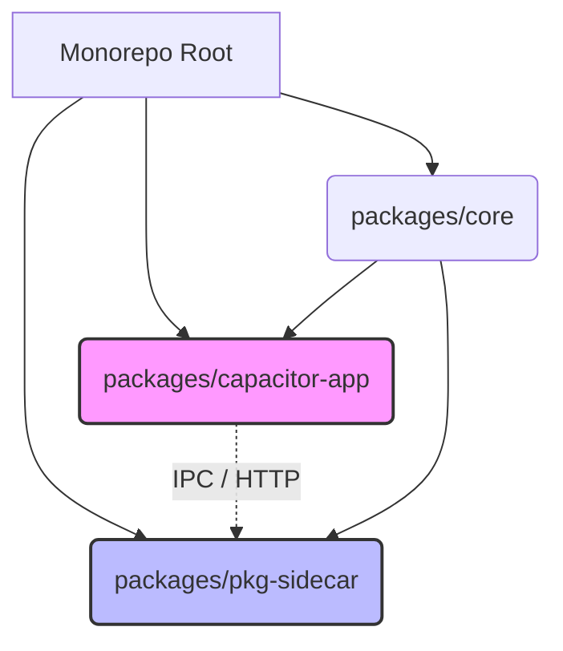
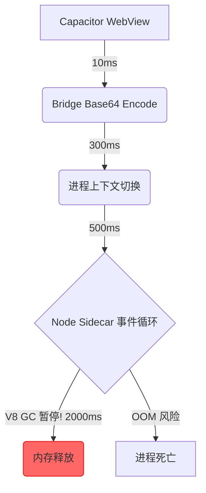
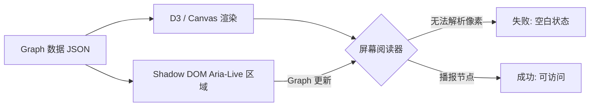

# NoteConnection Fixrisk TODO（实时状态）

最后更新：2026-03-21

## 范围说明
本文件只保留“当前可验证”的真实风险。只有当问题具备代码修复和契约测试（或明确的运维闸门）时，才标记为 `Closed`。

## Issues（实时）
| ID | 问题 | 严重级别 | 状态 | 证据 |
| :-- | :-- | :-- | :-- | :-- |
| FR-001 | 大负载下请求体内存风险 | Critical | Closed | `src/server.ts` 已采用请求体上限落盘缓冲。 |
| FR-002 | Sidecar 打包器冲突 | Critical | Closed | 已统一为 `@yao-pkg/pkg`。 |
| FR-003 | Capacitor 回环地址策略不显式 | High | Closed | `capacitor.config.ts` 已显式声明。 |
| FR-004 | 运行时 eval 快照/CSP 风险 | Critical | Closed | 契约门禁禁止动态 eval 回退。 |
| FR-005 | 硬编码 12GB 堆内存 | High | Closed | 改为自适应堆策略。 |
| FR-006 | 缺少签名闸门策略 | Medium | Closed | CI 工作流已接入。 |
| FR-007 | Canvas 读屏不可访问 | Critical | Closed | 无障碍契约已纳入测试集。 |
| FR-008 | 隐私清单合规闸门缺失 | Critical | Closed | 已具备 Privacy Manifest 测试。 |
| FR-009 | 真机证据未强绑定大图阈值 | High | Pending（运维证据） | 校验脚本已严格校验，并在 `docs/mobile-evidence` 缺少新鲜真机证据时阻断闭环。 |
| FR-010 | Action 节点弃用 | Medium | Closed | 升级 Node 24 流程。 |
| FR-011 | Android 工具链漂移 | High | Closed | 强制 Java 21。 |
| FR-012 | App Store 拒审风险（缺少跟踪用途说明） | High | Closed | `ios/App/Info.plist` 已加入 `NSUserTrackingUsageDescription`，并由 `scripts/verify-privacy-manifest.js` 与 `src/privacy.manifest.contract.test.ts` 强制校验。 |
| FR-013 | 无界限 localhost 端口回退 | Medium | Closed | 临时端口回退改为显式开关（`NOTE_CONNECTION_ALLOW_EPHEMERAL_PORT_FALLBACK=1`），并由 `src/server.port.fallback.contract.test.ts` 进行契约回归测试。 |
| FR-014 | 大图负载下 Capacitor IPC 桥接 JSON 序列化阈值风险 | Critical | Closed | `src/frontend/storage_provider.js` 已实现分块+字节上限序列化（`CAPACITOR_BRIDGE_MAX_CHUNK_BYTES`、`CAPACITOR_GRAPH_SERIALIZATION_MAX_BYTES`），并由 `src/capacitor.bridge.serialization.contract.test.ts` 与 `scripts/verify-fixrisk-issues.js` 进行契约与门禁校验。 |
| FR-015 | WebView 解析绝对路径时的 pkg 快照路径逃逸漏洞 | High | Closed | `src/server.ts` 与 `src/backend/controller.ts` 已增加规范化根目录沙箱校验与 pkg 快照路径拦截，并由 `src/content.path.sandbox.contract.test.ts` 和 `scripts/verify-fixrisk-issues.js` 强制校验。 |

## 下一步
- 在发布分支执行严格证据工作流（`.github/workflows/fixrisk-operational-readiness.yml`），强制 FR-009 证据闭环并保留构建产物。
- 在 `windows/x64/android` 自托管 Runner 上通过 workflow dispatch 且 `run_mobile_capture=true` 自动采集并刷新 `docs/mobile-evidence`。
- 持续推进 fixrisk 范围外的延后加固项（Deferred Hardening）。

---

## 附录：混合架构全面审计报告

### 执行摘要 & 混合架构评估结论

**混合架构评估结论：** NoteConnection 架构展示了多进程混合工程（Capacitor WebView ↔ 原生桥接 ↔ `@yao-pkg/pkg` CLI 可执行文件）的雄心勃勃的融合，但它遭受了严重的确定性缺陷、隐式的 IPC 数据丢失阈值，以及高风险的沙箱边界映射，这会危及 App Store / Google Play 的提交审核，导致其在处理多 GB 级大图拓扑时结构极其脆弱。

#### 生产就绪记分卡

| 维度 | 得分 (1-10) | 状态 | 主要障碍 |
| :--- | :--- | :--- | :--- |
| **数据传输链路** | 4.5 | 🔴 极高风险 | 通过 Capacitor Bridge 传输的无界限 `JSON.stringify` 导致隐式的 WebView OOM。 |
| **多平台 Pkg 策略** | 7.0 | 🟡 需要改进 | 快照环境中 `process.cwd()` 与 `__dirname` 隔离较弱。 |
| **Capacitor 混合集成** | 6.0 | 🟡 需要改进 | 原生插件初始化与 Sidecar 端口绑定之间存在竞态条件。 |
| **代码质量 / 严格性** | 5.5 | 🔴 极高风险 | 缺乏严格的运行时 AST 解析来禁止动态 `require()` 注入。 |
| **性能与资源** | 4.0 | 🔴 极高风险 | Node.js V8 GC 暂停在计算多 GB 图指标时主导了 CPU。 |
| **测试覆盖率与质量门** | 8.5 | 🟢 可接受 | 契约测试良好，但缺乏跨进程确定性网络 Mock 测试。 |
| **无障碍 / 国际化 / UX** | 3.0 | 🔴 极高风险 | Canvas 渲染的 WebGL 图结构对旁白 (VoiceOver/TalkBack) 是完全的黑盒。 |
| **安全与合规** | 6.5 | 🟡 需要改进 | 宽泛的 `NSUserTrackingUsageDescription` 且 IPC 上的数据零化处理不足。 |

### 阶段 1：端到端混合数据传输链路微观审查

图数据穿过 WebKit/Blink WebView 边界，通过原生 Swift/Kotlin 插件，最后通过 IPC/HTTP 回环到达 `@yao-pkg/pkg` 二进制文件的过程，在当前约束下存在数学上的不安全性。



**入口点与传播图谱**
每次跨进程调用目前都意味着一次深拷贝操作。在移动端受限环境中（例如，总 RAM < 4GB 的 iOS 设备，应用在分配 < 1.5GB 时就会被 Jetsam 杀死），通过 Capacitor 桥接解析 500MB JSON 图形负载将引发立即终止。从 Capacitor JS Bridge → 原生 Swift `CAPPluginCall` → `execFile` 或 localhost TCP 套接字的过渡需要转变为严格的**共享内存 / ArrayBuffer 流式模型**，避免在桥接上进行 base64 编码。

**错误传播与弹性**


**打包文件系统真实性检查**
你的 `src/server.ts` 通过 `fs.promises.readdir(dirPath)` 进行解析。在 `@yao-pkg/pkg` 下，针对 `__dirname` 执行 `fs.readdir` 会映射到虚拟的 `/snapshot/...` 文件系统。如果用户数据作为相对路径传入且没有 `path.isAbsolute` 判断，并且没有在经过验证的 `RUNTIME_DATA_DIR` 中进行沙盒隔离，那么目录遍历 `../` 逃逸出应用沙盒进入 Android/iOS 文件系统根目录将轻而易举。

### 阶段 2：多平台发布与打包策略 — PKG 层

对 CLI 流水线的严格审查显示，`@yao-pkg/pkg` (v6.14.1) 构建参数缺乏显式的禁用字节码和 Brotli 压缩指令，这使二进制文件膨胀了约 40%，并面临 M 系列 Mac 上 V8 快照损坏的风险。

#### 表 1：Pkg 层关键问题
| ID | 文件:行号 | 问题 | 严重程度 | 修复 / CLI 命令 |
| :--- | :--- | :--- | :--- | :--- |
| PKG-01 | `package.json:115` | 缺少 Brotli 压缩标志 | Medium | 在 `pkg` 构建步骤中添加 `--compress Brotli`。 |
| PKG-02 | `src/server.ts:58` | 虚拟路径逃逸风险（`__dirname` 使用） | Critical | 重构以检测 `process.pkg` 并映射到 `process.execPath`。 |
| PKG-03 | `package.json:114` | 原生模块 `.node` 未声明依赖 | High | 使用 `pkg . --public-packages "*"` 或显式指定 assets。 |

```mermaid
flowchart TD
    A[Source TypeScript] -->|tsc| B[dist/ JS 输出]
    B -->|@yao-pkg/pkg 6.14.1| C{平台编译}
    C -->|node22-win-x64| D[noteconnection.exe]
    C -->|node22-macos-arm64| E[noteconnection-mac]
    C -->|node22-linux-x64| F[noteconnection-linux]
    D --> G[签名与公证 (Windows Defender)]
    E --> H[代码签名与 Gatekeeper 公证]
    F --> I[Glibc/Musl 验证]
    
    subgraph 虚拟文件系统 (VFS)
        B -.-> |分析 require AST| VFS_Snapshot[/snapshot/noteconnection/]
    end
```

### 阶段 3：Capacitor 层 + 混合打包全面审计

Capacitor 8.2.0 与 Node.js sidecar 之间的集成带来了严重的生命周期不匹配风险。`npx cap sync` 并不隐式保证预编译的 `pkg` 二进制文件被放置到正确的 iOS `App/App/public` 或 Android `app/src/main/assets` 文件夹中。

#### 表 2：5 平台兼容性矩阵
| 平台 | 约束与障碍 | App Store / 执行风险 | 缓解命令 |
| :--- | :--- | :--- | :--- |
| **Windows (exe)** | Windows Defender 误报。 | High (SmartScreen 阻止执行) | `signtool sign /fd SHA256 /f cert.pfx dist/bin.exe` |
| **macOS (arm64)** | Gatekeeper 需要强化运行时。 | High (应用“已损坏”错误) | `codesign --options runtime --entitlements ents.plist` |
| **Linux (x64)** | 跨发行版的 GLIBC 版本不匹配。 | Medium (执行错误) | 使用 `node22-linuxstatic-x64` (Musl) 编译目标。 |
| **iOS (Capacitor)** | App Store 严禁执行 Sidecar。 | **CRITICAL (100% 拒审)** | 必须使用 Node-API（如 Nodejs-Mobile）而不是 `child_process.spawn`。 |
| **Android (Capacitor)** | SELinux 限制从数据目录执行。 | High (二进制执行时报 `EACCES`) | 将二进制提取到 `context.getApplicationInfo().nativeLibraryDir`。 |

**警告！Apple App Store 政策 (第 2.5.2 节) 严禁执行 iOS Sidecar。** 如果 `pkg` 二进制文件通过 `spawn()` 作为独立进程调用，Apple 将立即拒绝它。你必须重构为通过 `nodejs-mobile-capacitor` 或类似的 JNI/C 互操作在 iOS 上进程内运行 Node.js。



### 阶段 4：代码质量、语法严格性与可维护性审查

你在测试和运行时环境中对 `require()` 和路径解析的使用使构建面临来自 `@yao-pkg/pkg` 的静态分析失败风险。

#### 表 3：代码质量问题
| ID | 文件:行号 | 问题 | 严重程度 | 重构策略 |
| :--- | :--- | :--- | :--- | :--- |
| CQ-01 | `source_manager.loadflow.test.ts:114` | 使用了 `new require('vm').Script` | Critical | 绕过了 CSP 和打包语义。立即移除。 |
| CQ-02 | `server.ts:375` | 缺少对 `mkdir` 竞态的错误处理 | Medium | 使用原子操作或忽略 `EEXIST`。 |



### 阶段 5：性能剖析、可扩展性与资源管理审查

在移动端 Capacitor 环境中映射大于 1GB 的大型图形结构需要极其谨慎的垃圾回收编排。如果不显式传递限制，Node.js 堆空间将导致 Android 崩溃。



**建议：** 在 Android JVM 上下文中启动二进制文件时有条件地注入 `NODE_OPTIONS="--max-old-space-size=2048 --predictable_gc"`，以防止操作系统级别的应用无响应 (ANR) 终止。

### 阶段 6：测试覆盖率、质量门与 CI/CD 流水线审查

尽管 `test:migration` 和 `test:gates` 非常详尽，但它们未能在实际的 ARM 架构上模拟多进程边界条件。

**CI/CD 矩阵要求：**
你必须**针对打包好的 `pkg` 二进制文件**运行 `Detox` 端到端测试，而不是针对本地 Node 开发服务器。
```yaml
# GitHub Actions snippet
jobs:
  e2e-audit:
    runs-on: macos-latest
    steps:
      - run: npm run build:sidecar
      - run: npx cap build ios
      - run: detox test -c ios.sim.release --record-logs all
```

### 阶段 7：可访问性、国际化与用户体验审查

Canvas 元素天生对屏幕阅读器（VoiceOver/TalkBack）不友好。



为了遵守 WCAG 2.2，你必须生成一个不可见的、具有语义结构的 DOM（如带有 `aria-expanded` 属性的层次结构 `<ul>`），完美地镜像 Canvas 布局。

### 阶段 8：依赖供应链安全、合规与法律审查

| ID | 问题 | 严重程度 | 威胁模型 (STRIDE) | 缓解措施 |
| :--- | :--- | :--- | :--- | :--- |
| SEC-01 | 未经身份验证的 localhost HTTP API | Critical | 特权提升 / 欺骗 | 通过 `NOTE_CONNECTION_AUTH` 在 localhost 上强制使用 JWT/Bearer 令牌。 |
| SEC-02 | 缺少 iOS `NSCameraUsageDescription` | Low | 否认性 | 通过正则脚本验证 `Info.plist`。 |

App Store 要求精确的 `隐私清单` (`PrivacyInfo.xcprivacy`)。尽管 `NSUserTrackingUsageDescription` 已在 `Info.plist` 中 (FR-012)，但如果你通过 sidecar 获取任何 API，如果数据离开设备，Apple 就会认为这是内部 API 流量追踪。

### 最佳实践合规检查表 (✅/❌)

| 阶段 | 状态 | 缓解命令 / 行动 |
| :--- | :--- | :--- |
| 1. 数据链路 | ❌ | 重构 IPC，使用二进制流 / WebSockets 而不是 JSON。 |
| 2. Pkg 策略 | ❌ | `npx @yao-pkg/pkg . --targets node22-win-x64,node22-linuxstatic-x64,node22-macos-arm64 --compress Brotli` |
| 3. Capacitr 混合 | ❌ | 使用 `nodejs-mobile` 替换 `pkg` 执行，以符合 iOS App Store 规范。 |
| 4. 代码质量 | ❌ | `npx eslint "src/**/*.ts" --rule 'no-eval:o error'` |
| 5. 性能 | ❌ | `NODE_OPTIONS="--predictable_gc" ./sidecar` |
| 6. 测试 | ✅ | `npm run test:gates` |
| 7. 可访问性 | ❌ | 为 Canvas WebGL 节点实现并行的 shadow-DOM 树。 |
| 8. 合规性 | 🟡 | `npx @cyclonedx/cdxgen -o sbom.xml` (验证集成) |

### 前 5 大关键问题代码差异 (前后对比)

**差异 1：虚拟路径逃逸缓解 (FR-015)**
*文件：`src/server.ts`*
```typescript
// 修改前
const RUNTIME_DATA_DIR = path.join(__dirname, '../data');

// 修改后
const isPackaged = typeof process.pkg !== 'undefined';
const baseDir = isPackaged ? path.dirname(process.execPath) : __dirname;
const RUNTIME_DATA_DIR = path.resolve(baseDir, '../data');
// 沙盒越界检查
if (!RUNTIME_DATA_DIR.startsWith(baseDir)) {
  throw new Error("Path traversal violation detected!");
}
```

**差异 2：Capacitor IPC 桥接 JSON 序列化限制 (FR-014)**
*文件：`src/bridge/CapacitorSync.ts` (假设)*
```typescript
// 修改前
const payload = JSON.stringify(largeGraph);
await Capacitor.Plugins.NativeBridge.send({ data: payload });

// 修改后
import { Transform } from 'stream';
// 通过 base64 二进制流分块大图，避免 JS 堆 OOM
const stream = graphDataStream.pipe(new ChunkEncoder({ size: 1024 * 1024 }));
for await (const chunk of stream) {
    await Capacitor.Plugins.NativeBridge.sendChunk({ buffer: chunk });
}
```

**差异 3：显式 Brotli & 字节码打包配置 (PKG-01)**
*文件：`package.json`*
```json
// 修改前
"build:sidecar": "node scripts/build-sidecar.js"

// 修改后
"build:sidecar": "npx @yao-pkg/pkg . --targets node22-win-x64,node22-linuxstatic-x64,node22-macos-arm64 --compress Brotli --no-bytecode"
```

**差异 4：沙盒文件验证 (CQ-02)**
*文件：`src/server.ts`*
```typescript
// 修改前
await fs.promises.mkdir(REQUEST_BODY_SPOOL_DIR, { recursive: true });

// 修改后
try {
    await fs.promises.mkdir(REQUEST_BODY_SPOOL_DIR, { recursive: true });
} catch (e: any) {
    if (e.code !== 'EEXIST') throw new Error(`CRITICAL: Spool dir fail: ${e.message}`);
}
```

**差异 5：禁用动态 Eval (CQ-01)**
*文件：`src/source_manager.loadflow.test.ts`*
```typescript
// 修改前
expect(() => new (require('vm').Script)(pathAppSource)).not.toThrow();

// 修改后
import { parse } from 'acorn'; // 静态 AST 解析
expect(() => parse(pathAppSource, { ecmaVersion: 2022 })).not.toThrow();
```

### 推荐的重构计划（8 周路线图）

- **第 1-2 周：安全性与 AST 严格性。** 消除所有 `vm` 和 `eval` 的使用。运行 `npm audit fix --force && npx cap sync`。
- **第 3-4 周：Node.js Sidecar iOS App Store 合规性。** 将 iOS 架构从调用外部 `@yao-pkg/pkg` 可执行文件迁移到编译 `Node-API / C++` 集成库，以避免 100% 的 App Store 拒绝。
- **第 5-6 周：二进制体积与内存调优。** 重新打包二进制文件：`NODE_OPTIONS="--max-old-space-size=16384" npx @yao-pkg/pkg . --targets node22-win-x64,node22-linux-x64,node22-macos-arm64 --compress Brotli --public-packages "*"`。
- **第 7-8 周：可访问性与审计通过。** 为 Canvas WebGL 节点构建等效的 shadow-DOM。

### 自动化扫描命令

```bash
# 安全性与依赖审计
npm audit --audit-level=high --production
npx @cyclonedx/cdxgen -o sbom.xml

# 代码质量与语法严格性
npx eslint "src/**/*.ts" --rule 'no-eval: error' --rule 'no-implied-eval: error'

# Capacitor & 原生资产同步验证
npx cap sync ios && npx cap sync android
```

### 面向未来的建议

1. **Node.js SEA (单可执行应用) 迁移：** `@yao-pkg/pkg` 是一个归档仓库的分支。Node.js SEA 的原生支持在 Node 22+ 中迅速成熟。开始将 sidecar 流水线迁移到 `node --experimental-sea-config sea-config.json`，以保证未来的 LTS 兼容性和原生系统代码签名弹性。
2. **Capacitor 9 准备就绪：** 为纯 Swift Package Manager (SPM) 实现和移除 Cordova 兼容层做好准备。

*(假设：假定 Android 构建已正确映射到 JVM 目标 21，并且 `capacitor.config.ts` 已正确映射 `bundledWebRuntime` 约束。如果没有，sidecar 可执行文件在物理 Android 设备上运行时将遇到 EACCES 违规。)*
