## 中文文档

# 2026-03-09 v1.0.2

# 端到端混合架构与打包审计
**审计日期**: 2026年3月9日
**审计目标**: NoteConnection (Node.js + Capacitor + Tauri/pkg 混合架构)
**审计人**: 首席系统架构师与跨平台打包专家

---

## 执行摘要

**混合架构风险评分：9.5/10（检测到严重断层）**
当前的架构在移动端依赖于**“幽灵后端”**模式。虽然 Tauri 桌面应用成功启动了 Node.js sidecar（通过 `pkg`），但 Capacitor 移动应用（Android/iOS）**完全无法访问此运行时**。前端代码明确地向 `http://127.0.0.1:3000` 和 `ws://127.0.0.1:9876` 发起 `fetch()` 请求，这在移动设备上指向的是手机自身的回环接口，而那里**没有任何服务器在监听**。这确保了移动设备上的所有图谱加载、文件读取和繁重计算功能 100% 会失败。必须立即将“数据层”与“传输层”解耦。

---

## 第一部分：混合数据传输链路微观审查

### 1.1 端到端数据流图（“幽灵 Sidecar”问题）

```mermaid
flowchart TD
    subgraph Mobile_Device [移动设备 Android/iOS]
        App[Capacitor 应用\nWebView]
        FS_Native[原生文件系统]
        
        App -- "1. fetch'/api/content'" --> LocalNet[回环接口\n127.0.0.1]
        LocalNet -.->|连接被拒绝| Void[❌ 无服务器]
        
        App -- "2. 原生桥接" --> Plugin[Capacitor Filesystem 插件]
        Plugin --> FS_Native
    end
    
    subgraph Desktop_PC [桌面 PC Windows/macOS]
        Tauri[Tauri 应用]
        Sidecar[Pkg Node.js 二进制文件]
        
        Tauri -- "spawn" --> Sidecar
        Tauri -- "fetch'http://localhost:3000'" --> Sidecar
        Sidecar -- "fs.readFile" --> Disk
    end
    
    style Void fill:#ff0000,stroke:#fff,stroke-width:2px
    style App fill:#1e1e1e,stroke:#4caf50
    style Sidecar fill:#003366,stroke:#2196f3
```



### 1.2 入口向量与内部传播
-   **摄入 (桌面端):** 通过 `src/server.ts` 监听 `PORT` (默认 3000) 工作。数据通过 Tauri WebView 的 HTTP 请求进入。
-   **摄入 (移动端):** **已损坏**。前端代码 (`src/frontend/storage_provider.js`) 不分平台地盲目尝试 `fetch(url, ...)`。在移动端，此请求会撞上设备的内部网络栈并消亡。
-   **内部传播:**
    -   **PathBridge (WebSocket):** 用于 Mermaid 渲染和复杂路径算法。移动客户端无法访问此服务。
    -   **Workers:** `src/backend/workers` 由 Node.js 进程生成。由于移动端不存在 Node 进程，**移动端无法进行任何图谱计算、布局或统计分析。**

### 1.3 打包文件系统与桥接现实检查
-   **桌面端 (Pkg):** `pkg` 配置包含 `dist/src/backend/workers/**/*.js` 作为脚本。这允许它们被快照。然而，`server.ts` 中的 `fs.promises.readdir(KB_ROOT)` 访问的是 *宿主* 文件系统。这对于桌面工具是正确的，但与移动沙箱不兼容。
-   **移动端 (Capacitor):** `capacitor.config.ts` 设置 `webDir: 'dist/src/frontend'`。仅打包了这些静态资源。`KB_ROOT`（用户的笔记）**未被打包**。移动应用无法访问用户的笔记，除非它请求权限（AndroidManifest 中缺失）并使用 Capacitor Filesystem 插件（代码逻辑中缺失）。

### 1.4 安全与隐私深度剖析（STRIDE）
-   **欺骗 (Spoofing):** `PathBridge` WebSocket (端口 9876) 接受来自任何本地客户端的连接。在桌面上，恶意本地进程可以连接并执行命令或窃取图谱数据。
-   **拒绝服务 (DoS):** `server.ts` 中的 `readJsonBody` 函数将整个请求体缓冲到 RAM (`chunks.push(chunk)`)。500MB 的上传将导致进程崩溃 (OOM)，从而拖垮整个 sidecar。

---

## 第二部分：多平台分发与打包策略 — PKG 层

### 2.1 Pkg 配置保真度
**当前配置:**
```json
"pkg": {
  "scripts": ["dist/src/backend/workers/**/*.js"],
  "assets": ["dist/src/**/*", "data.js", "graph_data.json"]
}
```
**审计发现:**
1.  **目标不匹配:** `package.json` 脚本使用 `node18-win-x64`。`migration-gates.yml` 使用 Node 20。二进制文件正在使用已终止生命周期的 Node 版本构建（Node 18 EOL：2025年4月）。**行动：** 必须升级到 Node 22 (LTS)。
2.  **压缩:** 缺失 `--compress Brotli`。二进制文件比必要的大约 40%。
3.  **跨平台:** `package.json` 中的构建脚本 `npm run build:sidecar` **仅构建 Windows 版本**（`build-sidecar.js` 可能默认为 `.exe`）。主构建流程中没有为 macOS (`-macos-x64`, `-macos-arm64`) 或 Linux 目标提供预案。

### 2.2 静态分析合规性
-   **动态 Workers:** `src/server.ts` 可能使用相对于 `__dirname` 的路径生成 worker。在 `pkg` 二进制文件中，`__dirname` 是 `/snapshot/NoteConnection/dist/src`。Node 中的 `Worker` 线程通常无法解析快照路径，除非应用特定的 `pkg` 补丁或将 worker 代码外部化。

---

## 第三部分：Capacitor 层与混合集成审计

### 3.1 Capacitor 配置保真度
-   **WebDir:** `dist/src/frontend`。这对 UI 是正确的。
-   **插件:** 使用 `@capacitor/android`, `@capacitor/core`。**缺失:** `@capacitor/filesystem` 不在 `dependencies` 中，仅由架构需求暗示。
-   **Android 清单:** 存在 `android.permission.INTERNET`。**严重缺失:** `READ_EXTERNAL_STORAGE` / `MANAGE_EXTERNAL_STORAGE`（针对 Android 11+）。即使代码已修复，应用也无法读取任何 Markdown 文件。

### 3.2 平台特定兼容性矩阵

| 功能          | Windows (Tauri)  | macOS (Tauri) | iOS (Capacitor) | Android (Capacitor) |
| :---------- | :--------------- | :------------ | :-------------- | :------------------ |
| **UI 渲染**   | ✅ Webview2       | ⚠️ 未测试        | ✅ WKWebView     | ✅ WebView           |
| **API 访问**  | ✅ Localhost:3000 | ❌ 二进制缺失       | ❌ **失败**        | ❌ **失败**            |
| **图谱计算**    | ✅ Worker 线程      | ❌ 二进制缺失       | ❌ **失败**        | ❌ **失败**            |
| **文件访问**    | ✅ Node `fs`      | ❌ 二进制缺失       | ❌ **失败**        | ❌ **失败**            |
| **Mermaid** | ✅ PathBridge     | ❌ 二进制缺失       | ❌ **失败**        | ❌ **失败**            |

---

## 关键问题表

| ID       | 严重程度   | 位置                    | 问题描述                                                 | 复现 CLI                                | 影响            |
| :------- | :----- | :-------------------- | :--------------------------------------------------- | :------------------------------------ | :------------ |
| **C-01** | **严重** | `src/frontend/*.js`   | **幽灵后端:** 前端硬编码 `fetch` 到 localhost 端口。移动应用无法访问这些端口。 | `npx cap run android` -> 打开应用 -> 检查日志 | **移动端应用完全失效** |
| **C-02** | **严重** | `AndroidManifest.xml` | **权限缺失:** 未声明存储权限。应用无法读取笔记。                          | `npx cap run android` -> 尝试加载文件夹      | **崩溃 / 权限拒绝** |
| **H-01** | **高**  | `package.json`        | **EOL Node 目标:** 使用 Node 18 (EOL) 构建。                | `npm run build:sidecar`               | 安全漏洞，性能损失     |
| **H-02** | **高**  | `package.json`        | **单平台构建:** `build:sidecar` 仅构建 Windows `.exe`。       | 在 macOS 上构建                           | Sidecar 启动失败  |
| **M-01** | **中**  | `src/server.ts`       | **内存不安全:** `readJsonBody` 将无限制的数据缓冲到 RAM。            | 上传大文件                                 | OOM 崩溃        |

---

## 推荐重构计划

### 阶段 1：“双模”数据适配器（立即执行）
您必须抽象 API 层。前端不能直接 `fetch()`。它必须调用适配器。

**`src/frontend/adapter/DataAdapter.ts`:**
```typescript
import { Capacitor } from '@capacitor/core';
import { Filesystem, Directory } from '@capacitor/filesystem';

export const DataAdapter = {
  async getContent(path: string) {
    if (Capacitor.isNativePlatform()) {
      // 移动端：使用原生桥接
      const file = await Filesystem.readFile({
        path: path,
        directory: Directory.Documents,
        encoding: 'utf8'
      });
      return file.data;
    } else {
      // 桌面端：使用 Node Sidecar
      const res = await fetch(`/api/content?path=${encodeURIComponent(path)}`);
      return res.json();
    }
  }
  // 移动端图谱计算需使用 WebAssembly 或 JS 回退实现
}
```

### 阶段 2：移动端计算策略
由于移动端无法生成 Node worker：
1.  **选项 A (困难):** 将 `src/backend/workers` 逻辑移植到 WebView 内的 Web Worker（浏览器线程）中运行。
2.  **选项 B (简单):** 在移动端禁用图谱计算，仅允许“查看”在桌面上预先计算好的图谱。

### 阶段 3：构建流水线修复
**命令:** `npm run build:modern-sidecar`
```bash
pkg dist/src/server.js --target node22-win-x64,node22-macos-arm64,node22-linux-x64 --compress Brotli --no-bytecode --out-path src-tauri/bin/
```

---

## 最佳实践合规检查表

| 标准            | 状态  | 修复命令                                                                            |
| :------------ | :-- | :------------------------------------------------------------------------------ |
| **数据层抽象**     | ❌   | 实现 `DataAdapter` 以在 `fetch` 和 `Capacitor.Plugins` 之间切换。                         |
| **移动端运行时**    | ❌   | 将后端逻辑移植到 Web Workers 或 WASM 以支持移动端。                                             |
| **Node 版本**   | ❌   | 更新 `pkg` 目标为 `node22`。                                                          |
| **存储权限**      | ❌   | 添加 `<uses-permission android:name="android.permission.READ_EXTERNAL_STORAGE"/>` |
| **Brotli 压缩** | ❌   | 向 `pkg` 参数添加 `--compress Brotli`。                                               |
| **IPC 安全**    | ⚠️  | 向 `PathBridge` WebSocket 添加共享密钥令牌验证。                                            |

---

## 未来演进建议

1.  **WASM 核心:** 将繁重的图谱算法（介数中心性、布局）迁移到 Rust 并编译为 WASM。这允许相同的二进制逻辑在 Node Sidecar（快速）和移动 WebView（便携）中运行。
2.  **Node.js SEA:** 准备从 `@yao-pkg/pkg` 迁移到 **Node.js 单可执行应用 (SEA)**，因为 `pkg` 的维护是社区驱动的，可能会滞后于 Node 版本。
3.  **Capacitor 8 迁移:** 确保所有插件都更新到 v8 等效版本，以支持 Android 15 的边到边强制执行。
