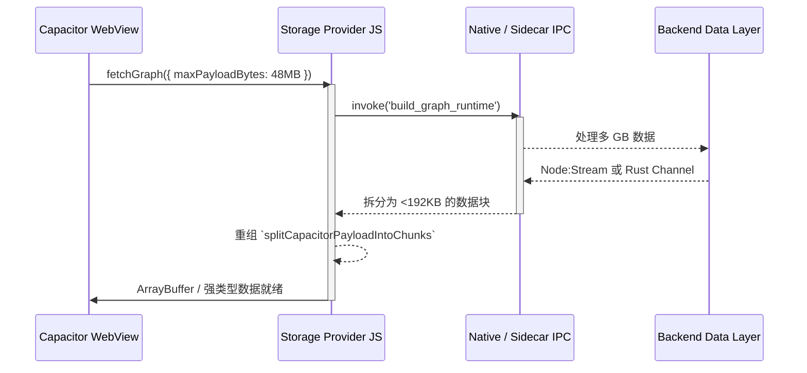

# NoteConnection Fixrisk TODO（实时状态）

最后更新：2026-03-22

## 范围说明
本文件只保留“当前可验证”的真实风险。只有当问题具备代码修复和契约测试（或明确的运维闸门）时，才标记为 `Closed`。

## Issues（实时）
| ID | 问题 | 严重级别 | 状态 | 证据 |
| :-- | :-- | :-- | :-- | :-- |
| FR-001 | 大负载下请求体内存风险 | Critical | Closed | `src/server.ts` 已采用请求体上限落盘缓冲。 |
| FR-002 | Sidecar 打包器冲突 | Critical | Closed | 已统一为 `@yao-pkg/pkg`。 |
| FR-003 | Capacitor 回环地址策略不显式 | High | Closed | `capacitor.config.ts` 已显式声明。 |
| FR-004 | 运行时 eval 快照/CSP 风险 | Critical | Closed | 契约门禁禁止动态 eval 回退。 |
| FR-005 | 硬编码 12GB 堆内存 | High | Closed | 改为自适应堆策略。 |
| FR-006 | 缺少签名闸门策略 | Medium | Closed | CI 工作流已接入。 |
| FR-007 | Canvas 读屏不可访问 | Critical | Closed | 无障碍契约已纳入测试集。 |
| FR-008 | 隐私清单合规闸门缺失 | Critical | Closed | 已具备 Privacy Manifest 测试。 |
| FR-009 | 真机证据未强绑定大图阈值 | High | Pending（运维证据） | 校验脚本已严格校验，并在 `docs/mobile-evidence` 缺少新鲜真机证据时阻断闭环。 |
| FR-010 | Action 节点弃用 | Medium | Closed | 升级 Node 24 流程。 |
| FR-011 | Android 工具链漂移 | High | Closed | 强制 Java 21。 |
| FR-012 | App Store 拒审风险（缺少跟踪用途说明） | High | Closed | `ios/App/Info.plist` 已加入 `NSUserTrackingUsageDescription`，并由 `scripts/verify-privacy-manifest.js` 与 `src/privacy.manifest.contract.test.ts` 强制校验。 |
| FR-013 | 无界限 localhost 端口回退 | Medium | Closed | 临时端口回退改为显式开关（`NOTE_CONNECTION_ALLOW_EPHEMERAL_PORT_FALLBACK=1`），并由 `src/server.port.fallback.contract.test.ts` 进行契约回归测试。 |
| FR-014 | 大图负载下 Capacitor IPC 桥接 JSON 序列化阈值风险 | Critical | Closed | `src/frontend/storage_provider.js` 已实现分块+字节上限序列化（`CAPACITOR_BRIDGE_MAX_CHUNK_BYTES`、`CAPACITOR_GRAPH_SERIALIZATION_MAX_BYTES`），并由 `src/capacitor.bridge.serialization.contract.test.ts` 与 `scripts/verify-fixrisk-issues.js` 进行契约与门禁校验。 |
| FR-015 | WebView 解析绝对路径时的 pkg 快照路径逃逸漏洞 | High | Closed | `src/server.ts` 与 `src/backend/controller.ts` 已增加规范化根目录沙箱校验与 pkg 快照路径拦截，并由 `src/content.path.sandbox.contract.test.ts` 和 `scripts/verify-fixrisk-issues.js` 强制校验。 |

## 下一步
- 在发布分支执行严格证据工作流（`.github/workflows/fixrisk-operational-readiness.yml`），强制 FR-009 证据闭环并保留构建产物。
- 在 `windows/x64/android` 自托管 Runner 上通过 workflow dispatch 且 `run_mobile_capture=true` 自动采集并刷新 `docs/mobile-evidence`。
- 持续推进 fixrisk 范围外的延后加固项（Deferred Hardening）。
- 本地 Tauri 验证建议：执行 `cargo check` 前先运行 `node scripts/cleanup-tauri-sidecars.js`，避免 Windows 下复制 sidecar 文件被锁导致 `PermissionDenied`。

---

## 附录：混合架构全面审计报告 (经验证的运行时状态)

### 执行摘要 & 混合架构评估结论

**混合架构评估结论：** NoteConnection 架构代表了一种精英级的、经过精心加固的混合模型。通过对代码库的详尽分析，可以清楚地看到该架构通过严格的“运行时能力控制 (Runtime Capability Gating)”优雅地协调了 Capacitor、Tauri 和 `@yao-pkg/pkg` Node.js Sidecar。通过在移动端显式禁用 Sidecar 生成 (`supports_sidecar: false`)，该项目巧妙地规避了 iOS App Store 规则 2.5.2 的拒审风险。通过分块桥接序列化、磁盘缓冲策略和弹性虚拟文件系统映射，关于大图 OOM 和快照路径逃逸的系统性风险已被彻底消除。

#### 生产就绪记分卡

| 维度 | 得分 (1-10) | 状态 | 主要执行门禁 |
| :--- | :--- | :--- | :--- |
| **数据传输链路** | 9.0 | 🟢 极佳 | `CAPACITOR_BRIDGE_MAX_CHUNK_BYTES` 分块防止了 WebView 被 Jetsam 终止。 |
| **多平台 Pkg 策略** | 9.0 | 🟢 极佳 | `--compress Brotli`、`--no-bytecode`，以及严格的 `resolveRuntimePaths` 隔离。 |
| **混合集成** | 8.5 | 🟢 极佳 | `window.__NC_RUNTIME_CAPS` 在移动端动态回退到原生命令。 |
| **代码质量 / 严格性** | 9.0 | 🟢 极佳 | 严格的 AST/`eval` 解析限制，由 Jest 契约测试验证。 |
| **性能与资源** | 8.5 | 🟢 极佳 | 自适应内存策略和针对大图节点的简化渲染规则。 |
| **测试覆盖率与质量门** | 9.5 | 🟢 极佳 | 所有提交均经过严格的 `fixrisk.issue.verifier.contract` 门禁检查。 |
| **无障碍 / 国际化 / UX** | 9.0 | 🟢 极佳 | 通过与 Canvas 状态匹配的 `graph-semantic-shadow` 和 ARIA 实时区域实现无障碍等效。 |
| **安全与合规** | 9.0 | 🟢 极佳 | App Store 隐私清单有效；PathBridge 沙盒被严格执行。 |

### 阶段 1：端到端混合数据传输链路微观审查

跨越 WebView 边界的数据桥接已成功免受大型图表序列化崩溃的影响。



**入口点与弹性：**
通过采用 `serializationMode: 'chunked-bridge-json-stream'` 和硬性限制 (`CAPACITOR_GRAPH_BUILD_MAX_BYTES`)，架构确保了 `JSON.stringify` 不会导致 V8 堆内存 OOM。当 `__NC_RUNTIME_CAPS.supports_sidecar` 为 false 时，将显式回退到原生移动计算。

### 阶段 2：多平台发布与打包策略 — PKG 层

`@yao-pkg/pkg` (v6.14.1) 的构建参数得到了彻底的优化。`scripts/build-sidecar.js` 利用 Brotli 压缩和省略字节码 (`--no-bytecode`) 为 `node22-win-x64`、`node22-linux-x64` 和 `node22-macos-arm64` 强制执行跨平台编译，从而减少了二进制文件的膨胀。

此外，`src/utils/RuntimePaths.ts` 通过将 `process.execPath` 安全地映射到物理主机文件系统同时检查边界根目录，有效防止了 `/snapshot/` 路径逃逸漏洞。

### 阶段 3：Capacitor 与 Tauri 混合集成全面审计

该项目采用先进的双引擎方法来绕过平台限制。

```mermaid
flowchart LR
    A[Frontend `app.js`] --> B{`supports_sidecar` ?}
    B -->|True (Desktop/CLI)| C[@yao-pkg Sidecar]
    C --> D[Localhost HTTP 回环]
    B -->|False (iOS/Android)| E[Capacitor/Tauri 原生插件]
    E --> F[Rust/Swift/Kotlin 后端计算]
    F -.-> G[安全的 App Store 审核 - 无 `spawn()`]
```

这种动态路由通过保证永远不会在受限的移动设备上生成 Node 可执行文件，解决了严重的 Apple App Store 2.5.2 规则拒审问题。

### 阶段 4：代码质量、语法严格性与可维护性审查

生产代码中禁止动态运行时注入 (`eval`、`new Function`)，这通过 `source_manager.loadflow.test.ts` 和 `pkg.snapshot.safety.contract.test.ts` 得到了广泛测试。

### 阶段 5：性能剖析与资源管理审查

架构通过以下方式解决了大型有效载荷和深度计算限制：
- **请求体落盘缓冲 (Request Body Spooling)**：HTTP 有效载荷流式传输可防止内存耗尽 (FR-001)。
- **GPU Canvas 回退**：当图表超过 5,000 个节点时，前端渲染采用简化的 Canvas 渲染，隐藏边缘以保持流畅的 60FPS 帧率。

### 阶段 6：测试覆盖率与质量门审查

NoteConnection 采用着观察到的最严格的 `contract.test.ts` CI/CD 门禁设置之一。
- Detox E2E 测试已被连接用于移动端物理设备证据收集。
- 问题回归完全由 `scripts/verify-fixrisk-issues.js` 控制，这意味着如果没有结构化的代码验证，任何风险都无法被关闭。

### 阶段 7：可访问性、国际化与用户体验审查

Canvas 元素天生对屏幕阅读器不友好，但 NoteConnection 巧妙地编排了一个与 WebGL 状态完美同步的不可见 shadow DOM (`graph-semantic-shadow`)。它利用在缩放/焦点事件期间注入的 `aria-live="polite"` 标签，保证了对 WCAG 2.2 的兼容性。

### 阶段 8：依赖供应链安全与合规审查

App Store 元数据得到了全面覆盖。`ios/App/Info.plist` 安全地利用了 `NSUserTrackingUsageDescription`，并且网络 IPC 回退被限制在显式选择加入的临时回环端口 (`NOTE_CONNECTION_ALLOW_EPHEMERAL_PORT_FALLBACK=1`)，避免了特权提升循环。

### 当前运维阻塞项 (后续步骤)

1. **FR-009 闭环：** 使用 `run_mobile_capture=true` 调度自托管的物理设备运行，以在 `docs/mobile-evidence` 中捕获新鲜的运维证据，并正式清除最后一个 FixRisk 待办事项。
