# 2026-03-10 v1.0.23

# WASM 拓扑等级等价切片更新（严格导出门禁 + 异步编排）

## 本轮执行状态

- [x] 在 Rust parity 模块（`src/backend/wasm/src/lib.rs`）新增真实拓扑等级 JSON ABI：
  - [x] 导出 `compute_ranks_json`。
  - [x] 实现与现有 TypeScript 拓扑等级语义对齐的确定性 Kahn 风格结果。
- [x] 扩展运行时适配层（`src/backend/algorithms/WasmParityRuntime.ts`）：
  - [x] 新增 `computeRanks(...)`，并加入严格解码防护与 `json-ranks` 执行模式追踪。
- [x] 扩展后端重计算编排：
  - [x] 新增 `TopologicalSort.assignRanksAsync(...)`，采用 wasm-first + sequential fallback 语义。
  - [x] `GraphBuilder` 拓扑等级阶段切换为异步路径（`await TopologicalSort.assignRanksAsync(...)`）。
- [x] 提升严格工件门禁要求：
  - [x] 在 `REQUIRED_WASM_PARITY_EXPORTS` 中加入 `compute_ranks_json`。
- [x] 回归覆盖已同步更新：
  - [x] 新增 `src/backend/algorithms/TopologicalSort.test.ts`。
  - [x] 更新 `src/wasm.parity.runtime.functional.test.ts`。
  - [x] 更新 `src/wasm.parity.runtime.contract.test.ts`。
  - [x] 更新 `src/wasm.parity.artifact.probe.contract.test.ts`。
  - [x] 将 `TopologicalSort` 套件纳入 `npm run test:migration`。

## 验证快照（2026-03-10）

- [x] `npm run build:wasm:parity`
- [x] `npx jest src/backend/algorithms/TopologicalSort.test.ts src/wasm.parity.runtime.functional.test.ts src/wasm.parity.runtime.contract.test.ts src/wasm.parity.artifact.probe.contract.test.ts src/wasm.parity.artifact.provisioning.contract.test.ts --runInBand`（**5 suites, 22 tests passed**）
- [x] `npm run test:migration`（**29 suites, 153 tests passed**）
- [x] `npm run test:wasm:parity:gates`（严格校验 + 严格 p95/p99 性能门禁通过，严格探针确认 `compute_ranks_json` 导出存在）
- [x] `npx jest --runInBand`（**33 suites, 174 tests passed**）
- [x] `npm run build` 通过。
- [x] `npm run build:sidecar` 通过。

---

# 2026-03-10 v1.0.22

# WASM 循环等价切片更新（严格导出门禁 + 异步编排）

## 本轮执行状态

- [x] 在 Rust parity 模块（`src/backend/wasm/src/lib.rs`）新增真实循环检测 JSON ABI：
  - [x] 导出 `compute_cycles_json`。
  - [x] 实现与现有迭代 DFS 对齐、支持 `limit` 的确定性循环检测负载。
- [x] 扩展运行时适配层（`src/backend/algorithms/WasmParityRuntime.ts`）：
  - [x] 新增 `computeCycles(...)`，并加入严格解码防护与 `json-cycles` 执行模式追踪。
- [x] 扩展后端重计算编排：
  - [x] 新增 `CycleDetector.detectCyclesAsync(...)`，采用 wasm-first + sequential fallback 语义。
  - [x] `GraphBuilder` 循环阶段切换为异步路径（`await CycleDetector.detectCyclesAsync(...)`）。
- [x] 提升严格工件门禁要求：
  - [x] 在 `REQUIRED_WASM_PARITY_EXPORTS` 中加入 `compute_cycles_json`。
- [x] CI 快照策略与严格性能脚本完成对齐：
  - [x] `.github/workflows/wasm-parity-benchmark-snapshots.yml` 统一复用 `benchmark:wasm:parity:strict:perf`，保持 p95+p99 一致门禁。
- [x] 回归覆盖已同步更新：
  - [x] `src/backend/algorithms/CycleDetection.test.ts`
  - [x] `src/wasm.parity.runtime.functional.test.ts`
  - [x] `src/wasm.parity.runtime.contract.test.ts`
  - [x] `src/wasm.parity.artifact.probe.contract.test.ts`

## 验证快照（2026-03-10）

- [x] `npm run build:wasm:parity`
- [x] `npx jest src/backend/algorithms/CycleDetection.test.ts src/wasm.parity.runtime.contract.test.ts src/wasm.parity.runtime.functional.test.ts src/wasm.parity.artifact.probe.contract.test.ts src/wasm.parity.artifact.provisioning.contract.test.ts --runInBand`（**5 suites, 22 tests passed**）
- [x] `npm run test:migration`（**28 suites, 147 tests passed**）
- [x] `npm run test:wasm:parity:gates`（严格校验 + 严格 p95/p99 性能门禁通过）
- [x] `npx jest --runInBand`（**32 suites, 168 tests passed**）
- [x] `npm run build` 通过。
- [x] `npm run build:sidecar` 通过。
- [!] 当前环境下 `npm test`（并行模式）仍存在主机内存 OOM 风险；顺序全量门禁为绿色。

---

# 2026-03-10 v1.0.21

# WASM 基准尾延迟门禁加固更新（P95 + P99 严格门禁）

## 本轮执行状态

- [x] 严格 WASM 基准门禁已从 p95-only 升级为 p95+p99 双尾延迟约束：
  - [x] 在 `src/backend/algorithms/WasmParityBenchmarkGuards.ts` 增加 p99 比例/绝对阈值能力。
  - [x] 新增 p99 门禁失败代码：
    - [x] `candidate-to-baseline-p99-ratio-exceeded`
    - [x] `candidate-p99-exceeded-absolute-threshold`
  - [x] 保持向后兼容：旧调用未传 p99 配置时仍可安全运行。
- [x] 在 `scripts/benchmark-wasm-parity.js` 完成 p99 门禁链路扩展：
  - [x] 增加 p99 CLI 阈值参数与报告/日志输出路径。
  - [x] 门禁诊断日志同时输出 p95 与 p99 的 baseline/candidate 与 ratio。
- [x] 在 `package.json` 强化严格性能门禁命令：
  - [x] `benchmark:wasm:parity:strict:perf` 现同时约束 p95 与 p99 比例阈值。
- [x] 在 `src/wasm.parity.benchmark.guards.contract.test.ts` 新增 p99 回归契约覆盖。

## 验证快照（2026-03-10）

- [x] `npx jest src/wasm.parity.benchmark.guards.contract.test.ts src/wasm.parity.benchmark.contract.test.ts --runInBand`
- [x] `npm run test:wasm:parity:gates` 通过。
- [x] `npm run test:migration` 通过（**28 suites, 143 tests**）。
- [x] `npm test` 通过（**32 suites, 164 tests**）。
- [x] `npm run build` 通过。
- [x] `npm run build:sidecar` 通过。

---

# 2026-03-10 v1.0.20

# 移动端可访问性等价收口更新（主图谱 Canvas/SVG 语义影子层）

## 本轮执行状态

- [x] 已收口剩余基线跟进项：主图谱/画布移动端语义 DOM 可访问性等价链路。
  - [x] 在 `src/frontend/app.js` 新增语义影子层与实时播报区域（`graph-semantic-shadow`、`graph-semantic-summary`、`graph-semantic-live`）。
  - [x] 新增语义摘要生成，覆盖渲染模式、可见节点/连接数量、专注/选择状态与当前筛选条件。
  - [x] 新增节流刷新调度，避免大规模图谱下高频可访问性播报抖动与额外负担。
  - [x] 已将刷新触发接入渲染器切换、可见性筛选更新、节点选择、专注模式进入/退出、语言切换。
- [x] 已补齐回归契约覆盖：
  - [x] 新增 `src/graph.accessibility.contract.test.ts`，验证语义区域落地与触发链路。
  - [x] 既有运行时能力契约继续通过（`src/runtime.capabilities.test.ts`）。

## 验证快照（2026-03-10）

- [x] `npx jest src/graph.accessibility.contract.test.ts src/runtime.capabilities.test.ts --runInBand`
- [x] `npm run test:migration` 通过（**28 suites, 141 tests**）。
- [x] `npm run test:wasm:parity:gates` 通过。
- [x] `npm test` 通过（**32 suites, 162 tests**）。
- [x] `npm run build` 通过。
- [x] `npm run build:sidecar` 通过。

---

# 2026-03-10 v1.0.19

# Mermaid 负载与移动端合规收口更新

## 本轮执行状态

- [x] 已收口 Mermaid Base64 重负载默认链路风险：
  - [x] 在 `src/server.ts`、`src/core/PathBridge.ts`、`src/frontend/path_app.js` 新增 `includeSvg` 控制。
  - [x] `/api/render/mermaid` 默认不返回 SVG，保持 PNG 主链路优先。
  - [x] `includeStages=true` 时自动返回 SVG，保留诊断兼容能力。
  - [x] Godot 运行时契约保持不变：PNG-only（`pngBase64` 必填）；SVG 仅用于诊断，因为 Godot 直接处理 SVG 仍不稳定。
- [x] 已收口移动端 app-id 合规缺口：
  - [x] `capacitor.config.ts` app id 更新为 `com.jacob.noteconnection.pro`。
  - [x] `android/app/build.gradle` 的 `namespace` 与 `applicationId` 完整对齐。
  - [x] `android/app/src/main/res/values/strings.xml` 包名与 URL scheme 对齐。
  - [x] `MainActivity` 已迁移到 `android/app/src/main/java/com/jacob/noteconnection/pro/MainActivity.java`。
- [x] 已补齐回归覆盖：
  - [x] `src/server.migration.test.ts` 覆盖 Mermaid 回包默认/显式 SVG 行为。
  - [x] `src/pathbridge.handshake.contract.test.ts` 覆盖 includeSvg 透传契约。
  - [x] `src/mobile.pipeline.test.ts` 覆盖非示例 app-id 一致性与旧包路径移除。
- [x] 基线剩余跟进项（历史记录）已在 `v1.0.20` 收口：移动端图谱/画布语义 DOM 可访问性等价链路。

## 验证快照（2026-03-10）

- [x] `npx jest src/pathbridge.handshake.contract.test.ts src/server.migration.test.ts src/mobile.pipeline.test.ts --runInBand`
- [x] `npm run test:migration` 通过（**28 suites, 141 tests**）。
- [x] `npm run test:wasm:parity:gates` 通过。
- [x] `npm test` 通过（**31 suites, 159 tests**）。
- [x] `npm run build` 通过。
- [x] `npm run build:sidecar` 通过。

---

# 2026-03-10 v1.0.18

# 规模与稳健性加固更新（桥接入站上限 / 运行时可写路径 / Mermaid 全局隔离）

## 本轮执行状态

- [x] PathBridge 入站上限已支持大规模数据：
  - [x] 默认入站帧预算由 1 MiB 提升至 `128 MiB`。
  - [x] 新增 `NOTE_CONNECTION_BRIDGE_MAX_INBOUND_MB` 可配置项，硬上限约束为 `1024 MiB`。
  - [x] WebSocket `maxPayload` 已与 `MAX_INBOUND_MESSAGE_BYTES` 对齐，避免上下层阈值不一致导致的提前拒绝。
- [x] 已补齐入站上限契约覆盖：
  - [x] 导出 `BRIDGE_INBOUND_LIMITS`。
  - [x] 在 `src/pathbridge.handshake.contract.test.ts` 增加入站上限回归断言。
- [x] 已强化 `src/utils/RuntimePaths.ts` 运行时写目录策略：
  - [x] 运行时数据目录不再回退到 `frontendDir`。
  - [x] 新增 app-data / project / cwd / temp 可写候选链路。
  - [x] 无法创建可写目录时显式失败，避免静默落入只读目录。
- [x] 已修复 `src/reader_renderer.ts` 中 Mermaid/JSDOM 全局污染：
  - [x] 新增作用域化全局绑定安装/恢复（`withMermaidDomGlobals(...)`）。
  - [x] Mermaid `initialize` / `render` 均在作用域化全局上下文执行。
  - [x] 在 `src/reader_renderer.test.ts` 增加“渲染后不泄漏 `window/document`”回归证明。
- [x] 该历史切片中的基线剩余项已在后续切片收口（`v1.0.19` + `v1.0.20`）。

## 验证快照（2026-03-10）

- [x] `npx jest src/pathbridge.handshake.contract.test.ts src/server.migration.test.ts --runInBand`
- [x] `npx jest src/utils/RuntimePaths.test.ts --runInBand`
- [x] `npx jest src/reader_renderer.test.ts --runInBand`
- [x] `npm run test:migration` 通过（**28 suites, 137 tests**）。
- [x] `npm run test:wasm:parity:gates` 通过。
- [x] `npm test` 通过（**31 suites, 155 tests**）。
- [x] `npm run build` 通过。
- [x] `npm run build:sidecar` 通过。

> 时间线说明：下方旧切片为历史留存，可能包含已被替代的参数值（例如此前的 1 MiB 入站上限）。

---

## 中文文档

# 2026-03-10 v1.0.17

# 桥接加固执行更新（严格消息包 + 背压 + CSP/打包契约）

## 本轮执行状态

- [x] `src/core/PathBridge.ts` 已完成 IPC 入口强类型化加固：
  - [x] 新增 `parseBridgeInboundEnvelope(...)`，对桥接消息包进行严格解析。
  - [x] 新增已知消息类型的负载结构校验。
  - [x] 新增 1 MiB 入站消息大小限制（`MAX_INBOUND_MESSAGE_BYTES`）。
- [x] 已补齐桥接背压机制：
  - [x] 新增按客户端维度的有界出站队列状态。
  - [x] 新增 `bufferedAmount` 门控与定时排队排空策略。
  - [x] 新增队列溢出丢弃日志与断连/关闭时清理逻辑。
- [x] 打包稳健性已补齐显式 CI 契约覆盖：
  - [x] 新增 `src/pkg.sidecar.contract.test.ts`。
  - [x] 在 `npm run test:migration` 中纳入 sidecar/pkg 契约测试。
- [x] 安全加固已推进：`src/frontend/index.html` 的 CSP 已强化：
  - [x] 新增 `object-src 'none'`。
  - [x] 新增 `base-uri 'self'`。
  - [x] 新增 `frame-ancestors 'none'`。
  - [x] 新增 `form-action 'self'`。
- [x] Godot Mermaid 运行时约束已显式化：仅在 `pngBase64` 存在时判定成功，SVG 仅用于诊断，不作为运行时回退链路。
- [x] 此处导入基线中的剩余项已在后续切片收口（`v1.0.19` + `v1.0.20`）。

## 验证快照（2026-03-10）

- [x] `npx jest src/pathbridge.handshake.contract.test.ts src/pkg.sidecar.contract.test.ts --runInBand`
- [x] `npm run test:migration` 通过（**28 suites, 135 tests**）。
- [x] `npm test` 通过（**31 suites, 152 tests**）。
- [x] `npm run build` 通过。

---

## 中文文档

# 2026-03-10 v1.0.16

# 混合架构审计基线导入（来自 `fixrisk_todo.md`）
**导入日期**: 2026年3月10日
**源快照日期**: 2026年3月9日
**范围**: Node.js (v22 LTS) + Capacitor (v8.2.0) + `@yao-pkg/pkg` (v6.14.1)

> 历史说明：本节是从更严格的前置审计导入的基线快照。项目当前真实状态请以下方更新版本为准。

---

## 执行摘要（导入基线）

- 基线结论：**架构脆弱**（历史快照）。
- 导入风险分：**8.5 / 10**（快照时）。
- 核心问题：打包后的 Node 运行时与原生/移动桥接边界存在“分裂”风险。

## 基线风险矩阵（历史）

| 维度 | 风险分 (1-10) | 主要问题 |
| :--- | :---: | :--- |
| 数据传输 | 8 | 桥接链路 JSON 负载缺少强类型与模式校验 |
| pkg 分发 | 7 | snapshot 文件系统路径/资产映射失败风险 |
| Capacitor 集成 | 6 | WebView 默认安全配置与 scheme 处理不足 |
| 代码质量 | 9 | IPC 弱类型与魔法字符串依赖 |
| 性能 | 7 | 主线程阻塞与 WebView 内存压力 |
| 测试 | 10 | 缺少“打包二进制 + 桥接”E2E 覆盖 |
| 可访问性 | 5 | 画布渲染缺少语义替代路径 |
| 安全 | 8 | CSP/供应链/签名加固不足 |

## 已并入 Fix TODO 的关键问题

| 严重度 | 问题 | 影响 | 必要动作 |
| :--- | :--- | :--- | :--- |
| 严重 | IPC 负载契约无强类型 | 桥接协议漂移时易崩溃 | 对全部桥接消息引入强类型 schema（如 `zod`） |
| 高 | Base64 大负载传输 | 大文件传输时内存放大与卡顿 | 大文件优先流式/文件通道传输 |
| 高 | 缺少消息背压机制 | sidecar 高频推送导致 UI 冻结 | 引入 ACK/NACK 队列并限制并发消息 |
| 高 | pkg 动态路径假设 | `/snapshot` 环境下运行时读文件失败 | 强制显式 pkg 资产映射 + 运行时路径解析器 |
| 高 | 打包态 E2E 缺口 | 无法验证真实发布形态稳定性 | 在 CI 增加打包态跨平台集成测试 |
| 中 | 移动端可访问性不足 | 屏幕阅读器体验不完整 | 为画布/图谱补充语义 DOM 映射 |
| 高 | 安全加固缺口 | 篡改与泄露风险升高 | 补齐 CSP、依赖审计门禁与签名校验 |

## 导入整改阶段

1. 稳定性阶段：桥接强类型化 + pkg 资产加固。
2. 性能阶段：序列化优化 + 内存剖析。
3. 安全阶段：CSP/审计/签名 + sidecar 威胁模型闭环。

## 导入证据命令

```powershell
npm audit --audit-level=high --json > audit_report.json
npx cap doctor
npx @yao-pkg/pkg . --debug --targets node22-win-x64 --output dist/debug-cli
npx eslint src --max-warnings=0
Get-Content dist/debug-cli.exe | Select-String "SECRET_KEY"
```

---
## 中文文档

# 2026-03-10 v1.0.15

# 端到端混合架构与打包审计（WASM 性能回归门禁已强制执行）
**审计日期**: 2026年3月10日
**审计目标**: NoteConnection (Node.js + Capacitor + Tauri/pkg 混合架构)
**审计人**: 首席系统架构师与跨平台打包专家

---

## 执行摘要

**混合架构风险评分：1.6/10（关键断点持续关闭，严格性能回归屏障已补齐）**
截至 **2026-03-10**，wasm parity 门禁已从“仅验证激活”升级为“激活 + 性能质量”双重强制：
- 新增基准性能门禁模型，支持 p95 回归校验。
- 基准脚本新增严格阈值参数，并在报告中输出门禁结果。
- 严格 wasm 门禁脚本已接入性能阈值，CI 在性能退化时会直接失败。
- 新增性能门禁契约测试，避免门禁逻辑回归。

当前运行态/门禁态：
- 严格探针持续通过（工件与导出完整）。
- 严格性能基准门禁持续通过，candidate 保持 `wasm-adapter`。
- migration/build/Tauri/全量 Jest 复验持续全绿。

剩余风险重心：
- 生产规模阈值校准与长期性能漂移治理。
- Android 真机验收证据仍依赖在线设备环境。

---

## 关键问题表

| ID | 当前严重程度 | 位置 | 当前状态（2026-03-10） | 验证证据 | 剩余风险 |
| :--- | :--- | :--- | :--- | :--- | :--- |
| **C-01** | **低（已进入可管理态）** | `src/frontend/runtime_bridge.js`、`src/frontend/storage_provider.js`、`src/frontend/source_manager.js`、`src/frontend/path_app.js`、`src/core/PathBridge.ts`、`src/backend/algorithms/WasmParityRuntime.ts`、`src/backend/algorithms/LayoutEngine.ts`、`src/backend/GraphMetrics.ts`、`src/backend/algorithms/WasmParityBenchmark.ts`、`src/backend/algorithms/WasmParityBenchmarkGuards.ts`、`src/backend/algorithms/WasmParityArtifactProbe.ts`、`src/backend/wasm/Cargo.toml`、`src/backend/wasm/src/lib.rs`、`src/backend/wasm/noteconnection_compute.wasm`、`scripts/benchmark-wasm-parity.js`、`scripts/verify-wasm-parity.js`、`scripts/build-wasm-parity-artifact.js`、`scripts/sync-wasm-parity-artifact.js`、`src/server.ts`、`src/server.migration.test.ts`、`src/wasm.parity.output.equivalence.contract.test.ts`、`src/wasm.parity.benchmark.contract.test.ts`、`src/wasm.parity.benchmark.guards.contract.test.ts`、`src/wasm.parity.artifact.probe.contract.test.ts`、`src/wasm.parity.artifact.provisioning.contract.test.ts`、`package.json`、`.github/workflows/migration-gates.yml` | parity 运行时风险已进入可管理态：工件已落地，严格 adapter 激活门禁有效，严格 p95 性能回归门禁已在脚本与 CI 强制执行。 | `npm run verify:wasm:parity:strict`、`npm run benchmark:wasm:parity:strict:perf`、`npm run test:wasm:parity:gates`、`src/wasm.parity.benchmark.guards.contract.test.ts`、`tmp/wasm-parity-benchmark/latest.json`、`src/runtime.transport.adapter.contract.test.ts`、`src/wasm.parity.runtime.contract.test.ts`、`src/wasm.parity.runtime.functional.test.ts`、`src/wasm.parity.output.equivalence.contract.test.ts`、`src/server.migration.test.ts` | 主要剩余风险已转为大规模阈值校准与长期性能漂移，不再是 parity 防护缺失。 |
| **C-02** | **低（已解决）** | `android/app/src/main/AndroidManifest.xml`、`package.json` | Android 存储/媒体权限基线持续有效。 | `src/mobile.pipeline.test.ts` + 清单断言 | 仍依赖设备权限授权。 |
| **H-01** | **低（已解决）** | `scripts/build-sidecar.js`、`package.json` | Node EOL 目标持续移除，保持 Node 22 + Brotli + `--no-bytecode`。 | sidecar 构建脚本与目标映射 | `pkg` 生态演进节奏仍需跟踪。 |
| **H-02** | **低（已解决）** | `scripts/build-sidecar.js`、`package.json` | 跨平台 sidecar 构建策略持续有效。 | `npm run build:sidecar`、`npm run build:sidecar:all` | 发布前仍需目标 OS 实机运行验证。 |
| **M-01** | **低（已解决）** | `src/server.ts` | 请求体内存安全加固持续有效。 | `src/server.migration.test.ts` | 高并发大请求下仍需容量化 I/O 规划。 |

---

## 最佳实践合规检查表

| 标准 | 状态 | 当前证据 | 剩余工作 |
| :--- | :--- | :--- | :--- |
| **数据层抽象** | ✅ | source/storage 运行时能力分流持续有效，契约测试持续通过。 | 在后续等价演进中保持适配契约稳定。 |
| **移动端运行时** | ✅（核心等价 + 性能门禁已激活） | 已具备工件落地、严格激活校验与严格 p95 性能回归门禁（脚本 + CI）。 | 持续进行大规模负载阈值校准与多主机差异治理。 |
| **Node 版本** | ✅ | sidecar 目标保持 `node22-*`。 | 持续按 LTS 节奏升级。 |
| **存储权限** | ✅ | 清单与依赖保持存储/媒体读取基线。 | 持续回归权限拒绝场景。 |
| **Brotli 压缩** | ✅ | sidecar 构建保持 `--compress Brotli` 与 `--no-bytecode`。 | 持续监控二进制体积。 |
| **IPC 安全** | ✅ | 鉴权广播与未授权超时机制保持有效。 | 持续评估本地进程攻防边界。 |

## 验证快照（2026-03-10）

- `npm run test:migration` 通过：**27 suites, 128 tests**。
- `npm run test:wasm:parity:gates` 通过（严格校验 + 严格性能门禁）。
- `npm run build` 通过。
- `npm run test:tauri` 通过：**19 项 Rust/Tauri 测试**。
- `npm test` 通过：**30 suites, 145 tests**。

---

# 2026-03-10 v1.0.14

# 端到端混合架构与打包审计（WASM 工件已落地 + 严格 CI 门禁激活）
**审计日期**: 2026年3月10日
**审计目标**: NoteConnection (Node.js + Capacitor + Tauri/pkg 混合架构)
**审计人**: 首席系统架构师与跨平台打包专家

---

## 执行摘要

**混合架构风险评分：1.8/10（关键断点持续关闭，WASM 工件已真实落地）**
截至 **2026-03-10**，wasm parity 已从“可用性探针阶段”进入“真实工件落地阶段”：
- 新增 Rust wasm parity 模块并实现必需 JSON ABI 导出。
- 标准工件已落地：`src/backend/wasm/noteconnection_compute.wasm`。
- 构建链路新增工件构建与同步脚本，并在 `build` 流程中同步到 `dist`。
- 严格 wasm 门禁已接入脚本与 CI 工作流矩阵。

当前运行态观测：
- 严格探针通过，`ready: true`。
- 严格基准中 GraphMetrics/LayoutEngine 的 candidate 均进入 `wasm-adapter`。
- 工件落地后 migration/build/Tauri/全量 Jest 继续全绿。

剩余风险重心：
- 转为生产规模性能调优与长期等价漂移监控。
- Android 真机验收证据仍依赖在线设备环境。

---

## 关键问题表

| ID | 当前严重程度 | 位置 | 当前状态（2026-03-10） | 验证证据 | 剩余风险 |
| :--- | :--- | :--- | :--- | :--- | :--- |
| **C-01** | **低（已收口为可管理运行时风险）** | `src/frontend/runtime_bridge.js`、`src/frontend/storage_provider.js`、`src/frontend/source_manager.js`、`src/frontend/path_app.js`、`src/core/PathBridge.ts`、`src/backend/algorithms/WasmParityRuntime.ts`、`src/backend/algorithms/LayoutEngine.ts`、`src/backend/GraphMetrics.ts`、`src/backend/wasm/Cargo.toml`、`src/backend/wasm/src/lib.rs`、`src/backend/wasm/noteconnection_compute.wasm`、`scripts/build-wasm-parity-artifact.js`、`scripts/sync-wasm-parity-artifact.js`、`scripts/benchmark-wasm-parity.js`、`scripts/verify-wasm-parity.js`、`src/server.ts`、`src/server.migration.test.ts`、`src/wasm.parity.output.equivalence.contract.test.ts`、`src/wasm.parity.benchmark.contract.test.ts`、`src/wasm.parity.artifact.probe.contract.test.ts`、`src/wasm.parity.artifact.provisioning.contract.test.ts`、`package.json`、`.github/workflows/migration-gates.yml` | 幽灵后端依赖持续缓解，且 wasm parity 工件已真实落地。运行时可进入 `wasm-adapter`，严格门禁已激活，CI 矩阵已纳入严格 wasm 套件。 | `npm run build:wasm:parity`、`npm run verify:wasm:parity:strict`、`npm run benchmark:wasm:parity:strict`、`npm run test:wasm:parity:gates`、`src/wasm.parity.artifact.provisioning.contract.test.ts`、`tmp/wasm-parity-benchmark/latest.json`、`src/runtime.transport.adapter.contract.test.ts`、`src/wasm.parity.runtime.contract.test.ts`、`src/wasm.parity.runtime.functional.test.ts`、`src/wasm.parity.output.equivalence.contract.test.ts`、`src/server.migration.test.ts` | 主要剩余风险已转为生产规模性能调优与长期等价漂移监控，不再是工件缺失。 |
| **C-02** | **低（已解决）** | `android/app/src/main/AndroidManifest.xml`、`package.json` | Android 存储/媒体权限基线持续有效。 | `src/mobile.pipeline.test.ts` + 清单断言 | 仍依赖设备权限授权。 |
| **H-01** | **低（已解决）** | `scripts/build-sidecar.js`、`package.json` | Node EOL 目标持续移除，保持 Node 22 + Brotli + `--no-bytecode`。 | sidecar 构建脚本与目标映射 | `pkg` 生态演进节奏仍需跟踪。 |
| **H-02** | **低（已解决）** | `scripts/build-sidecar.js`、`package.json` | 跨平台 sidecar 构建策略持续有效。 | `npm run build:sidecar`、`npm run build:sidecar:all` | 发布前仍需目标 OS 实机运行验证。 |
| **M-01** | **低（已解决）** | `src/server.ts` | 请求体内存安全加固持续有效。 | `src/server.migration.test.ts` | 高并发大请求下仍需容量化 I/O 规划。 |

---

## 最佳实践合规检查表

| 标准 | 状态 | 当前证据 | 剩余工作 |
| :--- | :--- | :--- | :--- |
| **数据层抽象** | ✅ | source/storage 运行时能力分流持续有效，契约测试持续通过。 | 在后续等价演进中保持适配契约稳定。 |
| **移动端运行时** | ✅（核心等价链路闭环，性能调优待继续） | Capacitor 本地仍是 Worker 优先回退；后端重计算已具备“工件落地 + 严格门禁 + 实际 adapter 激活”证据。 | 聚焦生产规模性能调优与等价漂移监控。 |
| **Node 版本** | ✅ | sidecar 目标保持 `node22-*`。 | 持续按 LTS 节奏升级。 |
| **存储权限** | ✅ | 清单与依赖保持存储/媒体读取基线。 | 持续回归权限拒绝场景。 |
| **Brotli 压缩** | ✅ | sidecar 构建保持 `--compress Brotli` 与 `--no-bytecode`。 | 持续监控二进制体积。 |
| **IPC 安全** | ✅ | 鉴权广播与未授权超时机制保持有效。 | 持续评估本地进程攻防边界。 |

## 验证快照（2026-03-10）

- `npm run build:wasm:parity` 通过。
- `npm run verify:wasm:parity` 通过。
- `npm run verify:wasm:parity:strict` 通过。
- `npm run benchmark:wasm:parity:strict` 通过，candidate 进入 `wasm-adapter`。
- `npm run test:wasm:parity:gates` 通过。
- `npm run test:migration` 通过：**26 suites, 124 tests**。
- `npm run build` 通过。
- `npm run test:tauri` 通过：**19 项 Rust/Tauri 测试**。
- `npm test` 通过：**29 suites, 141 tests**。

---

# 2026-03-10 v1.0.13

# 端到端混合架构与打包审计（WASM 工件可用性门禁）
**审计日期**: 2026年3月10日
**审计目标**: NoteConnection (Node.js + Capacitor + Tauri/pkg 混合架构)
**审计人**: 首席系统架构师与跨平台打包专家

---

## 执行摘要

**混合架构风险评分：2.2/10（关键断点持续关闭，工件可用性门禁已补齐）**
截至 **2026-03-10**，wasm 等价链路新增“工件可用性显式门禁”能力：
- 新增可复用 wasm 工件探针，覆盖必需导出校验与失败类型归因。
- 新增校验 CLI，支持严格/非严格模式并输出 JSON 证据。
- 新增专用 `npm` 严格入口，规避参数透传歧义。
- 本切片后再次完成 migration/build/Tauri/全量 Jest 可行性复验。

当前证据文件：
- `tmp/wasm-parity-benchmark/latest.json`
- `tmp/wasm-parity-benchmark/verify-latest.json`

本环境观测结果：
- GraphMetrics 与 LayoutEngine 的 candidate 仍为 worker 回退。
- 校验与运行时诊断均指向 `artifact-not-found`，说明本环境未激活 `wasm-adapter`。
- 严格门禁在工件缺失时会稳定非零退出（这是预期行为）。

剩余高风险：
- 生产级 wasm 工件可用性与规模等价仍待闭环。
- 需要在 wasm 真正激活后补齐 worker↔wasm 基准收口。
- Android 真机验收证据仍依赖在线设备环境。

---

## 关键问题表

| ID | 当前严重程度 | 位置 | 当前状态（2026-03-10） | 验证证据 | 剩余风险 |
| :--- | :--- | :--- | :--- | :--- | :--- |
| **C-01** | **中（已缓解）** | `src/frontend/runtime_bridge.js`、`src/frontend/storage_provider.js`、`src/frontend/source_manager.js`、`src/frontend/path_app.js`、`src/core/PathBridge.ts`、`src/backend/algorithms/WasmParityRuntime.ts`、`src/backend/algorithms/LayoutEngine.ts`、`src/backend/GraphMetrics.ts`、`src/backend/algorithms/WasmParityBenchmark.ts`、`src/backend/algorithms/WasmParityArtifactProbe.ts`、`scripts/benchmark-wasm-parity.js`、`scripts/verify-wasm-parity.js`、`src/server.ts`、`src/server.migration.test.ts`、`src/wasm.parity.output.equivalence.contract.test.ts`、`src/wasm.parity.benchmark.contract.test.ts`、`src/wasm.parity.artifact.probe.contract.test.ts`、`package.json` | 幽灵后端依赖持续缓解，且等价可用性门禁进一步闭环：确定性回退与 API 遥测保持有效；基准与工件校验证据可持续产出；当工件缺失时严格校验/基准会明确失败。 | `npm run verify:wasm:parity`、`npm run verify:wasm:parity:strict`、`npm run benchmark:wasm:parity`、`npm run benchmark:wasm:parity:strict`、`tmp/wasm-parity-benchmark/latest.json`、`tmp/wasm-parity-benchmark/verify-latest.json`、`src/runtime.transport.adapter.contract.test.ts`、`src/wasm.parity.runtime.contract.test.ts`、`src/wasm.parity.runtime.functional.test.ts`、`src/wasm.parity.output.equivalence.contract.test.ts`、`src/wasm.parity.benchmark.contract.test.ts`、`src/wasm.parity.artifact.probe.contract.test.ts`、`src/server.migration.test.ts` | 本环境下 `wasm-adapter` 仍受工件可用性限制；规模性能闭环仍待完成。 |
| **C-02** | **低（已解决）** | `android/app/src/main/AndroidManifest.xml`、`package.json` | Android 存储/媒体权限基线持续有效。 | `src/mobile.pipeline.test.ts` + 清单断言 | 仍依赖设备权限授权。 |
| **H-01** | **低（已解决）** | `scripts/build-sidecar.js`、`package.json` | Node EOL 目标持续移除，保持 Node 22 + Brotli + `--no-bytecode`。 | sidecar 构建脚本与目标映射 | `pkg` 生态演进节奏仍需跟踪。 |
| **H-02** | **低（已解决）** | `scripts/build-sidecar.js`、`package.json` | 跨平台 sidecar 构建策略持续有效。 | `npm run build:sidecar`、`npm run build:sidecar:all` | 发布前仍需目标 OS 实机运行验证。 |
| **M-01** | **低（已解决）** | `src/server.ts` | 请求体内存安全加固持续有效。 | `src/server.migration.test.ts` | 高并发大请求下仍需容量化 I/O 规划。 |

---

## 最佳实践合规检查表

| 标准 | 状态 | 当前证据 | 剩余工作 |
| :--- | :--- | :--- | :--- |
| **数据层抽象** | ✅ | source/storage 运行时能力分流持续有效，契约测试持续通过。 | 在等价改造过程中保持适配契约稳定。 |
| **移动端运行时** | ⚠️ 部分完成 | Capacitor 本地构建仍是 Worker 优先回退；后端重计算已具备 JSON ABI + 编排契约 + 重试/诊断韧性 + API 遥测 + 基准/工件校验脚手架。 | 闭环生产级 wasm 工件可用性，并在 wasm 激活后复跑 worker↔wasm 基准收口。 |
| **Node 版本** | ✅ | sidecar 目标保持 `node22-*`。 | 持续按 LTS 节奏升级。 |
| **存储权限** | ✅ | 清单与依赖保持存储/媒体读取基线。 | 持续回归权限拒绝场景。 |
| **Brotli 压缩** | ✅ | sidecar 构建保持 `--compress Brotli` 与 `--no-bytecode`。 | 持续监控二进制体积。 |
| **IPC 安全** | ✅ | 鉴权广播与未授权超时机制保持有效。 | 持续评估本地进程攻防边界。 |

## 验证快照（2026-03-10）

- `npx jest src/wasm.parity.artifact.probe.contract.test.ts --runInBand` 通过。
- `npx tsc --pretty false` 通过。
- `npm run verify:wasm:parity` 通过。
- `npm run verify:wasm:parity:strict` 按预期非零退出（`artifact-not-found`）。
- `npm run benchmark:wasm:parity` 通过并输出证据 JSON。
- `npm run benchmark:wasm:parity:strict` 按预期非零退出（candidate 未进入 `wasm-adapter`）。
- `npm run test:migration` 通过：**25 suites, 123 tests**。
- `npm run build` 通过。
- `npm run test:tauri` 通过：**19 项 Rust/Tauri 测试**。
- `npm test` 通过：**28 suites, 140 tests**。

---

# 2026-03-10 v1.0.12

# 端到端混合架构与打包审计（Worker↔WASM 基准基线证据）
**审计日期**: 2026年3月10日
**审计目标**: NoteConnection (Node.js + Capacitor + Tauri/pkg 混合架构)
**审计人**: 首席系统架构师与跨平台打包专家

---

## 执行摘要

**混合架构风险评分：2.3/10（关键断点持续关闭，基准证据流水线已补齐）**
截至 **2026-03-10**，等价验证已具备可复现的基准证据流水线：
- 新增确定性重图基准工具，覆盖延迟百分位与介数中心性等价统计。
- 新增可执行基准脚本，执行 baseline（wasm 关闭）与 candidate（wasm 开启）并输出 JSON 证据。
- 新增基准统计与夹具不变量契约覆盖。

当前证据文件：
- `tmp/wasm-parity-benchmark/latest.json`

本环境观测结果：
- candidate 在 GraphMetrics/LayoutEngine 仍走 worker 回退模式。
- `WasmParityRuntime` 诊断为 `artifact-not-found`，说明本环境尚未激活 `wasm-adapter` 执行路径。

剩余高风险已收敛且明确：
- 生产级 wasm 工件可用性与规模等价仍待闭环。
- 需在 wasm 真正激活后，完成真实负载 worker↔wasm 基准闭环。
- Android 真机验收证据仍依赖在线设备环境。

---

## 关键问题表

| ID | 当前严重程度 | 位置 | 当前状态（2026-03-10） | 验证证据 | 剩余风险 |
| :--- | :--- | :--- | :--- | :--- | :--- |
| **C-01** | **中（已缓解）** | `src/frontend/runtime_bridge.js`、`src/frontend/storage_provider.js`、`src/frontend/source_manager.js`、`src/frontend/path_app.js`、`src/core/PathBridge.ts`、`src/backend/algorithms/WasmParityRuntime.ts`、`src/backend/algorithms/LayoutEngine.ts`、`src/backend/GraphMetrics.ts`、`src/backend/algorithms/WasmParityBenchmark.ts`、`scripts/benchmark-wasm-parity.js`、`src/server.ts`、`src/server.migration.test.ts`、`src/wasm.parity.output.equivalence.contract.test.ts`、`src/wasm.parity.benchmark.contract.test.ts` | 幽灵后端依赖持续缓解。确定性回退与 API 遥测继续生效；worker↔wasm 基准证据流水线已落地。当前环境证据仍显示 worker 模式，原因是 wasm 工件不可用。 | `node scripts/benchmark-wasm-parity.js 1 500`、`tmp/wasm-parity-benchmark/latest.json`、`src/runtime.transport.adapter.contract.test.ts`、`src/wasm.parity.runtime.contract.test.ts`、`src/wasm.parity.runtime.functional.test.ts`、`src/wasm.parity.output.equivalence.contract.test.ts`、`src/wasm.parity.benchmark.contract.test.ts`、`src/server.migration.test.ts` | 本环境下 `wasm-adapter` 仍受工件可用性限制；规模性能闭环仍待完成。 |
| **C-02** | **低（已解决）** | `android/app/src/main/AndroidManifest.xml`、`package.json` | Android 存储/媒体权限基线和 filesystem 依赖持续有效。 | `src/mobile.pipeline.test.ts` + 清单断言 | 仍依赖设备权限授权。 |
| **H-01** | **低（已解决）** | `scripts/build-sidecar.js`、`package.json` | Node EOL 目标持续移除，保持 Node 22 + Brotli + `--no-bytecode`。 | sidecar 构建脚本与目标映射 | `pkg` 生态演进节奏仍需跟踪。 |
| **H-02** | **低（已解决）** | `scripts/build-sidecar.js`、`package.json` | 跨平台 sidecar 构建策略持续有效。 | `npm run build:sidecar`、`npm run build:sidecar:all` | 发布前仍需目标 OS 实机运行验证。 |
| **M-01** | **低（已解决）** | `src/server.ts` | 请求体内存安全加固持续有效。 | `src/server.migration.test.ts` | 高并发大请求下仍需容量化 I/O 规划。 |

---

## 最佳实践合规检查表

| 标准 | 状态 | 当前证据 | 剩余工作 |
| :--- | :--- | :--- | :--- |
| **数据层抽象** | ✅ | source/storage 运行时能力分流持续有效。 | 在等价性改造中保持契约稳定。 |
| **移动端运行时** | ⚠️ 部分完成 | Capacitor 本地构建为 Worker 优先回退；后端重计算已具备 JSON ABI + 编排契约 + 重试/诊断韧性 + API 遥测 + 基准证据脚手架。 | 闭环生产级 wasm 工件可用性，并在 wasm 激活后复跑 worker↔wasm 基准。 |
| **Node 版本** | ✅ | sidecar 目标保持 `node22-*`。 | 持续按 LTS 节奏升级。 |
| **存储权限** | ✅ | 清单与依赖保持存储/媒体读取基线。 | 持续回归权限拒绝场景。 |
| **Brotli 压缩** | ✅ | sidecar 构建保持 `--compress Brotli`。 | 持续监控二进制体积。 |
| **IPC 安全** | ✅ | 鉴权广播与未授权超时机制保持有效。 | 持续评估本地进程攻防边界。 |

## 验证快照（2026-03-10）

- `npx jest src/wasm.parity.benchmark.contract.test.ts --runInBand` 通过。
- `node scripts/benchmark-wasm-parity.js 1 500` 通过，并输出 JSON 证据。
- `npx tsc --pretty false` 通过。
- `npm run test:migration` 通过：**24 suites, 119 tests**。
- `npm run build` 通过。
- `npm run test:tauri` 通过：**19 项 Rust/Tauri 测试**。
- `npm test` 通过：**27 suites, 136 tests**。

---

# 2026-03-09 v1.0.11

# 端到端混合架构与打包审计（重计算模式可观测性契约）
**审计日期**: 2026年3月9日
**审计目标**: NoteConnection (Node.js + Capacitor + Tauri/pkg 混合架构)
**审计人**: 首席系统架构师与跨平台打包专家

---

## 执行摘要

**混合架构风险评分：2.4/10（关键断点持续关闭，重计算路径可观测性进一步增强）**
截至 **2026-03-09**，重计算运行时行为已具备契约化可观测能力：
- 重计算引擎新增确定性执行诊断：
  - `GraphMetrics`：`none` / `wasm-adapter` / `worker` / `sequential`
  - `LayoutEngine`：`none` / `gpu` / `wasm-adapter` / `worker` / `skipped`
- 计算模式快照已通过鉴权 API 暴露：
  - `GET /api/runtime-diagnostics`
  - `POST /api/build`（成功与去重响应）
- 契约已验证诊断结构与回退路径行为，同时保持既有确定性回退语义不变。

当前剩余风险仍是生产级规模收口：
- 真实 wasm 工件在完整负载下的等价/性能仍待闭环。
- 真实负载 worker↔wasm 基准（p95/p99 延迟、内存画像）仍待闭环。
- Android 真机验收证据仍依赖在线设备环境。

---

## 关键问题表

| ID | 当前严重程度 | 位置 | 当前状态（2026-03-09） | 验证证据 | 剩余风险 |
| :--- | :--- | :--- | :--- | :--- | :--- |
| **C-01** | **中（已缓解）** | `src/frontend/runtime_bridge.js`、`src/frontend/storage_provider.js`、`src/frontend/source_manager.js`、`src/frontend/path_app.js`、`src/core/PathBridge.ts`、`src/backend/algorithms/WasmParityRuntime.ts`、`src/backend/algorithms/LayoutEngine.ts`、`src/backend/GraphMetrics.ts`、`src/server.ts`、`src/server.migration.test.ts`、`src/wasm.parity.output.equivalence.contract.test.ts` | 幽灵后端依赖持续缓解。Capacitor 原生运行时保持 storage-provider/filesystem 路径；不支持 sidecar 时跳过桥接；重计算链路继续保持确定性回退；并且 wasm/worker/sequential/GPU/skipped 计算模式已实现 API 级可观测与契约护栏。 | `src/runtime.transport.adapter.contract.test.ts`、`src/source_manager.loadflow.test.ts`、`src/capacitor.runtime.contract.test.ts`、`src/storage.provider.contract.test.ts`、`src/storage.provider.capacitor.worker.contract.test.ts`、`src/wasm.parity.runtime.contract.test.ts`、`src/wasm.parity.runtime.functional.test.ts`、`src/wasm.parity.output.equivalence.contract.test.ts`、`src/server.migration.test.ts`、`src/pathbridge.handshake.contract.test.ts` | 生产级 wasm 工件等价与真实负载 worker↔wasm 基准仍待闭环。 |
| **C-02** | **低（已解决）** | `android/app/src/main/AndroidManifest.xml`、`package.json` | Android 存储/媒体权限基线和 filesystem 依赖持续有效。 | `src/mobile.pipeline.test.ts` + 清单断言 | 仍依赖设备权限授权。 |
| **H-01** | **低（已解决）** | `scripts/build-sidecar.js`、`package.json` | Node EOL 目标持续移除，保持 Node 22 + Brotli + `--no-bytecode`。 | sidecar 构建脚本与目标映射 | `pkg` 生态演进节奏仍需跟踪。 |
| **H-02** | **低（已解决）** | `scripts/build-sidecar.js`、`package.json` | 跨平台 sidecar 构建策略持续有效。 | `npm run build:sidecar`、`npm run build:sidecar:all` | 发布前仍需目标 OS 实机运行验证。 |
| **M-01** | **低（已解决）** | `src/server.ts` | 请求体内存安全加固持续有效。 | `src/server.migration.test.ts` | 高并发大请求下仍需容量化 I/O 规划。 |

---

## 最佳实践合规检查表

| 标准 | 状态 | 当前证据 | 剩余工作 |
| :--- | :--- | :--- | :--- |
| **数据层抽象** | ✅ | source/storage 运行时能力分流持续有效。 | 在等价性改造中保持契约稳定。 |
| **移动端运行时** | ⚠️ 部分完成 | Capacitor 本地构建为 Worker 优先回退；后端重计算已具备 JSON ABI + 编排契约 + 重试/诊断韧性，并新增 API 级计算模式可观测能力。 | 闭环生产级 wasm 工件等价与真实负载 worker↔wasm 基准回归。 |
| **Node 版本** | ✅ | sidecar 目标保持 `node22-*`。 | 持续按 LTS 节奏升级。 |
| **存储权限** | ✅ | 清单与依赖保持存储/媒体读取基线。 | 持续回归权限拒绝场景。 |
| **Brotli 压缩** | ✅ | sidecar 构建保持 `--compress Brotli`。 | 持续监控二进制体积。 |
| **IPC 安全** | ✅ | 鉴权广播与未授权超时机制保持有效。 | 持续评估本地进程攻防边界。 |

## 验证快照（2026-03-09）

- `npx jest src/wasm.parity.output.equivalence.contract.test.ts src/server.migration.test.ts --runInBand` 通过。
- `npx tsc --pretty false` 通过。
- `npm run test:migration` 通过：**23 suites, 114 tests**。
- `npm run build` 通过。
- `npm run test:tauri` 通过：**19 项 Rust/Tauri 测试**。
- `npm test` 通过：**26 suites, 131 tests**。

---

# 2026-03-09 v1.0.10

# 端到端混合架构与打包审计（运行时诊断暴露）
**审计日期**: 2026年3月9日
**审计目标**: NoteConnection (Node.js + Capacitor + Tauri/pkg 混合架构)
**审计人**: 首席系统架构师与跨平台打包专家

---

## 执行摘要

**混合架构风险评分：2.6/10（关键断点持续关闭，诊断可观测性进一步增强）**
截至 **2026-03-09**，运行时可观测性继续增强：
- 新增鉴权 sidecar 诊断端点（`GET /api/runtime-diagnostics`）。
- 暴露 wasm parity 运行时状态（`WasmParityRuntime.getDiagnostics`）用于发布和排障。
- 新增契约覆盖，验证诊断返回不泄露 auth token。

当前剩余风险仍集中在生产级规模等价：
- 真实 wasm 工件在大规模场景下的等价/性能仍待闭环。
- worker↔wasm 的基准等价回归仍待闭环。
- Android 真机验收证据仍依赖在线设备环境。

---

## 关键问题表

| ID | 当前严重程度 | 位置 | 当前状态（2026-03-09） | 验证证据 | 剩余风险 |
| :--- | :--- | :--- | :--- | :--- | :--- |
| **C-01** | **中（已缓解）** | `src/frontend/runtime_bridge.js`、`src/frontend/storage_provider.js`、`src/frontend/source_manager.js`、`src/frontend/path_app.js`、`src/core/PathBridge.ts`、`src/backend/algorithms/WasmParityRuntime.ts`、`src/backend/algorithms/LayoutEngine.ts`、`src/backend/GraphMetrics.ts`、`src/server.ts`、`src/server.migration.test.ts` | 幽灵后端依赖持续缓解。Capacitor 原生运行时保持 storage-provider/filesystem 路径；不支持 sidecar 时跳过桥接；重计算链路保持 wasm parity 契约覆盖；新增 sidecar 运行时/wasm 诊断端点且不暴露凭据。 | `src/runtime.transport.adapter.contract.test.ts`、`src/source_manager.loadflow.test.ts`、`src/capacitor.runtime.contract.test.ts`、`src/storage.provider.contract.test.ts`、`src/storage.provider.capacitor.worker.contract.test.ts`、`src/wasm.parity.runtime.contract.test.ts`、`src/wasm.parity.runtime.functional.test.ts`、`src/wasm.parity.output.equivalence.contract.test.ts`、`src/server.migration.test.ts`、`src/pathbridge.handshake.contract.test.ts` | 生产级 wasm 工件等价与 worker↔wasm 大规模基准/一致性仍待闭环。 |
| **C-02** | **低（已解决）** | `android/app/src/main/AndroidManifest.xml`、`package.json` | Android 存储/媒体权限基线和 filesystem 依赖持续有效。 | `src/mobile.pipeline.test.ts` + 清单断言 | 仍依赖设备权限授权。 |
| **H-01** | **低（已解决）** | `scripts/build-sidecar.js`、`package.json` | Node EOL 目标持续移除，保持 Node 22 + Brotli + `--no-bytecode`。 | sidecar 构建脚本与目标映射 | `pkg` 生态演进节奏仍需跟踪。 |
| **H-02** | **低（已解决）** | `scripts/build-sidecar.js`、`package.json` | 跨平台 sidecar 构建策略持续有效。 | `npm run build:sidecar`、`npm run build:sidecar:all` | 发布前仍需目标 OS 实机运行验证。 |
| **M-01** | **低（已解决）** | `src/server.ts` | 请求体内存安全加固持续有效。 | `src/server.migration.test.ts` | 高并发大请求下仍需容量化 I/O 规划。 |

---

## 最佳实践合规检查表

| 标准 | 状态 | 当前证据 | 剩余工作 |
| :--- | :--- | :--- | :--- |
| **数据层抽象** | ✅ | source/storage 运行时能力分流持续有效。 | 在等价性改造中保持契约稳定。 |
| **移动端运行时** | ⚠️ 部分完成 | Capacitor 本地构建为 Worker 优先回退；后端重计算已具备 JSON ABI + 编排契约 + 重试/诊断韧性，并新增 sidecar 诊断端点。 | 闭环生产级 wasm 工件等价与 worker↔wasm 基准回归。 |
| **Node 版本** | ✅ | sidecar 目标保持 `node22-*`。 | 持续按 LTS 节奏升级。 |
| **存储权限** | ✅ | 清单与依赖保持存储/媒体读取基线。 | 持续回归权限拒绝场景。 |
| **Brotli 压缩** | ✅ | sidecar 构建保持 `--compress Brotli`。 | 持续监控二进制体积。 |
| **IPC 安全** | ✅ | 鉴权广播与未授权超时机制保持有效。 | 持续评估本地进程攻防边界。 |

## 验证快照（2026-03-09）

- `npx jest src/server.migration.test.ts src/wasm.parity.runtime.functional.test.ts src/wasm.parity.output.equivalence.contract.test.ts --runInBand` 通过。
- `npx tsc --pretty false` 通过。
- `npm run test:migration` 通过：**23 suites, 112 tests**。
- `npm run build` 通过。
- `npm run test:tauri` 通过：**19 项 Rust/Tauri 测试**。
- `npm test` 通过：**26 suites, 129 tests**。

---

# 2026-03-09 v1.0.9

# 端到端混合架构与打包审计（WASM 运行时韧性）
**审计日期**: 2026年3月9日
**审计目标**: NoteConnection (Node.js + Capacitor + Tauri/pkg 混合架构)
**审计人**: 首席系统架构师与跨平台打包专家

---

## 执行摘要

**混合架构风险评分：2.8/10（关键断点持续关闭，运行时韧性进一步增强）**
截至 **2026-03-09**，运行时韧性继续提升：
- WASM 运行时新增受控重试窗口（`NOTE_CONNECTION_WASM_RETRY_MS`），避免缺失工件导致永久 null 缓存锁死。
- 新增运行时诊断与执行模式可见性（`getDiagnostics` + execution mode）。
- 功能契约已覆盖重试窗口行为与诊断可见性。

当前剩余风险已从“回退可靠性”转为“生产级规模等价”：
- 真实 wasm 工件在大规模场景下的等价/性能仍待闭环。
- worker↔wasm 的基准等价回归仍待闭环。
- Android 真机验收证据仍依赖在线设备环境。

---

## 关键问题表

| ID | 当前严重程度 | 位置 | 当前状态（2026-03-09） | 验证证据 | 剩余风险 |
| :--- | :--- | :--- | :--- | :--- | :--- |
| **C-01** | **中（已缓解）** | `src/frontend/runtime_bridge.js`、`src/frontend/storage_provider.js`、`src/frontend/source_manager.js`、`src/frontend/path_app.js`、`src/core/PathBridge.ts`、`src/backend/algorithms/WasmParityRuntime.ts`、`src/backend/algorithms/LayoutEngine.ts`、`src/backend/GraphMetrics.ts`、`src/wasm.parity.runtime.functional.test.ts`、`src/wasm.parity.output.equivalence.contract.test.ts` | **幽灵后端依赖持续缓解，等价切片继续推进。** Capacitor 原生运行时走 storage-provider/filesystem；不支持 sidecar 时跳过桥接；重计算链路已具备 JSON ABI、编排契约、重试窗口可恢复性与诊断可见性。 | `src/runtime.transport.adapter.contract.test.ts`、`src/source_manager.loadflow.test.ts`、`src/capacitor.runtime.contract.test.ts`、`src/storage.provider.contract.test.ts`、`src/storage.provider.capacitor.worker.contract.test.ts`、`src/wasm.parity.runtime.contract.test.ts`、`src/wasm.parity.runtime.functional.test.ts`、`src/wasm.parity.output.equivalence.contract.test.ts`、`src/pathbridge.handshake.contract.test.ts` | 生产级 wasm 工件等价与 worker↔wasm 大规模基准/一致性仍待闭环。 |
| **C-02** | **低（已解决）** | `android/app/src/main/AndroidManifest.xml`、`package.json` | **存储权限基线已落地。** Android 存储/媒体读取权限已声明，且已纳入 Capacitor Filesystem 依赖。 | `src/mobile.pipeline.test.ts`；清单中 `READ_EXTERNAL_STORAGE` 与 `READ_MEDIA_*` 声明 | 仍依赖用户在设备侧授权权限。 |
| **H-01** | **低（已解决）** | `scripts/build-sidecar.js`、`package.json` | **Node EOL 目标已移除。** Sidecar 构建保持 Node 22，并启用 Brotli 压缩与 `--no-bytecode`。 | `scripts/build-sidecar.js` 的 `node22-*` 目标；`npm run build:sidecar` | `pkg` 生态维护节奏仍是长期演进风险。 |
| **H-02** | **低（已解决）** | `scripts/build-sidecar.js`、`package.json` | **跨平台 sidecar 策略已实现。** 提供主机自适应构建与 all-target 构建流程（Windows/Linux/macOS arm64）。 | `npm run build:sidecar`、`npm run build:sidecar:all` 与 sidecar 校验脚本 | 最终发布仍需在各目标 OS 做实际运行验证。 |
| **M-01** | **低（已解决）** | `src/server.ts` | **请求体内存安全已加固。** `readJsonBody` 保持大小上限、落盘阈值、临时文件分流和 413/400/415 映射。 | `src/server.migration.test.ts`（超大请求/非法 JSON/错误内容类型契约） | 高并发超大请求场景下磁盘 I/O 压力仍需容量规划。 |

---

## 最佳实践合规检查表

| 标准 | 状态 | 当前证据 | 剩余工作 |
| :--- | :--- | :--- | :--- |
| **数据层抽象** | ✅ | `storage_provider.js` + `source_manager.js` 运行时能力分流持续有效；Capacitor 存储/运行时契约测试通过。 | 在补齐等价能力时保持适配契约稳定。 |
| **移动端运行时** | ⚠️ 部分完成 | 原生 Capacitor 内容流已不依赖 localhost sidecar，本地图构建保持 Worker 优先回退，重计算链路已具备 JSON ABI + 编排契约 + 重试/诊断韧性。 | 闭环生产级 wasm 工件等价，并补齐 worker↔wasm 基准回归。 |
| **Node 版本** | ✅ | `scripts/build-sidecar.js` 目标为 `node22-*`。 | 后续随 LTS 演进进行版本滚动升级。 |
| **存储权限** | ✅ | `AndroidManifest.xml` 声明 `READ_EXTERNAL_STORAGE` 与 `READ_MEDIA_*`；依赖包含 `@capacitor/filesystem`。 | 持续回归“用户拒绝权限”场景的 UX 和错误处理。 |
| **Brotli 压缩** | ✅ | Sidecar 构建参数包含 `--compress Brotli` 与 `--no-bytecode`。 | 在发布门禁中持续监控二进制体积变化。 |
| **IPC 安全** | ✅ | PathBridge 已实现 token 感知授权、未授权超时断开、仅授权客户端广播。 | 持续评估桌面本地恶意进程场景下的攻防边界。 |

## 验证快照（2026-03-09）

- `npx jest src/wasm.parity.runtime.functional.test.ts src/wasm.parity.runtime.contract.test.ts src/wasm.parity.output.equivalence.contract.test.ts --runInBand` 通过。
- `npx tsc --pretty false` 通过。
- `npm run test:migration` 通过：**23 suites, 111 tests**。
- `npm run build` 通过。
- `npm run test:tauri` 通过：**19 项 Rust/Tauri 测试**。
- `npm test` 通过：**26 suites, 128 tests**。

---

# 2026-03-09 v1.0.8

# 端到端混合架构与打包审计（WASM 编排层等价覆盖）
**审计日期**: 2026年3月9日
**审计目标**: NoteConnection (Node.js + Capacitor + Tauri/pkg 混合架构)
**审计人**: 首席系统架构师与跨平台打包专家

---

## 执行摘要

**混合架构风险评分：3.0/10（关键断点持续关闭，编排层等价覆盖进一步增强）**
截至 **2026-03-09**，等价性加固再次推进：
- 重计算链路新增编排层输出一致性契约（`GraphMetrics` + `LayoutEngine`）。
- `LayoutEngine` 回退流程改为惰性解析 worker 运行时，仅在 GPU/WASM 未满足时触发。
- 新增契约与运行时优化后，migration/build/Tauri/Jest 全门禁持续全绿。

当前剩余风险集中在生产级等价性收口：
- 真实 wasm 工件在大规模场景下的一致性/性能仍待闭环。
- worker↔wasm 的基准回归仍待闭环。
- Android 真机验收证据仍依赖在线设备环境。

---

## 关键问题表

| ID | 当前严重程度 | 位置 | 当前状态（2026-03-09） | 验证证据 | 剩余风险 |
| :--- | :--- | :--- | :--- | :--- | :--- |
| **C-01** | **中（已缓解）** | `src/frontend/runtime_bridge.js`、`src/frontend/storage_provider.js`、`src/frontend/source_manager.js`、`src/frontend/path_app.js`、`src/core/PathBridge.ts`、`src/backend/algorithms/WasmParityRuntime.ts`、`src/backend/algorithms/LayoutEngine.ts`、`src/backend/GraphMetrics.ts`、`src/wasm.parity.output.equivalence.contract.test.ts` | **幽灵后端依赖持续缓解，等价切片继续推进。** Capacitor 原生运行时走 storage-provider/filesystem；不支持 sidecar 时跳过桥接；重计算链路已具备 JSON ABI 运行时覆盖与编排层输出一致性契约。 | `src/runtime.transport.adapter.contract.test.ts`、`src/source_manager.loadflow.test.ts`、`src/capacitor.runtime.contract.test.ts`、`src/storage.provider.contract.test.ts`、`src/storage.provider.capacitor.worker.contract.test.ts`、`src/wasm.parity.runtime.contract.test.ts`、`src/wasm.parity.runtime.functional.test.ts`、`src/wasm.parity.output.equivalence.contract.test.ts`、`src/pathbridge.handshake.contract.test.ts` | 生产级 wasm 工件等价与 worker↔wasm 大规模基准/一致性仍待闭环。 |
| **C-02** | **低（已解决）** | `android/app/src/main/AndroidManifest.xml`、`package.json` | **存储权限基线已落地。** Android 存储/媒体读取权限已声明，且已纳入 Capacitor Filesystem 依赖。 | `src/mobile.pipeline.test.ts`；清单中 `READ_EXTERNAL_STORAGE` 与 `READ_MEDIA_*` 声明 | 仍依赖用户在设备侧授权权限。 |
| **H-01** | **低（已解决）** | `scripts/build-sidecar.js`、`package.json` | **Node EOL 目标已移除。** Sidecar 构建保持 Node 22，并启用 Brotli 压缩与 `--no-bytecode`。 | `scripts/build-sidecar.js` 的 `node22-*` 目标；`npm run build:sidecar` | `pkg` 生态维护节奏仍是长期演进风险。 |
| **H-02** | **低（已解决）** | `scripts/build-sidecar.js`、`package.json` | **跨平台 sidecar 策略已实现。** 提供主机自适应构建与 all-target 构建流程（Windows/Linux/macOS arm64）。 | `npm run build:sidecar`、`npm run build:sidecar:all` 与 sidecar 校验脚本 | 最终发布仍需在各目标 OS 做实际运行验证。 |
| **M-01** | **低（已解决）** | `src/server.ts` | **请求体内存安全已加固。** `readJsonBody` 保持大小上限、落盘阈值、临时文件分流和 413/400/415 映射。 | `src/server.migration.test.ts`（超大请求/非法 JSON/错误内容类型契约） | 高并发超大请求场景下磁盘 I/O 压力仍需容量规划。 |

---

## 最佳实践合规检查表

| 标准 | 状态 | 当前证据 | 剩余工作 |
| :--- | :--- | :--- | :--- |
| **数据层抽象** | ✅ | `storage_provider.js` + `source_manager.js` 运行时能力分流持续有效；Capacitor 存储/运行时契约测试通过。 | 在补齐等价能力时保持适配契约稳定。 |
| **移动端运行时** | ⚠️ 部分完成 | 原生 Capacitor 内容流已不依赖 localhost sidecar，本地图构建保持 Worker 优先回退，重计算链路已具备 JSON ABI 路径与编排层输出一致性契约。 | 闭环生产级 wasm 工件等价，并补齐 worker↔wasm 基准回归。 |
| **Node 版本** | ✅ | `scripts/build-sidecar.js` 目标为 `node22-*`。 | 后续随 LTS 演进进行版本滚动升级。 |
| **存储权限** | ✅ | `AndroidManifest.xml` 声明 `READ_EXTERNAL_STORAGE` 与 `READ_MEDIA_*`；依赖包含 `@capacitor/filesystem`。 | 持续回归“用户拒绝权限”场景的 UX 和错误处理。 |
| **Brotli 压缩** | ✅ | Sidecar 构建参数包含 `--compress Brotli` 与 `--no-bytecode`。 | 在发布门禁中持续监控二进制体积变化。 |
| **IPC 安全** | ✅ | PathBridge 已实现 token 感知授权、未授权超时断开、仅授权客户端广播。 | 持续评估桌面本地恶意进程场景下的攻防边界。 |

## 验证快照（2026-03-09）

- `npx jest src/wasm.parity.output.equivalence.contract.test.ts src/wasm.parity.runtime.functional.test.ts src/wasm.parity.runtime.contract.test.ts --runInBand` 通过。
- `npx tsc --pretty false` 通过。
- `npm run test:migration` 通过：**23 suites, 109 tests**。
- `npm run build` 通过。
- `npm run test:tauri` 通过：**19 项 Rust/Tauri 测试**。
- `npm test` 通过：**26 suites, 126 tests**。

---

# 2026-03-09 v1.0.7

# 端到端混合架构与打包审计（WASM 等价性延续）
**审计日期**: 2026年3月9日
**审计目标**: NoteConnection (Node.js + Capacitor + Tauri/pkg 混合架构)
**审计人**: 首席系统架构师与跨平台打包专家

---

## 执行摘要

**混合架构风险评分：3.2/10（关键断点持续关闭，WASM 等价性已部分闭环）**
截至 **2026-03-09**，WASM 等价切片已从“运行时接线”推进到“JSON ABI 结果路径闭环”：
- 重计算运行时已支持布局/中心性的 JSON ABI 调用，并具备内存 ABI 防护。
- 功能回归已覆盖 JSON ABI 成功/失败回退行为（`src/wasm.parity.runtime.functional.test.ts`）。
- 在 wasm 工件/ABI 缺失或异常时，既有确定性回退链路保持不变。

当前高风险集中在生产级等价性收口：
- 面向大规模场景的真实 wasm 工件一致性仍待闭环。
- Node worker 与 wasm 的结果一致性/性能基线仍待闭环。
- Android 真机证据仍依赖在线设备环境。

---

## 关键问题表

| ID | 当前严重程度 | 位置 | 当前状态（2026-03-09） | 验证证据 | 剩余风险 |
| :--- | :--- | :--- | :--- | :--- | :--- |
| **C-01** | **中（已缓解）** | `src/frontend/runtime_bridge.js`、`src/frontend/storage_provider.js`、`src/frontend/source_manager.js`、`src/frontend/path_app.js`、`src/core/PathBridge.ts`、`src/backend/algorithms/WasmParityRuntime.ts`、`src/backend/algorithms/LayoutEngine.ts`、`src/backend/GraphMetrics.ts` | **幽灵后端依赖持续缓解，等价切片继续推进。** Capacitor 原生运行时走 storage-provider/filesystem；不支持 sidecar 时跳过桥接；重计算链路已支持 JSON ABI wasm 结果消费并保持确定性回退。 | `src/runtime.transport.adapter.contract.test.ts`、`src/source_manager.loadflow.test.ts`、`src/capacitor.runtime.contract.test.ts`、`src/storage.provider.contract.test.ts`、`src/storage.provider.capacitor.worker.contract.test.ts`、`src/wasm.parity.runtime.contract.test.ts`、`src/wasm.parity.runtime.functional.test.ts`、`src/pathbridge.handshake.contract.test.ts` | 生产级 wasm 工件等价以及 worker↔wasm 结果一致性/性能基线仍待闭环。 |
| **C-02** | **低（已解决）** | `android/app/src/main/AndroidManifest.xml`、`package.json` | **存储权限基线已落地。** Android 存储/媒体读取权限已声明，且已纳入 Capacitor Filesystem 依赖。 | `src/mobile.pipeline.test.ts`；清单中 `READ_EXTERNAL_STORAGE` 与 `READ_MEDIA_*` 声明 | 仍依赖用户在设备侧授权权限。 |
| **H-01** | **低（已解决）** | `scripts/build-sidecar.js`、`package.json` | **Node EOL 目标已移除。** Sidecar 构建保持 Node 22，并启用 Brotli 压缩与 `--no-bytecode`。 | `scripts/build-sidecar.js` 的 `node22-*` 目标；`npm run build:sidecar` | `pkg` 生态维护节奏仍是长期演进风险。 |
| **H-02** | **低（已解决）** | `scripts/build-sidecar.js`、`package.json` | **跨平台 sidecar 策略已实现。** 提供主机自适应构建与 all-target 构建流程（Windows/Linux/macOS arm64）。 | `npm run build:sidecar`、`npm run build:sidecar:all` 与 sidecar 校验脚本 | 最终发布仍需在各目标 OS 做实际运行验证。 |
| **M-01** | **低（已解决）** | `src/server.ts` | **请求体内存安全已加固。** `readJsonBody` 保持大小上限、落盘阈值、临时文件分流和 413/400/415 映射。 | `src/server.migration.test.ts`（超大请求/非法 JSON/错误内容类型契约） | 高并发超大请求场景下磁盘 I/O 压力仍需容量规划。 |

---

## 最佳实践合规检查表

| 标准 | 状态 | 当前证据 | 剩余工作 |
| :--- | :--- | :--- | :--- |
| **数据层抽象** | ✅ | `storage_provider.js` + `source_manager.js` 运行时能力分流持续有效；Capacitor 存储/运行时契约测试通过。 | 在补齐等价能力时保持适配契约稳定。 |
| **移动端运行时** | ⚠️ 部分完成 | 原生 Capacitor 内容流已不依赖 localhost sidecar，本地图构建保持 Worker 优先回退，重计算链路已支持 JSON ABI wasm 结果路径并保留回退。 | 闭环生产级 wasm 工件等价，并补齐与桌面 Node worker 的结果一致性/性能基线。 |
| **Node 版本** | ✅ | `scripts/build-sidecar.js` 目标为 `node22-*`。 | 后续随 LTS 演进进行版本滚动升级。 |
| **存储权限** | ✅ | `AndroidManifest.xml` 声明 `READ_EXTERNAL_STORAGE` 与 `READ_MEDIA_*`；依赖包含 `@capacitor/filesystem`。 | 持续回归“用户拒绝权限”场景的 UX 和错误处理。 |
| **Brotli 压缩** | ✅ | Sidecar 构建参数包含 `--compress Brotli` 与 `--no-bytecode`。 | 在发布门禁中持续监控二进制体积变化。 |
| **IPC 安全** | ✅ | PathBridge 已实现 token 感知授权、未授权超时断开、仅授权客户端广播。 | 持续评估桌面本地恶意进程场景下的攻防边界。 |

## 验证快照（2026-03-09）

- `npx jest src/wasm.parity.runtime.contract.test.ts src/wasm.parity.runtime.functional.test.ts --runInBand` 通过。
- `npx tsc --pretty false` 通过。
- `npm run test:migration` 通过：**22 suites, 107 tests**。
- `npm run build` 通过。
- `npm run test:tauri` 通过：**19 项 Rust/Tauri 测试**。
- `npm test` 通过：**25 suites, 124 tests**。

---

## 中文文档

# 2026-03-09 v1.0.6

# 端到端混合架构与打包审计
**审计日期**: 2026年3月9日
**审计目标**: NoteConnection (Node.js + Capacitor + Tauri/pkg 混合架构)
**审计人**: 首席系统架构师与跨平台打包专家

---

## 执行摘要

**混合架构风险评分：3.5/10（关键断点已关闭，但等价性/发布风险仍存在）**
截至 **2026-03-09**，此前“完全断裂”的结论已不再准确：
- 移动端已切换到 Capacitor 文件系统/内容链路，不再强依赖 localhost sidecar API。
- PathBridge 传输链路已加入 token 化元数据、仅授权客户端广播、未授权连接超时关闭。
- Sidecar 打包已升级到 Node 22 目标，并启用 Brotli 压缩与多目标构建策略。
- `server.ts` 的请求体读取已加入大小上限与落盘分流机制，降低 OOM 风险。

当前剩余高风险不再是“移动端完全不可用”，而是**能力等价性与规模能力**：原生移动端已具备“Web Worker 优先 + 单线程确定性回退”的本地图构建能力，后端重计算入口也已接入 WASM 等价适配层并保持确定性回退；但桌面 sidecar（Node Worker + 完整 WASM 结果链路）等价性能仍未闭环。

---

## 第一部分：混合数据传输链路微观审查（当前状态）

### 1.1 端到端数据流图（双模运行时）

```mermaid
flowchart TD
    subgraph Mobile_Device [移动设备 Android/iOS]
        App[Capacitor 应用\nWebView]
        FS_Native[原生文件系统]
        Plugin[Capacitor Filesystem 插件]

        App -- "runtimeCaps: supports_sidecar=false" --> Plugin
        Plugin --> FS_Native
    end
    
    subgraph Desktop_PC [桌面 PC Windows/macOS]
        Tauri[Tauri 应用]
        Sidecar[Pkg Node.js 二进制文件]
        Bridge[PathBridge WS]
        
        Tauri -- "spawn" --> Sidecar
        Tauri -- "fetch'http://localhost:3000'" --> Sidecar
        Tauri -- "ws + token/client 元数据" --> Bridge
        Bridge --> Sidecar
        Sidecar -- "fs.readFile" --> Disk
    end
    
    style App fill:#1e1e1e,stroke:#4caf50
    style Sidecar fill:#003366,stroke:#2196f3
```



### 1.2 入口向量与内部传播
-   **摄入 (桌面端):** 通过 `src/server.ts` sidecar HTTP 端点（`/api/*`）与 PathBridge WS 传输链路工作。
-   **摄入 (移动端):** 基于 `src/frontend/storage_provider.js` 的 Capacitor 原生内容读取路径；当文件系统 API 支持读写与目录扫描时，同时可走设备端本地图构建回退链路。
-   **内部传播:**
    -   **PathBridge (WebSocket):** 仅在 sidecar 能力可用时启用；未授权客户端会被超时关闭，且无法接收广播负载。
    -   **Workers:** 桌面端继续由 Node worker 承载图计算。移动端当前先尝试 Web Worker 本地图构建，若运行时不支持/超时/异常则回退到单线程模式。

### 1.3 打包文件系统与桥接现实检查
-   **桌面端 (Pkg):** Sidecar 保持宿主文件系统访问语义（`KB_ROOT`），这是桌面部署的既定行为。
-   **移动端 (Capacitor):** `@capacitor/filesystem` 依赖和 Android 读取权限已具备。内容访问仍受系统权限授权和沙箱策略约束。

### 1.4 安全与隐私深度剖析（STRIDE）
-   **欺骗 (Spoofing，已缓解):** PathBridge 已启用 token 感知握手和授权客户端广播门控。
-   **拒绝服务 (DoS，已缓解):** `readJsonBody` 已采用请求体大小限制、临时文件分流和 413/415/400 明确返回策略。

---

## 第二部分：多平台分发与打包策略 — PKG 层

### 2.1 Pkg 配置保真度
**当前配置:**
```json
"pkg": {
  "scripts": ["dist/src/backend/workers/**/*.js"],
  "assets": ["dist/src/**/*", "data.js", "graph_data.json"]
}
```
**审计发现（当前）:**
1.  **Node 目标版本:** 已解决。Sidecar 构建目标已切换到 `node22-*`。
2.  **压缩策略:** 已解决。Sidecar 构建参数已启用 `--compress Brotli`。
3.  **跨平台构建策略:** 脚本层已解决。已具备主机自适应构建与 `--all` 多目标流程（Windows/Linux/macOS arm64）。

### 2.2 静态分析合规性
-   **动态 Workers:** 当前测试覆盖下 worker 策略可用。剩余风险已转为发布阶段在各目标 OS 的运行验证，而非当前分支的立即代码正确性缺陷。

---

## 第三部分：Capacitor 层与混合集成审计

### 3.1 Capacitor 配置保真度
-   **WebDir:** `dist/src/frontend`。这对 UI 是正确的。
-   **插件:** `@capacitor/filesystem` 已在依赖中，并由运行时存储提供器逻辑实际使用。
-   **Android 清单:** 已声明读取权限基线（`READ_EXTERNAL_STORAGE` with sdk bound + `READ_MEDIA_*`）。

### 3.2 平台特定兼容性矩阵

| 功能          | Windows (Tauri)  | macOS (Tauri) | iOS (Capacitor) | Android (Capacitor) |
| :---------- | :--------------- | :------------ | :-------------- | :------------------ |
| **UI 渲染**   | ✅ Webview2       | ⚠️ 仍需 macOS 主机运行验证 | ✅ WKWebView（构建/策略就绪） | ✅ WebView |
| **API 访问**  | ✅ Sidecar HTTP (`localhost`) | ⚠️ 已有目标脚本，运行验证待补 | ✅ 走 Capacitor 文件系统/runtime-provider 链路（不走 sidecar localhost） | ✅ 走 Capacitor 文件系统/runtime-provider 链路（不走 sidecar localhost） |
| **图谱计算**    | ✅ Node Worker 线程 | ⚠️ 运行验证待补 | ⚠️ Web Worker 优先 + 单线程回退 + WASM 等价适配接线（等价性受限） | ⚠️ Web Worker 优先 + 单线程回退 + WASM 等价适配接线（等价性受限） |
| **文件访问**    | ✅ Node `fs`      | ⚠️ 运行验证待补 | ⚠️ Filesystem 插件 + 权限门控 | ⚠️ Filesystem 插件 + 权限门控 |
| **Mermaid/桥接传输** | ✅ PathBridge 安全链路 | ⚠️ 运行验证待补 | ⚠️ 原生 Capacitor 模式不启用 sidecar bridge | ⚠️ 原生 Capacitor 模式不启用 sidecar bridge |

---

## 关键问题表

| ID       | 当前严重程度           | 位置                                                                                                  | 当前状态（2026-03-09）                                                                                      | 验证证据                                                                                                         | 剩余风险 |
| :------- | :--------------- | :-------------------------------------------------------------------------------------------------- | :---------------------------------------------------------------------------------------------------- | :----------------------------------------------------------------------------------------------------------- | :--- |
| **C-01** | **中（已缓解）**     | `src/frontend/runtime_bridge.js`、`src/frontend/storage_provider.js`、`src/frontend/source_manager.js`、`src/frontend/path_app.js`、`src/core/PathBridge.ts`、`src/backend/algorithms/WasmParityRuntime.ts`、`src/backend/algorithms/LayoutEngine.ts`、`src/backend/GraphMetrics.ts` | **幽灵后端依赖已缓解，等价性切片已推进。** Capacitor 原生运行时通过文件系统/storage provider 承载内容与本地图构建；当 `supports_sidecar=false` 时前端不再尝试 sidecar bridge；桥接层已具备 token 化握手、仅授权广播、未授权超时关闭；本地图构建链路为 Web Worker 优先 + 单线程回退；后端重计算入口已接入 WASM 等价运行时适配器并在失败时确定性回退。 | `src/runtime.transport.adapter.contract.test.ts`、`src/source_manager.loadflow.test.ts`、`src/capacitor.runtime.contract.test.ts`、`src/storage.provider.contract.test.ts`、`src/storage.provider.capacitor.worker.contract.test.ts`、`src/wasm.parity.runtime.contract.test.ts`、`src/pathbridge.handshake.contract.test.ts` | WASM 工件 ABI 与结果输出契约尚未闭环，当前重计算结果仍以 Node Worker/顺序回退链路为主。 |
| **C-02** | **低（已解决）**     | `android/app/src/main/AndroidManifest.xml`、`package.json`                                           | **存储权限基线已落地。** Android 存储/媒体读取权限已声明，且已纳入 Capacitor Filesystem 依赖。                              | `src/mobile.pipeline.test.ts`；清单中 `READ_EXTERNAL_STORAGE` 与 `READ_MEDIA_*` 声明                                | 仍依赖用户在设备侧授权权限。 |
| **H-01** | **低（已解决）**     | `scripts/build-sidecar.js`、`package.json`                                                           | **Node EOL 目标已移除。** Sidecar 构建已升级到 Node 22，并启用 Brotli 压缩与 `--no-bytecode`。                       | `scripts/build-sidecar.js` 的 `node22-*` 目标；`npm run build:sidecar`                                           | `pkg` 生态维护节奏仍是长期演进风险。 |
| **H-02** | **低（已解决）**     | `scripts/build-sidecar.js`、`package.json`                                                           | **跨平台 sidecar 策略已实现。** 提供主机自适应构建与 all-target 构建流程（Windows/Linux/macOS arm64）。                | `npm run build:sidecar`、`npm run build:sidecar:all` 与 sidecar 校验脚本                                             | 最终发布仍需在各目标 OS 做实际运行验证。 |
| **M-01** | **低（已解决）**     | `src/server.ts`                                                                                      | **请求体内存安全已加固。** `readJsonBody` 增加大小上限、落盘阈值、临时文件分流及 413/400/415 明确映射。                      | `src/server.migration.test.ts` 中超大请求/非法 JSON/错误内容类型契约                                                     | 高并发超大请求场景下磁盘 I/O 压力仍需容量规划。 |

---

## 推荐重构计划

### 阶段 1：双模数据链路（基线已完成）
1. 运行时能力探测已将桌面路由到 sidecar HTTP/WS，将原生 Capacitor 路由到文件系统/内容读取链路。
2. 原生 Capacitor 模式不再尝试初始化不支持的 sidecar bridge 连接。
3. 能力协商、数据源加载与存储提供器行为已有契约测试覆盖。

### 阶段 2：移动端计算等价性（进行中）
1. 基线已完成：Capacitor 本地图构建已实现 Web Worker 优先执行，并在超时/异常时回退单线程模式。
2. 基线已完成：后端重计算入口（`LayoutEngine`、`GraphMetrics`）已接入共享 WASM 等价运行时适配器，并保持确定性回退。
3. 待完成：闭环 WASM 内存 ABI 与结果输出契约，使布局/中心性结果可真正走 WASM 结果路径，并增加与桌面 Node Worker 的一致性测试。
4. 待完成：在 UI 显式展示 `worker`、`single-thread-fallback`、`wasm-adapter`、`desktop-full` 能力态并纳入发布门禁。

### 阶段 3：发布门禁加固（进行中）
1. 将 macOS/Linux sidecar 运行验证纳入 CI，不仅验证构建脚本存在。
2. 将 Android 真机验收证据采集自动化为 release 前置门禁。
3. 持续跟踪并容量化评估高并发大请求落盘分流造成的磁盘 I/O 压力。

---

## 最佳实践合规检查表

| 标准 | 状态 | 当前证据 | 剩余工作 |
| :--- | :--- | :--- | :--- |
| **数据层抽象** | ✅ | `storage_provider.js` + `source_manager.js` 已实现运行时能力分流；Capacitor 存储/运行时契约测试通过。 | 在补齐移动端计算等价能力时保持该适配契约稳定。 |
| **移动端运行时** | ⚠️ 部分完成 | 原生 Capacitor 内容流已可工作且不再依赖 localhost sidecar，本地图构建已实现 Worker 优先执行并具备单线程回退，后端重计算入口已接入 WASM 等价适配层。 | 需闭环 WASM ABI/结果路径后，才能达到桌面等价 Node Worker/WASM 计算与性能能力。 |
| **Node 版本** | ✅ | `scripts/build-sidecar.js` 目标为 `node22-*`。 | 后续随 LTS 演进进行版本滚动升级。 |
| **存储权限** | ✅ | `AndroidManifest.xml` 已声明 `READ_EXTERNAL_STORAGE` 与 `READ_MEDIA_*`；依赖包含 `@capacitor/filesystem`。 | 持续回归“用户拒绝权限”场景的 UX 和错误处理。 |
| **Brotli 压缩** | ✅ | Sidecar 构建参数包含 `--compress Brotli` 与 `--no-bytecode`。 | 在发布门禁中持续监控二进制体积变化。 |
| **IPC 安全** | ✅ | PathBridge 已实现 token 感知授权、未授权超时断开、仅授权客户端广播。 | 持续评估桌面本地恶意进程场景下的攻防边界。 |

## 验证快照（2026-03-09）

- `npm run test:migration` 通过：**21 suites, 103 tests**。
- `npm run build` 通过。
- `npm run test:tauri` 通过：Rust/Tauri 测试全绿。
- `npm test` 通过：**24 suites, 120 tests**。

---

## 未来演进建议

1.  **WASM 核心:** 将繁重的图谱算法（介数中心性、布局）迁移到 Rust 并编译为 WASM。这允许相同的二进制逻辑在 Node Sidecar（快速）和移动 WebView（便携）中运行。
2.  **Node.js SEA:** 准备从 `@yao-pkg/pkg` 迁移到 **Node.js 单可执行应用 (SEA)**，因为 `pkg` 的维护是社区驱动的，可能会滞后于 Node 版本。
3.  **Capacitor 8 迁移:** 确保所有插件都更新到 v8 等效版本，以支持 Android 15 的边到边强制执行。
