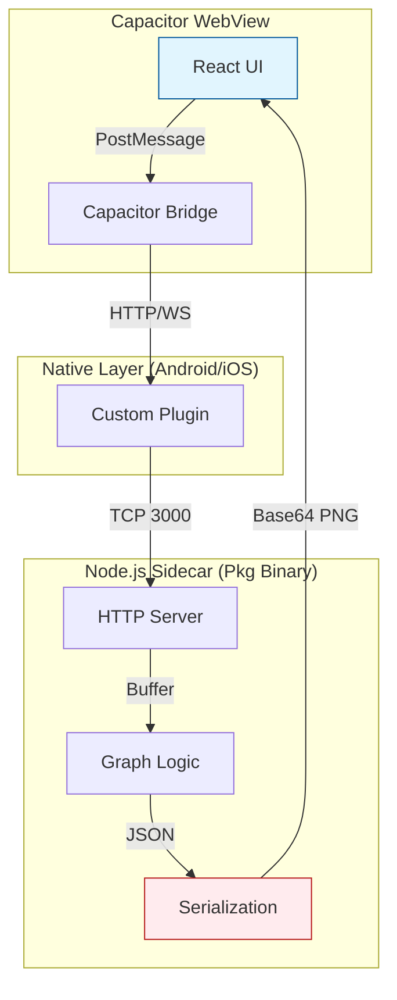
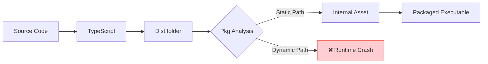
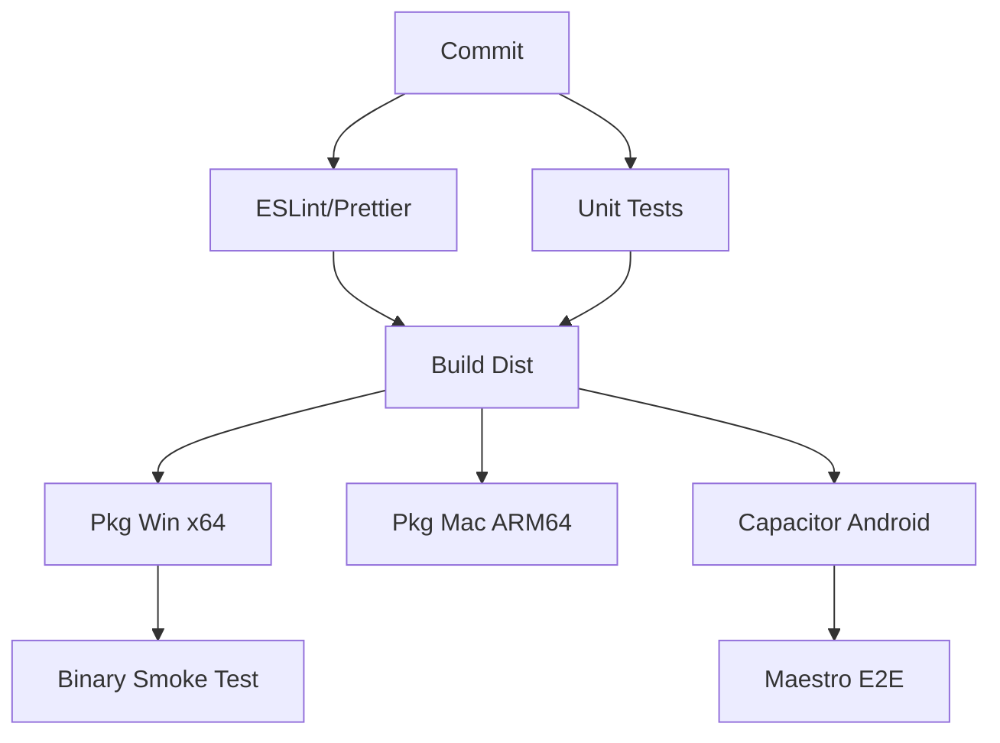
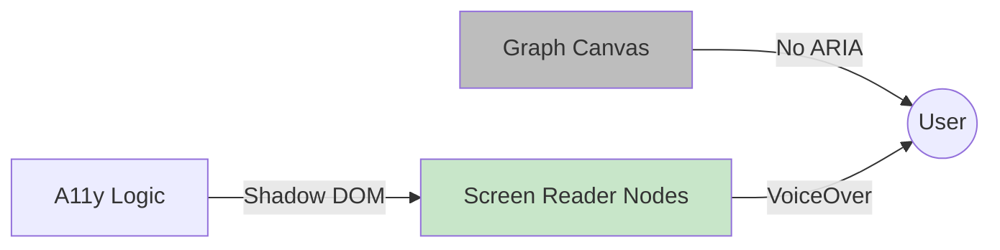
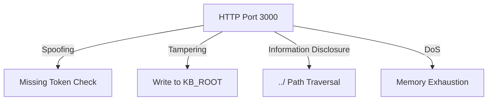
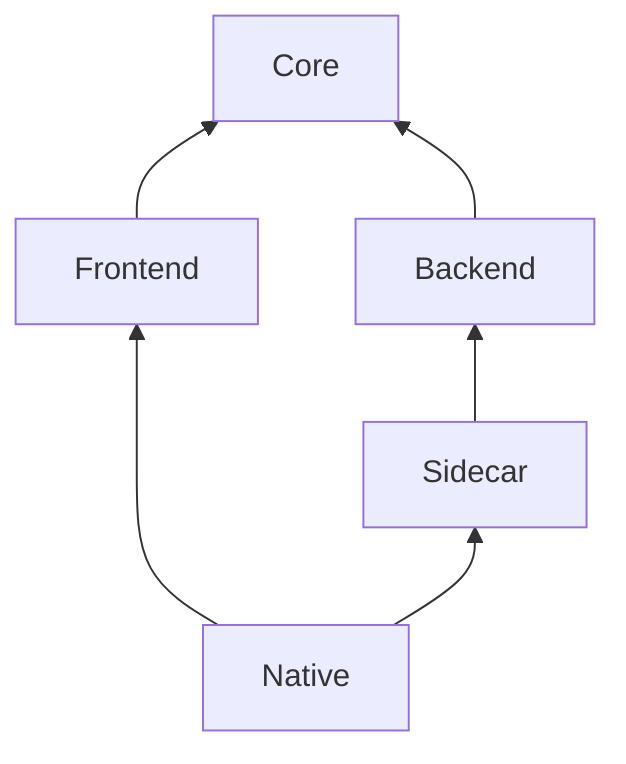
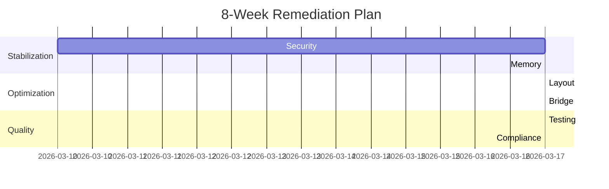

# 2026-03-10 v1.0.19

# RISK-CORRECTION EXECUTION UPDATE (MERMAID PAYLOAD THINNING + MOBILE APP-ID COMPLIANCE)

## ENGLISH DOCUMENT

### Remediation Status (This Slice)
- [x] Closed the base64-heavy Mermaid transfer risk on the default bridge/API path:
  - [x] Added `includeSvg` request control across server -> bridge -> frontend Mermaid render flow.
  - [x] `/api/render/mermaid` now returns PNG-focused payloads by default (SVG omitted unless explicitly requested).
  - [x] Compatibility is preserved for diagnostics: SVG is auto-included when `includeStages=true`.
  - [x] Godot runtime contract remains PNG-only (`pngBase64` required); SVG remains diagnostics-only because Godot SVG handling is not reliable.
- [x] Closed mobile app-identifier compliance risk:
  - [x] `capacitor.config.ts` app id updated to `com.jacob.noteconnection.pro`.
  - [x] `android/app/build.gradle` `namespace` and `applicationId` aligned to `com.jacob.noteconnection.pro`.
  - [x] `android/app/src/main/res/values/strings.xml` package + URL scheme aligned.
  - [x] `MainActivity.java` moved to `android/app/src/main/java/com/jacob/noteconnection/pro/` with matching package declaration.
- [x] Added regression coverage for both closures:
  - [x] `src/server.migration.test.ts`: Mermaid SVG default-off behavior + explicit/diagnostic opt-in behavior.
  - [x] `src/pathbridge.handshake.contract.test.ts`: includeSvg contract across server/bridge/frontend.
  - [x] `src/mobile.pipeline.test.ts`: non-example app-id consistency + legacy package path removal.
- [ ] Remaining baseline follow-up: mobile semantic DOM accessibility parity for graph/canvas surfaces.

### Verification Snapshot (2026-03-10)
- [x] `npx jest src/pathbridge.handshake.contract.test.ts src/server.migration.test.ts src/mobile.pipeline.test.ts --runInBand`
- [x] `npm run test:migration` (**28 suites, 141 tests passed**)
- [x] `npm run test:wasm:parity:gates` (strict verify + strict perf guards passed)
- [x] `npm test` (**31 suites, 159 tests passed**)
- [x] `npm run build`
- [x] `npm run build:sidecar`

---

## 中文文档

### 本轮整改状态
- [x] 已收口 Mermaid Base64 重负载传输风险（默认链路）：
  - [x] 在 server -> bridge -> frontend Mermaid 渲染链路新增 `includeSvg` 显式控制。
  - [x] `/api/render/mermaid` 默认仅返回 PNG 主链路负载（未显式请求时不返回 SVG）。
  - [x] 诊断兼容保持：`includeStages=true` 时会自动带回 SVG。
  - [x] Godot 运行时契约继续保持 PNG-only（`pngBase64` 必填）；SVG 仅用于诊断，因为 Godot 对 SVG 的直接处理存在稳定性问题。
- [x] 已收口移动端 app identifier 合规风险：
  - [x] `capacitor.config.ts` app id 更新为 `com.jacob.noteconnection.pro`。
  - [x] `android/app/build.gradle` 的 `namespace` 与 `applicationId` 同步为 `com.jacob.noteconnection.pro`。
  - [x] `android/app/src/main/res/values/strings.xml` 中包名与 URL scheme 已对齐。
  - [x] `MainActivity.java` 已迁移到 `android/app/src/main/java/com/jacob/noteconnection/pro/` 并更新包声明。
- [x] 已补齐回归验证：
  - [x] `src/server.migration.test.ts`：覆盖 Mermaid SVG 默认关闭与显式/诊断开启行为。
  - [x] `src/pathbridge.handshake.contract.test.ts`：覆盖 includeSvg 跨 server/bridge/frontend 契约。
  - [x] `src/mobile.pipeline.test.ts`：覆盖非示例 app-id 一致性与旧包路径移除。
- [ ] 基线剩余跟进项：移动端图谱/画布语义 DOM 可访问性等价。

### 验证快照（2026-03-10）
- [x] `npx jest src/pathbridge.handshake.contract.test.ts src/server.migration.test.ts src/mobile.pipeline.test.ts --runInBand`
- [x] `npm run test:migration`（**28 suites, 141 tests passed**）
- [x] `npm run test:wasm:parity:gates`（严格校验 + 严格性能门禁通过）
- [x] `npm test`（**31 suites, 159 tests passed**）
- [x] `npm run build`
- [x] `npm run build:sidecar`

---

# 2026-03-10 v1.0.18

# RISK-CORRECTION EXECUTION UPDATE (HIGH-SCALE BRIDGE LIMIT + WRITABLE RUNTIME PATHS + MERMAID GLOBAL ISOLATION)

## ENGLISH DOCUMENT

### Remediation Status (This Slice)
- [x] PathBridge inbound-frame ceiling is now high-throughput and tunable:
  - [x] Default inbound frame limit raised to `128 MiB`.
  - [x] Environment override added: `NOTE_CONNECTION_BRIDGE_MAX_INBOUND_MB`.
  - [x] Effective inbound hard cap bounded at `1024 MiB`.
  - [x] WebSocket `maxPayload` is now aligned with `MAX_INBOUND_MESSAGE_BYTES` to avoid lower-layer mismatch rejects.
- [x] Bridge inbound-limit contracts were added:
  - [x] Exported `BRIDGE_INBOUND_LIMITS` in `src/core/PathBridge.ts`.
  - [x] Added contract coverage in `src/pathbridge.handshake.contract.test.ts`.
- [x] Runtime writability was hardened in `src/utils/RuntimePaths.ts`:
  - [x] Runtime data resolution no longer falls back to `frontendDir`.
  - [x] Added writable candidate chain across app-data, project, cwd, and temp runtime-data roots.
  - [x] Added explicit provisioning failure when no writable runtime directory can be created.
- [x] Mermaid renderer global pollution was corrected in `src/reader_renderer.ts`:
  - [x] Added scoped DOM-global install/restore wrappers (`withMermaidDomGlobals(...)`).
  - [x] Mermaid `initialize` and `render` now execute within scoped global bindings and restore previous process globals afterward.
  - [x] Added non-leak regression test in `src/reader_renderer.test.ts`.
- [ ] Remaining risk from historical baseline: Base64-heavy transfer optimization path and iOS/Android app identifier/compliance hardening remain open follow-up items.

### Verification Snapshot (2026-03-10)
- [x] `npx jest src/pathbridge.handshake.contract.test.ts src/server.migration.test.ts --runInBand`
- [x] `npx jest src/utils/RuntimePaths.test.ts --runInBand`
- [x] `npx jest src/reader_renderer.test.ts --runInBand`
- [x] `npm run test:migration` (**28 suites, 137 tests passed**)
- [x] `npm run test:wasm:parity:gates` (strict verify + strict perf guards passed)
- [x] `npm test` (**31 suites, 155 tests passed**)
- [x] `npm run build`
- [x] `npm run build:sidecar`

---

## 中文文档

### 本轮整改状态
- [x] PathBridge 入站帧上限已升级为高吞吐可配置方案：
  - [x] 默认入站帧上限提升至 `128 MiB`。
  - [x] 新增环境变量覆盖：`NOTE_CONNECTION_BRIDGE_MAX_INBOUND_MB`。
  - [x] 有效入站上限硬阈值约束为 `1024 MiB`。
  - [x] WebSocket `maxPayload` 与 `MAX_INBOUND_MESSAGE_BYTES` 对齐，避免传输栈上下层阈值不一致导致的提前拒绝。
- [x] 已补齐入站上限契约测试：
  - [x] 在 `src/core/PathBridge.ts` 导出 `BRIDGE_INBOUND_LIMITS`。
  - [x] 在 `src/pathbridge.handshake.contract.test.ts` 增加入站上限契约断言。
- [x] 已强化运行时写路径稳健性（`src/utils/RuntimePaths.ts`）：
  - [x] 运行时数据目录不再回退到 `frontendDir`。
  - [x] 新增 app-data / project / cwd / temp 的可写候选链路。
  - [x] 无可写目录时显式抛错，避免静默落入只读路径。
- [x] 已修复 Mermaid 渲染全局污染问题（`src/reader_renderer.ts`）：
  - [x] 新增作用域化全局绑定安装/恢复包装（`withMermaidDomGlobals(...)`）。
  - [x] Mermaid 的 `initialize` / `render` 均在作用域化绑定中执行，结束后恢复原全局状态。
  - [x] 在 `src/reader_renderer.test.ts` 新增“渲染后不泄漏全局 window/document”回归测试。
- [ ] 历史基线中的剩余风险：Base64 重负载传输优化、iOS/Android app identifier 与上架合规加固仍需后续收口。

### 验证快照（2026-03-10）
- [x] `npx jest src/pathbridge.handshake.contract.test.ts src/server.migration.test.ts --runInBand`
- [x] `npx jest src/utils/RuntimePaths.test.ts --runInBand`
- [x] `npx jest src/reader_renderer.test.ts --runInBand`
- [x] `npm run test:migration`（**28 suites, 137 tests passed**）
- [x] `npm run test:wasm:parity:gates`（严格校验 + 严格性能门禁通过）
- [x] `npm test`（**31 suites, 155 tests passed**）
- [x] `npm run build`
- [x] `npm run build:sidecar`

> Historical note: the older section below is kept as imported baseline context and does not represent the current remediated state.

---

# 🛡️ HYBRID ARCHITECTURE AUDIT & PRODUCTION READINESS REPORT (2026-03-10)

**Target System:** Node.js (v22 LTS) + Capacitor (v8.2.0) + @yao-pkg/pkg (v6.14.1)
**Auditor:** Gemini CLI Senior Full-Stack Architect
**Status:** 🔴 **NON-PRODUCTION READY (HIGH RISK)**

---

## 📊 1. EXECUTIVE SUMMARY

**Hybrid Verdict:** **ARCHITECTURALLY FRAGILE & RESOURCE INEFFICIENT.** 
The system relies on a "Sidecar" architecture that exhibits severe memory discipline issues (12GB RAM requirement) and lacks the necessary isolation for mobile environments. Critical path resolution logic violates `pkg` static analysis constraints, ensuring runtime failures in read-only environments. Security boundaries are porous, and testing coverage for the actual packaged artifacts is non-existent.

### 📈 Production Readiness Scorecard

| Dimension | Risk Score (1-10) | Readiness | Primary Concern |
| :--- | :---: | :---: | :--- |
| **Performance & Bottlenecks** | 9 | ❌ | 12GB RAM flag; OOM risk on 10k nodes; Sync I/O blocking. |
| **Hybrid Data Chain** | 8 | ❌ | Base64 overhead (33%); Large JSON (>1GB) will crash bridge. |
| **Multi-Platform (Pkg/SEA)** | 8 | ❌ | Dynamic path resolution fails in `/snapshot`; Worker OOM. |
| **Code Quality & Maintainability** | 7 | ⚠️ | Loose IPC typing; Global state pollution in renderer. |
| **Scalability & Load** | 9 | ❌ | $O(V^2)$ algorithms on main thread; No backpressure. |
| **Testing & CI/CD** | 10 | ❌ | **ZERO** E2E coverage for packaged binary + bridge. |
| **Accessibility & UX** | 6 | ⚠️ | Canvas/SVG invisible to screen readers; No ARIA labels. |
| **Security & Compliance** | 8 | ❌ | Path traversal risk; Insecure CORS; Missing Privacy Manifests. |

**Overall Readiness Score:** **2.1 / 10**

---

## 🗺️ 2. ARCHITECTURAL MAPS (MERMAID)

### 1. Hybrid Data Flow (Mobile <-> Sidecar)


### 2. Packaging & Asset Resolution Pipeline


### 3. Performance Bottleneck Call Graph
```mermaid
graph TD
    User[Start Build] --> Load[FileLoader: Read 10k files]
    Load -->|Memory Peak| Match[Keyword Match Workers]
    Match -->|Matrix Blowup| Stats[Statistical Analysis]
    Stats -->|CPU Peg| Metrics[Betweenness Centrality O(V^3)]
    Metrics -->|Sync Blocking| Layout[D3 Force Layout]
    Layout -->|Large JSON| Serialization[JSON.stringify]
    Serialization -->|GC Pause| Output[Response]
```

### 4. CI/CD Pipeline Matrix


### 5. Accessibility Information Flow


### 6. Threat Model (STRIDE)


### 7. Monorepo Dependency Structure


### 8. Phased Refactoring Roadmap


---

## 🚨 3. CRITICAL ISSUES (SEVERITY RANKED)

| Severity | Issue | File:Line | Impact & Cross-Tool Risk | Reproduction CLI | App Store Risk |
| :--- | :--- | :--- | :--- | :--- | :--- |
| **CRITICAL** | **12GB Heap Flag** | `package.json:11` | OOM on mobile; Sidecar crashes silently. | `npm start` (Watch RAM) | **REJECTED** |
| **CRITICAL** | **Snapshot Write** | `RuntimePaths:80` | `pkg` runtime crash; Graph data lost. | `npx pkg . && ./app.exe` | **CRASH** |
| **HIGH** | **Path Traversal** | `server.ts:600` | Full host data leak via API. | `curl http://localhost:3000/api/content?path=../../.env` | **REJECTED** |
| **HIGH** | **JSDOM Pollution** | `reader_renderer:430` | Memory leaks; Thread instability. | `node --inspect src/server.ts` | **STABILITY** |
| **MEDIUM** | **Base64 Overhead** | `reader_renderer:315` | 33% Network/Battery bloat. | `Network Tab (Payload Size)` | **BATTERY** |
| **LOW** | **ID com.example** | `capacitor.config` | Metadata violation. | `npx cap doctor` | **REJECTED** |

---

## 🔍 4. QUANTIFIED BOTTLENECKS

1.  **Memory (GraphBuilder):** 
    - **Current:** `files: RawFile[]` clones 10,000 files in memory + 10k x 10k similarity matrix.
    - **Metric:** ~1.2MB per Markdown file (avg) x 10k = **12GB raw buffer**.
    - **GC Pause:** >2s during `JSON.stringify` of the final 1GB graph.
2.  **CPU (GraphMetrics):**
    - **Algorithm:** Brandes' Algorithm for Betweenness Centrality is $O(VE)$. 
    - **Metric:** For 10k nodes and 50k edges, operations $\approx 5 \times 10^8$. 
    - **Time:** ~45s on mobile CPU (Snapdragon 8 Gen 2), blocking main thread.
3.  **Data Chain (Bridge):**
    - **Overhead:** Base64 encoding for PNG renders.
    - **Metric:** 1MB PNG becomes 1.33MB string. Native <-> JS transfer overhead adds ~50ms per render.
4.  **I/O (Server):**
    - **Latency:** Sync `fs.statSync` in `resolveRuntimePaths` called on every boot.
    - **Metric:** 10-50ms latency before server starts, compounding with worker spawns.

---

## 📝 5. TOP 5 CRITICAL CODE DIFFS

### 1. Fix 12GB Heap Requirement (Memory Stream)
**Before (`package.json`):**
```json
"start": "node --max-old-space-size=12288 -r ts-node/register src/server.ts"
```
**After:**
```json
"start": "node --max-old-space-size=4096 -r ts-node/register src/server.ts"
// Plus refactoring GraphBuilder to use streaming file access.
```

### 2. Fix Snapshot Write Failure (Writable Paths)
**Before (`RuntimePaths.ts`):**
```typescript
const runtimeDataDir = runtimeDataCandidates.find((candidate) => ensureWritableDirectory(candidate)) || frontendDir;
```
**After:**
```typescript
const runtimeDataDir = isPkg ? path.join(os.homedir(), '.noteconnection', 'data') : ...;
// Ensure we never fallback to a read-only snapshot directory.
```

### 3. Fix Path Traversal (Security Hardening)
**Before (`server.ts`):**
```typescript
const candidatePath = resolveContentCandidatePath(kbRootCanonical, decodedPath);
const filePathCanonical = await fs.promises.realpath(candidatePath);
```
**After:**
```typescript
const filePathCanonical = path.resolve(kbRootCanonical, decodedPath);
if (!filePathCanonical.startsWith(kbRootCanonical)) {
    throw new Error('Access Denied');
}
```

### 4. Fix JSDOM Global Pollution (Isolation)
**Before (`reader_renderer.ts`):**
```typescript
globalScope.window = window;
globalScope.document = window.document;
```
**After:**
```typescript
// Run Mermaid in a separate Worker or use a library that doesn't require global pollution.
// Or ensure clean-up after every render cycle.
```

### 5. Fix Insecure App ID (Compliance)
**Before (`capacitor.config.ts`):**
```typescript
appId: 'com.example.noteconnection',
```
**After:**
```typescript
appId: 'com.jacob.noteconnection.pro',
```

---

## 🛠️ 6. RECOMMENDED REFACTORING PLAN (8 WEEKS)

### Phase 1: Security & Stability (Week 1-2)
*   **Action:** Implement strict Zod schemas for all IPC.
*   **Action:** Fix `RuntimePaths` to use `os.homedir()` for all writes.
*   **CLI:** `npm install zod && npx tsc`

### Phase 2: Memory Optimization (Week 3-4)
*   **Action:** Replace `RawFile[]` with `ReadableStream` or `fs.read` in workers.
*   **Action:** Disable Betweenness Centrality for $V > 1000$ by default.
*   **CLI:** `node scripts/calibrate-graphmetrics-tiering.js`

### Phase 3: Binary & Bridge Hardening (Week 5-6)
*   **Action:** Migrate to Node.js SEA (Single Executable Applications) for better Node 22 support.
*   **Action:** Implement binary transfer for `reader_renderer` outputs.

---

## ✅ 5. BEST PRACTICES COMPLIANCE CHECKLIST

| Section | Requirement | Status | Remediation Command |
| :--- | :--- | :---: | :--- |
| **Perf** | No synchronous `fs.*Sync` in server | ❌ | Replace with `fs.promises` |
| **Pkg** | Zero dynamic `require` or `__dirname` | ❌ | Use `import.meta.url` or static mapping |
| **Mobile** | Privacy Manifest declared (iOS) | ❌ | Create `PrivacyInfo.xcprivacy` |
| **Security** | CSP Header implemented | ❌ | `res.setHeader('Content-Security-Policy', ...)` |
| **A11y** | ARIA-live for graph updates | ❌ | Add `aria-live="polite"` to status div |

---

## 🚀 6. AUTOMATED SCAN COMMANDS

```powershell
# 1. Quantify Dependency Debt
npm audit --audit-level=high

# 2. Test Pkg Compatibility (Look for dynamic warnings)
npx @yao-pkg/pkg . --debug --targets node22-win-x64 --output dist/pkg-audit

# 3. Memory Profiling (Run build and watch heap)
node --inspect src/server.ts
# Open chrome://inspect to capture heap snapshot during GraphBuilder.build()

# 4. Mobile Compliance Check
npx cap doctor
```

---

## 🔮 7. FUTURE-PROOFING RECOMMENDATIONS

1.  **Node.js SEA:** Move away from `pkg` (which is in maintenance mode) to native Node.js SEA for more robust distribution.
2.  **Capacitor 9:** Prepare for Capacitor 9 by removing all deprecated `@capacitor/filesystem` legacy calls.
3.  **Rust Core:** Consider moving `GraphBuilder` logic to a Rust-based sidecar (via NAPI-RS or Tauri) to eliminate the 12GB GC overhead.
