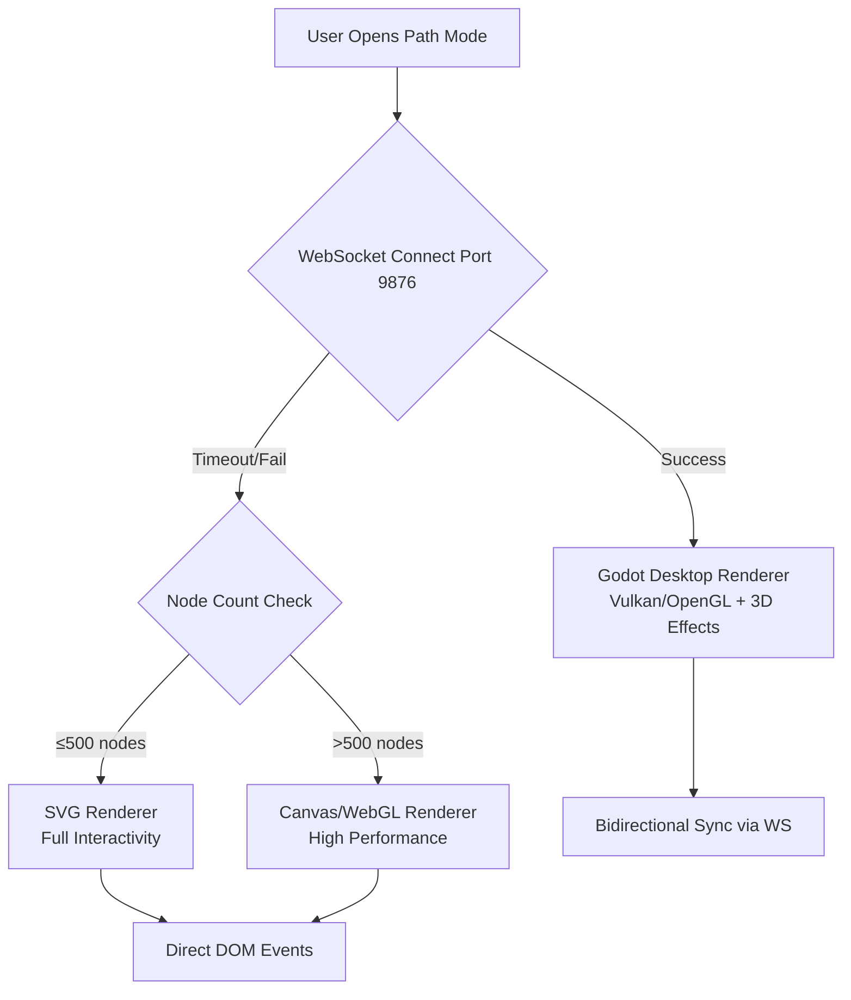
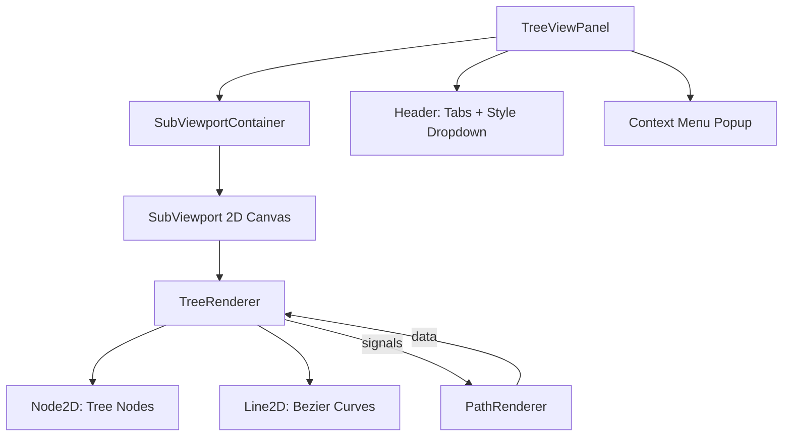
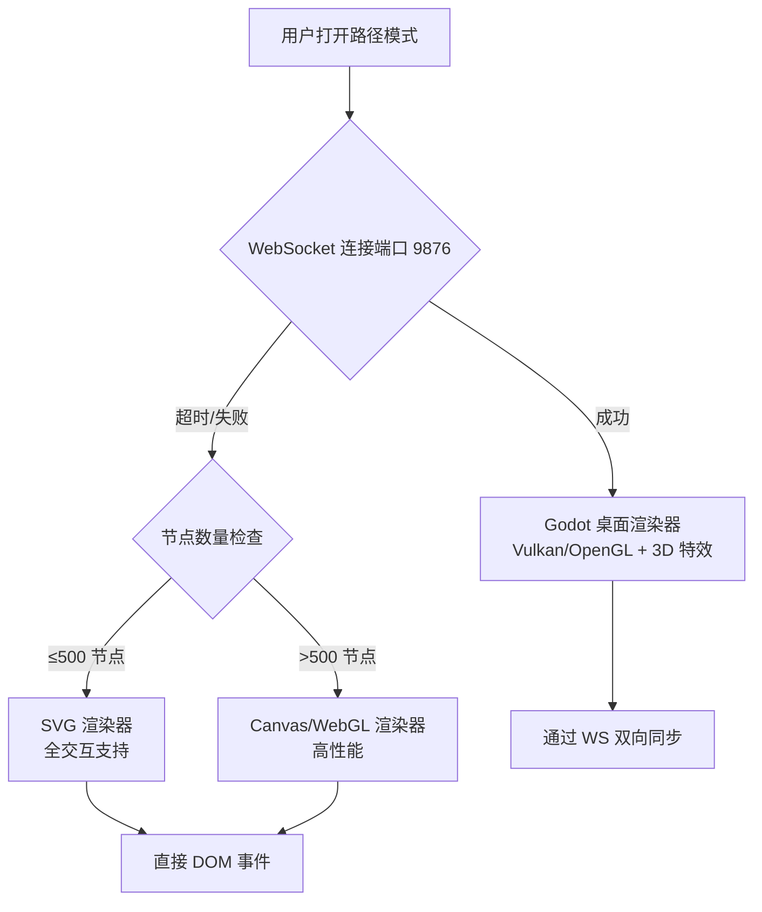
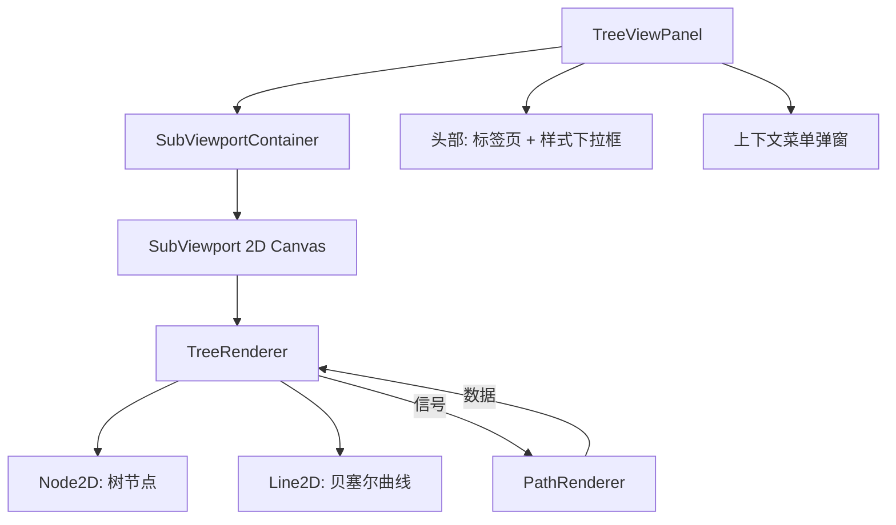

# Path Mode Architecture v2: Orbital Learning System

> Comprehensive design document for NoteConnection's Path Mode feature, enabling structured learning paths with hybrid Godot/Web visualization.

---

## 1. Hybrid Visualization Architecture

### 1.1 Rendering Strategy Hierarchy



### 1.2 WebSocket Protocol Specification

| Message Type   | Direction     | Payload                                | Description              |
| -------------- | ------------- | -------------------------------------- | ------------------------ |
| `pathResult`   | Server→Client | `{nodes:[], edges:[], strategy, mode}` | Learning path data       |
| `nodeClick`    | Client→Server | `{nodeId: string}`                     | User clicked a node      |
| `switchCenter` | Server→Client | `{newCenterId: string}`                | Center node changed      |
| `markComplete` | Client→Server | `{nodeId: string}`                     | User marked node learned |
| `pathUpdate`   | Server→Client | `{nodes:[], completedIds:[]}`          | Path state refresh       |
| `openReader`   | Client→Server | `{nodeId: string}`                     | Request to open content  |

---

## 2. Learning Mode Algorithms

### 2.1 Domain Learning (领域学习)

**Purpose**: Efficiently learn all nodes within a user-defined knowledge domain.

```
Algorithm: Priority-Queue Topological Sort
━━━━━━━━━━━━━━━━━━━━━━━━━━━━━━━━━━━━━━━━━━

Input: Set of target nodeIds (or all nodes)
Output: Ordered learning path with step numbers

1. EXPAND: Include all predecessors (prerequisites) of target nodes
2. BUILD: Construct local in-degree map for subgraph
3. INIT: Queue all nodes with in-degree=0 as "available"
4. LOOP:
   a. Sort available by strategy score (foundational/core)
   b. Pop best node, add to path
   c. Decrement in-degree of neighbors, queue if now 0
5. HANDLE CYCLES: If stuck, force-process lowest in-degree node
6. RETURN: Path with coverage metrics
```

**Scoring Functions**:

- **Foundational**: `score = (outDegree + 0.1) / (inDegree + 1)` — Favor low prerequisites, high unlocks
- **Core**: `score = centrality × 10 - inDegree` — Favor central concepts with low barriers

### 2.2 Diffusion Learning (扩散学习)

**Purpose**: Find shortest efficient path to learn a specific target concept.

```
Algorithm: Reverse BFS + Topological Sort
━━━━━━━━━━━━━━━━━━━━━━━━━━━━━━━━━━━━━━━━━━

Input: targetNodeId
Output: Minimal prerequisite chain to target

1. TRACE: BFS from target, following INCOMING edges
2. COLLECT: All ancestor nodes (transitive closure)
3. FILTER: Add target to ancestor set
4. SORT: Apply priority-queue topological sort to subset
5. RETURN: Optimized path ending at target
```

> [!IMPORTANT]
> **Diffusion vs Domain Distinction**: In Diffusion mode, peripheral nodes must NOT be out-degree nodes of the ultimate target—they should be high-association nodes to the _current_ central node only.

---

## 3. Orbital Learning UX Design

### 3.1 Visual Metaphor

```
                    ┌─────────────────────────────────────┐
                    │        ORBITAL LEARNING VIEW        │
                    │                                     │
                    │      ○  Peripheral (In-Degree)      │
                    │        ↘                            │
                    │    ○ ──── ███████ ──── ○            │
                    │           ██ C ██      Peripheral   │
                    │    ○ ──── ███████ ──── ○            │
                    │        ↗  (Central)                 │
                    │      ○                              │
                    │                                     │
                    │  Legend:                            │
                    │  ███ = Large, bright central bubble │
                    │  ○   = Small, translucent satellite │
                    │  ★   = Gold mini-bubble (completed) │
                    └─────────────────────────────────────┘
```

### 3.2 Node Display Rules

| State          | Size            | Opacity | Content                               | Layer      |
| -------------- | --------------- | ------- | ------------------------------------- | ---------- |
| **Central**    | 80-100px radius | 90%     | Title (24 chars) + Progress indicator | Foreground |
| **Peripheral** | 30-40px radius  | 60%     | Title only (15 chars + ellipsis)      | Background |
| **Completed**  | 8px radius      | 100%    | Gold star in collapsible sidebar      | Sidebar    |

### 3.3 Peripheral Selection Algorithm

**Domain Learning:**

1. Collect in-degree nodes (prerequisites) of current central
2. Fill remaining slots (up to 4) with highest-association nodes

**Diffusion Learning:**

1. Collect high-association nodes to current central
2. Exclude any out-degree nodes of the ultimate target

### 3.4 Interaction Specification

| Action            | Target     | Result                                                      |
| ----------------- | ---------- | ----------------------------------------------------------- |
| **Double-Click**  | Central    | Open Reader with node content                               |
| **Double-Click**  | Peripheral | **Orbital Rotation**: Peripheral rotates to center (~500ms) |
| **Single Click**  | Any Node   | Show stats popup                                            |
| **Mark Complete** | Button     | Central → Gold Star → Auto-advance to next                  |

### 3.5 Orbital Rotation Animation (~500ms)

```
Sequence:
1. Clicked peripheral begins arc toward center
2. Current central shrinks, moves to vacated orbital slot
3. Other peripherals redistribute on orbital ring
4. New central inflates to full size
5. Progress indicator updates (X of Y prerequisites)
```

---

## 4. Godot 3D Implementation Design

### 4.1 Scene Architecture

```
Main.tscn
├── Camera3D (with smooth follow)
├── WorldEnvironment (bloom, ambient)
├── PathRenderer (Node3D)
│   ├── CentralBubble (MeshInstance3D + ShaderMaterial)
│   ├── PeripheralContainer (Node3D)
│   │   └── [Dynamic PeripheralBubble instances]
│   └── EdgeDrawer (ImmediateMesh)
├── UI (CanvasLayer)
│   ├── MarkCompleteButton
│   ├── HistorySidebar
│   └── FuturePathTreeView
└── WsClient (Autoload)
```

### 4.2 Bubble Shader (Pseudo-3D Effect)

```gdscript
# bubble_material.gdshader
shader_type spatial;

uniform vec4 base_color : source_color = vec4(0.2, 0.6, 1.0, 0.8);
uniform float fresnel_power : hint_range(0.1, 5.0) = 3.0;
uniform sampler2D noise_texture;

void fragment() {
    // Fresnel edge glow for bubble effect
    float fresnel = pow(1.0 - dot(NORMAL, VIEW), fresnel_power);

    // Animated noise for translucency
    vec2 uv_animated = UV + TIME * 0.05;
    float noise = texture(noise_texture, uv_animated).r * 0.2;

    ALBEDO = base_color.rgb + fresnel * 0.3;
    ALPHA = base_color.a - noise;
    EMISSION = base_color.rgb * fresnel * 0.5;
}
```

### 4.3 State Machine for Learning Flow

```gdscript
# learning_state_machine.gd
class_name LearningStateMachine
extends Node

signal state_changed(from: StringName, to: StringName)

enum State { IDLE, VIEWING, TRANSITIONING, READING }

var current_state: State = State.IDLE
var current_central_id: String = ""
var completed_ids: Array[String] = []

func transition_to(new_state: State, data: Dictionary = {}) -> void:
    var old_state = current_state
    current_state = new_state
    state_changed.emit(State.keys()[old_state], State.keys()[new_state])

    match new_state:
        State.VIEWING:
            _on_enter_viewing(data)
        State.TRANSITIONING:
            _on_enter_transitioning(data)
        State.READING:
            _on_enter_reading(data)

func mark_complete(node_id: String) -> void:
    if node_id not in completed_ids:
        completed_ids.append(node_id)
        _save_progress()
        _advance_to_next()
```

---

## 5. Future Path Tree View

### 5.1 Tree Visualization Requirements

```
┌─ FUTURE LEARNING PATH ─────────────────────────┐
│                                                │
│  ○ Calculus I                                  │
│  ├── ○ Derivatives                             │
│  │   ├── ● Chain Rule (Current)                │
│  │   └── ○ Product Rule                        │
│  └── ○ Integrals                               │
│      └── ○ Fundamental Theorem                 │
│                                                │
│  [★] = Completed  [●] = Current  [○] = Pending │
└────────────────────────────────────────────────┘
```

### 5.2 Enhanced Graphical Tree View (v2)

> **Status**: Understanding Lock achieved. Ready for implementation.

**Architecture**: SubViewport overlay panel with bezier curve rendering



**Scene Structure**:

```
PanelContainer (tree_view_panel.tscn)
├── VBoxContainer
│   ├── HBoxContainer (Header)
│   │   ├── TabBar: [Subtree] [Full Path]
│   │   ├── HSeparator
│   │   └── OptionButton (Style selector)
│   └── SubViewportContainer
│       └── SubViewport
│           └── Node2D (TreeRenderer)
└── PopupMenu (Context menu)
```

---

#### 5.2.1 tree_view_panel.gd

Main controller for the tree view panel.

**Signals:**

- `node_navigate_requested(node_id: String)`
- `node_mark_complete_requested(node_id: String)`

**Key Methods:**

- `set_tree_data(nodes: Array, completed_ids: Array, current_id: String)`
- `set_view_mode(mode: String)` - "subtree" or "full"
- `set_style(style: String)` - "dark", "glass", "minimal", "colorful"

---

#### 5.2.2 tree_renderer.gd

Renders the bezier tree in 2D canvas.

```gdscript
func _draw_node(node: Dictionary, pos: Vector2) -> void:
    # Draw rounded rectangle / gradient based on style

func _draw_bezier_connection(from: Vector2, to: Vector2, color: Color) -> void:
    var curve = Curve2D.new()
    var cp1 = Vector2(from.x, (from.y + to.y) / 2)
    var cp2 = Vector2(to.x, (from.y + to.y) / 2)
    curve.add_point(from, Vector2.ZERO, cp1 - from)
    curve.add_point(to, cp2 - to, Vector2.ZERO)
    draw_polyline(curve.tessellate(), color, 2.0, true)
```

---

#### 5.2.3 tree_styles.gd

Style configurations as resource:

```gdscript
const STYLES := {
    "colorful": {  # DEFAULT
        "bg": Color(0.1, 0.1, 0.15, 0.9),
        "node_completed": Color(1.0, 0.84, 0.0),   # Gold
        "node_current": Color(0.0, 0.8, 0.9),      # Cyan
        "node_pending": Color(0.5, 0.5, 0.6),      # Gray
        "curve_inherit_parent": true,
        "node_radius": 8.0,
        "label_color": Color.WHITE
    },
    "dark": {
        "bg": Color(0.1, 0.1, 0.18, 0.95),
        "node_completed": Color(0.4, 0.3, 0.6),
        "node_current": Color(0.3, 0.4, 0.7),
        "node_pending": Color(0.25, 0.25, 0.3),
        "curve_color": Color(0.4, 0.4, 0.6, 0.6),
        "node_radius": 10.0
    },
    "glass": {
        "bg": Color(0.15, 0.15, 0.2, 0.5),
        "blur_enabled": true,
        "glow_curves": true,
        "node_transparency": 0.7
    },
    "minimal": {
        "bg": Color(0.12, 0.12, 0.15, 0.95),
        "node_color": Color.WHITE,
        "curve_color": Color(0.5, 0.5, 0.5, 0.4),
        "node_radius": 4.0
    }
}
```

**Visual Themes Summary**:

| Theme                  | Background       | Nodes                   | Curves               |
| ---------------------- | ---------------- | ----------------------- | -------------------- |
| **Colorful** (default) | #1a1a26          | Gold/Cyan/Gray by state | Inherit parent color |
| **Dark**               | #1a1a2e          | Gradient rounded rect   | Soft blue/purple     |
| **Glass**              | Transparent blur | Semi-transparent        | Glowing              |
| **Minimal**            | #1e1e24          | White/gray              | Thin gray            |

---

#### 5.2.4 Node Interactions

**Single Click:**

1. Expand/collapse node children
2. Show context menu with options:
   - Navigate (make central node)
   - Mark Complete / Unmark

**Double Click:**

1. Navigate directly to node

**Context Menu Implementation:**

```gdscript
func _show_context_menu(node_id: String, screen_pos: Vector2) -> void:
    _context_menu.clear()
    _context_menu.add_item("Navigate", MENU_NAVIGATE)
    if _is_completed(node_id):
        _context_menu.add_item("Unmark Complete", MENU_UNMARK)
    else:
        _context_menu.add_item("Mark Complete", MENU_MARK)
    _context_menu.position = screen_pos
    _context_menu.popup()
```

| Action       | Result                              |
| ------------ | ----------------------------------- |
| Single-click | Expand/collapse + show context menu |
| Double-click | Navigate (make central node)        |
| Context menu | Navigate / Mark Complete / Unmark   |

---

#### 5.2.5 Execution Order

| Phase | Task                                          | Effort |
| ----- | --------------------------------------------- | ------ |
| 1     | Create `tree_styles.gd` with 4 themes         | 15 min |
| 2     | Create `tree_renderer.gd` with bezier drawing | 45 min |
| 3     | Create `tree_view_panel.tscn` + `.gd`         | 30 min |
| 4     | Integrate with `path_renderer.gd`             | 20 min |
| 5     | Add context menu + interactions               | 30 min |
| 6     | Replace old Tree control in UI                | 15 min |

**Total estimated time**: ~2.5 hours

---

#### 5.2.6 Decision Log

| Decision             | Why                                            |
| -------------------- | ---------------------------------------------- |
| SubViewport for tree | Allows independent 2D rendering in 3D scene    |
| Bezier curves        | More visually appealing than straight lines    |
| Colorful as default  | Matches 3D bubble colors for consistency       |
| Context menu         | Provides clear options without cluttering tree |

---

**Files**:

- [NEW] `tree_view_panel.tscn` + `tree_view_panel.gd` - Main panel scene
- [NEW] `tree_renderer.gd` - Bezier curve drawing
- [NEW] `tree_styles.gd` - 4 visual themes

### 5.3 Tree Interaction

- **Click on Tree Node**: Switch central view to that node
- **Settings Toggle**: "Automatically reconstruct learning path when switching starting point"
  - **ON**: Recalculates entire path from new start
  - **OFF**: Only changes display position, keeps original path

---

## 6. Proposed File Changes

### Backend (path calculation)

#### [MODIFY] [path_core.js](file:///e:/Knowledge_project/NoteConnection_app/src/frontend/libs/path_core.js)

- Add `getPeripheralNodes(centralId, mode)` method to PathEngine
- Add `getTreePath(currentId, learningPath)` for future path visualization
- Add progress tracking state management

---

### Godot Desktop Renderer

#### [MODIFY] [path_renderer.gd](file:///e:/Knowledge_project/NoteConnection_app/path_mode/scripts/path_renderer.gd)

- Upgrade to 3D rendering with MeshInstance3D
- Implement bubble shader with fresnel glow
- Add orbital animation for peripheral nodes
- Implement layer separation (central vs peripheral)

#### [NEW] [learning_state_machine.gd](file:///e:/Knowledge_project/NoteConnection_app/path_mode/scripts/learning_state_machine.gd)

- State machine for learning flow control
- Progress persistence via user:// filesystem
- Auto-advance logic after marking complete

#### [NEW] [bubble_material.gdshader](file:///e:/Knowledge_project/NoteConnection_app/path_mode/shaders/bubble_material.gdshader)

- Fresnel bubble effect
- Animated noise for translucency
- Configurable colors for different states

#### [MODIFY] [ws_client.gd](file:///e:/Knowledge_project/NoteConnection_app/path_mode/scripts/ws_client.gd)

- Add handlers for new message types (markComplete, openReader)
- Emit signals for state machine consumption

---

### Frontend Web Fallback

#### [NEW] [path_orbital.js](file:///e:/Knowledge_project/NoteConnection_app/src/frontend/libs/path_orbital.js)

- Canvas-based orbital layout renderer
- Bubble animation using requestAnimationFrame
- Mouse/touch interaction handling

#### [NEW] [path_tree.js](file:///e:/Knowledge_project/NoteConnection_app/src/frontend/libs/path_tree.js)

- D3-based tree layout for future path view
- Click-to-navigate functionality

---

### Godot UI Components (Web-to-Godot Sync)

#### [NEW] [tree_view_panel.tscn](file:///e:/Knowledge_project/NoteConnection_app/path_mode/scenes/tree_view_panel.tscn)

- **Architecture**: PanelContainer > SubViewportContainer > SubViewport > Node2D
- **Purpose**: Isolate 2D graphical tree rendering from the main 3D scene.
- **Script**: `tree_view_panel.gd`

#### [NEW] [tree_renderer.gd](file:///e:/Knowledge_project/NoteConnection_app/path_mode/scripts/tree_renderer.gd)

- **Purpose**: Low-level drawing of bezier curves and nodes.
- **Features**:
  - `draw_polyline` for smooth curves.
  - Theme support (Colorful, Dark, Glass, Minimal).

#### [NEW] [settings_panel.tscn](file:///e:/Knowledge_project/NoteConnection_app/path_mode/scenes/settings_panel.tscn)

- **Purpose**: Configure Audio, Visuals, and Learning behaviors.
- **Persistence**: `user://settings.cfg`

---

### Phase 4.1 Implementation: Tree View 2.0 (Refined)

#### [MODIFY] [path_core.js](file:///e:/Knowledge_project/NoteConnection_app/src/frontend/libs/path_core.js)

- **Method**: `getTreeLayout(centralId)`
- **Logic**:
  - Perform BFS/Topo Sort to assign `level` (depth) to each node.
  - Group nodes by level.
  - Assign Y-coordinates to center nodes within their level.
  - Return: List of nodes with `{id, label, x, y, inDegree, status}`.

#### [MODIFY] [tree_view_panel.tscn](file:///e:/Knowledge_project/NoteConnection_app/path_mode/scenes/tree_view_panel.tscn)

- **Structure Change**:
  - Add `Camera2D` to `SubViewport`.
  - Add `Control` overlay for UI inputs (if needed) or handle directly.

#### [MODIFY] [tree_renderer.gd](file:///e:/Knowledge_project/NoteConnection_app/path_mode/scripts/tree_renderer.gd)

- **Rendering**:
  - Use `x,y` from backend instead of auto-calculating.
  - Draw arrows (`draw_line` + arrowheads).
  - Scale node size by `inDegree` (visualize dependency weight).

#### [MODIFY] [settings_panel.tscn](file:///e:/Knowledge_project/NoteConnection_app/path_mode/scenes/settings_panel.tscn)

- **New UI**: Checkbox for "Retain Learning History".

---

## 7. Decision Log

| Decision                        | Alternatives Considered             | Rationale                                                                         |
| ------------------------------- | ----------------------------------- | --------------------------------------------------------------------------------- |
| 3D MeshInstance over 2D Sprites | Canvas2D, Sprite3D                  | True 3D enables depth-based effects, bloom, and physics integration               |
| WebSocket over HTTP polling     | REST API, Server-Sent Events        | Bidirectional real-time communication essential for smooth state sync             |
| Fresnel shader for bubbles      | Simple transparency, Outline shader | Fresnel provides organic glass-like appearance matching bubble metaphor           |
| localStorage for progress       | IndexedDB, Server sync              | Offline-first requirement; localStorage is simplest for cross-session persistence |
| State Machine pattern           | Direct conditionals, Event bus      | Clear state transitions, easier debugging of learning flow                        |

---

## Verification Plan

### Manual Testing

1. **Godot Renderer Test**
   - Open `path_mode/project.godot` in Godot 4.3
   - Press F5 to run the scene
   - Verify central bubble renders larger than peripherals
   - Verify double-click sends WebSocket message

2. **Learning Flow Test**
   - Start Domain Learning mode
   - Mark several nodes complete
   - Close and reopen application
   - Verify completed nodes persist and appear as gold stars

3. **Tree View Navigation**
   - Open Future Path tree view
   - Click on different nodes
   - Verify central view switches correctly
   - Toggle "auto-reconstruct" setting and verify behavior difference

> [!NOTE]
> Since this is primarily an architecture planning document, implementation verification will occur during the EXECUTION phase. User review of this design is required before proceeding.

### Phase 4 Verification: Tree View

1.  **Visual Verification**
    - [ ] Launch `path_mode` in Godot.
    - [ ] Verify Tree View panel appears in sidebar.
    - [ ] toggle between "Subtree" and "Full Path" tabs.
    - [ ] Switch themes (Dark -> Glass -> Minimal) and verify visual update.

2.  **Interaction Verification**
    - [ ] Click a node in Tree View -> Main 3D view should switch center.
    - [ ] Mark a pending node as complete via context menu -> Should turn Gold.
    - [ ] Mark a complete node as incomplete -> Should revert to Gray/Cyan.
    - [ ] Hover over nodes -> Verify tooltip or highlight.

3.  **Settings Verification**
    - [ ] Open Settings Panel.
    - [ ] Change "Auto-reconstruct Path" to OFF.
    - [ ] Switch center node -> Path structure should REMAIN, only view changes.
    - [ ] Change "Auto-reconstruct Path" to ON.
    - [ ] Switch center node -> Path structure should REGENERATE.

---

## Confirmed Design Decisions (Brainstorming Complete)

| Decision                | Final Choice                         | Rationale                              |
| ----------------------- | ------------------------------------ | -------------------------------------- |
| Display Limit           | 1 Central + 1-4 Peripheral (dynamic) | Adapts to node connectivity            |
| Zero In-Degree Fallback | Highest relevance score              | Ensures meaningful peripherals         |
| Central Content         | Title + Progress indicator           | Progress tracking is core UX           |
| Peripheral Labels       | 15 chars + ellipsis                  | Clean yet informative                  |
| Transition Animation    | Orbital rotation (~500ms)            | Best fits "Orbital Learning" metaphor  |
| Gold Star Sidebar       | Collapsible with `★ × {N}` format    | Reduces clutter in long sessions       |
| Peripheral Selection    | In-degree first + association fill   | Balances learning order with discovery |

---

# 路径模式架构 v2: 轨道学习系统 (中文版)

> NoteConnection 路径模式特性的综合设计文档，通过混合 Godot/Web 可视化实现结构化的学习路径。

---

## 1. 混合可视化架构

### 1.1 渲染策略层级



### 1.2 WebSocket 协议规范

| 消息类型       | 方向          | 载荷                                   | 描述             |
| :------------- | :------------ | :------------------------------------- | :--------------- |
| `pathResult`   | 服务端→客户端 | `{nodes:[], edges:[], strategy, mode}` | 学习路径数据     |
| `nodeClick`    | 客户端→服务端 | `{nodeId: string}`                     | 用户点击节点     |
| `switchCenter` | 服务端→客户端 | `{newCenterId: string}`                | 中心节点变更     |
| `markComplete` | 客户端→服务端 | `{nodeId: string}`                     | 用户标记节点已学 |
| `pathUpdate`   | 服务端→客户端 | `{nodes:[], completedIds:[]}`          | 路径状态刷新     |
| `openReader`   | 客户端→服务端 | `{nodeId: string}`                     | 请求打开内容     |

---

## 2. 学习模式算法

### 2.1 领域学习 (Domain Learning)

**目的**: 高效学习用户定义的知识领域内的所有节点。

```
算法: 优先队列拓扑排序
━━━━━━━━━━━━━━━━━━━━━━━━━━━━━━━━━━━━━━━━━━

输入: 目标节点集合 (或所有节点)
输出: 带有步骤序号的有序学习路径

1. 扩展: 包含目标节点的所有前置节点 (先决条件)
2. 构建: 为子图构建局部入度映射
3. 初始化: 将所有入度=0 的节点作为“可用”加入队列
4. 循环:
   a. 按策略分数排序可用节点 (基础/核心)
   b. 弹出最佳节点，加入路径
   c. 减少邻居的入度，如减为 0 则入队
5. 处理循环: 如遇死锁，强制处理入度最低的节点
6. 返回: 带有覆盖率指标的路径
```

**评分函数**:

- **基础优先 (Foundational)**: `score = (outDegree + 0.1) / (inDegree + 1)` — 偏好低门槛、高解锁能力的节点
- **核心优先 (Core)**: `score = centrality × 10 - inDegree` — 偏好位于中心但门槛较低的概念

### 2.2 扩散学习 (Diffusion Learning)

**目的**: 寻找通往特定目标概念的最短有效路径。

```
算法: 反向 BFS + 拓扑排序
━━━━━━━━━━━━━━━━━━━━━━━━━━━━━━━━━━━━━━━━━━

输入: targetNodeId
输出: 通往目标的最小前置依赖链

1. 追踪: 从目标反向 BFS，跟随“入边”
2. 收集: 所有祖先节点 (传递闭包)
3. 过滤: 将目标加入祖先集合
4. 排序: 对子集应用优先队列拓扑排序
5. 返回: 以目标为终点的优化路径
```

> [!IMPORTANT]
> **扩散与领域的区别**: 在扩散模式下，周边节点绝不能是最终目标的“出度”节点——它们应该只是仅与*当前*中心节点高度相关的节点。

---

## 3. 轨道学习 UX 设计

### 3.1 视觉隐喻

```
                    ┌─────────────────────────────────────┐
                    │          轨道学习视图                │
                    │                                     │
                    │      ○  周边 (入度节点)             │
                    │        ↘                            │
                    │    ○ ──── ███████ ──── ○            │
                    │           ██ C ██      周边节点     │
                    │    ○ ──── ███████ ──── ○            │
                    │        ↗  (中心)                    │
                    │      ○                              │
                    │                                     │
                    │  图例:                              │
                    │  ███ = 巨大明亮的中心气泡           │
                    │  ○   = 小型半透明卫星气泡           │
                    │  ★   = 金色迷你气泡 (已完成)        │
                    └─────────────────────────────────────┘
```

### 3.2 节点显示规则

| 状态       | 大小          | 不透明度 | 内容                     | 层级   |
| :--------- | :------------ | :------- | :----------------------- | :----- |
| **中心**   | 80-100px 半径 | 90%      | 标题 (24字符) + 进度指示 | 前景   |
| **周边**   | 30-40px 半径  | 60%      | 仅标题 (15字符 + 省略号) | 背景   |
| **已完成** | 8px 半径      | 100%     | 侧边栏中的金星           | 侧边栏 |

### 3.3 周边选择算法

**领域学习:**

1. 收集当前中心的入度节点 (先决条件)
2. 用最高关联度的节点填充剩余槽位 (最多4个)

**扩散学习:**

1. 收集与当前中心高关联的节点
2. 排除最终目标的任何出度节点

### 3.4 交互规范

| 动作         | 目标     | 结果                                  |
| :----------- | :------- | :------------------------------------ |
| **双击**     | 中心     | 打开阅读器显示节点内容                |
| **双击**     | 周边     | **轨道旋转**: 周边旋转至中心 (~500ms) |
| **单击**     | 任意节点 | 显示统计弹窗                          |
| **标记完成** | 按钮     | 中心 → 金星 → 自动推进至下一个        |

### 3.5 轨道旋转动画 (~500ms)

```
序列:
1. 被点击的周边节点开始向中心沿弧线运动
2. 当前中心缩小，移动到腾出的轨道槽位
3. 其他周边节点在轨道环上重新分布
4. 新中心膨胀至全尺寸
5. 进度指示器更新 (X / Y 先决条件)
```

---

## 4. Godot 3D 实现设计

### 4.1 场景架构

```
Main.tscn
├── Camera3D (带平滑跟随)
├── WorldEnvironment (辉光, 环境光)
├── PathRenderer (Node3D)
│   ├── CentralBubble (MeshInstance3D + ShaderMaterial)
│   ├── PeripheralContainer (Node3D)
│   │   └── [动态 PeripheralBubble 实例]
│   └── EdgeDrawer (ImmediateMesh)
├── UI (CanvasLayer)
│   ├── MarkCompleteButton
│   ├── HistorySidebar
│   └── FuturePathTreeView
└── WsClient (Autoload)
```

### 4.2 气泡着色器 (伪3D效果)

```gdscript
# bubble_material.gdshader
shader_type spatial;

uniform vec4 base_color : source_color = vec4(0.2, 0.6, 1.0, 0.8);
uniform float fresnel_power : hint_range(0.1, 5.0) = 3.0;
uniform sampler2D noise_texture;

void fragment() {
    // 气泡边缘辉光 (菲涅尔)
    float fresnel = pow(1.0 - dot(NORMAL, VIEW), fresnel_power);

    // 半透明动画噪声
    vec2 uv_animated = UV + TIME * 0.05;
    float noise = texture(noise_texture, uv_animated).r * 0.2;

    ALBEDO = base_color.rgb + fresnel * 0.3;
    ALPHA = base_color.a - noise;
    EMISSION = base_color.rgb * fresnel * 0.5;
}
```

### 4.3 学习流程状态机

```gdscript
# learning_state_machine.gd
class_name LearningStateMachine
extends Node

signal state_changed(from: StringName, to: StringName)

enum State { IDLE, VIEWING, TRANSITIONING, READING }

var current_state: State = State.IDLE
var current_central_id: String = ""
var completed_ids: Array[String] = []

func transition_to(new_state: State, data: Dictionary = {}) -> void:
    var old_state = current_state
    current_state = new_state
    state_changed.emit(State.keys()[old_state], State.keys()[new_state])

    match new_state:
        State.VIEWING:
            _on_enter_viewing(data)
        State.TRANSITIONING:
            _on_enter_transitioning(data)
        State.READING:
            _on_enter_reading(data)

func mark_complete(node_id: String) -> void:
    if node_id not in completed_ids:
        completed_ids.append(node_id)
        _save_progress()
        _advance_to_next()
```

---

## 5. 未来路径树视图

### 5.1 树形可视化需求

```
┌─ 未来学习路径 ─────────────────────────┐
│                                       │
│  ○ 微积分 I                            │
│  ├── ○ 导数                            │
│  │   ├── ● 链式法则 (当前)              │
│  │   └── ○ 乘法法则                    │
│  └── ○ 积分                            │
│      └── ○ 微积分基本定理               │
│                                       │
│  [★] = 已完成  [●] = 当前  [○] = 待定  │
└───────────────────────────────────────┘
```

### 5.2 增强型图形树视图 (v2)

> **状态**: 理解锁定已达成。准备实施。

**架构**: 使用贝塞尔曲线渲染的 SubViewport 覆盖面板



**场景结构**:

```
PanelContainer (tree_view_panel.tscn)
├── VBoxContainer
│   ├── HBoxContainer (头部)
│   │   ├── TabBar: [子树] [完整路径]
│   │   ├── HSeparator
│   │   └── OptionButton (样式选择器)
│   └── SubViewportContainer
│       └── SubViewport
│           └── Node2D (TreeRenderer)
└── PopupMenu (上下文菜单)
```

---

#### 5.2.1 tree_view_panel.gd

树视图面板的主控制器。

**信号:**

- `node_navigate_requested(node_id: String)`
- `node_mark_complete_requested(node_id: String)`

**关键方法:**

- `set_tree_data(nodes: Array, completed_ids: Array, current_id: String)`
- `set_view_mode(mode: String)` - "subtree" (子树) 或 "full" (完整)
- `set_style(style: String)` - "dark", "glass", "minimal", "colorful"

---

#### 5.2.2 tree_renderer.gd

在 2D 画布中渲染贝塞尔树。

```gdscript
func _draw_node(node: Dictionary, pos: Vector2) -> void:
    # 根据样式绘制圆角矩形 / 渐变

func _draw_bezier_connection(from: Vector2, to: Vector2, color: Color) -> void:
    var curve = Curve2D.new()
    var cp1 = Vector2(from.x, (from.y + to.y) / 2)
    var cp2 = Vector2(to.x, (from.y + to.y) / 2)
    curve.add_point(from, Vector2.ZERO, cp1 - from)
    curve.add_point(to, cp2 - to, Vector2.ZERO)
    draw_polyline(curve.tessellate(), color, 2.0, true)
```

---

#### 5.2.3 tree_styles.gd

作为资源的样式配置:

```gdscript
const STYLES := {
    "colorful": {  # 默认
        "bg": Color(0.1, 0.1, 0.15, 0.9),
        "node_completed": Color(1.0, 0.84, 0.0),   # 金色
        "node_current": Color(0.0, 0.8, 0.9),      # 青色
        "node_pending": Color(0.5, 0.5, 0.6),      # 灰色
        "curve_inherit_parent": true,
        "node_radius": 8.0,
        "label_color": Color.WHITE
    },
    // ... 其他样式
}
```

**视觉主题摘要**:

| 主题            | 背景     | 节点            | 曲线         |
| :-------------- | :------- | :-------------- | :----------- |
| **多彩** (默认) | #1a1a26  | 金/青/灰 按状态 | 继承父级颜色 |
| **深色**        | #1a1a2e  | 渐变圆角矩形    | 柔和蓝/紫    |
| **磨砂玻璃**    | 透明模糊 | 半透明          | 辉光         |
| **极简**        | #1e1e24  | 白/灰           | 细灰色       |

---

#### 5.2.4 节点交互

**单击:**

1. 展开/折叠子节点
2. 显示上下文菜单，选项包括:
   - 导航 (设为中心节点)
   - 标记完成 / 取消标记

**双击:**

1. 直接导航至节点

**上下文菜单实现:**

```gdscript
func _show_context_menu(node_id: String, screen_pos: Vector2) -> void:
    _context_menu.clear()
    _context_menu.add_item("导航", MENU_NAVIGATE)
    if _is_completed(node_id):
        _context_menu.add_item("取消标记完成", MENU_UNMARK)
    else:
        _context_menu.add_item("标记为已完成", MENU_MARK)
    _context_menu.position = screen_pos
    _context_menu.popup()
```

---

#### 5.2.5 执行顺序

| 阶段 | 任务                                  | 工作量  |
| :--- | :------------------------------------ | :------ |
| 1    | 创建带4种主题的 `tree_styles.gd`      | 15 分钟 |
| 2    | 创建带贝塞尔绘制的 `tree_renderer.gd` | 45 分钟 |
| 3    | 创建 `tree_view_panel.tscn` + `.gd`   | 30 分钟 |
| 4    | 与 `path_renderer.gd` 集成            | 20 分钟 |
| 5    | 添加上下文菜单 + 交互                 | 30 分钟 |
| 6    | 替换 UI 中的旧 Tree 控件              | 15 分钟 |

**预计总时间**: ~2.5 小时

---

#### 5.2.6 决策日志

| 决策                   | 原因                               |
| :--------------------- | :--------------------------------- |
| 树视图使用 SubViewport | 允许在 3D 场景中进行独立的 2D 渲染 |
| 贝塞尔曲线             | 比直线更具视觉吸引力               |
| 默认多彩主题           | 与 3D 气泡颜色保持一致             |
| 上下文菜单             | 提供清晰选项而不干扰树结构         |

---

**文件**:

- [NEW] `tree_view_panel.tscn` + `tree_view_panel.gd` - 主面板场景
- [NEW] `tree_renderer.gd` - 贝塞尔曲线绘制
- [NEW] `tree_styles.gd` - 4 种视觉主题

### 5.3 树交互

- **点击树节点**: 切换中心视图至该节点
- **设置切换**: "切换起始点时自动重构学习路径"
  - **开启**: 从新起点重新计算整条路径
  - **关闭**: 仅改变显示位置，保留原始路径

---

## 6. 建议的文件变更

### 后端 (路径计算)

#### [MODIFY] [path_core.js](file:///e:/Knowledge_project/NoteConnection_app/src/frontend/libs/path_core.js)

- PathEngine 增加 `getPeripheralNodes(centralId, mode)` 方法
- 增加 `getTreePath(currentId, learningPath)` 用于未来路径可视化
- 增加进度追踪状态管理

---

### Godot 桌面渲染器

#### [MODIFY] [path_renderer.gd](file:///e:/Knowledge_project/NoteConnection_app/path_mode/scripts/path_renderer.gd)

- 升级为 MeshInstance3D 的 3D 渲染
- 实现带菲涅尔辉光的气泡 shader
- 添加周边节点的轨道动画
- 实现层级分离 (中心 vs 周边)

#### [NEW] [learning_state_machine.gd](file:///e:/Knowledge_project/NoteConnection_app/path_mode/scripts/learning_state_machine.gd)

- 用于学习流程控制的状态机
- 通过 user:// 文件系统持久化进度
- 标记完成后自动推进逻辑

#### [NEW] [bubble_material.gdshader](file:///e:/Knowledge_project/NoteConnection_app/path_mode/shaders/bubble_material.gdshader)

- 菲涅尔气泡效果
- 半透明动画噪声
- 不同状态的可配置颜色

#### [MODIFY] [ws_client.gd](file:///e:/Knowledge_project/NoteConnection_app/path_mode/scripts/ws_client.gd)

- 增加新消息类型的处理 (markComplete, openReader)
- 发射信号供状态机使用

---

### 前端 Web 回退

#### [NEW] [path_orbital.js](file:///e:/Knowledge_project/NoteConnection_app/src/frontend/libs/path_orbital.js)

- 基于 Canvas 的轨道布局渲染器
- 使用 requestAnimationFrame 的气泡动画
- 鼠标/触摸交互处理

#### [NEW] [path_tree.js](file:///e:/Knowledge_project/NoteConnection_app/src/frontend/libs/path_tree.js)

- 基于 D3 的未来路径视图树形布局
- 点击导航功能

---

### Godot UI 组件 (Web-to-Godot 同步)

#### [NEW] [tree_view_panel.tscn](file:///e:/Knowledge_project/NoteConnection_app/path_mode/scenes/tree_view_panel.tscn)

- **架构**: PanelContainer > SubViewportContainer > SubViewport > Node2D
- **目的**: 将 2D 图形树渲染与主 3D 场景隔离。
- **脚本**: `tree_view_panel.gd`

#### [NEW] [tree_renderer.gd](file:///e:/Knowledge_project/NoteConnection_app/path_mode/scripts/tree_renderer.gd)

- **目的**: 贝塞尔曲线和节点的低级绘制。
- **特性**:
  - `draw_polyline` 实现平滑曲线。
  - 主题支持 (多彩, 深色, 玻璃, 极简)。

#### [NEW] [settings_panel.tscn](file:///e:/Knowledge_project/NoteConnection_app/path_mode/scenes/settings_panel.tscn)

- **目的**: 配置音频、视觉和学习行为。
- **持久化**: `user://settings.cfg`

---

### 阶段 4.1 实现: 树视图 2.0 (改进版)

#### [MODIFY] [path_core.js](file:///e:/Knowledge_project/NoteConnection_app/src/frontend/libs/path_core.js)

- **方法**: `getTreeLayout(centralId)`
- **逻辑**:
  - 执行 BFS/拓扑排序 为每个节点分配 `level` (深度)。
  - 按层级分组节点。
  - 在层级内为中心节点分配 Y 坐标。
  - 返回: `{id, label, x, y, inDegree, status}` 列表。

#### [MODIFY] [tree_view_panel.tscn](file:///e:/Knowledge_project/NoteConnection_app/path_mode/scenes/tree_view_panel.tscn)

- **结构变更**:
  - `SubViewport` 中添加 `Camera2D`。
  - 添加 `Control` 覆盖层用于 UI 输入 (如果需要) 或直接处理。

#### [MODIFY] [tree_renderer.gd](file:///e:/Knowledge_project/NoteConnection_app/path_mode/scripts/tree_renderer.gd)

- **渲染**:
  - 使用后端的 `x,y` 而非自动计算。
  - 绘制箭头 (`draw_line` + 箭头顶部)。
  - 按 `inDegree` (入度) 缩放节点大小 (可视化依赖权重)。

#### [MODIFY] [settings_panel.tscn](file:///e:/Knowledge_project/NoteConnection_app/path_mode/scenes/settings_panel.tscn)

- **新 UI**: "保留学习历史" 复选框。

---

## 7. 决策日志

| 决策                            | 考虑过的替代方案       | 理由                                                  |
| :------------------------------ | :--------------------- | :---------------------------------------------------- |
| 3D MeshInstance 优于 2D Sprites | Canvas2D, Sprite3D     | 真 3D 能够实现基于深度的效果、辉光和物理集成          |
| WebSocket 优于 HTTP 轮询        | REST API, SSE          | 双向实时通信对于流畅的状态同步至关重要                |
| 气泡使用菲涅尔 Shader           | 简单透明, 描边 Shader  | 菲涅尔提供符合气泡隐喻的有机玻璃质感                  |
| localStorage 存储进度           | IndexedDB, 服务端同步  | 离线优先需求; localStorage 是跨会话持久化最简单的方案 |
| 状态机模式                      | 直接条件判断, 事件总线 | 状态流转清晰，易于调试学习流程                        |

---

## 验证计划

### 手动测试

1. **Godot 渲染器测试**
   - 在 Godot 4.3 中打开 `path_mode/project.godot`
   - 按 F5 运行场景
   - 验证中心气泡渲染比周边气泡大
   - 验证双击发送 WebSocket 消息

2. **学习流程测试**
   - 启动领域学习模式
   - 标记几个节点为已完成
   - 关闭并重新打开应用
   - 验证已完成节点持久化并显示为金星

3. **树视图导航**
   - 打开未来路径树视图
   - 点击不同节点
   - 验证中心视图切换正确
   - 切换 "自动重构" 设置并验证行为差异

> [!NOTE]
> 由于这主要是架构规划文档，实施验证将在执行阶段进行。在继续之前需要用户审查此设计。

### 阶段 4 验证: 树视图

1.  **视觉验证**
    - [ ] 在 Godot 中启动 `path_mode`。
    - [ ] 验证树视图面板出现在侧边栏。
    - [ ] 在 "子树" 和 "完整路径" 标签间切换。
    - [ ] 切换主题 (深色 -> 玻璃 -> 极简) 并验证视觉更新。

2.  **交互验证**
    - [ ] 点击树视图中的节点 -> 主 3D 视图应切换中心。
    - [ ] 通过上下文菜单将待定节点标记为已完成 -> 应变为金色。
    - [ ] 将已完成节点标记为未完成 -> 应恢复为 灰/青色。
    - [ ] 悬停在节点上 -> 验证提示或高亮。

3.  **设置验证**
    - [ ] 打开设置面板。
    - [ ] 将 "自动重构路径" 设为关闭。
    - [ ] 切换中心节点 -> 路径结构应保持**不变**，仅视图改变。
    - [ ] 将 "自动重构路径" 设为开启。
    - [ ] 切换中心节点 -> 路径结构应**重新生成**。

---

## 确认的设计决策 (头脑风暴完成)

| 决策       | 最终选择                 | 理由                   |
| :--------- | :----------------------- | :--------------------- |
| 显示限制   | 1 中心 + 1-4 周边 (动态) | 适应节点连接性         |
| 零入度回退 | 最高关联度分数           | 确保有意义的周边节点   |
| 中心内容   | 标题 + 进度指示器        | 进度追踪是核心 UX      |
| 周边标签   | 15字符 + 省略号          | 简洁而信息丰富         |
| 过渡动画   | 轨道旋转 (~500ms)        | 最符合 "轨道学习" 隐喻 |
| 金星侧边栏 | 可折叠的 `★ × {N}` 格式  | 减少长时间会话中的杂乱 |
| 周边选择   | 入度优先 + 关联填充      | 平衡学习顺序与发现     |

> [!NOTE]
> 所有设计问题已通过结构化头脑风暴解决。详见 [brainstorming.md](file:///C:/Users/jacob/.gemini/antigravity/brain/d1cf6b8d-481a-4278-9a30-de1cfdc75527/brainstorming.md) 以获取详细的决策依据。
