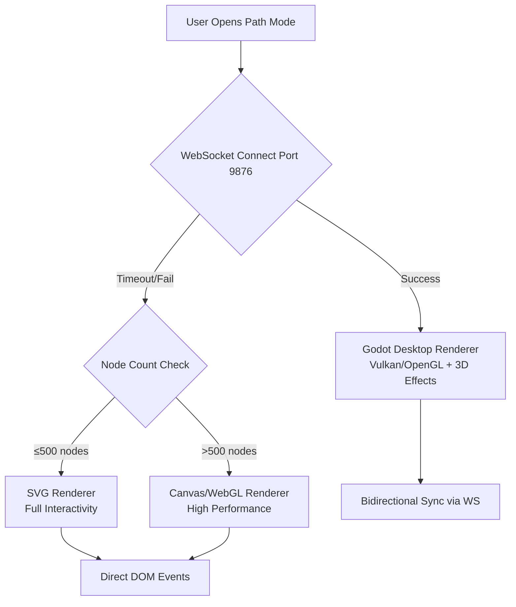

# Path Mode Architecture v2: Orbital Learning System

> Comprehensive design document for NoteConnection's Path Mode feature, enabling structured learning paths with hybrid Godot/Web visualization.

---

## 1. Hybrid Visualization Architecture

### 1.1 Rendering Strategy Hierarchy



### 1.2 WebSocket Protocol Specification

| Message Type   | Direction     | Payload                                | Description              |
| -------------- | ------------- | -------------------------------------- | ------------------------ |
| `pathResult`   | Server→Client | `{nodes:[], edges:[], strategy, mode}` | Learning path data       |
| `nodeClick`    | Client→Server | `{nodeId: string}`                     | User clicked a node      |
| `switchCenter` | Server→Client | `{newCenterId: string}`                | Center node changed      |
| `markComplete` | Client→Server | `{nodeId: string}`                     | User marked node learned |
| `pathUpdate`   | Server→Client | `{nodes:[], completedIds:[]}`          | Path state refresh       |
| `openReader`   | Client→Server | `{nodeId: string}`                     | Request to open content  |

---

## 2. Learning Mode Algorithms

### 2.1 Domain Learning (领域学习)

**Purpose**: Efficiently learn all nodes within a user-defined knowledge domain.

```
Algorithm: Priority-Queue Topological Sort
━━━━━━━━━━━━━━━━━━━━━━━━━━━━━━━━━━━━━━━━━━

Input: Set of target nodeIds (or all nodes)
Output: Ordered learning path with step numbers

1. EXPAND: Include all predecessors (prerequisites) of target nodes
2. BUILD: Construct local in-degree map for subgraph
3. INIT: Queue all nodes with in-degree=0 as "available"
4. LOOP:
   a. Sort available by strategy score (foundational/core)
   b. Pop best node, add to path
   c. Decrement in-degree of neighbors, queue if now 0
5. HANDLE CYCLES: If stuck, force-process lowest in-degree node
6. RETURN: Path with coverage metrics
```

**Scoring Functions**:

- **Foundational**: `score = (outDegree + 0.1) / (inDegree + 1)` — Favor low prerequisites, high unlocks
- **Core**: `score = centrality × 10 - inDegree` — Favor central concepts with low barriers

### 2.2 Diffusion Learning (扩散学习)

**Purpose**: Find shortest efficient path to learn a specific target concept.

```
Algorithm: Reverse BFS + Topological Sort
━━━━━━━━━━━━━━━━━━━━━━━━━━━━━━━━━━━━━━━━━━

Input: targetNodeId
Output: Minimal prerequisite chain to target

1. TRACE: BFS from target, following INCOMING edges
2. COLLECT: All ancestor nodes (transitive closure)
3. FILTER: Add target to ancestor set
4. SORT: Apply priority-queue topological sort to subset
5. RETURN: Optimized path ending at target
```

> [!IMPORTANT]
> **Diffusion vs Domain Distinction**: In Diffusion mode, peripheral nodes must NOT be out-degree nodes of the ultimate target—they should be high-association nodes to the _current_ central node only.

---

## 3. Orbital Learning UX Design

### 3.1 Visual Metaphor

```
                    ┌─────────────────────────────────────┐
                    │        ORBITAL LEARNING VIEW        │
                    │                                     │
                    │      ○  Peripheral (In-Degree)      │
                    │        ↘                            │
                    │    ○ ──── ███████ ──── ○            │
                    │           ██ C ██      Peripheral   │
                    │    ○ ──── ███████ ──── ○            │
                    │        ↗  (Central)                 │
                    │      ○                              │
                    │                                     │
                    │  Legend:                            │
                    │  ███ = Large, bright central bubble │
                    │  ○   = Small, translucent satellite │
                    │  ★   = Gold mini-bubble (completed) │
                    └─────────────────────────────────────┘
```

### 3.2 Node Display Rules

| State          | Size            | Opacity | Content                               | Layer      |
| -------------- | --------------- | ------- | ------------------------------------- | ---------- |
| **Central**    | 80-100px radius | 90%     | Title (24 chars) + Progress indicator | Foreground |
| **Peripheral** | 30-40px radius  | 60%     | Title only (15 chars + ellipsis)      | Background |
| **Completed**  | 8px radius      | 100%    | Gold star in collapsible sidebar      | Sidebar    |

### 3.3 Peripheral Selection Algorithm

**Domain Learning:**

1. Collect in-degree nodes (prerequisites) of current central
2. Fill remaining slots (up to 4) with highest-association nodes

**Diffusion Learning:**

1. Collect high-association nodes to current central
2. Exclude any out-degree nodes of the ultimate target

### 3.4 Interaction Specification

| Action            | Target     | Result                                                      |
| ----------------- | ---------- | ----------------------------------------------------------- |
| **Double-Click**  | Central    | Open Reader with node content                               |
| **Double-Click**  | Peripheral | **Orbital Rotation**: Peripheral rotates to center (~500ms) |
| **Single Click**  | Any Node   | Show stats popup                                            |
| **Mark Complete** | Button     | Central → Gold Star → Auto-advance to next                  |

### 3.5 Orbital Rotation Animation (~500ms)

```
Sequence:
1. Clicked peripheral begins arc toward center
2. Current central shrinks, moves to vacated orbital slot
3. Other peripherals redistribute on orbital ring
4. New central inflates to full size
5. Progress indicator updates (X of Y prerequisites)
```

---

## 4. Godot 3D Implementation Design

### 4.1 Scene Architecture

```
Main.tscn
├── Camera3D (with smooth follow)
├── WorldEnvironment (bloom, ambient)
├── PathRenderer (Node3D)
│   ├── CentralBubble (MeshInstance3D + ShaderMaterial)
│   ├── PeripheralContainer (Node3D)
│   │   └── [Dynamic PeripheralBubble instances]
│   └── EdgeDrawer (ImmediateMesh)
├── UI (CanvasLayer)
│   ├── MarkCompleteButton
│   ├── HistorySidebar
│   └── FuturePathTreeView
└── WsClient (Autoload)
```

### 4.2 Bubble Shader (Pseudo-3D Effect)

```gdscript
# bubble_material.gdshader
shader_type spatial;

uniform vec4 base_color : source_color = vec4(0.2, 0.6, 1.0, 0.8);
uniform float fresnel_power : hint_range(0.1, 5.0) = 3.0;
uniform sampler2D noise_texture;

void fragment() {
    // Fresnel edge glow for bubble effect
    float fresnel = pow(1.0 - dot(NORMAL, VIEW), fresnel_power);

    // Animated noise for translucency
    vec2 uv_animated = UV + TIME * 0.05;
    float noise = texture(noise_texture, uv_animated).r * 0.2;

    ALBEDO = base_color.rgb + fresnel * 0.3;
    ALPHA = base_color.a - noise;
    EMISSION = base_color.rgb * fresnel * 0.5;
}
```

### 4.3 State Machine for Learning Flow

```gdscript
# learning_state_machine.gd
class_name LearningStateMachine
extends Node

signal state_changed(from: StringName, to: StringName)

enum State { IDLE, VIEWING, TRANSITIONING, READING }

var current_state: State = State.IDLE
var current_central_id: String = ""
var completed_ids: Array[String] = []

func transition_to(new_state: State, data: Dictionary = {}) -> void:
    var old_state = current_state
    current_state = new_state
    state_changed.emit(State.keys()[old_state], State.keys()[new_state])

    match new_state:
        State.VIEWING:
            _on_enter_viewing(data)
        State.TRANSITIONING:
            _on_enter_transitioning(data)
        State.READING:
            _on_enter_reading(data)

func mark_complete(node_id: String) -> void:
    if node_id not in completed_ids:
        completed_ids.append(node_id)
        _save_progress()
        _advance_to_next()
```

---

## 5. Future Path Tree View

### 5.1 Tree Visualization Requirements

```
┌─ FUTURE LEARNING PATH ─────────────────────────┐
│                                                │
│  ○ Calculus I                                  │
│  ├── ○ Derivatives                             │
│  │   ├── ● Chain Rule (Current)                │
│  │   └── ○ Product Rule                        │
│  └── ○ Integrals                               │
│      └── ○ Fundamental Theorem                 │
│                                                │
│  [★] = Completed  [●] = Current  [○] = Pending │
└────────────────────────────────────────────────┘
```

### 5.2 Tree Interaction

- **Click on Tree Node**: Switch central view to that node
- **Settings Toggle**: "Automatically reconstruct learning path when switching starting point"
  - **ON**: Recalculates entire path from new start
  - **OFF**: Only changes display position, keeps original path

---

## 6. Proposed File Changes

### Backend (path calculation)

#### [MODIFY] [path_core.js](file:///e:/Knowledge_project/NoteConnection_app/src/frontend/libs/path_core.js)

- Add `getPeripheralNodes(centralId, mode)` method to PathEngine
- Add `getTreePath(currentId, learningPath)` for future path visualization
- Add progress tracking state management

---

### Godot Desktop Renderer

#### [MODIFY] [path_renderer.gd](file:///e:/Knowledge_project/NoteConnection_app/path_mode/scripts/path_renderer.gd)

- Upgrade to 3D rendering with MeshInstance3D
- Implement bubble shader with fresnel glow
- Add orbital animation for peripheral nodes
- Implement layer separation (central vs peripheral)

#### [NEW] [learning_state_machine.gd](file:///e:/Knowledge_project/NoteConnection_app/path_mode/scripts/learning_state_machine.gd)

- State machine for learning flow control
- Progress persistence via user:// filesystem
- Auto-advance logic after marking complete

#### [NEW] [bubble_material.gdshader](file:///e:/Knowledge_project/NoteConnection_app/path_mode/shaders/bubble_material.gdshader)

- Fresnel bubble effect
- Animated noise for translucency
- Configurable colors for different states

#### [MODIFY] [ws_client.gd](file:///e:/Knowledge_project/NoteConnection_app/path_mode/scripts/ws_client.gd)

- Add handlers for new message types (markComplete, openReader)
- Emit signals for state machine consumption

---

### Frontend Web Fallback

#### [NEW] [path_orbital.js](file:///e:/Knowledge_project/NoteConnection_app/src/frontend/libs/path_orbital.js)

- Canvas-based orbital layout renderer
- Bubble animation using requestAnimationFrame
- Mouse/touch interaction handling

#### [NEW] [path_tree.js](file:///e:/Knowledge_project/NoteConnection_app/src/frontend/libs/path_tree.js)

- D3-based tree layout for future path view
- Click-to-navigate functionality

---

## 7. Decision Log

| Decision                        | Alternatives Considered             | Rationale                                                                         |
| ------------------------------- | ----------------------------------- | --------------------------------------------------------------------------------- |
| 3D MeshInstance over 2D Sprites | Canvas2D, Sprite3D                  | True 3D enables depth-based effects, bloom, and physics integration               |
| WebSocket over HTTP polling     | REST API, Server-Sent Events        | Bidirectional real-time communication essential for smooth state sync             |
| Fresnel shader for bubbles      | Simple transparency, Outline shader | Fresnel provides organic glass-like appearance matching bubble metaphor           |
| localStorage for progress       | IndexedDB, Server sync              | Offline-first requirement; localStorage is simplest for cross-session persistence |
| State Machine pattern           | Direct conditionals, Event bus      | Clear state transitions, easier debugging of learning flow                        |

---

## Verification Plan

### Manual Testing

1. **Godot Renderer Test**
   - Open `path_mode/project.godot` in Godot 4.3
   - Press F5 to run the scene
   - Verify central bubble renders larger than peripherals
   - Verify double-click sends WebSocket message

2. **Learning Flow Test**
   - Start Domain Learning mode
   - Mark several nodes complete
   - Close and reopen application
   - Verify completed nodes persist and appear as gold stars

3. **Tree View Navigation**
   - Open Future Path tree view
   - Click on different nodes
   - Verify central view switches correctly
   - Toggle "auto-reconstruct" setting and verify behavior difference

> [!NOTE]
> Since this is primarily an architecture planning document, implementation verification will occur during the EXECUTION phase. User review of this design is required before proceeding.

---

## Confirmed Design Decisions (Brainstorming Complete)

| Decision                | Final Choice                         | Rationale                              |
| ----------------------- | ------------------------------------ | -------------------------------------- |
| Display Limit           | 1 Central + 1-4 Peripheral (dynamic) | Adapts to node connectivity            |
| Zero In-Degree Fallback | Highest relevance score              | Ensures meaningful peripherals         |
| Central Content         | Title + Progress indicator           | Progress tracking is core UX           |
| Peripheral Labels       | 15 chars + ellipsis                  | Clean yet informative                  |
| Transition Animation    | Orbital rotation (~500ms)            | Best fits "Orbital Learning" metaphor  |
| Gold Star Sidebar       | Collapsible with `★ × {N}` format    | Reduces clutter in long sessions       |
| Peripheral Selection    | In-degree first + association fill   | Balances learning order with discovery |

> [!NOTE]
> All design questions have been resolved through structured brainstorming. See [brainstorming.md](file:///C:/Users/jacob/.gemini/antigravity/brain/d1cf6b8d-481a-4278-9a30-de1cfdc75527/brainstorming.md) for detailed decision rationale.
