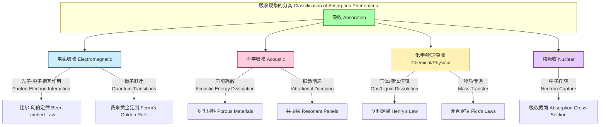

## 吸收 (Absorption)

吸收是一种物理或化学现象，其中原子、分子或离子等粒子从一个体相（bulk phase）进入或穿过另一个不同的体相——通常是气体、液体或固体。这个过程区别于吸附（adsorption），因为在吸附中粒子仅附着在表面上，而吸收则意味着粒子完全渗透到体相材料的体积中。本技术文档将从科学和数学的严谨角度，对吸收现象进行全面的阐述，涵盖电磁学、声学、化学和核物理等多个领域。



### 1. 核心概念与数学基础 (Core Concepts and Mathematical Foundations)

#### 1.1 电磁吸收 (Electromagnetic Absorption)

当电磁辐射穿过一种介质时，其能量被介质吸收并转化为其他形式的能量（如热能），这种现象称为电磁吸收。其宏观行为由比尔-朗伯定律描述，而微观机制则由量子力学解释。

**比尔-朗伯定律 (Beer-Lambert Law)**

该定律定量描述了光的吸收与吸收物质的性质之间的关系。它指出，对于均匀的吸收介质，吸光度（Absorbance）与吸光物质的浓度和光程长度成正比。

数学表达式为：
$$
A = -\log_{10}(T) = -\log_{10}\left(\frac{I}{I_0}\right) = \epsilon c l
$$

其中：
*   $A$ 是吸光度（Absorbance），一个无量纲的量。
*   $T$ 是透射比（Transmittance），即透射光强度与入射光强度的比值。
*   $I$ 是通过样品后的光强度 (W/m²)。
*   $I_0$ 是入射到样品前的光强度 (W/m²)。
*   $\epsilon$ (epsilon) 是摩尔吸光系数（molar absorptivity）或消光系数（extinction coefficient），单位为 L·mol⁻¹·cm⁻¹。它是一个与物质种类、溶剂和波长相关的常数。
*   $c$ 是吸光物质的摩尔浓度（molar concentration），单位为 mol/L。
*   $l$ 是光在介质中传播的路径长度（path length），单位为 cm。

**复折射率与吸收 (Complex Refractive Index and Absorption)**

在电磁波理论中，吸收介质的特性可以通过复折射率 $\tilde{n}$ 来描述：
$$
\tilde{n} = n + i\kappa
$$

其中：
*   $n$ 是折射率（refractive index），描述了光速在介质中的降低程度。
*   $\kappa$ (kappa) 是消光系数（extinction coefficient），描述了电磁波能量在介质中被吸收的程度。
*   $i$ 是虚数单位，$i^2 = -1$。

电磁波在介质中传播时，其电场强度 $E$ 的衰减可以表示为：
$$
E(z) = E_0 e^{i(k z - \omega t)} = E_0 e^{i(\frac{2\pi\tilde{n}}{\lambda_0} z - \omega t)} = E_0 e^{-\frac{2\pi\kappa}{\lambda_0}z} e^{i(\frac{2\pi n}{\lambda_0}z - \omega t)}
$$
光的强度 $I$ 与电场振幅的平方成正比 ($I \propto |E|^2$)，因此：
$$
I(z) = I_0 e^{-\frac{4\pi\kappa}{\lambda_0}z} = I_0 e^{-\alpha z}
$$

这里的 $\alpha$ 是吸收系数（absorption coefficient），它与消光系数 $\kappa$ 的关系为：
$$
\alpha = \frac{4\pi\kappa}{\lambda_0}
$$
其中 $\lambda_0$ 是电磁波在真空中的波长。$\alpha$ 的单位通常是 m⁻¹ 或 cm⁻¹。

#### 1.2 声学吸收 (Acoustic Absorption)

声学吸收是指声波在介质中传播或与材料表面作用时，声能转化为热能或其他形式能量的过程。声学吸收系数 $\alpha_{acoustic}$ 是衡量材料吸声性能的关键指标。

$$
\alpha_{acoustic} = \frac{E_{absorbed} + E_{transmitted}}{E_{incident}} = 1 - R = 1 - \frac{E_{reflected}}{E_{incident}}
$$

其中：
*   $E_{incident}$ 是入射声能。
*   $E_{absorbed}$ 是被材料吸收的声能。
*   $E_{transmitted}$ 是穿透材料的声能。
*   $E_{reflected}$ 是被材料反射的声能。
*   $R$ 是反射系数（reflection coefficient）。

对于一个理想的隔音室，通常要求墙壁材料的 $\alpha_{acoustic}$ 趋近于1。

#### 1.3 化学吸收 (Chemical Absorption)

化学吸收是指气体或液体组分溶解在液体或固体吸收剂中，并可能发生化学反应的过程。这个过程主要受传质（mass transfer）控制。

**菲克扩散定律 (Fick's Laws of Diffusion)**

菲克第一定律描述了稳态扩散，即通量与浓度梯度的关系：
$$
J = -D \frac{\partial \phi}{\partial x}
$$

其中：
*   $J$ 是扩散通量（diffusion flux），表示单位时间通过单位面积的物质的量 (mol·m⁻²·s⁻¹)。
*   $D$ 是扩散系数（diffusion coefficient），表征扩散速率 (m²/s)。
*   $\phi$ 是浓度（concentration），(mol/m³)。
*   $x$ 是位置坐标 (m)。

负号表示扩散方向与浓度梯度方向相反。

### 2. 关键技术规格 (Key Technical Specifications)

下表列出了一些常见材料在特定条件下的吸收特性。

**表1：不同材料的电磁吸收系数**

| 材料 (Material) | 波长 (Wavelength) | 吸收系数 $\alpha$ (cm⁻¹) | 备注 (Notes) |
| :--- | :--- | :--- | :--- |
| 水 (Water) | 532 nm (Green Laser) | $4.3 \times 10^{-4}$ | 在可见光区透明 |
| 水 (Water) | 2.94 µm (Er:YAG Laser) | $1.2 \times 10^{4}$ | 强红外吸收峰 |
| 硅 (Silicon, Si) | 1.1 µm (Band Edge) | $\sim 10$ | 间接带隙吸收 |
| 硅 (Silicon, Si) | 400 nm (Blue Light) | $> 1 \times 10^{4}$ | 直接跃迁区域 |
| 锗 (Germanium, Ge) | 1.8 µm (Band Edge) | $\sim 50$ | 红外探测器材料 |

**表2：常见建筑材料的声学吸声系数 (NRC)**

噪声降低系数（Noise Reduction Coefficient, NRC）是材料在250, 500, 1000, 2000 Hz四个频率下吸声系数的算术平均值。

| 材料 (Material) | NRC (无量纲) | 典型应用 (Typical Application) |
| :--- | :--- | :--- |
| 混凝土 (Concrete) | 0.02 - 0.05 | 反射表面 |
| 玻璃窗 (Glass Window) | 0.05 - 0.10 | 标准窗户 |
| 地毯 (Carpet on Concrete) | 0.20 - 0.55 | 地面覆盖 |
| 玻璃纤维板 (Fiberglass Board, 2.5cm) | 0.75 - 0.90 | 声学天花板、墙板 |
| 专业吸音棉 (Acoustic Foam) | 0.95 - 1.00 | 录音棚、消声室 |

### 3. 常见用例与性能指标 (Common Use Cases & Performance Metrics)

*   **光纤通信 (Optical Fiber Communication):**
    *   **用例:** 在1.55 µm波段进行长距离数据传输。
    *   **性能指标:** 石英光纤在该波段的吸收损耗极低，通常低于 0.2 dB/km。这意味着光信号传播5公里后，强度仍保持为初始强度的 $10^{-0.2 \times 5 / 10} \approx 79.4\%$。
    *   **数学模型:** $P_{out} = P_{in} 10^{-\frac{\text{Loss (dB/km)} \times L (\text{km})}{10}}$

*   **太阳能电池 (Photovoltaics):**
    *   **用例:** 吸收太阳光谱能量并将其转换为电能。
    *   **性能指标:** 外量子效率（External Quantum Efficiency, EQE）描述了在特定波长下，每个入射光子能产生多少个电子-空穴对。高效太阳能电池在可见光和近红外区域的EQE可达 90% ± 5% (95% CI)。
    *   **目标:** 最大化在太阳光谱主要能量分布区（400 nm - 1100 nm for Si）的积分吸收。

*   **消声室 (Anechoic Chamber):**
    *   **用例:** 提供一个无反射的声学环境，用于精确测量声源的特性。
    *   **性能指标:** 在特定频率范围内（例如 100 Hz - 10 kHz），墙面材料的声学吸收系数 $\alpha_{acoustic} > 0.99$。这意味着超过99%的入射声能被吸收。

### 4. 实现考量与算法分析 (Implementation Considerations & Algorithmic Analysis)

在现代科学与工程中，吸收过程的模拟至关重要。有限差分时域法（Finite-Difference Time-Domain, FDTD）是模拟电磁波与吸收介质相互作用的强大工具。

**FDTD 算法在有损介质中的实现**

在有电导率 $\sigma$ 的有损介质中，安培环路定律的旋度方程变为：
$$
\nabla \times \mathbf{H} = \mathbf{J} + \frac{\partial \mathbf{D}}{\partial t} = \sigma \mathbf{E} + \epsilon \frac{\partial \mathbf{E}}{\partial t}
$$
通过中心差分近似，该方程可以离散化为电场 $E$ 的更新方程。例如，其一维形式为：
$$
E_x^{n+1}(k) = C_a(k) \cdot E_x^n(k) + C_b(k) \cdot \frac{H_y^{n+1/2}(k+1/2) - H_y^{n+1/2}(k-1/2)}{\Delta z}
$$
其中更新系数 $C_a$ 和 $C_b$ 包含了介电常数 $\epsilon$ 和电导率 $\sigma$：
$$
C_a(k) = \frac{1 - \frac{\sigma(k) \Delta t}{2\epsilon(k)}}{1 + \frac{\sigma(k) \Delta t}{2\epsilon(k)}} \quad , \quad C_b(k) = \frac{\frac{\Delta t}{\epsilon(k)}}{1 + \frac{\sigma(k) \Delta t}{2\epsilon(k)}}
$$

**算法复杂度分析 (Algorithmic Complexity Analysis)**

*   **时间复杂度 (Time Complexity):** $O(N_t \cdot N_s)$
    *   $N_t$ 是总的时间步数。
    *   $N_s$ 是空间网格点的总数（例如，在3D中为 $N_x \times N_y \times N_z$）。
    *   算法在每个时间步更新每个网格点上的场，因此复杂度与时间和空间网格点数呈线性关系。
*   **空间复杂度 (Space Complexity):** $O(N_s)$
    *   需要存储每个网格点上的电场和磁场分量。

### 5. 性能特征与统计度量 (Performance Characteristics & Statistical Measures)

在实验测量中，吸收值总伴随着不确定性。

*   **光度精度 (Photometric Accuracy):** 指示测量值与真实值之间的接近程度。例如，一个高质量的分光光度计在 A=1.0 处的精度可能为 ±0.005 A。
*   **光度重复性 (Photometric Repeatability):** 指示在相同条件下重复测量的离散程度。例如，对同一样品连续10次测量的标准差（Standard Deviation）为 0.001 A。
*   **置信区间 (Confidence Interval):** 测量结果通常以置信区间的形式报告，以表达其统计可靠性。例如，某物质在特定波长的摩尔吸光系数测量结果可以表示为：
    $$
    \epsilon = (1.52 \pm 0.04) \times 10^4 \text{ L·mol⁻¹·cm⁻¹ (95% CI)}
    $$
    这表示我们有95%的信心认为真实值落在这个区间内。

### 6. 相关技术与比较模型 (Related Technologies & Comparative Models)

吸收是波与物质相互作用的几种基本方式之一。理解其与其他过程的关系至关重要。

```mermaid
graph LR
    subgraph "波与物质的相互作用 Wave-Matter Interaction"
        IncidentWave["入射波 Incident Wave"]
        InteractionPoint["作用点 Interaction Point["
        IncidentWave --> InteractionPoint

        subgraph "过程 Processes"
            Absorption["吸收 Absorption<br>能量转化为热能等<br>Energy converted to heat, etc."]
            Reflection["反射 Reflection<br>波在界面弹回<br>Wave bounces off interface"]
            Transmission["透射 Transmission<br>波穿过介质<br>Wave passes through medium"]
            Scattering["散射 Scattering<br>波向多方向重新辐射<br>Wave re-radiated in many directions"]
        end

        InteractionPoint --> Absorption
        InteractionPoint --> Reflection
        InteractionPoint --> Transmission
        InteractionPoint --> Scattering

        subgraph "能量守恒 Energy Conservation"
            eq["A + R + T + S = 1"]
        end
        
        Absorption -- "A" --> eq
        Reflection -- "R" --> eq
        Transmission -- "T" --> eq
        Scattering -- "S" --> eq
    end

    style Absorption fill:#ffaaaa
    style Reflection fill:#aaaaff
    style Transmission fill:#aaffaa
    style Scattering fill:#ffddaa
```

**吸收 (Absorption) vs. 吸附 (Adsorption)**

*   **吸收 (Absorption):** 是一个**体相**过程。粒子（吸收物）穿透并溶解在另一物质（吸收剂）的**整个体积**中。例如，氨气溶于水。
*   **吸附 (Adsorption):** 是一个**表面**过程。粒子（吸附物）附着在另一物质（吸附剂）的**表面**上。例如，活性炭吸附气体分子。

在数学模型上，化学吸收通常用基于菲克定律的反应-扩散方程描述，而吸附则常用朗缪尔（Langmuir）或BET（Brunauer-Emmett-Teller）等温线模型来描述。

**朗缪尔吸附等温线模型 (Langmuir Adsorption Isotherm):**
$$
\theta = \frac{K P}{1 + K P}
$$
其中：
*   $\theta$ 是表面覆盖率（fractional surface coverage）。
*   $P$ 是气体分压（partial pressure）。
*   $K$ 是吸附平衡常数。

该模型描述了单层吸附，与描述体相溶解的亨利定律（$C = k_H P$）形成对比。

### 7. 参考文献 (References)

1.  Taflove, A., & Hagness, S. C. (2005). *Computational Electrodynamics: The Finite-Difference Time-Domain Method, Third Edition*. Artech House. (A foundational text for FDTD modeling).
2.  S. M. Sze, & K. K. Ng. (2006). *Physics of Semiconductor Devices, 3rd Edition*. Wiley. (Provides detailed data on semiconductor absorption). DOI: [10.1002/0470068329](https://doi.org/10.1002/0470068329)
3.  Cox, T. J., & D'Antonio, P. (2017). *Acoustic Absorbers and Diffusers: Theory, Design and Application, Third Edition*. CRC Press. (A comprehensive guide to acoustic absorption). DOI: [10.1201/9781315216239](https://doi.org/10.1201/9781315216239)
4.  Atkins, P., & de Paula, J. (2014). *Atkins' Physical Chemistry, 10th Edition*. Oxford University Press. (Covers the fundamentals of chemical absorption and adsorption).