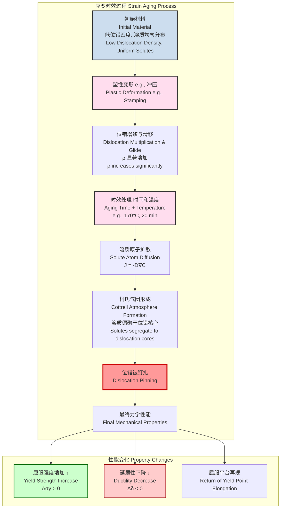

## 塑性变形时效 (Aging through plastic deformation)

塑性变形时效，通常被称为应变时效（Strain Aging），是一种在金属材料中观察到的现象，即材料在经历塑性变形后，其力学性能随时间发生变化。这种变化通常在室温或略高于室温的温度下发生，导致屈服强度和硬度增加，但延展性和韧性降低。此现象在低碳钢中尤为显著，主要是由于间隙溶质原子（如碳和氮）与塑性变形过程中产生的位错发生交互作用。

### 核心概念及其数学基础

应变时效的核心机制可分为两个主要阶段：
1.  **塑性变形**: 在外加载荷下，材料发生塑性变形，主要通过位错的滑移和增殖实现。这导致材料内部位错密度（单位体积内的位错线总长度）显著增加。
2.  **时效**: 变形后，材料被置于某一温度下（可以是室温）一段时间。在此期间，溶质原子（如C、N）通过扩散迁移到新产生的位错线附近。由于位错线周围存在应力场（核心区为拉伸应力场），溶质原子会偏聚于此，以降低系统的总能量。这种溶质原子的偏聚区被称为“柯氏气团”（Cottrell Atmosphere）。

柯氏气团的形成将位错“钉扎”（Pinning）住，使得位错再次运动需要更大的外加应力。这宏观上表现为材料屈服强度的提高。

#### 数学基础

**1. 位错密度演化 (Dislocation Density Evolution)**

塑性变形过程中的加工硬化（Work Hardening）与位错密度的增加直接相关。泰勒关系式（Taylor's relation）描述了剪切流变应力 $\tau$ 与位错密度 $\rho$ 之间的关系：

$$
\tau = \tau_0 + \alpha G b \sqrt{\rho}
$$

其中：
*   $\tau$ 是剪切流变应力 (Pa)。
*   $\tau_0$ 是晶格的本征阻力，即初始剪切屈服应力 (Pa)。
*   $\alpha$ 是一个无量纲常数，通常取值在 0.2-0.5 之间，取决于晶体结构和位错交互作用的模式。
*   $G$ 是剪切模量 (Pa)。
*   $b$ 是伯格斯矢量的大小 (m)。
*   $\rho$ 是位错密度 (m⁻²)。

塑性应变 $\epsilon_p$ 的增加会导致位错密度 $\rho$ 的增加，通常遵循一个经验关系式，例如 $\frac{d\rho}{d\epsilon_p} \propto \frac{1}{b L}$，其中 $L$ 是位错的平均自由程。

**2. 溶质扩散动力学 (Solute Diffusion Kinetics)**

溶质原子向位错的迁移是一个扩散控制过程。其通量 $J$ 可以由菲克第一定律（Fick's First Law）描述：

$$
J = -D \nabla C
$$

其中：
*   $J$ 是溶质原子的扩散通量 (atoms m⁻² s⁻¹)。
*   $D$ 是溶质原子的扩散系数 (m² s⁻¹)。
*   $\nabla C$ 是溶质原子的浓度梯度 (atoms m⁻⁴)。

扩散系数 $D$ 对温度有强烈的依赖性，遵循阿伦尼乌斯关系（Arrhenius equation）：

$$
D = D_0 \exp\left(-\frac{Q_d}{k_B T}\right)
$$

其中：
*   $D_0$ 是指前因子 (m² s⁻¹)。
*   $Q_d$ 是扩散激活能 (J/atom 或 eV/atom)。
*   $k_B$ 是玻尔兹曼常数 (1.38 × 10⁻²³ J K⁻¹)。
*   $T$ 是绝对温度 (K)。

**3. 柯氏气团形成动力学 (Kinetics of Cottrell Atmosphere Formation)**

Cottrell 和 Bilby 对溶质原子在位错应力场中偏聚的初始阶段进行了建模。他们推导出在时效时间 $t$ 后，单位长度位错线上聚集的溶质原子数量 $N(t)$ 近似为：

$$
N(t) \approx C_0 \left( \frac{A D t}{k_B T} \right)^{2/3}
$$

其中：
*   $N(t)$ 是单位长度位错线上聚集的溶质原子数 (atoms m⁻¹)。
*   $C_0$ 是基体中溶质原子的平均浓度 (atoms m⁻³)。
*   $A$ 是一个与位错和溶质原子之间相互作用能相关的参数，对于刃型位错，$A \approx 3\pi G b \Delta V$，其中 $\Delta V$ 是溶质原子引起的晶格体积变化。
*   $D, k_B, T$ 的定义同上。

**4. 屈服强度的增加 (Increase in Yield Strength)**

位错被钉扎后，需要一个额外的应力 $\Delta\sigma_y$ 才能使其脱离柯氏气团，这个应力增量即为应变时效引起的强度增加。其大小与钉扎点的密度和强度有关。一个简化的模型认为强度增量与时效时间 $t$ 的幂函数成正比：

$$
\Delta\sigma_y(t) = K \cdot t^n
$$

其中指数 $n$ 通常在 1/3 到 2/3 之间，这与 Cottrell-Bilby 模型预测的溶质偏聚速率相符。在饱和状态下，强度增量达到最大值 $\Delta\sigma_{y,max}$。

### 关键技术规格

下表列出了低碳钢（例如：汽车用烘烤硬化钢）在典型应变时效处理中的关键参数。

| 参数 (Parameter) | 符号 (Symbol) | 典型值 (Typical Value) | 单位 (Unit) |
| :--- | :---: | :--- | :---: |
| 预应变量 (Pre-strain) | $\epsilon_p$ | 1 - 5 | % |
| 时效温度 (Aging Temperature) | $T_{age}$ | 20 - 200 | °C |
| 时效时间 (Aging Time) | $t_{age}$ | 0.5 - 1000 | 小时 (hours) |
| 碳/氮浓度 (C/N Concentration) | $C_0$ | 10 - 100 | ppm (wt) |
| 屈服强度增量 (Yield Strength Increase) | $\Delta\sigma_y$ | 30 - 80 | MPa |
| 抗拉强度增量 (UTS Increase) | $\Delta\sigma_{UTS}$ | 5 - 20 | MPa |
| 延伸率损失 (Ductility Loss) | $\Delta\delta$ | 1 - 5 | % (绝对值) |
| 扩散激活能 (Activation Energy, C in α-Fe) | $Q_d$ | 0.87 | eV/atom |
| 指前因子 (Pre-exponential Factor, C in α-Fe) | $D_0$ | 6.2 × 10⁻⁷ | m²/s |

### 常见用例与量化性能指标

1.  **汽车工业中的烘烤硬化 (Bake Hardenable, BH) 钢**
    *   **描述**: BH 钢被广泛用于汽车外板，如车门、引擎盖等。在冲压成型过程中，钢板经历塑性变形（约2-5%的应变）。随后，在车身涂装线的油漆烘烤过程中（通常在 170°C 左右加热 20 分钟），发生应变时效。
    *   **性能指标**:
        *   **抗凹陷性提升**: 烘烤过程使钢板的屈服强度提高 30-60 MPa。这种强度的增加显著提高了汽车外板的抗凹陷能力，同时在成型时保持了良好的延展性。
        *   **量化指标**: BH 值（Bake Hardening Index）定义为时效后的屈服强度与预应变后的流动应力之差。一个典型的 BH220 钢，其 BH 值 > 35 MPa。

2.  **钢筋混凝土中的钢筋**
    *   **描述**: 冷加工（冷拔或冷轧）的钢筋在储存和使用过程中会发生室温下的应变时效。
    *   **性能指标**:
        *   **屈服强度增加**: 屈服强度可能在几个月内增加 10-15%。这在结构设计中通常被视为一个安全裕度。
        *   **负面影响**: 延展性和抗震性能可能略有下降，需要在设计规范中予以考虑。

3.  **负面应用：吕德斯带（Lüders Bands）和拉伸痕（Stretcher Strains）**
    *   **描述**: 对于退火后的低碳钢板，如果储存时间过长，会发生静态应变时效。这会导致明显的“屈服平台”在应力-应变曲线上重新出现。在后续的冲压成型中，这种不均匀的屈服会导致零件表面出现被称为“拉伸痕”的缺陷，影响表面质量。
    *   **缓解措施**: 在冲压前对钢板进行一次轻微的冷轧（平整处理，Temper Rolling），通常是 0.5-1.5% 的压下率，以消除屈服平台，从而避免拉伸痕的产生。

### 实施考量与算法复杂度分析

在工业应用中，精确控制应变时效的效果至关重要。这通常涉及对热-机处理过程的建模和仿真。

*   **过程控制**:
    *   **预应变控制**: 必须精确控制成型过程中的应变分布，因为应变量直接决定了位错密度和最终的强化效果。
    *   **热循环控制**: 烘烤或时效的温度-时间曲线必须严格控制，以确保溶质原子有足够但不过度的扩散。
    *   **化学成分控制**: 钢中的 C、N 含量需要被精确控制在特定范围内，以获得理想的 BH 值而不过度损害延展性。

*   **建模与仿真**:
    *   **模型**: 预测应变时效通常采用耦合模型，结合有限元方法（FEM）来计算宏观应力应变场，并与微观结构演化模型（如 Cottrell-Bilby 模型或更复杂的相场模型）相结合。
    *   **算法复杂度**: 对于一个基于 FEM 的耦合仿真，其计算复杂度可以粗略估计为：
        $$
        \text{Complexity} \approx O(N_{nodes} \cdot N_{steps} \cdot M_{iter})
        $$
        其中：
        *   $N_{nodes}$ 是有限元网格中的节点数。
        *   $N_{steps}$ 是求解过程中的时间步数。
        *   $M_{iter}$ 是每个时间步内非线性求解器所需的平均迭代次数。
        对于一个包含百万级节点的复杂汽车覆盖件冲压-烘烤仿真，计算成本可能非常高。

### 性能特征与统计度量

应变时效对力学性能的影响具有统计分布特性，这源于材料微观结构和工艺参数的微小波动。

*   **屈服强度增量分布**: 对于一批在相同工艺下生产的 BH 钢，其 BH 值的分布通常可以近似为正态分布。
    *   **示例**: 某批次 BH 钢，在 2% 预应变、170°C 加热 20 分钟后，其屈服强度增量 $\Delta\sigma_y$ 可能服从正态分布 $\mathcal{N}(\mu=45 \, \text{MPa}, \sigma^2=5^2 \, \text{MPa}^2)$。这意味着平均强度增益为 45 MPa，标准差为 5 MPa。95% 置信区间为 $[35.2, 54.8]$ MPa。
*   **屈服平台的再现**: 应变时效的一个显著特征是导致光滑的应力-应变曲线重新出现不连续的屈服点和屈服平台（Yield Point Elongation, YPE）。YPE 的大小与时效程度正相关。
*   **冲击韧性**: 应变时效通常会导致材料的韧脆转变温度（Ductile-to-Brittle Transition Temperature, DBTT）升高，从而降低其在低温下的冲击韧性。

下图展示了应变时效的完整物理过程。

### 相关技术与比较数学模型

应变时效是几种材料强化机制之一。与其他机制的比较有助于更深入的理解。

| 强化机制 (Strengthening Mechanism) | 主要物理过程 (Primary Physical Process) | 核心数学模型 (Core Mathematical Model) |
| :--- | :--- | :--- |
| **应变时效 (Strain Aging)** | 溶质原子扩散并钉扎可动位错。 | 屈服强度增量与溶质偏聚量相关： $\Delta\sigma_y \propto N(t)^{m}$, $m \approx 1 \text{ or } 2$ |
| **加工硬化 (Work Hardening)** | 塑性变形导致位错密度增加，位错之间相互缠结阻碍运动。 | 泰勒关系式 (Taylor Relation): $\Delta\tau = \alpha G b \sqrt{\rho}$ |
| **固溶强化 (Solid Solution Strengthening)** | 溶质原子在晶格中产生应力场，阻碍位错运动。 | 强度增量与溶质浓度 $c$ 的关系： $\Delta\sigma_{ss} \propto G \cdot |\epsilon_s|^{n} \cdot c^m$, $n \approx 1.5, m \approx 0.5$ |
| **析出/弥散强化 (Precipitation Hardening)** | 热处理形成稳定的第二相粒子，阻碍位错运动。 | 奥罗万机制 (Orowan Mechanism) for non-shearable particles: $\Delta\tau = \frac{0.4 G b}{\pi \sqrt{1-\nu}} \frac{\ln(2r/r_0)}{L-2r}$ |

#### 模型对比详解

*   **应变时效 vs. 加工硬化**: 加工硬化是塑性变形的瞬时效应，而应变时效是变形后的时效效应。前者依赖于位错间的相互作用 ($\rho$)，后者依赖于溶质原子与位错的相互作用 ($N(t)$)。
*   **应变时效 vs. 析出强化**: 两者都涉及“时效”，但机制不同。应变时效是溶质原子形成“气团”，而析出强化是形成独立的、化学计量确定的第二相粒子。析出强化通常能提供更大幅度的强度提升，并且在更高温度下更稳定。奥罗万（Orowan）模型描述了位错绕过不可切削的析出粒子的机制，其中强化效果与粒子间距 $L$ 成反比。

### 参考文献

1.  Cottrell, A. H., & Bilby, B. A. (1949). Dislocation Theory of Yielding and Strain Ageing of Iron. *Proceedings of the Physical Society. Section A*, 62(1), 49. **DOI**: [10.1088/0370-1298/62/1/308](https://doi.org/10.1088/0370-1298/62/1/308)
2.  Baird, J. D. (1971). The effects of strain-ageing due to interstitial solutes on the mechanical properties of metals. *Metallurgical Reviews*, 16(1), 1-18. **DOI**: [10.1179/095066071790138272](https://doi.org/10.1179/095066071790138272)
3.  De, A. K., & Speer, J. G. (2004). Strain aging of sheet steels. *JOM*, 56(10), 45-49. **DOI**: [10.1007/s11837-004-0191-2](https://doi.org/10.1007/s11837-004-0191-2)
4.  Leslie, W. C. (1981). *The Physical Metallurgy of Steels*. McGraw-Hill. (A comprehensive textbook covering the topic).