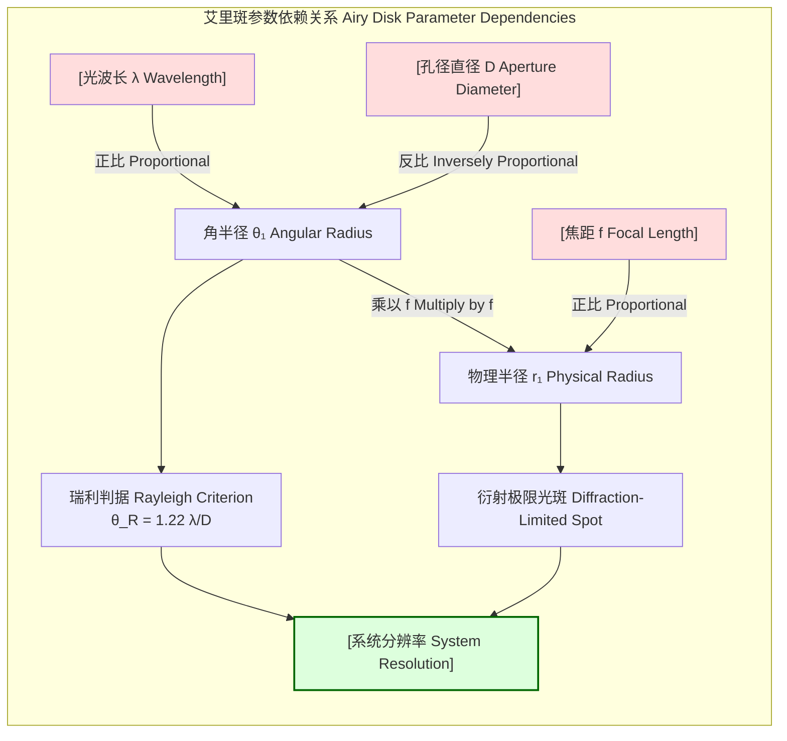

## 艾里斑 (Airy disk)

艾里斑是以英国天文学家乔治·比德尔·艾里（George Biddell Airy）命名的，它描述了光波通过一个理想圆形孔径（例如透镜或望远镜的物镜）并发生衍射时，在焦点平面上形成的特定光强分布图样。由于衍射效应，一个理想的点光源经过光学系统后不会形成一个无限小的点，而是形成一个由明亮中心区域和一系列同心圆环组成的图样。这个明亮的中心区域就是艾里斑。艾里斑是限制所有基于透镜的光学成像系统（如望远-镜、显微镜和相机）分辨率的根本物理因素。

### 核心概念与数学基础

艾里斑的形成是波的衍射现象的直接结果，可以用夫琅禾费衍射理论来精确描述。当一束平面波垂直入射到一个直径为 $D$ 的圆形孔径时，在透镜的焦平面上观察到的光强分布 $I(\theta)$ 可以通过对圆形孔径函数进行傅里叶变换得到。

其光强分布由以下公式描述：

$$ I(\theta) = I_0 \left[ \frac{2 J_1(k a \sin\theta)}{k a \sin\theta} \right]^2 $$

其中：
*   $I(\theta)$ 是在离光轴角距离为 $\theta$ 处的光强。
*   $I_0$ 是衍射图样中心（$\theta=0$）的最大光强。
*   $J_1(x)$ 是第一类一阶贝塞尔函数。贝塞尔函数是描述圆柱对称系统中波动问题的标准解。
*   $k$ 是波数，定义为 $k = \frac{2\pi}{\lambda}$。
*   $\lambda$ 是入射光的波长。
*   $a$ 是圆形孔径的半径 ($a = D/2$)。
*   $\theta$ 是观察点与光轴之间的夹角（角距离）。

艾里斑的结构由一系列暗环（光强为零的位置）分隔。这些暗环的位置对应于 $J_1(x)$ 函数的零点。第一个暗环的位置决定了中心艾里斑的大小。$J_1(x)$ 的第一个非平凡零点约在 $x \approx 3.8317$。因此，第一个暗环的角位置 $\theta_1$ 满足：

$$ k a \sin\theta_1 = \frac{2\pi a}{\lambda} \sin\theta_1 \approx 3.8317 $$

在小角度近似下 ($\sin\theta \approx \theta$)，我们可以得到第一个暗环的角半径：

$$ \theta_1 \approx \frac{3.8317 \lambda}{2\pi a} = \frac{3.8317 \lambda}{\pi D} \approx 1.22 \frac{\lambda}{D} $$

这个公式是光学中一个极其重要的结果，它定义了光学仪器的理论角分辨率极限。

### 关键技术规格

下表总结了艾里斑图样的关键参数和典型值。

| 参数 (Parameter) | 数学表达式 (Mathematical Expression) | 描述 (Description) |
| :--- | :--- | :--- |
| **第一暗环的角半径** (Angular Radius of First Dark Ring) | $\theta_1 \approx 1.22 \frac{\lambda}{D}$ | 定义了中心艾里斑的角大小。单位为弧度 (radians)。 |
| **第一暗环的物理半径** (Physical Radius of First Dark Ring) | $r_1 = f \tan\theta_1 \approx 1.22 \frac{\lambda f}{D}$ | 在焦距为 $f$ 的焦平面上，艾里斑的实际物理尺寸。单位为米 (m)。 |
| **中心区域峰值强度** (Peak Intensity of Central Maximum) | $I_0$ | 归一化为 100% 或 1.0。 |
| **第一亮环峰值强度** (Peak Intensity of First Bright Ring) | $0.0175 \times I_0$ | 约为中心峰值强度的 1.75%。 |
| **第二亮环峰值强度** (Peak Intensity of Second Bright Ring) | $0.0042 \times I_0$ | 约为中心峰值强度的 0.42%。 |
| **第三亮环峰值强度** (Peak Intensity of Third Bright Ring) | $0.0016 \times I_0$ | 约为中心峰值强度的 0.16%。 |
| **艾里斑内的能量** (Energy within Airy Disk) | $\approx 83.8\%$ | 衍射图样总能量中约 83.8% 集中在第一个暗环内部。 |
| **前两个亮环内的能量** (Energy within First Two Bright Rings) | $\approx 91.0\%$ | 衍射图样总能量中约 91.0% 集中在第二个暗环内部。 |

### 常见用例与性能指标

艾里斑的概念在多个领域中至关重要，因为它定义了衍射极限下的系统性能。

*   **天文学 (Astronomy)**
    *   **用途**: 望远镜的分辨率，即区分两个邻近恒星的能力，直接受限于其物镜产生的艾里斑的大小。
    *   **性能指标**: **瑞利判据 (Rayleigh Criterion)**。该判据指出，当一个点光源的艾里斑中心恰好落在另一个点光源的第一暗环上时，这两个点光源被认为是“刚刚好可以分辨”的。此时的最小分辨角 $\theta_R$ 为：
        $$ \theta_R = 1.22 \frac{\lambda}{D} $$
    *   **示例**: 哈勃空间望远镜的口径 $D = 2.4$ 米。在可见光波长 $\lambda = 500$ 纳米处，其理论角分辨率为 $\theta_R \approx 1.22 \times \frac{500 \times 10^{-9} \text{ m}}{2.4 \text{ m}} \approx 2.54 \times 10^{-7}$ 弧度，约等于 0.052 角秒。

*   **显微镜学 (Microscopy)**
    *   **用途**: 显微镜物镜的分辨能力同样受到衍射的限制。
    *   **性能指标**: **阿贝衍射极限 (Abbe Diffraction Limit)**。它定义了显微镜能分辨的两个点之间的最小距离 $d$。该极限与艾里斑的物理尺寸直接相关。
        $$ d = \frac{\lambda}{2n\sin\theta} = \frac{\lambda}{2 \cdot \text{NA}} $$
        其中 $n\sin\theta$ 是物镜的数值孔径 (Numerical Aperture, NA)。对于圆形孔径，更精确的表达考虑了艾里斑的尺寸，给出的极限为 $d = \frac{0.61 \lambda}{\text{NA}}$，这与瑞利判据等价。
    *   **示例**: 一个使用蓝光 ($\lambda = 450$ nm) 的油浸物镜 (NA = 1.4)，其理论分辨率极限约为 $d \approx \frac{0.61 \times 450 \text{ nm}}{1.4} \approx 196$ 纳米。

*   **摄影 (Photography)**
    *   **用途**: 在摄影中，当使用非常小的光圈（即高 f 值，f-number）时，衍射会成为限制图像锐度的主要因素，而非镜头像差。
    *   **性能指标**: 衍射极限光斑的直径。f 值定义为 $f/\# = f/D$。艾里斑的直径 $d_A = 2r_1$ 可以表示为：
        $$ d_A = 2.44 \cdot \lambda \cdot (f/\#) $$
    *   **示例**: 对于一个使用 f/22 光圈的相机，在绿光 ($\lambda = 550$ nm) 下，衍射极限光斑的直径为 $d_A = 2.44 \times 550 \times 10^{-6} \text{ mm} \times 22 \approx 0.0295$ 毫米（或 29.5 微米）。如果相机的像素尺寸小于此值，图像锐度将受到衍射的显著影响。

### 实现考量与算法分析

虽然艾里斑是一个物理现象，但可以在计算机上进行精确的数值模拟，这对于设计和分析光学系统至关重要。

*   **模拟方法**: 核心方法是使用**二维快速傅里叶变换 (2D Fast Fourier Transform, FFT)**。根据傅里叶光学理论，在夫琅禾费近似下，焦平面上的复振幅分布是出瞳函数的傅里叶变换。
*   **算法步骤**:
    1.  **创建孔径函数**: 在一个二维网格（例如 $N \times N$ 的矩阵）上定义一个圆形孔径函数 $P(x,y)$。在孔径内部，函数值为 1（或一个复数表示相位）；在孔径外部，函数值为 0。
    2.  **应用二维FFT**: 对该二维矩阵执行 FFT 算法，得到频域中的复振幅分布 $A(k_x, k_y) = \mathcal{F}\{P(x,y)\}$。
    3.  **计算光强**: 计算复振幅的模的平方，得到光强分布图样 $I(k_x, k_y) = |A(k_x, k_y)|^2$。
    4.  **坐标变换**: 频域坐标 $(k_x, k_y)$ 与焦平面上的物理坐标 $(x_f, y_f)$ 通过关系 $(x_f, y_f) = (\frac{\lambda f k_x}{2\pi}, \frac{\lambda f k_y}{2\pi})$ 相关联。
*   **算法复杂度**: 对于一个 $N \times N$ 的网格，二维 FFT 的计算复杂度为 $O(N^2 \log N)$。这是一个非常高效的算法，使得对高分辨率衍射图样进行模拟成为可能。
*   **采样考量**: 为了避免在模拟中出现混叠（aliasing），必须满足奈奎斯特采样定理。这意味着网格的采样频率（即像素密度）必须至少是孔径函数中最高空间频率的两倍。通常，在孔径周围需要有足够的“补零”（zero-padding）区域，以提高傅里叶变换后的分辨率。

### 性能特征与统计度量

艾里斑的性能主要体现在其能量集中度上。大部分能量都包含在中心亮斑中，这对于成像质量至关重要。

| 区域 (Region) | 半径 (Radius, 单位为 $\lambda f/D$) | 包含的能量百分比 (%) (Encircled Energy) | 峰值强度 (Peak Intensity, 相对中心) |
| :--- | :--- | :--- | :--- |
| **中心最大值 (艾里斑)** (Central Maximum) | 0 到 1.22 | 83.78% | 1.0 |
| **第一暗环** (First Dark Ring) | 1.22 | - | 0 |
| **第一亮环** (First Bright Ring) | 1.22 到 2.23 | 7.24% (累计 91.02%) | 0.0175 |
| **第二暗环** (Second Dark Ring) | 2.23 | - | 0 |
| **第二亮环** (Second Bright Ring) | 2.23 到 3.24 | 2.84% (累计 93.86%) | 0.0042 |
| **第三暗环** (Third Dark Ring) | 3.24 | - | 0 |

这些数据表明，尽管存在衍射环，但超过 83% 的光能被用于形成图像的核心部分。旁瓣（亮环）中的能量通常被视为杂散光，会轻微降低图像的对比度。

### 相关技术与比较数学模型

艾里斑是圆形孔径特有的衍射图样。其他形状的孔径会产生不同的衍射图样，其数学模型和特性也不同。

```mermaid
graph TD
    subgraph "衍射图样与孔径形状 Diffraction Patterns & Aperture Shapes"
        Aperture["孔径函数 Px,y Aperture Function"] -->|傅里叶变换 Fourier Transform <br> I ~ |FP|²| Pattern["衍射图样 Diffraction Pattern"]

        Circular["圆形孔径 Circular Aperture"] --> Airy["艾里斑 Airy Pattern <br> I ~ [2J₁x/x]²"]
        Slit["单缝 Single Slit"] --> SincPattern["Sinc² 图样 <br> I ~ sinc²x"]
        Square["方形孔径 Square Aperture"] --> Sinc2D["二维Sinc²图样 <br> I ~ sinc²xsinc²y"]
        Grating["衍射光栅 Diffraction Grating"] --> SharpPeaks["离散的尖锐主极大 Discrete Sharp Peaks"]
    end

    style Circular fill:#cceeff,stroke:#333
    style Slit fill:#ccffcc,stroke:#333
    style Square fill:#ffffcc,stroke:#333
    style Grating fill:#ffccff,stroke:#333
```

*   **圆形孔径 (艾里斑)**
    *   **模型**: $I(\theta) = I_0 \left[ \frac{2 J_1(k a \sin\theta)}{k a \sin\theta} \right]^2$
    *   **特征**: 中心亮的圆形斑点，周围是强度迅速衰减的同心环。

*   **单缝衍射**
    *   **模型**: 对于宽度为 $w$ 的单缝，其衍射光强为：
        $$ I(\theta) = I_0 \left[ \frac{\sin(\frac{\pi w \sin\theta}{\lambda})}{\frac{\pi w \sin\theta}{\lambda}} \right]^2 = I_0 \operatorname{sinc}^2\left(\frac{\pi w \sin\theta}{\lambda}\right) $$
    *   **特征**: 一系列平行的明暗条纹，中心条纹最亮最宽，旁边的条纹强度和宽度都小得多。

*   **方形孔径衍射**
    *   **模型**: 对于边长为 $w_x$ 和 $w_y$ 的方形孔径，其衍射图样是两个垂直方向上 sinc 函数的乘积：
        $$ I(x_f, y_f) \propto \operatorname{sinc}^2\left(\frac{\pi w_x x_f}{\lambda f}\right) \operatorname{sinc}^2\left(\frac{\pi w_y y_f}{\lambda f}\right) $$
    *   **特征**: 一个中心的亮斑，形状为矩形，周围是网格状的次级斑点。

下面的图表展示了物理参数如何决定艾里斑的特性。



### 参考文献

1.  Airy, G. B. (1835). On the Diffraction of an Object-glass with a Circular Aperture. *Transactions of the Cambridge Philosophical Society*, 5, 283–291. (艾里的原始论文，奠定了该领域的基础。)
2.  Born, M., & Wolf, E. (1999). *Principles of Optics* (7th ed.). Cambridge University Press. (光学领域的权威经典著作，详细讨论了衍射理论。) DOI: [10.1017/CBO9781139644181](https://doi.org/10.1017/CBO9781139644181)
3.  Goodman, J. W. (2005). *Introduction to Fourier Optics* (3rd ed.). Roberts & Company Publishers. (傅里叶光学和其在成像系统中的应用的优秀教材。)
4.  Hecht, E. (2017). *Optics* (5th ed.). Pearson. (广泛使用的光学本科教材，对艾里斑有清晰的解释。)