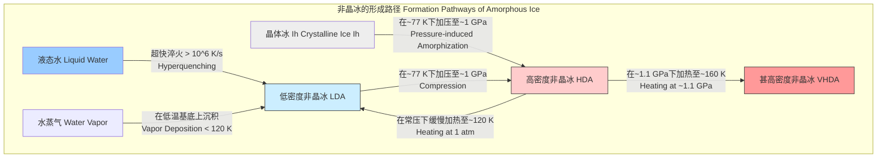

好的，我将根据您的要求，创建一份关于“非晶冰”的综合性技术文档。文档将严格遵循科学和数学的严谨性，所有内容将以简体中文呈现。

## 非晶冰

非晶冰（Amorphous ice）是水的一种固态形式，其分子排列缺乏晶体冰所具有的长程有序结构。与通过有序排列形成晶格的晶体冰（如常见的冰Ih）不同，非晶冰中的水分子位置是随机的，类似于液态水，但在宏观上表现为固体。这种亚稳态的固态水在天体物理学、材料科学和生物物理学中具有重要意义。

### 核心概念与数学基础

非晶冰的核心特征在于其无序的原子结构。这种结构可以通过径向分布函数（Radial Distribution Function, RDF），$g(r)$，进行数学描述。$g(r)$描述了在一个给定分子周围，距离为 $r$ 的地方找到另一个分子的概率密度。

对于一个由 $N$ 个粒子组成的体积为 $V$ 的系统，其径向分布函数定义为：
$$ g(r) = \frac{V}{N^2} \left\langle \sum_{i=1}^{N} \sum_{j \neq i}^{N} \delta(\mathbf{r} - (\mathbf{r}_i - \mathbf{r}_j)) \right\rangle $$
其中：
*   $N$ 是系统中的分子总数。
*   $V$ 是系统的体积。
*   $\rho = N/V$ 是平均数密度。
*   $\mathbf{r}_i$ 和 $\mathbf{r}_j$ 分别是第 $i$ 个和第 $j$ 个分子的位置矢量。
*   $\delta(\cdot)$ 是狄拉克δ函数。
*   $\langle \cdot \rangle$ 表示系综平均。

对于晶体材料，$g(r)$ 表现为一系列尖锐的峰，对应于其晶格的特定原子间距。而对于非晶冰，$g(r)$ 则表现为几个宽化的峰，表明只存在短程有序（例如，维持了水分子的四面体氢键网络）而缺乏长程有序。

另一个关键概念是 **玻璃化转变（Glass Transition）**。非晶冰是一种玻璃态物质。当液态水被足够快地冷却以绕过结晶过程时，它会转变为玻璃态，其粘度急剧增加，分子动力学被“冻结”。这个转变发生的温度范围被称为玻璃化转变温度（$T_g$）。$T_g$ 不是一个精确的点，而是一个动力学转变，其数值依赖于冷却速率。

描述过冷液体粘度随温度变化的常用模型是Vogel-Fulcher-Tammann (VFT) 方程：
$$ \eta(T) = \eta_0 \exp\left(\frac{B}{T - T_0}\right) $$
其中：
*   $\eta(T)$ 是在温度 $T$ 下的粘度。
*   $\eta_0$ 和 $B$ 是材料相关的经验常数。
*   $T_0$ 是Vogel温度或理想玻璃化转变温度，此时粘度理论上发散。$T_g$ 通常比 $T_0$ 高约10-20 K。

### 关键技术规格

非晶冰存在多种不同的形态，主要根据其密度和制备方法进行区分。下表总结了最常见的三种非晶冰（低密度、高密度和甚高密度非晶冰）的关键物理参数。

| 参数 | 低密度非晶冰 (LDA) | 高密度非晶冰 (HDA) | 甚高密度非晶冰 (VHDA) | 单位 |
| :--- | :--- | :--- | :--- | :--- |
| **密度 (在77 K, 1 atm下)** | ~0.94 ± 0.02 | ~1.17 ± 0.02 | ~1.26 ± 0.02 | g/cm³ |
| **典型形成方法** | 气相沉积或HDA加热 | 压缩冰Ih或LDA | HDA在~1.1 GPa下加热 | - |
| **形成压力** | < 0.1 | 1.0 - 1.5 | ~1.1 | GPa |
| **形成温度** | < 120 | < 140 | ~160 | K |
| **玻璃化转变温度 ($T_g$)** | ~136 | ~117 | 不明确 | K |
| **结构特征** | 类似于过冷水的四面体网络 | 扭曲和塌陷的氢键网络 | 进一步致密化的网络 | - |
| **与液态水的关系** | 推测与过冷液态水连续 | 推测与高密度液态水连续 | - | - |

### 常见用例与性能指标

非晶冰在多个科学领域有重要应用，其性能可以通过具体指标来量化。

*   **冷冻电子显微镜 (Cryo-EM)**
    *   **应用**: 将生物大分子（如蛋白质、病毒）包裹在薄层非晶冰中，以在接近自然状态下进行高分辨率成像。非晶冰的玻璃态特性可以防止冰晶的形成，因为冰晶会破坏精细的生物结构。
    *   **性能指标**:
        *   **结构分辨率**: 达到原子级分辨率（< 3 Å）的能力。
        *   **样品保存**: 成功玻璃化的样品比例，避免了立方冰或六方冰的衍射斑点。
        *   **冰层厚度**: 理想的冰层厚度为 10-100 nm，以获得良好的信噪比。

*   **天体物理学**
    *   **应用**: 非晶冰是星际介质、彗星、柯伊伯带天体和冰卫星表面的主要成分。它在行星形成、恒星形成区域的化学演化中扮演关键角色。
    *   **性能指标**:
        *   **光谱匹配**: 通过将实验室制备的非晶冰的光谱（特别是红外波段的O-H伸缩振动峰，约3.1 μm）与天文观测到的光谱进行比对，来识别其存在和物理状态。
        *   **宇宙射线处理**: 模拟宇宙射线对非晶冰的辐照效应，其产物（如H₂, O₂, H₂O₂）的生成率与天体化学模型进行比较。

*   **药物制剂**
    *   **应用**: 利用非晶态赋形剂（有时包括非晶水）来稳定非晶药物，提高其溶解度和生物利用度。
    *   **性能指标**:
        *   **物理稳定性**: 在特定温度和湿度下，防止药物重结晶的储存时间（货架期）。
        *   **玻璃化转变温度 ($T_g$)**: 较高的 $T_g$ 通常意味着更好的储存稳定性。

### 实现考量与算法分析

非晶冰的“实现”主要指其制备过程。不同的制备方法对应不同的热力学路径和动力学条件。



在计算模拟（如分子动力学，MD）中研究非晶冰的形成和性质时，算法复杂性是一个重要考量：

*   **模拟算法**: 分子动力学模拟通过数值求解牛顿运动方程来追踪系统中每个原子的轨迹。
    $$ m_i \frac{d^2\mathbf{r}_i}{dt^2} = \mathbf{F}_i = -\nabla_i U(\mathbf{r}_1, \dots, \mathbf{r}_N) $$
*   **计算复杂度**:
    *   **直接计算 (全对势)**: 计算所有原子对之间的相互作用力。对于一个有 $N$ 个原子的系统，这需要计算 $O(N^2)$ 次相互作用。这对于大规模系统是不可行的。
    *   **截断半径法**: 只考虑一个截断半径 $r_c$ 内的相互作用，复杂度可以降低到 $O(N)$。但这种方法忽略了长程静电相互作用。
    *   **粒子-网格-Ewald (PME) 方法**: 一种处理长程静电相互作用的高效算法，将计算分为实空间部分和倒易空间部分。其复杂度通常为 $O(N \log N)$，是目前模拟水的标准方法。

### 性能特征与统计度量

非晶冰的物理性质表现出其无序和亚稳态的特征。

*   **结构**:
    *   **径向分布函数 ($g(r)$)**: LDA的 $g(r)$ 在 $r \approx 2.8$ Å 处有第一个尖锐峰，对应氢键的O-O距离。第二个峰在 $r \approx 4.5$ Å 处，对应四面体配位的次近邻距离。HDA的第二个峰则塌陷并移动到 $r \approx 3.5$ Å，表明氢键网络被严重扭曲，部分次近邻分子侵入到第一配位壳层。
    *   **结构因子 ($S(q)$)**: 作为 $g(r)$ 的傅里叶变换，可通过X射线或中子衍射实验测量。
        $$ S(q) = 1 + \rho \int_0^\infty [g(r) - 1] \frac{\sin(qr)}{qr} 4\pi r^2 dr $$
        其中 $q$ 是散射矢量的大小。非晶冰的 $S(q)$ 呈现出宽化的峰，而非晶体冰的布拉格尖峰。

*   **热力学**:
    *   **玻璃化转变**: LDA在常压下加热时，在 $T_g \approx 136$ K 发生玻璃化转变，转变为深度过冷的液体，随后迅速结晶为立方冰。这是一个动力学过程，测得的 $T_g$ 值通常在 130-140 K 范围内，标准差约为 ±5 K，具体取决于测量方法和热历史。
    *   **多相性 (Polyamorphism)**: 非晶冰存在多个密度不同的、可相互转换的亚稳态相（LDA, HDA, VHDA），这被称为多相性。LDA和HDA之间的转变被认为是一阶相变，类似于普通物质的液-气相变。

```mermaid
graph TD
    subgraph "不同物质形态的结构对比 Structural Comparison"
        A["理想气体 Ideal Gas<br>gr = 1"]
        B["液态/非晶固体 Liquid/Amorphous Solid<br>短程有序, 长程无序"]
        C["晶体 Crystal<br>短程和长程有序"]
    end

    subgraph "径向分布函数 gr 示意图"
        direction LR
        g_gasgr -- "完全无序" --> plot_gasConstant Line;
        g_liqgr -- "宽化的峰" --> plot_liqBroad Peaks;
        g_crysgr -- "尖锐的峰" --> plot_crysSharp Peaks;
    end

    A --> g_gas
    B --> g_liq
    C --> g_crys

    style A fill:#fff8dc
    style B fill:#e0ffff
    style C fill:#e6e6fa
```

### 相关技术与比较模型

非晶冰的研究离不开与其他水相的比较。

*   **晶体冰 (Crystalline Ice)**
    *   **对比**: 晶体冰（如常压下的六方冰Ih）具有周期性的晶格结构。这种长程有序性可以通过布拉格衍射定律进行验证。
    *   **数学模型 (布拉格定律)**:
        $$ n\lambda = 2d \sin\theta $$
        其中：
        *   $n$ 是一个正整数（衍射级数）。
        *   $\lambda$ 是入射波（如X射线）的波长。
        *   $d$ 是晶格中的晶面间距。
        *   $\theta$ 是衍射角。
    *   非晶冰不满足布拉格条件，因此产生的是弥散的散射图样。

*   **液态水 (Liquid Water)**
    *   **对比**: 非晶冰常被视为液态水的“冻结快照”。它们都缺乏长程有序，但关键区别在于动力学。在液态水中，水分子可以扩散和旋转，而在非晶冰中，分子被固定在无序的位置上，只能进行振动。
    *   **模型**: “两种液体”假说推测，在过冷区域，水可能存在两种不同的液相：低密度液体（LDL）和高密度液体（HDL）。LDA和HDA被认为是这两种液相的玻璃态对应物。这一假说仍在积极研究中。

*   **笼形水合物 (Clathrate Hydrates)**
    *   **对比**: 这是另一类晶体水结构，其中水分子形成笼状网络，包裹着客体分子（如甲烷）。虽然它们是晶体，但其主客体结构和氢键网络的多样性为理解水的成键行为提供了有价值的参考。

### 参考文献

*   Mishima, O., Calvert, L. D., & Whalley, E. (1984). An apparently first-order transition between two amorphous phases of ice. *Nature*, 310(5976), 393–395. DOI: [10.1038/310393a0](https://doi.org/10.1038/310393a0)
*   Debenedetti, P. G. (2003). Supercooled and glassy water. *Journal of Physics: Condensed Matter*, 15(45), R1669–R1726. DOI: [10.1088/0953-8984/15/45/R01](https://doi.org/10.1088/0953-8984/15/45/R01)
*   Loerting, T., & Giovambattista, N. (2006). Amorphous ices: a journey into the bulk. *Journal of Physics: Condensed Matter*, 18(50), R919–R977. DOI: [10.1088/0953-8984/18/50/R01](https://doi.org/10.1088/0953-8984/18/50/R01)
*   Dubochet, J., Adrian, M., Chang, J. J., Homo, J. C., Lepault, J., McDowall, A. W., & Schultz, P. (1988). Cryo-electron microscopy of vitrified specimens. *Quarterly Reviews of Biophysics*, 21(2), 129–228. DOI: [10.1017/s0033583500004297](https://doi.org/10.1017/s0033583500004297)