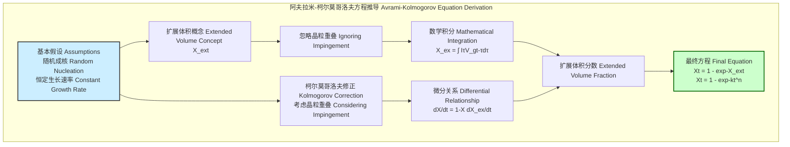
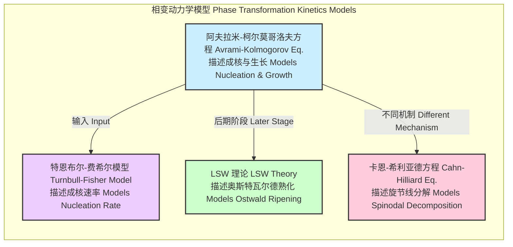

## 阿夫拉米-柯尔莫哥洛夫方程 (Avrami Kolmogorov equation)

阿夫拉米-柯尔莫哥洛夫方程，通常称为阿夫拉米方程或JMAK方程（约翰逊-梅尔-阿夫拉米-柯尔莫哥洛夫），是一个用于描述固态相变动力学的数学模型。它量化了在恒温条件下，新相的体积分数随时间演变的规律。该模型广泛应用于材料科学、物理化学和冶金学等领域，用以分析结晶、再结晶以及其他由成核和生长控制的相变过程。

### 核心概念与数学基础

该方程的核心思想是，相变过程由两个基本步骤驱动：新相晶核的形成（成核）和这些晶核的持续长大（生长）。方程的推导基于以下关键假设：

*   **随机成核**：新相的晶核在未转变的母相中随机、均匀地形成。
*   **恒定生长速率**：一旦形成，晶核以恒定的速率向各个方向生长，直到它们相互碰撞。
*   **恒温条件**：整个相变过程在恒定的温度下进行，这意味着成核速率和生长速率不随时间变化。

#### 方程推导

方程的推导巧妙地处理了生长中晶粒之间的“撞击”（Impingement）问题。

1.  **扩展体积 (Extended Volume)**
    首先，我们引入一个理想化的概念——“扩展体积分数” $X_{ex}(t)$。它表示在时间 $t$ 时，所有晶粒的总体积，但**忽略**它们之间的任何重叠或撞击。如果成核速率为 $I(t)$（单位时间单位体积内形成的新核数），单个晶核在时间 $t-\tau$ 内生长的体积为 $V_g(t-\tau)$（其中 $\tau$ 是成核时间），则扩展体积分数可以表示为：
    $$ X_{ex}(t) = \int_0^t I(\tau) V_g(t-\tau) d\tau $$
    其中：
    *   $I(\tau)$ 是在时间 $\tau$ 的成核速率。
    *   $V_g(t-\tau)$ 是一个在时间 $\tau$ 形成，并在时间 $t$ 长大后的晶粒的体积。

2.  **柯尔莫哥洛夫修正 (Kolmogorov Correction)**
    安德雷·柯尔莫哥洛夫提出，在任意一个微小时间增量 $dt$ 内，真实转变体积分数的增加量 $dX$ 与扩展体积分数的增加量 $dX_{ex}$ 成正比，比例因子是尚未转变的体积分数 $(1-X)$。这是因为新的转变只能发生在尚未转变的区域。
    $$ dX = (1 - X) dX_{ex} $$
    对上式进行积分：
    $$ \int_0^X \frac{d\xi}{1-\xi} = \int_0^t \frac{dX_{ex}}{d\tau} d\tau = X_{ex}(t) $$
    求解积分得到：
    $$ -\ln(1 - X(t)) = X_{ex}(t) $$
    整理后，我们得到真实体积分数 $X(t)$ 与扩展体积分数 $X_{ex}(t)$ 之间的关系：
    $$ X(t) = 1 - \exp(-X_{ex}(t)) $$

3.  **最终形式**
    通过对不同成核和生长机制下的 $X_{ex}(t)$ 进行具体计算，可以发现 $X_{ex}(t)$ 通常可以表示为 $kt^n$ 的形式。代入上式，便得到经典的阿夫拉米-柯尔莫哥洛夫方程：
    $$ X(t) = 1 - \exp(-kt^n) $$
    其中：
    *   $X(t)$：在时间 $t$ 时，已发生相变的体积分数（无量纲，范围从0到1）。
    *   $t$：时间。
    *   $n$：阿夫拉米指数（Avrami exponent），一个无量纲常数，其值取决于成核机制和生长维度。
    *   $k$：速率常数，包含了成核速率和生长速率的信息，其单位是 (时间)$^{-n}$。

#### 推导逻辑图

### 关键技术参数

阿夫拉米方程中的两个核心参数是 $n$ 和 $k$。$n$ 的值提供了关于相变机制的深刻见解。

| 参数 (Parameter) | 符号 (Symbol) | 描述 (Description) | 典型值/单位 (Typical Values/Units) |
| :--- | :---: | :--- | :--- |
| 阿夫拉米指数 (Avrami Exponent) | $n$ | 无量纲常数，反映了成核机制和生长维度。其值是成核时间指数和生长维度指数之和。 | 1 到 4 之间，理论上可以更高。无量纲。 |
| 速率常数 (Rate Constant) | $k$ | 依赖于温度的速率常数，综合了成核速率和生长速率的影响。 | 取决于具体材料和温度。单位为 s$^{-n}$ 或 min$^{-n}$。 |
| 转变体积分数 (Transformed Fraction) | $X(t)$ | 在时间 $t$ 时，新相所占的体积分数。 | 0 到 1。无量纲。 |

**阿夫拉米指数 $n$ 的物理意义**

$n$ 的值可以分解为 $n = a + b d$，其中：
*   $a$: 成核指数。对于瞬时成核（所有晶核在 $t=0$ 时刻同时形成），$a=0$；对于连续成核（成核速率恒定），$a=1$。
*   $b$: 生长机制指数。对于界面控制生长，$b=1$；对于扩散控制生长，$b=0.5$。
*   $d$: 生长维度 (1, 2, 或 3)。

| 成核机制 (Nucleation Mechanism) | 生长维度 (Growth Dim.) | 生长控制 (Growth Control) | 阿夫拉米指数 $n$ (Avrami Exponent) |
| :--- | :---: | :--- | :---: |
| 瞬时 (Athermal/Instantaneous) | 3D | 界面控制 (Interface-controlled) | 3 |
| 瞬时 (Athermal/Instantaneous) | 3D | 扩散控制 (Diffusion-controlled) | 1.5 |
| 连续 (Thermal/Continuous) | 3D | 界面控制 (Interface-controlled) | 4 |
| 连续 (Thermal/Continuous) | 3D | 扩散控制 (Diffusion-controlled) | 2.5 |
| 瞬时 (Athermal/Instantaneous) | 2D | 界面控制 (Interface-controlled) | 2 |
| 连续 (Thermal/Continuous) | 2D | 界面控制 (Interface-controlled) | 3 |

### 常见用例与性能指标

阿夫拉米方程被广泛用于分析和预测材料的相变行为。

*   **高分子结晶**：研究聚合物（如聚丙烯PP、聚乙烯PE）从熔融态冷却时的结晶动力学。
    *   **性能指标示例**：在140°C下等温结晶的等规聚丙烯(iPP)，实验数据拟合得到的阿夫拉米指数 $n$ 通常在 2.8-3.2 之间，表明其为二维或三维生长机制。半结晶时间 $t_{0.5}$（即 $X(t)=0.5$ 时的时间）是衡量结晶速率的关键指标，可通过 $t_{0.5} = (\frac{\ln 2}{k})^{1/n}$ 计算。
*   **金属与合金的再结晶**：分析冷加工后的金属在退火过程中发生再结晶的动力学。
    *   **性能指标示例**：对于冷轧70%的纯铜，在350°C下退火，其再结晶过程的 $n$ 值约为 2，表明可能存在沿晶界或位错线的二维生长。
*   **固态化学反应**：研究粉末或固体的化学反应动力学，例如脱水反应或固相合成。
*   **玻璃陶瓷的析晶**：控制玻璃基体中晶相的析出，以获得具有特定性能的玻璃陶瓷材料。

### 实现考量与算法分析

在实践中，通过实验（如差示扫描量热法DSC、X射线衍射XRD、膨胀计法）测量不同时间点的转变分数 $X(t)$，然后将数据与阿夫拉米方程进行拟合，以确定参数 $n$ 和 $k$。

#### 数据拟合算法

最常用的方法是对阿夫拉米方程进行线性化处理。
$$ X(t) = 1 - \exp(-kt^n) $$
两边取对数：
$$ \ln(1 - X(t)) = -kt^n $$
再次取对数：
$$ \ln(-\ln(1 - X(t))) = \ln(k) + n \ln(t) $$
这个方程是 $Y = C + mX'$ 的线性形式，其中：
*   $Y = \ln(-\ln(1 - X(t)))$
*   $X' = \ln(t)$
*   斜率 (slope) $m = n$
*   截距 (intercept) $C = \ln(k)$

**算法步骤**：
1.  收集实验数据对 $(t_i, X_i)$。
2.  对每组数据点，计算变换后的坐标 $(\ln(t_i), \ln(-\ln(1 - X_i)))$。
3.  使用最小二乘法对变换后的数据点进行线性回归，得到斜率 $n$ 和截距 $\ln(k)$。
4.  从截距计算速率常数 $k = \exp(C)$。

**算法复杂度**：
对于 $N$ 个数据点，计算变换坐标的复杂度为 $O(N)$。标准线性回归（最小二乘法）的计算复杂度也为 $O(N)$。因此，整个拟合过程的**算法复杂度为 $O(N)$**，计算效率非常高。

### 性能特征与统计度量

阿夫拉米模型的有效性通常局限于相变的特定阶段。

*   **有效范围**：该模型在转变分数 $X(t)$ 处于约 0.01 到 0.60 (1% 到 60%) 的范围内最为准确。在相变初期（$X \to 0$），随机性占主导，模型吻合良好。在相变后期（$X \to 1$），晶粒的软撞击（soft impingement，即生长速率因扩散场重叠而减慢）和二次现象（如奥斯特瓦尔德熟化）会导致模型偏离。
*   **拟合优度**：使用**决定系数 (Coefficient of Determination, $R^2$)** 来评估线性拟合的质量。一个接近1的 $R^2$ 值（例如 $R^2 > 0.99$）表明阿夫拉米图（$\ln(-\ln(1-X))$ vs $\ln(t)$）具有良好的线性关系。
*   **参数不确定性**：通过线性回归分析，可以获得参数 $n$ 和 $k$ 的**标准误差 (Standard Error)** 和**置信区间 (Confidence Interval)**。例如，报告结果时应写为 $n = 3.1 \pm 0.1$ (95% CI)，这为参数的可靠性提供了统计度量。

### 相关技术与模型比较

阿夫拉米-柯尔莫哥洛夫模型是描述相变动力学的众多模型之一，适用于成核-生长机制。其他模型描述了不同的物理过程。

| 模型 (Model) | 核心机制 (Core Mechanism) | 控制方程 (Governing Equation) | 适用领域 (Application Domain) |
| :--- | :--- | :--- | :--- |
| **阿夫拉米-柯尔莫哥洛夫** | 成核与生长 (Nucleation & Growth) | $X(t)=1-\exp(-kt^n)$ | 结晶、再结晶 (Crystallization, Recrystallization) |
| **卡恩-希利亚德 (Cahn-Hilliard)** | 旋节线分解 (Spinodal Decomposition) | $\frac{\partial c}{\partial t} = M \nabla^2 (\mu_0 - \kappa \nabla^2 c)$ | 合金相分离、聚合物共混物 (Alloy phase separation, Polymer blends) |
| **特恩布尔-费希尔 (Turnbull-Fisher)** | 经典成核理论 (Classical Nucleation Theory) | $I = I_0 \exp(-\frac{\Delta G^* + Q_d}{k_B T})$ | 计算成核速率 (Calculating nucleation rate) |
| **LSW 理论 (Lifshitz-Slyozov-Wagner)** | 奥斯特瓦尔德熟化 (Ostwald Ripening) | $\bar{r}^3(t) - \bar{r}^3(0) = K t$ | 晶粒粗化、析出物长大 (Grain coarsening, Precipitate growth) |

#### 相变动力学模型关系图

### 参考文献

1.  Kolmogorov, A. N. (1937). On the Statistical Theory of the Crystallization of Metals. *Bulletin of the Academy of Sciences of the USSR, Mathematics Series*, 1(3), 355–359.
2.  Johnson, W. A., & Mehl, R. F. (1939). Reaction kinetics in processes of nucleation and growth. *Transactions of the American Institute of Mining and Metallurgical Engineers*, 135, 416–458.
3.  Avrami, M. (1939). Kinetics of phase change. I General theory. *The Journal of Chemical Physics*, 7(12), 1103–1112. DOI: [10.1063/1.1750380](https://doi.org/10.1063/1.1750380)
4.  Avrami, M. (1940). Kinetics of phase change. II Transformation-time relations for random distribution of nuclei. *The Journal of Chemical Physics*, 8(2), 212–224. DOI: [10.1063/1.1750631](https://doi.org/10.1063/1.1750631)
5.  Avrami, M. (1941). Granulation, phase change, and microstructure: Kinetics of phase change. III. *The Journal of Chemical Physics*, 9(2), 177–184. DOI: [10.1063/1.1750872](https://doi.org/10.1063/1.1750872)