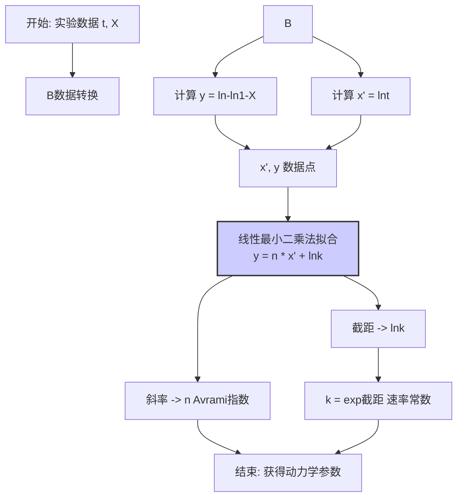
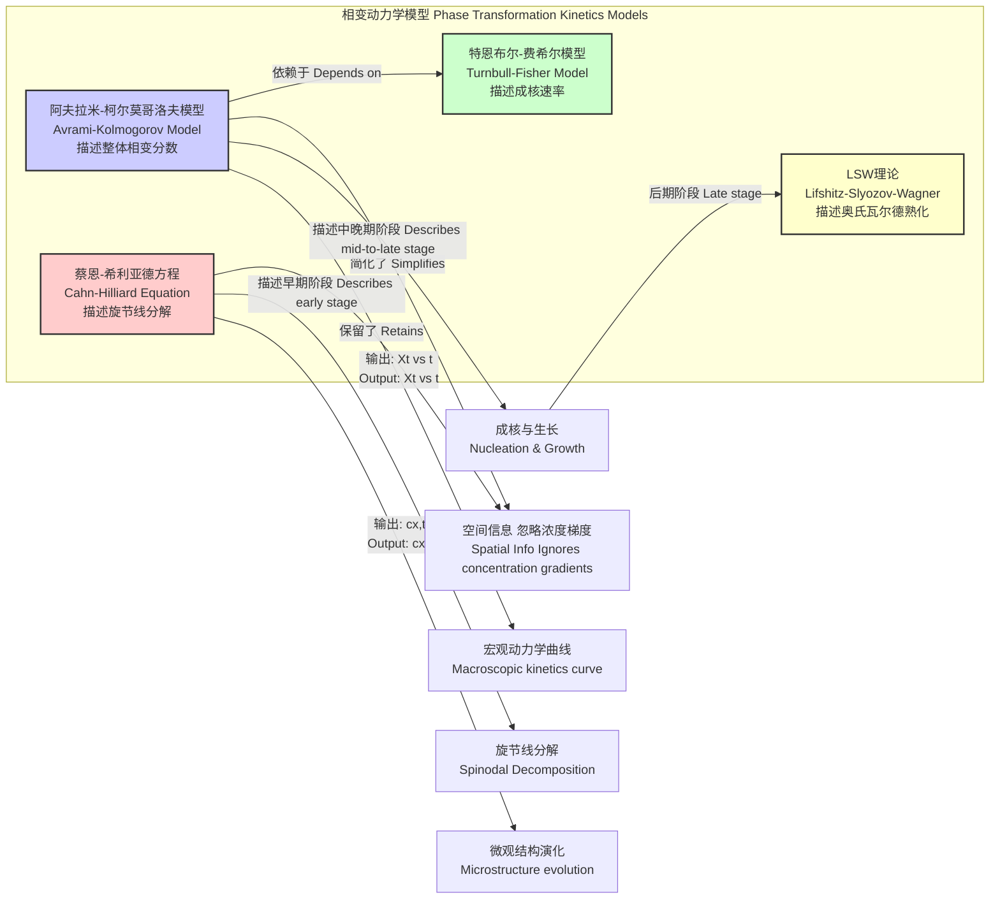

## 阿夫拉米-柯尔莫哥洛夫动力学 (Avrami Kolmogorov kinetics)

阿夫拉米-柯尔莫哥洛夫动力学（通常称为阿夫拉米方程或JMAK理论）是一个用于描述和分析固态相变过程动力学的数学模型。该模型由安德雷·柯尔莫哥洛夫、W. A. Johnson、R. F. Mehl和Melvin Avrami在1937年至1941年间独立提出。它广泛应用于材料科学、化学和物理学领域，用以研究结晶、再结晶、某些化学反应以及其他由成核和生长过程驱动的相变现象。

### 核心概念与数学基础

该理论的核心思想是，相变过程的总体速率由两个基本过程决定：**成核**（新相的微小区域或晶核的形成）和**生长**（这些晶核尺寸的增大）。模型通过一个关键假设来简化复杂的物理过程：晶核随机分布在未转变的母相中，并以恒定的速率生长，直到它们相互**撞击**（impingement）。

#### 扩展体积 (Extended Volume)

模型推导的起点是“扩展体积” ($V_E$) 的概念。扩展体积是指如果新相的生长区域可以自由重叠和穿透，它们在时间 $t$ 时所占据的虚拟总体积。这是一个纯粹的数学构造，因为它忽略了实际物理系统中发生的撞击效应。

#### 从扩展体积到真实体积分数

真实转变的体积分数 $X(t)$ 与扩展体积 $V_E(t)$ 之间的关系是该理论的关键。柯尔莫哥洛夫运用泊松分布的逻辑推导出，在未转变体积中发生真实转变的概率与扩展体积的增量成正比。一个未转变的微元体积 $dV$ 发生转变的概率为 $dV_E / V_0$，其中 $V_0$ 是系统总体积。因此，真实转变体积的增量 $dV$ 可以表示为：

$$ dV = (V_0 - V) \frac{dV_E}{V_0} $$

其中 $V$ 是在时间 $t$ 已转变的真实体积。定义体积分数 $X(t) = V/V_0$，上式可重写为：

$$ dX = (1 - X) d(V_E/V_0) $$

对上式进行积分，从 $t=0$（此时 $X=0, V_E=0$）到任意时间 $t$，得到：

$$ \int_0^X \frac{dX'}{1-X'} = \int_0^{V_E/V_0} d(V_E'/V_0) $$

求解此积分得到：

$$ -\ln(1 - X(t)) = \frac{V_E(t)}{V_0} $$

最终得到描述真实体积分数 $X(t)$ 的核心方程：

$$ X(t) = 1 - \exp\left(-\frac{V_E(t)}{V_0}\right) $$

#### 阿夫拉米方程的最终形式

扩展体积 $V_E(t)$ 的具体形式取决于成核和生长的机理。通常，它可以表示为时间的幂函数 $V_E(t) \propto t^n$。将此关系代入，并将比例常数合并为一个速率常数 $k$，得到最终的**阿夫拉米方程**:

$$ X(t) = 1 - \exp(-kt^n) $$

其中：
*   $X(t)$: 在时间 $t$ 时已转变的体积分数（无量纲，范围从0到1）。
*   $k$: 速率常数，包含了成核和生长速率的贡献。其单位是 $(\text{时间})^{-n}$。
*   $t$: 时间。
*   $n$: 阿夫拉米指数，一个无量纲参数，反映了成核机理和生长维度。

### 关键技术参数

阿夫拉米模型的核心参数是速率常数 $k$ 和阿夫拉米指数 $n$。通过实验数据拟合这些参数，可以揭示相变的潜在物理机制。

| 参数 (Parameter) | 符号 (Symbol) | 描述 (Description) | 典型值/单位 (Typical Values/Units) |
| :--- | :--- | :--- | :--- |
| 阿夫拉米指数 | $n$ | 无量纲指数，反映成核机制和生长维度。通常 $n = a + bd$，其中 $a$ 是成核指数， $b$ 是生长机制因子（通常为1），$d$ 是生长维度。 | 1 到 4 之间，但可能出现非整数值，表示复杂的或扩散控制的过程。 |
| 速率常数 | $k$ | 综合速率参数，取决于温度、成核速率、生长速率和几何形状。它与相变半衰期 $t_{0.5}$ 相关：$k = \ln(2) / (t_{0.5})^n$。 | 取决于具体材料和条件，单位为 $s^{-n}$ 或 $min^{-n}$。 |
| 成核指数 | $a$ | 描述成核随时间的变化。 | 0：瞬时成核（所有晶核在t=0时形成）；1：连续或恒定速率成核。 |
| 生长维度 | $d$ | 新相生长的有效维度。 | 1：针状/纤维状生长；2：盘状/薄膜状生长；3：球状/等轴生长。 |

**阿夫拉米指数 $n$ 的物理意义示例:**

| 成核机制 (Nucleation Mechanism) | 生长维度 (Growth Dimension, d) | 阿夫拉米指数 (Avrami Exponent, n) | 物理过程示例 (Example Physical Process) |
| :--- | :--- | :--- | :--- |
| 瞬时 (Site Saturation) | 3D | 3 | 金属材料的再结晶，许多晶粒同时开始生长 |
| 瞬时 (Site Saturation) | 2D | 2 | 表面薄膜的二维晶体生长 |
| 瞬时 (Site Saturation) | 1D | 1 | 沿晶界或位错线的一维生长 |
| 连续 (Constant Rate) | 3D | 4 | 聚合物熔体的球晶生长 |
| 连续 (Constant Rate) | 2D | 3 | 气相沉积中岛状膜的连续成核与生长 |
| 连续 (Constant Rate) | 1D | 2 | 沿新形成缺陷的连续成核与一维生长 |
| 扩散控制生长 | 3D | 1.5 或 2.5 | 合金中由长程扩散控制的析出相生长 |

### 常见应用案例

| 应用领域 (Use Case) | 描述 (Description) | 定量性能指标示例 (Example Quantitative Metric) |
| :--- | :--- | :--- |
| 聚合物结晶 (Polymer Crystallization) | 研究聚合物从熔融态或玻璃态转变为半晶态的动力学。通常使用差示扫描量热法（DSC）测量。 | 对于等温结晶的聚对苯二甲酸乙二醇酯（PET）在210°C下，典型的 $n$ 值约为3.1 ± 0.2，半结晶时间 $t_{0.5}$ 约为 5.5 分钟。 |
| 金属再结晶 (Metallurgical Recrystallization) | 分析形变金属在退火过程中，无应变的新晶粒取代形变晶粒的动力学。 | 对于冷轧70%的纯铜在350°C下退火，测得的 $n$ 值接近3，表明为瞬时成核和三维生长。 |
| 固态化学反应 (Solid-State Reactions) | 模拟粉末混合物中发生的相变或分解反应，例如脱水反应。 | CaC₂O₄·H₂O 的热分解，第一步脱水过程在氮气气氛下，Avrami指数 $n$ ≈ 1.8，活化能约为 90 kJ/mol。 |
| 玻璃陶瓷 (Glass-Ceramics) | 控制非晶玻璃通过热处理转变为晶相的过程，以获得具有特定性能的材料。 | 在锂硅酸盐玻璃中，通过两步热处理（成核和生长），可以精确控制晶相分数，其动力学曲线在 $X < 0.6$ 的范围内能很好地被 $n=3$ 的Avrami模型描述。 |

### 实现考量

在实践中，通过实验测量不同时间 $t_i$ 对应的相变分数 $X_i$（例如，通过DSC、X射线衍射或金相学方法）。为了从数据中提取参数 $n$ 和 $k$，通常采用线性化方法。

对方程 $X(t) = 1 - \exp(-kt^n)$ 进行变换：
1.  $1 - X(t) = \exp(-kt^n)$
2.  $\ln(1 - X(t)) = -kt^n$
3.  $\ln(-\ln(1 - X(t))) = \ln(k) + n \ln(t)$

这个方程是 $Y = C + mX'$ 的线性形式，其中：
*   $Y = \ln(-\ln(1 - X(t)))$
*   $X' = \ln(t)$
*   斜率 $m = n$ (阿夫拉米指数)
*   截距 $C = \ln(k)$

#### 算法流程与复杂度

1.  **数据采集**: 获取一系列数据点 $(t_i, X_i)$。
2.  **数据转换**: 对每个数据点，计算 $y_i = \ln(-\ln(1 - X_i))$ 和 $x'_i = \ln(t_i)$。
3.  **线性回归**: 对转换后的数据 $(x'_i, y_i)$ 执行标准线性最小二乘法拟合。
    *   **算法复杂度**: 对于 $N$ 个数据点，计算斜率和截距的复杂度为 $O(N)$。这是非常高效的。
4.  **参数提取**:
    *   拟合得到的斜率即为阿夫拉米指数 $n$。
    *   从截距 $C$ 计算速率常数 $k = \exp(C)$。

### 性能特征

*   **适用范围**: 阿夫拉米模型最适用于描述相变过程的初期到中期阶段（通常 $0.1 < X < 0.6$）。在相变后期，由于生长速率可能因扩散限制或晶粒熟化而减慢，模型可能会出现偏差。
*   **统计度量**:
    *   **决定系数 ($R^2$)**: 在对数-对数图上进行线性拟合后， $R^2$ 值通常用于评估拟合优度。一个接近1.0的值（例如，$R^2 > 0.99$）表明实验数据与模型高度一致。
    *   **置信区间**: 对拟合参数 $n$ 和 $k$ 计算置信区间（例如95% CI）是至关重要的，这可以量化参数的不确定性。例如，报告 $n = 3.2 \pm 0.1$ 比仅报告 $n=3.2$ 更具科学严谨性。
*   **局限性**:
    *   假设恒定的成核和生长速率，这在非等温过程或扩散受限的系统中可能不成立。
    *   它是一个宏观模型，不提供关于晶体尺寸分布或空间排列的微观结构信息。
    *   阿夫拉米指数 $n$ 可能不是唯一的，例如 $n=3$ 可以表示瞬时成核的3D生长，也可以表示连续成核的2D生长。需要结合其他实验技术（如显微镜）来 disambiguate。

### 相关技术与模型比较

阿夫拉米动力学是描述相变现象的众多模型之一。它与其他模型在适用范围和物理基础上有所不同。

*   **与Cahn-Hilliard方程的比较**: Cahn-Hilliard是一个描述非均匀体系（如旋节线分解）相分离的偏微分方程。与Avrami模型不同，它是一个场论模型，可以预测相分离过程中的微观结构形态演化，但计算上更为复杂。
*   **与Turnbull-Fisher模型的联系**: Turnbull-Fisher模型专门用于计算经典成核理论中的成核速率。这个速率可以作为输入参数，用于更复杂的Avrami模型或计算机模拟中，从而将宏观动力学与原子尺度的物理过程联系起来。
*   **与LSW理论的比较**: LSW理论描述了相变过程的最后阶段——熟化（ripening）或粗化（coarsening），此时小颗粒溶解，大颗粒进一步长大，以降低总界面能。Avrami模型不包含这一阶段。

### 参考文献

1.  Kolmogorov, A. N. (1937). On the Statistical Theory of the Crystallization of Metals. *Izvestiya Akademii Nauk SSSR, Seriya Matematicheskaya*, 1(3), 355-359.
2.  Johnson, W. A., & Mehl, R. F. (1939). Reaction kinetics in processes of nucleation and growth. *Transactions of the American Institute of Mining and Metallurgical Engineers*, 135, 416-458.
3.  Avrami, M. (1939). Kinetics of Phase Change. I General Theory. *The Journal of Chemical Physics*, 7(12), 1103-1112. DOI: [10.1063/1.1750380](https://doi.org/10.1063/1.1750380)
4.  Avrami, M. (1940). Kinetics of Phase Change. II Transformation-Time Relations for Random Distribution of Nuclei. *The Journal of Chemical Physics*, 8(2), 212-224. DOI: [10.1063/1.1750631](https://doi.org/10.1063/1.1750631)
5.  Avrami, M. (1941). Granulation, Phase Change, and Microstructure: Kinetics of Phase Change. III. *The Journal of Chemical Physics*, 9(2), 177-184. DOI: [10.1063/1.1750872](https://doi.org/10.1063/1.1750872)