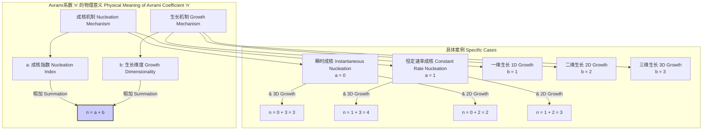
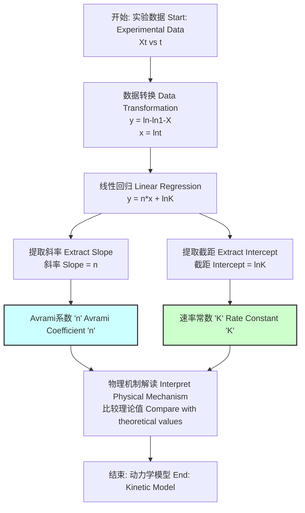
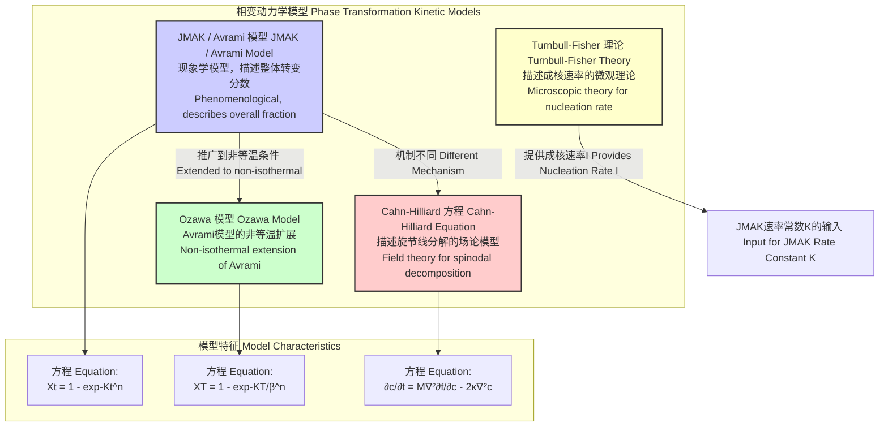

## Avrami系数

Avrami系数，通常表示为 $n$，是材料科学和物理化学中描述相变动力学的核心参数。它源于Avrami方程（或称JMAK理论，代表Johnson-Mehl-Avrami-Kolmogorov），该方程量化了在等温条件下，新相的体积分数随时间演变的过程。Avrami系数本身并非一个简单的拟合常数，而是蕴含了关于相变过程中成核与生长机制的深刻物理信息。

### 核心概念与数学基础

Avrami方程是描述固态相变动力学最经典的模型之一，尤其适用于结晶、再结晶和某些化学反应过程。其基本形式为：

$$
X(t) = 1 - \exp(-Kt^n)
$$

其中：
*   $X(t)$ 是在时间 $t$ 时已完成相变的体积分数（一个无量纲量，范围从0到1）。
*   $t$ 是时间。
*   $K$ 是一个综合速率常数，其单位是 时间$^{-n}$。它取决于成核速率和晶体生长速率。
*   $n$ 是 **Avrami系数**，一个无量纲的指数，其数值反映了相变的机制。

**Avrami系数 $n$ 的物理意义**

Avrami系数 $n$ 可以分解为两个部分的贡献，即成核机制和生长维度：

$$
n = a + b
$$

*   **$a$：成核指数**
    *   $a = 0$：对应**瞬时成核**（或称异质成核），即所有晶核在相变开始时（$t=0$）就已全部形成。
    *   $a = 1$：对应**恒定速率成核**（或称均匀成核），即晶核在整个相变过程中以恒定的速率持续形成。

*   **$b$：生长维度**
    *   $b = 1$：一维生长（例如，针状或纤维状晶体）。
    *   $b = 2$：二维生长（例如，盘状或薄片状晶体）。
    *   $b = 3$：三维生长（例如，球状晶体）。

通过实验测定 $n$ 的值，可以推断出相变过程的主导机制。例如，一个接近3的 $n$ 值可能意味着在预先存在的晶核上进行三维生长。

下面的Mermaid图展示了Avrami系数 $n$ 如何由成核和生长机制共同决定。

### 关键技术规格

Avrami系数的理论值与特定的物理过程直接相关。下表总结了不同成核和生长机制下的理想 $n$ 值。在实际应用中，实验值可能会因扩散限制、晶体撞击、非等温条件等因素而偏离这些整数值。

| 成核机制 (Nucleation Mechanism) | 生长维度 (Growth Dimension, b) | 速率控制步骤 (Rate-Controlling Step) | Avrami系数 (n = a + b) |
| :--- | :--- | :--- | :--- |
| 瞬时成核 (a=0) | 3D (球状) | 界面控制 (Interface-controlled) | 3 |
| 瞬时成核 (a=0) | 2D (盘状) | 界面控制 (Interface-controlled) | 2 |
| 瞬时成核 (a=0) | 1D (针状) | 界面控制 (Interface-controlled) | 1 |
| 恒定速率成核 (a=1) | 3D (球状) | 界面控制 (Interface-controlled) | 4 |
| 恒定速率成核 (a=1) | 2D (盘状) | 界面控制 (Interface-controlled) | 3 |
| 恒定速率成核 (a=1) | 1D (针状) | 界面控制 (Interface-controlled) | 2 |
| 瞬时成核 (a=0) | 3D (球状) | 扩散控制 (Diffusion-controlled) | 1.5 |
| 恒定速率成核 (a=1) | 3D (球状) | 扩散控制 (Diffusion-controlled) | 2.5 |

**注意**: Avrami系数 $n$ 是一个**无量纲**参数。

### 常见用例

Avrami系数广泛用于分析和预测各种材料的相变行为。

*   **高分子结晶**: 研究聚合物（如聚乙烯、聚丙烯）从熔融态或玻璃态的结晶动力学。例如，等温结晶的线性聚乙烯（LPE）通常表现出 $n \approx 3$，表明其为瞬时成核和三维球晶生长。
*   **金属与合金**: 分析金属的再结晶、沉淀和共晶/共析转变。例如，对冷加工后的铜进行退火再结晶，其Avrami系数通常在3到4之间，反映了复杂的成核和生长过程。
*   **非晶材料**: 研究金属玻璃或无定形半导体的结晶过程，这对于评估其热稳定性至关重要。例如，在Pd-Si基金属玻璃的等温退火中，测得的 $n$ 值约为4，表明结晶过程为恒定速率成核和三维生长。
*   **陶瓷与玻璃**: 分析玻璃陶瓷的形成动力学。
*   **食品科学**: 研究脂肪（如可可脂）的结晶，这直接影响巧克力的口感和外观。
*   **生物物理学**: 模拟细胞群的生长或生物矿化过程。

### 实现考量

在实践中，Avrami系数 $n$ 是通过对实验数据进行拟合来确定的。最常用的方法是对Avrami方程进行线性化处理。

对方程 $X(t) = 1 - \exp(-Kt^n)$ 进行变换：
1.  移项: $1 - X(t) = \exp(-Kt^n)$
2.  取自然对数: $\ln(1 - X(t)) = -Kt^n$
3.  再次移项并取自然对数: $\ln(-\ln(1 - X(t))) = \ln(K) + n \ln(t)$

这个方程是 $y = c + mx$ 形式的线性方程，其中：
*   $y = \ln(-\ln(1 - X(t)))$
*   $x = \ln(t)$
*   斜率 $m = n$ (Avrami系数)
*   截距 $c = \ln(K)$

**算法流程**:
1.  通过实验（如差示扫描量热法(DSC)、X射线衍射(XRD)、膨胀计法）测量不同时间 $t$ 对应的相变分数 $X(t)$。
2.  计算每个数据点的 $\ln(-\ln(1 - X))$ 和 $\ln(t)$。
3.  将 $\ln(-\ln(1 - X))$ 对 $\ln(t)$ 作图，即所谓的“Avrami图”。
4.  对这些点进行线性回归分析。
5.  回归直线的**斜率**即为实验测得的Avrami系数 $n$。

**算法复杂度**:
如果有个 $N$ 实验数据点，计算转换值需要 $O(N)$ 的时间。标准线性回归（最小二乘法）的计算复杂度也为 $O(N)$。因此，从数据中提取Avrami系数的整个过程非常高效，其总复杂度为 **$O(N)$**。

下面的Mermaid图清晰地展示了从实验数据确定Avrami系数的流程。

### 性能特征

Avrami模型拟合的质量和所得参数的可靠性需要通过统计指标来评估。

*   **决定系数 ($R^2$)**: 这是评估线性回归拟合优度的最常用指标。$R^2$ 的值介于0和1之间，越接近1，表明Avrami模型对实验数据的描述越好。在高质量的等温相变研究中，$R^2$ 值通常要求大于0.99。
*   **置信区间 (Confidence Interval)**: 对斜率（即 $n$）进行线性回归分析时，应计算其置信区间（例如，95% CI）。这提供了 $n$ 值不确定性的度量。例如，一个结果表示为 $n = 3.1 \pm 0.15$，意味着我们有95%的信心认为真实的 $n$ 值在2.95到3.25之间。这个区间对于判断实验值是否与某个理论整数值（如3）在统计上一致至关重要。
*   **残差分析**: 检查残差（观测值与拟合值之差）的分布。一个好的拟合，其残差应该随机分布在零线附近，没有明显的趋势或模式。

**局限性**:
*   Avrami图在相变的初始阶段（$X < 0.15$）和末期阶段（$X > 0.85$）常常会偏离线性。这可能是由于成核时间的非零、晶体撞击效应的复杂性或次级相变的发生。因此，通常只使用相变中间部分（约15%至85%）的数据进行线性拟合。
*   该模型假设空间中随机成核和各向同性生长，这在真实材料中可能不完全满足。

### 相关技术与比较模型

Avrami (JMAK) 理论是众多相变动力学模型中的一种。了解其与其他模型的关系有助于更全面地理解材料行为。

*   **Cahn-Hilliard方程**: 与Avrami模型描述的“成核-生长”机制不同，Cahn-Hilliard方程是一个偏微分方程，用于描述**旋节线分解**。这是一种不稳定的相分离机制，其中成分浓度发生连续的、波浪状的起伏，而没有明确的成核步骤。
*   **Ozawa模型**: 这是对Avrami方程的直接扩展，用于处理非等温过程（如在DSC中以恒定速率 $\beta$ 加热或冷却）。其形式为 $X(T) = 1 - \exp(-K(T)/\beta^n)$，其中 $K(T)$ 是与温度相关的冷却函数。这里的 $n$ 仍然是Avrami系数。
*   **Mo模型 (Mo Zhishen's method)**: 另一种流行的非等温动力学分析方法，它将加热/冷却速率 $\beta$ 与达到特定结晶度所需的时间 $t$ 关联起来，通常表示为 $\log \beta$ 与 $\log t$ 的线性关系。
*   **Turnbull-Fisher理论**: 这是一个微观模型，用于计算成核速率 $I$。这个速率是Avrami模型中宏观速率常数 $K$ 的一个基本组成部分。例如，对于三维生长和恒定速率成核，$K$ 与成核速率 $I$ 和生长速率 $v$ 的关系为 $K = (\pi/3) I v^3$。

### 参考文献

1.  Avrami, M. (1939). Kinetics of Phase Change. I General Theory. *The Journal of Chemical Physics*, 7(12), 1103–1112. [DOI: 10.1063/1.1750380](https://doi.org/10.1063/1.1750380)
2.  Avrami, M. (1940). Kinetics of Phase Change. II Transformation-Time Relations for Random Distribution of Nuclei. *The Journal of Chemical Physics*, 8(2), 212–224. [DOI: 10.1063/1.1750631](https://doi.org/10.1063/1.1750631)
3.  Avrami, M. (1941). Kinetics of Phase Change. III Granulation, Phase Change, and Microstructure. *The Journal of Chemical Physics*, 9(2), 177–184. [DOI: 10.1063/1.1750872](https://doi.org/10.1063/1.1750872)
4.  Christian, J. W. (2002). *The Theory of Transformations in Metals and Alloys* (3rd ed.). Pergamon Press. (This book provides a comprehensive theoretical background on phase transformations, including a detailed discussion of the JMAK theory).
5.  Khanna, Y. P., & Taylor, T. J. (1988). Comments on the use of the Avrami equation for the crystallization of polymers. *Polymer Engineering & Science*, 28(16), 1042–1044. [DOI: 10.1002/pen.760281605](https://doi.org/10.1002/pen.760281605)