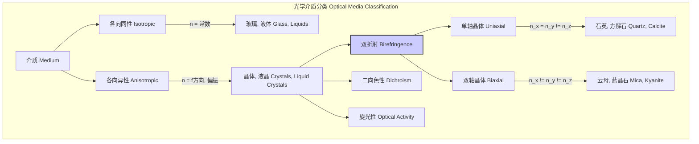
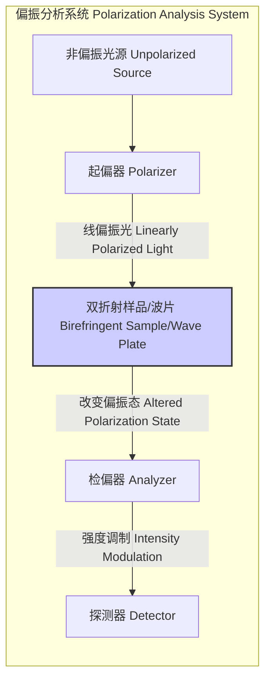
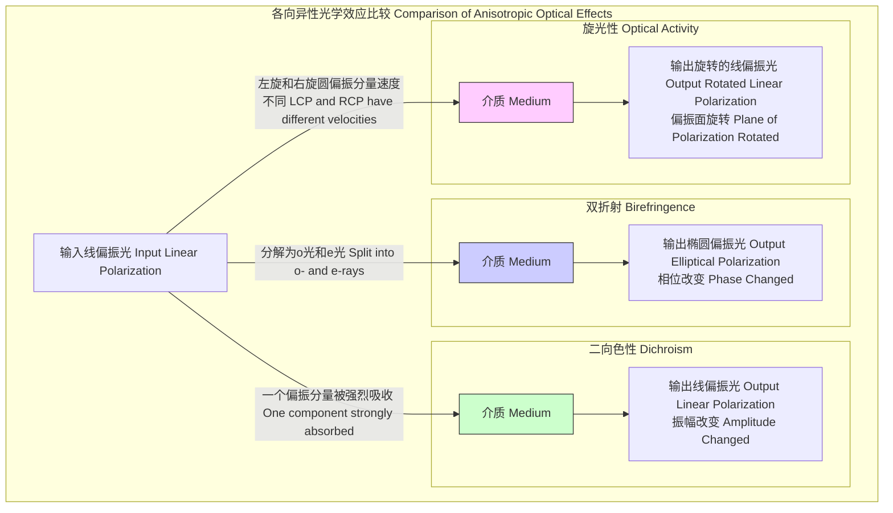

## 双折射 (Birefringence)

双折射是一种光学现象，指光线通过各向异性介质时，其折射率随光的偏振方向和传播方向而变化。这种现象导致一束入射光分解为两束具有不同偏振态和传播速度的光束。这种特性是许多光学器件（如波片、偏振器和调制器）的基础。

### 核心概念与数学基础

在光学上，材料可以分为各向同性（Isotropic）和各向异性（Anisotropic）。在各向同性介质中，光的传播速度与偏振方向无关。而在各向异性介质（如大多数晶体）中，原子或分子的排列具有方向性，导致介电常数不再是一个标量，而是一个二阶张量。

#### 麦克斯韦方程组与本构关系

在无源、非磁性、绝缘的各向异性介质中，光的传播由麦克斯韦方程组描述：
$$ \nabla \times \mathbf{E} = -\frac{\partial \mathbf{B}}{\partial t} $$
$$ \nabla \times \mathbf{H} = \frac{\partial \mathbf{D}}{\partial t} $$
$$ \nabla \cdot \mathbf{D} = 0 $$
$$ \nabla \cdot \mathbf{B} = 0 $$

其中：
*   $\mathbf{E}$ 是电场强度 (V/m)
*   $\mathbf{B}$ 是磁感应强度 (T)
*   $\mathbf{D}$ 是电位移矢量 (C/m²)
*   $\mathbf{H}$ 是磁场强度 (A/m)

关键在于本构关系。对于各向异性介质，电位移矢量 $\mathbf{D}$ 与电场强度 $\mathbf{E}$ 的关系由介电张量 $\boldsymbol{\epsilon}$ 定义：
$$ \mathbf{D} = \epsilon_0 \boldsymbol{\epsilon} \mathbf{E} $$
其中 $\epsilon_0$ 是真空介电常数，$\boldsymbol{\epsilon}$ 是一个对称的3x3实数张量，称为相对介电张量。在主轴坐标系中，该张量可以对角化：
$$
\boldsymbol{\epsilon} = 
\begin{pmatrix}
\epsilon_x & 0 & 0 \\
0 & \epsilon_y & 0 \\
0 & 0 & \epsilon_z
\end{pmatrix}
=
\begin{pmatrix}
n_x^2 & 0 & 0 \\
0 & n_y^2 & 0 \\
0 & 0 & n_z^2
\end{pmatrix}
$$
其中 $n_x, n_y, n_z$ 是沿三个主轴方向的折射率。

#### 波的传播与折射率椭球

对于沿波矢 $\mathbf{k}$ 方向传播的平面波 $\mathbf{E}(\mathbf{r}, t) = \mathbf{E}_0 e^{i(\mathbf{k} \cdot \mathbf{r} - \omega t)}$，从麦克斯韦方程组可以推导出波动方程：
$$ \mathbf{k} \times (\mathbf{k} \times \mathbf{E}_0) + \omega^2 \mu_0 \mathbf{D}_0 = 0 $$
结合本构关系，得到：
$$ -\mathbf{k}(\mathbf{k} \cdot \mathbf{E}_0) + k^2 \mathbf{E}_0 = \frac{\omega^2}{c^2} \boldsymbol{\epsilon} \mathbf{E}_0 $$
这是一个关于 $\mathbf{E}_0$ 的本征方程。对于给定的传播方向 $\mathbf{k}$，方程的解给出两个正交的偏振模式（本征矢），每个模式对应一个不同的传播速度，即不同的折射率 $n = \frac{ck}{\omega}$。

为了形象地描述折射率与方向的关系，引入**折射率椭球（Index Ellipsoid 或 Indicatrix）**的概念。其方程为：
$$ \frac{x^2}{n_x^2} + \frac{y^2}{n_y^2} + \frac{z^2}{n_z^2} = 1 $$
对于沿特定方向 $\mathbf{s} = \mathbf{k}/k$ 传播的光，其允许的两个偏振方向和对应的折射率可以通过以下几何方法确定：取一个过原点且垂直于 $\mathbf{s}$ 的平面，该平面与折射率椭球相交形成一个椭圆。此椭圆的两个半主轴的长度即为该传播方向上两个允许的线偏振波的折射率，而半主轴的方向就是对应的偏振方向。

*   **单轴晶体 (Uniaxial Crystals):** 当两个主折射率相等时（例如，$n_x = n_y = n_o$，$n_z = n_e$），折射率椭球是旋转椭球体。存在一个特殊方向，沿该方向传播的光不会发生双折射，这个方向称为**光轴 (Optical Axis)**。
    *   **寻常光 (Ordinary Ray, o-ray):** 其偏振方向垂直于由光轴和波矢构成的平面。它的折射率 $n_o$ 是一个常数，不随传播方向改变。
    *   **非寻常光 (Extraordinary Ray, e-ray):** 其偏振方向位于由光轴和波矢构成的平面内。它的折射率 $n_e(\theta)$ 随传播方向与光轴的夹角 $\theta$ 而变化。
    $$ \frac{1}{n_e^2(\theta)} = \frac{\cos^2\theta}{n_o^2} + \frac{\sin^2\theta}{n_e^2} $$
    其中 $\theta$ 是波矢 $\mathbf{k}$ 与光轴之间的夹角。

*   **双轴晶体 (Biaxial Crystals):** 三个主折射率互不相等 ($n_x \neq n_y \neq n_z$)。存在两个光轴。

### 关键技术规格

双折射的大小通常用寻常光折射率和非寻常光主折射率之差来量化：$\Delta n = |n_e - n_o|$。

| 材料 (Material) | 晶系 (Crystal System) | 类型 (Type) | $n_o$ | $n_e$ | 双折射率 $\Delta n$ | 波长 (Wavelength) |
| :--- | :--- | :--- | :--- | :--- | :--- | :--- |
| 方解石 (Calcite, $\text{CaCO}_3$) | 三角 (Trigonal) | 单轴负性 (Negative Uniaxial) | 1.658 | 1.486 | -0.172 | 589.3 nm |
| 石英 (Quartz, $\alpha$-$\text{SiO}_2$) | 三角 (Trigonal) | 单轴正性 (Positive Uniaxial) | 1.544 | 1.553 | +0.009 | 589.3 nm |
| 钒酸钇 ($\text{YVO}_4$) | 四方 (Tetragonal) | 单轴正性 (Positive Uniaxial) | 1.957 | 2.165 | +0.208 | 1064 nm |
| 蓝宝石 ($\text{Al}_2\text{O}_3$) | 三角 (Trigonal) | 单轴负性 (Negative Uniaxial) | 1.768 | 1.760 | -0.008 | 589.3 nm |
| 偏硼酸钡 (BBO, $\beta$-$\text{BaB}_2\text{O}_4$) | 三角 (Trigonal) | 单轴负性 (Negative Uniaxial) | 1.677 | 1.553 | -0.124 | 532 nm |
| 液晶 (Liquid Crystal, e.g., 5CB) | - | 单轴正性 (Positive Uniaxial) | ~1.53 | ~1.72 | ~+0.19 | 589.3 nm |

**注:** 正性单轴晶体 $n_e > n_o$；负性单轴晶体 $n_e < n_o$。

### 常见用例与性能指标

双折射是许多偏振光学元件的核心原理。

*   **波片 (Wave Plates / Retarders):**
    *   **功能:** 在两个正交偏振分量之间引入特定的相位延迟 $\Gamma$。波片通常由切割的双折射晶体制成，其光轴平行于表面。
    *   **数学原理:** 相位延迟由光程差决定。
      $$ \Gamma = \frac{2\pi \Delta L}{\lambda_0} = \frac{2\pi |n_e - n_o| d}{\lambda_0} $$
      其中 $\lambda_0$ 是真空波长，$d$ 是晶体厚度。
    *   **类型:**
        *   **半波片 (Half-Wave Plate, HWP):** $\Gamma = \pi$。用于旋转线偏振光的方向。
        *   **四分之一波片 (Quarter-Wave Plate, QWP):** $\Gamma = \pi/2$。用于将线偏振光转换为圆偏振光，或反之。
    *   **性能指标:**
        *   **相位延迟精度 (Retardation Accuracy):** 典型值为 $\lambda/300$ 至 $\lambda/1000$。
        *   **消光比 (Extinction Ratio):** 对于高质量波片，可达 >1000:1。

*   **偏振器 (Polarizers):**
    *   **功能:** 利用双折射将不同偏振态的光在空间上分离，从而产生一束高纯度的线偏振光。
    *   **实现:** 格兰-汤普逊棱镜 (Glan-Thompson Prism) 使用两块方解石晶体，通过全内反射将寻常光（o-ray）移除，只让非寻常光（e-ray）通过。
    *   **性能指标:**
        *   **消光比 (Extinction Ratio):** 衡量偏振器对非所需偏振态的抑制能力。典型值 > 100,000:1 (或 >50 dB)。
        *   **透过率 (Transmittance):** 所需偏振态的通过效率，典型值 >98%（带增透膜）。

### 实现考量 (建模)

**琼斯矩阵法 (Jones Calculus)** 是一种强大的数学工具，用于分析偏振光通过一系列光学元件后的状态变化。

*   **琼斯矢量 (Jones Vector):** 一个偏振态由一个2x1的复数矢量表示。
    $$ \mathbf{J} = \begin{pmatrix} E_x \\ E_y \end{pmatrix} = \begin{pmatrix} A_x e^{i\phi_x} \\ A_y e^{i\phi_y} \end{pmatrix} $$
*   **琼斯矩阵 (Jones Matrix):** 每个光学元件由一个2x2的复数矩阵表示。
*   **系统传输:** 输出偏振态 $\mathbf{J}_{out}$ 是输入态 $\mathbf{J}_{in}$ 与元件矩阵 $\mathbf{M}$ 的乘积：$\mathbf{J}_{out} = \mathbf{M} \mathbf{J}_{in}$。

对于一个快轴（折射率较小的轴）与x轴成 $\theta$ 角，相位延迟为 $\Gamma$ 的波片，其琼斯矩阵为：
$$ \mathbf{M}(\Gamma, \theta) = \mathbf{R}(-\theta) \begin{pmatrix} e^{-i\Gamma/2} & 0 \\ 0 & e^{i\Gamma/2} \end{pmatrix} \mathbf{R}(\theta) $$
其中 $\mathbf{R}(\theta)$ 是旋转矩阵:
$$ \mathbf{R}(\theta) = \begin{pmatrix} \cos\theta & \sin\theta \\ -\sin\theta & \cos\theta \end{pmatrix} $$
展开后得到：
$$ \mathbf{M}(\Gamma, \theta) = \begin{pmatrix} \cos^2\theta e^{-i\Gamma/2} + \sin^2\theta e^{i\Gamma/2} & \cos\theta\sin\theta (e^{-i\Gamma/2} - e^{i\Gamma/2}) \\ \cos\theta\sin\theta (e^{-i\Gamma/2} - e^{i\Gamma/2}) & \sin^2\theta e^{-i\Gamma/2} + \cos^2\theta e^{i\Gamma/2} \end{pmatrix} $$

*   **算法复杂度分析:**
    *   单个元件的计算是2x2矩阵与2x1矢量的乘法，需要4次复数乘法和2次复数加法，复杂度为 $O(1)$。
    *   对于一个由 $N$ 个元件组成的系统，总的琼斯矩阵是 $N$ 个矩阵的连乘 $\mathbf{M}_{total} = \mathbf{M}_N \cdots \mathbf{M}_2 \mathbf{M}_1$。计算总矩阵的复杂度为 $O(N)$，因为每次矩阵乘法（2x2）的复杂度是恒定的。

### 性能特征

双折射效应的性能受多种外部因素影响。

*   **色散 (Dispersion):** 折射率 $n_o$ 和 $n_e$ 都是波长 $\lambda$ 的函数，即 $n(\lambda)$。因此，双折射率 $\Delta n$ 也随波长变化。这意味着一个在特定波长下性能完美的波片（如 $\lambda/4$ 波片），在其他波长下会产生相位延迟误差。零级波片比多级波片具有更好的波长带宽。
*   **温度依赖性 (Temperature Dependence):** 材料的折射率会随温度变化（$\frac{dn}{dT}$）。这会导致相位延迟随温度漂移，对于需要高稳定性的应用（如干涉测量），必须进行温度控制或使用温度不敏感的设计。
*   **统计测量 (Statistical Measures):**
    *   **相位延迟容差:** 一个商用零级四分之一波片的规格可能表示为：在中心波长633 nm处，相位延迟为 $\Gamma = \pi/2 \pm 0.005 \pi$ rad，置信区间为95%。
    *   **透射波前误差 (Transmitted Wavefront Error, TWE):** 由于材料不均匀性或表面加工精度，通过元件的波前会发生畸变。通常用RMS值表示，如 TWE < $\lambda/10$。

### 相关技术与比较

双折射是光学各向异性的一种表现，其他相关现象包括二向色性和旋光性。

*   **二向色性 (Dichroism):**
    *   **现象:** 材料对不同偏振方向的光具有不同的**吸收率**。这是制造片状偏振器（如太阳镜）的原理。
    *   **数学模型:** 介电张量 $\boldsymbol{\epsilon}$ 或折射率 $\tilde{n}$ 变为复数。
      $$ \tilde{n} = n + i\kappa $$
      其中 $\kappa$ 是消光系数，与吸收系数 $\alpha$ 相关 ($\alpha = 4\pi\kappa/\lambda_0$)。在二向色性材料中，$\kappa$ 是偏振相关的。

*   **旋光性 (Optical Activity / Optical Rotation):**
    *   **现象:** 当线偏振光通过某些手性材料（如石英沿光轴方向、糖溶液）时，其偏振面会发生旋转。
    *   **数学模型:** 本构关系被修正，引入了磁电耦合项，由旋光张量 $\mathbf{g}$ 描述。对于各向同性旋光介质，关系简化为：
      $$ \mathbf{D} = \epsilon \mathbf{E} + i\gamma \nabla \times \mathbf{E} $$
      这导致左旋圆偏振光 (LCP) 和右旋圆偏振光 (RCP) 具有不同的折射率 $n_L$ 和 $n_R$。旋转角度 $\beta$ 与路径长度 $d$ 和折射率差成正比：
      $$ \beta = \frac{\pi d}{\lambda_0} (n_L - n_R) $$

*   **电光效应 (Electro-optic Effects):**
    *   **现象:** 外加电场可以诱导或改变材料的双折射。
    *   **泡克耳斯效应 (Pockels Effect):** 折射率变化与电场强度成**线性**关系。
      $$ \Delta \left( \frac{1}{n^2} \right)_i = \sum_{j} r_{ij} E_j $$
      其中 $r_{ij}$ 是线性电光系数张量的元素。
    *   **克尔效应 (Kerr Effect):** 折射率变化与电场强度的**平方**成正比。
      $$ \Delta \left( \frac{1}{n^2} \right)_i = \sum_{j,k} s_{ijk} E_j E_k $$
      其中 $s_{ijk}$ 是二次电光系数张量的元素。

### 参考文献

1.  Born, M., & Wolf, E. (1999). *Principles of Optics: Electromagnetic Theory of Propagation, Interference and Diffraction of Light* (7th ed.). Cambridge University Press. (A foundational text on physical optics).
2.  Yariv, A., & Yeh, P. (2007). *Photonics: Optical Electronics in Modern Communications* (6th ed.). Oxford University Press. (Provides detailed analysis of wave propagation in anisotropic media and Jones calculus).
3.  Dmitriev, V. G., Gurzadyan, G. G., & Nikogosyan, D. N. (1997). *Handbook of Nonlinear Optical Crystals*. Springer. (A comprehensive resource on birefringent crystals used in nonlinear optics, including phase-matching techniques). DOI: [10.1007/978-3-662-03354-3](https://doi.org/10.1007/978-3-662-03354-3)
4.  Saleh, B. E. A., & Teich, M. C. (2019). *Fundamentals of Photonics* (3rd ed.). Wiley. (Covers polarization optics, Jones calculus, and applications in photonics).