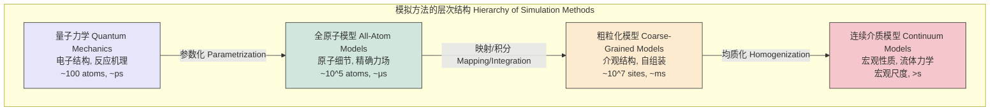

## 粗粒化模型

粗粒化（Coarse-grained, CG）模型是一种在计算物理、化学和生物学中广泛使用的建模技术，旨在通过减少系统的自由度来简化复杂系统。这种简化使得模拟更大尺度、更长时间尺度的现象成为可能，而这对于全原子（All-Atom, AA）模型来说是计算上无法承受的。其核心思想是将一组原子映射为单个相互作用位点，即“珠子”（bead）或“超原子”（superatom）。

### 核心概念与数学基础

粗粒化建模的基石是统计力学。其目标是构建一个有效的哈密顿量（或势能函数），该函数能够在较低的分辨率下，准确再现原始高分辨率系统的一部分关键物理化学性质。

#### 1. 映射方案 (Mapping Scheme)

从精细化（Fine-grained, FG）或全原子（All-Atom, AA）表示到粗粒化（CG）表示的转换是通过映射算子 $M$ 实现的。假设一个FG系统包含 $n$ 个原子，其坐标为 $\mathbf{r} = \{\mathbf{r}_1, \mathbf{r}_2, ..., \mathbf{r}_n\}$。CG模型包含 $N$ 个CG珠子（$N < n$），其坐标为 $\mathbf{R} = \{\mathbf{R}_1, \mathbf{R}_2, ..., \mathbf{R}_N\}$。每个CG珠子的坐标由一组原子坐标决定：

$$ \mathbf{R}_I = M_I(\mathbf{r}) $$

其中 $I$ 表示第 $I$ 个CG珠子。一个常见的线性映射是基于原子组的质心（Center of Mass, COM）：

$$ \mathbf{R}_I = \frac{\sum_{i \in C_I} m_i \mathbf{r}_i}{\sum_{i \in C_I} m_i} $$

其中：
*   $C_I$ 是构成第 $I$ 个CG珠子的原子索引集合。
*   $m_i$ 是原子 $i$ 的质量。
*   $\mathbf{r}_i$ 是原子 $i$ 的坐标向量。

#### 2. 有效势能函数：平均力势 (Potential of Mean Force, PMF)

粗粒化模型的有效势能函数 $U_{CG}(\mathbf{R})$ 在理论上应等于系统的平均力势（PMF），记为 $W(\mathbf{R})$。PMF源于对系统所有被忽略的自由度进行统计平均。

根据统计力学，CG坐标 $\mathbf{R}$ 的概率分布 $P(\mathbf{R})$ 可以通过对FG坐标的玻尔兹曼分布进行积分得到：

$$ P(\mathbf{R}) = \frac{\int \exp\left(-\frac{U_{FG}(\mathbf{r})}{k_B T}\right) \delta(\mathbf{R} - M(\mathbf{r})) d\mathbf{r}}{Z_{FG}} $$

其中：
*   $U_{FG}(\mathbf{r})$ 是FG系统的势能函数。
*   $k_B$ 是玻尔兹曼常数 ($1.380649 \times 10^{-23}$ J/K)。
*   $T$ 是绝对温度。
*   $\delta(\mathbf{R} - M(\mathbf{r}))$ 是狄拉克 $\delta$ 函数，用于强制执行映射约束。
*   $Z_{FG} = \int \exp\left(-\frac{U_{FG}(\mathbf{r})}{k_B T}\right) d\mathbf{r}$ 是FG系统的配分函数。

PMF $W(\mathbf{R})$ 定义为与此概率分布相关的自由能：

$$ W(\mathbf{R}) = -k_B T \ln P(\mathbf{R}) + C $$

常数 $C$ 通常被忽略，因为在模拟中我们只关心势能的差异。因此，理想的CG势能函数是 $U_{CG}(\mathbf{R}) = W(\mathbf{R})$。

#### 3. 参数化方法 (Parametrization Methods)

由于直接计算PMF非常困难，实践中采用多种方法来近似 $U_{CG}(\mathbf{R})$。这些方法主要分为两类：

*   **基于结构的方法（“自下而上”，Bottom-up）**：利用来自底层FG模拟的信息来推导CG力场。
    *   **玻尔兹曼反演 (Boltzmann Inversion)**：对于独立的坐标（如键长 $r$），其势能可以通过反转其概率分布来获得：
        $$ U(r) = -k_B T \ln \left( \frac{P(r)}{P_{ref}(r)} \right) $$
        其中 $P(r)$ 是从FG模拟中采样的分布，$P_{ref}(r)$ 是参考分布（对于键长，通常是 $r^2$）。此方法常用于推导键合相互作用。
    *   **力匹配 (Force Matching / Multiscale Coarse-Graining, MSCG)**：该方法旨在最小化CG力与从FG模拟映射的平均力之间的差异。目标函数 $\chi^2$ 定义为：
        $$ \chi^2 = \left\langle \sum_{I=1}^{N} \left| \mathbf{F}_I^{CG}(\mathbf{R}) - \mathbf{F}_I^{FG}(\mathbf{r}) \right|^2 \right\rangle_{\text{FG}} $$
        其中 $\mathbf{F}_I^{CG} = -\nabla_{\mathbf{R}_I} U_{CG}(\mathbf{R})$ 是CG力，$\mathbf{F}_I^{FG} = \sum_{i \in C_I} \mathbf{f}_i$ 是作用在构成CG珠子 $I$ 的所有原子上的总力。$\langle \cdot \rangle_{\text{FG}}$ 表示在FG系综上的平均。

*   **基于热力学的方法（“自上而下”，Top-down）**：调整CG模型参数以再现实验测量的宏观热力学性质，如密度、表面张力、压缩性或相变温度。MARTINI力场是此方法的典范。

### 关键技术规格

下表总结了典型粗粒化模型（以生物分子模拟为例）的关键参数。

| 参数 (Parameter) | 典型值 (Typical Value) | 单位 (Unit) | 描述 (Description) |
| :--- | :--- | :--- | :--- |
| 映射比率 (Mapping Ratio) | 2:1 到 10:1 (重原子/珠子) | 无量纲 | 定义了模型的粗粒化程度。例如，MARTINI模型通常使用4:1。 |
| 模拟时间步长 (Time Step) | 10 - 50 | fs | 由于势能面更平滑，允许比全原子模拟（1-2 fs）更大的时间步长。 |
| 非键相互作用截断半径 (Cutoff) | 1.0 - 1.5 | nm | 计算非键相互作用（如Lennard-Jones）的距离上限。 |
| 珠子质量 (Bead Mass) | 36 - 144 | amu | 通常是构成珠子的所有原子的总质量。 |
| 键合力常数 (Bond Force Constant) | 500 - 2000 | kJ mol⁻¹ nm⁻² | 控制CG珠子之间键合的刚度。 |
| 角度力常数 (Angle Force Constant) | 25 - 100 | kJ mol⁻¹ rad⁻² | 控制三个CG珠子形成的夹角的刚度。 |

### 常见用例

粗粒化模型被广泛应用于探索全原子模拟在时间和空间尺度上无法企及的现象。

*   **生物分子系统**
    *   **脂质膜动力学**：模拟囊泡融合、膜蛋白自组装和膜的相变，模拟时间可达毫秒级。
    *   **蛋白质折叠与构象变化**：研究大型蛋白质或蛋白质复合物的折叠路径和功能性运动。
    *   **定量指标**：与全原子模拟相比，速度提升**100-1000倍**。能够计算大型复合物的扩散系数，其值通常在 $10^{-7}$ 至 $10^{-8}$ cm²/s 范围内，但可能需要时间重标度。

*   **聚合物科学**
    *   **聚合物熔体和溶液**：研究聚合物链的缠结、相分离和流变性质。
    *   **嵌段共聚物的自组装**：预测微相结构（如层状、柱状、球状）。
    *   **定量指标**：能够模拟包含数百万个单体的系统，准确预测回旋半径 ($R_g$) 与链长 ($N$) 的标度关系，例如，在良溶剂中 $R_g \sim N^{0.588}$。

*   **软物质**
    *   **胶束和表面活性剂**：研究临界胶束浓度（CMC）和聚集体形态。
    *   **液晶**：模拟从各向同性到向列相或近晶相的转变。

### 实现考量

```mermaid
graph TD
    subgraph "粗粒化模型构建流程 Coarse-Graining Workflow"
        A[全原子系统 All-Atom System<br>e.g., 蛋白质在水中] -->|1. 定义映射 Define Mapping| B[映射方案 Mapping Scheme<br>e.g., 质心]
        B --> C选择参数化方法<br>Choose Parametrization
        C -- "自下而上 Bottom-up" --> D1[力匹配/玻尔兹曼反演<br>Force Matching/Boltzmann Inversion]
        C -- "自上而下 Top-down" --> D2[拟合宏观数据<br>Fit to Macroscopic Data]
        A --> E[运行参考AA模拟<br>Run Reference AA Simulation]
        E --> D1
        D1 --> F[生成CG势能函数<br>Generate CG Potential]
        D2 --> F
        F --> G[CG模型验证<br>CG Model Validation<br>对比结构/热力学性质]
        G -- "成功 Success" --> H[进行大规模CG模拟<br>Perform Large-Scale CG Simulation]
        G -- "失败 Failure" --> C
    end
```

*   **映射方案的选择**：这是最关键的步骤。一个好的映射应该保留系统的本质对称性和拓扑结构。不恰当的映射会导致物理行为失真。
*   **可转移性 (Transferability)**：为一个特定系统（例如，在300K水中的特定蛋白质）开发的CG模型，可能无法直接转移到不同条件（如不同温度或溶剂）下的另一个系统。这是CG模型的主要挑战之一。
*   **可表示性 (Representability)**：所选的CG坐标是否能唯一地代表FG系统的重要构象状态？如果多个重要的FG状态映射到同一个CG状态，就会发生信息丢失，导致模型无法区分这些状态。
*   **算法复杂度分析**：
    *   分子动力学模拟的主要计算开销来自非键相互作用的计算。对于一个包含 $n$ 个粒子的系统，朴素算法的复杂度为 $O(n^2)$。
    *   使用截断半径和邻居列表优化后，复杂度降为 $O(n)$。
    *   在CG模型中，粒子数从 $n$ 减少到 $N$（$N \ll n$）。因此，计算成本显著降低。
    *   总计算效率的提升不仅来自粒子数的减少，还来自时间步长 $\Delta t$ 的增加。一个粗略的性能增益估算为：
        $$ \text{Speedup} \propto \left( \frac{n}{N} \right) \times \frac{\Delta t_{CG}}{\Delta t_{AA}} \quad (\text{对于 O(n) 算法}) $$
        如果非键计算是瓶颈，则该因子可能接近 $(n/N)^2$。

### 性能特征

*   **计算速度**：如上所述，CG模拟通常比等效的全原子模拟快2到3个数量级。这使得研究在微秒到秒时间尺度上发生的事件成为可能。
*   **准确性**：准确性是为速度付出的代价。
    *   **结构性质**：CG模型通常能很好地再现径向分布函数（Radial Distribution Function, RDF）$g(r)$ 的主要特征，但会丢失精细的原子堆积细节。
    *   **热力学性质**：对于优化良好的模型，如MARTINI，计算的溶剂化自由能误差通常在 **2-5 kJ/mol** 的范围内。
    *   **动力学性质**：由于能量景观被人为地平滑，CG模型中的动力学通常比真实系统快。例如，水分子的扩散系数可能比实验值高 **2-10倍**。因此，通常需要引入一个时间标度因子（例如，对于MARTINI，通常认为CG时间乘以4大致对应真实时间）来解释这种加速效应。置信区间为95%时，预测的动力学性质可能存在±50%的偏差。

### 相关技术与比较

CG模型是多尺度建模框架中的一个层次。



*   **全原子模型 (All-Atom, AA)**：例如CHARMM, AMBER。提供最高的细节层次，但计算成本最高。其势能函数形式复杂：
    $$ U_{AA} = \sum_{\text{bonds}} k_b(b-b_0)^2 + \sum_{\text{angles}} k_\theta(\theta-\theta_0)^2 + \dots + \sum_{i<j} \left( \frac{A_{ij}}{r_{ij}^{12}} - \frac{B_{ij}}{r_{ij}^{6}} + \frac{q_i q_j}{4\pi\epsilon_0 r_{ij}} \right) $$
    其中各项分别代表键、角、二面角、Lennard-Jones和库仑相互作用。

*   **联合原子模型 (United-Atom, UA)**：一种特殊的CG模型，其中只有非极性氢原子与其所连接的重原子（如碳）合并成一个作用位点（例如，-CH₂- 或 -CH₃ 基团）。它是AA和CG模型之间的折中。

*   **隐式溶剂模型 (Implicit Solvent Models)**：将溶剂（通常是水）视为具有特定介电常数的连续介质，而不是离散的分子。这是一种对溶剂自由度的粗粒化。例如，广义玻恩（Generalized Born, GB）模型使用以下形式计算静电溶剂化能：
    $$ \Delta G_{elec} = -\frac{1}{2} \left(1 - \frac{1}{\epsilon}\right) \sum_{i,j} \frac{q_i q_j}{f_{GB}(r_{ij}, R_i, R_j)} $$
    其中 $\epsilon$ 是溶剂的介电常数，$f_{GB}$ 是依赖于原子间距 $r_{ij}$ 和有效玻恩半径 $R_i, R_j$ 的函数。

*   **连续介质模型 (Continuum Models)**：在最高层次的粗粒化中，系统由连续场（如密度、浓度、序参量）描述，其演化由偏微分方程（如Navier-Stokes方程或Cahn-Hilliard方程）控制。

### 参考文献

1.  Marrink, S. J., Risselada, H. J., Yefimov, S., Tieleman, D. P., & de Vries, A. H. (2007). The MARTINI force field: coarse grained model for biomolecular simulations. *The Journal of Physical Chemistry B*, *111*(27), 7812-7824. **DOI**: [10.1021/jp071097f](https://doi.org/10.1021/jp071097f)
2.  Noid, W. G. (2013). Perspective: Coarse-grained models for biomolecular systems. *The Journal of Chemical Physics*, *139*(9), 090901. **DOI**: [10.1063/1.4818908](https://doi.org/10.1063/1.4818908)
3.  Izvekov, S., & Voth, G. A. (2005). A multiscale coarse-graining method for biomolecular systems. *The Journal of Physical Chemistry B*, *109*(7), 2469-2473. **DOI**: [10.1021/jp045669v](https://doi.org/10.1021/jp045669v)
4.  Saunders, M. G., & Voth, G. A. (2013). Coarse-graining methods for computational biology. *Annual Review of Biophysics*, *42*, 73-93. **DOI**: [10.1146/annurev-biophys-083012-130348](https://doi.org/10.1146/annurev-biophys-083012-130348)