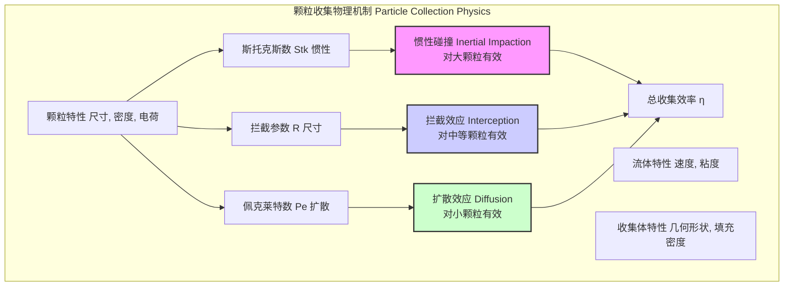
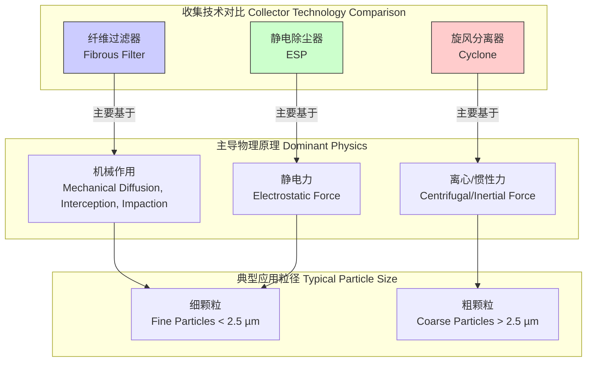

## 收集效率 (Collection Efficiency)

收集效率（Collection Efficiency），符号为 $\eta$，是一个无量纲参数，用于量化一个设备或系统从流体（通常是气体或液体）中捕获和去除悬浮颗粒物的能力。它被定义为被设备收集的颗粒数量与进入该设备的总颗粒数量之比。该指标是过滤、气溶胶科学、环境工程和工业卫生等领域的核心性能评价标准。

本文档将重点阐述在气溶胶和流体动力学背景下的收集效率，详细介绍其物理机制、数学模型和工程应用。

### 核心概念与数学基础

收集效率并非由单一过程决定，而是多种物理机制协同作用的结果。对于一个给定的收集设备（如纤维过滤器），总收集效率 $\eta$ 是所有进入的颗粒中被成功捕获的颗粒所占的比例：

$$
\eta = \frac{N_{collected}}{N_{inlet}} = 1 - P
$$

其中：
*   $N_{collected}$ 是被收集的颗粒数量。
*   $N_{inlet}$ 是进入设备的总颗粒数量。
*   $P$ 是穿透率（Penetration），表示未被收集的颗粒比例，$P = 1 - \eta$。

颗粒的收集主要依赖于以下几种基本物理机制，它们的相对重要性取决于颗粒尺寸、流速和收集体几何形状等因素。

#### 1. 惯性碰撞 (Inertial Impaction)
当携带颗粒的流体绕过收集体（如滤材纤维）时，由于颗粒自身惯性，质量较大的颗粒无法完全跟随弯曲的流线，从而偏离流线并直接撞击到收集体表面。这一机制对大颗粒（通常 > 1 µm）尤为重要。其主导参数是**斯托克斯数 (Stokes Number, $Stk$)**。

#### 2. 拦截效应 (Interception)
即使颗粒的质心能够完美地跟随流线运动，但如果流线到收集体表面的距离小于颗粒的半径，颗粒也会因为其自身的几何尺寸而与收集体接触。这一机制对中等尺寸的颗粒有显著影响。其主导参数是**拦截参数 (Interception Parameter, $R$)**。

#### 3. 扩散效应 (Diffusion)
对于非常小（通常 < 0.1 µm）的颗粒，其运动受到流体分子的随机热运动（布朗运动）的显著影响。这种随机运动增加了颗粒与收集体接触的可能性。其主导参数是**佩克莱特数 (Péclet Number, $Pe$)**。

#### 4. 重力沉降 (Gravitational Settling)
在低流速下，重力可能导致颗粒偏离水平流线并沉降到收集体表面。该效应通常只对大而重的颗粒在水平或向上流动的系统中比较重要。

#### 5. 静电吸引 (Electrostatic Attraction)
如果颗粒或收集体（或两者都）带有电荷，库仑力或介电力可以极大地增强收集效率，特别是对于细小颗粒。驻极体滤材（Electret filters）就是利用此原理的典型例子。

这些机制的综合效应决定了过滤器的**单纤维收集效率 (Single-fiber efficiency, $E$)**，即单个纤维从其前方流过的流体中捕获颗粒的效率。总过滤器效率 $\eta$ 则是通过单纤维效率和过滤器宏观结构参数（如填充密度、厚度）推导出来的。

### 关键技术规格

以下表格列出了评估和建模收集效率时所涉及的关键技术参数。

| 参数 (Parameter) | 符号 (Symbol) | 描述 (Description) | 典型单位 (Typical Unit) |
| :--- | :--- | :--- | :--- |
| 颗粒直径 (Particle Diameter) | $d_p$ | 颗粒的空气动力学或几何直径。 | µm, nm |
| 面风速 (Face Velocity) | $U_0$ | 流体垂直通过收集介质横截面的平均速度。 | m/s, cm/s |
| 纤维直径 (Fiber Diameter) | $d_f$ | 构成过滤介质的纤维的平均直径。 | µm |
| 填充密度 (Packing Density / Solidity) | $\alpha$ | 过滤介质中纤维体积占总体积的比例。 | 无量纲 |
| 压降 (Pressure Drop) | $\Delta P$ | 流体通过收集设备前后的静压差。 | Pa, mm H₂O |
| 斯托克斯数 (Stokes Number) | $Stk$ | 颗粒惯性与流体阻力的比值，决定惯性碰撞效率。 | 无量纲 |
| 佩克莱特数 (Péclet Number) | $Pe$ | 对流传输与扩散传输的比值，决定扩散收集效率。 | 无量纲 |
| 最易穿透粒径 (MPPS) | $d_{MPPS}$ | 收集效率最低时对应的颗粒直径。 | µm |
| 品质因子 (Quality Factor) | $Q_f$ | 衡量过滤器在给定能耗（压降）下实现过滤性能的综合指标。 | Pa⁻¹ |

### 常见用例

#### 1. 高效空气过滤器 (HEPA/ULPA Filters)
*   **应用**: 洁净室、生物安全柜、医疗设备、高端吸尘器。
*   **性能指标**: 根据标准（如DOE-STD-3020-2015），HEPA过滤器必须对0.3 µm的颗粒达到至少99.97%的收集效率。ULPA（超高效空气过滤器）的要求更高，通常为99.999%。
*   **量化分析**: 0.3 µm这个尺寸通常接近过滤器的MPPS，因此它是最严格的测试点。在此粒径下通过测试，意味着对更小或更大的颗粒具有更高的效率。

#### 2. 旋风分离器 (Cyclones)
*   **应用**: 工业粉尘控制、物料回收、作为多级过滤系统的预处理器。
*   **性能指标**: 主要性能由**切割直径 (Cut-off Diameter, $d_{50}$)** 描述，即收集效率为50%时对应的颗粒直径。
*   **量化分析**: 一个典型的工业旋风分离器可能对 >10 µm 的颗粒有 >90% 的效率，但对 <1 µm 的颗粒效率很低。其效率曲线 $\eta(d_p)$ 通常呈S形。

#### 3. 静电除尘器 (Electrostatic Precipitators, ESPs)
*   **应用**: 发电厂、水泥厂、冶炼厂的烟气净化。
*   **性能指标**: 对亚微米颗粒（0.1-1 µm）具有极高的收集效率，通常可达99%以上。
*   **量化分析**: 效率可通过Deutsch-Anderson方程进行估算，该方程将效率与收集板面积、气体流量和颗粒的有效迁移速度关联起来。

### 实现考量

收集效率的评估和预测主要通过实验测量和数学建模两种方式实现。

#### 1. 建模复杂度
*   **经验/半经验模型**: 这类模型（如Lee和Liu的模型）基于理论分析和实验数据拟合，提供了对单纤维效率的代数表达式。它们计算速度快，适用于宏观性能预测。
*   **数值模拟 (Numerical Simulation)**:
    *   **计算流体动力学 (CFD)**: 用于求解过滤器内部复杂的流场分布（纳维-斯托克斯方程）。
    *   **拉格朗日粒子追踪 (Lagrangian Particle Tracking)**: 在已知的流场中，通过求解牛顿第二定律来追踪单个颗粒的运动轨迹，并考虑布朗运动等效应。
    *   **CFD-DEM耦合**: 对于高颗粒浓度的情况，需要考虑颗粒对流场的影响以及颗粒间的相互作用，采用计算流体动力学与离散元方法耦合进行模拟。

#### 2. 算法复杂度分析
*   **经验模型**: 计算复杂度为 $O(1)$，可瞬时得到结果。
*   **数值模拟**:
    *   CFD流场求解: 复杂度与网格单元数量 $N_{cells}$ 相关，对于迭代求解器，通常在 $O(N_{cells}^{1.2})$ 到 $O(N_{cells}^{2})$ 之间。
    *   粒子追踪: 复杂度为 $O(N_{particles} \times N_{steps})$，其中 $N_{particles}$ 是模拟的颗粒数，$N_{steps}$ 是时间步数。
    *   CFD-DEM耦合模拟的计算成本非常高，通常仅用于基础研究。

### 性能特征

#### 1. 效率曲线与最易穿透粒径 (MPPS)
收集效率与颗粒直径的关系曲线通常呈 "U" 形或 "V" 形。
*   **左侧区域 (扩散主导)**: 对于小颗粒，扩散效应占主导。颗粒直径越小，布朗运动越剧烈，扩散效率越高。
*   **右侧区域 (惯性与拦截主导)**: 对于大颗粒，惯性碰撞和拦截效应占主导。颗粒直径越大，这两种效应越强，效率也越高。
*   **效率谷值 (Efficiency Valley)**: 在这两个区域之间，存在一个效率最低点，对应的颗粒尺寸即为**最易穿透粒径 (MPPS)**。MPPS的大小通常在0.1 µm到0.5 µm之间，具体取决于过滤介质和操作条件。MPPS是评估过滤器性能的最关键参数。

#### 2. 统计度量
实验测量的效率值总伴随着不确定性。因此，报告效率时应包含置信区间 (Confidence Interval, CI)。
*   **示例**: 报告效率为 $\eta = 0.9997 \pm 0.0001$ (95% CI)，这表示我们有95%的信心确定真实效率值落在0.9996和0.9998之间。
*   **不确定性来源**: 颗粒计数器的统计误差、流量计的精度、颗粒发生器的稳定性等。

#### 3. 品质因子 (Quality Factor)
一个好的过滤器不仅要有高效率，还应有低气流阻力（低压降），以节约能源。**品质因子 ($Q_f$)** 正是用于平衡这两个方面的综合性能指标。
$$
Q_f = \frac{-\ln(1-\eta)}{\Delta P} = \frac{-\ln(P)}{\Delta P}
$$
$Q_f$ 的值越高，说明过滤器在实现同等过滤水平时能耗越低，性能越优越。

### 相关技术与数学模型对比

不同的颗粒收集技术基于不同的主导物理原理，其数学模型也因此各异。

#### 1. 纤维过滤器 vs. 静电除尘器
*   **纤维过滤器模型**: 效率基于单纤维效率，并假设为指数衰减模型。
    $$ \eta = 1 - \exp\left(-\frac{4 \alpha E L}{\pi d_f (1-\alpha)}\right) $$
    这里的效率核心在于微观的单纤维效率 $E$，它综合了多种机械作用。
*   **静电除尘器模型 (Deutsch-Anderson方程)**: 同样是指数形式，但物理基础完全不同。
    $$ \eta = 1 - \exp\left(-\frac{A \cdot w_e}{Q}\right) $$
    这里的效率核心在于宏观的**有效迁移速度 ($w_e$)**，它由电场强度和颗粒电荷决定。

#### 2. 旋风分离器 vs. 过滤器
*   **旋风分离器模型**: 通常不使用单一效率值，而是使用**分级效率曲线 (Grade Efficiency Curve)**，描述效率随粒径的变化。常用逻辑函数模型表示：
    $$ \eta(d_p) = \frac{1}{1 + (d_{50}/d_p)^{\beta}} $$
    其中 $d_{50}$ 是50%收集效率的切割直径，$\beta$ 是曲线的陡峭度参数。
*   **对比**: 旋风分离器是低压降的粗效预处理器，而纤维过滤器则用于实现对细颗粒的高效捕获，但通常伴随着更高的压降。

### 数学方程

以下是收集效率理论中的关键数学方程。

1.  **斯托克斯数 (Stokes Number, $Stk$)**
    $$
    Stk = \frac{\rho_p d_p^2 C_c U_0}{9 \mu d_f}
    $$
    *   $\rho_p$: 颗粒密度 (kg/m³)
    *   $d_p$: 颗粒直径 (m)
    *   $C_c$: 坎宁安滑移修正因子 (Cunningham slip correction factor)，无量纲
    *   $U_0$: 上游流体速度 (m/s)
    *   $\mu$: 流体动力粘度 (Pa·s)
    *   $d_f$: 收集体（纤维）直径 (m)

2.  **拦截参数 (Interception Parameter, $R$)**
    $$
    R = \frac{d_p}{d_f}
    $$
    *   $d_p$: 颗粒直径 (m)
    *   $d_f$: 纤维直径 (m)

3.  **佩克莱特数 (Péclet Number, $Pe$)**
    $$
    Pe = \frac{U_0 d_f}{D}
    $$
    *   $U_0$: 上游流体速度 (m/s)
    *   $d_f$: 纤维直径 (m)
    *   $D$: 颗粒的布朗扩散系数 (m²/s)

4.  **布朗扩散系数 (Brownian Diffusion Coefficient, $D$)**
    $$
    D = \frac{k_B T C_c}{3 \pi \mu d_p}
    $$
    *   $k_B$: 玻尔兹曼常数 (1.38 × 10⁻²³ J/K)
    *   $T$: 绝对温度 (K)
    *   $C_c$: 坎宁安滑移修正因子 (无量纲)
    *   $\mu$: 流体动力粘度 (Pa·s)
    *   $d_p$: 颗粒直径 (m)

5.  **单纤维收集效率 (Single-Fiber Efficiency, $E$)**
    单纤维效率是各机制效率的复杂组合。一个经典的半经验模型（非简单加和）如下所示，例如，结合了扩散和拦截的效率 $E_{DR}$：
    $$
    E_{DR} = 1.6 \left( \frac{1-\alpha}{Ku} \right)^{1/3} R^{2/3} + 0.6 \left( \frac{1-\alpha}{Ku} \right) Pe^{-2/3}
    $$
    *   $Ku$: Kuwabara水动力学因子，是 $\alpha$ 的函数。
    完整的 $E$ 的表达式通常是多个经验项的组合，如 $E = f(E_D, E_R, E_I, ...)$。

6.  **总过滤器效率 (Total Filter Efficiency, $\eta$)**
    $$
    \eta = 1 - \exp\left(-\frac{4 \alpha E L}{\pi d_f (1-\alpha)}\right)
    $$
    *   $\alpha$: 过滤器填充密度 (无量纲)
    *   $E$: 单纤维收集效率 (无量纲)
    *   $L$: 过滤器厚度 (m)
    *   $d_f$: 纤维直径 (m)

7.  **品质因子 (Quality Factor, $Q_f$)**
    $$
    Q_f = \frac{-\ln(1-\eta)}{\Delta P}
    $$
    *   $\eta$: 总过滤器效率 (无量纲)
    *   $\Delta P$: 过滤器压降 (Pa)

### 参考文献

1.  Hinds, W. C. (1999). *Aerosol Technology: Properties, Behavior, and Measurement of Airborne Particles* (2nd ed.). John Wiley & Sons.
2.  Lee, K. W., & Liu, B. Y. H. (1982). Theoretical study of aerosol filtration by fibrous filters. *Aerosol Science and Technology*, 1(2), 147-161. DOI: [10.1080/02786828208958584](https://doi.org/10.1080/02786828208958584)
3.  Brown, R. C. (1993). *Air Filtration: An Integrated Approach to the Theory and Applications of Fibrous Filters*. Pergamon Press.
4.  Deutsch, W. (1922). Bewegung und Ladung der Elektrizitätsträger im Zylinderkondensator. *Annalen der Physik*, 373(5), 49-98. (Historical reference for the Deutsch-Anderson equation).
5.  Wang, J., & Pui, D. Y. H. (2013). A review on research and development of particle filtration technology in the past 40 years. *Particuology*, 11(4), 377-393. DOI: [10.1016/j.partic.2013.04.001](https://doi.org/10.1016/j.partic.2013.04.001)