## 二向色镜 (Dichroic Mirror)

二向色镜是一种精密光学元件，其核心功能是根据光的波长选择性地反射或透射光。与传统反射镜（反射所有波长）或吸收型滤光片（吸收不需要的波长）不同，二向色镜通过薄膜干涉原理将光束分离成两个或多个具有不同光谱成分的光束，且能量损失极低。这种特性使其在荧光显微镜、激光系统、数字投影和光谱学等领域中至关重要。

### 核心概念及其数学基础

二向色镜的性能源于其多层介电质薄膜结构。通过在光学基底（如玻璃或熔融石英）上精确沉积数十甚至上百层具有不同折射率的透明介电材料（如二氧化钛 $TiO_2$、二氧化硅 $SiO_2$），可以构建一个一维光子晶体。当光波穿过这些薄膜层时，在每个界面上都会发生反射和折射。这些被反射的光波会发生相长或相消干涉，从而导致某些波长被高效反射（形成反射带），而另一些波长则高效透射（形成透射带）。

#### 传输矩阵法 (Transfer-Matrix Method, TMM)

传输矩阵法是分析和设计多层薄膜光学系统最严谨和通用的数学工具。该方法将整个膜堆视为一个线性系统，通过计算每个单一薄膜层的特征矩阵，并将它们级联相乘，最终得到整个系统的光学响应（反射率和透射率）。

一个由 $N$ 层薄膜构成的膜堆，位于入射介质（折射率为 $n_0$）和基底介质（折射率为 $n_{sub}$）之间。对于第 $j$ 层薄膜，其折射率为 $n_j$，物理厚度为 $d_j$。

对于第 $j$ 层，其特征矩阵 $M_j$ 定义为：

$$
M_j = \begin{pmatrix} \cos(\delta_j) & \frac{i}{\eta_j} \sin(\delta_j) \\ i \eta_j \sin(\delta_j) & \cos(\delta_j) \end{pmatrix}
$$

其中：
*   $i$ 是虚数单位 ($i^2 = -1$)。
*   $\delta_j$ 是第 $j$ 层的相位厚度，定义为：
    $$ \delta_j = \frac{2\pi}{\lambda} n_j d_j \cos(\theta_j) $$
    *   $\lambda$ 是光在真空中的波长。
    *   $\theta_j$ 是光在第 $j$ 层中的传播角度，由斯涅尔定律 ($n_{j-1} \sin(\theta_{j-1}) = n_j \sin(\theta_j)$) 递归计算。
*   $\eta_j$ 是第 $j$ 层的有效光学导纳，其值取决于光的偏振状态：
    *   对于s-偏振 (TE波，电场矢量垂直于入射面): $\eta_{js} = n_j \cos(\theta_j)$
    *   对于p-偏振 (TM波，磁场矢量垂直于入射面): $\eta_{jp} = n_j / \cos(\theta_j)$

整个膜堆的总系统矩阵 $M$ 是所有单层矩阵的乘积：

$$
M = M_1 M_2 \cdots M_N = \begin{pmatrix} m_{11} & m_{12} \\ m_{21} & m_{22} \end{pmatrix}
$$

通过总系统矩阵，可以计算出入射介质和基底介质的光场振幅关系。定义一个列向量 $\begin{pmatrix} B \\ C \end{pmatrix}$ 如下：

$$
\begin{pmatrix} B \\ C \end{pmatrix} = M \begin{pmatrix} 1 \\ \eta_{sub} \end{pmatrix}
$$

其中 $\eta_0$ 和 $\eta_{sub}$ 分别是入射介质和基底介质的有效光学导纳。

最终，膜堆的振幅反射系数 $r$ 和振幅透射系数 $t$ 可以表示为：

$$
r = \frac{\eta_0 B - C}{\eta_0 B + C}
$$
$$
t = \frac{2 \eta_0}{\eta_0 B + C}
$$

能量反射率 $R$ 和能量透射率 $T$ 分别是振幅系数的模平方：

$$
R = |r|^2 = \left| \frac{\eta_0 B - C}{\eta_0 B + C} \right|^2
$$
$$
T = \frac{\text{Re}(\eta_{sub})}{\text{Re}(\eta_0)} |t|^2 = \frac{4 \eta_0 \text{Re}(\eta_{sub})}{|\eta_0 B + C|^2}
$$

在无吸收的理想情况下，$R+T=1$。在实际材料中，由于存在微弱吸收，$R+T+A=1$，其中 $A$ 为吸收率。

### 关键技术规格

二向色镜的性能由一系列精确的参数来定义，这些参数是为特定应用而设计的。

| 参数 (Parameter) | 典型值 (Typical Value) | 单位 (Unit) | 描述 (Description) |
| :--- | :--- | :--- | :--- |
| 基底材料 (Substrate Material) | N-BK7, 熔融石英 (Fused Silica) | - | 决定了光学元件的机械、热和紫外/红外透过性能。 |
| 波长范围 (Wavelength Range) | 400 - 700 (可见光), 700 - 1100 (近红外) | nm | 元件设计有效工作的光谱范围。 |
| 截止波长 ($\lambda_{cutoff}$) | 550 ± 2 | nm | 透射率等于其最大值50%处的波长，定义了反射带和透射带的边界。 |
| 透射带 (Transmission Band) | T > 95% @ 560 - 700 nm | % | 高效透射光的波长区域及其最低透射率。 |
| 反射带 (Reflection Band) | R > 99.5% @ 400 - 540 nm | % | 高效反射光的波长区域及其最低反射率。 |
| 入射角 (Angle of Incidence, AOI) | 45 ± 2 | 度 (°) | 设计的工作角度。偏离设计角度会导致光谱性能曲线发生蓝移。 |
| 偏振相关性 (Polarization) | $|T_p - T_s| < 5\%$ | % | 在非正入射时，p偏振和s偏振光的性能差异。 |
| 激光损伤阈值 (LDT) | > 10 (脉冲), > 2 (连续) | J/cm², MW/cm² | 元件能够承受的最大激光能量/功率密度而不发生损坏。 |
| 表面质量 (Surface Quality) | 40-20 | Scratch-Dig | 根据MIL-PRF-13830B标准定义的表面瑕疵（划痕和麻点）等级。 |
| 表面平整度 (Surface Flatness) | λ/10 @ 632.8 nm | - | 元件表面与理想平面的最大偏差，影响波前畸变。 |

### 常见用例与量化性能指标

#### 1. 荧光显微镜 (Fluorescence Microscopy)

在荧光显微镜中，二向色镜是核心组件，用于将较短波长的激发光反射到样品上，同时让样品发出的较长波长的荧光透射到探测器。

*   **功能**: 分离激发光和发射光。
*   **量化指标**:
    *   激发光波长 (如 488 nm) 处的反射率: $R_{avg} > 99.5\%$。
    *   发射荧光波段 (如 505 - 550 nm) 处的透射率: $T_{avg} > 95\%$。
    *   截止带宽度 (从R>90%到T>90%的波长范围): < 15 nm，以实现高效分离。
    *   串扰 (Crosstalk): 激发光在发射通道中的泄漏率 < 0.01%。

```mermaid
graph TD
    A[激光器<br>Laser 488 nm] --> B二向色镜<br>Dichroic Mirror;
    B -- "反射 Reflection" --> C[物镜<br>Objective Lens];
    C --> D[样品<br>Sample];
    D -- "发射荧光<br>Emitted Fluorescence >505 nm" --> C;
    C --> B;
    B -- "透射 Transmission" --> E[发射滤光片<br>Emission Filter];
    E --> F[探测器<br>Detector];

    style B fill:#add8e6,stroke:#333,stroke-width:2px
```

#### 2. 激光合束 (Laser Beam Combining)

用于将两个或多个不同波长的激光束合并到同一光路中，常见于多波长激光系统和RGB激光显示。

*   **功能**: 共线化多个激光束。
*   **量化指标**:
    *   激光1 (如 976 nm) 处的反射率: $R > 99.8\%$ @ 45° AOI。
    *   激光2 (如 1064 nm) 处的透射率: $T > 99.5\%$ @ 45° AOI。
    *   透射波前畸变 (Transmitted Wavefront Error): < λ/8 @ 632.8 nm。
    *   高激光损伤阈值以适应高功率应用。

#### 3. 数字投影系统 (Digital Projection Systems)

在基于3LCD或DLP技术的投影仪中，使用X-Cube或飞利浦棱镜等包含二向色镜的组件，将光源发出的白光精确地分离成红(R)、绿(G)、蓝(B)三个基色通道。

*   **功能**: 光谱分离。
*   **量化指标**:
    *   蓝光反射/绿红光透射的截止波长: $\lambda_{cutoff,1} = 495 \pm 3$ nm。
    *   蓝绿光反射/红光透射的截止波长: $\lambda_{cutoff,2} = 585 \pm 3$ nm。
    *   各通道平均效率 (R, G, B): > 98%，以最大化亮度和色彩饱和度。

### 实现考量与算法复杂度分析

二向色镜的设计和制造是一个复杂的过程，涉及光学建模、优化算法和精密制造技术。

#### 设计算法

设计过程本质上是一个逆向工程优化问题：给定一个目标光谱曲线（如上文的规格），找到满足该曲线的薄膜层数、材料和厚度组合。

*   **核心算法**:
    *   **针式优化法 (Needle Optimization)**: 从一个初始设计开始，算法在膜堆的每一层中“插入”一个极薄的新层（针），并计算其对性能的影响。如果性能改善，则保留并优化该新层，迭代进行。
    *   **遗传算法 (Genetic Algorithms)**: 模拟生物进化过程，通过对一组候选设计（种群）进行选择、交叉和变异操作，逐步寻找到最优解。
*   **算法复杂度分析**:
    *   设计算法的核心是反复调用传输矩阵法(TMM)来评估候选设计的性能。
    *   对于一个具有 $N$ 层的膜堆，在单个波长点上计算其反射率的TMM复杂度为 $O(N)$，因为它涉及 $N$ 个 2x2 矩阵的乘法。
    *   如果设计优化需要在 $K$ 个波长点上评估光谱，并在 $M$ 次迭代中收敛，则总的计算复杂度约为 $O(M \cdot K \cdot N)$。这表明计算成本与层数、光谱分辨率和优化算法的收敛速度成正比。

#### 制造工艺

*   **物理气相沉积 (PVD)**: 如电子束蒸发 (E-beam Evaporation) 或离子辅助沉积 (IAD)。
*   **离子束溅射 (IBS)**: 能够生产出最致密、稳定和低损耗的薄膜，是制造高性能二向色镜的首选技术。
*   **过程控制**: 制造过程中必须使用原位光学监控系统（如宽带光谱监控），实时测量膜层厚度，精度需达到亚纳米级别，以确保最终产品符合设计规格。

### 性能特征与统计测量

实际生产的二向色镜性能会存在一定的统计偏差。

*   **制造公差**: 截止波长等关键参数并非一个固定值，而是在一个范围内波动。其分布通常可以用正态分布来描述，例如，截止波长 $\lambda_c \sim \mathcal{N}(\mu=550\,\text{nm}, \sigma=1.5\,\text{nm})$。制造商通常保证产品性能落在 $\mu \pm 3\sigma$ 的区间内（99.7%置信区间）。
*   **表面均匀性**: 元件中心和边缘的光谱特性可能存在微小差异。该指标通常定义为在有效孔径（如中心90%区域）内，截止波长的最大偏移量，例如 $\Delta\lambda_c < 1$ nm。
*   **环境稳定性**: 温度和湿度的变化会引起膜层材料折射率和厚度的微小改变，导致光谱曲线发生漂移。该特性用温度系数来量化，例如 $d\lambda/dT \approx +0.015 \text{ nm}/^{\circ}\text{C}$。IBS工艺制造的滤光片通常具有更好的稳定性。

### 相关技术与比较数学模型

二向色镜是光谱滤波技术的一种，与其他技术在原理和性能上有所不同。

#### 1. 吸收型滤光片 (Absorptive Filters)

*   **原理**: 基于材料对特定波长光的选择性吸收。其性能由比尔-朗伯定律描述。
*   **数学模型**:
    $$ T(\lambda) = e^{-\alpha(\lambda) L} $$
    *   $T(\lambda)$ 是波长相关的透射率。
    *   $\alpha(\lambda)$ 是材料的吸收系数。
    *   $L$ 是光的路径长度（滤光片厚度）。
*   **比较**:
    *   **优点**: 成本低，对角度不敏感，易于使用。
    *   **缺点**: 吸收的能量转化为热量，不适用于高功率应用；光谱截止边缘不如二向色镜陡峭。

#### 2. 体布拉格光栅 (Volume Bragg Gratings, VBG)

*   **原理**: 在一块光敏玻璃内部通过全息曝光等方式形成周期性的折射率调制。当满足布拉格衍射条件时，特定波长的光会被高效衍射（反射）。
*   **数学模型**: 基于耦合波理论。对于一个透射型VBG，其衍射效率（反射率）$\eta$ 近似为：
    $$ \eta = \tanh^2\left(\frac{\pi \Delta n L}{\lambda \cos\theta_B}\right) $$
    *   $\Delta n$ 是折射率调制度。
    *   $L$ 是光栅厚度。
    *   $\lambda$ 是波长。
    *   $\theta_B$ 是布拉格角。
*   **比较**:
    *   **优点**: 可实现极窄的反射带宽（< 0.1 nm），角度选择性非常高。
    *   **缺点**: 通常只对一个非常窄的波段起作用，制造成本高。

#### 技术对比图

```mermaid
graph TD
    subgraph "光谱滤波技术对比 Comparison of Spectral Filtering Technologies"
        DM["二向色镜<br>Dichroic Mirror"]
        AF["吸收型滤光片<br>Absorptive Filter"]
        VBG["体布拉格光栅<br>Volume Bragg Grating"]
    end

    subgraph "工作原理 Operating Principle"
        DM_P["薄膜干涉<br>Thin-Film Interference"]
        AF_P["材料吸收<br>Material Absorption"]
        VBG_P["体全息衍射<br>Volume Holographic Diffraction"]
    end

    subgraph "关键特性 Key Characteristics"
        DM_C["陡峭的截止边沿<br>Sharp cut-off edge"]
        DM_C2["低吸收, 热效应小<br>Low absorption, low thermal effects"]
        DM_C3["对角度和偏振敏感<br>Sensitive to angle and polarization"]

        AF_C["成本低, 易于制造<br>Low cost, easy to manufacture"]
        AF_C2["吸收导致发热<br>Absorption causes heating"]
        AF_C3["角度不敏感<br>Angle insensitive"]

        VBG_C["极窄的带宽 <0.1 nm<br>Extremely narrow bandwidth"]
        VBG_C2["高衍射效率<br>High diffraction efficiency"]
        VBG_C3["角度选择性强<br>Strong angular selectivity"]
    end

    DM --> DM_P;
    DM --> DM_C;
    DM --> DM_C2;
    DM --> DM_C3;

    AF --> AF_P;
    AF --> AF_C;
    AF --> AF_C2;
    AF --> AF_C3;

    VBG --> VBG_P;
    VBG --> VBG_C;
    VBG --> VBG_C2;
    VBG --> VBG_C3;
```



### 参考文献 (References)

1.  Macleod, H. A. (2010). *Thin-Film Optical Filters* (4th ed.). CRC Press. DOI: 10.1201/9781420073034. (这是光学薄膜领域的权威经典著作，详细介绍了传输矩阵法及各种滤光片的设计原理。)
2.  Piston, D. W. (2007). Choosing an appropriate filter set for fluorescence microscopy. *Current Protocols in Cell Biology*, Chapter 4, Unit 4.6. DOI: 10.1002/0471143030.cb0406s34. (这篇文献详细讨论了在荧光显微镜应用中如何根据荧光团的特性选择合适的二向色镜和滤光片组合。)
3.  Baumeister, P. W. (2004). *Optical Coating Technology*. SPIE Press. (本书提供了关于光学镀膜技术、材料和设计方法的全面概述。)