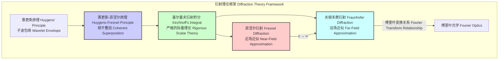
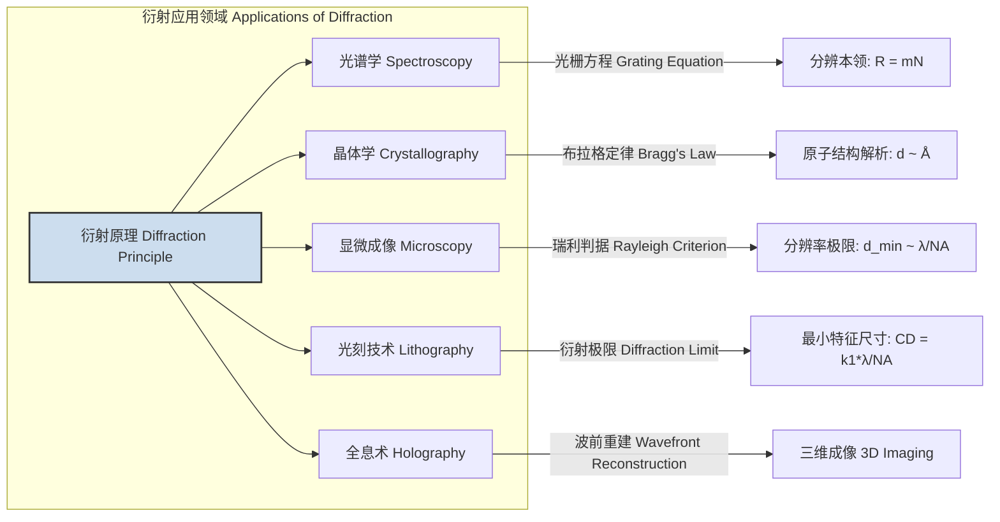
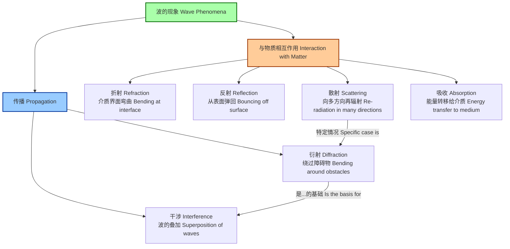

## 衍射 (Diffraction)

衍射是指波（例如光波、声波或物质波）在遇到障碍物或通过孔隙时发生弯曲或扩展的现象。这种偏离直线传播路径的行为是波动的基本特征之一。衍射的本质可以由惠更斯-菲涅尔原理来解释，该原理指出波前的每一点都可以被视为产生次级球面子波的点源，而后续任意时刻的波前是所有这些子波相干叠加的结果。

### 核心数学基础：惠更斯-菲涅尔原理

惠更斯-菲涅尔原理是描述衍射现象的半经典理论基础。它将惠更斯的子波概念与菲涅尔的相干叠加思想结合起来。通过一个孔径 $\Sigma$ 的衍射场在观察点 $P_0$ 的复振幅 $U(P_0)$ 可以通过以下积分计算：

$$ U(P_0) = \frac{A}{i\lambda} \iint_{\Sigma} \frac{e^{ik(r_0+s)}}{r_0s} K(\chi) d\Sigma $$

其中：
*   $U(P_0)$ 是在点 $P_0$ 的复振幅。
*   $A$ 是源点 $P_1$ 处点波源的振幅。
*   $i$ 是虚数单位，即 $\sqrt{-1}$。
*   $\lambda$ 是波的波长。
*   $k = 2\pi/\lambda$ 是波数。
*   $s$ 是从源点 $P_1$ 到孔径上一点 $P$ 的距离。
*   $r_0$ 是从孔径上一点 $P$ 到观察点 $P_0$ 的距离。
*   $K(\chi)$ 是倾斜因子（obliquity factor），由菲涅尔引入，用于修正子波的各向异性辐射。$\chi$ 是 $P_1P$ 连线与 $PP_0$ 连线之间的夹角。$K(\chi) = \frac{1}{2}(1+\cos\chi)$。

这个积分是衍射理论的基石，但直接计算通常很复杂。因此，根据观察点与孔径的距离，发展出了两种近似理论：菲涅尔衍射和夫琅禾费衍射。

#### 1. 菲涅尔衍射（近场衍射）

当观察屏离孔径较近，以至于从孔径不同点到观察点的路径长度差中的二次相位项不可忽略时，适用菲涅尔衍射。其积分形式为：

$$ U(x,y) = \frac{e^{ikz}}{i\lambda z} \iint_{-\infty}^{\infty} U(\xi, \eta) e^{\frac{ik}{2z}[ (x-\xi)^2 + (y-\eta)^2 ]} d\xi d\eta $$

其中：
*   $U(x,y)$ 是在观察平面 $(x,y)$ 处的复振幅。
*   $U(\xi, \eta)$ 是在孔径平面 $(\xi, \eta)$ 处的复振幅（孔径函数）。
*   $z$ 是孔径平面与观察平面之间的距离。
*   指数项中的二次方项是菲涅尔衍射的核心特征。

菲涅尔数 $F$ 用于界定菲涅尔区和夫琅禾费区：
$$ F = \frac{a^2}{\lambda L} $$
其中 $a$ 是孔径的特征尺寸，$L$ 是到观察屏的距离。通常认为当 $F \gtrsim 1$ 时，为菲涅尔衍射区。

#### 2. 夫琅禾费衍射（远场衍射）

当观察屏离孔径非常远（$L \to \infty$），或者使用透镜将衍射图样聚焦在焦平面上时，适用夫琅禾费衍射。这是菲涅尔衍射在远场条件下的近似。在此条件下，相位项中的二次方项可以忽略。

远场条件：$L \gg \frac{a^2}{\lambda}$，即菲涅尔数 $F \ll 1$。

夫琅禾费衍射积分简化为孔径函数的傅里叶变换：

$$ U(x,y) = C \iint_{-\infty}^{\infty} U(\xi, \eta) e^{-\frac{i2\pi}{\lambda L}(x\xi + y\eta)} d\xi d\eta $$

其中：
*   $C = \frac{e^{ikL} e^{\frac{ik}{2L}(x^2+y^2)}}{i\lambda L}$ 是一个相位和振幅因子，在计算强度 $I = |U|^2$ 时，其相位部分通常不重要。
*   这个积分形式表明，**夫琅禾费衍射图样的复振幅分布是孔径函数（Aperture Function）的二维傅里叶变换**。

### 关键技术规格

下表列出了一些与衍射现象相关的关键物理量和典型值。

| 参数 (Parameter) | 符号 (Symbol) | 描述 (Description) | 典型值 (Typical Value) | 单位 (Unit) |
| :--- | :---: | :--- | :--- | :---: |
| 波长 (Wavelength) | $\lambda$ | 电磁波或物质波的波长 | 532 (绿光), 0.1 (X射线) | nm |
| 单缝宽度 (Single-Slit Width) | $a$ | 单缝实验中狭缝的宽度 | 0.01 - 0.5 | mm |
| 光栅常数 (Grating Constant) | $d$ | 衍射光栅中相邻刻线间的距离 | 1/1200 - 1/300 | mm |
| 孔径到屏幕距离 (Aperture-Screen Distance) | $L$ 或 $z$ | 衍射孔径到观察屏的垂直距离 | 0.5 - 5.0 | m |
| 瑞利判据角分辨率 (Rayleigh Angular Resolution) | $\theta_R$ | 圆孔衍射所能分辨的最小角距 | 1.22 $\lambda / D$ (D为孔径直径) | rad |
| 晶格间距 (Lattice Spacing) | $d_{hkl}$ | 晶体中特定晶面的间距 | 0.1 - 0.5 | nm |
| 数值孔径 (Numerical Aperture) | NA | 光学系统（如显微镜）收集光的能力 | 0.1 - 1.4 | 无量纲 |

### 常见用例与性能指标

衍射在科学和技术中有广泛应用。

*   **光谱学 (Spectroscopy)**
    *   **应用**: 使用衍射光栅将复色光分离成其组成波长，用于化学分析、天体物理学等。
    *   **核心原理**: 光栅方程 $d(\sin\theta_m - \sin\theta_i) = m\lambda$。
    *   **性能指标**: **分辨本领 (Resolving Power)**, $R = \frac{\lambda}{\Delta\lambda} = mN$，其中 $m$ 是衍射级次，$N$ 是被照射的光栅刻线总数。一个宽度为 50 mm、刻线密度为 1200 lines/mm 的光栅，在二级衍射下，$N = 50 \times 1200 = 60000$，$R = 2 \times 60000 = 120000$。这意味着在 500 nm 处，它可以分辨约 $500/120000 \approx 0.004$ nm 的波长差。

*   **X射线晶体学 (X-ray Crystallography)**
    *   **应用**: 通过分析晶体对X射线的衍射图样来确定分子和晶体的三维原子结构。
    *   **核心原理**: 布拉格定律 (Bragg's Law):
        $$ 2d_{hkl} \sin\theta = n\lambda $$
        其中 $d_{hkl}$ 是晶面间距，$\theta$ 是掠射角，$n$ 是整数级次。
    *   **性能指标**: **分辨率 (Resolution)**，通常以埃 (Å) 为单位。一个分辨率为 1.5 Å 的蛋白质结构意味着可以清晰地分辨出相距 1.5 Å 的原子。数据质量通常用 R-factor 和 R-free 值来评估，R-factor < 20% 表示高质量的结构模型。

*   **光刻技术 (Lithography)**
    *   **应用**: 在半导体制造中，使用光将电路图案从掩模版转移到硅晶圆上。
    *   **核心原理**: 衍射限制了可以被清晰成像的最小特征尺寸。
    *   **性能指标**: **关键尺寸 (Critical Dimension, CD)**，由瑞利判据的变体给出：
        $$ CD = k_1 \frac{\lambda}{NA} $$
        其中 $k_1$ 是一个与工艺相关的因子 (通常为 0.25-0.4)，$\lambda$ 是光源波长 (例如 193 nm ArF 准分子激光)，NA 是投影透镜的数值孔径 (可高达 1.35)。为了制造更小的晶体管，业界致力于减小 $\lambda$ 和 $k_1$，并增大 NA。

### 实现考量与算法复杂度

数值模拟衍射图样是计算物理学中的一个重要任务。

*   **直接积分法 (Direct Integration)**
    *   **方法**: 直接对惠更斯-菲涅尔积分或其近似形式进行数值求和。
    *   **算法复杂度**: 如果孔径平面被划分为 $N \times N$ 的网格，观察平面也被划分为 $M \times M$ 的网格，则计算复杂度为 $O(N^2 M^2)$。对于高分辨率模拟，这种方法的计算成本极高。

*   **基于快速傅里叶变换 (FFT) 的方法**
    *   **方法**:
        1.  **夫琅禾费衍射**: 由于夫琅禾费衍射积分是傅里叶变换，可以直接使用二维FFT算法进行计算。
        2.  **菲涅尔衍射**: 菲涅尔衍射积分可以表示为一个卷积的形式: $U(x,y) = U_0(x,y) * h(x,y)$，其中 $h(x,y)$ 是脉冲响应函数。根据卷积定理，这可以在傅里叶域中通过元素乘积来计算：$\mathcal{F}\{U\} = \mathcal{F}\{U_0\} \cdot \mathcal{F}\{h\}$。因此，整个过程可以通过两次FFT和一次逆FFT完成。
    *   **算法复杂度**: 对于一个 $N \times N$ 的网格，FFT的复杂度为 $O(N^2 \log N)$。这比直接积分法快得多，是现代衍射模拟的标准方法。

### 性能特征与统计度量

在实验衍射测量中，对数据质量的评估至关重要。

*   **信噪比 (Signal-to-Noise Ratio, SNR)**: 衍射图样（信号）的强度与背景噪声强度的比率。噪声来源包括探测器的读出噪声、暗电流和光子统计的散粒噪声。高SNR对于准确确定衍射峰的位置和强度至关重要。
*   **峰形与展宽 (Peak Shape and Broadening)**: 理想的衍射峰是无限窄的，但实际峰形会因仪器函数（如光源非单色性、探测器分辨率）和样品本身（如晶粒尺寸、微观应变）而展宽。峰形通常用高斯、洛伦兹或Voigt函数拟合。
    *   **谢乐方程 (Scherrer Equation)**: 估算纳米晶粒尺寸 $L$：
        $$ L = \frac{K\lambda}{\beta \cos\theta} $$
        其中 $K$ 是形状因子（~0.9），$\lambda$ 是X射线波长，$\beta$ 是峰的半高宽 (FWHM)，$\theta$ 是布拉格角。
*   **拟合优度 ($\chi^2$)**: 在将理论模型（如晶体结构）与实验衍射数据进行比较时，使用卡方检验来量化拟合的质量。较低的 $\chi^2$ 值表示模型与数据吻合得更好。
*   **置信区间 (Confidence Intervals)**: 从衍射数据中提取的任何参数（如晶格常数、原子坐标）都应报告其不确定性或置信区间。例如，晶格常数可以报告为 $a = 5.4310 \pm 0.0002$ Å (95% CI)，表示真实值有95%的概率落在这个区间内。

### 相关技术与数学模型比较

衍射是波动光学的一个分支，与其他现象密切相关。

| 现象 (Phenomenon) | 核心机制 (Core Mechanism) | 数学模型 (Mathematical Model) | 适用条件 (Applicable Condition) |
| :--- | :--- | :--- | :--- |
| **衍射 (Diffraction)** | 波前在障碍物/孔径处连续子波的叠加 | 惠更斯-菲涅尔积分, 傅里叶变换 | 障碍物/孔径尺寸与波长相当 |
| **干涉 (Interference)** | 来自少数几个相干源的离散波的叠加 | $I = I_1 + I_2 + 2\sqrt{I_1I_2}\cos\delta$ | 存在两个或多个相干波源 |
| **折射 (Refraction)** | 波在不同介质界面处传播速度改变 | 斯涅尔定律: $n_1 \sin\theta_1 = n_2 \sin\theta_2$ | 波穿过两种不同折射率的介质 |
| **散射 (Scattering)** | 波与介质中不均匀体相互作用导致向各方向辐射 | 瑞利散射: $I \propto \lambda^{-4}$; 米氏散射: Mie理论 | 散射体尺寸与波长的相对关系决定模型 |

**衍射与干涉的关系**:
干涉可以看作是衍射的特例（少数几个点源的衍射）。在更普遍的情况下，如双缝实验，观察到的图样是单缝衍射效应（包络）和双缝干涉效应（精细条纹）的乘积。双缝衍射的强度分布为：
$$ I(\theta) = I_0 \left( \frac{\sin\beta}{\beta} \right)^2 \cos^2\alpha $$
其中：
*   $\beta = \frac{\pi a \sin\theta}{\lambda}$ 来自单缝衍射，$\left( \frac{\sin\beta}{\beta} \right)^2$ 是衍射因子（包络）。
*   $\alpha = \frac{\pi d \sin\theta}{\lambda}$ 来自双缝干涉，$\cos^2\alpha$ 是干涉因子（条纹）。
*   $a$ 是缝宽，$d$ 是缝间距。

### 参考文献

1.  Born, M., & Wolf, E. (1999). *Principles of Optics: Electromagnetic Theory of Propagation, Interference and Diffraction of Light* (7th ed.). Cambridge University Press. (经典光学教科书，全面覆盖衍射理论)
2.  Goodman, J. W. (2005). *Introduction to Fourier Optics* (3rd ed.). Roberts & Company Publishers. DOI: [10.1117/3.2069324](https://doi.org/10.1117/3.2069324) (将傅里叶分析应用于光学和衍射的权威著作)
3.  Stout, G. H., & Jensen, L. H. (1989). *X-Ray Structure Determination: A Practical Guide* (2nd ed.). Wiley-Interscience. (X射线晶体学的经典实践指南)
4.  Cowley, J. M. (1995). *Diffraction Physics* (3rd ed.). Elsevier. DOI: [10.1016/C2009-0-22073-9](https://doi.org/10.1016/C2009-0-22073-9) (深入探讨电子、中子和X射线衍射的物理学)