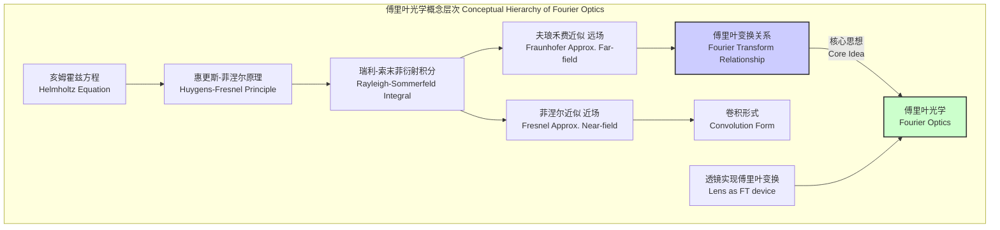
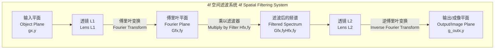

## 傅里叶光学 (Fourier Optics)

傅里叶光学是经典光学的一个分支，它利用傅里叶分析（特别是傅里叶变换）来研究光的传播、衍射和成像。该理论框架将光学系统（如透镜、光圈和自由空间传播）视为线性时不变（LSI）系统。因此，一个复杂的波前可以通过其空间频率谱（即其傅里叶变换）来分析，而光学系统对波前的影响则可以通过其传递函数在频率域中进行建模。这种方法为理解和设计从显微镜到光通信和信息处理的各种光学系统提供了强有力的数学工具。

### 1. 核心概念与数学基础

傅里叶光学的核心在于将光波的传播和变换问题转化为数学上的傅里叶分析问题。其基础是标量衍射理论。

#### 1.1 亥姆霍兹方程 (Helmholtz Equation)

对于单色相干光，其电场的复振幅 $U(\mathbf{r})$ 在无源的均匀介质中的传播遵循亥姆霍兹方程：

$$
(\nabla^2 + k^2)U(\mathbf{r}) = 0
$$

其中：
*   $U(\mathbf{r})$ 是在空间位置 $\mathbf{r}=(x,y,z)$ 处光的复振幅，它包含了振幅和相位信息。
*   $\nabla^2 = \frac{\partial^2}{\partial x^2} + \frac{\partial^2}{\partial y^2} + \frac{\partial^2}{\partial z^2}$ 是拉普拉斯算子。
*   $k = \frac{2\pi}{\lambda}$ 是波数（wave number），其中 $\lambda$ 是光在介质中的波长。

#### 1.2 瑞利-索末菲衍射积分 (Rayleigh-Sommerfeld Diffraction Integral)

亥姆霍兹方程的解可以通过惠更斯-菲涅尔原理导出，其精确的数学形式由瑞利-索末菲衍射积分给出。它描述了光波从一个平面（例如，一个孔径平面）传播到另一个平面（观测平面）后的复振幅分布。第一种瑞利-索末菲解为：

$$
U(x, y, z) = \frac{z}{i\lambda} \iint_{-\infty}^{\infty} U(\xi, \eta, 0) \frac{e^{ikR}}{R^2} d\xi d\eta
$$

其中：
*   $U(x, y, z)$ 是在观测平面上点 $(x, y)$ 处的复振幅，该平面距离孔径平面为 $z$。
*   $U(\xi, \eta, 0)$ 是在孔径平面上点 $(\xi, \eta)$ 处的复振幅（也称为孔径函数）。
*   $i = \sqrt{-1}$ 是虚数单位。
*   $\lambda$ 是光的波长。
*   $R = \sqrt{z^2 + (x-\xi)^2 + (y-\eta)^2}$ 是孔径平面上的点 $(\xi, \eta)$ 到观测平面上的点 $(x, y)$ 的距离。

这个积分通常难以直接计算，因此在不同条件下引入了近似。

#### 1.3 菲涅尔近似 (Fresnel Approximation) - 近场衍射

当传播距离 $z$ 足够大，使得傍轴近似（paraxial approximation）成立时，距离 $R$ 可以通过二项式展开进行近似：

$$
R = z \sqrt{1 + \frac{(x-\xi)^2 + (y-\eta)^2}{z^2}} \approx z \left( 1 + \frac{(x-\xi)^2 + (y-\eta)^2}{2z^2} \right)
$$

将此近似代入瑞利-索末菲积分，得到菲涅尔衍射积分：

$$
U(x,y) = \frac{e^{ikz}}{i\lambda z} e^{i\frac{k}{2z}(x^2+y^2)} \iint_{-\infty}^{\infty} \left[ U(\xi,\eta) e^{i\frac{k}{2z}(\xi^2+\eta^2)} \right] e^{-i\frac{2\pi}{\lambda z}(x\xi+y\eta)} d\xi d\eta
$$

这个表达式可以被解释为对输入场 $U(\xi,\eta)$ 与一个二次相位因子（"chirp"函数）的乘积进行傅里叶变换，然后再乘以另一个输出平面上的二次相位因子。菲涅尔近似适用于近场（near-field）区域。

#### 1.4 夫琅禾费近似 (Fraunhofer Approximation) - 远场衍射

当传播距离 $z$ 非常大，满足远场条件 $z \gg \frac{k(\xi^2+\eta^2)_{max}}{2}$ 时，菲涅尔积分中的二次相位项 $e^{i\frac{k}{2z}(\xi^2+\eta^2)}$ 近似为1，积分简化为：

$$
U(x,y) = C \iint_{-\infty}^{\infty} U(\xi,\eta) e^{-i\frac{2\pi}{\lambda z}(x\xi+y\eta)} d\xi d\eta
$$

其中 $C = \frac{e^{ikz}}{i\lambda z} e^{i\frac{k}{2z}(x^2+y^2)}$ 是一个相位和振幅因子。这个积分正是孔径函数 $U(\xi,\eta)$ 的二维傅里叶变换。

定义空间频率 (spatial frequencies) 为：
$f_X = \frac{x}{\lambda z}$
$f_Y = \frac{y}{\lambda z}$

则夫琅禾费衍射场可以写成：

$$
U(f_X, f_Y) \propto \mathcal{F}\{U(\xi, \eta)\}
$$

其中 $\mathcal{F}\{\cdot\}$ 表示傅里叶变换。**这揭示了傅里叶光学的核心思想：在远场，衍射图样是孔径函数的傅里叶频谱。**

#### 1.5 透镜的傅里叶变换性质 (Fourier Transforming Property of a Lens)

一个理想薄透镜的相位变换函数 $t_l(x,y)$ 为：

$$
t_l(x,y) = e^{-i\frac{k}{2f}(x^2+y^2)}
$$

其中 $f$ 是透镜的焦距。当一个物屏放置在透镜的前焦平面，并在后焦平面上进行观察时，后焦平面上的光场分布正是前焦平面光场分布的精确傅里叶变换。这种配置（称为2f系统）使得在实验室中可以方便地获取物体的空间频谱，而无需满足远场条件。

### 2. 关键技术规格

在设计和分析傅里叶光学系统时，以下参数至关重要。

| 参数 (Parameter) | 符号 (Symbol) | 典型值 (Typical Value) | 单位 (Unit) | 描述 (Description) |
| :--- | :--- | :--- | :--- | :--- |
| 波长 (Wavelength) | $\lambda$ | 532, 632.8 | nm | 相干光源的波长，决定了系统的标度。 |
| 焦距 (Focal Length) | $f$ | 50 - 1000 | mm | 透镜的关键参数，决定傅里叶变换的尺度。 |
| 数值孔径 (Numerical Aperture) | NA | 0.1 - 1.4 | 无量纲 | 系统收集光的能力，决定了分辨率和最大可分辨空间频率。 $NA = n \sin\theta_{max}$ |
| 空间频率 (Spatial Frequency) | $f_X, f_Y$ | 0 - 2000 | cycles/mm | 物体或图像中空间变化的频率。系统传递函数截止频率为 $f_{cutoff} = NA/\lambda$。 |
| 束腰半径 (Beam Waist) | $w_0$ | 0.5 - 5 | mm | 高斯光束在焦点处的最小半径。 |
| 相干长度 (Coherence Length) | $L_c$ | > 10 | m | 光源的时间相干性，定义为 $L_c = \lambda^2 / \Delta\lambda$。对于傅里叶光学应用，需要高相干性。 |

### 3. 常见用例

#### 3.1 空间滤波与4f系统 (Spatial Filtering and 4f System)

4f系统是傅里叶光学的经典应用，用于实现空间滤波。它由两个焦距为 $f$ 的透镜组成，相距 $2f$。
*   **结构**：物体放置在前透镜的前焦平面（物平面），其傅里叶变换（频谱）出现在两透镜之间的公共焦平面（傅里叶平面或频率平面）。在此平面放置一个滤波器（掩模），然后第二个透镜对滤波后的频谱进行逆傅里叶变换，在后焦平面（像平面）形成最终图像。
*   **应用**:
    *   **低通滤波**: 在傅里叶平面中心放置一个小孔，只允许低频分量通过，可以平滑图像、去除噪声。定量上，对于高斯白噪声，信噪比（SNR）可提高 >10 dB。
    *   **高通滤波**: 在傅里叶平面中心放置一个遮挡物，只允许高频分量通过，可以实现边缘增强。
    *   **匹配滤波**: 使用一个复杂的滤波器（VanderLugt滤波器），其传递函数是目标图案频谱的复共轭。当输入中存在该目标时，输出平面上会产生一个明亮的相干峰。

#### 3.2 光学相关器 (Optical Correlator)

基于4f系统的匹配滤波是实现光学模式识别的核心。
*   **原理**: 通过检测相关峰的位置来识别和定位目标。
*   **性能指标**:
    *   **峰值旁瓣比 (Peak-to-Sidelobe Ratio, PSR)**: 相关峰强度与第二高峰值强度之比。一个可靠的检测通常要求 PSR > 5。
    *   **相关峰效率**: 输入光能转换到相关峰的百分比。

#### 3.3 全息术 (Holography)

傅里叶变换全息图记录的是物体傅里叶变换与一束参考平面波之间的干涉图样。
*   **原理**: 重建时，用原始参考波照射全息图，其衍射场在透镜的后焦平面上再现出物体的像。
*   **性能指标**:
    *   **衍射效率 ($\eta$)**: 重建像的光强与入射光总光强之比。
    *   薄振幅全息图: $\eta_{max} \approx 6.25\%$
    *   薄相位全息图: $\eta_{max} \approx 33.9\%$
    *   体相位全息图: $\eta_{max} \to 100\%$

### 4. 实现考量

#### 4.1 相干性 (Coherence)

傅里叶光学实验严重依赖于光源的相干性。
*   **时间相干性**: 要求光源具有窄的光谱宽度 ($\Delta\lambda$)，以确保光路中不同路径的光能有效干涉。相干长度 $L_c = \lambda^2/\Delta\lambda$ 必须远大于系统中的最大光程差。
*   **空间相干性**: 要求光源看起来像一个点源。通常通过使用激光或将非相干光源通过一个小针孔来实现。

#### 4.2 对准 (Alignment)

光学元件的精确对准至关重要。
*   **纵向对准**: 透镜和掩模必须精确放置在焦平面上。偏离焦平面的误差会导致引入二次相位因子，破坏傅里叶变换关系。对准公差通常与系统的焦深有关，$\delta z \approx \pm 2\lambda (f/\#)^2$。
*   **横向对准**: 滤波器在傅里叶平面的横向位置必须精确，否则会导致输出图像的偏移和失真。

#### 4.3 计算傅里叶光学 (Computational Fourier Optics)

数值模拟是设计和分析傅里叶光学系统的重要工具。
*   **传播算法**:
    *   **角谱法 (Angular Spectrum Method)**: 这是数值求解瑞利-索末菲积分的精确方法。
        1.  计算源平面的角谱：$A(f_X, f_Y) = \mathcal{F}\{U(x,y,0)\}$。
        2.  将角谱乘以自由空间传递函数进行传播：$H(f_X, f_Y) = e^{iz\sqrt{k^2 - (2\pi f_X)^2 - (2\pi f_Y)^2}}$。
        3.  通过逆傅里叶变换得到目标平面的场：$U(x,y,z) = \mathcal{F}^{-1}\{A(f_X, f_Y) H(f_X, f_Y)\}$。
    *   **菲涅尔卷积法**: 基于菲涅尔近似，通过卷积实现传播。
*   **算法复杂度**: 对于一个 $N \times N$ 的采样网格，这些基于快速傅里叶变换 (FFT) 的算法的计算复杂度为 $O(N^2 \log N)$。这远优于直接数值积分的 $O(N^4)$ 复杂度，使得对复杂光学系统进行大规模模拟成为可能。

### 5. 性能特征

#### 5.1 分辨率 (Resolution)

光学系统的分辨率是指其区分两个邻近点的能力。
*   **瑞利判据 (Rayleigh Criterion)**: 一个由圆形孔径限制的成像系统的最小可分辨角为 $\Delta\theta = 1.22 \lambda / D$，其中 $D$ 是孔径直径。在像平面上，最小可分辨距离为 $\Delta x = 0.61 \lambda / \text{NA}$。
*   **空间频率视角**: 分辨率由系统能够通过的最大空间频率 $f_{cutoff} = \text{NA}/\lambda$ 决定。任何高于此频率的物体细节都无法在图像中再现。

#### 5.2 像差 (Aberrations)

实际透镜并非理想，会引入波前畸变，即像差。
*   **影响**: 像差在傅里叶平面上表现为相位误差，扭曲了理想的傅里叶频谱，导致成像质量下降（如模糊、畸变）。
*   **数学模型**: 波前像差 $W(\rho, \phi)$ 通常用泽尼克多项式 (Zernike polynomials) 来描述，它们是一组在单位圆上正交的多项式。
*   **性能衡量**:
    *   **马雷夏尔判据 (Maréchal Criterion)**: 当波前畸变的均方根 (RMS) 值 $\sigma_W < \lambda/14$ 时，系统可被认为是衍射极限的。此时，斯特列尔比 (Strehl Ratio) $S \ge 0.8$。
    *   斯特列尔比 $S$ 定义为有像差系统与无像差理想系统在点扩散函数（PSF）峰值强度之比，其近似值为 $S \approx e^{-(k\sigma_W)^2}$。

#### 5.3 噪声 (Noise)

*   **散斑噪声 (Speckle Noise)**: 使用相干光照射粗糙表面时产生的随机干涉图样。它是傅里叶光学系统中的主要噪声源。散斑对比度 $C = \sigma_I / \langle I \rangle$ 对于完全形成的散斑为1，表示噪声强度与信号强度相当。
*   **探测器噪声**: 包括散粒噪声（光子计数的泊松统计特性）和热噪声（电子元件的热骚动）。

### 6. 相关技术

#### 6.1 数字全息 (Digital Holography)

使用数字传感器（如CCD或CMOS）代替感光板来记录全息图。
*   **对比模型**: 物理原理与传统全息相同，但重建过程是数值化的。通过计算记录的全息图的傅里叶变换或菲涅尔变换来恢复物体的复振幅（振幅和相位）。
*   **优点**: 可以进行非破坏性相位成像、数值聚焦和像差校正。

#### 6.2 自适应光学 (Adaptive Optics)

用于实时校正光学像差的系统，广泛应用于天文学和显微镜学。
*   **数学模型**: 系统使用波前传感器测量畸变的波前 $\phi_{aberration}(x,y)$，然后驱动一个可变形反射镜产生一个共轭的相位校正 $-\phi_{aberration}(x,y)$。校正后的波前 $U_{corrected}$ 为：
    $$
    U_{corrected}(x,y) = U_{aberrated}(x,y) \cdot e^{-i\phi_{aberration}(x,y)}
    $$

#### 6.3 叠层衍射成像 (Ptychography)

一种无透镜的相干衍射成像（CDI）技术，通过在样品上扫描一个有限的照明光斑（探针），并记录一系列重叠区域的远场衍射图样来重建样品。
*   **对比模型**: 与传统CDI不同，Ptychography利用衍射图样的重叠区域来同时求解物体的复振幅和照明探针的复振幅，从而解决了相位恢复问题中的模糊性和收敛性问题。
*   **算法**: 基于迭代投影算法（如ePIE）来求解这个大型非线性逆问题。
*   **性能**: 能够实现超越透镜分辨率限制的超高分辨率成像。

### 7. 参考文献

*   Goodman, J. W. (2005). *Introduction to Fourier Optics* (3rd ed.). Roberts and Company Publishers. (该领域的权威经典教材)
*   Gaskill, J. D. (1978). *Linear Systems, Fourier Transforms, and Optics*. Wiley. (对线性系统理论在光学中的应用有深入的阐述)
*   Voelz, D. G. (2011). *Computational Fourier Optics: A MATLAB Tutorial*. SPIE Press. DOI: 10.1117/3.858456. (提供了计算傅里叶光学的实用指南和代码)
*   Rodenburg, J. M., & Maiden, A. M. (2019). Ptychography. In *Springer Handbook of Microscopy* (pp. 819-893). Springer, Cham. DOI: 10.1007/978-3-319-93893-7_19. (关于叠层衍射成像的综述性文章)