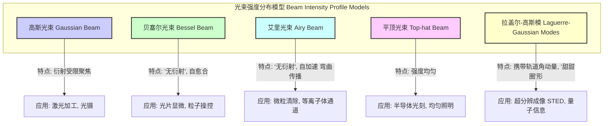

## 高斯强度分布

高斯强度分布，通常指高斯光束的横向光强度（辐照度）分布，是光学，特别是激光物理学中的一个基本概念。它描述了光束横截面上光强度如何从中心向边缘平滑地、呈钟形曲线衰减。这种分布是亥姆霍兹方程在旁轴近似（paraxial approximation）下的最基本解，对应于稳定光学谐振腔的基模，即TEM₀₀模。

### 核心概念与数学基础

高斯光束的电场分布是描述其所有性质的起点。在圆柱坐标系 $(r, \phi, z)$ 中，沿 $z$ 轴传播的基模高斯光束的电场复振幅 $E(r, z)$ 可以表示为：

$$
E(r, z) = E_0 \frac{w_0}{w(z)} \exp\left(-\frac{r^2}{w^2(z)}\right) \exp\left(-i\left(kz - \zeta(z) + k\frac{r^2}{2R(z)}\right)\right)
$$

其中：
*   $E_0$ 是在束腰中心 $(r=0, z=0)$ 处的电场振幅。
*   $r = \sqrt{x^2 + y^2}$ 是离光轴的径向距离。
*   $z$ 是沿传播方向离束腰的距离。
*   $k = 2\pi/\lambda$ 是波数，其中 $\lambda$ 是波长。
*   $w_0$ 是束腰半径，即光束最窄处的半径。
*   $w(z)$ 是在距离 $z$ 处的光束半径，其表达式为：
    $$ w(z) = w_0 \sqrt{1 + \left(\frac{z}{z_R}\right)^2} $$
*   $z_R$ 是瑞利范围（Rayleigh Range），定义为：
    $$ z_R = \frac{\pi w_0^2}{\lambda} $$
*   $R(z)$ 是在距离 $z$ 处的波前曲率半径，其表达式为：
    $$ R(z) = z \left[1 + \left(\frac{z_R}{z}\right)^2\right] $$
*   $\zeta(z)$ 是古依相移（Gouy phase shift），它描述了高斯光束相对于平面波的额外相移：
    $$ \zeta(z) = \arctan\left(\frac{z}{z_R}\right) $$

光强度（或辐照度）$I$ 与电场振幅的平方成正比，$I \propto |E|^2$。因此，高斯光束的强度分布为：

$$
I(r, z) = I_0 \left(\frac{w_0}{w(z)}\right)^2 \exp\left(-\frac{2r^2}{w^2(z)}\right)
$$

其中：
*   $I_0$ 是在光束中心 $(r=0)$ 且位于束腰 $(z=0)$ 处的峰值强度。
*   光束半径 $w(z)$ 定义为强度下降到中心强度 $1/e^2$ (约 13.5%) 处的径向距离。

### 关键技术规格

下表总结了描述高斯光束的关键参数。

| 参数 (符号) | 定义 | 数学公式 | 常用单位 |
| :--- | :--- | :--- | :--- |
| 束腰半径 ($w_0$) | 光束最窄处的半径，此处波前为平面。 | - | μm, mm |
| 光束半径 ($w(z)$) | 在 z 处，强度降至轴上强度 $1/e^2$ 处的半径。 | $w_0 \sqrt{1 + (z/z_R)^2}$ | μm, mm |
| 瑞利范围 ($z_R$) | 束腰面积加倍时，光束沿轴向传播的距离。 | $\pi w_0^2 / \lambda$ | mm, m |
| 光束发散角 ($\theta$) | 在远场 ($z \gg z_R$) 中，光束边缘与光轴形成的半角。 | $\theta \approx \frac{\lambda}{\pi w_0} = \frac{w_0}{z_R}$ | mrad, deg |
| 波前曲率半径 ($R(z)$) | 在 z 处等相位面的曲率半径。 | $z [1 + (z_R/z)^2]$ | mm, m |
| M² 因子 (光束质量) | 真实光束与理想高斯光束的接近程度。 | $M^2 = \frac{\pi W_0 \Theta_0}{\lambda}$ | 无量纲 |

*注：在M²因子公式中，$W_0$ 和 $\Theta_0$ 分别是真实光束的束腰半径和远场发散角。对于理想高斯光束，$M^2=1$。*

### 常见用例

高斯强度分布的独特性质使其在众多科学和工业应用中成为理想选择。

*   **激光切割与焊接:**
    *   **性能指标:** 功率密度 > 1 MW/cm²，焦点光斑尺寸 < 100 μm。
    *   **原理:** 高斯光束可以被聚焦到非常小的衍射极限光斑，产生极高的功率密度，从而实现材料的熔化和汽化。
*   **光镊 (Optical Tweezers):**
    *   **性能指标:** 捕获刚度: 0.01-1.0 pN/nm，捕获力: 1-200 pN。
    *   **原理:** 紧聚焦的高斯光束在其中心产生一个三维的梯度力场。介电粒子（如细胞）会被吸引到强度最高的焦点处。
*   **共聚焦显微镜:**
    *   **性能指标:** 横向分辨率: ~200 nm，轴向分辨率: ~500 nm。
    *   **原理:** 使用高斯光束作为点光源，通过针孔共轭检测，极大地抑制了焦平面外的杂散荧光，从而提高了图像的信噪比和三维空间分辨率。
*   **光纤耦合:**
    *   **性能指标:** 耦合效率 > 80-95%。
    *   **原理:** 为了将光高效地耦合进单模光纤，入射激光束的模式（通常是高斯分布）必须与光纤的模式场（也近似为高斯分布）在位置、大小和角度上精确匹配。

### 实现考量

在实验或仿真中处理高斯光束数据时，通常涉及从相机图像中提取光束参数。

**算法：二维高斯拟合**
从光束分析仪（如CCD或CMOS相机）获取的强度图像数据 $D(i, j)$，可以通过非线性最小二乘法拟合到二维高斯模型：
$$
I(x, y) = I_{bg} + A \exp\left( - \left( a(x-x_0)^2 + 2b(x-x_0)(y-y_0) + c(y-y_0)^2 \right) \right)
$$
其中 $(x_0, y_0)$ 是中心位置，$A$ 是振幅，$I_{bg}$ 是背景强度。参数 $a, b, c$ 用于确定束腰大小 $w_x, w_y$ 和旋转角度。

**算法复杂度分析**
*   **数据:** 一个 $N \times M$ 像素的图像。
*   **拟合算法:** 通常使用Levenberg-Marquardt (LM) 算法。
*   **复杂度:** 对于 $k$ 个拟合参数（例如，$I_{bg}, A, x_0, y_0, w_x, w_y, \theta$ 共7个），LM算法每次迭代的计算复杂度约为 $O(k^2 \cdot NM + k^3)$。该过程收敛速度快，但计算成本较高，尤其对于高分辨率图像。

### 性能特征

评估一个真实光束多大程度上是“高斯”的，需要量化的性能指标。

*   **M² 因子（光束质量因子）:** 这是最重要的性能特征。它量化了真实光束的束腰-发散角乘积与同波长的理想高斯光束的差异。$M^2 \ge 1$，越接近1，光束质量越好，越接近理想高斯光束。
*   **拟合优度 ($R^2$):** 在将实验数据拟合到高斯函数后，决定系数 $R^2$ 用于评估拟合质量。$R^2$ 值接近1（例如 > 0.98）表明实验光束具有很好的高斯形态。
*   **置信区间:** 通过拟合得到的光束参数（如 $w_0$）应报告其95%置信区间（例如，$w_0 = 50.2 \pm 0.5$ μm），这反映了测量和拟合过程中的不确定性。
*   **光束指向稳定性:** 通过长时间监测光束质心位置的标准差来衡量，通常以微弧度 (μrad) 为单位。

### 相关技术

高斯光束是旁轴亥姆霍兹方程最简单的解，但存在其他重要类型的结构光束。

**数学模型比较:**

*   **贝塞尔光束:** 其横向振幅由第零阶贝塞尔函数 $J_0(k_r r)$ 描述。与高斯光束的能量集中在中心不同，贝塞尔光束的能量分布在中心主瓣和一系列同心圆环中。它能在有限距离内抵抗衍射。
    $$ E(r, z) \propto J_0(k_r r) e^{i k_z z} $$
*   **平顶光束:** 理想的平顶光束强度是均匀的，可以用矩形函数描述。在实际中，通常通过衍射光学元件（DOE）或空间光调制器（SLM）对高斯光束进行整形来产生。
    $$ I(r) = \begin{cases} I_0 & r \le R \\ 0 & r > R \end{cases} $$
*   **拉盖尔-高斯 (LG) 模:** 它们是旁轴波动方程的一组更通用的解，由径向指数 $p$ 和方位角指数 $l$ 表征 ($LG_{pl}$)。$LG_{00}$ 模即为基模高斯光束。当 $l \neq 0$ 时，光束中心存在相位奇点，强度为零，形成“甜甜圈”形状，并携带轨道角动量。
    $$ E_{pl}(r, \phi, z) \propto \left(\frac{\sqrt{2}r}{w(z)}\right)^{|l|} L_p^{|l|}\left(\frac{2r^2}{w^2(z)}\right) e^{-\frac{r^2}{w^2(z)}} e^{il\phi} \times (\text{纵向项}) $$
    其中 $L_p^{|l|}$ 是广义拉盖尔多项式。

## 参考文献

1.  Kogelnik, H., & Li, T. (1966). Laser Beams and Resonators. *Applied Optics*, 5(10), 1550-1567. DOI: [10.1364/AO.5.001550](https://doi.org/10.1364/AO.5.001550)
2.  Siegman, A. E. (1997). How to (Maybe) Measure Laser Beam Quality. In *DPSS (Diode-Pumped Solid-State) Lasers: Applications and Issues* (Vol. 17, p. MQ1). Optical Society of America. DOI: [10.1364/OSA.DPSS.1997.MQ1](https://doi.org/10.1364/OSA.DPSS.1997.MQ1)
3.  Saleh, B. E. A., & Teich, M. C. (2019). *Fundamentals of Photonics* (3rd ed.). Wiley. (Chapter 3 provides a comprehensive treatment of Gaussian beams).