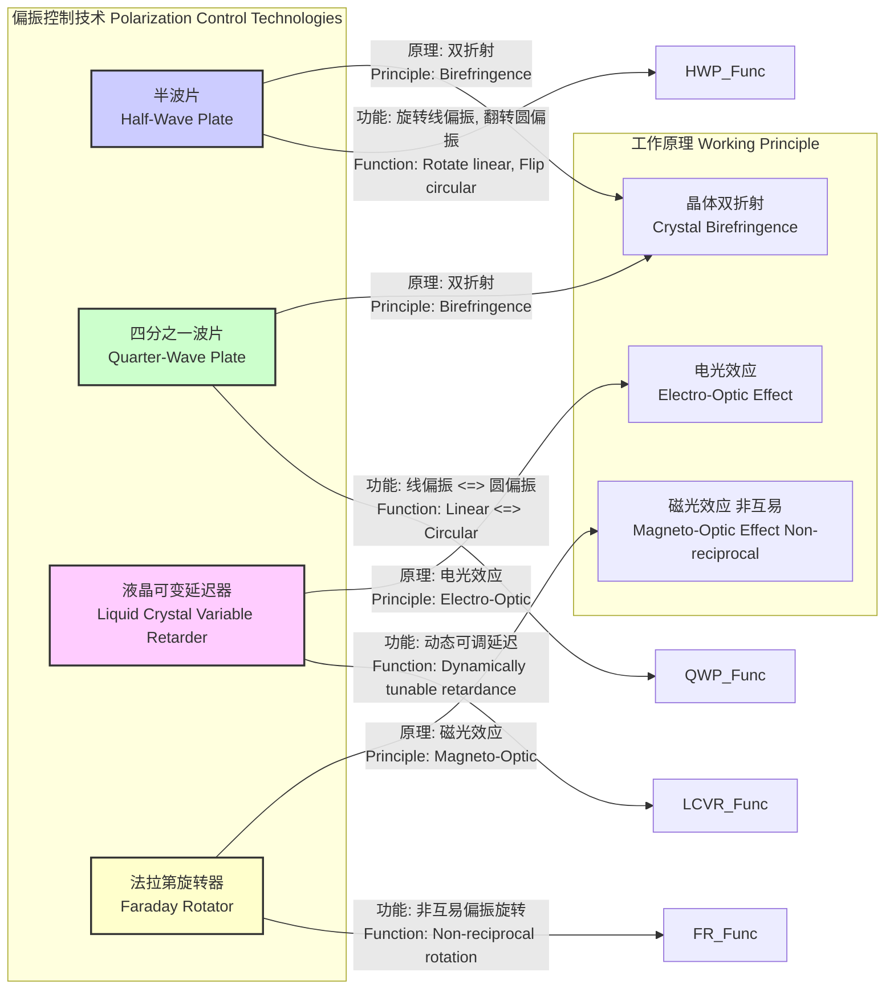

## 半波片

半波片（Half-Wave Plate, HWP）是一种光学元件，它能改变通过它的光的偏振态。其核心功能是引入两个正交偏振分量之间恰好为半个波长（$\lambda/2$）的光程差，或者说 $\pi$ 弧度（180°）的相位差。这种精确的相位控制使得半波片在激光物理、量子光学和光通信等领域中成为不可或缺的工具。

### 核心概念与数学基础

半波片的工作原理基于晶体的**双折射效应**（Birefringence）。在双折射材料（如石英、方解石）中，光的折射率取决于其偏振方向和传播方向。对于垂直于光轴（optic axis）传播的光，存在两个相互垂直的偏振方向，它们经历不同的折射率：寻常光折射率 $n_o$ 和异常光折射率 $n_e$。

*   **快轴（Fast Axis）**：对应较小折射率的偏振方向。
*   **慢轴（Slow Axis）**：对应较大折射率的偏振方向。

当一束光通过厚度为 $d$ 的双折射晶体时，沿快轴和慢轴的偏振分量之间会产生一个相位延迟 $\Gamma$。

$$
\Gamma = \frac{2\pi}{\lambda} d |n_e - n_o|
$$

其中：
*   $\Gamma$ 是相位延迟（单位：弧度）。
*   $\lambda$ 是光在真空中的波长。
*   $d$ 是波片的物理厚度。
*   $n_e$ 和 $n_o$ 分别是异常光和寻常光的折射率。

对于半波片，其设计目标是使相位延迟恰好为 $\pi$ 的奇数倍：
$$
\Gamma = (2m + 1)\pi, \quad m \in \{0, 1, 2, ...\}
$$
这等效于光程差（Optical Path Difference, OPD）为半波长的奇数倍：
$$
\text{OPD} = d |n_e - n_o| = (m + 1/2)\lambda
$$
其中 $m$ 是整数，代表波片的阶数。$m=0$ 对应**零级波片**，其性能最优。

#### 琼斯矩阵（Jones Calculus）分析

琼斯矩阵法是描述偏振态变化的强大数学工具。一个偏振态可以用一个二维复数向量（琼斯向量）表示，而光学元件则用一个 $2 \times 2$ 的复数矩阵（琼斯矩阵）表示。

一个任意偏振态的琼斯向量为：
$$
\mathbf{E} = \begin{pmatrix} E_x \\ E_y \end{pmatrix} = \begin{pmatrix} A_x e^{i\phi_x} \\ A_y e^{i\phi_y} \end{pmatrix}
$$

假设一个波片的快轴沿 x 轴，慢轴沿 y 轴，其琼斯矩阵为：
$$
W = \begin{pmatrix} e^{-i\Gamma/2} & 0 \\ 0 & e^{i\Gamma/2} \end{pmatrix}
$$

对于半波片，$\Gamma = \pi$。忽略一个全局相位因子 $e^{-i\pi/2} = -i$，其矩阵可以简化为：
$$
W_{HWP} = \begin{pmatrix} 1 & 0 \\ 0 & -1 \end{pmatrix}
$$

如果半波片的快轴与 x 轴成 $\theta$ 角，其琼斯矩阵 $W_{HWP}(\theta)$ 通过旋转变换得到：
$$
W_{HWP}(\theta) = R(-\theta) W_{HWP} R(\theta)
$$
其中 $R(\theta) = \begin{pmatrix} \cos\theta & \sin\theta \\ -\sin\theta & \cos\theta \end{pmatrix}$ 是旋转矩阵。
进行矩阵乘法运算后得到：
$$
W_{HWP}(\theta) = \begin{pmatrix} \cos(2\theta) & \sin(2\theta) \\ \sin(2\theta) & -\cos(2\theta) \end{pmatrix}
$$

**示例：旋转线偏振光**
假设一束线偏振光的偏振方向与 x 轴成 $\alpha$ 角，其琼斯向量为 $\mathbf{E}_{in} = \begin{pmatrix} \cos\alpha \\ \sin\alpha \end{pmatrix}$。
通过快轴成 $\theta$ 角的半波片后，出射光的琼斯向量为：
$$
\mathbf{E}_{out} = W_{HWP}(\theta) \mathbf{E}_{in} = \begin{pmatrix} \cos(2\theta) & \sin(2\theta) \\ \sin(2\theta) & -\cos(2\theta) \end{pmatrix} \begin{pmatrix} \cos\alpha \\ \sin\alpha \end{pmatrix}
$$
$$
\mathbf{E}_{out} = \begin{pmatrix} \cos(2\theta)\cos\alpha + \sin(2\theta)\sin\alpha \\ \sin(2\theta)\cos\alpha - \cos(2\theta)\sin\alpha \end{pmatrix} = \begin{pmatrix} \cos(2\theta - \alpha) \\ \sin(2\theta - \alpha) \end{pmatrix}
$$
结果表明，出射光仍然是线偏振光，但其偏振方向旋转到了 $2\theta - \alpha$。这意味着，如果入射光的偏振方向与快轴的夹角为 $\phi = \theta - \alpha$，则出射光的偏振方向相对于入射光旋转了 $2\phi$。

### 关键技术规格

下表列出了典型半波片的技术规格。

| 参数 (Parameter) | 典型值 (Typical Value) | 单位 (Unit) | 说明 (Description) |
| :--- | :--- | :--- | :--- |
| 材料 (Material) | 结晶石英 (Crystalline Quartz) | - | 具有优良的双折射特性和高损伤阈值 |
| 设计波长 (Design Wavelength) | 1064, 780, 633, 532 | nm | 延迟精度在该波长下最高 |
| 延迟精度 (Retardation Tolerance) | < $\lambda/500$ | - | 零级波片在设计波长下的典型精度 |
| 表面质量 (Surface Quality) | 20-10 | Scratch-Dig | 符合 MIL-PRF-13830B 标准 |
| 透射波前畸变 (Transmitted Wavefront) | < $\lambda/8$ @ 633 nm | - | 光束通过后波前平面的畸变程度 |
| 损伤阈值 (Damage Threshold) | > 10 (脉冲), > 1 (连续) | J/cm², MW/cm² | 适用于高功率激光应用的指标 |
| 有效孔径 (Clear Aperture) | > 90% | % of diameter | 元件中心可用的光学区域 |
| 增透膜 (AR Coating) | R < 0.2% | % per surface | 在特定波长范围内减少反射损耗 |
| 消光比 (Extinction Ratio) | > 1000:1 | - | 交叉偏振器设置下的光强抑制能力 |

### 常见用例

1.  **偏振方向旋转 (Polarization Rotation)**
    *   **描述**: 这是半波片最主要的应用。通过调整半波片快轴与入射线偏振光方向的夹角 $\phi$，可以使出射光的偏振方向旋转 $2\phi$。
    *   **性能指标**: 旋转精度可达 < 0.5°。例如，将一个水平偏振光（0°）变为垂直偏振光（90°），需将半波片的快轴置于 45°。

2.  **偏振态翻转 (Polarization State Flipping)**
    *   **描述**: 半波片可以将左旋圆偏振光（LCP）转换为右旋圆偏振光（RCP），反之亦然。
    *   **数学表示**:
        *   LCP: $\frac{1}{\sqrt{2}}\begin{pmatrix} 1 \\ i \end{pmatrix}$  ->  HWP (快轴@0°) -> $\frac{1}{\sqrt{2}}\begin{pmatrix} 1 \\ -i \end{pmatrix}$ (RCP)
    *   **性能指标**: 转换后的偏振纯度（Fidelity）通常 > 99.5%。

3.  **可变光强衰减器 (Variable Attenuator)**
    *   **描述**: 将一个半波片放置在两个偏振分束器（PBS）之间。通过旋转半波片，可以连续改变透射光的强度，而不改变其偏振态。透射光强 $I_{out}$ 与半波片旋转角 $\theta$ 的关系为 $I_{out} = I_{in} \cos^2(2\theta)$。
    *   **性能指标**: 动态范围 > 30 dB。

### 实现方式考量

半波片的实现方式对其性能（特别是对波长和温度的敏感性）有决定性影响。

```mermaid
graph TD
    subgraph "半波片类型 Half Wave Plate Types"
        A[多级波片<br>Multi-Order] -->|缺点: 对T和λ敏感<br>Drawback: Sensitive to T & λ| B应用: 单色、稳定环境<br>Use: Monochromatic, stable env.;
        C[零级波片<br>Zero-Order] -->|优点: 对T和λ不敏感<br>Advantage: Insensitive to T & λ| D应用: 宽光谱、变温环境<br>Use: Broadband, varying T;
        E[消色差波片<br>Achromatic] -->|优点: 超宽带<br>Advantage: Ultra-broadband| F应用: 白光、飞秒激光<br>Use: White light, fs lasers;
    end

    subgraph "零级波片结构 Zero-Order Construction"
        Z1[胶合型<br>Cemented]
        Z2[空气隙型<br>Air-Spaced]
        C --> Z1;
        C --> Z2;
        Z1 -- "优点: 结构紧凑<br>Pro: Compact" --> Z1_Desc;
        Z2 -- "优点: 高损伤阈值<br>Pro: High damage threshold" --> Z2_Desc;
    end
    
    subgraph "消色差波片结构 Achromatic Construction"
        AC1[不同材料组合<br>Combination of different materials]
        E --> AC1;
        AC1 -- "例如: 石英 + 氟化镁<br>e.g., Quartz + MgF2" --> AC1_Desc;
    end

    style A fill:#f9f,stroke:#333,stroke-width:2px
    style C fill:#9cf,stroke:#333,stroke-width:2px
    style E fill:#9fc,stroke:#333,stroke-width:2px
```

*   **多级波片 (Multi-Order)**: 由单块双折射晶片构成，其厚度满足 $d|n_e-n_o| = (m+1/2)\lambda$，其中 $m$ 是一个较大的整数。它结构简单、成本低，但对波长、温度和入射角非常敏感。
*   **零级波片 (Zero-Order)**: 由两片快慢轴相互垂直的多级波片叠合而成。两者的光程差相减，最终净光程差为 $\lambda/2$。这种设计极大地降低了对温度和波长的敏感性。
*   **消色差波片 (Achromatic)**: 由两种不同色散特性的双折射材料（如石英和氟化镁）组合而成。通过精心设计两块晶体的厚度，可以在很宽的波长范围内实现近似恒定的 $\pi$ 相位延迟。

#### 算法复杂度分析
在光学系统模拟中，每个光学元件的操作可以看作一个算法步骤。使用琼斯矩阵法，对一个偏振态施加半波片效应的操作是一个 $2 \times 2$ 矩阵与 $2 \times 1$ 向量的乘法。
*   **单次操作复杂度**: $O(1)$，因为它涉及固定数量的乘法和加法。
*   **级联系统复杂度**: 对于一个包含 $N$ 个光学元件的系统，总的计算复杂度为 $O(N)$，因为需要依次进行 $N$ 次矩阵乘法。

### 性能特征

半波片的性能并非理想，会受到多种物理因素的影响。

*   **波长依赖性**: 延迟量 $\Gamma$ 与波长 $\lambda$ 成反比。对于非设计波长 $\lambda'$，延迟量会偏离 $\pi$：
    $$
    \Gamma(\lambda') = \frac{\lambda}{\lambda'} \pi
    $$
    （此处假设折射率不随波长变化，实际情况更复杂）。零级和消色差设计可以显著减小这种依赖性。
*   **温度依赖性**: 温度变化会引起晶体厚度 $d$ 和折射率 $n_e, n_o$ 的改变，从而导致延迟量变化。零级波片通过差分结构可以补偿大部分温度漂移。典型零级石英波片的温度系数约为 $0.001\pi$ rad/°C。
*   **入射角依赖性**: 当光束非正入射时，有效光程和折射率都会发生变化，导致延迟量偏离理想值。对于发散角较大的光束，这会引入偏振像差。其性能通常在入射角 < 5° 时保持稳定。
*   **统计测量**: 一个高质量的半波片在设计波长下的延迟量可以表示为 $\Gamma = 180^\circ \pm 0.2^\circ$ (置信区间为 95%, $2\sigma$)。

### 相关技术对比

半波片是偏振控制元件家族的一员，与其他技术有不同的工作原理和应用场景。



1.  **四分之一波片 (Quarter-Wave Plate, QWP)**
    *   **数学模型**: 相位延迟 $\Gamma = \pi/2$。其琼斯矩阵（快轴沿x轴）为 $W_{QWP} = \begin{pmatrix} 1 & 0 \\ 0 & i \end{pmatrix}$ （忽略全局相位）。
    *   **功能对比**: QWP 主要用于将线偏振光转换为圆偏振光（当入射线偏振光与快轴成45°角时），或将圆偏振光转换为线偏振光。而 HWP 则是旋转线偏振光的偏振方向或翻转圆偏振光的手性。

2.  **液晶可变延迟器 (Liquid Crystal Variable Retarder, LCVR)**
    *   **数学模型**: 延迟量 $\Gamma$ 是施加电压 $V$ 的函数，$\Gamma(V) = \frac{2\pi d}{\lambda} \Delta n(V)$。
    *   **功能对比**: LCVR 的延迟量是电控可调的，可以动态地实现从0到超过 $\pi$ 的相位延迟，因此可以作为一个可调的波片（包括半波片或四分之一波片）。相比之下，晶体半波片是静态无源元件。LCVR 的响应速度（~ms）和损伤阈值通常低于晶体波片。

3.  **法拉第旋转器 (Faraday Rotator)**
    *   **数学模型**: 偏振旋转角 $\beta = V B L$，其中 $V$ 是材料的Verdet常数，$B$ 是磁场强度，$L$ 是材料长度。
    *   **功能对比**: 法拉第旋转器也用于旋转偏振方向，但其关键特性是**非互易性**。光沿相反方向传播时，旋转方向是相同的（相对于传播方向），这意味着反向传播的光其偏振旋转不会被抵消。而半波片是**互易**的，反向传播会撤销正向传播的旋转。这一特性使法拉第旋转器成为光隔离器的核心部件。

### 参考文献

1.  Hecht, E. (2017). *Optics* (5th ed.). Pearson. (A foundational textbook on optics covering birefringence and wave plates).
2.  Saleh, B. E. A., & Teich, M. C. (2019). *Fundamentals of Photonics* (3rd ed.). Wiley. DOI: [10.1002/9781119506874](https://doi.org/10.1002/9781119506874). (Provides in-depth mathematical treatment using Jones calculus).
3.  Pancharatnam, S. (1955). Achromatic combinations of birefringent plates. Part I. An achromatic circular polarizer. *Proceedings of the Indian Academy of Sciences, Section A, 41*(4), 130-136. (A seminal paper on the design of achromatic retarders).
4.  Title, A. M., & Rosenberg, W. J. (1981). Compound zero-order quartz halfwave plate. *Applied Optics, 20*(17), 2855-2855. DOI: [10.1364/AO.20.002855](https://doi.org/10.1364/AO.20.002855). (Describes the design principles of zero-order wave plates).