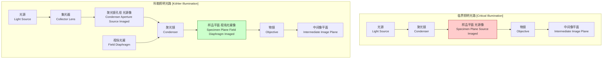

## 科勒照明 (Köhler illumination)

科勒照明是一种用于透射和反射光学显微镜的样品照明技术。该技术由奥古斯特·科勒（August Köhler）于1893年提出，旨在解决当时显微照明技术（临界照明）的主要缺陷，即照明不均匀以及光源结构在图像中可见的问题。科勒照明的核心原理是在光学系统中建立两套独立的共轭焦面：一套用于成像，另一套用于照明。这种分离确保了视场被均匀地照亮，同时允许对照明光锥的角度（即系统的有效数值孔径）进行精确控制，从而优化图像的对比度和分辨率。

### 核心概念与数学基础

科勒照明的精髓在于将光源本身与样品平面解耦。它通过一个集光器透镜将光源（如灯丝）的像精确地聚焦在聚光镜的孔径光阑（前焦面）上。然后，聚光镜将来自视场光阑的光线汇聚，使其在样品平面上形成清晰的像。这样，样品平面上接收到的是均匀照明的视场，而不是光源的结构图像。

这个系统巧妙地设置了两套共轭平面：

*   **照明光路共轭平面 (Illumination Conjugate Planes):**
    1.  光源（灯丝）
    2.  聚光镜孔径光阑 (Condenser Aperture Diaphragm)
    3.  物镜后焦面 (Objective Back Focal Plane)
    4.  观察者的瞳孔或相机传感器的入射光瞳 (Eye Pupil)
*   **成像光路共轭平面 (Image-forming Conjugate Planes):**
    1.  视场光阑 (Field Diaphragm)
    2.  样品平面 (Specimen Plane)
    3.  中间像平面 (Intermediate Image Plane)，通常位于目镜的焦平面上
    4.  观察者的视网膜或相机传感器平面 (Retina / Camera Sensor)

#### 数学基础

科勒照明系统的设计遵循几何光学的基本定律，主要是薄透镜成像公式：

$$
\frac{1}{s_o} + \frac{1}{s_i} = \frac{1}{f}
$$

其中：
*   $s_o$ 是物距（物体到透镜主平面的距离）。
*   $s_i$ 是像距（像到透镜主平面的距离）。
*   $f$ 是透镜的焦距。

在科勒系统中，此公式被多次应用：
1.  **集光器透镜 (Collector Lens):** 将光源（物）成像于聚光镜孔径光阑（像）。
2.  **聚光镜 (Condenser Lens):** 将视场光阑（物）成像于样品平面（像）。
3.  **物镜 (Objective Lens):** 将样品平面（物）成像于中间像平面（像）。
4.  **目镜 (Eyepiece):** 将中间像平面（物）成像于无穷远，以便人眼观察，或成像于相机传感器上。

#### 分辨率与数值孔径

科勒照明允许对聚光镜的孔径光阑进行调节，从而控制照明光锥的角度。这直接影响系统的有效数值孔径（NA），并最终决定显微镜的分辨率。根据阿贝衍射极限理论，系统的理论最高分辨率 $d$ 由下式给出：

$$
d = \frac{\lambda}{\text{NA}_{\text{obj}} + \text{NA}_{\text{cond}}}
$$

在空气介质中，该公式可简化为：

$$
d = \frac{0.61 \lambda}{\text{NA}_{\text{obj}}}
$$

其中：
*   $d$ 是最小可分辨距离。
*   $\lambda$ 是照明光的波长。
*   $\text{NA}_{\text{obj}}$ 是物镜的数值孔径 ($\text{NA}_{\text{obj}} = n \sin\theta_{\text{obj}}$)。
*   $\text{NA}_{\text{cond}}$ 是聚光镜的有效数值孔径 ($\text{NA}_{\text{cond}} = n \sin\theta_{\text{cond}}$)，可通过调节孔径光阑来改变。

为了在分辨率和对比度之间取得最佳平衡，通常将聚光镜孔径光阑调整到物镜孔径的70-80%。这提供了足够的分辨率，同时消除了杂散光并增强了对比度。

```mermaid
graph TD
    subgraph "照明光路共轭平面 [Illumination Conjugate Planes]"
        A["光源灯丝<br>Lamp Filament"] --> B["聚光镜孔径光阑<br>Condenser Aperture"];
        B --> C["物镜后焦面<br>Objective Back Focal Plane"];
        C --> D["人眼瞳孔/相机光瞳<br>Eye Pupil / Camera Entrance Pupil"];
    end
    subgraph "成像光路共轭平面 [Image-forming Conjugate Planes]"
        E["视场光阑<br>Field Diaphragm"] --> F["样品平面<br>Specimen Plane"];
        F --> G["中间像平面<br>Intermediate Image Plane"];
        G --> H["视网膜/相机传感器<br>Retina / Camera Sensor"];
    end
    style A fill:#ffc,stroke:#333,stroke-width:2px
    style B fill:#ffc,stroke:#333,stroke-width:2px
    style C fill:#ffc,stroke:#333,stroke-width:2px
    style D fill:#ffc,stroke:#333,stroke-width:2px
    style E fill:#ccf,stroke:#333,stroke-width:2px
    style F fill:#ccf,stroke:#333,stroke-width:2px
    style G fill:#ccf,stroke:#333,stroke-width:2px
    style H fill:#ccf,stroke:#333,stroke-width:2px
```

### 关键技术规格

以下是研究级显微镜实现科勒照明时涉及的典型技术规格。

| 参数 (Parameter) | 典型值 (Typical Value) | 单位 (Unit) | 描述 (Description) |
| :--- | :--- | :--- | :--- |
| 聚光镜数值孔径 ($\text{NA}_{\text{cond}}$) | 0.9 - 1.4 | 无量纲 | 决定照明光锥的最大角度，影响分辨率和对比度。 |
| 物镜数值孔径 ($\text{NA}_{\text{obj}}$) | 0.1 - 1.45 | 无量纲 | 决定图像分辨率和光收集效率。 |
| 光源类型 | 卤素灯, LED, 汞灯, 激光 | - | 光源的均匀性和光谱特性至关重要。 |
| 视场光阑直径 | 2 - 30 | mm | 控制被照明的样品区域大小。 |
| 孔径光阑直径 | 2 - 30 | mm | 控制照明光锥的角度（有效NA）。 |
| 照明均匀性 | > 95% | % | 视场内最大和最小亮度值之间的差异。 |
| 聚光镜焦距 | 10 - 50 | mm | 影响其将视场光阑成像到样品平面的能力。 |

### 常见用例与性能指标

科勒照明是大多数现代高端显微成像技术的基础。

*   **明场显微镜 (Bright-field Microscopy):**
    *   **性能指标:** 照明均匀性 > 98%，视场内强度标准差 < 2%。通过优化 $\text{NA}_{\text{cond}}$，可实现接近理论极限的分辨率。
*   **相衬显微镜 (Phase Contrast Microscopy):**
    *   **性能指标:** 必须使用科勒照明以确保来自聚光镜环形光阑的光正确地通过物镜中的相板。对中精度要求 < 5% 的环直径偏差。
*   **微分干涉相衬 (DIC) 显微镜:**
    *   **性能指标:** 科勒照明对于确保偏振光均匀地通过样品和渥拉斯顿棱镜至关重要。剪切方向的伪影最小化。
*   **荧光显微镜 (Fluorescence Microscopy):**
    *   **性能指标:** 在落射荧光中，科勒照明原理被适配，以确保激发光均匀地充满物镜的后孔径，从而在样品上产生均匀的激发场。信噪比 (SNR) 可提高2-3倍。

### 实现考量

正确设置科勒照明是一个精确的、多步骤的对准过程。其程序复杂性可以被认为是线性的，即 $O(N)$，其中 $N$ 是需要调整的光学元件数量（通常为4-5个）。

**对准算法（步骤）：**
1.  **初步聚焦:** 将样品放置在载物台上并使用低倍物镜（如10x）进行粗略聚焦。
2.  **关闭视场光阑:** 将位于照明器上的视场光阑收缩至最小。
3.  **聚焦聚光镜:** 上下移动聚光镜，直到在视场中看到视场光阑的多边形边缘变得清晰。此时，视场光阑与样品平面共轭。
4.  **对中聚光镜:** 使用聚光镜的对中螺丝，将视场光阑的像移动到视场的中央。
5.  **打开视场光阑:** 慢慢打开视场光阑，直到其边缘恰好消失在视场之外。这确保了只有被观察的区域被照亮，从而减少了杂散光。
6.  **调节孔径光阑:** 取下目镜，直接观察物镜的后焦面（或使用相位望远镜）。收缩或打开聚光镜的孔径光阑，直到其边缘覆盖物镜后焦面直径的70-80%。
7.  **放回目镜:** 将目镜放回，对准完成。

### 性能特征

*   **照明均匀性 (Illumination Uniformity):**
    *   这是科勒照明最显著的优点。在正确对准的系统中，整个视场的照度变化通常小于5%。
    *   **统计度量:** 视场图像的像素强度直方图应呈窄峰分布。其标准差与平均强度的比值（变异系数, $C_v = \sigma / \mu$）通常 < 0.05。
*   **分辨率与对比度的优化 (Resolution and Contrast Optimization):**
    *   通过独立调节孔径光阑，用户可以在最大分辨率（孔径光阑全开，$\text{NA}_{\text{cond}} \approx \text{NA}_{\text{obj}}$）和最高对比度（孔径光阑收缩）之间进行权衡，而不会改变照明的均匀性。
*   **减少杂散光 (Stray Light Reduction):**
    *   视场光阑限制了照明区域，防止了样品外区域的光线进入物镜，从而显著降低了图像中的眩光和背景噪声。

### 相关技术与比较

科勒照明的主要对比对象是其前身——临界照明。

#### 临界照明 (Critical/Nelsonian Illumination)

在临界照明中，集光器透镜将光源（如灯丝）的像直接聚焦在样品平面上。

*   **数学模型:**
    *   光源 $\xrightarrow{\text{聚光镜}}$ 样品平面
*   **优点:**
    *   光路简单，光能利用率高。
*   **缺点:**
    *   **不均匀照明:** 光源的任何结构（如灯丝的螺旋状）或不均匀性都会被直接投射到样品上，与样品图像叠加。
    *   **缺乏控制:** 无法独立调节照明孔径和视场大小。

#### 科勒照明 vs. 临界照明

| 特性 (Feature) | 科勒照明 (Köhler Illumination) | 临界照明 (Critical Illumination) |
| :--- | :--- | :--- |
| **光源成像位置** | 聚光镜孔径光阑 | 样品平面 |
| **照明均匀性** | 极高，均匀 | 差，依赖于光源的均匀性 |
| **分辨率控制** | 可通过孔径光阑精确调节 | 有限，与照明耦合 |
| **对比度控制** | 可通过孔径光阑精确调节 | 有限 |
| **杂散光** | 通过视场光阑最小化 | 较高 |
| **系统复杂度** | 较高，需要仔细对准 | 简单 |

### 参考文献

1.  Köhler, A. (1893). "Ein neues Beleuchtungsverfahren für mikrophotographische Zwecke." *Zeitschrift für wissenschaftliche Mikroskopie und für mikroskopische Technik*, 10(4), 433-440. (科勒的原始论文，奠定了该技术的基础).
2.  Inoué, S., & Spring, K. R. (1997). *Video Microscopy: The Fundamentals* (2nd ed.). Plenum Press. DOI: [10.1007/978-1-4615-6086-2](https://doi.org/10.1007/978-1-4615-6086-2). (该书详细介绍了包括科勒照明在内的多种显微镜技术).
3.  Sanderson, J. (2018). "Köhler Illumination." *The University of Arizona College of Optical Sciences, Lecture Notes*. (现代光学教育中关于科勒照明的典型论述).
4.  Murphy, D. B., & Davidson, M. W. (2012). *Fundamentals of Light Microscopy and Electronic Imaging* (2nd ed.). Wiley-Blackwell. DOI: [10.1002/9781118382905](https://doi.org/10.1002/9781118382905). (提供了对显微镜光学原理的全面回顾，包括详细的科勒照明设置指南).