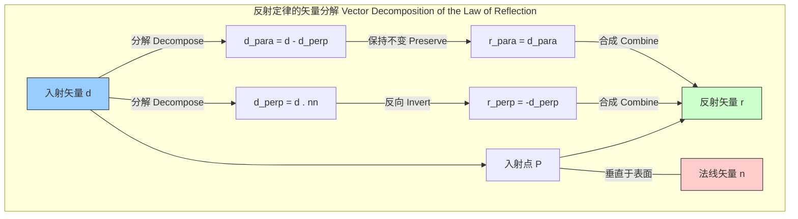
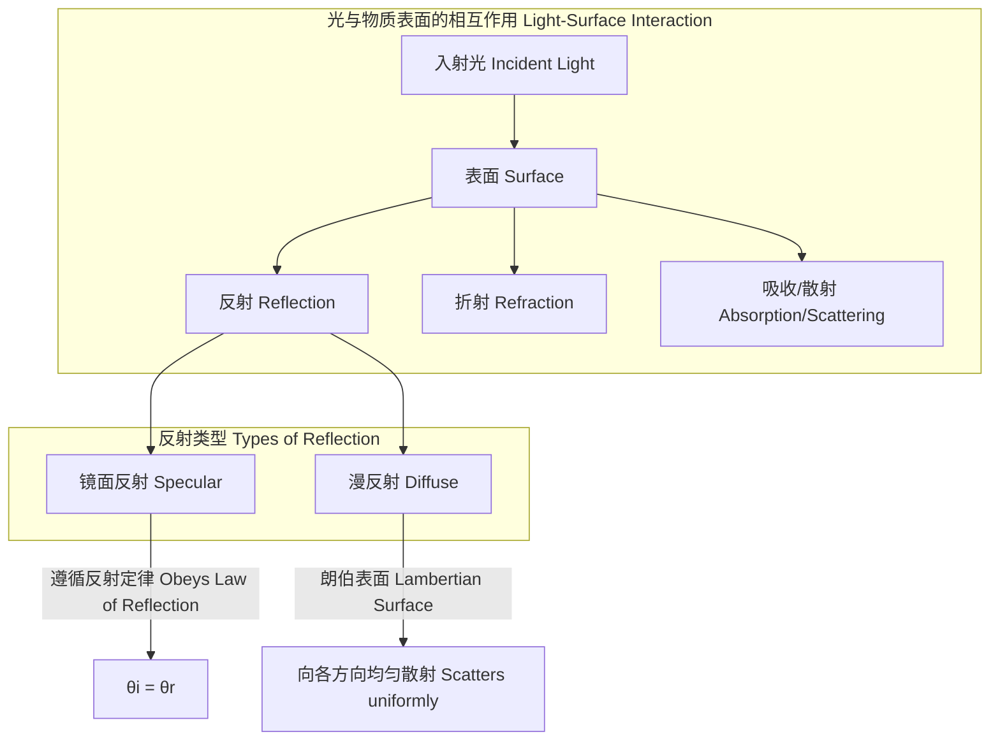

## 反射定律 (Law of Reflection)

反射定律是几何光学中的一个基本原理，描述了光（或其他波）在两种不同介质的界面上发生反射时，其传播方向所遵循的规律。该定律对于光滑表面（相对于波长而言）的镜面反射尤其精确。

### 核心概念与数学基础

反射定律由两个独立的部分组成，它们共同定义了反射光线的行为。

1.  **第一定律**: 入射光线、反射光线和界面在入射点的法线，三者位于同一平面内。这个平面被称为“入射平面”。
2.  **第二定律**: 反射角等于入射角。两个角度都是光线与法线之间的夹角。

#### 数学表述

##### 标量形式
最常见的表述形式是角度关系：
$$ \theta_r = \theta_i $$
其中：
*   $\theta_i$ (Angle of Incidence) 是入射角，即入射光线与表面法线之间的夹角，取值范围为 $[0, \pi/2]$。
*   $\theta_r$ (Angle of Reflection) 是反射角，即反射光线与表面法线之间的夹角，取值范围为 $[0, \pi/2]$。

##### 矢量形式
在计算物理、计算机图形学和高级光学分析中，使用矢量形式更为通用和强大，因为它无需显式计算角度。

假设：
*   $\mathbf{\hat{d}}$ 是指向表面的入射光方向的单位矢量。
*   $\mathbf{\hat{n}}$ 是在入射点处指向界面外部的单位法线矢量。
*   $\mathbf{\hat{r}}$ 是离开表面的反射光方向的单位矢量。

反射矢量 $\mathbf{\hat{r}}$ 可以通过以下公式计算得出：
$$ \mathbf{\hat{r}} = \mathbf{\hat{d}} - 2(\mathbf{\hat{d}} \cdot \mathbf{\hat{n}})\mathbf{\hat{n}} $$
**公式解析**:
*   $\mathbf{\hat{d}} \cdot \mathbf{\hat{n}}$ 是 $\mathbf{\hat{d}}$ 在 $\mathbf{\hat{n}}$ 上的投影的标量长度。由于 $\mathbf{\hat{d}}$ 指向表面，该点积的值为负，其大小为 $\cos(\theta_i)$。
*   $2(\mathbf{\hat{d}} \cdot \mathbf{\hat{n}})\mathbf{\hat{n}}$ 是一个矢量，其方向与法线 $\mathbf{\hat{n}}$ 相同（或相反），长度是入射矢量法向分量的两倍。
*   从 $\mathbf{\hat{d}}$ 中减去这个矢量，相当于将 $\mathbf{\hat{d}}$ 的法向分量反向，而保持其切向分量不变，从而精确地计算出反射矢量 $\mathbf{\hat{r}}$。

此矢量公式是所有基于光线追踪的渲染和仿真系统的核心。

### 关键技术规格

反射现象的质量和效率取决于多种物理参数。

| 参数 (Parameter) | 符号 (Symbol) | 典型值 (Typical Value) | 单位 (Unit) | 描述 (Description) |
| :--- | :---: | :--- | :---: | :--- |
| 反射率 (Reflectivity) | $R$ | 0.999+ (电介质镜), ~0.95 (银膜) | 无量纲 | 反射功率与入射功率之比，是波长和入射角的函数。 |
| 均方根表面粗糙度 (RMS Surface Roughness) | $R_q$ 或 $\sigma$ | < 1 nm (精密光学镜片) | 米 (m) | 表面高度变化的统计量度。决定了反射是镜面反射还是漫反射。 |
| 入射波长 (Wavelength) | $\lambda$ | 400-700 (可见光) | 纳米 (nm) | 入射电磁波的波长。 |
| 入射角 (Angle of Incidence) | $\theta_i$ | 0 - 90 | 度 (°) | 入射光线与法线之间的夹角。 |

### 常见应用案例

反射定律是众多技术和自然现象的基础。

| 应用领域 (Application) | 关键性能指标 (Key Performance Metric) | 典型值 (Typical Value) | 备注 (Notes) |
| :--- | :--- | :--- | :--- |
| 天文望远镜主镜 | 平均反射率 (可见光谱) | > 97% (保护性铝膜) | 需要极高的表面精度，如 $\lambda/20$ RMS，以避免图像失真。 |
| 激光谐振腔镜 | 峰值反射率 | > 99.99% @ 设计波长 | 通常使用多层电介质膜，以实现高反射率和高激光损伤阈值。 |
| 隐形技术 (如 F-117) | 雷达散射截面 (RCS) 减小量 | -30 至 -50 dBsm | 利用多面体外形将雷达波反射到远离发射源的方向。 |
| 光纤通信 | 全内反射 (TIR) 临界角 | ~41.8° (石英-空气界面) | TIR 是一种理想的反射 (R=1)，其本质是斯涅尔定律在极限情况下的应用。 |

### 实现考量

在计算模型（如光线追踪）中，反射定律的实现是一个定义明确的算法步骤。

#### 算法流程
对于单个光线与单个表面的交互：
1.  **求交**：计算光线 $\mathbf{P}(t) = \mathbf{O} + t\mathbf{\hat{d}}$ 与场景中物体的表面方程的交点 $\mathbf{P}_{int}$。
2.  **计算法线**：在交点 $\mathbf{P}_{int}$ 处，计算表面的单位法线矢量 $\mathbf{\hat{n}}$。对于曲面，法线取决于交点位置。
3.  **计算反射矢量**：使用矢量公式 $\mathbf{\hat{r}} = \mathbf{\hat{d}} - 2(\mathbf{\hat{d}} \cdot \mathbf{\hat{n}})\mathbf{\hat{n}}$ 计算出反射光线的方向 $\mathbf{\hat{r}}$。
4.  **生成新光线**：以 $\mathbf{P}_{int}$ 为起点，$\mathbf{\hat{r}}$ 为方向，生成一条新的反射光线进行追踪。

#### 算法复杂度分析
*   **单次反射事件**: $O(1)$。反射矢量的计算只涉及几次点积、标量乘法和矢量减法，这些都是常数时间操作。
*   **完整光线追踪场景**: 复杂度的瓶颈在于步骤1的求交计算。对于一个包含 $N$ 个物体的场景：
    *   暴力法：$O(N)$
    *   使用空间加速结构（如 k-d 树或边界体积层次结构, BVH）：平均情况下为 $O(\log N)$。

### 性能特征

理想的反射定律适用于完美的镜面。在现实世界中，表面不完美性会显著影响反射的性能。

#### 表面粗糙度与镜面反射
**瑞利判据 (Rayleigh Criterion)** 定义了一个表面在光学上是否被视为“光滑”的阈值。如果表面高度起伏 $h$ 满足以下条件，则该表面主要产生镜面反射：
$$ h < \frac{\lambda}{8 \cos \theta_i} $$
其中：
*   $h$ 是表面不规则性的最大高度。
*   $\lambda$ 是入射辐射的波长。
*   $\theta_i$ 是入射角。

当表面粗糙度超过此判据时，漫反射分量开始占主导地位，镜面反射的强度会急剧下降，能量被散射到多个方向。

#### 统计模型：双向反射分布函数 (BRDF)
BRDF 是一个更全面的物理模型，用于描述光如何从一个不透明表面反射。它定义为出射辐射亮度与入射辐照度之比。
$$ f_r(\omega_i, \omega_o) = \frac{dL_o(\omega_o)}{dE_i(\omega_i)} = \frac{dL_o(\omega_o)}{L_i(\omega_i) \cos\theta_i d\omega_i} $$
渲染方程中使用的形式为：
$$ L_o(\omega_o) = \int_{\Omega} f_r(\omega_i, \omega_o) L_i(\omega_i) (\mathbf{\hat{n}} \cdot \omega_i) d\omega_i $$
其中：
*   $L_o, L_i$ 分别是出射和入射辐射亮度 (radiance)。
*   $f_r(\omega_i, \omega_o)$ 是 BRDF 函数。
*   $\omega_i, \omega_o$ 分别是入射和出射方向的立体角。
*   $\mathbf{\hat{n}}$ 是表面法线。

纯粹的镜面反射（由反射定律描述）可以在BRDF框架中用狄拉克δ函数表示，即反射能量完全集中在一个方向上。

### 相关技术与数学模型比较

反射定律是光与物质相互作用的几种基本现象之一。

#### 折射 (斯涅尔定律, Snell's Law)
描述光线穿过不同折射率介质界面时路径发生的偏折。
*   **标量形式**:
    $$ n_1 \sin \theta_1 = n_2 \sin \theta_2 $$
    *   $n_1, n_2$：介质1和介质2的折射率。
    *   $\theta_1, \theta_2$：相对于法线的入射角和折射角。
*   **比较**: 反射定律处理被“弹回”的光，而斯涅尔定律处理“穿过”的光。它们共同描述了界面上的能量分配（由菲涅尔方程量化）。

#### 衍射 (惠更斯-菲涅尔原理, Huygens-Fresnel Principle)
这是一种波动光学模型，它认为波前的每一点都可以看作是产生球面次级子波的新波源。
*   **原理**: 衍射解释了为什么波会绕过障碍物边缘发生弯曲，这是几何光学（包括反射定律）无法解释的现象。当障碍物或孔径的尺寸与光的波长相当时，衍射效应变得显著。
*   **数学形式 (基尔霍夫衍射公式)**:
    $$ U(P) = \frac{A}{i\lambda} \iint_S \frac{e^{ik(r+s)}}{rs} \left[ \frac{\cos(\mathbf{\hat{n}}, \mathbf{r}) - \cos(\mathbf{\hat{n}}, \mathbf{s})}{2} \right] dS $$
    *   $U(P)$：P点的复振幅。
    *   $A, \lambda, k$：分别为源振幅、波长和波数。
    *   $r, s$：从波源和P点到孔径S上一点的距离。
*   **比较**: 反射定律是波动光学在波长远小于表面尺寸时的几何近似。衍射是一个更基本的原理，可以解释所有波的传播行为。

### 参考文献

*   Hecht, E. (2017). *Optics* (5th ed.). Pearson. (A comprehensive textbook on fundamental and advanced optics).
*   Whitted, T. (1980). An improved illumination model for shaded display. *Communications of the ACM*, 23(6), 343–349. DOI: [10.1145/358876.358882](https://doi.org/10.1145/358876.358882) (A foundational paper in computer graphics that heavily relies on the vector form of the law of reflection for ray tracing).
*   Cook, R. L., & Torrance, K. E. (1982). A reflectance model for computer graphics. *ACM Transactions on Graphics (TOG)*, 1(1), 7–24. DOI: [10.1145/357290.357293](https://doi.org/10.1145/357290.357293) (Introduced a physically-based BRDF model that incorporates microfacet theory, building upon the principles of geometric reflection).