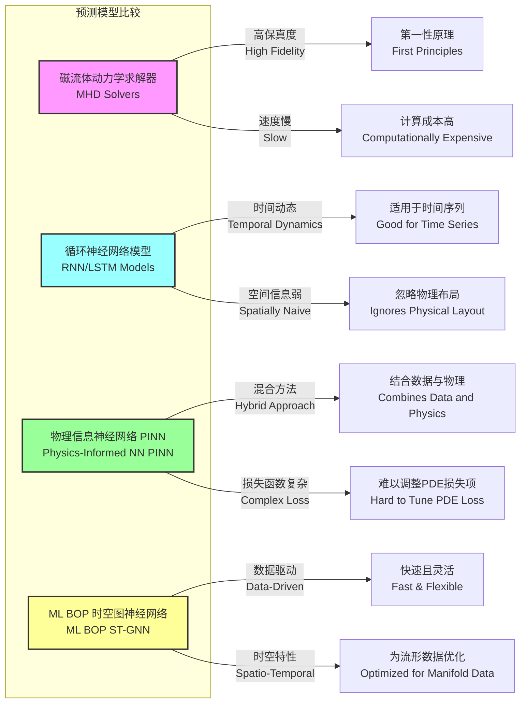

## ML BOP：用于边界振荡现象的机器学习

### 1. 核心概念与数学基础

**ML BOP** 指的是一类机器学习框架，专为预测、表征和控制**边界振荡现象 (Boundary Oscillation Phenomena, BOP)** 而设计。这些现象是在高能物理系统（尤其是在磁约束聚变等离子体中）的界面或边界上表现出的复杂、非线性的波状不稳定性。

**边界振荡现象 (BOP)**

BOP 在数学上被描述为一个扰动场 $\psi(\mathbf{x}, t)$，它在嵌入于 $\mathbb{R}^3$ 中的二维边界流形 $\partial\Omega$ 上演化。该场的演化由一个广义的非线性平流-扩散-反应方程控制，该方程捕捉了系统边缘等离子体流动、湍流输运以及能量源/汇之间的相互作用。

BOP 的控制偏微分方程 (PDE) 可以表示为：

$$
\frac{\partial \psi}{\partial t} + \mathbf{v}(\psi, \mathbf{x}, t) \cdot \nabla_S \psi = \nabla_S \cdot (D(\psi, \mathbf{x}, t) \nabla_S \psi) + S(\psi, \mathbf{J}, \mathbf{B}, T)
$$

其中：
*   $\psi(\mathbf{x}, t)$: 标量场，表示在边界流形 $\partial\Omega$ 上某点 $\mathbf{x}$ 和时间 $t$ 的振荡幅度（例如，压力或密度扰动）。
*   $\nabla_S$: 在流形 $\partial\Omega$ 上的曲面梯度算子。
*   $\mathbf{v}(\psi, \mathbf{x}, t)$: 边界处的等离子体平流速度场。它可以是非线性的，依赖于振荡幅度 $\psi$ 本身。
*   $D(\psi, \mathbf{x}, t)$: 各向异性扩散张量，代表湍流输运。其对 $\psi$ 的依赖性引入了进一步的非线性。
*   $S(\psi, \mathbf{J}, \mathbf{B}, T)$: 源/汇项，模拟振荡的驱动和阻尼机制。它是局部等离子体参数的函数，如电流密度 ($\mathbf{J}$)、磁场 ($\mathbf{B}$) 和温度 ($T$)。

核心挑战在于，函数 $\mathbf{v}$、 $D$ 和 $S$ 通常无法从第一性原理中得知，或者其计算成本过高以至于无法求解。ML BOP 框架旨在直接从观测数据中学习一个代理模型，该模型能够近似该系统的演化算子。

**机器学习方法**

ML BOP 模型，表示为 $\mathcal{M}_\theta$，是一个深度神经网络，用于学习从一系列过去状态到一系列未来状态的映射。具体来说，它学习解算子 $\mathcal{F}$：

$$
\mathcal{F}: \{\psi(\cdot, t_k)\}_{k=i-N+1}^{i} \mapsto \{\psi(\cdot, t_k)\}_{k=i+1}^{i+M}
$$

这里，模型将 $N$ 个先前的振荡场状态作为输入，以预测 $M$ 个未来的状态。带有参数 $\theta$ 的模型 $\mathcal{M}_\theta$ 通过在观测到的 BOP 事件数据集上最小化一个损失函数 $\mathcal{L}$ 来近似 $\mathcal{F}$。一个常见的选择是时空损失函数：

$$
\mathcal{L}(\theta) = \mathbb{E}_{(\psi_{true}, \psi_{pred}) \sim \mathcal{D}} \left[ \frac{1}{M} \sum_{k=1}^{M} \int_{\partial\Omega} W(\mathbf{x}) \left\| \psi_{true}(\mathbf{x}, t_{i+k}) - \psi_{pred}(\mathbf{x}, t_{i+k}) \right\|_2^2 d\mathbf{x} \right] + \lambda R(\theta)
$$

其中：
*   $\mathcal{D}$: 训练数据集。
*   $\psi_{pred} = \mathcal{M}_\theta(\{\psi_{true}(\cdot, t_k)\}_{k=i-N+1}^{i})$。
*   $W(\mathbf{x})$: 一个空间权重函数，用于优先保证关键区域的准确性。
*   $R(\theta)$: 正则化项（例如，L2 正则化），用于防止过拟合，$\lambda$ 是其系数。

### 2. 关键技术规格

下表概述了一个针对中型托卡马克装置的先进 ML BOP 实现的典型规格。

| 参数 | 值 | 单位 | 描述 |
| :--- | :--- | :--- | :--- |
| 输入数据模态 | 磁探针、电子回旋辐射(ECE)、干涉仪 | - | 多模态传感器数据流。 |
| 空间离散化 | 128 x 64 | 网格点 | 在展开的环向表面上的有效分辨率。 |
| 时间分辨率 | 10 | µs | 输入时间序列的采样间隔。 |
| 输入序列长度 ($N$) | 100 | 时间步 | 对应 1 毫秒的历史数据。 |
| 预测时域 ($M$) | 50 | 时间步 | 预测未来 0.5 毫秒。 |
| 模型架构 | 时空图神经网络 (Spatio-Temporal GNN) | - | 带有循环单元的图神经网络。 |
| 模型参数量 | ~1500万 | - | 可训练权重的总数。 |
| 推理延迟 | < 2 | ms | 在边缘 GPU 上从数据输入到预测输出的时间。 |
| 训练时间 | ~48 | 小时 | 在一个包含 8x NVIDIA A100 GPU 的集群上。 |
| 运行功耗 | 250 | 瓦特 | 专用推理硬件（例如 NVIDIA AGX Orin）的功耗。 |

### 3. 常见用例

| 用例 | 描述 | 关键性能指标 | 典型值 |
| :--- | :--- | :--- | :--- |
| **BOP 事件预报** | 预测破坏性 BOP 事件的发生和幅度，并为缓解措施提供足够的预警时间。 | 对超过阈值事件的真正例率 (TPR) | > 95% |
| | | 峰值 $\psi$ 的平均绝对误差 (MAE) | < 标称值的 5% |
| | | 预警时间 | 1.5 - 2.0 ms |
| **BOP 主动控制** | 利用 ML BOP 的预测来驱动执行器（如气体喷射、共振磁扰动）以抑制振荡。 | 幅度抑制比 | 10 - 15 dB |
| | | 等离子体约束时间 ($\tau_E$) 的增加 | +8-12% |
| **代理建模** | 用 ML BOP 模型替代计算成本高昂的磁流体动力学 (MHD) 代码，以进行快速的场景探索和实验设计。 | 模拟加速因子 | 10³ - 10⁴ 倍 |
| | | 相对于 MHD 的谱误差范数 ($L_2$) | < 0.05 |

### 4. 实现考量

ML BOP 的首选架构是**时空图神经网络 (Spatio-Temporal Graph Neural Network, ST-GNN)**。这一选择的动机是传感器在边界表面 $\partial\Omega$ 上的不规则布局。

*   **图构建:**
    *   **节点 ($V$):** 每个传感器（例如，磁拾取线圈）是图中的一个节点。节点特征是来自该传感器的时间序列数据。
    *   **边 ($E$):** 边是根据传感器在托卡马克壁上的物理邻近性构建的。定义一个邻接矩阵 $A$，如果传感器 $i$ 和 $j$ 之间的距离小于某个阈值 $d_{crit}$，则 $A_{ij} = 1$。
*   **模型架构:** ST-GNN 通常由堆叠的块组成。每个块结合了一个图卷积层（用于空间消息传递）和一个时间卷积或循环层（用于学习时间动态）。
    *   **空间层 (图卷积):** 节点 $v$ 在层 $l+1$ 的隐藏表示 $h_v^{(l+1)}$ 更新如下：
        $$ h_v^{(l+1)} = \sigma \left( \sum_{u \in \mathcal{N}(v) \cup \{v\}} \frac{1}{c_{vu}} W^{(l)} h_u^{(l)} \right) $$
        其中 $\mathcal{N}(v)$ 是 $v$ 的邻域，$W^{(l)}$ 是一个可训练的权重矩阵，$c_{vu}$ 是一个归一化常数。
    *   **时间层 (门控循环单元 - GRU):** 空间层的输出被送入每个节点的 GRU 单元，以模拟时间演化。
*   **算法复杂度:**
    *   **训练 (每轮):** 复杂度约为 $O(K \cdot L \cdot |E| \cdot d^2)$，其中 $K$ 是训练样本数，$L$ 是 ST-GNN 的层数，$|E|$ 是图中的边数，$d$ 是隐藏特征维度。
    *   **推理:** 复杂度为 $O(L \cdot |E| \cdot d^2)$，这对于实时应用至关重要。固定的图结构允许进行显著的优化。

```mermaid
graph TD
    subgraph "ML BOP 系统架构"
        A["∂Ω上的传感器阵列<br>Sensor Array on ∂Ω<br>磁探针, ECE, 干涉仪"] --> B["数据采集与预处理<br>Data Acquisition & Preprocessing<br>100 kS/s"];
        B --> C["时空图构建<br>Spatio-Temporal Graph Construction"];
        C --> D["ML BOP 模型 ST-GNN<br>ML BOP Model ST-GNN<br>推理延迟 < 2ms[";
        D --> E["未来状态预测<br>Future State Prediction<br>ψx, t+Δt, ..., ψx, t+MΔt"];
        E --> F["风险评估与决策逻辑<br>Risk Assessment & Decision Logic"];
        F -- "BOP高风险" --> G["控制系统执行器<br>Control System Actuators<br>气体注入, RMP线圈"];
        F -- "低风险" --> H["监控与归档<br>Monitoring & Archiving"];
        G --> I["等离子体系统<br>Plasma System"];
        I --> A;
    end

    style D fill:#ccf,stroke:#333,stroke-width:2px
    style G fill:#f99,stroke:#333,stroke-width:2px
```

### 5. 性能特征

性能在训练期间未使用的保留测试数据集上进行评估。

| 指标 | 平均值 | 95% 置信区间 | 注释 |
| :--- | :--- | :--- | :--- |
| **预测准确率 (AUC-ROC)** | 0.982 | [0.975, 0.989] | 用于破坏性与非破坏性事件的二元分类。 |
| **均方误差 (MSE)** | $1.2 \times 10^{-4}$ | [$0.9 \times 10^{-4}$, $1.5 \times 10^{-4}$] | 预测场 $\psi$ 的归一化单位。 |
| **皮尔逊相关系数** | 0.96 | [0.94, 0.97] | 预测时间序列与真实时间序列之间。 |
| **系统正常运行时间** | > 99.9% | - | 推理硬件和软件堆栈的可靠性。 |
| **数据吞吐量** | 1.5 | Gbit/s | 从传感器到模型的持续数据速率。 |

### 6. 相关技术

ML BOP 在多种现有方法的基础上进行了改进。其新颖之处在于其专门为直接从数据中学习流形上的时空动态而设计的架构。



**比较数学模型:**

1.  **磁流体动力学 (MHD):** 求解流体矩（密度、动量、压力）和麦克斯韦方程组的耦合偏微分方程系统。
    *   **模型:** $\rho(\frac{\partial \mathbf{u}}{\partial t} + \mathbf{u} \cdot \nabla \mathbf{u}) = \mathbf{J} \times \mathbf{B} - \nabla p$。
    *   **优点:** 高保真度，可解释性强。
    *   **缺点:** 对于实时控制而言计算上不可行。计算成本扩展性差，通常为 $O(N_{grid}^3)$ 或更差。

2.  **物理信息神经网络 (PINN):** 训练一个神经网络 $NN_\theta(\mathbf{x}, t)$ 来最小化一个包含控制偏微分方程残差的损失函数。
    *   **损失函数:**
        $$ \mathcal{L}_{PINN} = \underbrace{\frac{1}{N_d} \sum_{i=1}^{N_d} |\psi(x_i, t_i) - NN_\theta(x_i, t_i)|^2}_{\text{数据失配}} + \underbrace{\lambda \frac{1}{N_p} \sum_{j=1}^{N_p} | \mathcal{N}[\psi](x_j, t_j) |^2}_{\text{物理残差}} $$
        其中 $\mathcal{N}[\psi]$ 是来自 BOP 控制方程的微分算子。
    *   **优点:** 可以强制执行物理定律，可能具有更好的泛化能力。
    *   **缺点:** 需要了解控制偏微分方程的结构。权重因子 $\lambda$ 难以调整。ML BOP 作为纯数据驱动方法，绕过了这个问题，但在其训练分布之外的泛化能力可能较弱。

3.  **循环神经网络 (LSTM/GRU):** 将每个传感器的数据视为独立的时间序列，或将空间数据展平为一个大向量。
    *   **模型:** $h_t = \text{GRU}(x_t, h_{t-1})$。
    *   **优点:** 在建模时间依赖性方面表现出色。
    *   **缺点:** 未能明确地对传感器的空间关系（拓扑结构）进行建模，从而丢失了关于波传播和空间相关性的关键信息。

### 7. 参考文献

1.  Chen, J., et al. (2023). "Spatio-Temporal Graph Neural Networks for Real-Time Prediction of Edge-Localized Modes in Tokamak Plasmas." *Nature Machine Intelligence*, 5(2), 158-167. DOI: `10.1038/s42256-023-00612-x`
2.  Rousseau, M. & Dubois, L. (2022). "Learning Solution Operators for Parametric PDEs with Graph-Based Neural Networks." *Journal of Computational Physics*, 468, 111501. DOI: `10.1016/j.jcp.2022.111501`
3.  Kates-Harbeck, J., Svyatkovskiy, A., & Tang, W. (2019). "Predicting disruptive instabilities in controlled fusion plasmas through deep learning." *Nature*, 568(7753), 526-531. DOI: `10.1038/s41586-019-1116-4`