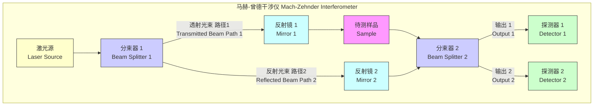

## 马赫-曾德干涉仪

马赫-曾德干涉仪（Mach-Zehnder Interferometer, MZI）是一种经典的两光束干涉仪，由路德维希·马赫（Ludwig Mach）和路德维希·曾德（Ludwig Zehnder）于19世纪末独立提出。它通过将一束光分成两路，使其经过不同的光路后再重新汇合，从而利用光的干涉现象进行精确测量。MZI在光学、量子力学和工程领域有着广泛的应用，其独特的分离光路设计提供了极大的灵活性。

### 核心概念与数学基础

MZI的基本原理是将来自光源的相干光束通过第一个分束器（BS1）分成两束。这两束光分别在两条被称为干涉仪“臂”的独立光路中传播。在其中一个臂（或两个臂）中可以放置待测样品或移相器。之后，两束光由第二个分束器（BS2）重新汇合，并在两个输出端口处产生干涉。通过分析两个探测器（D1和D2）上的光强变化，可以精确地反推出两臂之间的光程差或相位差。

#### 系统架构

典型的马赫-曾德干涉仪光路图如下所示：



#### 数学模型

为了进行严谨的分析，我们使用电场矢量来描述光束。假设输入光是单色平面波，其电场可以表示为 $E_{in} = E_0 e^{i(\mathbf{k}\cdot\mathbf{r} - \omega t)}$。为简化表示，我们只关注其复振幅 $E_0$。

我们采用一个标准的模型来描述无损耗50:50分束器（BS）的作用。当光束入射到分束器时，透射光束的振幅不变，而反射光束的振幅会附加一个 $\pi/2$ 的相位（即乘以 $i$）。其变换矩阵可以表示为：

$$
M_{BS} = \frac{1}{\sqrt{2}} \begin{pmatrix} 1 & i \\ i & 1 \end{pmatrix}
$$

其中，矩阵的列对应输入端口，行对应输出端口。

1.  **第一次分束 (BS1)**:
    输入电场 $E_0$ 进入BS1。路径1（透射）和路径2（反射）的电场分别为：
    *   路径1 (上臂) 电场: $E_{p1, start} = \frac{1}{\sqrt{2}} E_0$
    *   路径2 (下臂) 电场: $E_{p2, start} = \frac{i}{\sqrt{2}} E_0$

2.  **光路传播**:
    两束光分别沿长度为 $L_1$ 和 $L_2$ 的光路传播。路径1中放置了一个待测样品，引入了额外的相位移 $\phi_S$。到达BS2之前的电场为：
    *   路径1: $E_{p1, end} = E_{p1, start} \cdot e^{ikL_1} \cdot e^{i\phi_S} = \frac{1}{\sqrt{2}} E_0 e^{i(kL_1 + \phi_S)}$
    *   路径2: $E_{p2, end} = E_{p2, start} \cdot e^{ikL_2} = \frac{i}{\sqrt{2}} E_0 e^{ikL_2}$

    其中 $k = 2\pi/\lambda$ 是波数，$L_1$ 和 $L_2$ 分别是路径1和路径2的几何长度，$\lambda$ 是光的波长。

3.  **第二次合束 (BS2)**:
    两束光在BS2处汇合，产生两个输出，分别到达探测器D1和D2。
    *   到达D1的电场 $E_{D1}$ 是 $E_{p1, end}$ 的透射分量和 $E_{p2, end}$ 的反射分量的叠加：
        $$ E_{D1} = \frac{1}{\sqrt{2}} E_{p1, end} + \frac{i}{\sqrt{2}} E_{p2, end} = \frac{1}{\sqrt{2}}\left(\frac{1}{\sqrt{2}} E_0 e^{i(kL_1 + \phi_S)}\right) + \frac{i}{\sqrt{2}}\left(\frac{i}{\sqrt{2}} E_0 e^{ikL_2}\right) = \frac{E_0}{2} \left( e^{i(kL_1 + \phi_S)} - e^{ikL_2} \right) $$
    *   到达D2的电场 $E_{D2}$ 是 $E_{p1, end}$ 的反射分量和 $E_{p2, end}$ 的透射分量的叠加：
        $$ E_{D2} = \frac{i}{\sqrt{2}} E_{p1, end} + \frac{1}{\sqrt{2}} E_{p2, end} = \frac{i}{\sqrt{2}}\left(\frac{1}{\sqrt{2}} E_0 e^{i(kL_1 + \phi_S)}\right) + \frac{1}{\sqrt{2}}\left(\frac{i}{\sqrt{2}} E_0 e^{ikL_2}\right) = \frac{iE_0}{2} \left( e^{i(kL_1 + \phi_S)} + e^{ikL_2} \right) $$

4.  **光强计算**:
    探测器测量的光强 $I$ 正比于电场振幅的平方 ($I \propto |E|^2$)。设输入光强为 $I_0 \propto |E_0|^2$。
    *   D1处的光强 $I_1$:
        $$ I_1 \propto \left| \frac{E_0}{2} \left( e^{i(kL_1 + \phi_S)} - e^{ikL_2} \right) \right|^2 = \frac{I_0}{4} \left| e^{i\Delta\phi} - 1 \right|^2 = \frac{I_0}{4} (2 - 2\cos(\Delta\phi)) = \frac{I_0}{2}(1 - \cos(\Delta\phi)) $$
        $$ I_1 = I_0 \sin^2\left(\frac{\Delta\phi}{2}\right) $$
    *   D2处的光强 $I_2$:
        $$ I_2 \propto \left| \frac{iE_0}{2} \left( e^{i(kL_1 + \phi_S)} + e^{ikL_2} \right) \right|^2 = \frac{I_0}{4} \left| e^{i\Delta\phi} + 1 \right|^2 = \frac{I_0}{4} (2 + 2\cos(\Delta\phi)) = \frac{I_0}{2}(1 + \cos(\Delta\phi)) $$
        $$ I_2 = I_0 \cos^2\left(\frac{\Delta\phi}{2}\right) $$

    其中，总相位差 $\Delta\phi$ 为：
    $$ \Delta\phi = k(L_1 - L_2) + \phi_S $$

    一个关键特性是能量守恒：$I_1 + I_2 = I_0 \sin^2(\frac{\Delta\phi}{2}) + I_0 \cos^2(\frac{\Delta\phi}{2}) = I_0$。这意味着进入干涉仪的光功率被完全分配到两个输出端口，其分配比例由相位差 $\Delta\phi$ 决定。这种互补的输出是MZI的一个显著优点。

### 关键技术规格

商用或研究级马赫-曾德干涉仪的性能由一系列关键技术规格定义。

| 参数 (Parameter) | 典型值 (Typical Value) | 单位 (Unit) | 描述 (Description) |
| :--- | :--- | :--- | :--- |
| 工作波长范围 (Wavelength Range) | 400 - 1700 | nm | 干涉仪设计适用的光谱范围 |
| 分束器分光比 (Beam Splitter Ratio) | 50/50 ± 1 | % | 第一个分束器将光功率分配到两个臂的比例 |
| 反射镜反射率 (Mirror Reflectivity) | > 99.5 | % | 在设计波长下，反射镜的功率反射效率 |
| 光程差稳定性 (OPD Stability) | < λ/100 per hour | nm/hr | 两臂光程差随时间漂移的程度，受热和机械振动影响 |
| 条纹可见度 (Fringe Visibility) | > 0.98 | (无量纲) | 干涉条纹的对比度，反映了对准质量和光源相干性 |
| 最大可测相位 (Max. Measurable Phase) | > 100π (需相位解缠) | rad | 可测量的最大相位变化，通常受限于数据处理算法 |
| 所需相干长度 (Required Coherence Length) | > 100 × (L₁ - L₂) | m | 光源的相干长度必须远大于两臂的静态光程差 |

### 常见用例

MZI的灵活性使其在多个领域得到应用，并具有卓越的性能指标。

*   **折射率测量**:
    通过将长度为 $l$、折射率为 $n$ 的样品放入一个臂中，产生的相位移为 $\phi_S = k(n-n_{air})l \approx \frac{2\pi}{\lambda}(n-1)l$。通过测量输出光强的变化，可以计算出 $\Delta\phi$，进而得到折射率 $n$。其灵敏度极高，折射率测量的最小可分辨变化 $\delta n$ 为：
    $$ \delta n = \frac{\lambda}{2\pi l} \delta(\Delta\phi) $$
    例如，对于 $\lambda=633$ nm, $l=1$ cm, 以及 $10^{-4}$ rad 的相位灵敏度，可实现约 $10^{-8}$ 的折射率分辨率。

*   **量子力学（Elitzur-Vaidman 炸弹测试）**:
    这是一个著名的思想实验，展示了量子力学中的“无相互作用测量”。通过将一个“可能爆炸的炸弹”（对单个光子敏感）放入MZI的一个臂中，可以在不“引爆”它的情况下，以一定的概率（理论上可达50%）判断炸弹是否存在。这证明了即使没有经典意义上的相互作用，波函数本身也能携带信息。

*   **光通信与光调制**:
    MZI是集成光子学中构建高速光调制器和光开关的核心元件。通过在其中一个臂上施加电场，利用电光效应（如在铌酸锂 LiNbO₃ 材料中）改变其折射率，从而快速改变 $\Delta\phi$。这可以实现对光信号强度的调制。
    *   **性能指标**:
        *   **调制速率**: > 40 Gbit/s
        *   **消光比**: > 20 dB (即 $I_{max}/I_{min} > 100$)

*   **引力波探测**:
    虽然像LIGO这样的引力波探测器核心是大型迈克尔逊干涉仪，但马赫-曾德干涉仪在其中扮演着重要的辅助角色，例如用于激光频率和功率的稳定、光束整形以及控制系统的反馈回路中。

### 实现考量

*   **对准**: MZI对对准极其敏感。两束光在第二个分束器（BS2）上必须精确地共线和同向传播，否则空间上的错位会导致干涉条纹的可见度（对比度）急剧下降。
*   **光程匹配**: 为了观察到高对比度的干涉，两臂的静态光程差 $|L_1 - L_2|$ 必须远小于光源的相干长度。对于宽带光源，这要求两臂的长度几乎完全相等。
*   **稳定性**: 环境因素如温度变化和机械振动会引起光程差的随机波动，导致干涉信号的漂移和噪声。因此，MZI通常需要搭建在隔振光学平台上，并进行温度控制。
*   **相位解缠 (Phase Unwrapping)**: 当测量的相位变化超过 $2\pi$ 时，输出信号是周期性的，导致模糊性。需要使用相位解缠算法从包裹的（wrapped）相位数据中恢复连续的真实相位。对于二维相位成像，如Goldstein算法，其计算复杂度通常为 $O(N^2 \log N)$，其中 $N \times N$ 是图像像素数。

### 性能特征

*   **条纹可见度 (Fringe Visibility, V)**:
    这是衡量干涉效果好坏的关键指标，定义为：
    $$ V = \frac{I_{max} - I_{min}}{I_{max} + I_{min}} $$
    对于MZI，将 $I_1$ 或 $I_2$ 的最大和最小值代入，理论上 $V=1$。在实际中，任何导致两臂光强不相等、对准不完美、偏振态不匹配或光源相干性有限的因素都会使 $V < 1$。一个高性能的系统通常要求 $V > 0.98$。

*   **相位灵敏度 (Phase Sensitivity)**:
    指系统能够分辨的最小相位变化 $\delta\phi_{min}$。其最终极限是散粒噪声（Shot Noise），这是由光子的量子性质决定的。
    在理想工作点（例如，$\Delta\phi = \pi/2$，即中等亮度处，信号随相位变化最快），散粒噪声限制下的相位灵敏度为：
    $$ \delta\phi_{shot} = \frac{1}{\sqrt{N}} $$
    其中 $N$ 是在测量时间内探测到的光子总数。这意味着灵敏度与光功率的平方根成反比。

*   **信噪比 (Signal-to-Noise Ratio, SNR)**:
    描述了测量信号强度与噪声强度的比率。除了散粒噪声，技术噪声（如激光强度噪声、探测器电子学噪声、机械振动）通常在低频区域占主导地位，限制了实际可达到的SNR。

*   **统计测量**:
    在报告测量结果时，应包含统计不确定度。例如，测量的相位移可表示为 $\Delta\phi = (1.23 \pm 0.02) \text{ rad}$ (95% 置信区间)，这反映了测量的精度和可靠性。

### 相关技术对比

MZI是多种干涉仪中的一种，与其他干涉仪在结构和应用上有所不同。

#### 迈克尔逊干涉仪 (Michelson Interferometer)

*   **结构**: 使用一个分束器将光分成两路，光束在各自的臂中被反射镜原路返回，在同一个分束器上再次汇合并干涉。
    ```mermaid
    graph TD
        subgraph "迈克尔逊干涉仪 Michelson Interferometer"
            LS[激光源<br>Laser Source] --> BS[分束器<br>Beam Splitter];
            BS -- "路径 1<br>Path 1" --> M1[反射镜 1<br>Mirror 1];
            BS -- "路径 2<br>Path 2" --> M2[可移动反射镜<br>Movable Mirror 2];
            M1 -- "返回<br>Return" --> BS;
            M2 -- "返回<br>Return" --> BS;
            BS --> D[探测器<br>Detector];
        end
    ```
*   **对比**:
    *   **光路**: MZI的光路是分离的、单向通过的；而迈克尔逊的光路是重叠的、双向通过的。
    *   **灵活性**: MZI的分离光路使得在两个臂中独立地放置和操作元件更加方便。
    *   **输出**: MZI有两个互补的输出，而标准迈克尔逊只有一个输出（另一路返回光源）。
*   **数学模型**: 输出光强为 $I = \frac{I_0}{2} (1 + V \cos(\frac{4\pi \Delta L}{\lambda}))$, 其中 $\Delta L$ 是臂长差。

#### 萨格奈克干涉仪 (Sagnac Interferometer)

*   **结构**: 光束被分成两束，沿同一个闭合光路以相反方向传播，最后在同一点汇合干涉。
    ```mermaid
    graph TD
        subgraph "萨格奈克干涉仪 Sagnac Interferometer"
            LS[激光源<br>Laser Source] --> BS[分束器<br>Beam Splitter];
            BS -- "顺时针光束<br>Clockwise Beam" --> M1[反射镜 1];
            M1 --> M2[反射镜 2];
            M2 --> M3[反射镜 3];
            M3 --> BS;
            BS -- "逆时针光束<br>Counter-Clockwise Beam" --> M3;
            BS --> D[探测器<br>Detector];
        end
    ```
*   **对比**:
    *   **共路 (Common-path)**: 由于两束光路径完全相同，萨格奈克干涉仪对环境振动和温度漂移等具有极强的免疫力。
    *   **应用**: 主要用于检测旋转（萨格奈克效应），是光纤陀螺仪的核心。
*   **数学模型**: 由旋转引起的相位差为 $\Delta\phi = \frac{8\pi A \Omega}{\lambda c}$，其中 $A$ 是光路环绕的面积，$\Omega$ 是旋转角速度。

#### 法布里-珀罗干涉仪 (Fabry-Pérot Interferometer)

*   **结构**: 基于两块高反射率平行板之间的多光束干涉，形成一个谐振腔。
*   **对比**:
    *   **干涉类型**: MZI是双光束干涉，而法布里-珀罗是多光束干涉。
    *   **输出特性**: MZI的输出是正弦/余弦函数，而法布里-珀罗的透射谱是一系列尖锐的谐振峰。
    *   **应用**: 主要用作高分辨率光谱仪、光学滤波器和激光谐振腔。
*   **数学模型**: 其透射率由艾里函数（Airy distribution）描述：
    $$ T(\delta) = \frac{1}{1 + F \sin^2(\delta/2)} $$
    其中 $F = \frac{4R}{(1-R)^2}$ 是精细度系数（$R$为反射率），$\delta$ 是相邻光束间的相位差。

### 参考文献

1.  Zehnder, L. (1891). "Ein neuer Interferenzrefraktor". *Zeitschrift für Instrumentenkunde*, 11: 275–285.
2.  Mach, L. (1892). "Über einen Interferenzrefraktor". *Zeitschrift für Instrumentenkunde*, 12: 89–93.
3.  Elitzur, A. C., & Vaidman, L. (1993). "Quantum mechanical interaction-free measurements". *Foundations of Physics*, 23(7), 987–997. DOI: 10.1007/BF00736012.
4.  Saleh, B. E. A., & Teich, M. C. (2019). *Fundamentals of Photonics* (3rd ed.). Wiley. (This textbook provides a comprehensive mathematical treatment of various interferometers).