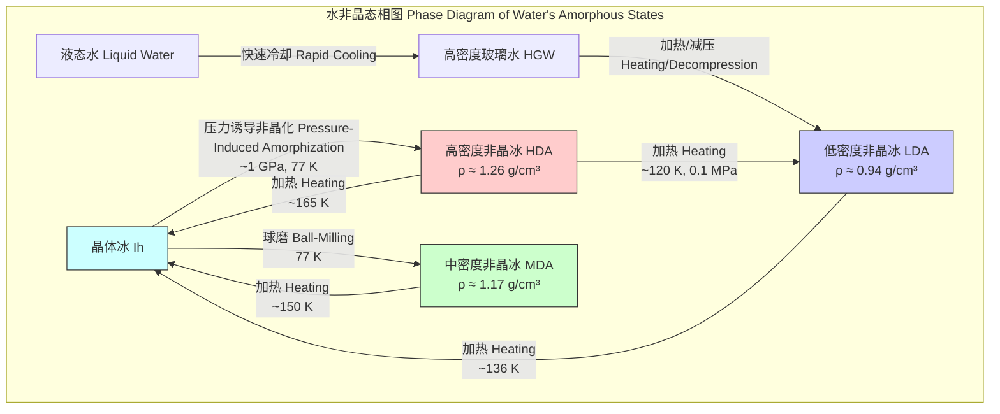

## 中密度非晶冰 (Medium-density amorphous ice)

中密度非晶冰（MDA）是一种非晶态的固态水，其密度介于低密度非晶冰（LDA）和高密度非晶冰（HDA）之间。与具有长程有序晶格结构的晶体冰不同，MDA的特点是水分子呈无序排列，类似于液体的“快照”。它的发现对传统的水的双状态模型提出了挑战，揭示了水可能存在一个更复杂的非晶态物质景观。MDA是通过在低温下对普通六方冰（Ih）进行球磨而制备的。

### 核心概念与数学基础

非晶材料的结构不是通过晶胞来描述，而是通过原子间距离的统计分布来表征。用于此目的的主要数学工具是**对关联函数** $g(r)$ 及其傅里叶变换——**结构因子** $S(Q)$。

#### 对关联函数 ($g(r)$)

对关联函数 $g(r)$ 描述了在一个参考原子中心距离 $r$ 处找到另一个原子中心的概率，该概率是相对于在相同密度下完全随机分布的期望概率而言的。其数学表达式为：

$$ g(r) = \frac{V}{N^2} \left\langle \sum_{i \neq j} \delta(\mathbf{r} - (\mathbf{r}_i - \mathbf{r}_j)) \right\rangle $$

其中：
*   $g(r)$: 对关联函数。
*   $r$: 从参考粒子出发的径向距离。
*   $V$: 系统体积。
*   $N$: 系统中的粒子总数（水分子数量）。
*   $\mathbf{r}_i, \mathbf{r}_j$: 粒子 $i$ 和 $j$ 的位置矢量。
*   $\delta(\mathbf{x})$: 三维狄拉克δ函数。
*   $\langle \dots \rangle$: 系综平均。

对于MDA，$g(r)$ 函数的第一个尖锐峰对应于氢键网络内的氧-氧（O-O）距离，但随后的峰迅速衰减，表明其缺乏长程有序性。这些峰的位置和强度将MDA与LDA和HDA区分开来。

#### 结构因子 ($S(Q)$)

静态结构因子 $S(Q)$ 可通过X射线或中子衍射实验直接测量。它是对关联函数的傅里叶变换。

$$ S(Q) = 1 + \rho_0 \int [g(r) - 1] e^{-i\mathbf{Q}\cdot\mathbf{r}} d\mathbf{r} = 1 + \frac{4\pi \rho_0}{Q} \int_0^\infty r [g(r) - 1] \sin(Qr) dr $$

其中：
*   $S(Q)$: 静态结构因子。
*   $Q$: 散射矢量的模， $Q = \frac{4\pi}{\lambda} \sin(\theta)$，其中 $\lambda$ 是入射辐射的波长，$2\theta$ 是散射角。
*   $\rho_0$: 系统的平均数密度 ($N/V$)。

MDA的 $S(Q)$ 主峰位于一个介于LDA和HDA主峰之间的 $Q$ 值处，这是其识别的关键特征。

### 关键技术规格

下表总结了中密度非晶冰在标准大气压（0.1 MPa）下的关键物理特性。

| 特性 | 数值 | 单位 | 条件/注释 |
| :--- | :--- | :--- | :--- |
| 密度 ($\rho$) | 1.17 ± 0.01 | g/cm³ | 在 77 K 和 0.1 MPa 下测量 |
| 形成方法 | 球磨 | - | 从六方冰 (Ih) 在低温下制备 |
| 形成温度 | 77 | K | 液氮温度 |
| 结构因子 ($S(Q)$) 主峰位置 | ~2.2 | Å⁻¹ | 与LDA (~1.7 Å⁻¹) 和 HDA (~2.8 Å⁻¹) 不同 |
| 晶化放热峰值温度 ($T_x$) | ~150 | K | 加热速率为 10 K/min |
| 晶化释放焓 ($\Delta H_x$) | 1.6 ± 0.2 | kJ/mol | 表明其为高能亚稳态 |
| 状态 | 玻璃态固体 | - | 缺乏长程有序性 |

### 常见用例

MDA目前主要处于基础研究阶段，但其独特的性质预示了在多个领域的潜在应用。

*   **天体物理学**: MDA的密度与木星和土星的冰卫星（如欧罗巴、木卫三）内部的冰密度相近。因此，MDA可以作为模型系统，用于理解这些天体内部的物理化学过程和结构演化。
*   **材料科学**: 作为一种新的玻璃态物质，MDA为研究玻璃化转变、多非晶态现象（polyamorphism）和液体水的复杂行为提供了独特的实验平台。
*   **低温生物学**: 水的非晶化对于细胞和组织的低温保存至关重要，因为冰晶的形成会破坏细胞结构。研究MDA的形成和稳定性可能为开发新的、更高效的低温保存技术提供线索。定量上，如果能控制水在MDA状态下玻璃化，相比于形成晶体冰，可以使细胞存活率提高几个数量级。

### 合成考量

MDA的主要合成方法是低温球磨法。这个过程的控制参数对其最终产物的纯度和性质至关重要。

#### 合成流程

```mermaid
graph TD
    subgraph "球磨法合成MDA MDA Synthesis via Ball-Milling"
        A[开始: 六方冰 Ih] --> B["置于带钢球的球磨罐中"];
        B --> C["冷却至低温 例如 77 K"];
        C --> D["高频研磨 例如 20-30 Hz"];
        D --> E["监测结构 例如 XRD[";
        E -- "否 No" --> F["继续研磨"];
        F --> D;
        E -- "是 Yes" --> G["回收MDA样品"];
        G --> H[结束: 纯MDA];
    end

    style A fill:#lightblue,stroke:#333,stroke-width:2px
    style H fill:#lightgreen,stroke:#333,stroke-width:2px
    style D fill:#ffcc99,stroke:#333,stroke-width:2px
```

#### 工艺复杂度分析

该合成过程的“复杂度”可以理解为实现完全非晶化所需的时间和能量。这取决于多个参数：
*   **研磨时间 ($t$)**: 获得纯MDA所需的时间通常在数小时量级。时间不足会导致Ih相残留，时间过长则可能引入过多的热量。
*   **研磨频率 ($f$)**: 频率决定了能量输入的速率。较高的频率可以缩短研磨时间，但需要更精确的温度控制。
*   **温度 ($T$)**: 必须维持在远低于冰的玻璃化转变温度的低温（如77 K），以防止样品在研磨过程中发生晶化。
*   **球料比 (BPR)**: 研磨球的总质量与冰样品质量之比。较高的BPR可以提高研磨效率。

总能量输入 $E_{total}$ 可以粗略地建模为研磨功率 $P_{mill}(f, \text{BPR})$ 与时间 $t$ 的乘积：$E_{total} \approx P_{mill} \times t$。达到MDA状态需要一个最小的能量阈值。

### 性能特征

MDA在加热时表现出独特的相变行为，这为其性能表征提供了依据。

*   **热稳定性**: MDA是一种亚稳态物质。在常压下加热时，它不会熔化，而是在大约150 K时发生一个急剧的、放热的晶化过程，转变为稳定的六方冰（Ih）。
*   **能量释放**: 晶化过程释放约 1.6 kJ/mol 的焓，这个能量可以被差示扫描量热法（DSC）精确测量。这一放热事件证明MDA处于比晶体冰更高的能量状态。
*   **与过冷液体的联系**: 在晶化之前，有证据表明MDA会转变为一种高粘度的过冷液体。这一过程释放的热量非常巨大，以至于样品会“自我加热”并迅速晶化，这使得直接观测这种液态变得极其困难。
*   **密度统计**: 多次实验测得的MDA密度值为 $\rho = 1.17 \text{ g/cm}^3$，标准差为 $\sigma = 0.01 \text{ g/cm}^3$。这意味着在95%置信区间内，其密度位于 $[1.15, 1.19] \text{ g/cm}^3$。

### 相关技术与比较

MDA是水非晶态家族的一员，与低密度（LDA）和高密度（HDA）非晶冰密切相关。



#### 数学模型比较

LDA、HDA和MDA的结构差异可以通过它们的结构因子 $S(Q)$ 进行最直接的数学比较。
*   **LDA**: $S(Q)$ 的主峰位于 $Q \approx 1.7$ Å⁻¹，这反映了一个由四面体单元构成的、相对开放的氢键网络结构，类似于低密度液态水。
*   **HDA**: $S(Q)$ 的主峰移动到 $Q \approx 2.8$ Å⁻¹，表明其结构更加紧凑，氢键网络发生扭曲和塌陷，第二近邻水分子嵌入到第一近邻水分子的空隙中。
*   **MDA**: $S(Q)$ 的主峰位于 $Q \approx 2.2$ Å⁻¹，恰好在LDA和HDA之间。这表明MDA的结构既不像LDA那样开放，也不像HDA那样紧密，而是一种独特的、更加扭曲但没有完全塌陷的中间结构。

这些差异支持了“多非晶态”假说，即水可以以多种不同的、结构上可区分的非晶形式存在。描述这些状态之间转变的理论模型通常涉及一个假设的能量景观，其中LDA、HDA和MDA占据了不同的局部能量极小值。这些转变可以通过**克劳修斯-克拉佩龙方程**的推广形式来理解，该方程描述了相变线在压力-温度（P-T）图上的斜率：

$$ \frac{dP}{dT} = \frac{\Delta H}{T \Delta V} $$

其中：
*   $dP/dT$: 相变线在P-T图上的斜率。
*   $\Delta H$: 相变过程中的焓变。
*   $\Delta V$: 相变过程中的体积变化。
*   $T$: 转变温度。

对于非晶-非晶转变（如HDA到LDA），$\Delta H$ 和 $\Delta V$ 都是正值，因此转变线具有正斜率。MDA的发现表明这个能量景观比之前想象的更为复杂。

### 参考文献

*   Salzmann, C. G., Rosu-Finsen, A., et al. (2023). Medium-density amorphous ice. *Science*, 379(6631), 474-477. DOI: `10.1126/science.abq2105`
*   Mishima, O., Calvert, L. D., & Whalley, E. (1984). An apparent first-order transition between two amorphous phases of ice. *Nature*, 310(5976), 393-395. DOI: `10.1038/310393a0`
*   Loerting, T., et al. (2011). How many amorphous ices are there? *Physical Chemistry Chemical Physics*, 13(19), 8783-8794. DOI: `10.1039/c0cp02600j`