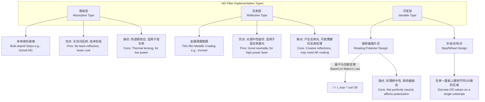
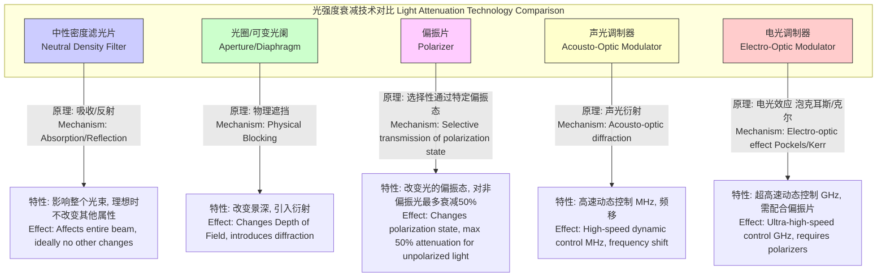

## 中性密度滤光片

中性密度（Neutral Density, ND）滤光片是一种光学元件，其核心功能是在一个特定的光谱范围内，对所有波长的光进行均匀的衰减，而不改变其相对光谱分布。理想情况下，它能等量减少所有颜色的光强度，从而在不引入色偏（color cast）的情况下降低光的整体亮度。这使得ND滤光片在科学研究和成像技术中成为控制光强的关键工具。

### 1. 核心概念与数学基础

ND滤光片的基本物理原理是光的吸收、反射或两者的结合。其性能主要通过透射率、吸光度和光学密度等参数进行量化。

#### 1.1 比尔-朗伯定律 (Beer-Lambert Law)

对于吸收型ND滤光片，其衰减行为遵循比尔-朗伯定律。该定律描述了光在通过均匀介质时强度的指数衰减。

$$
I = I_0 e^{-\alpha l}
$$

其中：
*   $I$ 是通过介质后的光强度 (W/m²)。
*   $I_0$ 是入射光强度 (W/m²)。
*   $\alpha$ 是介质的吸收系数 (m⁻¹)，该系数是波长 $\lambda$ 的函数，即 $\alpha(\lambda)$。对于理想的ND滤光片，$\alpha$ 在目标光谱范围内为常数。
*   $l$ 是光在介质中传播的路径长度 (m)。

#### 1.2 透射率 (Transmittance)

透射率 $T$ 定义为出射光强度与入射光强度的比值，是一个无量纲的参数，取值范围为 [0, 1]。

$$
T = \frac{I}{I_0}
$$

对于反射型ND滤光片，透射率 $T = 1 - R - A$，其中 $R$ 是反射率，$A$ 是吸收率。对于纯反射型滤光片，$A \approx 0$，则 $T \approx 1 - R$。

#### 1.3 光学密度 (Optical Density)

光学密度（OD）是描述ND滤光片衰减能力的最常用指标。它被定义为透射率倒数的以10为底的对数。光学密度是一个无量纲的量。

$$
OD = \log_{10}\left(\frac{1}{T}\right) = -\log_{10}(T)
$$

这个对数关系非常实用，因为光学密度具有可加性。当多个ND滤光片堆叠使用时，其总光学密度约等于各个滤光片光学密度之和（假设忽略了层间反射）：

$$
OD_{total} = OD_1 + OD_2 + \dots + OD_n
$$

#### 1.4 F制光圈减档数 (F-stop Reduction)

在摄影和电影制作中，通常使用“档”（f-stop）来描述曝光量的变化。每增加一档（1 f-stop），光量减半。光学密度与f-stop减档数之间的关系可以如下推导：

由于一档减光对应于透射率 $T=1/2$，我们可以建立以下关系：

$$
\text{F-stop Reduction} = \log_2\left(\frac{1}{T}\right)
$$

结合光学密度的定义 $T = 10^{-OD}$，可得：

$$
\text{F-stop Reduction} = \log_2(10^{OD}) = OD \cdot \log_2(10) = OD \cdot \frac{\log_{10}(10)}{\log_{10}(2)} = \frac{OD}{\log_{10}(2)}
$$

由于 $\log_{10}(2) \approx 0.30103$，该关系可简化为：

$$
\text{F-stop Reduction} \approx \frac{OD}{0.301} \approx 3.322 \cdot OD
$$

### 2. 关键技术规格

ND滤光片的性能由一系列技术规格定义，这些规格决定了其在特定应用中的适用性。

| 技术规格 (Technical Specification) | 描述 (Description) | 典型值与单位 (Typical Values & Units) |
| :--- | :--- | :--- |
| **光学密度 (Optical Density)** | 衡量光衰减能力的核心指标。 | 0.1 - 6.0 (无量纲) |
| **透射率 (Transmittance)** | 允许通过的光强度百分比。 | 79.4% (OD 0.1) 到 0.0001% (OD 6.0) |
| **F档减光数 (F-stop Reduction)** | 摄影中使用的等效减光档数。 | 0.33 - 20 (档) |
| **光谱中性度 (Spectral Neutrality)** | 在指定光谱范围内OD值的一致性。 | ±0.05 OD @ 400-700 nm |
| **工作波长范围 (Wavelength Range)** | 滤光片保持其规格的波长区域。 | UV: 200-400 nm; VIS: 400-700 nm; NIR: 700-1100 nm |
| **表面质量 (Surface Quality)** | 根据MIL-PRF-13830B标准定义的表面缺陷（划痕-麻点）。 | 40-20 (标准级), 20-10 (精密级), 10-5 (激光级) |
| **平行度 (Parallelism)** | 滤光片两个光学表面的平行程度。 | < 3 arcmin (标准), < 10 arcsec (高精度) |
| **基底材料 (Substrate Material)** | 制造滤光片的玻璃或晶体材料。 | N-BK7, 熔融石英 (Fused Silica), Schott NG系列吸收玻璃 |
| **损伤阈值 (Damage Threshold)** | 滤光片能够承受的最大激光功率或能量密度。 | > 10 J/cm² @ 1064 nm, 10 ns脉冲 (高功率应用) |

**光学密度与相关参数换算表**

| OD | 透射率 (T) | 透射率 (%) | F档减光数 |
| :--- | :--- | :--- | :--- |
| 0.3 | 0.501 | 50.1% | 1 |
| 0.6 | 0.251 | 25.1% | 2 |
| 0.9 | 0.126 | 12.6% | 3 |
| 1.0 | 0.100 | 10.0% | 3.32 |
| 2.0 | 0.010 | 1.0% | 6.64 |
| 3.0 | 0.001 | 0.1% | 9.97 |
| 4.0 | 0.0001 | 0.01% | 13.29 |

### 3. 常见用例与量化性能指标

#### 3.1 摄影与电影制作
*   **在强光下实现浅景深**: 在户外日光等明亮环境下，为了使用大光圈（如f/1.8）以获得背景虚化的浅景深效果，快门速度可能需要超过相机上限（如1/8000s）。使用ND滤光片可以降低进入镜头的光量，从而允许在安全快门速度内使用大光圈。
    *   **量化示例**: 假设在ISO 100时，正确曝光参数为 f/16 和 1/125s。摄影师希望使用 f/2.0 拍摄。光圈从f/16到f/2.0增加了6档曝光 ($2^6 = 64$倍进光量)。为补偿此变化，需要一个减6档的ND滤光片。所需的OD值为：$OD = 6 \times \log_{10}(2) \approx 1.8$。

*   **创建动态模糊效果**: 通过大幅延长曝光时间，可以使移动的物体（如流水、云彩、车流）在画面中形成动态模糊或丝绸般的效果。
    *   **量化示例**: 在白天，正常曝光时间为1/60s。为了获得30秒的长曝光以平滑水面，曝光时间需要增加 $30 / (1/60) = 1800$ 倍。所需的光学密度为：$OD = \log_{10}(1800) \approx 3.25$。这对应约10.8档（$log_2(1800)$）的减光。

#### 3.2 科学与工业应用
*   **防止探测器饱和**: 在激光物理、光谱学或机器视觉中，光源强度可能远超探测器（如CCD/CMOS相机、光电二极管、光电倍增管）的线性响应范围甚至饱和阈值。ND滤光片用于将光强度衰减到探测器的最佳工作区间。
    *   **量化示例**: 一个功率为5W的连续激光束需要被一个最大输入功率为10mW的光电二极管测量。需要的光衰减倍数为 $5 \text{ W} / 10 \text{ mW} = 500$。所需的光学密度为：$OD = \log_{10}(500) \approx 2.7$。

*   **干涉测量中的光束平衡**: 在干涉仪（如迈克尔逊干涉仪）中，为了获得最大衬比度的干涉条纹，两束相干光的光强需要尽可能相等。干涉条纹的可见度（Visibility）$V$ 定义为：
    $$
    V = \frac{I_{max} - I_{min}}{I_{max} + I_{min}} = \frac{2\sqrt{I_1 I_2}}{I_1 + I_2}
    $$
    当两臂光强 $I_1 = I_2$ 时，可见度 $V=1$，达到最大值。ND滤光片可用于精确衰减其中一臂的光强以实现匹配。

### 4. 实现考量

ND滤光片的实现方式主要分为吸收型和反射型，以及可变类型。

#### 算法复杂性分析
对于一个标准的被动式ND滤光片，其本身不涉及算法。然而，在包含ND滤光片的自动化系统（如相机的自动曝光系统）中，控制逻辑是存在的。
例如，一个自动曝光控制算法可能包含以下决策步骤：
1.  **测量场景亮度 (L)**：通过测光系统获取。
2.  **计算目标曝光值 (EV)**：基于预设的测光模式。
3.  **确定可用参数组合**：在当前ISO下，搜索可用的光圈(A)和快门速度(T)组合。
4.  **检查约束条件**：
    *   如果所需快门速度 $T_{req} < T_{min}$ (例如，1/8000s)，则无法实现正确曝光。
    *   如果所需快门速度 $T_{req} > T_{max}$ (例如，30s)，可能导致过曝或需要B门。
5.  **ND滤光片决策**：如果出现无法满足曝光要求的情况（例如，在强光下希望使用慢门），系统决策是否启用/调整ND滤光片。这个决策过程是一个基于阈值的判断，其**算法复杂度为 O(1)**。

对于可变ND滤光片，其衰减遵循**马吕斯定律 (Malus's Law)**。当一束线偏振光通过一个检偏器时，其透射光强 $I$ 为：
$$
I = I_i \cos^2(\theta)
$$
其中 $I_i$ 是入射到检偏器的线偏振光强度，$\theta$ 是入射光的偏振方向与检偏器透振轴之间的夹角。可变ND滤光片由两个偏振片构成，当旋转其中一个时，它们之间的夹角 $\theta$ 改变，从而连续地改变总透射率。

### 5. 性能特征与统计度量

#### 5.1 光谱中性度
理想的ND滤光片在整个工作波长范围内具有恒定的OD值。然而，实际的滤光片总会存在一定程度的偏差。这种偏差可以用统计量来描述。
对于一个在波长范围 $[\lambda_{min}, \lambda_{max}]$ 内的滤光片，其平均光学密度 $\bar{OD}$ 和标准差 $\sigma_{OD}$ 可以定义为：

$$
\bar{OD} = \frac{1}{\lambda_{max} - \lambda_{min}} \int_{\lambda_{min}}^{\lambda_{max}} OD(\lambda) d\lambda
$$

$$
\sigma_{OD}^2 = \frac{1}{\lambda_{max} - \lambda_{min}} \int_{\lambda_{min}}^{\lambda_{max}} (OD(\lambda) - \bar{OD})^2 d\lambda
$$

*   $\bar{OD}$ 表示滤光片的标称光学密度。
*   $\sigma_{OD}$ 是衡量光谱中性度的关键指标，其值越小，表示滤光片的光谱响应曲线越平坦，中性度越好。

#### 5.2 色偏 (Color Cast)
光谱非中性度在成像上表现为色偏。这种色偏可以通过CIELAB或CIEDE2000色差公式进行量化。在标准光源（如D65）下，测量通过滤光片前后白场的色坐标，计算其色差 $\Delta E_{00}^*$。通常认为，当 $\Delta E_{00}^* < 1$ 时，色差是人眼无法感知的。

#### 5.3 制造公差
滤光片的标称OD值存在制造公差，例如 OD 2.0 ± 0.1。这个公差可以被建模为一个概率分布，通常假设为高斯分布 $N(\mu, \sigma^2)$，其中均值 $\mu$ 是标称OD值（2.0），标准差 $\sigma$ 由公差范围决定。如果公差 ±0.1 代表一个99.7%的置信区间（即 $\pm 3\sigma$），则 $\sigma = 0.1 / 3 \approx 0.033$。

### 6. 相关技术与比较模型

除了ND滤光片，还有其他技术可以用来衰减光强，但它们的工作原理和对光束的其他属性的影响各不相同。

#### 数学模型比较
*   **ND滤光片**: $I_{out} = I_{in} \cdot 10^{-OD}$
    *   衰减与光强本身无关，是一个固定的比例。

*   **光圈**: $I_{out} \propto A_{aperture} = \pi (D/2)^2$。在摄影中，光圈用f值 ($f/\# = f_{lens}/D$) 表示，因此 $I \propto 1/(f/\#)^2$。
    *   改变光束的几何尺寸，而非单位面积的光强。

*   **声光调制器 (AOM)**: 衍射效率 $\eta$ (即衰减) 取决于施加的射频(RF)声功率 $P_a$。对于布拉格衍射，一级衍射光的强度为：
    $$
    I_1 = I_{in} \cdot \eta = I_{in} \cdot \sin^2\left(\frac{\pi L}{\lambda_0 \cos\theta_B} \sqrt{\frac{M_2 P_a}{2 H}}\right)
    $$
    其中 $L, H$ 是换能器尺寸, $\lambda_0$ 是真空波长, $\theta_B$ 是布拉格角, $M_2$ 是声光优值系数。这是一个动态可控的衰减器。

*   **电光调制器 (EOM)**: EOM（如泡克耳斯盒）本身改变光的偏振态，它通过施加电压 $V$ 产生一个相位延迟 $\Gamma = \pi V / V_{\pi}$。当置于一对正交偏振片之间时，系统的透射强度为：
    $$
    I_{out} = I_{in} \sin^2\left(\frac{\Gamma}{2}\right) = I_{in} \sin^2\left(\frac{\pi V}{2 V_{\pi}}\right)
    $$
    其中 $V_{\pi}$ 是半波电压。这提供了极高速度的强度调制能力。

### 7. 参考文献

1.  Brown, S. W., Eppeldauer, G. P., & Lykke, K. R. (2003). Characterization of neutral density filters for the new NIST spectral irradiance and radiance responsivity scales. *Journal of Research of the National Institute of Standards and Technology*, 108(1), 35–46. DOI: [10.6028/jres.108.016](https://doi.org/10.6028/jres.108.016)
2.  Zadok, A., Zilberman, E., & Eyal, A. (2013). Color neutrality of variable neutral density filters. *Applied Optics*, 52(25), 6241–6246. DOI: [10.1364/AO.52.006241](https://doi.org/10.1364/AO.52.006241)
3.  Saleh, B. E. A., & Teich, M. C. (2019). *Fundamentals of Photonics* (3rd ed.). Wiley. (Provides theoretical background for many of the principles discussed).
4.  Bass, M. (Ed.). (2009). *Handbook of Optics, Volume I: Geometrical and Physical Optics, Polarized Light, Components and Instruments* (3rd ed.). McGraw-Hill. (A standard reference for optical components).