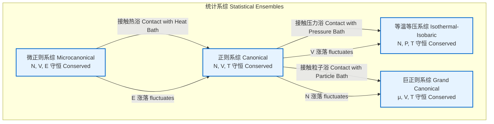

## NpT系综

NpT系综，也称为等温等压系综（Isothermal-Isobaric Ensemble），是统计力学中的一个重要系综。它描述了一个与恒温热浴和恒压压力浴（或活塞）保持热力学平衡的系统。在此系综中，系统的粒子数（N）、压力（P）和温度（T）保持恒定，而系统的体积（V）和能量（E）则会发生涨落。NpT系综在模拟化学和材料科学实验中尤其重要，因为大多数实验室条件都是在恒定的温度和压力下进行的。

### 核心概念与数学基础

NpT系综的宏观状态由三个固定的热力学量定义：$N$（粒子数）、$P$（压力）和$T$（温度）。系统的微观状态由其所有粒子的位置向量 $\mathbf{r}^N = \{\mathbf{r}_1, \dots, \mathbf{r}_N\}$ 和动量向量 $\mathbf{p}^N = \{\mathbf{p}_1, \dots, \mathbf{p}_N\}$ 决定。

#### 配分函数 (Partition Function)

NpT系综的配分函数，记为 $\Delta(N, P, T)$，是该系综的核心。它通过对所有可能的体积和相空间进行积分来定义，并对相应状态的玻尔兹曼因子进行加权。

$$
\Delta(N, P, T) = \frac{1}{N! h^{3N} V_0} \int_0^\infty dV \int d\mathbf{r}^N \int d\mathbf{p}^N \exp\left(-\beta \left[H(\mathbf{r}^N, \mathbf{p}^N) + PV\right]\right)
$$

其中：
*   $N$ 是系统中的粒子数。
*   $P$ 是施加在系统上的恒定外部压力。
*   $T$ 是系统的恒定温度。
*   $\beta = \frac{1}{k_B T}$，其中 $k_B$ 是玻尔兹曼常数。
*   $h$ 是普朗克常数。
*   $V_0$ 是一个具有体积量纲的任意常数，用于使配分函数无量纲化。它不影响任何可测量的物理量。
*   $V$ 是系统的体积，它是一个可变的积分变量。
*   $H(\mathbf{r}^N, \mathbf{p}^N)$ 是系统的哈密顿量（总能量），通常表示为动能和势能之和：
    $$ H(\mathbf{r}^N, \mathbf{p}^N) = K(\mathbf{p}^N) + U(\mathbf{r}^N) = \sum_{i=1}^N \frac{|\mathbf{p}_i|^2}{2m_i} + U(\mathbf{r}_1, \dots, \mathbf{r}_N) $$
*   $N!$ 因子是针对不可区分的全同粒子引入的。
*   $\exp(-\beta [H + PV])$ 是玻尔兹曼因子，它给出了系统处于特定微观状态（具有能量 $H$ 和体积 $V$）的相对概率。

配分函数也可以用正则系综（NVT）的配分函数 $Q(N, V, T)$ 来表示：
$$
\Delta(N, P, T) = \frac{1}{V_0} \int_0^\infty dV e^{-\beta PV} Q(N, V, T)
$$
其中 $Q(N, V, T)$ 是正则配分函数：
$$
Q(N, V, T) = \frac{1}{N! h^{3N}} \int d\mathbf{r}^N \int d\mathbf{p}^N e^{-\beta H(\mathbf{r}^N, \mathbf{p}^N)}
$$

#### 热力学势 (Thermodynamic Potential)

与NpT系综相关的特征热力学势是吉布斯自由能（Gibbs Free Energy），$G$。它与配分函数直接相关：
$$
G(N, P, T) = -k_B T \ln \Delta(N, P, T)
$$
吉布斯自由能代表了在恒定温度和压力下，系统可用于做非体积功的最大能量。

#### 系综平均 (Ensemble Averages)

任何物理量 $A$ 的系综平均值 $\langle A \rangle$ 可以通过以下公式计算：
$$
\langle A \rangle = \frac{1}{\Delta(N, P, T)} \frac{1}{N! h^{3N} V_0} \int_0^\infty dV \int d\mathbf{r}^N \int d\mathbf{p}^N A(\mathbf{r}^N, \mathbf{p}^N, V) e^{-\beta [H + PV]}
$$
例如，系统的平均体积 $\langle V \rangle$ 和平均焓 $\langle \mathcal{H} \rangle$（注意：$\mathcal{H} = E+PV$）是重要的可观测量。

### 关键技术规格

下表总结了NpT系综的关键特性。

| 参数 (Parameter) | 符号 (Symbol) | 状态 (Status) | 典型单位 (Typical Units) | 描述 (Description) |
| :--- | :---: | :---: | :--- | :--- |
| 粒子数 (Number of Particles) | $N$ | 守恒 (Conserved) | 无量纲 (Dimensionless) | 系统中粒子的总数 |
| 压力 (Pressure) | $P$ | 守恒 (Conserved) | Pa, bar, atm | 与外部压力浴平衡的恒定压力 |
| 温度 (Temperature) | $T$ | 守恒 (Conserved) | K | 与外部热浴平衡的恒定温度 |
| 体积 (Volume) | $V$ | 涨落 (Fluctuating) | m³, ų | 系统的体积会响应压力而变化 |
| 能量 (Energy) | $E$ | 涨落 (Fluctuating) | J, kcal/mol, eV | 系统的内部能量会与热浴交换而变化 |
| 焓 (Enthalpy) | $\mathcal{H} = E+PV$ | 涨落 (Fluctuating) | J, kcal/mol, eV | 在NpT系综中，焓的涨落与热容有关 |
| 吉布斯自由能 (Gibbs Free Energy) | $G$ | 最小化 (Minimized) | J, kcal/mol, eV | 系统在平衡态时趋于最小的热力学势 |

### 常见用例

NpT系综在计算凝聚态物质的性质方面有广泛应用，因为它能准确模拟实验条件。

*   **相变研究 (Phase Transition Studies)**：通过监测体积或密度的变化作为温度或压力的函数，可以精确确定相变点（如熔化、沸腾）。在相变点，体积通常会表现出不连续的跳跃。
    *   **性能指标**: 在一级相变点，体积的概率分布会呈现双峰形态，两个峰的面积比可以用来精确确定共存点。
*   **状态方程计算 (Equation of State Calculation)**：通过在不同的 $(P, T)$ 点上进行一系列模拟，可以计算出材料的密度（或比容）$\rho(P, T)$，从而构建其状态方程。
    *   **性能指标**: 对于一个典型的液态系统模拟，使用约 $10^5$ - $10^6$ 个时间步后，密度的统计误差通常可以控制在 0.1% - 0.5% 以内。
*   **力学性质计算 (Mechanical Property Calculation)**：体积的涨落直接关联到材料的力学响应函数。
    *   **等温压缩系数 (Isothermal Compressibility, $\kappa_T$)**:
        $$ \kappa_T = -\frac{1}{\langle V \rangle} \left( \frac{\partial \langle V \rangle}{\partial P} \right)_T = \frac{\langle V^2 \rangle - \langle V \rangle^2}{k_B T \langle V \rangle} $$
        这是一个典型的涨落-响应关系。
    *   **热膨胀系数 (Thermal Expansion Coefficient, $\alpha_P$)**:
        $$ \alpha_P = \frac{1}{\langle V \rangle} \left( \frac{\partial \langle V \rangle}{\partial T} \right)_P = \frac{\langle \mathcal{H}V \rangle - \langle \mathcal{H} \rangle \langle V \rangle}{k_B T^2 \langle V \rangle} $$
        这需要计算焓和体积的协方差。
    *   **性能指标**: 计算这些二阶导数性质需要更长的模拟时间和更仔细的统计分析。通常需要 $10^6$ - $10^7$ 个时间步，以获得低于5%的统计误差。

### 实现考量

在分子动力学（MD）或蒙特卡洛（MC）模拟中实现NpT系综需要特定的算法来维持恒定的温度和压力。

#### 蒙特卡洛 (Monte Carlo, MC) 方法
在MC模拟中，除了标准的粒子移动试探步外，还需要引入一个体积改变的试探步。
1.  随机选择改变系统的体积，从 $V$ 变为 $V'$。
2.  按比例缩放所有粒子的坐标：$\mathbf{r}'_i = (V'/V)^{1/3} \mathbf{r}_i$。
3.  计算势能的变化 $\Delta U = U(\mathbf{r}'^N) - U(\mathbf{r}^N)$。
4.  根据Metropolis准则接受或拒绝此步骤，接受概率为：
    $$
    \text{acc}(V \to V') = \min\left(1, \exp\left[-\beta(\Delta U + P(V' - V) - N k_B T \ln(V'/V))\right]\right)
    $$
*   **算法复杂度**: 每个体积试探步的复杂度为 $O(N)$ 或 $O(N^2)$，取决于势能计算的复杂度。这通常比粒子移动步更耗时。

#### 分子动力学 (Molecular Dynamics, MD) 方法
在MD中，通过引入恒温器（thermostat）和恒压器（barostat）来修改运动方程，以分别控制温度和压力。

```mermaid
graph TD
    subgraph "NpT MD 模拟流程 NpT MD Simulation Workflow"
        A[初始化位置和速度<br>Initialize Positions & Velocities] --> B开始时间步循环<br>Start Timestep Loop;
        B --> C[计算力<br>Calculate Forces];
        C --> D["恒温器: 缩放速度<br>Thermostat: Scale Velocities"];
        D --> E["积分器: 更新位置和速度<br>Integrator: Update Positions & Velocities"];
        E --> F["恒压器: 缩放体积和位置<br>Barostat: Scale Volume & Positions"];
        F --> G达到总步数?<br>Total steps reached?;
        G -- 否 No --> B;
        G -- 是 Yes --> H[结束模拟并分析<br>End Simulation & Analyze];
    end

    style D fill:#cff,stroke:#333,stroke-width:2px
    style F fill:#fcf,stroke:#333,stroke-width:2px
```

*   **Berendsen 恒压器**:
    *   一种弱耦合方法，通过将系统体积与目标压力 $P_0$ 耦合来调节压力。体积的缩放因子 $\mu$ 在每个时间步计算：
        $$ \mu = \left[ 1 - \frac{\Delta t}{\tau_P} \beta_T (P_0 - P(t)) \right]^{1/3} $$
        其中 $\tau_P$ 是压力耦合时间常数，$\beta_T$ 是系统的可压缩性（通常用一个估计值）。
    *   **优点**: 简单、稳定，能快速达到目标压力。
    *   **缺点**: 不会生成精确的NpT系综的涨落分布。主要用于系统弛豫。
    *   **算法复杂度**: $O(1)$，在计算瞬时压力 $P(t)$ 之后。

*   **Andersen & Parrinello-Rahman 恒压器**:
    *   一种扩展拉格朗日方法，将模拟盒的体积（或晶格矢量）视为一个动态变量，并为其分配一个“活塞”质量 $W$。
    *   对于各向同性系统（Andersen），运动方程被修改为：
        $$ \frac{d^2V}{dt^2} = \frac{1}{W} (P_{int} - P_{ext}) $$
        其中 $P_{int}$ 是瞬时内压。
    *   对于各向异性系统（Parrinello-Rahman），模拟盒由一个矩阵 $\mathbf{h}$ 描述，其运动方程为：
        $$ W \frac{d^2\mathbf{h}}{dt^2} = (\mathbf{\Pi} - P_{ext}\mathbf{I}) A $$
        其中 $\mathbf{\Pi}$ 是应力张量，$A$ 是盒矩阵的表面张量。
    *   **优点**: 能够生成正确的NpT系综分布，允许模拟盒形状改变，对于研究固态相变至关重要。
    *   **缺点**: 振荡行为可能较强，需要仔细选择活塞质量 $W$。
    *   **算法复杂度**: $O(1)$，在计算应力张量之后。应力张量的计算复杂度为 $O(N^2)$ 或 $O(N \log N)$（使用Ewald求和等方法）。

### 性能特征

*   **收敛性**: NpT模拟的收敛性取决于恒压器参数（如 $\tau_P$ 或 $W$）的选择。选择不当会导致压力或体积的剧烈振荡，延长达到平衡所需的时间。
*   **统计效率**: 由于体积是一个额外的慢变量，NpT模拟通常需要比NVT模拟更长的时间才能获得相同精度的统计量。
*   **误差分析**: 对于从NpT模拟中获得的时间序列数据（如 $V(t)$），必须使用块平均（Block Averaging）等方法来估计统计不确定性（标准误差），因为连续的构型是高度相关的。
    *   **统计指标**: 报告平均值时应始终附带置信区间，例如 $\langle V \rangle \pm \sigma_{\langle V \rangle}$。对于一个长度为 $T_{sim}$ 的模拟，如果体积的关联时间为 $\tau_V$，则有效独立样本数为 $N_{eff} = T_{sim} / (2\tau_V)$。

### 相关技术与比较

NpT系综是统计力学中的几个重要系综之一。



| 系综 (Ensemble) | 守恒量 (Conserved Quantities) | 涨落量 (Fluctuating Quantities) | 对应热力学势 (Thermodynamic Potential) | 数学模型 (Mathematical Model) |
| :--- | :--- | :--- | :--- | :--- |
| **NVE (微正则)** | $N, V, E$ | $P, T, \mu$ | 熵 (Entropy, $S$) | $S = k_B \ln \Omega(N, V, E)$ |
| **NVT (正则)** | $N, V, T$ | $E, P, \mu$ | 亥姆霍兹自由能 (Helmholtz Free Energy, $A$) | $A = -k_B T \ln Q(N, V, T)$ |
| **NpT (等温等压)** | $N, P, T$ | $V, E, \mu$ | 吉布斯自由能 (Gibbs Free Energy, $G$) | $G = -k_B T \ln \Delta(N, P, T)$ |
| **$\mu$VT (巨正则)** | $\mu, V, T$ | $N, E, P$ | 巨势 (Grand Potential, $\Phi_G$) | $\Phi_G = -k_B T \ln \Xi(\mu, V, T)$ |

**选择依据**:
*   **NVE**: 适用于模拟一个完全孤立的系统，例如超快过程或天体物理学中的系统。
*   **NVT**: 最常用的系综之一，适用于体积固定的系统，如吸附在多孔材料中的流体。
*   **NpT**: 最接近标准实验室条件的系综，是研究相平衡、材料密度和力学性质的理想选择。
*   **$\mu$VT**: 适用于模拟与一个大的粒子库有交换的开放系统，例如催化剂表面上的吸附/解吸附过程。

### 参考文献

*   Andersen, H. C. (1980). Molecular dynamics simulations at constant pressure and/or temperature. *The Journal of Chemical Physics*, 72(4), 2384-2393. DOI: [10.1063/1.439149](https://doi.org/10.1063/1.439149)
*   Parrinello, M., & Rahman, A. (1981). Polymorphic transitions in single crystals: A new molecular dynamics method. *Journal of Applied Physics*, 52(12), 7182-7190. DOI: [10.1063/1.328693](https://doi.org/10.1063/1.328693)
*   Berendsen, H. J. C., Postma, J. P. M., van Gunsteren, W. F., DiNola, A., & Haak, J. R. (1984). Molecular dynamics with coupling to an external bath. *The Journal of Chemical Physics*, 81(8), 3684-3690. DOI: [10.1063/1.448118](https://doi.org/10.1063/1.448118)
*   Frenkel, D., & Smit, B. (2001). *Understanding Molecular Simulation: From Algorithms to Applications* (2nd ed.). Academic Press. ISBN: 978-0122673511.