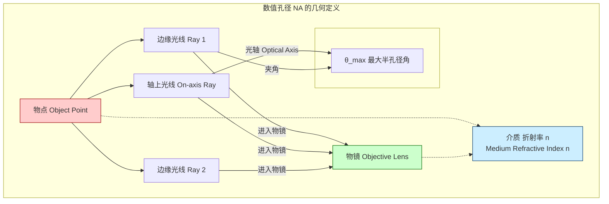
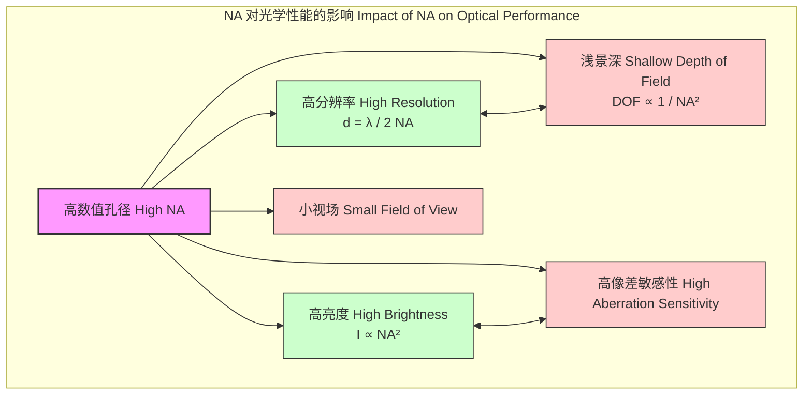

## 数值孔径 (NA)

数值孔径（Numerical Aperture, NA）是光学系统中一个关键的无量纲参数，它描述了系统（如显微镜物镜或光纤）收集光线并解析精细细节的能力。NA由物镜的孔径角和其所在介质的折射率共同决定。一个更高的NA值意味着系统可以接收更大角度范围的光线，从而获得更高的分辨率和更亮的图像，但通常会牺牲景深。

### 核心概念与数学基础

从根本上说，数值孔径衡量了一个光学系统能够接受的光锥的“大小”。它直接关系到系统的两个核心性能：光收集效率和空间分辨率。

#### 1. 几何定义与公式

在显微镜学中，数值孔径的定义基于物镜可以收集来自焦平面上一点的光线的最大角度。其数学表达式为：

$$
NA = n \cdot \sin(\theta_{\text{max}})
$$

其中：
*   $NA$ 是数值孔径，一个无量纲的量。
*   $n$ 是物镜与样品之间介质的折射率（Refractive Index）。例如，空气的 $n \approx 1.00$，水的 $n \approx 1.33$，而专用浸油的 $n$ 可高达 1.51 或更高。
*   $\theta_{\text{max}}$ 是物镜光轴与物镜所能接收的最边缘光线之间的最大夹角，也称为最大半孔径角（Maximum half-angle of acceptance）。

这个关系可以用下面的Mermaid图来可视化：

#### 2. 与分辨率的关系：阿贝衍射极限

NA最重要的物理意义在于它决定了光学系统的理论最高分辨率。根据恩斯特·阿贝（Ernst Abbe）的衍射理论，一个光学系统能够分辨的两个点之间的最小距离 $d$（即分辨率）与NA成反比：

$$
d = \frac{\lambda}{2 \cdot NA}
$$

其中：
*   $d$ 是最小可分辨距离（单位：米，m）。
*   $\lambda$ 是用于成像的光在真空中的波长（单位：米，m）。

这个公式明确指出，要获得更高的分辨率（即更小的 $d$ 值），需要使用更短波长的光（如紫外光）或使用具有更高NA的物镜。

#### 3. 与光纤的关系

在光纤光学中，NA描述了光纤接收光的能力。它定义了一个“接受锥”，只有落入此锥内的光线才能在纤芯中以全内反射（Total Internal Reflection）的方式传播。其公式由纤芯和包层的折射率决定：

$$
NA = \sqrt{n_{\text{core}}^2 - n_{\text{cladding}}^2}
$$

其中：
*   $n_{\text{core}}$ 是光纤纤芯的折射率。
*   $n_{\text{cladding}}$ 是光纤包层的折射率。

### 关键技术规格

不同光学系统的NA值差异很大，这取决于它们的设计目标和应用。

| 光学系统 (Optical System) | 典型NA值 (Typical NA Value) | 介质 (Medium) | 主要应用 (Primary Application) |
| :--- | :--- | :--- | :--- |
| 标准显微镜干镜 | 0.10 - 0.95 | 空气 (Air, $n \approx 1.00$) | 常规生物学、材料学观察 |
| 高倍显微镜水浸物镜 | 1.10 - 1.25 | 水 (Water, $n \approx 1.33$) | 活细胞成像 |
| 高倍显微镜油浸物镜 | 1.25 - 1.45 | 浸油 (Immersion Oil, $n \approx 1.51$) | 高分辨率细胞学、TIRF |
| 全内反射荧光(TIRF)物镜 | 1.45 - 1.70 | 高折射率浸油/固体 | 单分子成像、近场光学 |
| 多模光纤 (Multimode Fiber) | 0.20 - 0.50 | 石英玻璃 (Silica Glass) | 短距离数据通信、传感 |
| 单模光纤 (Single-mode Fiber) | 0.10 - 0.14 | 石英玻璃 (Silica Glass) | 长距离电信、相干光学 |
| 半导体光刻物镜 | 0.93 (DUV) - 1.35 (Immersion) | 空气/超纯水 | 芯片制造 |

### 主要应用场景

NA是衡量和比较光学系统性能的核心指标。

*   **高分辨率显微镜 (High-Resolution Microscopy)**
    *   **性能指标**: 使用NA为1.4的油浸物镜和450 nm的蓝光，理论分辨率可达 $d = 450 / (2 \cdot 1.4) \approx 161$ nm。这使得能够观察到亚细胞结构。
    *   **应用**: 在细胞生物学中用于解析细胞器，在神经科学中用于成像突触。

*   **光刻技术 (Optical Lithography)**
    *   **性能指标**: 在193 nm ArF浸没式光刻中，通过使用折射率为1.44的超纯水作为浸没介质，物镜的有效NA可达 $1.35$。这使得能够制造特征尺寸小于32 nm的半导体器件。
    *   **应用**: 现代集成电路（CPU, DRAM）的大规模生产。

*   **光纤通信 (Fiber Optic Communication)**
    *   **性能指标**: 多模光纤（如OM4）的NA约为0.20，允许耦合来自LED或VCSEL光源的更多光功率，但会引入模式色散，限制带宽距离乘积（例如，~4700 MHz·km）。单模光纤的NA较小（~0.12），最大限度地减少了模式色散，适用于长距离、高带宽传输。

*   **数据存储 (Data Storage)**
    *   **性能指标**: 蓝光光盘（Blu-ray Disc）技术使用NA为0.85的物镜和405 nm的蓝色激光，使其能够将数据轨道间距减小到320 nm，从而实现每层25 GB的存储容量。

### 实现与设计考量

设计和制造高NA光学系统是一项重大的技术挑战。

*   **材料选择**: 为了突破空气中NA<1的限制，必须采用浸没技术（Immersion）。这需要开发高折射率（$n>1.5$）、高色散补偿且在工作波长下高度透明的液体（如浸油）或固体（如SIL）。
*   **像差校正 (Aberration Control)**: 高NA系统对像差（球差、彗差、场曲等）极其敏感。物镜通常由10-20个或更多的精密透镜元件组成，使用非球面和低色散/萤石玻璃来校正这些像差。其设计复杂度随着NA的四次方或更高次幂增加。
*   **偏振效应 (Polarization Effects)**: 当NA > 0.5时，光的矢量特性变得显著。不同偏振态的光在焦平面上的行为不同，可能导致焦点形状的改变和成像对比度的下降。在高NA系统中，必须考虑和控制光的偏振。
*   **制造与装配公差**: 高NA物镜的元件必须以亚微米级的精度进行制造和对准。任何微小的偏差都可能严重降低系统性能，导致其实际分辨率远低于理论值。

### 性能特征与统计分析

NA直接影响系统的几个关键性能参数，它们之间存在着固有的权衡关系。

*   **景深 (Depth of Field, DOF)**: NA与景深之间存在强烈的反比关系。一个近似公式是：
    $$
    DOF \approx \frac{n \cdot \lambda}{NA^2}
    $$
    这意味着高NA系统（例如NA=1.4）只能对一个非常薄的焦平面（通常小于1微米）进行清晰成像，而低NA系统（NA=0.25）则有更深的焦深。
*   **图像亮度 (Image Brightness)**: 图像的亮度与NA的平方成正比。将NA从0.5增加到1.0，光收集效率会提高4倍，这对于弱荧光信号的检测至关重要。
*   **统计性能**: 由于制造公差，一批次的物镜的实际NA值会呈现一个统计分布，例如 $NA = 1.40 \pm 0.005$ (95% 置信区间)。这种变化会直接影响到分辨率和景深的统计分布，对于需要高度一致性的应用（如自动化显微镜或半导体检测）来说，这是一个关键的质量控制参数。

### 相关技术与比较模型

#### 1. f数 (f-number)

在摄影和宏观光学中，常用f数（f-number, $f/\#$）来描述镜头的孔径大小。它与NA的关系如下（对于在空气中、物距为无穷远的简单透镜）：

$$
f/\# = \frac{f}{D} \approx \frac{1}{2 \cdot NA}
$$

其中：
*   $f$ 是镜头的焦距。
*   $D$ 是入射光瞳的直径。

这个近似关系表明，低f数（如f/1.4）对应高NA，而高f数（如f/16）对应低NA。然而，NA是更基础和通用的参数，因为它直接包含了介质折射率的影响，而f数没有。

#### 2. 结构光照明显微镜 (SIM)

传统光学显微镜的分辨率受限于 $d = \lambda/(2NA)$。超分辨技术如结构光照明显微镜（Structured Illumination Microscopy, SIM）通过使用空间结构化的照明光场与样品产生莫尔条纹，可以在傅里叶空间中获取更高频率的信息。通过算法重构，SIM可以将横向分辨率提高大约两倍，达到 $d \approx \lambda/(4NA)$。

#### 3. 随机光学重构显微镜 (STORM/PALM)

STORM/PALM等技术通过随机激活和定位单个荧光分子，绕过了衍射极限。尽管这些技术的分辨率（可达20-50 nm）不直接由NA的衍射公式决定，但它们仍然严重依赖高NA物镜。高NA对于高效收集单个分子的微弱光子信号至关重要，直接影响定位精度（Localization Precision, $\sigma_x$）：

$$
\sigma_x \propto \frac{\lambda}{NA \sqrt{N}}
$$

其中 $N$ 是检测到的光子数。更高的NA可以收集更多的光子，从而实现更精确的分子定位。

### 参考文献

1.  Abbe, E. (1873). Beiträge zur Theorie des Mikroskops und der mikroskopischen Wahrnehmung. *Archiv für mikroskopische Anatomie*, 9(1), 413-468. DOI: `10.1007/BF02956173`
2.  Gustafsson, M. G. L. (2000). Surpassing the lateral resolution limit by a factor of two using structured illumination microscopy. *Journal of microscopy*, 198(2), 82-87. DOI: `10.1046/j.1365-2818.2000.00710.x`
3.  Betzig, E., Patterson, G. H., Sougrat, R., Lindwasser, O. W., Olenych, S., Bonifacino, J. S., ... & Hess, H. F. (2006). Imaging intracellular fluorescent proteins at nanometer resolution. *Science*, 313(5793), 1642-1645. DOI: `10.1126/science.1127344`
4.  Laikin, M. (2007). *Lens Design* (4th ed.). CRC Press. (Provides comprehensive details on the design principles of high-NA objectives).