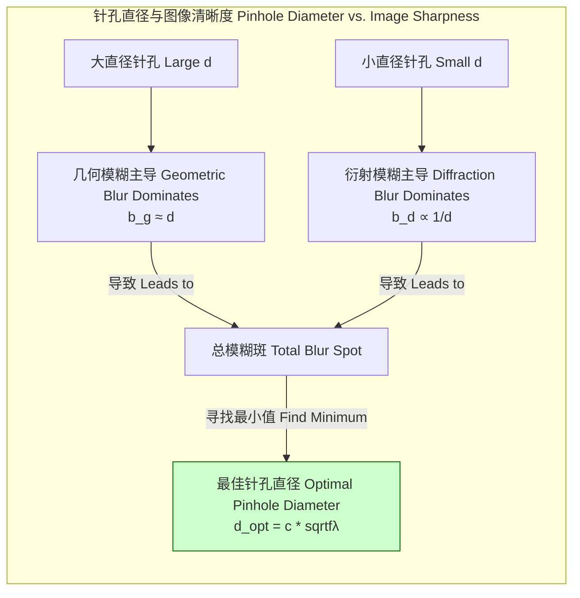
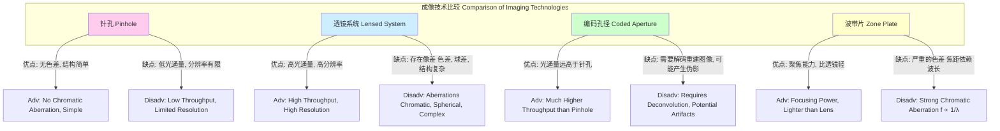

## 针孔

针孔（Pinhole）是一种最简单的光学成像设备。其核心是一个在不透光材料上制作的微小孔径。与使用透镜或反射镜的复杂光学系统不同，针孔利用衍射和几何光学的基本原理，在像平面上形成一个倒置的图像。尽管其概念简单，但针孔在科学研究、艺术摄影和技术应用中具有重要意义，其性能由精确的数学和物理定律决定。

### 核心概念与数学基础

针孔的成像原理涉及几何光学和波动光学之间的权衡。

#### 1. 几何光学模型（针孔相机模型）

在理想的几何光学近似中，光线沿直线传播。针孔被视为一个理想的点孔径，允许来自物体上每一点的单一光线通过并到达像平面。

```mermaid
graph TD
    subgraph "针孔成像几何模型 Pinhole Imaging Geometry"
        Object[物体<br>高度 h_o] -- "光线 Ray 1 from top" --> Pinhole针孔<br>直径 d;
        Pinhole -- "光线 Ray 1" --> ImageTop[像点 来自物体顶部];
        ObjectBase[物体基底] -- "光线 Ray 2 from base" --> Pinhole;
        Pinhole -- "光线 Ray 2" --> ImageBase[像点 来自物体基底];

        subgraph "像平面 Image Plane"
            direction LR
            ImageBase --> ImageTop;
        end

        Object -->|物距 d_o| Pinhole;
        Pinhole -->|像距 f 焦距| ImageBase;
    end

    style Pinhole fill:#f9f,stroke:#333,stroke-width:2px
```

根据相似三角形原理，图像的放大倍率 $M$ 由像距 $f$（针孔到像平面的距离）和物距 $d_o$（物体到针孔的距离）决定：

$$
M = \frac{h_i}{h_o} = \frac{f}{d_o}
$$

其中：
*   $h_i$ 是像的高度。
*   $h_o$ 是物的高度。
*   $f$ 是像距，通常也称为针孔相机的“焦距”。
*   $d_o$ 是物距。

图像是倒置的，这在数学上可以用负号表示，但通常在讨论放大率大小时省略。

如果针孔的直径 $d$ 不为零，那么来自物体单点的光线会在像平面上形成一个直径为 $b_g$ 的模糊圆（也称弥散斑）。其大小为：

$$
b_g = d \left(1 + \frac{f}{d_o}\right)
$$

当物体位于无穷远时 ($d_o \to \infty$)，几何模糊斑的大小等于针孔直径 $b_g \approx d$。这个关系表明，为了获得更清晰的图像（更小的 $b_g$），需要一个更小的针孔。

#### 2. 波动光学与衍射极限

当针孔尺寸接近光的波长时，波动光学效应——特别是衍射——变得至关重要。光穿过小孔时会发生弯曲，形成一个衍射图样，而不是一个清晰的点。对于圆形孔径，这个图样被称为艾里斑（Airy disk）。

艾里斑的角半径 $\theta_d$（从中心到第一个暗环的夹角）由下式给出：

$$
\sin(\theta_d) \approx \theta_d = 1.22 \frac{\lambda}{d}
$$

其中：
*   $\lambda$ 是光的波长。
*   $d$ 是针孔的直径。

这个衍射效应在像平面上产生的模糊斑直径 $b_d$ 为：

$$
b_d = 2 f \tan(\theta_d) \approx 2.44 \frac{\lambda f}{d}
$$

这个公式表明，减小针孔直径 $d$ 会增大衍射模糊斑 $b_d$，从而降低图像清晰度。

#### 3. 最佳针孔直径

针孔相机的总模糊 $b_t$ 是几何模糊 $b_g$ 和衍射模糊 $b_d$ 的组合。一个常用的组合方法是将其方和根（quadrature addition）相加，因为这两个效应在统计上是独立的：

$$
b_t = \sqrt{b_g^2 + b_d^2} = \sqrt{d^2 + \left(2.44 \frac{\lambda f}{d}\right)^2}
$$
(此处为简化，假设物体在无穷远, $b_g \approx d$)

为了找到产生最清晰图像（即最小总模糊 $b_t$）的最佳针孔直径 $d_{opt}$，我们对 $b_t^2$ 关于 $d$ 求导并令其为零：

$$
\frac{d(b_t^2)}{d(d)} = \frac{d}{d(d)} \left(d^2 + \frac{(2.44 \lambda f)^2}{d^2}\right) = 2d - \frac{2(2.44 \lambda f)^2}{d^3} = 0
$$

求解 $d$ 可得：

$$
d_{opt}^4 = (2.44 \lambda f)^2 \implies d_{opt} = \sqrt{2.44 \lambda f} \approx 1.56 \sqrt{\lambda f}
$$

这个结果与瑞利勋爵（Lord Rayleigh）和约瑟夫·佩兹瓦尔（Joseph Petzval）提出的经典公式形式一致，只是常数略有不同。一个被广泛接受的实用公式是：

$$
d_{opt} = c \sqrt{f \lambda}
$$

其中 $c$ 是一个常数，通常在 1.4 到 1.9 之间取值，取决于对“最佳”的定义。例如，佩兹瓦尔常数为 $c \approx 1.9$。



### 关键技术规格

| 参数 (Parameter) | 符号 (Symbol) | 典型值 (Typical Value) | 单位 (Unit) | 数学/物理关系 |
| :--- | :--- | :--- | :--- | :--- |
| 最佳直径 (Optimal Diameter) | $d_{opt}$ | 0.1 - 0.5 | mm | $d_{opt} = c \sqrt{f \lambda}$ |
| 焦距 (Focal Length) | $f$ | 25 - 300 | mm | 设计选择；影响视场和最佳直径 |
| f-数 (f-number) | $N$ | 100 - 600 | 无量纲 | $N = f / d$ |
| 视场 (Field of View) | FOV | 45 - 120 | 度 (°) | $FOV = 2 \arctan\left(\frac{W}{2f}\right)$, W=像平面宽度 |
| 材料 (Material) | - | 黄铜、铝箔、铂铱合金 | - | 要求：不透明、薄、易于加工 |
| 材料厚度 (Material Thickness) | $t$ | 10 - 50 | µm | 理想情况下 $t \ll d$ 以减少隧道效应 |
| 角分辨率 (Angular Resolution) | $\theta_{res}$ | 0.1 - 1 | 度 (°) | $\theta_{res} \approx 1.22 \lambda / d_{opt}$ |

### 常见用例与性能指标

*   **针孔摄影 (Pinhole Photography)**
    *   **描述**: 用于艺术创作，产生具有无限景深和柔和焦点的独特图像。
    *   **性能指标**:
        *   **分辨率**: 通常较低，约为 2-5 线对/毫米。
        *   **f-数**: 极高 (如 f/250)，导致需要非常长的曝光时间（数秒到数小时）。
        *   **景深 (DOF)**: 理论上从最近的物体到无穷远都是清晰的，因为没有真正的焦点平面。

*   **X射线/伽马射线成像 (X-ray/Gamma-ray Imaging)**
    *   **描述**: 在高能物理和核医学（如单光子发射计算机断层扫描 SPECT）中用作准直器，因为传统透镜对高能光子无效。
    *   **性能指标**:
        *   **空间分辨率**: 0.5 - 5 mm，受限于针孔尺寸和探测器分辨率。
        *   **灵敏度 (Sensitivity)**: 极低，通常为 $10^{-5}$ 到 $10^{-3}$ (探测到的光子数/源发射的光子数)。
        *   **信噪比 (SNR)**: 受光子计数统计（泊松噪声）严重限制。

*   **粒子束准直 (Particle Beam Collimation)**
    *   **描述**: 在粒子加速器和离子束系统中，用于定义粒子束的尺寸和发散角。
    *   **性能指标**:
        *   **束流发散角 (Beam Divergence)**: < 1 mrad。
        *   **传输效率**: 取决于针孔尺寸与束流尺寸之比。

### 实现考量

#### 物理实现
*   **材料选择**: 材料必须对所用波长的辐射完全不透明。对于可见光，薄金属箔（如黄铜或铝）即可。对于X射线，需要高Z材料（如钨、铂）。
*   **孔径制造**:
    *   孔的**圆度**和**边缘锐度**至关重要。不规则的孔会引入像散。
    *   制造方法包括**激光钻孔**、**电子束加工 (EBM)** 和**化学蚀刻**。
    *   孔道效应 (Vignetting)：如果材料厚度 $t$ 与直径 $d$ 相当，会限制离轴光线的通过，导致图像边缘变暗。理想情况下应满足 $t \ll d$。

#### 计算实现（仿真）
*   **光线追踪 (Ray Tracing)**:
    *   **算法**: 从每个像素发出多条光线，穿过针孔区域，与场景中的物体相交。
    *   **复杂度**: $O(N_p \cdot S \cdot N_{obj})$，其中 $N_p$ 是像素数， $S$ 是每像素的样本数（用于模拟有限孔径），$N_{obj}$ 是场景中的物体数。此方法模拟几何模糊。
*   **波动光学仿真 (Wave Optics Simulation)**:
    *   **算法**: 基于菲涅耳-基尔霍夫衍射积分，更精确地模拟成像过程。
    $$ U(P_0) = \frac{1}{i\lambda} \iint_{\Sigma} U(P_1) \frac{e^{ikR}}{R} K(\theta) dS $$
    *   **参数**:
        *   $U(P_0)$ 是像平面上一点的复振幅。
        *   $U(P_1)$ 是孔径平面上一点的复振幅。
        *   $\lambda$ 是波长, $k = 2\pi/\lambda$ 是波数。
        *   $R$ 是孔径上的点 $P_1$ 到像平面上的点 $P_0$ 的距离。
        *   $K(\theta)$ 是倾斜因子。
    *   **复杂度**: 通常使用快速傅里叶变换 (FFT) 实现，复杂度为 $O(N^2 \log N)$，其中 $N \times N$ 是计算网格的大小。

### 性能特征

*   **点扩散函数 (Point Spread Function, PSF)**:
    *   针孔的PSF是其对理想点光源的响应。它是几何投影（一个与针孔形状相同的圆柱或“Pillbox”函数）与衍射产生的艾里图样的卷积。
    *   $PSF_{total}(x,y) = \text{Pillbox}(x,y; d) * \text{Airy}(x,y; d, \lambda, f)$
    *   PSF的宽度决定了系统的分辨率。

*   **调制传递函数 (Modulation Transfer Function, MTF)**:
    *   MTF是PSF的傅里叶变换的模，描述了系统在不同空间频率下传递对比度的能力。
    *   针孔相机的MTF通常在所有频率下都低于高质量的透镜系统，并在一个相对较低的截止频率后迅速下降，这反映了其固有的模糊性。

*   **信噪比 (Signal-to-Noise Ratio, SNR)**:
    *   由于孔径极小，光通量非常低。图像的主要噪声来源是光子散粒噪声，其服从泊松分布。
    *   信噪比与探测到的光子数 $N_{ph}$ 的平方根成正比：$SNR \propto \sqrt{N_{ph}}$。
    *   由于 $N_{ph}$ 正比于孔径面积 ($A \propto d^2$) 和曝光时间 ($T$)，因此 $SNR \propto d \sqrt{T}$。这意味着为了获得可接受的SNR，需要极长的曝光时间。

### 相关技术与比较



#### 1. 透镜系统 (Lensed Systems)
*   **数学模型**: 高斯透镜公式: $\frac{1}{d_o} + \frac{1}{d_i} = \frac{1}{f_{lens}}$。
*   **比较**:
    *   **光通量**: 透镜的光通量与孔径直径 $D$ 的平方 ($D^2$) 成正比，远大于针孔。
    *   **分辨率**: 透镜的衍射极限分辨率由其大得多的孔径决定 ($\theta \approx 1.22 \lambda / D$)，远高于针孔。
    *   **像差**: 针孔没有色差或球差等几何像差，而这是透镜系统的主要设计挑战。

#### 2. 编码孔径 (Coded Apertures)
*   **数学模型**: 成像过程是一个卷积过程。探测器记录的图像 $I_D$ 是源物体 $O$ 与孔径掩模图案 $M$ 的卷积，加上背景噪声 $B$：
    $$ I_D = M * O + B $$
    图像通过与解码图案 $G$ 进行相关运算来重建：
    $$ O_{recon} = G * (I_D - \hat{B}) $$
    其中 $\hat{B}$ 是背景估计。
*   **比较**: 主要用于高能天体物理学。通过使用一个包含许多针孔的阵列（通常是50%的开放面积），其光通量远高于单个针孔，同时通过解码过程保持了单个小针孔所能提供的分辨率。

#### 3. 菲涅尔波带片 (Fresnel Zone Plates)
*   **数学模型**: 通过衍射相长干涉来聚焦光线。其焦距 $f_{ZP}$ 强烈依赖于波长：
    $$ f_{ZP}(\lambda) = \frac{r_1^2}{\lambda} $$
    其中 $r_1$ 是最内层透明环带的半径。
*   **比较**: 与针孔不同，波带片具有聚焦能力。但其严重的色差使其应用受限，主要用于单色光应用，如X射线显微镜。

### 参考文献

1.  Rayleigh, Lord. (1891). LII. On pin-hole photography. *The London, Edinburgh, and Dublin Philosophical Magazine and Journal of Science*, 31(189), 87-99. DOI: `10.1080/14786449108620092`
2.  Young, M. (1972). Pinhole optics. *Applied Optics*, 10(12), 2763-2767. DOI: `10.1364/AO.10.002763`
3.  Fenimore, E. E., & Cannon, T. M. (1978). Coded aperture imaging with uniformly redundant arrays. *Applied Optics*, 17(3), 337-347. DOI: `10.1364/AO.17.000337`