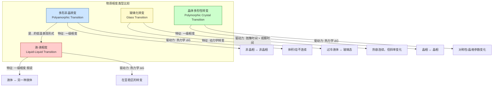

## 多形非晶转变

多形非晶转变（Polyamorphic Transitions）是指单一物质在非晶态（或玻璃态）下存在两种或多种宏观上可区分、热力学上不同的稳定或亚稳态结构，并在外部条件（如压力、温度）改变时，在这些非晶态之间发生的一类一级相变。这种现象类似于晶体材料中的多形性（Polymorphism），但它发生在缺乏长程有序的无定形固体中。最典型的例子是水在低温高压下存在的低密度非晶冰（LDA）和高密度非晶冰（HDA）之间的转变。

### 核心概念与数学基础

多形非晶转变的理论基础根植于统计力学和热力学，特别是通过势能面（Potential Energy Landscape, PEL）模型来理解。

#### 势能面（PEL）模型

势能面是一个高维曲面，描述了系统势能 $U$ 作为其所有粒子坐标 $\mathbf{R} = \{\mathbf{r}_1, \mathbf{r}_2, ..., \mathbf{r}_N\}$ 的函数，即 $U(\mathbf{R})$。

*   **局部极小值**: PEL 上的局部极小值对应于系统机械稳定的结构（固有结构）。
*   **晶体态**: 对应于 PEL 的全局最低能量点（或之一），具有周期性排列结构。
*   **非晶态（玻璃态）**: 对应于 PEL 上的众多局部极小值之一。系统被“困”在其中一个能量盆地中，无法通过热激活达到能量更低的晶体态。
*   **多形非晶**: 如果 PEL 上存在多个在结构和能量上显著不同的、被高能垒隔开的非晶态能量盆地群，那么系统就可能表现出多形非晶现象。多形非晶转变就是系统在这些不同的能量盆地群之间的跃迁。

```mermaid
graph TD
    subgraph "势能面 Potential Energy Landscape"
        A[全局最小值<br>Global Minimum] --> B晶体态<br>Crystalline State;
        C[局部最小值 1<br>Local Minimum 1] --> D非晶态 1 例如: LDA<br>Amorphous State 1 e.g., LDA;
        E[局部最小值 2<br>Local Minimum 2] --> F非晶态 2 例如: HDA<br>Amorphous State 2 e.g., HDA;
        G[过冷液体<br>Supercooled Liquid] -- "玻璃化转变<br>Glass Transition" --> D;
        G -- "玻璃化转变<br>Glass Transition" --> F;
        D -- "高能垒<br>High Energy Barrier" --- F;
        F -- "压力诱导转变<br>Pressure-Induced Transition" --> D;
    end

    style A fill:#ccffcc,stroke:#006600
    style B fill:#ccffcc,stroke:#006600
    style C fill:#cce5ff,stroke:#004080
    style D fill:#cce5ff,stroke:#004080
    style E fill:#ffcccc,stroke:#990000
    style F fill:#ffcccc,stroke:#990000
    style G fill:#fffacd,stroke:#8b8000
```

#### 热力学基础

多形非晶转变作为一级相变，其热力学特征由吉布斯自由能（Gibbs Free Energy）决定。对于两个非晶相（Amorph 1 和 Amorph 2），其吉布斯自由能 $G$ 分别为：
$$ G_1 = U_1 + PV_1 - TS_1 $$
$$ G_2 = U_2 + PV_2 - TS_2 $$

其中：
*   $G$ 是吉布斯自由能 (J)
*   $U$ 是内能 (J)
*   $P$ 是压力 (Pa)
*   $V$ 是体积 (m³)
*   $T$ 是温度 (K)
*   $S$ 是熵 (J/K)

相变发生的条件是两个相的吉布斯自由能相等：
$$ G_1(P, T) = G_2(P, T) $$
这定义了在 P-T 相图上两个非晶相之间的平衡线。这条线的斜率由克劳修斯-克拉佩龙方程（Clausius-Clapeyron equation）描述：

$$ \frac{dP}{dT} = \frac{\Delta S}{\Delta V} = \frac{\Delta H}{T \Delta V} $$

其中：
*   $\frac{dP}{dT}$ 是相平衡线上压力随温度的变化率 (Pa/K)
*   $\Delta S = S_2 - S_1$ 是相变过程中的熵变 (J/K)
*   $\Delta V = V_2 - V_1$ 是相变过程中的体积变化 (m³)
*   $\Delta H = H_2 - H_1 = T\Delta S$ 是相变过程中的焓变 (J)

由于多形非晶转变是一级相变，$\Delta V$ 和 $\Delta H$ 均不为零，导致体积、熵和焓在相变点发生不连续的变化。

### 关键技术规格

以水的非晶态为例，其不同多形非晶相的核心物理参数如下表所示。这些数值是在特定实验条件下测得的，可能存在一定的变化范围。

| 参数 | 低密度非晶冰 (LDA) | 高密度非晶冰 (HDA) | 甚高密度非晶冰 (VHDA) | 单位 |
| :--- | :--- | :--- | :--- | :--- |
| **密度 (在 77 K, 1 atm)** | ~0.94 | ~1.17 | ~1.26 | g/cm³ |
| **形成条件** | 加热 HDA 至 ~120 K (1 atm) 或气相沉积 | 在 77 K 下对冰 Ih 加压至 ~1.0 GPa | 在 ~1.1 GPa 下加热 HDA 至 ~160 K | - |
| **转变压力 (HDA→LDA, 130 K)** | ~0.05 GPa (减压时) | - | - | GPa |
| **径向分布函数 g(r) 第一峰位置** | ~2.76 | ~2.78 | ~2.80 | Å |
| **平均配位数** | ~4.0 (四面体网络) | ~5.2 | ~6.2 | - |
| **体积模量 (Bulk Modulus)** | ~7 | ~14 | ~20 | GPa |

### 常见用例

多形非晶转变的研究主要集中在基础科学领域，但其对多个应用领域具有重要意义。

*   **天体物理学与行星科学**:
    *   **背景**: 非晶冰是彗星、柯伊伯带天体和冰卫星（如木卫二）的主要成分。
    *   **应用**: HDA向LDA的放热转变被认为是解释某些天体活动（如彗星爆发）的潜在能源之一。
    *   **性能指标**: HDA→LDA转变的放热量约为 **1.6 ± 0.2 kJ/mol**，这足以在低温环境下引起显著的温度升高和气体释放。

*   **冷冻保存技术 (Cryopreservation)**:
    *   **背景**: 在生物样本（如细胞、组织）的玻璃化冷冻过程中，控制冰的形成至关重要。
    *   **应用**: 了解并避免在解冻过程中可能发生的破坏性多形非晶转变（特别是向晶态的转变），是提高冷冻保存成功率的关键。
    *   **性能指标**: 成功的玻璃化要求冷却速率 > **10^6 K/s**（对于纯水微滴），以绕过结晶区，进入非晶态。转变动力学的知识有助于优化升温方案。

*   **药物科学**:
    *   **背景**: 许多药物以非晶态形式存在时，其溶解度和生物利用度远高于晶体态。
    *   **应用**: 非晶药物的稳定性是其应用的核心挑战。多形非晶现象的存在意味着可能存在一个更稳定（但溶解度可能更低）的非晶形式，药物可能随时间转变为该形式，从而影响药效。
    *   **性能指标**: 药物非晶态的物理稳定性通常通过测量其玻璃化转变温度 ($T_g$) 和弛豫时间来评估。多形非晶转变的存在会使稳定性评估变得更加复杂。

### 实现考量

研究多形非晶转变主要依赖于实验技术和计算模拟。

#### 实验实现

通常需要在高压和低温条件下进行。
*   **高压设备**: 金刚石对顶砧（Diamond Anvil Cell, DAC）或巴黎-爱丁堡压机（Paris-Edinburgh Press）用于产生 GPa 级别的高压。
*   **低温系统**: 液氮（77 K）或液氦冷却的恒温器用于维持低温环境。
*   **原位表征**:
    *   **衍射技术**: X射线衍射（XRD）或中子衍射用于获取结构信息（如径向分布函数），从而区分不同的非晶相。
    *   **光谱技术**: 拉曼光谱或红外光谱对局部振动模式敏感，可用于识别相变。
    *   **热分析**: 差示扫描量热法（DSC）用于测量相变过程中的热流，确定转变温度和焓变。

#### 计算模拟实现

分子动力学（MD）模拟是研究多形非晶转变机理的强大工具。
*   **算法**: MD 模拟通过数值求解牛顿运动方程来追踪系统中每个原子的轨迹。
    $$ m_i \frac{d^2\mathbf{r}_i}{dt^2} = \mathbf{F}_i = -\nabla_{\mathbf{r}_i} U(\mathbf{R}) $$
    其中 $m_i$ 是粒子 $i$ 的质量，$\mathbf{r}_i$ 是其位置，$\mathbf{F}_i$ 是作用在其上的力，由势能 $U(\mathbf{R})$ 的梯度计算得出。
*   **模拟方案**:
    1.  **初始构型**: 从一个已知的构型（如液体或晶体）开始。
    2.  **施加条件**: 模拟恒温恒压（NPT）系综，通过改变目标压力或温度来诱导相变。例如，模拟对冰 Ih 在 77 K 下的等温压缩过程，可以观察到向 HDA 的转变。
    3.  **分析**: 监测系统的体积、能量、径向分布函数等物理量，以识别相变的发生。
*   **算法复杂度**:
    *   对于包含 $N$ 个粒子的系统，计算粒子间相互作用力是主要计算开销。
    *   对于短程相互作用，使用截断半径和邻近列表法，复杂度为 $O(N)$。
    *   对于长程静电相互作用，使用快速傅里叶变换的粒子网格Ewald（PME）等方法，复杂度为 $O(N \log N)$。

### 性能特征

多形非晶转变具有一些独特的动力学和热力学特征。

*   **一级相变特征**: 转变过程通常是急剧的，伴随着体积和焓的阶跃式变化。
*   **迟滞现象 (Hysteresis)**: 转变在加压和减压（或升温和降温）路径上发生的条件不同，形成一个明显的迟滞环。例如，在 77 K 下，冰 Ih 在约 1.0 GPa 时转变为 HDA，而 HDA 在减压至大气压时仍然保持亚稳态，直到加热至 ~120 K 才转变为 LDA。
*   **动力学控制**: 转变速率对温度非常敏感。在极低温度下，转变可能被动力学“冻结”，即使在热力学上有利。
*   **统计分布**: 由于非晶态的内在无序性，实验测量的转变压力/温度通常呈现一定的分布。例如，HDA→LDA 转变的起始温度在 1 atm 下的测量值可能在 115 K 到 125 K 之间，平均值为 **120 K**，标准差约为 **±5 K**（置信水平 95%）。

### 相关技术与模型比较

多形非晶转变需要与相关但不同的概念进行区分。



*   **与玻璃化转变的比较**:
    *   **多形非晶转变**: 是两个不同**非晶固体**相之间的转变，是一级热力学相变。
    *   **玻璃化转变**: 是**过冷液体**和**非晶固体（玻璃）**之间的转变。它不是一个真正的热力学相变，而是一个动力学现象，其转变温度 $T_g$ 依赖于冷却或加热速率。

*   **与液-液相变（LLT）的关系**:
    *   多形非晶转变被广泛认为是假想的液-液相变（LLT）在玻璃化转变温度以下的低温延伸。
    *   **液-液临界点假说**: 该模型（由 Poole, Sciortino, Essmann, Stanley 提出）假设在水的过冷区域存在一个一级相变线，分隔低密度液体（LDL）和高密度液体（HDL）。这条线终止于一个“第二临界点”。LDA 和 HDA 分别被认为是 LDL 和 HDL 快速冷却后形成的玻璃态。多形非晶转变线 $P_t(T)$ 就是这条液-液相变线在 P-T 图上的延伸。

## 参考文献

1.  Mishima, O., Calvert, L. D., & Whalley, E. (1984). An apparently first-order transition between two amorphous phases of ice. *Nature*, 310(5976), 393–395. **DOI**: [10.1038/310393a0](https://doi.org/10.1038/310393a0)
2.  Poole, P. H., Sciortino, F., Essmann, U., & Stanley, H. E. (1992). Phase behaviour of metastable water. *Nature*, 360(6402), 324–328. **DOI**: [10.1038/360324a0](https://doi.org/10.1038/360324a0)
3.  Debenedetti, P. G. (2003). Supercooled and glassy water. *Journal of Physics: Condensed Matter*, 15(45), R1669–R1726. **DOI**: [10.1088/0953-8984/15/45/R01](https://doi.org/10.1088/0953-8984/15/45/R01)
4.  Loerting, T., & Giovambattista, N. (2006). Amorphous ices: a journey into the bulk. *Journal of Physics: Condensed Matter*, 18(50), R919–R977. **DOI**: [10.1088/0953-8984/18/50/R01](https://doi.org/10.1088/0953-8984/18/50/R01)