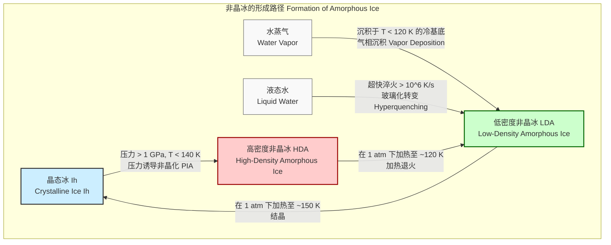
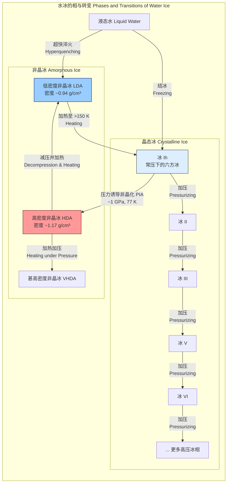

## 压力诱导的冰非晶化

压力诱导的冰非晶化（Pressure Induced Amorphization, PIA）是一种在低温下对晶态固体（如此处指的冰 Ih）施加高压，使其转变为亚稳态非晶固体的物理过程。该过程绕过了液态，是一种固-固相变。对于水冰而言，这个过程将常规的六方冰（ice Ih）转变为高密度非晶冰（High-Density Amorphous ice, HDA）。此现象于1984年由 Mishima、Calvert 和 Whalley 首次报道，为了解水在极端条件下的行为以及非晶态物质的形成机制提供了关键见解。

### 核心概念与数学基础

PIA 的核心在于晶格在机械压力下的失稳。在低温下，分子的热运动不足以使其重新排列成另一个能量更优的晶体结构（如冰 II 或冰 III）。相反，当压力超过晶格的弹性极限时，长程有序结构会突然坍塌，形成一个拓扑无序的（即非晶态的）网络。

#### 热力学视角

从热力学角度看，相变由吉布斯自由能 ($G$) 驱动。一个系统会自发地向吉布斯自由能更低的状态转变。吉布斯自由能定义为：

$$ G = U + PV - TS $$

其中：
*   $G$ 是吉布斯自由能
*   $U$ 是系统的内能
*   $P$ 是压力
*   $V$ 是体积
*   $T$ 是绝对温度
*   $S$ 是熵

在 PIA 过程中，$T$ 保持恒低。当施加压力 $P$ 时，$PV$ 项变得显著。晶态冰 Ih 的体积比非晶态的 HDA 大。随着压力 $P$ 的增加，高体积的冰 Ih 相对于低体积的 HDA 在能量上变得越来越不利。当冰 Ih 的吉布斯自由能 $G_{Ih}(P, T)$ 超过 HDA 的吉布斯自由能 $G_{HDA}(P, T)$ 时，相变在热力学上是可能的。

然而，PIA 通常被认为是一个动力学过程，而非严格的热力学平衡相变。晶格的坍塌发生在它达到一个机械不稳定的点，这可能发生在压力略高于热力学平衡转变压力的地方。

#### 状态方程 (Equation of State, EOS)

为了量化压力和体积之间的关系，通常使用状态方程。三阶 Birch-Murnaghan 状态方程被广泛用于描述固体在压缩下的行为：

$$ P(V) = \frac{3B_0}{2} \left[ \left(\frac{V_0}{V}\right)^{7/3} - \left(\frac{V_0}{V}\right)^{5/3} \right] \left\{ 1 + \frac{3}{4}(B'_0 - 4) \left[ \left(\frac{V_0}{V}\right)^{2/3} - 1 \right] \right\} $$

其中：
*   $P(V)$ 是体积为 $V$ 时的压力
*   $V_0$ 是零压下的平衡体积
*   $B_0$ 是零压下的体积模量（材料抵抗均匀压缩的能力）
*   $B'_0$ 是体积模量对压力的一阶导数，即 $B'_0 = \left( \frac{\partial B}{\partial P} \right)_{T, P=0}$

通过为冰 Ih 和 HDA 分别拟合实验的 $P-V$ 数据，可以确定它们的 $B_0$ 和 $B'_0$ 值。这使得我们能够预测它们在不同压力下的能量和稳定性。冰 Ih 的体积模量远低于高压冰相，这解释了其在压力下相对容易坍塌。

### 关键技术规格

下表总结了在 77 K (-196 °C) 下进行 PIA 实验的关键参数。

| 参数 | 值 | 单位 | 描述 |
| :--- | :--- | :--- | :--- |
| 起始材料 | 冰 Ih (六方晶冰) | - | 地球上最常见的冰形式 |
| 转变温度 | 77 - 140 | K | PIA 发生的典型低温范围 |
| 转变压力 (P_trans) | ~1.0 - 1.2 | GPa | 在 77 K 下，冰 Ih 坍塌成 HDA 的压力 |
| 冰 Ih 密度 (ρ_Ih) | 0.934 (在 1 atm, 77 K) | g/cm³ | 起始晶相的密度 |
| HDA 密度 (ρ_HDA) | ~1.17 (在 1 GPa, 77 K) | g/cm³ | 压力诱导后形成的高密度非晶相的密度 |
| 体积变化 (ΔV/V₀) | ~ -20% | % | 从冰 Ih 到 HDA 的显著体积坍塌 |
| 冰 Ih 体积模量 (B₀) | ~8.9 | GPa | 表明冰 Ih 相对“软” |
| HDA 体积模量 (B₀) | ~17.5 | GPa | 表明 HDA 比冰 Ih 更难压缩 |

### 常见用例与定量指标

PIA 本身是一种基础物理现象，其“用例”主要体现在科学研究领域。

*   **行星科学**:
    *   **应用**: 理解木卫二（Europa）、木卫三（Ganymede）等冰卫星的内部结构。这些卫星的冰壳深处承受着巨大的压力。
    *   **定量指标**: 木卫二冰壳底部压力估计约为 130 MPa (0.13 GPa)，而木卫三的压力可达 1 GPa 以上，足以在其内部形成 HDA 或高压晶冰。PIA 的存在影响着对这些天体内部热演化和物质循环的建模。

*   **材料科学**:
    *   **应用**: 作为研究其他材料（如硅、石英、磷酸盐）中压力诱导非晶化的模型系统。水的强方向性氢键网络使其成为一个特别有趣的案例。
    *   **定量指标**: 比较不同材料的临界非晶化压力与它们的体积模量之比 ($P_c / B_0$)，可以揭示非晶化机制的普适性规律。

*   **物理化学**:
    *   **应用**: 探索水的复杂相图和玻璃态物质的性质。HDA 和 LDA（低密度非晶冰）之间的转变被认为是“多非晶性”（polyamorphism）的典型例子，类似于液体中的液-液相变。
    *   **定量指标**: HDA 到 LDA 的转变在加热到约 120 K (在环境压力下) 时发生，伴随着约 25% 的密度降低，这是一个急剧的一阶类相变。

### 实现考量

在实验上，PIA 通常在金刚石对顶砧 (Diamond Anvil Cell, DAC) 或活塞-圆筒装置中实现。在计算上，分子动力学 (MD) 模拟是研究其原子尺度机制的强大工具。

#### 分子动力学 (MD) 模拟算法

1.  **系统初始化**: 构建一个包含数百到数千个水分子的超晶胞，其结构为冰 Ih。选用精确的水模型（如 TIP4P/Ice, TIP5P）。
2.  **平衡**: 在目标低温（如 77 K）和低压（如 1 atm）下，使用 NPT 系综（恒定粒子数、压力、温度）对系统进行弛豫，以达到热力学平衡。
3.  **压缩**: 逐步或连续增加外部压力，同时保持温度恒定。压力增加的速率必须足够慢，以避免产生过度的冲击波，但又要足够快以模拟实验条件。
4.  **监测**: 在模拟过程中，持续监测系统的关键物理量，如体积（或密度）、势能、径向分布函数 $g(r)$ 和序参量。
5.  **分析**:
    *   体积的突然下降标志着相变的发生。
    *   径向分布函数 $g(r)$ 从具有尖锐峰值的晶体特征转变为只有几个宽峰的液体状特征，证实了长程有序的丧失。

#### 算法复杂度

对于一个包含 $N$ 个水分子的系统，MD 模拟的计算复杂度主要由力场计算决定。
*   **短程相互作用**: 通常使用截断半径，计算复杂度为 $O(N)$。
*   **长程静电相互作用**: 使用如粒子网格 Ewald (PME) 等高效算法，其复杂度约为 $O(N \log N)$。

因此，单步 MD 模拟的总复杂度通常为 $O(N \log N)$。模拟 PIA 需要数万到数百万个时间步，使得总计算成本非常高。

### 性能特征

PIA 过程表现出明确的统计和动力学特征。

*   **转变压力分布**: 实验测量的转变压力并非一个精确值，而是在一个范围内分布。例如，在 77 K 下，转变通常在 1.0 GPa 左右开始，并在约 0.2 GPa 的压力范围内完成。这种分布的均值和标准差（例如，1.05 ± 0.05 GPa）反映了成核的随机性和样品条件的细微差异。
*   **滞后现象 (Hysteresis)**: PIA 是一个不可逆的过程。一旦形成 HDA，如果减压，它不会直接变回冰 Ih。相反，它会保持非晶态直到压力降低到非常低的水平。这与具有明确平衡线的一阶可逆相变形成鲜明对比。
*   **转变速率**: 转变速率对温度和压力过冲（超过临界压力的程度）高度敏感。其动力学可以用经典成核理论来描述，但通常被认为是整个晶格的协同失稳。

### 相关技术与比较

PIA 只是制备非晶冰的几种方法之一。

#### 数学模型比较

*   **压力诱导非晶化 (PIA)**:
    *   **驱动力**: 机械能输入 ($P \Delta V$)。系统被迫越过一个动力学势垒，从晶态的能量极小值点“掉入”非晶态的能量极小值点。
    *   **数学描述**: 通过比较 $G_{crystal}(P,T)$ 和 $G_{amorphous}(P,T)$ 的能量曲线。当 $P > P_{trans}$ 时，$G_{amorphous} < G_{crystal}$。转变点由晶格的机械失稳条件 $\frac{\partial P}{\partial V} \ge 0$ (违反热力学稳定性) 或剪切模量趋于零来确定。

*   **气相沉积 (Vapor Deposition)**:
    *   **驱动力**: 动力学限制。水分子随机到达冷表面，其动能不足以克服表面扩散势垒以找到能量最低的晶格位置，因此被“冻结”在无序构型中。
    *   **数学描述**: 可以用表面生长模型（如 Ballistic Deposition 模型）来描述，其中粒子的吸附和扩散过程是关键。最终结构的密度和孔隙率取决于沉积速率和基底温度。

*   **超快淬火 (Hyperquenching)**:
    *   **驱动力**: 避免成核。冷却速率必须足够快，以至于系统没有足够的时间形成晶核。
    *   **数学描述**: 由经典成核理论 (Classical Nucleation Theory, CNT) 描述。成核速率 $J$ 与过冷度 $\Delta T$ 和界面能 $\gamma$ 等参数相关。玻璃化转变发生在冷却时间尺度短于成核所需时间尺度时。

### 冰的多晶型与非晶型关系

下图展示了 PIA 在水冰复杂相图中的位置。

### 参考文献

*   Mishima, O., Calvert, L. D., & Whalley, E. (1984). 'Melting ice' I at 77 K and 10 kbar: a new method of making amorphous solids. *Nature*, 310(5976), 393–395. DOI: [10.1038/310393a0](https://doi.org/10.1038/310393a0)
*   Loerting, T., & Giovambattista, N. (2006). Amorphous ices: a playground for theory and experiment. *Journal of Physics: Condensed Matter*, 18(50), R919–R976. DOI: [10.1088/0953-8984/18/50/R01](https://doi.org/10.1088/0953-8984/18/50/R01)
*   Debenedetti, P. G. (2003). Supercooled and glassy water. *Journal of Physics: Condensed Matter*, 15(45), R1669–R1726. DOI: [10.1088/0953-8984/15/45/R01](https://doi.org/10.1088/0953-8984/15/45/R01)