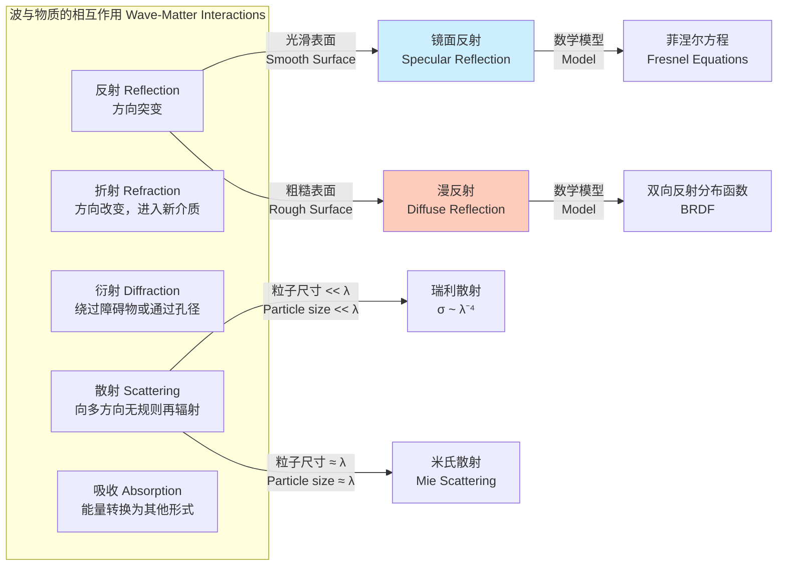

## 反射 (Reflection)

反射是一种物理现象，指波（如光、声波或物质波）在两种不同介质的界面处传播方向发生改变，并返回其来源介质的现象。本文档将从科学和数学的严谨角度，深入探讨反射的核心概念、技术规格、数学模型及其应用。

### 1. 核心概念与数学基础

反射现象可以用几何光学和波动光学两种理论框架来描述。

#### 1.1 几何光学：反射定律

在尺度远大于波长的宏观系统中，光的传播可以近似为直线，即光线。几何反射遵循两个基本定律：

1.  **共面定律**：入射光线、反射光线和法线（垂直于反射面的直线）三者在同一平面内。
2.  **等角定律**：反射角（反射光线与法线的夹角）等于入射角（入射光线与法线的夹角）。

其数学表达式为：
$$ \theta_r = \theta_i $$
其中：
*   $\theta_i$ 是入射角 (angle of incidence)。
*   $\theta_r$ 是反射角 (angle of reflection)。

这两个角都是相对于界面法线测量的。

```mermaid
graph TD
    subgraph "几何反射: 反射定律 Geometric Reflection: Law of Reflection"
        direction LR
        A[入射光线<br>Incident Ray] --> P;
        P --> B[反射光线<br>Reflected Ray];
        N[法线<br>Normal] --- P;
        S[反射面<br>Reflecting Surface]
        
        P -- "入射角 θi" -- N;
        P -- "反射角 θr" -- N;
        subgraph "关系: θi = θr"
        end
    end

    style N stroke-dasharray: 5 5
```

#### 1.2 波动光学：菲涅尔方程 (Fresnel Equations)

当考虑光的电磁波性质时，需要使用麦克斯韦方程组来描述光在介质界面的行为。菲涅尔方程是麦克斯韦方程组在介质边界条件下的解析解，它精确地描述了反射光和折射光的振幅、强度和相位。

方程的解取决于光的偏振状态，通常分解为两个正交分量：
*   **s-偏振 (TE模)**：电场矢量垂直于入射面。
*   **p-偏振 (TM模)**：电场矢量平行于入射面。

反射系数（振幅）$r$ 和透射系数（振幅）$t$ 定义如下：

**s-偏振 (s-polarization):**
$$ r_s = \frac{E_{rs}}{E_{is}} = \frac{n_1 \cos\theta_i - n_2 \cos\theta_t}{n_1 \cos\theta_i + n_2 \cos\theta_t} $$
$$ t_s = \frac{E_{ts}}{E_{is}} = \frac{2 n_1 \cos\theta_i}{n_1 \cos\theta_i + n_2 \cos\theta_t} $$

**p-偏振 (p-polarization):**
$$ r_p = \frac{E_{rp}}{E_{ip}} = \frac{n_2 \cos\theta_i - n_1 \cos\theta_t}{n_2 \cos\theta_i + n_1 \cos\theta_t} $$
$$ t_p = \frac{E_{tp}}{E_{ip}} = \frac{2 n_1 \cos\theta_i}{n_2 \cos\theta_i + n_1 \cos\theta_t} $$

其中：
*   $n_1, n_2$ 分别是介质1和介质2的折射率 (refractive index)。
*   $\theta_i$ 是入射角。
*   $\theta_t$ 是折射角，由斯涅尔定律 (Snell's Law) 决定：$n_1 \sin\theta_i = n_2 \sin\theta_t$。
*   $E_{is}, E_{ip}$ 是入射波的s-偏振和p-偏振电场振幅。
*   $E_{rs}, E_{rp}$ 是反射波的s-偏振和p-偏振电场振幅。
*   $E_{ts}, E_{tp}$ 是透射（折射）波的s-偏振和p-偏振电场振幅。

反射率 (Reflectivity) $R$ 是反射光功率与入射光功率之比，等于反射系数振幅的平方：
$$ R_s = |r_s|^2 = \left( \frac{n_1 \cos\theta_i - n_2 \cos\theta_t}{n_1 \cos\theta_i + n_2 \cos\theta_t} \right)^2 $$
$$ R_p = |r_p|^2 = \left( \frac{n_2 \cos\theta_i - n_1 \cos\theta_t}{n_2 \cos\theta_i + n_1 \cos\theta_t} \right)^2 $$
总反射率 $R$ 对于非偏振光是s-偏振和p-偏振反射率的平均值：
$$ R = \frac{R_s + R_p}{2} $$

#### 1.3 特殊现象

*   **布儒斯特角 (Brewster's Angle, $\theta_B$)**: 当p-偏振光的反射率为零时的入射角。此时，反射光为纯s-偏振光。
    $$ \theta_B = \arctan\left(\frac{n_2}{n_1}\right) $$

*   **全内反射 (Total Internal Reflection, TIR)**: 当光从光密介质 ($n_1 > n_2$) 入射到光疏介质时，若入射角大于临界角 $\theta_c$，光将不会发生折射，而是全部被反射回原介质。
    $$ \theta_c = \arcsin\left(\frac{n_2}{n_1}\right) $$

### 2. 关键技术规格

反射特性与材料的折射率和入射条件密切相关。

**表1：常见材料在589.3 nm（钠D线）下的折射率**

| 材料 (Material) | 折射率 (n) (无单位) |
| :--- | :--- |
| 真空 (Vacuum) | 1.00000 |
| 空气 (Air, STP) | 1.000293 |
| 水 (Water) | 1.333 |
| N-BK7 玻璃 | 1.5168 |
| 熔融石英 (Fused Silica) | 1.4585 |
| 蓝宝石 (Sapphire) | 1.768 |
| 硅 (Silicon) | 3.882 |

**表2：常见界面在589.3 nm下的光学特性**

| 界面 (Interface) | 临界角 $\theta_c$ | 布儒斯特角 $\theta_B$ | 正入射反射率 $R_0$ |
| :--- | :--- | :--- | :--- |
| 空气 -> N-BK7 | 无 | $56.60^\circ$ | 4.22% |
| N-BK7 -> 空气 | $41.25^\circ$ | $33.40^\circ$ | 4.22% |
| 空气 -> 水 | 无 | $53.11^\circ$ | 2.04% |
| 水 -> 空气 | $48.75^\circ$ | $36.89^\circ$ | 2.04% |

### 3. 常见用例与性能指标

| 用例 (Use Case) | 核心原理 | 关键性能指标 | 量化数值 |
| :--- | :--- | :--- | :--- |
| **平面镜 (Mirrors)** | 镜面反射 (Specular Reflection) | 反射率 (Reflectivity) | 增强型铝膜: 90-95% (可见光) <br> 介质膜反射镜: >99.9% (特定波段) |
| **增透膜 (Anti-Reflection Coating)** | 薄膜干涉 (Thin-Film Interference) | 残余反射率 (Residual Reflectivity) | 单层MgF₂: ~1.3% <br> 多层宽带增透膜: <0.5% (400-700 nm) |
| **光纤通信 (Optical Fiber)** | 全内反射 (TIR) | 传输损耗 (Transmission Loss) | < 0.2 dB/km @ 1550 nm |
| **雷达与隐身技术 (Radar & Stealth)** | 电磁波反射与吸收 | 雷达散射截面 (Radar Cross-Section, RCS) | F-22 猛禽战斗机: ~0.0001 m² (估计值) |
| **超声成像 (Ultrasound Imaging)** | 声波反射 | 声阻抗失配 (Acoustic Impedance Mismatch) | 组织界面反射系数: 0.01 - 0.1 |

### 4. 实现考量：多层介质膜设计

设计高性能反射镜或增透膜通常需要使用多层薄膜。传输矩阵法 (Transfer-Matrix Method) 是分析其光学特性的标准算法。

对于一个包含 $N$ 层的薄膜系统，其总特性矩阵 $M$ 是各层矩阵与界面矩阵的乘积：
$$ M = \begin{pmatrix} M_{11} & M_{12} \\ M_{21} & M_{22} \end{pmatrix} = D_0^{-1} \left( \prod_{j=1}^{N} D_j P_j D_j^{-1} \right) D_{sub} $$
实际上，更简洁的表达为：
$$ M = \begin{pmatrix} m_{11} & m_{12} \\ m_{21} & m_{22} \end{pmatrix} = M_1 M_2 \cdots M_N $$
其中，第 $j$ 层的特性矩阵 $M_j$ 为：
$$ M_j = \begin{pmatrix} \cos(\delta_j) & \frac{i}{\eta_j} \sin(\delta_j) \\ i\eta_j \sin(\delta_j) & \cos(\delta_j) \end{pmatrix} $$
其中：
*   $\delta_j = \frac{2\pi}{\lambda} n_j d_j \cos\theta_j$ 是第 $j$ 层的相位厚度。
*   $d_j$ 是第 $j$ 层的物理厚度。
*   $\lambda$ 是真空中的波长。
*   $\eta_j$ 是第 $j$ 层的等效光学导纳，对于TE模为 $n_j \cos\theta_j$，对于TM模为 $n_j / \cos\theta_j$。

整个膜系的振幅反射系数 $r$ 可以通过总矩阵 $M$ 和入射/出射介质的导纳 $\eta_{in}, \eta_{sub}$ 计算得出：
$$ r = \frac{(\eta_{in} m_{11} + \eta_{in} \eta_{sub} m_{12}) - (m_{21} + \eta_{sub} m_{22})}{(\eta_{in} m_{11} + \eta_{in} \eta_{sub} m_{12}) + (m_{21} + \eta_{sub} m_{22})} $$
总反射率 $R = |r|^2$。

**算法复杂度分析**:
该算法的计算复杂度与膜层数 $N$ 呈线性关系，即 $O(N)$，因为计算总矩阵需要进行 $N-1$ 次 $2 \times 2$ 矩阵乘法。

### 5. 性能特征

反射率 $R$ 不是一个常数，它强烈依赖于多个参数：
*   **波长 ($\lambda$)**: 材料的折射率随波长变化（色散），导致反射率也随波长变化。
*   **入射角 ($\theta_i$)**: 如图所示，s-偏振和p-偏振的反射率随入射角的变化行为显著不同。
*   **偏振 (Polarization)**: p-偏振光在布儒斯特角处反射率为零，而s-偏振光反射率单调递增。
*   **表面粗糙度 (Surface Roughness)**: 当表面粗糙度的均方根值 $\sigma$ 与波长 $\lambda$ 相当时，会发生从镜面反射到漫反射的转变。瑞利判据 (Rayleigh Criterion) 指出，当粗糙度引起的光程差大于 $\lambda/4$ 时，漫反射变得显著。

**统计性能**:
对于一个宽带介质反射镜，其性能通常表示为在特定光谱范围内的平均反射率和标准差。例如，一个商用反射镜可能标注为：“平均反射率 $R_{avg} > 99.8\%$，在 450-650 nm 范围内，置信水平为 95%”。

```mermaid
graph TD
    subgraph "波在界面的相互作用 Wave Interaction at Interface"
        A[入射波<br>Incident Wave] --> I界面<br>Interface;
        I -- "n1 > n2, θi < θc" --> R[反射<br>Reflection];
        I -- "n1 > n2, θi < θc" --> T[折射<br>Refraction];
        I -- "n1 > n2, θi > θc" --> TIR[全内反射<br>Total Internal Reflection];
        I -- "θi = θB" --> Brewster[布儒斯特角<br>Brewster's Angle, R_p=0];

        R -- "遵循菲涅尔方程<br>Governed by Fresnel Eq." --> R_s[s-偏振反射率];
        R -- "遵循菲涅尔方程<br>Governed by Fresnel Eq." --> R_p[p-偏振反射率];
        T -- "遵循斯涅尔定律<br>Governed by Snell's Law" --> T_s[s-偏振透射率];
        T -- "遵循斯涅尔定律<br>Governed by Snell's Law" --> T_p[p-偏振透射率];
    end

    style TIR fill:#ccf,stroke:#333,stroke-width:2px
    style Brewster fill:#cfc,stroke:#333,stroke-width:2px
```

### 6. 相关技术与比较

反射是波与物质相互作用的几种基本方式之一。



*   **反射 vs. 折射**: 这两种现象在界面处同时发生，能量在两者之间分配，由菲涅尔方程决定。反射使波返回原介质，折射使波进入新介质。
*   **反射 vs. 散射**: 镜面反射是相干的，发生在光滑表面。散射（或漫反射）是非相干的，发生在粗糙表面或非均匀介质中。漫反射可以被看作是大量微小镜面在不同方向上的反射的集合。
*   **反射 vs. 衍射**: 反射是界面现象，而衍射是波前在遇到障碍物或孔径时发生的弯曲。

### 7. 其他领域的反射

#### 7.1 量子力学中的反射

在量子力学中，粒子由波函数 $\Psi(x,t)$ 描述。当粒子遇到一个势垒（如势阶）时，其波函数会部分反射，部分透射，即使粒子的能量高于势垒高度。

对于一个能量为 $E$ 的粒子，从区域1（势能 $V=0$）入射到区域2（势能 $V=V_0$）的势阶，其反射系数 $R$ 为：
$$ R = \left| \frac{k_1 - k_2}{k_1 + k_2} \right|^2 $$
其中：
*   $k_1 = \frac{\sqrt{2mE}}{\hbar}$ 是区域1的波数。
*   $k_2 = \frac{\sqrt{2m(E-V_0)}}{\hbar}$ 是区域2的波数。
*   $m$ 是粒子质量。
*   $\hbar$ 是约化普朗克常数。

此现象导致了隧道效应等纯粹的量子行为。

#### 7.2 几何学中的反射

在欧几里得几何中，反射是一种将一个点或图形映射到其“镜像”位置的变换。对于一个经过原点的直线 $ax+by=0$ 的反射，其变换矩阵为：
$$ M = \frac{1}{a^2+b^2} \begin{pmatrix} b^2-a^2 & -2ab \\ -2ab & a^2-b^2 \end{pmatrix} $$
将此矩阵应用于向量 $\begin{pmatrix} x \\ y \end{pmatrix}$ 即可得到其反射后的坐标。

### 8. 参考文献

1.  Hecht, E. (2017). *Optics* (5th ed.). Pearson. (A foundational textbook on optics).
2.  Born, M., & Wolf, E. (1999). *Principles of Optics: Electromagnetic Theory of Propagation, Interference and Diffraction of Light* (7th ed.). Cambridge University Press. DOI: [10.1017/CBO9781139644181](https://doi.org/10.1017/CBO9781139644181)
3.  Macleod, H. A. (2010). *Thin-Film Optical Filters* (4th ed.). CRC Press. (A comprehensive reference for thin-film design, including the transfer-matrix method).
4.  Griffiths, D. J. (2018). *Introduction to Quantum Mechanics* (3rd ed.). Cambridge University Press. (For quantum mechanical reflection).