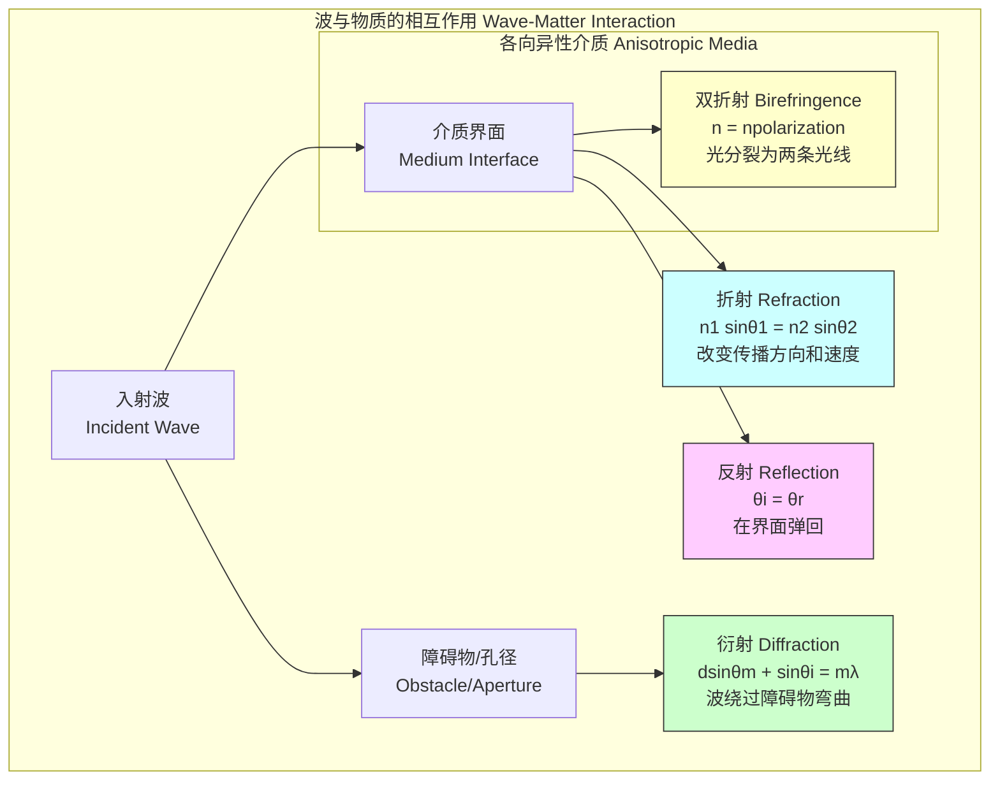

## 折射

折射是波（例如光、声波或水波）在穿过两种不同介质的界面时，由于波速发生变化而导致其传播方向发生改变的现象。这一基本物理现象是许多光学仪器和自然现象的基础。本文档将从科学和数学的⻆度对折射进行深入、严谨的阐述。

### 核心概念与数学基础

#### 折射率 (Refractive Index)
折射的核心在于波在不同介质中传播速度的变化。为了量化这种变化，我们引入了**折射率**（或称折射系数）的概念，符号为 $n$。对于给定的介质，其绝对折射率定义为真空中的光速 $c$ 与光在该介质中的相速度 $v$ 之比：

$$
n = \frac{c}{v}
$$

其中：
*   $c$ 是真空中的光速，其精确值为 $299,792,458$ 米/秒。
*   $v$ 是光在介质中的相速度。
*   $n$ 是一个无量纲的量。

根据定义，真空的折射率 $n_{vacuum} = 1$。对于其他任何透明介质，$v < c$，因此 $n > 1$。折射率越高，光在该介质中的传播速度越慢。

#### 斯涅尔定律 (Snell's Law)
斯涅尔定律是描述折射现象的根本定律，它精确地描述了入射角和折射角之间的关系。当一束光从折射率为 $n_1$ 的介质入射到折射率为 $n_2$ 的介质时，其关系式如下：

$$
n_1 \sin(\theta_1) = n_2 \sin(\theta_2)
$$

其中：
*   $n_1$ 是入射介质的折射率。
*   $\theta_1$ 是入射角，即入射光线与界面法线之间的夹角。
*   $n_2$ 是折射介质的折射率。
*   $\theta_2$ 是折射角，即折射光线与界面法线之间的夹角。

```mermaid
graph TD
    subgraph "折射几何示意图 Refraction Geometry"
        direction LR
        A[入射光线<br>Incident Ray] --> B界面<br>Interface;
        B --> C[折射光线<br>Refracted Ray];
        D法线<br>Normal -- "θ1<br>入射角" -- A;
        D -- "θ2<br>折射角" -- C;
        E["介质 1<br>Medium 1 n1"]
        F["介质 2<br>Medium 2 n2"]
    end
    style D stroke-dasharray: 5 5
```

斯涅尔定律可以从**费马原理**（Fermat's Principle of Least Time）推导得出。该原理指出，光在两点之间传播的路径是光程（$S = \int n \, ds$）取极值（通常是最小值）的路径。

#### 全内反射 (Total Internal Reflection)
当光从光密介质（较高折射率 $n_1$）射向光疏介质（较低折射率 $n_2$）时，如果入射角 $\theta_1$ 足够大，折射角 $\theta_2$ 会达到 $90^\circ$。此时的入射角被称为**临界角** $\theta_c$。当入射角大于临界角时，光将不会进入第二种介质，而是完全被界面反射回第一种介质，这种现象称为全内反射。

临界角的计算公式为：
$$
\theta_c = \arcsin\left(\frac{n_2}{n_1}\right) \quad (\text{其中 } n_1 > n_2)
$$

#### 色散 (Dispersion)
在大多数介质中，折射率 $n$ 并非一个常数，而是依赖于光的波长 $\lambda$，即 $n = n(\lambda)$。这种现象称为色散。通常情况下，对于可见光，波长越短（如蓝光和紫光），折射率越大。这种关系可以通过**柯西公式**（Cauchy's equation）进行近似描述：

$$
n(\lambda) = A + \frac{B}{\lambda^2} + \frac{C}{\lambda^4} + \cdots
$$

其中 $A$, $B$, $C$ 是由介质材料决定的经验常数。

### 关键技术规格

不同材料的折射率是其关键的光学参数。下表列出了一些常见材料在标准条件（通常为 20°C，1 atm）下，对应钠黄光 D 线（$\lambda \approx 589.3$ nm）的折射率。

| 介质 (Medium) | 折射率 (n) | 参考波长 (λ) [nm] | 状态 (State) |
| :--- | :--- | :--- | :--- |
| 真空 (Vacuum) | 1.0 (定义值) | N/A | N/A |
| 空气 (Air) | 1.000293 | 589.3 | 气体 (Gas) |
| 水 (Water) | 1.333 | 589.3 | 液体 (Liquid) |
| 乙醇 (Ethanol) | 1.361 | 589.3 | 液体 (Liquid) |
| 熔融石英 (Fused Silica) | 1.458 | 589.3 | 固体 (Solid) |
| 冕牌玻璃 (Crown Glass, BK7) | 1.5168 | 587.6 (d-line) | 固体 (Solid) |
| 聚碳酸酯 (Polycarbonate) | 1.586 | 589.3 | 固体 (Solid) |
| 蓝宝石 (Sapphire) | 1.768 | 589.3 | 固体 (Solid) |
| 钻石 (Diamond) | 2.417 | 589.3 | 固体 (Solid) |

### 常见用例

折射现象在科学和技术中有广泛应用，其性能通常由精确的量化指标来衡量。

*   **透镜 (Lenses)**
    *   **功能**: 利用折射来汇聚或发散光线，用于成像（如相机、望远镜、显微镜）或光束控制。
    *   **性能指标**: **焦距 (Focal Length, $f$)**。对于一个薄透镜，其焦距由**透镜制造者公式**（Lensmaker's Equation）决定：
        $$
        \frac{1}{f} = (n - n_m) \left[ \frac{1}{R_1} - \frac{1}{R_2} + \frac{(n - n_m)d}{n R_1 R_2} \right]
        $$
        其中，$n$ 是透镜材料的折射率，$n_m$ 是周围介质的折射率（通常为空气，$n_m \approx 1$），$R_1$ 和 $R_2$ 是透镜两个表面的曲率半径（遵循符号约定），$d$ 是透镜中心厚度。对于薄透镜（$d \to 0$），公式简化为 $\frac{1}{f} \approx (n - 1) (\frac{1}{R_1} - \frac{1}{R_2})$。

*   **棱镜 (Prisms)**
    *   **功能**: 利用色散现象将复色光（如白光）分解为其组成光谱。
    *   **性能指标**: **角色散 (Angular Dispersion, $D$)**，定义为出射角随波长的变化率 $D = \frac{d\theta_{out}}{d\lambda}$。它量化了棱镜分离不同颜色光的能力。

*   **光纤 (Optical Fibers)**
    *   **功能**: 通过在纤芯和包层界面上不断发生全内反射来长距离传输光信号。
    *   **性能指标**:
        *   **数值孔径 (Numerical Aperture, NA)**: 衡量光纤接收光的能力。$NA = \sqrt{n_{core}^2 - n_{cladding}^2}$，其中 $n_{core}$ 和 $n_{cladding}$ 分别是纤芯和包层的折射率。典型的单模光纤 NA 约为 0.14。
        *   **衰减 (Attenuation)**: 信号在传输过程中的光功率损失，单位为分贝/公里 (dB/km)。在 1550 nm 波长下，标准单模光纤的衰减可低至 0.18 dB/km。

### 实现考量

在计算机图形学和光学设计中，折射的仿真是通过**光线追踪 (Ray Tracing)** 算法实现的。该算法模拟单个光线的路径。

#### 折射光线追踪算法

以下是计算折射光线的核心步骤：

1.  **光线定义**: 一条光线由其起点 $\vec{P}_0$ 和单位方向向量 $\vec{d}$ 定义。
2.  **求交**: 计算光线与场景中物体表面（如球面、平面）的交点 $\vec{I}$。
3.  **计算法线**: 在交点 $\vec{I}$ 处，计算出指向光线来源一侧的单位表面法向量 $\vec{N}$。
4.  **应用矢量斯涅尔定律**: 计算折射后的光线方向向量 $\vec{t}$。令 $\eta = n_1 / n_2$ 为折射率之比，$\vec{d}$ 为入射方向，$\vec{N}$ 为法线方向，则折射方向 $\vec{t}$ 为：
    $$
    \vec{t} = \eta \vec{d} + (\eta (\vec{d} \cdot \vec{N}) - \sqrt{1 - \eta^2(1 - (\vec{d} \cdot \vec{N})^2)}) \vec{N}
    $$
    *   在计算前，必须检查根号内的项是否为负。如果为负，则发生全内反射，此时应计算反射光线而非折射光线。该项 $k = 1 - \eta^2(1 - (\vec{d} \cdot \vec{N})^2)$。若 $k < 0$，则发生全内反射。
5.  **生成新光线**: 以交点 $\vec{I}$ 为新起点，$\vec{t}$ 为新方向，生成一条新的折射光线，并递归地追踪下去。

#### 算法复杂度分析
对于一个包含 $M$ 个物体的场景，追踪 $N$ 条初始光线，并且递归深度（允许的最大折射/反射次数）为 $k$ 的光线追踪算法，其时间复杂度通常为：
$$ O(N \cdot M \cdot k) $$
这是因为每条光线的每一步递归都需要与场景中的所有物体进行求交测试。可以使用空间划分结构（如 k-d 树或 BVH）将复杂度优化到接近 $O(N \cdot \log(M) \cdot k)$。

```mermaid
graph TD
    A[开始: 定义初始光线 P0, d] --> B找到光线与场景最近的交点 I;
    B -- 无交点 --> C[终止光线];
    B -- 找到交点 --> D[计算交点处的法向量 N];
    D --> E计算 k = 1 - n1/n2^2 * 1 - d·N^2;
    E -- "k < 0? 全内反射" --> F[计算反射光线方向 r];
    E -- "k >= 0? 折射" --> G[计算折射光线方向 t];
    F --> H[创建新光线 I, r 并追踪];
    G --> H[创建新光线 I, t 并追踪];
    H --> B;

    style A fill:#ccf
    style C fill:#fcc
    style H fill:#cfc
```

### 性能特征

光学元件的实际性能受材料和制造精度的影响，这些通常用统计量来描述。

*   **色差 (Chromatic Aberration)**
    *   **原因**: 材料的色散特性 ($n(\lambda)$) 导致不同波长的光以略微不同的角度折射。
    *   **影响**: 在成像系统中，不同颜色的光会聚焦在不同的点，导致图像边缘出现彩色条纹，降低清晰度。
    *   **量化**:
        *   **阿贝数 (Abbe Number, $V_d$)**: 衡量材料色散程度的无量纲数。阿贝数越高，色散越低。
            $$
            V_d = \frac{n_d - 1}{n_F - n_C}
            $$
            其中 $n_d$, $n_F$, $n_C$ 分别是材料在夫琅禾费谱线 d (587.56 nm), F (486.13 nm), 和 C (656.27 nm) 的折射率。例如，N-BK7 玻璃的 $V_d \approx 64.17$，是一种低色散材料。
*   **材料与制造公差**
    *   **折射率均匀性**: 光学玻璃批次之间的折射率会有微小差异。例如，肖特（Schott）N-BK7 玻璃的折射率 $n_d$ 规格为 $1.51680 \pm 3 \times 10^{-5}$（标准公差）。这种变化会影响高精度光学系统的性能。
    *   **表面形状误差**: 制造出的透镜表面与理想设计形状之间的偏差。通常用**泽尼克多项式 (Zernike Polynomials)** 来表征，并以波长 $\lambda$ 的分数来度量（例如，$\lambda/10$ 的峰谷值）。其分布通常近似于高斯分布，均值为零，标准差 $\sigma$ 表征了误差的幅度。

### 相关技术

折射是波与物质相互作用的三种基本方式之一，另外两种是反射和衍射。



*   **反射 (Reflection)**
    *   **数学模型**: 反射定律指出，入射角等于反射角（$\theta_i = \theta_r$）。反射光线、入射光线和法线位于同一平面。
    *   **比较**: 反射和折射通常在同一界面同时发生。**菲涅尔方程 (Fresnel Equations)** 提供了更完整的模型，它根据光的偏振、入射角和两种介质的折射率，同时给出了反射光和折射光的振幅（和强度）系数。

*   **衍射 (Diffraction)**
    *   **数学模型**: 描述波在遇到障碍物或孔径时发生的弯曲或扩展。惠更斯-菲涅尔原理（Huygens-Fresnel principle）是其理论基础。对于光栅，衍射角由光栅方程 $d(\sin\theta_m + \sin\theta_i) = m\lambda$ 决定。
    *   **比较**: 衍射限制了所有光学仪器的分辨率（衍射极限）。当光的波长与障碍物尺寸相当时，衍射效应尤为显著，而折射主要处理宏观界面上的方向变化。

*   **双折射 (Birefringence)**
    *   **数学模型**: 在各向异性材料（如方解石、石英）中，折射率依赖于光的偏振方向和传播方向。这导致一束非偏振光入射时会分裂成两条路径不同、偏振方向正交的光线（寻常光 o-ray 和非常光 e-ray）。其折射率由一个二阶张量（折射率椭球）描述。
    *   **比较**: 这是折射现象的一种特殊且复杂的形式，而斯涅尔定律描述的是各向同性介质中的简单折射。

## 参考文献

1.  Born, M., & Wolf, E. (1999). *Principles of Optics: Electromagnetic Theory of Propagation, Interference and Diffraction of Light* (7th ed.). Cambridge University Press. (A foundational and comprehensive textbook on classical optics).
2.  Veselago, V. G. (1968). The electrodynamics of substances with simultaneously negative values of ε and μ. *Soviet Physics Uspekhi*, 10(4), 509–514. DOI: [10.1070/PU1968v010n04ABEH003699](https://doi.org/10.1070/PU1968v010n04ABEH003699). (The theoretical prediction of negative refractive index materials).
3.  Smith, D. R., Padilla, W. J., Vier, D. C., Nemat-Nasser, S. C., & Schultz, S. (2000). Composite Medium with Simultaneously Negative Permeability and Permittivity. *Physical Review Letters*, 84(18), 4184–4187. DOI: [10.1103/PhysRevLett.84.4184](https://doi.org/10.1103/PhysRevLett.84.4184). (The first experimental demonstration of a material with a negative index of refraction).
4.  Hecht, E. (2017). *Optics* (5th ed.). Pearson. (A widely used undergraduate and graduate textbook on optics).